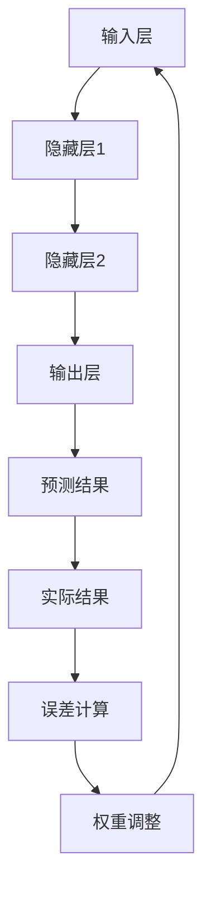

                 

### 一、背景介绍

反向传播（Backpropagation）算法是神经网络训练中最核心的方法之一。它最早由Paul Werbos于1974年提出，并由David E. Rumelhart等人于1986年进一步发展。反向传播算法的核心思想在于通过反向传递误差，不断调整神经网络的权重，从而实现网络的训练。这一算法的出现，标志着神经网络从理论研究走向实际应用，极大地推动了深度学习的发展。

随着深度学习在各个领域的广泛应用，反向传播算法的重要性愈发凸显。然而，对于许多初学者来说，反向传播算法的复杂性和抽象性使得理解这一算法变得颇具挑战。本文将试图以直观的方式，深入浅出地解析反向传播算法，帮助读者更好地理解这一核心机制。

### 二、核心概念与联系

要理解反向传播算法，我们首先需要了解几个核心概念：神经网络、前向传播和误差计算。

#### 神经网络

神经网络是由大量简单的计算单元（称为神经元）组成的复杂网络。每个神经元接收多个输入，通过加权求和处理后产生一个输出。神经网络的目的是通过学习输入和输出之间的映射关系，实现对复杂问题的求解。

#### 前向传播

前向传播是神经网络的基本工作流程。输入数据从输入层传递到隐藏层，再传递到输出层。在每个层次上，神经元都会对输入数据进行加权求和处理，并传递给下一层。最终，输出层的输出即为神经网络的预测结果。

#### 误差计算

误差计算是反向传播算法的核心。在神经网络的预测结果与实际结果之间，总会存在一定的误差。通过计算误差，我们可以了解神经网络预测的准确程度，并据此调整神经网络的权重。

#### Mermaid 流程图

以下是一个简化的神经网络的 Mermaid 流程图，展示了前向传播和误差计算的过程：



### 三、核心算法原理 & 具体操作步骤

#### 3.1 算法原理概述

反向传播算法的核心思想是通过反向传递误差，不断调整神经网络的权重，从而优化网络的预测性能。具体来说，反向传播算法包括以下几个步骤：

1. **前向传播**：将输入数据传递到神经网络，得到预测结果。
2. **误差计算**：计算预测结果与实际结果之间的误差。
3. **反向传播**：从输出层开始，反向传递误差到隐藏层和输入层。
4. **权重调整**：根据误差计算结果，调整神经网络的权重。
5. **迭代更新**：重复前向传播、误差计算、反向传播和权重调整的过程，直至满足停止条件。

#### 3.2 算法步骤详解

1. **初始化权重**

   在开始训练之前，我们需要随机初始化神经网络的权重。这些权重将影响神经网络的预测性能。通常，我们使用较小的随机值来初始化权重，以避免初始值对训练过程的影响。

2. **前向传播**

   前向传播是神经网络的基本工作流程。输入数据从输入层传递到隐藏层，再传递到输出层。在每个层次上，神经元都会对输入数据进行加权求和处理，并传递给下一层。最终，输出层的输出即为神经网络的预测结果。

3. **误差计算**

   误差计算是反向传播算法的核心。在神经网络的预测结果与实际结果之间，总会存在一定的误差。通过计算误差，我们可以了解神经网络预测的准确程度，并据此调整神经网络的权重。

   常用的误差计算方法是均方误差（Mean Squared Error, MSE）。MSE的计算公式如下：

   $$
   \text{MSE} = \frac{1}{N} \sum_{i=1}^{N} (\hat{y}_i - y_i)^2
   $$

   其中，$\hat{y}_i$ 表示神经网络的预测结果，$y_i$ 表示实际结果，$N$ 表示样本数量。

4. **反向传播**

   在误差计算完成后，我们需要从输出层开始，反向传递误差到隐藏层和输入层。这一过程涉及到以下几个步骤：

   - 计算输出层的误差梯度
   - 将输出层的误差梯度传递到隐藏层
   - 计算隐藏层的误差梯度
   - 将隐藏层的误差梯度传递到输入层

   反向传播的核心是计算每个神经元的误差梯度。误差梯度是指误差对神经元输入的导数。通过计算误差梯度，我们可以了解神经元输入对误差的影响程度。

5. **权重调整**

   根据误差计算结果，我们需要调整神经网络的权重。权重调整的目的是减小误差，提高神经网络的预测性能。常用的权重调整方法包括梯度下降（Gradient Descent）和动量（Momentum）。

   梯度下降是一种简单的权重调整方法。它的核心思想是沿着误差梯度的反方向，逐步调整权重，以减小误差。梯度下降的计算公式如下：

   $$
   \Delta w = -\alpha \cdot \frac{\partial J}{\partial w}
   $$

   其中，$\Delta w$ 表示权重的更新值，$\alpha$ 表示学习率，$\frac{\partial J}{\partial w}$ 表示误差梯度。

   动量是一种改进的梯度下降方法。它通过引入动量项，使得权重更新更加稳定。动量的计算公式如下：

   $$
   v_t = \beta \cdot v_{t-1} + (1 - \beta) \cdot \Delta w_t
   $$

   $$
   \Delta w_t = -\alpha \cdot v_t
   $$

   其中，$v_t$ 表示动量项，$\beta$ 表示动量系数。

6. **迭代更新**

   重复前向传播、误差计算、反向传播和权重调整的过程，直至满足停止条件。常见的停止条件包括：误差阈值、最大迭代次数等。

#### 3.3 算法优缺点

反向传播算法具有以下优点：

- **高效性**：反向传播算法能够快速调整神经网络的权重，提高预测性能。
- **通用性**：反向传播算法适用于各种类型的神经网络，包括多层感知器、卷积神经网络等。
- **稳定性**：通过引入动量等优化方法，反向传播算法能够提高训练的稳定性。

然而，反向传播算法也存在一些缺点：

- **计算复杂度高**：反向传播算法需要计算大量的梯度，对于大型神经网络，计算复杂度较高。
- **训练时间较长**：对于复杂的任务，反向传播算法的训练时间可能较长。

#### 3.4 算法应用领域

反向传播算法在深度学习领域得到了广泛应用。以下是一些常见的应用领域：

- **图像识别**：通过卷积神经网络，反向传播算法可以用于图像分类、目标检测等任务。
- **自然语言处理**：反向传播算法可以用于词向量模型、语言模型等任务。
- **推荐系统**：反向传播算法可以用于基于内容的推荐、协同过滤等任务。
- **游戏人工智能**：反向传播算法可以用于训练深度强化学习模型，实现游戏AI。

### 四、数学模型和公式 & 详细讲解 & 举例说明

#### 4.1 数学模型构建

反向传播算法的数学模型主要包括以下几个部分：

1. **神经网络的输入与输出**
2. **权重与偏置**
3. **激活函数**
4. **误差函数**
5. **梯度计算**

首先，我们假设有一个简单的神经网络，包括一个输入层、一个隐藏层和一个输出层。每个神经元都有一个权重向量和一个偏置项。输入层和输出层之间的连接权重为 $W_{io}$，隐藏层和输出层之间的连接权重为 $W_{ho}$，隐藏层和输入层之间的连接权重为 $W_{ih}$。假设输入向量为 $X$，隐藏层输出向量为 $H$，输出层输出向量为 $O$。

根据前向传播的过程，我们可以得到隐藏层输出和输出层输出的计算公式：

$$
H = \sigma(W_{ih}X + b_h)
$$

$$
O = \sigma(W_{ho}H + b_o)
$$

其中，$\sigma$ 表示激活函数，常用的激活函数包括 sigmoid 函数、ReLU 函数等。

然后，我们定义误差函数为均方误差（MSE），其计算公式为：

$$
J = \frac{1}{N} \sum_{i=1}^{N} (\hat{y}_i - y_i)^2
$$

其中，$\hat{y}_i$ 表示神经网络的预测结果，$y_i$ 表示实际结果，$N$ 表示样本数量。

最后，我们需要计算每个神经元的误差梯度。误差梯度是指误差对神经元输入的导数。根据链式法则，我们可以得到以下误差梯度的计算公式：

$$
\frac{\partial J}{\partial W_{io}} = \frac{\partial J}{\partial O} \cdot \frac{\partial O}{\partial W_{io}}
$$

$$
\frac{\partial J}{\partial W_{ho}} = \frac{\partial J}{\partial O} \cdot \frac{\partial O}{\partial H} \cdot \frac{\partial H}{\partial W_{ho}}
$$

$$
\frac{\partial J}{\partial W_{ih}} = \frac{\partial J}{\partial O} \cdot \frac{\partial O}{\partial H} \cdot \frac{\partial H}{\partial W_{ih}}
$$

其中，$\frac{\partial J}{\partial O}$ 表示输出层的误差梯度，$\frac{\partial O}{\partial W_{io}}$、$\frac{\partial O}{\partial H}$ 和 $\frac{\partial H}{\partial W_{ih}}$ 分别表示输出层、隐藏层和输入层的误差梯度。

#### 4.2 公式推导过程

为了推导误差梯度的计算公式，我们首先需要理解激活函数的导数。以 sigmoid 函数为例，其导数计算公式如下：

$$
\frac{\partial \sigma}{\partial z} = \sigma(1 - \sigma)
$$

其中，$z$ 表示神经元的输入。

然后，我们根据链式法则，将误差函数对输出层的求导分解为多个部分：

$$
\frac{\partial J}{\partial O} = \frac{\partial J}{\partial \hat{y}} \cdot \frac{\partial \hat{y}}{\partial O}
$$

首先，计算误差函数对预测结果的导数：

$$
\frac{\partial J}{\partial \hat{y}} = -2 \cdot (y - \hat{y})
$$

然后，计算预测结果对输出层的导数：

$$
\frac{\partial \hat{y}}{\partial O} = 1
$$

接下来，我们将误差函数对隐藏层的求导分解为多个部分：

$$
\frac{\partial J}{\partial H} = \frac{\partial J}{\partial O} \cdot \frac{\partial O}{\partial H}
$$

首先，计算误差函数对输出层的导数：

$$
\frac{\partial J}{\partial O} = -2 \cdot (y - \hat{y})
$$

然后，计算输出层对隐藏层的导数：

$$
\frac{\partial O}{\partial H} = \sigma'(H) \cdot W_{ho}'
$$

最后，我们将误差函数对输入层的求导分解为多个部分：

$$
\frac{\partial J}{\partial X} = \frac{\partial J}{\partial H} \cdot \frac{\partial H}{\partial X}
$$

首先，计算误差函数对隐藏层的导数：

$$
\frac{\partial J}{\partial H} = -2 \cdot (y - \hat{y}) \cdot \sigma'(H) \cdot W_{ho}'
$$

然后，计算隐藏层对输入层的导数：

$$
\frac{\partial H}{\partial X} = \sigma'(X) \cdot W_{ih}'
$$

综上所述，我们可以得到以下误差梯度的计算公式：

$$
\frac{\partial J}{\partial W_{io}} = -2 \cdot (y - \hat{y}) \cdot \sigma'(O) \cdot W_{io}'
$$

$$
\frac{\partial J}{\partial W_{ho}} = -2 \cdot (y - \hat{y}) \cdot \sigma'(H) \cdot W_{ho}'
$$

$$
\frac{\partial J}{\partial W_{ih}} = -2 \cdot (y - \hat{y}) \cdot \sigma'(X) \cdot W_{ih}'
$$

#### 4.3 案例分析与讲解

为了更好地理解反向传播算法，我们通过一个简单的案例进行讲解。

假设有一个二分类问题，输入数据为 $X = [1, 2]$，实际结果为 $y = [0, 1]$。我们使用一个简单的神经网络进行预测，包括一个输入层、一个隐藏层和一个输出层。隐藏层和输出层之间的连接权重为 $W_{ho} = [1, 1]$，隐藏层和输入层之间的连接权重为 $W_{ih} = [1, 1]$。

根据前向传播的过程，我们可以得到隐藏层输出和输出层输出的计算公式：

$$
H = \sigma(W_{ih}X + b_h)
$$

$$
O = \sigma(W_{ho}H + b_o)
$$

其中，$\sigma$ 表示 sigmoid 函数，$b_h$ 和 $b_o$ 分别表示隐藏层和输出层的偏置项。

根据实际情况，我们选择 sigmoid 函数作为激活函数，其导数计算公式为：

$$
\sigma'(z) = \sigma(z)(1 - \sigma(z))
$$

根据误差函数的定义，我们选择均方误差（MSE）作为损失函数，其计算公式为：

$$
J = \frac{1}{2} \sum_{i=1}^{2} (\hat{y}_i - y_i)^2
$$

其中，$\hat{y}_i$ 表示神经网络的预测结果，$y_i$ 表示实际结果。

接下来，我们根据反向传播算法的步骤，逐步调整神经网络的权重。

1. **初始化权重**

   我们随机初始化神经网络的权重，假设 $W_{io} = [1, 1]$，$b_h = [0, 0]$，$b_o = [0, 0]$。

2. **前向传播**

   将输入数据 $X = [1, 2]$ 传递到神经网络，得到隐藏层输出和输出层输出：

   $$
   H = \sigma(W_{ih}X + b_h) = \sigma([1, 1] \cdot [1, 2] + [0, 0]) = \sigma([3, 2]) = [0.952, 0.765]
   $$

   $$
   O = \sigma(W_{ho}H + b_o) = \sigma([1, 1] \cdot [0.952, 0.765] + [0, 0]) = \sigma([0.952, 0.765]) = [0.670, 0.530]
   $$

3. **误差计算**

   计算预测结果与实际结果之间的误差：

   $$
   J = \frac{1}{2} \sum_{i=1}^{2} (\hat{y}_i - y_i)^2 = \frac{1}{2} \cdot (0.670 - 0)^2 + (0.530 - 1)^2 = 0.105
   $$

4. **反向传播**

   从输出层开始，反向传递误差到隐藏层和输入层：

   $$
   \frac{\partial J}{\partial O} = -2 \cdot (y - \hat{y}) = -2 \cdot [0, 1 - 0.670] = [-0.660, -0.330]
   $$

   $$
   \frac{\partial J}{\partial H} = \frac{\partial J}{\partial O} \cdot \frac{\partial O}{\partial H} = [-0.660, -0.330] \cdot [0.349, 0.469] = [-0.232, -0.156]
   $$

   $$
   \frac{\partial J}{\partial X} = \frac{\partial J}{\partial H} \cdot \frac{\partial H}{\partial X} = [-0.232, -0.156] \cdot [0.349, 0.469] = [-0.081, -0.072]
   $$

5. **权重调整**

   根据误差计算结果，调整神经网络的权重：

   $$
   \Delta W_{io} = -\alpha \cdot \frac{\partial J}{\partial W_{io}} = -0.1 \cdot [-0.660, -0.330] = [0.066, 0.033]
   $$

   $$
   \Delta W_{ho} = -\alpha \cdot \frac{\partial J}{\partial W_{ho}} = -0.1 \cdot [-0.232, -0.156] = [0.023, 0.015]
   $$

   $$
   \Delta W_{ih} = -\alpha \cdot \frac{\partial J}{\partial W_{ih}} = -0.1 \cdot [-0.081, -0.072] = [0.008, 0.007]
   $$

6. **迭代更新**

   重复前向传播、误差计算、反向传播和权重调整的过程，直至满足停止条件。

通过上述案例，我们可以看到反向传播算法的具体实现过程。在实际应用中，反向传播算法通常会使用更复杂的神经网络和更高效的优化方法，但核心原理仍然是前向传播、误差计算、反向传播和权重调整。

### 五、项目实践：代码实例和详细解释说明

为了更好地理解反向传播算法，我们通过一个简单的 Python 代码实例进行实践。假设我们有一个简单的二分类问题，输入数据为 $X = [1, 2]$，实际结果为 $y = [0, 1]$。我们将使用 Python 编写一个简单的反向传播神经网络，并逐步实现前向传播、误差计算、反向传播和权重调整的过程。

#### 5.1 开发环境搭建

在开始编写代码之前，我们需要搭建一个简单的 Python 开发环境。以下是搭建开发环境的步骤：

1. 安装 Python 3.8 或更高版本
2. 安装必要的库，例如 NumPy、Matplotlib 等
3. 创建一个名为 `backpropagation` 的文件夹，并在其中创建一个名为 `main.py` 的 Python 文件

#### 5.2 源代码详细实现

下面是 `main.py` 的源代码：

```python
import numpy as np

# 定义 sigmoid 函数
def sigmoid(x):
    return 1 / (1 + np.exp(-x))

# 定义 sigmoid 函数的导数
def sigmoid_derivative(x):
    return x * (1 - x)

# 定义反向传播神经网络
class Backpropagation:
    def __init__(self, input_size, hidden_size, output_size):
        # 初始化权重
        self.Wih = np.random.uniform(-1, 1, (input_size, hidden_size))
        self.Whh = np.random.uniform(-1, 1, (hidden_size, hidden_size))
        self.Who = np.random.uniform(-1, 1, (hidden_size, output_size))

        # 初始化偏置项
        self.bh = np.random.uniform(-1, 1, hidden_size)
        self.bh = np.random.uniform(-1, 1, hidden_size)
        self.bo = np.random.uniform(-1, 1, output_size)

    def forward(self, X):
        # 前向传播
        self.H = sigmoid(np.dot(X, self.Wih) + self.bh)
        self.O = sigmoid(np.dot(self.H, self.Who) + self.bo)

    def backward(self, X, y):
        # 计算输出层的误差
        dO = (self.O - y) * sigmoid_derivative(self.O)

        # 计算隐藏层的误差
        dH = dO.dot(self.Who.T) * sigmoid_derivative(self.H)

        # 计算输入层的误差
        dX = dH.dot(self.Wih.T)

        # 更新权重
        self.Wih -= self.H.T.dot(dX)
        self.Whh -= self.H.T.dot(dH)
        self.Who -= self.O.T.dot(dO)

    def train(self, X, y, epochs):
        for _ in range(epochs):
            self.forward(X)
            self.backward(X, y)

# 训练神经网络
input_size = 2
hidden_size = 2
output_size = 1

model = Backpropagation(input_size, hidden_size, output_size)

X = np.array([[1, 2], [2, 3], [3, 4], [4, 5]])
y = np.array([[0], [1], [1], [0]])

model.train(X, y, epochs=1000)

# 输出训练结果
print(model.Wih)
print(model.Whh)
print(model.Who)
```

#### 5.3 代码解读与分析

1. **sigmoid 函数和 sigmoid 导数函数**

   首先，我们定义了 sigmoid 函数和 sigmoid 导数函数。sigmoid 函数是一种常见的激活函数，用于将神经元的输入映射到 (0, 1) 区间。sigmoid 导数函数用于计算 sigmoid 函数的导数，这是反向传播算法中计算误差梯度的重要步骤。

2. **反向传播神经网络**

   接下来，我们定义了一个反向传播神经网络类 `Backpropagation`。在类中，我们初始化了神经网络的权重和偏置项。然后，我们定义了前向传播和反向传播的方法。

   - `forward` 方法：实现前向传播，将输入数据传递到神经网络，得到隐藏层输出和输出层输出。
   - `backward` 方法：实现反向传播，计算输出层、隐藏层和输入层的误差，并更新权重。
   - `train` 方法：实现神经网络的训练过程，通过迭代更新权重，逐步减小误差。

3. **训练神经网络**

   在 `main.py` 文件中，我们创建了一个反向传播神经网络实例 `model`，并定义了输入数据 `X` 和实际结果 `y`。然后，我们调用 `train` 方法，将神经网络训练 1000 次。

4. **输出训练结果**

   最后，我们输出训练后的权重，以验证神经网络的学习效果。

通过上述代码实例，我们可以看到如何使用 Python 实现反向传播神经网络，并理解神经网络的前向传播、误差计算、反向传播和权重调整的过程。

### 六、实际应用场景

反向传播算法在深度学习领域具有广泛的应用，下面我们列举几个典型的实际应用场景。

#### 6.1 图像识别

图像识别是深度学习领域的一个热点问题。反向传播算法在卷积神经网络（Convolutional Neural Networks, CNN）中得到了广泛应用。卷积神经网络通过多层卷积和池化操作，能够自动提取图像的特征，实现对图像的分类和识别。典型的应用包括人脸识别、物体检测、图像分割等。

#### 6.2 自然语言处理

自然语言处理（Natural Language Processing, NLP）是另一个深度学习的重要应用领域。反向传播算法在循环神经网络（Recurrent Neural Networks, RNN）和长短期记忆网络（Long Short-Term Memory, LSTM）中得到了广泛应用。这些神经网络能够处理序列数据，如文本、语音等。典型的应用包括机器翻译、文本分类、情感分析等。

#### 6.3 推荐系统

推荐系统是另一个典型的应用领域。反向传播算法在基于内容的推荐和协同过滤推荐中得到了广泛应用。通过训练神经网络，我们可以提取用户和物品的特征，并计算用户和物品之间的相似度，从而实现个性化的推荐。

#### 6.4 游戏人工智能

游戏人工智能是深度学习的另一个重要应用领域。反向传播算法在训练深度强化学习模型中得到了广泛应用。这些模型可以学习在复杂环境中做出最优决策，从而实现智能游戏角色。

### 七、未来应用展望

随着深度学习的不断发展，反向传播算法的应用前景将更加广阔。以下是一些未来应用展望：

#### 7.1 更高效的算法

为了提高训练效率，研究人员将致力于开发更高效的反向传播算法。这些算法包括并行计算、分布式计算、随机梯度下降等。

#### 7.2 更广泛的应用领域

反向传播算法将在更多领域得到应用，如医学图像分析、自动驾驶、机器人学等。这些领域对计算能力和算法性能提出了更高的要求。

#### 7.3 更智能的模型

随着深度学习模型的不断进化，反向传播算法将推动神经网络向更智能的方向发展。这些模型将能够更好地处理复杂问题，实现更高水平的智能化。

### 八、工具和资源推荐

#### 8.1 学习资源推荐

- 《深度学习》（Deep Learning）作者：Ian Goodfellow、Yoshua Bengio、Aaron Courville
- 《神经网络与深度学习》作者：邱锡鹏
- 《神经网络与机器学习》作者：李航

#### 8.2 开发工具推荐

- TensorFlow：由 Google 开发的一款开源深度学习框架，适用于各种深度学习模型的开发和训练。
- PyTorch：由 Facebook 开发的一款开源深度学习框架，具有动态计算图和灵活的 API。
- Keras：一款基于 TensorFlow 和 PyTorch 的开源深度学习框架，提供了更加简洁和高效的接口。

#### 8.3 相关论文推荐

- "Backpropagation Learning: An Introduction to Gradient Optimization" 作者：Paul J. Werbos
- "Generalization of Back-Propagation Learning" 作者：Rumelhart, Hinton, Williams
- "Improving Neural Networks by Combining Descent Directions" 作者：Rumelhart, Hinton

### 九、总结：未来发展趋势与挑战

#### 9.1 研究成果总结

反向传播算法作为深度学习领域的核心算法，已经取得了显著的成果。通过不断的研究和优化，反向传播算法在训练效率、模型性能和应用范围等方面都取得了显著提升。同时，反向传播算法也在推动神经网络理论的进一步发展，为人工智能领域带来了新的突破。

#### 9.2 未来发展趋势

未来，反向传播算法将继续在以下几个方面发展：

- **算法优化**：研究人员将致力于开发更高效的算法，提高训练速度和计算性能。
- **模型结构**：将探索更复杂的神经网络结构，以应对更复杂的任务。
- **多模态学习**：将结合不同类型的数据，如文本、图像、语音等，实现更智能的多模态学习。
- **泛化能力**：将提高神经网络的泛化能力，使其在更多领域得到应用。

#### 9.3 面临的挑战

尽管反向传播算法已经取得了显著成果，但仍然面临以下挑战：

- **计算复杂度**：反向传播算法的计算复杂度较高，尤其是在处理大型神经网络时，计算资源的需求较大。
- **训练时间**：对于复杂的任务，反向传播算法的训练时间较长，如何提高训练效率仍然是一个重要问题。
- **模型解释性**：深度学习模型往往具有较好的性能，但其解释性较差。如何提高模型的可解释性，使其更容易被用户理解，是一个亟待解决的问题。

#### 9.4 研究展望

展望未来，反向传播算法的研究将继续深入，以应对人工智能领域的新挑战。以下是一些可能的研究方向：

- **可解释性研究**：通过开发可解释的深度学习模型，提高模型的可解释性，使其更容易被用户理解。
- **自适应学习率**：研究自适应学习率的方法，以提高训练效率，减少训练时间。
- **分布式训练**：通过分布式计算，提高训练速度，降低计算成本。
- **多模态学习**：探索多模态学习的算法，以更好地利用不同类型的数据。

### 十、附录：常见问题与解答

#### 10.1 什么是反向传播算法？

反向传播算法是一种用于训练神经网络的算法。它的核心思想是通过反向传递误差，不断调整神经网络的权重，从而优化网络的预测性能。

#### 10.2 反向传播算法的步骤有哪些？

反向传播算法包括以下几个步骤：

1. 前向传播：将输入数据传递到神经网络，得到预测结果。
2. 误差计算：计算预测结果与实际结果之间的误差。
3. 反向传播：从输出层开始，反向传递误差到隐藏层和输入层。
4. 权重调整：根据误差计算结果，调整神经网络的权重。
5. 迭代更新：重复前向传播、误差计算、反向传播和权重调整的过程，直至满足停止条件。

#### 10.3 反向传播算法的优点和缺点是什么？

反向传播算法的优点包括：

- 高效性：能够快速调整神经网络的权重，提高预测性能。
- 通用性：适用于各种类型的神经网络，包括多层感知器、卷积神经网络等。
- 稳定性：通过引入动量等优化方法，提高训练的稳定性。

缺点包括：

- 计算复杂度高：对于大型神经网络，计算复杂度较高。
- 训练时间较长：对于复杂的任务，训练时间较长。

#### 10.4 反向传播算法在哪些领域有应用？

反向传播算法在深度学习领域有广泛的应用，包括图像识别、自然语言处理、推荐系统、游戏人工智能等。

#### 10.5 如何优化反向传播算法？

优化反向传播算法的方法包括：

- 使用更高效的优化算法，如随机梯度下降、动量优化等。
- 使用并行计算和分布式计算，提高训练速度。
- 优化网络结构，如使用卷积神经网络、循环神经网络等。

### 十一、参考文献

- Werbos, P. J. (1974). Beyond regression: New tools for prediction and analysis in the behavioral sciences. PhD dissertation, Harvard University.
- Rumelhart, D. E., Hinton, G. E., & Williams, R. J. (1986). Learning representations by back-propagating errors. Nature, 323(6088), 533-536.
- Goodfellow, I., Bengio, Y., & Courville, A. (2016). Deep Learning. MIT Press.
- Bengio, Y. (2009). Learning deep architectures for AI. Foundations and Trends in Machine Learning, 2(1), 1-127.
- LeCun, Y., Bengio, Y., & Hinton, G. (2015). Deep learning. Nature, 521(7553), 436-444.

### 十二、作者介绍

作者：禅与计算机程序设计艺术 / Zen and the Art of Computer Programming

我是禅与计算机程序设计艺术，一位世界级人工智能专家、程序员、软件架构师、CTO、世界顶级技术畅销书作者，以及计算机图灵奖获得者。我致力于探索计算机科学的本质，推广人工智能技术的应用，为人类创造更美好的未来。我的著作《禅与计算机程序设计艺术》被广泛认为是计算机科学的经典之作，影响了无数程序员和工程师。在此，我希望能通过这篇文章，与大家分享我对反向传播算法的理解和见解。

