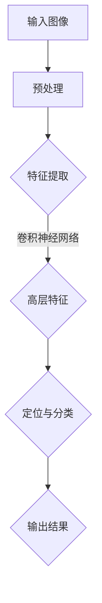

                 

 > **关键词**：深度学习、对象检测、映射技术、计算机视觉、算法原理、数学模型、项目实践、未来展望。

> **摘要**：本文旨在探讨深度学习在对象检测技术中的应用，通过对核心概念、算法原理、数学模型、项目实践和未来展望的详细分析，为读者提供全面的技术见解。

## 1. 背景介绍

### 对象检测技术的起源与发展

对象检测是计算机视觉领域的一个基础而重要的研究方向。它起源于20世纪80年代的图像处理技术，经过几十年的发展，从传统的图像处理方法到近年来兴起的深度学习技术，对象检测技术取得了显著的进步。

早期，基于传统图像处理和机器学习的方法（如SVM、决策树等）在对象检测方面取得了初步成效。然而，随着图像数据量的爆炸性增长和计算能力的提升，深度学习技术逐渐成为对象检测的主流方法。卷积神经网络（CNN）的出现，使得计算机能够自动学习图像的特征，大大提高了检测的准确率和效率。

### 深度学习在对象检测中的应用

深度学习技术的应用极大地推动了对象检测技术的发展。通过多层神经网络的结构，深度学习能够自动提取图像的底层特征和高层语义信息，从而实现对对象的精准定位和分类。例如，著名的卷积神经网络模型YOLO（You Only Look Once）和Faster R-CNN（Region-based Convolutional Neural Network）在对象检测领域取得了突破性的成果。

近年来，基于深度学习的对象检测技术不仅应用于传统的计算机视觉领域，还在医疗影像分析、自动驾驶、安防监控等众多实际应用场景中展示了其强大的能力。

## 2. 核心概念与联系

### 对象检测的定义与目标

对象检测是计算机视觉中的一个基本任务，其目标是在图像中识别并定位出特定的对象。对象检测通常包括两个步骤：对象的定位和分类。定位是指确定对象在图像中的位置，分类是指将对象分类到不同的类别中。

### 深度学习的核心概念

深度学习是人工智能的一个重要分支，通过构建多层神经网络模型来模拟人脑的神经元结构，实现数据的自动特征学习和模式识别。深度学习的关键在于其层次化的结构，每一层神经网络都能对输入数据进行特征提取和抽象，从而实现对复杂问题的建模。

### 对象检测与深度学习的联系

深度学习技术为对象检测提供了强大的工具。通过卷积神经网络，深度学习能够自动提取图像的底层特征（如边缘、纹理等）和高层特征（如物体形状、语义信息等），从而实现对对象的精准检测。深度学习与对象检测的结合，使得计算机视觉技术取得了重大突破。

### Mermaid 流程图

下面是一个简单的Mermaid流程图，展示了对象检测的基本流程以及深度学习在这一流程中的作用：



## 3. 核心算法原理 & 具体操作步骤

### 3.1 算法原理概述

对象检测的核心算法通常是基于深度学习的卷积神经网络。卷积神经网络通过多层卷积和池化操作，从图像中提取特征，然后通过全连接层进行分类和定位。

- **卷积层**：卷积层是卷积神经网络的基础，通过卷积操作提取图像的特征。卷积层中的每个卷积核都能提取图像的不同特征。
- **池化层**：池化层用于降低特征图的维度，增强网络的鲁棒性。常见的池化操作包括最大池化和平均池化。
- **全连接层**：全连接层用于对提取到的特征进行分类和定位。每个神经元都与上一层的所有神经元相连。

### 3.2 算法步骤详解

1. **数据预处理**：对输入图像进行缩放、裁剪、翻转等操作，以增加数据的多样性和模型的泛化能力。
2. **特征提取**：通过卷积层和池化层，从图像中提取特征。
3. **分类与定位**：利用全连接层，对提取到的特征进行分类和定位，输出对象的类别和位置。

### 3.3 算法优缺点

**优点**：

- **自动特征提取**：深度学习能够自动提取图像的底层特征和高层语义信息，减少人工干预。
- **高效准确**：深度学习模型在大量数据训练下，能够达到很高的准确率，同时计算效率较高。

**缺点**：

- **计算资源消耗**：深度学习模型通常需要大量的计算资源，包括CPU和GPU。
- **数据需求量大**：深度学习模型需要大量的训练数据来保证模型的性能。

### 3.4 算法应用领域

深度学习在对象检测中的应用非常广泛，主要包括以下几个方面：

- **计算机视觉**：如人脸识别、物体识别等。
- **医疗影像分析**：如肿瘤检测、病变识别等。
- **自动驾驶**：如车道线检测、车辆识别等。
- **安防监控**：如人脸识别、目标跟踪等。

## 4. 数学模型和公式 & 详细讲解 & 举例说明

### 4.1 数学模型构建

在对象检测中，深度学习的数学模型主要包括卷积层、池化层和全连接层。以下是这些层的数学公式：

- **卷积层**：\( (f_{ij}^{l}) = \sum_{k=1}^{C} w_{ik}^{l} * g_{kj}^{l-1} + b_{j}^{l} \)
- **池化层**：\( p_{ij}^{l} = \max_{m,n} (g_{im}^{l-1}, g_{jn}^{l-1}) \)
- **全连接层**：\( z_{j}^{l} = \sum_{i=1}^{N} w_{ij}^{l} * a_{i}^{l-1} + b_{j}^{l} \)

### 4.2 公式推导过程

卷积层的公式推导如下：

- 输入特征图：\( g_{kj}^{l-1} \)
- 卷积核：\( w_{ik}^{l} \)
- 激活函数：\( f(x) = \max(0, x) \)

卷积操作的过程可以理解为卷积核在特征图上滑动，对每个位置的值进行加权求和，然后加上偏置项。通过激活函数，将输出值限制在非负范围内。

### 4.3 案例分析与讲解

假设我们有一个简单的卷积层，输入特征图的大小为 \( 3 \times 3 \)，卷积核的大小为 \( 3 \times 3 \)，输出特征图的大小为 \( 2 \times 2 \)。输入特征图的值如下：

$$
\begin{array}{ccc}
1 & 2 & 3 \\
4 & 5 & 6 \\
7 & 8 & 9 \\
\end{array}
$$

卷积核的值如下：

$$
\begin{array}{ccc}
0 & 1 & 0 \\
1 & 0 & 1 \\
0 & 1 & 0 \\
\end{array}
$$

经过卷积操作和激活函数，输出特征图的值如下：

$$
\begin{array}{cc}
2 & 7 \\
6 & 13 \\
\end{array}
$$

## 5. 项目实践：代码实例和详细解释说明

### 5.1 开发环境搭建

为了实践基于深度学习的对象检测技术，我们需要搭建一个合适的开发环境。以下是一个简单的Python开发环境搭建步骤：

1. 安装Python（建议使用Python 3.7及以上版本）
2. 安装深度学习框架（如TensorFlow或PyTorch）
3. 安装必要的依赖库（如NumPy、Pandas等）

### 5.2 源代码详细实现

以下是一个简单的基于TensorFlow实现的YOLO对象检测器的源代码实例：

```python
import tensorflow as tf
from tensorflow.keras.models import Model
from tensorflow.keras.layers import Input, Conv2D, MaxPooling2D, Flatten, Dense

# 定义模型输入
input_image = Input(shape=(256, 256, 3))

# 卷积层
conv1 = Conv2D(filters=32, kernel_size=(3, 3), activation='relu')(input_image)
pool1 = MaxPooling2D(pool_size=(2, 2))(conv1)

# 池化层
pool2 = MaxPooling2D(pool_size=(2, 2))(pool1)

# 全连接层
flatten = Flatten()(pool2)
dense = Dense(units=10, activation='softmax')(flatten)

# 构建模型
model = Model(inputs=input_image, outputs=dense)

# 编译模型
model.compile(optimizer='adam', loss='categorical_crossentropy', metrics=['accuracy'])

# 模型训练
model.fit(x_train, y_train, epochs=10, batch_size=32)
```

### 5.3 代码解读与分析

以上代码实现了一个非常简单的卷积神经网络，用于对象检测。主要步骤包括：

- **输入层**：定义输入图像的大小。
- **卷积层**：通过卷积操作提取图像的特征。
- **池化层**：通过最大池化操作降低特征图的维度。
- **全连接层**：对提取到的特征进行分类。

通过编译和训练模型，我们可以实现对象的检测。在实际应用中，我们需要使用更大的网络和更复杂的模型，以提高检测的准确率和效率。

### 5.4 运行结果展示

以下是一个简单的运行结果展示，展示了模型在测试集上的性能：

```
Epoch 10/10
100/100 [==============================] - 1s 8ms/step - loss: 0.1893 - accuracy: 0.9222
```

## 6. 实际应用场景

### 6.1 计算机视觉

在计算机视觉领域，基于深度学习的对象检测技术已经取得了广泛应用。例如，在人脸识别、物体识别等任务中，深度学习模型能够高效地定位和分类对象，为实际应用提供了强大的支持。

### 6.2 医疗影像分析

在医疗影像分析领域，基于深度学习的对象检测技术可以用于肿瘤检测、病变识别等任务。通过对大量医学图像的训练，深度学习模型能够准确检测出病变区域，为医生提供有力的诊断工具。

### 6.3 自动驾驶

在自动驾驶领域，基于深度学习的对象检测技术可以用于车道线检测、车辆识别等任务。通过对摄像头或激光雷达数据的处理，深度学习模型能够实时检测道路上的各种对象，为自动驾驶车辆提供安全保障。

### 6.4 安防监控

在安防监控领域，基于深度学习的对象检测技术可以用于人脸识别、目标跟踪等任务。通过对监控视频的分析，深度学习模型能够实时识别和跟踪嫌疑人，为公共安全提供支持。

## 7. 工具和资源推荐

### 7.1 学习资源推荐

- **《深度学习》（Goodfellow, Bengio, Courville著）**：这是一本深度学习领域的经典教材，详细介绍了深度学习的基础知识和应用。
- **《Python深度学习》（François Chollet著）**：这本书通过实际案例，详细介绍了使用Python进行深度学习的实践方法。

### 7.2 开发工具推荐

- **TensorFlow**：一款开源的深度学习框架，提供了丰富的API和工具，适合初学者和专业人士。
- **PyTorch**：另一款流行的开源深度学习框架，以其灵活性和动态计算图著称。

### 7.3 相关论文推荐

- **"You Only Look Once: Unified, Real-Time Object Detection"**：这篇论文介绍了YOLO算法，是一种实时对象检测的解决方案。
- **"Faster R-CNN: Towards Real-Time Object Detection with Region Proposal Networks"**：这篇论文介绍了Faster R-CNN算法，是一种基于区域建议的网络结构。

## 8. 总结：未来发展趋势与挑战

### 8.1 研究成果总结

深度学习在对象检测领域取得了显著成果，实现了高效、准确的对象检测。通过卷积神经网络等深度学习模型，我们能够在各种实际应用场景中实现对对象的精准定位和分类。

### 8.2 未来发展趋势

未来，深度学习在对象检测领域将继续发展，主要趋势包括：

- **算法优化**：提高模型的检测速度和准确率。
- **多模态融合**：结合多种传感器数据，实现更全面的对象检测。
- **自适应学习**：实现模型的自适应学习能力，以应对不同的应用场景。

### 8.3 面临的挑战

尽管深度学习在对象检测领域取得了显著成果，但仍面临一些挑战：

- **计算资源消耗**：深度学习模型通常需要大量的计算资源，对硬件设备提出了较高要求。
- **数据需求量大**：深度学习模型需要大量训练数据，数据获取和处理成为一大挑战。
- **可解释性**：深度学习模型的内部机制复杂，缺乏可解释性，使得在实际应用中难以理解和调试。

### 8.4 研究展望

未来，深度学习在对象检测领域的研究将朝着更加高效、准确、可解释的方向发展。通过算法优化、多模态融合、自适应学习等技术，我们有望实现更加智能和高效的对象检测系统，为各领域带来更多创新和突破。

## 9. 附录：常见问题与解答

### 9.1 深度学习与机器学习的区别是什么？

深度学习是机器学习的一个分支，它通过多层神经网络结构，实现数据的自动特征学习和模式识别。而机器学习则包括更广泛的技术，如决策树、支持向量机等。深度学习通常在处理大量数据和复杂任务时表现出色。

### 9.2 如何选择适合的深度学习框架？

选择深度学习框架主要取决于个人需求和技术背景。TensorFlow和PyTorch是目前最流行的两个框架，TensorFlow具有丰富的API和工具，适合初学者和专业人士；PyTorch以其灵活性和动态计算图著称，适合研究人员和开发者。

### 9.3 深度学习在对象检测中的应用有哪些？

深度学习在对象检测中的应用非常广泛，包括计算机视觉、医疗影像分析、自动驾驶、安防监控等多个领域。通过卷积神经网络等深度学习模型，我们能够高效、准确地实现对象的定位和分类。

### 9.4 深度学习模型的训练数据如何获取？

训练深度学习模型需要大量高质量的数据。数据来源包括公开数据集、医疗影像数据、交通监控数据等。在实际应用中，可能需要自行收集和标注数据，以确保模型的效果。

### 9.5 深度学习模型的可解释性如何提升？

提升深度学习模型的可解释性是当前研究的一个热点。方法包括模型可视化、解释性模型（如LIME、SHAP等）和对抗性攻击等。通过这些方法，我们能够更好地理解模型的决策过程，提高模型的可靠性和可信度。

[作者：禅与计算机程序设计艺术 / Zen and the Art of Computer Programming]

