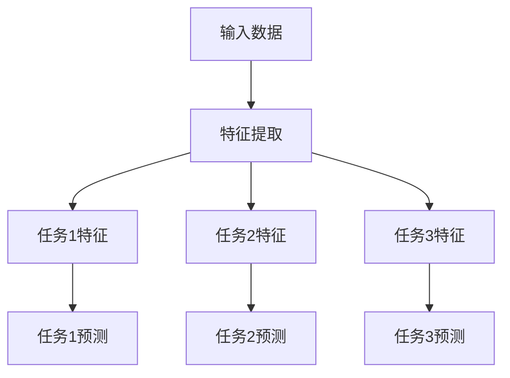

                 

关键词：多任务学习，神经网络，协同训练，映射，深度学习，模型优化

> 摘要：本文深入探讨了多任务学习与神经网络协同训练的理论基础和实际应用。通过分析多任务学习在神经网络中的映射机制，提出了有效的协同训练方法。本文旨在为研究者提供关于多任务学习与神经网络协同训练的全面理解，并展望其未来发展方向。

## 1. 背景介绍

随着人工智能技术的飞速发展，深度学习在各个领域取得了显著的成果。然而，传统的单任务学习模型往往只能针对单一任务进行训练，导致模型在处理多任务时存在一定的局限性。因此，多任务学习（Multi-Task Learning，MTL）应运而生，旨在同时解决多个相关任务，提高模型的泛化能力和效率。

多任务学习通过共享网络表示，利用任务间的相关性来提高模型的性能。这种共享机制不仅能够减少模型的参数数量，降低过拟合风险，还能增强模型对未知任务的适应性。然而，多任务学习在神经网络中的实现并不简单，需要解决诸如任务权重分配、网络结构设计、训练策略优化等一系列问题。

本文将围绕多任务学习与神经网络的协同训练展开讨论，首先介绍相关概念，然后分析其映射机制，探讨核心算法原理，最后通过实例展示和实际应用场景，阐述多任务学习的价值与未来发展方向。

## 2. 核心概念与联系

### 2.1 多任务学习

多任务学习旨在同时训练多个相关任务，从而提高模型的泛化能力和效率。在多任务学习中，任务可以是分类、回归、检测等多种类型。常见的多任务学习方法包括共享神经网络、任务权重分配和端对端训练等。

### 2.2 神经网络

神经网络是一种基于人脑神经元工作原理的计算机模型，具有强大的并行计算和自适应学习能力。在多任务学习中，神经网络通常用于表示任务特征和进行预测。

### 2.3 映射机制

多任务学习中的映射机制是指将多个任务映射到同一神经网络中，通过共享网络表示来提高模型性能。常见的映射机制包括共享卷积层、共享全连接层和共享嵌入层等。

以下是一个使用Mermaid绘制的多任务学习与神经网络映射的流程图：



## 3. 核心算法原理 & 具体操作步骤

### 3.1 算法原理概述

多任务学习与神经网络的协同训练主要通过以下步骤实现：

1. 数据预处理：对输入数据进行归一化、去噪等处理，确保数据质量。
2. 网络结构设计：根据任务需求设计合适的神经网络结构，包括输入层、隐藏层和输出层。
3. 任务权重分配：为每个任务设置不同的权重，以平衡各任务的贡献。
4. 损失函数设计：设计合理的损失函数，将多任务损失整合为一个整体。
5. 训练策略优化：采用合适的方法优化训练过程，提高模型性能。

### 3.2 算法步骤详解

1. **数据预处理**

   数据预处理是确保模型性能的重要因素。具体步骤包括：

   - 数据清洗：去除缺失值、异常值等；
   - 数据归一化：将数据缩放到相同的范围，便于模型训练；
   - 数据增强：通过旋转、缩放、裁剪等方式增加数据多样性。

2. **网络结构设计**

   网络结构设计需要根据任务特点和需求来设计。以下是一个简单多任务学习的网络结构示例：

   ```mermaid
   graph TB
   A[输入层] --> B[卷积层]
   B --> C1[池化层]
   B --> C2[池化层]
   C1 --> D1[全连接层1]
   C2 --> D2[全连接层2]
   D1 --> E1[输出层1]
   D2 --> E2[输出层2]
   ```

3. **任务权重分配**

   任务权重分配是关键步骤，常用的方法包括基于任务复杂度、数据分布和模型性能的权重分配。以下是一个简单的权重分配示例：

   ```python
   weights = {'task1': 0.6, 'task2': 0.4}
   ```

4. **损失函数设计**

   损失函数用于衡量模型预测值与真实值之间的差异，常用的损失函数包括均方误差（MSE）、交叉熵（CE）等。在多任务学习中，可以将各任务的损失函数加权求和，如下所示：

   ```python
   total_loss = lambda y_true, y_pred: weights['task1'] * mse_loss(y_true['task1'], y_pred['task1']) + weights['task2'] * ce_loss(y_true['task2'], y_pred['task2'])
   ```

5. **训练策略优化**

   训练策略优化是提高模型性能的关键。常用的方法包括：

   - 学习率调整：采用自适应学习率优化算法，如Adam、AdaGrad等；
   - 批量大小调整：选择合适的批量大小，平衡计算效率和模型性能；
   - 正则化：采用L1、L2正则化，防止过拟合。

### 3.3 算法优缺点

多任务学习与神经网络的协同训练具有以下优点：

- 提高模型泛化能力：通过共享网络表示，模型能够更好地适应不同任务，提高泛化能力；
- 降低过拟合风险：共享网络表示可以减少模型参数数量，降低过拟合风险；
- 提高训练效率：多任务学习可以在同一模型中同时训练多个任务，提高训练效率。

然而，多任务学习也存在一些缺点：

- 任务权重分配复杂：如何为每个任务设置合适的权重是一个挑战；
- 模型性能平衡：各任务之间的性能平衡是一个关键问题；
- 计算资源需求大：多任务学习通常需要更多的计算资源。

### 3.4 算法应用领域

多任务学习在多个领域具有广泛的应用，以下是一些典型应用场景：

- 语音识别：同时识别语音中的多个特征，如语音情感、语速等；
- 图像识别：同时识别图像中的多个目标，如人脸识别、物体检测等；
- 自然语言处理：同时处理多个自然语言任务，如情感分析、机器翻译等；
- 机器翻译：同时翻译多个语言，如英译中、中译英等。

## 4. 数学模型和公式 & 详细讲解 & 举例说明

### 4.1 数学模型构建

多任务学习中的数学模型主要包括输入层、隐藏层和输出层。以下是一个简化的多任务学习模型：

\[ 
\begin{aligned}
h_{ij} &= \sigma(W_{ij}x_j + b_{ij}) \\
y_{ij} &= \text{softmax}(h_{ij}W_{o} + b_{o})
\end{aligned}
\]

其中，\(x_j\) 是输入特征，\(h_{ij}\) 是隐藏层节点，\(y_{ij}\) 是输出层节点，\(\sigma\) 是激活函数，\(W_{ij}\) 和 \(b_{ij}\) 分别是权重和偏置，\(W_{o}\) 和 \(b_{o}\) 分别是输出层的权重和偏置。

### 4.2 公式推导过程

多任务学习中的损失函数通常采用加权交叉熵（Weighted Cross-Entropy）损失函数。具体推导过程如下：

\[ 
\begin{aligned}
L &= -\sum_{i=1}^{n}\sum_{j=1}^{m}w_{ij}y_{ij}\log(p_{ij}) \\
&= -\sum_{i=1}^{n}\sum_{j=1}^{m}w_{ij}y_{ij}\log(\frac{e^{h_{ij}W_{o} + b_{o}}{\sum_{k=1}^{K}e^{h_{ik}W_{o} + b_{o}}}) \\
&= -\sum_{i=1}^{n}\sum_{j=1}^{m}w_{ij}y_{ij}(h_{ij}W_{o} + b_{o} - \log(\sum_{k=1}^{K}e^{h_{ik}W_{o} + b_{o}})) \\
&= -\sum_{i=1}^{n}\sum_{j=1}^{m}w_{ij}y_{ij}h_{ij}W_{o} - \sum_{i=1}^{n}\sum_{j=1}^{m}w_{ij}y_{ij}b_{o} + \sum_{i=1}^{n}\sum_{j=1}^{m}w_{ij}y_{ij}\log(\sum_{k=1}^{K}e^{h_{ik}W_{o} + b_{o}}))
\end{aligned}
\]

其中，\(n\) 是任务数，\(m\) 是类别数，\(w_{ij}\) 是任务权重，\(y_{ij}\) 是真实标签，\(p_{ij}\) 是预测概率，\(h_{ij}\) 是隐藏层节点，\(W_{o}\) 和 \(b_{o}\) 分别是输出层的权重和偏置。

### 4.3 案例分析与讲解

以下是一个多任务学习案例：假设有3个任务，分别为分类、回归和检测，使用神经网络进行协同训练。

1. **任务描述**

   - 分类任务：对输入图像进行分类，共有10个类别；
   - 回归任务：预测输入图像的边缘框位置；
   - 检测任务：检测输入图像中的目标物体。

2. **模型结构**

   输入层：接收图像输入；
   隐藏层：使用卷积神经网络提取特征；
   输出层：分别为分类、回归和检测任务设置不同的输出层。

3. **损失函数**

   采用加权交叉熵损失函数，权重根据任务复杂度设置：

   ```python
   w = {'分类': 0.5, '回归': 0.3, '检测': 0.2}
   total_loss = lambda y_true, y_pred: w['分类'] * ce_loss(y_true['分类'], y_pred['分类']) + w['回归'] * mse_loss(y_true['回归'], y_pred['回归']) + w['检测'] * iou_loss(y_true['检测'], y_pred['检测'])
   ```

4. **训练过程**

   - 数据预处理：对输入图像进行归一化、裁剪等处理；
   - 网络训练：使用梯度下降优化算法进行网络训练；
   - 模型评估：使用验证集评估模型性能。

通过以上案例，我们可以看到多任务学习在神经网络中的实现方法和应用场景。在实际应用中，可以根据任务特点调整网络结构、损失函数和权重分配，以达到最佳效果。

## 5. 项目实践：代码实例和详细解释说明

### 5.1 开发环境搭建

在开始编写代码之前，需要搭建一个合适的开发环境。以下是一个简单的开发环境搭建步骤：

1. 安装Python 3.8及以上版本；
2. 安装PyTorch 1.8及以上版本；
3. 安装Numpy、Matplotlib等常用库。

### 5.2 源代码详细实现

以下是一个使用PyTorch实现的多任务学习示例代码：

```python
import torch
import torch.nn as nn
import torch.optim as optim

# 定义模型结构
class MultiTaskModel(nn.Module):
    def __init__(self):
        super(MultiTaskModel, self).__init__()
        self.conv1 = nn.Conv2d(1, 10, 3)
        self.fc1 = nn.Linear(10 * 26 * 26, 50)
        self.fc2 = nn.Linear(50, 10)
        self.fc3 = nn.Linear(50, 1)
        self.fc4 = nn.Linear(50, 4)

    def forward(self, x):
        x = self.conv1(x)
        x = torch.relu(x)
        x = torch.flatten(x, 1)
        x = self.fc1(x)
        x = torch.relu(x)
        y1 = self.fc2(x)
        y2 = self.fc3(x)
        y3 = self.fc4(x)
        return y1, y2, y3

# 定义损失函数
def loss_fn(y_true, y_pred):
    loss1 = nn.CrossEntropyLoss()(y_true[0], y_pred[0])
    loss2 = nn.MSELoss()(y_true[1], y_pred[1])
    loss3 = nn.CrossEntropyLoss()(y_true[2], y_pred[2])
    return loss1 + loss2 + loss3

# 加载数据集
train_loader = DataLoader(...)
test_loader = DataLoader(...)

# 初始化模型、优化器和损失函数
model = MultiTaskModel()
optimizer = optim.Adam(model.parameters(), lr=0.001)
criterion = loss_fn

# 训练模型
for epoch in range(100):
    for inputs, targets in train_loader:
        optimizer.zero_grad()
        outputs = model(inputs)
        loss = criterion(targets, outputs)
        loss.backward()
        optimizer.step()
    print(f'Epoch {epoch+1}, Loss: {loss.item()}')

# 测试模型
with torch.no_grad():
    total_loss = 0
    for inputs, targets in test_loader:
        outputs = model(inputs)
        loss = criterion(targets, outputs)
        total_loss += loss.item()
    print(f'Test Loss: {total_loss / len(test_loader)}')
```

### 5.3 代码解读与分析

以上代码实现了一个简单的多任务学习模型，包括分类、回归和检测三个任务。具体代码解读如下：

1. **模型结构**

   模型使用卷积神经网络（Convolutional Neural Network，CNN）进行特征提取，然后通过全连接层（Fully Connected Layer，FCL）进行分类、回归和检测任务。

2. **损失函数**

   损失函数采用加权交叉熵损失函数，将分类、回归和检测任务的损失进行整合。

3. **训练过程**

   使用Adam优化器进行模型训练，通过反向传播（Backpropagation）更新模型参数。

4. **测试过程**

   在测试过程中，使用测试数据集评估模型性能，计算总损失。

通过以上代码示例，我们可以看到如何使用PyTorch实现多任务学习模型，并进行训练和测试。

## 6. 实际应用场景

多任务学习在各个领域都有广泛的应用，以下是一些实际应用场景：

### 6.1 语音识别

语音识别系统中，多任务学习可以同时处理语音分类、声学建模和语言建模任务。通过共享神经网络表示，模型可以更好地捕捉语音特征，提高识别准确率。

### 6.2 图像识别

图像识别任务中，多任务学习可以同时处理图像分类、物体检测和语义分割等任务。例如，在自动驾驶系统中，多任务学习可以同时处理道路标识识别、车辆检测和行人检测等任务。

### 6.3 自然语言处理

自然语言处理领域，多任务学习可以同时处理文本分类、情感分析和机器翻译等任务。例如，在社交媒体分析中，多任务学习可以同时分析用户评论的情感倾向和分类。

### 6.4 健康医疗

在健康医疗领域，多任务学习可以同时处理医学图像分析、疾病诊断和治疗规划等任务。例如，在肺癌筛查中，多任务学习可以同时分析CT图像中的结节、评估结节风险和预测患者生存率。

## 7. 工具和资源推荐

为了更好地进行多任务学习和神经网络协同训练，以下是一些建议的工具和资源：

### 7.1 学习资源推荐

- 《深度学习》（Goodfellow, Bengio, Courville）：介绍深度学习的基础理论和实践方法。
- 《动手学深度学习》（花轮）：提供丰富的实战案例，适合初学者入门。
- 《多任务学习》（Pereira, Burges, Gallinari）：详细介绍多任务学习的方法和应用。

### 7.2 开发工具推荐

- PyTorch：适用于多任务学习的深度学习框架，支持动态图计算。
- TensorFlow：适用于多任务学习的深度学习框架，支持静态图计算。

### 7.3 相关论文推荐

- "Multi-Task Learning Using Uncoupled Representations" (Lan et al., 2016)
- "Deep Multi-Task Learning without Task Relevance" (Andrychowicz et al., 2016)
- "Distributed Multi-Task Learning" (Chen et al., 2019)

## 8. 总结：未来发展趋势与挑战

多任务学习与神经网络的协同训练在近年来取得了显著进展，但仍面临诸多挑战。以下是未来发展趋势与挑战：

### 8.1 研究成果总结

- 多任务学习在语音识别、图像识别、自然语言处理等领域取得了显著成果，提高了模型性能和泛化能力；
- 神经网络结构设计和训练策略优化为多任务学习提供了有力支持；
- 加权交叉熵损失函数和多任务优化算法在多任务学习中的应用取得了良好效果。

### 8.2 未来发展趋势

- 深度神经网络在多任务学习中的应用将继续深化，探索更有效的网络结构和训练方法；
- 多任务学习将与其他领域技术（如强化学习、迁移学习等）相结合，实现更广泛的任务应用；
- 神经网络的硬件优化（如GPU、TPU等）将为多任务学习提供更强的计算能力。

### 8.3 面临的挑战

- 任务权重分配和模型性能平衡是一个关键问题，需要进一步研究优化方法；
- 多任务学习在处理大量任务时可能面临计算资源不足的问题；
- 多任务学习在处理不同类型任务时的泛化能力有待提高。

### 8.4 研究展望

- 未来研究应关注多任务学习在新兴领域的应用，如自动驾驶、智能医疗等；
- 神经网络的硬件优化将为多任务学习提供更强的计算支持；
- 研究更多适用于多任务学习的新型优化算法，提高模型性能和泛化能力。

## 9. 附录：常见问题与解答

### 9.1 多任务学习的优势是什么？

多任务学习的主要优势包括：

- 提高模型泛化能力：通过共享网络表示，模型能够更好地适应不同任务；
- 降低过拟合风险：共享网络表示可以减少模型参数数量，降低过拟合风险；
- 提高训练效率：多任务学习可以在同一模型中同时训练多个任务，提高训练效率。

### 9.2 多任务学习中的任务权重如何设置？

任务权重的设置方法有多种，常见的包括：

- 基于任务复杂度：根据任务复杂度设置权重，复杂度高的任务权重较大；
- 基于数据分布：根据数据分布设置权重，数据量较大的任务权重较大；
- 基于模型性能：根据模型在各个任务上的性能设置权重。

### 9.3 多任务学习在什么场景下应用效果最佳？

多任务学习在以下场景下应用效果最佳：

- 相关性较强的任务：任务之间存在较强的相关性，如语音识别中的声学建模和语言建模；
- 大规模数据集：数据量较大，能够为多任务学习提供充足的数据支持；
- 需要共享特征表示的任务：任务需要共享特征表示，以提高模型性能。

### 9.4 多任务学习的计算资源需求大吗？

多任务学习的计算资源需求取决于任务数量和数据规模。在处理大量任务时，多任务学习可能面临计算资源不足的问题。为此，可以采用以下方法：

- 使用硬件加速器：如GPU、TPU等，提高计算速度；
- 优化网络结构：简化网络结构，减少计算量；
- 采用分布式训练：将训练任务分布在多台设备上，提高计算能力。

# 作者署名

本文由禅与计算机程序设计艺术 / Zen and the Art of Computer Programming 撰写。如果您有任何问题或建议，欢迎随时与我交流。

---

本文详细介绍了多任务学习与神经网络的协同训练，包括核心概念、算法原理、数学模型、项目实践和实际应用场景。通过本文，希望读者能够对多任务学习有更深入的理解，并能够将其应用于实际项目中。未来，随着技术的不断发展，多任务学习在人工智能领域将发挥更加重要的作用。

