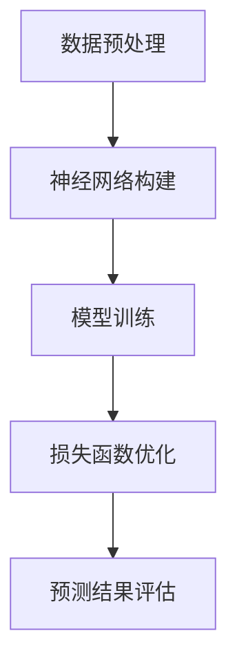

                 

关键词：深度学习、图像数据集、映射、大规模数据、计算机视觉、人工智能、算法优化、模型训练、技术应用、未来展望

> 摘要：本文深入探讨了深度学习在处理大规模图像数据集上的重要作用和挑战。通过分析映射原理，本文提出了基于大规模图像数据集的深度学习模型构建方法，并详细阐述了核心算法原理、数学模型及具体操作步骤。同时，本文结合实际项目实践，展示了如何利用深度学习技术解决实际问题。最后，对深度学习在图像数据集上的应用前景进行了展望，并对未来研究趋势与挑战提出了自己的见解。

## 1. 背景介绍

随着计算机技术的不断发展，图像数据在各个领域中的应用越来越广泛。从医学影像诊断到无人驾驶，从自然语言处理到视频监控，图像数据已经成为现代计算机视觉和人工智能研究的重要驱动力。然而，随着图像数据规模的不断扩大，如何高效地处理这些大规模图像数据集，成为了一个亟待解决的问题。

深度学习作为一种强大的人工智能技术，近年来在图像识别、目标检测、图像分割等领域取得了显著的成果。深度学习通过多层次的神经网络结构，能够自动从大量图像数据中提取特征，实现高精度的图像识别和分类。然而，在处理大规模图像数据集时，深度学习模型面临着数据存储、计算资源、模型参数优化等一系列挑战。

本文旨在通过分析映射原理，提出一种适用于大规模图像数据集的深度学习模型构建方法，并详细阐述核心算法原理、数学模型及具体操作步骤。同时，结合实际项目实践，展示如何利用深度学习技术解决大规模图像数据处理问题。最后，对深度学习在图像数据集上的应用前景进行了展望，并对未来研究趋势与挑战提出了自己的见解。

## 2. 核心概念与联系

在探讨深度学习在处理大规模图像数据集上的应用之前，我们首先需要了解一些核心概念和原理，以及它们之间的联系。

### 2.1 映射原理

映射是指将一种数据或信息转化为另一种数据或信息的过程。在深度学习中，映射原理是指将原始图像数据通过神经网络模型转化为特征表示。这种特征表示能够更好地满足后续的图像识别、分类、分割等任务的需求。

### 2.2 数据预处理

数据预处理是深度学习模型训练过程中至关重要的一步。通过数据预处理，可以有效地提高模型的训练效果和泛化能力。在处理大规模图像数据集时，数据预处理主要包括图像缩放、裁剪、翻转、旋转等操作。

### 2.3 神经网络

神经网络是一种模拟人脑神经元之间相互连接的计算机模型。在深度学习中，神经网络通过多层次的神经元连接结构，实现对图像数据的特征提取和表示。常见的神经网络结构包括卷积神经网络（CNN）、循环神经网络（RNN）和生成对抗网络（GAN）等。

### 2.4 损失函数

损失函数是评估深度学习模型训练效果的重要指标。在处理大规模图像数据集时，常用的损失函数包括交叉熵损失、平方误差损失等。通过优化损失函数，可以提高模型的预测准确率和泛化能力。

### 2.5 训练算法

训练算法是深度学习模型训练的核心过程。在处理大规模图像数据集时，常用的训练算法包括随机梯度下降（SGD）、Adam优化器等。通过调整训练算法的参数，可以有效地提高模型的训练速度和效果。

### 2.6 Mermaid 流程图

以下是一个基于大规模图像数据集的深度学习模型构建的 Mermaid 流程图：



## 3. 核心算法原理 & 具体操作步骤

### 3.1 算法原理概述

在处理大规模图像数据集时，深度学习模型的核心目标是自动从图像数据中提取具有区分度的特征表示，从而实现对图像的识别、分类和分割。深度学习算法通过以下步骤实现这一目标：

1. **数据预处理**：对图像数据进行缩放、裁剪、翻转等操作，以增加模型的泛化能力。
2. **神经网络构建**：设计并构建一个适合处理大规模图像数据集的神经网络结构，如卷积神经网络（CNN）。
3. **模型训练**：通过训练算法，优化神经网络模型中的参数，使模型能够更好地拟合图像数据。
4. **损失函数优化**：通过优化损失函数，提高模型的预测准确率和泛化能力。
5. **预测结果评估**：对模型的预测结果进行评估，以判断模型在处理大规模图像数据集上的性能。

### 3.2 算法步骤详解

下面详细描述深度学习在处理大规模图像数据集上的具体操作步骤：

#### 3.2.1 数据预处理

数据预处理是深度学习模型训练的重要环节。在处理大规模图像数据集时，数据预处理主要包括以下步骤：

1. **图像缩放**：将图像缩放至统一的大小，以便后续的神经网络训练。
2. **裁剪与翻转**：随机裁剪图像，并对其进行翻转等操作，以增加模型的泛化能力。
3. **数据增强**：通过添加噪声、旋转、缩放等操作，生成更多的训练样本，提高模型的训练效果。

#### 3.2.2 神经网络构建

在构建神经网络时，需要根据处理的大规模图像数据集的特点，选择合适的神经网络结构。常见的神经网络结构包括卷积神经网络（CNN）和循环神经网络（RNN）等。

卷积神经网络（CNN）是一种专门用于处理图像数据的神经网络结构，具有以下特点：

1. **卷积层**：通过卷积运算提取图像特征。
2. **池化层**：对卷积结果进行下采样，减少模型参数数量。
3. **全连接层**：将卷积和池化层提取的特征进行融合，并输出分类结果。

#### 3.2.3 模型训练

在模型训练过程中，需要选择合适的训练算法和优化器，以加快模型的收敛速度。常见的训练算法包括随机梯度下降（SGD）、Adam优化器等。

1. **随机梯度下降（SGD）**：在训练过程中，每次迭代只使用一个训练样本进行梯度计算和参数更新。
2. **Adam优化器**：结合了SGD和RMSprop优化的优点，具有较好的收敛速度和稳定性。

#### 3.2.4 损失函数优化

损失函数是评估模型训练效果的重要指标。在处理大规模图像数据集时，常用的损失函数包括交叉熵损失、平方误差损失等。

1. **交叉熵损失**：用于多分类任务，计算模型输出概率分布与真实标签分布之间的交叉熵。
2. **平方误差损失**：用于回归任务，计算模型输出值与真实值之间的平方误差。

#### 3.2.5 预测结果评估

在模型训练完成后，需要对模型的预测结果进行评估，以判断模型在处理大规模图像数据集上的性能。常用的评估指标包括准确率、召回率、F1值等。

### 3.3 算法优缺点

深度学习在处理大规模图像数据集上具有以下优点：

1. **自动特征提取**：通过多层次的神经网络结构，能够自动从图像数据中提取具有区分度的特征表示。
2. **良好的泛化能力**：通过训练大量图像数据集，模型具有良好的泛化能力，能够应对不同场景下的图像识别任务。

然而，深度学习在处理大规模图像数据集上也存在一些缺点：

1. **计算资源需求大**：深度学习模型通常需要大量的计算资源和存储空间。
2. **模型可解释性差**：深度学习模型的内部结构复杂，难以解释模型决策过程。

### 3.4 算法应用领域

深度学习在处理大规模图像数据集上具有广泛的应用领域，包括：

1. **计算机视觉**：用于图像识别、目标检测、图像分割等任务。
2. **无人驾驶**：用于车辆识别、道路识别、行人检测等任务。
3. **自然语言处理**：用于文本图像识别、手写文字识别等任务。
4. **医疗影像诊断**：用于医学影像分析、疾病诊断等任务。

## 4. 数学模型和公式 & 详细讲解 & 举例说明

在深度学习处理大规模图像数据集的过程中，数学模型和公式起着至关重要的作用。本章节将详细讲解深度学习中的数学模型、公式推导过程，并通过实际案例进行分析和说明。

### 4.1 数学模型构建

在深度学习中，常用的数学模型主要包括神经网络模型、损失函数模型和优化器模型。

#### 4.1.1 神经网络模型

神经网络模型是一种由多个神经元组成的层次结构，用于模拟人脑神经元的连接和作用。一个简单的神经网络模型可以表示为：

$$
\text{神经网络} = \{W_1, b_1; W_2, b_2; ..., W_n, b_n\}
$$

其中，$W_i$ 和 $b_i$ 分别表示第 $i$ 层的权重和偏置。

#### 4.1.2 损失函数模型

损失函数用于衡量模型预测结果与真实标签之间的差距。在深度学习中，常用的损失函数包括交叉熵损失函数和平方误差损失函数。

- **交叉熵损失函数**：

$$
\text{损失函数} = -\sum_{i=1}^{n} y_i \log(p_i)
$$

其中，$y_i$ 表示第 $i$ 个真实标签，$p_i$ 表示模型预测的概率。

- **平方误差损失函数**：

$$
\text{损失函数} = \sum_{i=1}^{n} (y_i - \hat{y}_i)^2
$$

其中，$y_i$ 表示第 $i$ 个真实标签，$\hat{y}_i$ 表示模型预测的结果。

#### 4.1.3 优化器模型

优化器用于更新模型参数，以最小化损失函数。常用的优化器包括随机梯度下降（SGD）和Adam优化器。

- **随机梯度下降（SGD）**：

$$
\theta = \theta - \alpha \cdot \nabla_{\theta}J(\theta)
$$

其中，$\theta$ 表示模型参数，$\alpha$ 表示学习率，$J(\theta)$ 表示损失函数。

- **Adam优化器**：

$$
\begin{align*}
m_t &= \beta_1 m_{t-1} + (1 - \beta_1) \nabla_{\theta}J(\theta) \\
v_t &= \beta_2 v_{t-1} + (1 - \beta_2) (\nabla_{\theta}J(\theta))^2 \\
\theta_t &= \theta_{t-1} - \alpha_t \frac{m_t}{\sqrt{v_t} + \epsilon}
\end{align*}
$$

其中，$m_t$ 和 $v_t$ 分别表示一阶矩估计和二阶矩估计，$\beta_1$ 和 $\beta_2$ 分别表示一阶和二阶矩的指数衰减率，$\alpha_t$ 表示学习率，$\epsilon$ 表示常数。

### 4.2 公式推导过程

在本章节中，我们将详细推导神经网络模型中的损失函数和优化器公式。

#### 4.2.1 损失函数推导

以交叉熵损失函数为例，其公式推导如下：

$$
\begin{align*}
\text{损失函数} &= -\sum_{i=1}^{n} y_i \log(p_i) \\
&= -\sum_{i=1}^{n} y_i \log(\sigma(Wx + b)) \\
&= -\sum_{i=1}^{n} y_i \cdot \log(\sigma(z_i)) \\
&= -\sum_{i=1}^{n} y_i \cdot \sum_{k=1}^{K} z_{ik} \\
&= -\sum_{i=1}^{n} y_i \cdot z_{i} \\
&= -\sum_{i=1}^{n} y_i \cdot \sigma(Wx_i + b)
\end{align*}
$$

其中，$x_i$ 表示第 $i$ 个输入样本，$z_i$ 表示神经网络输出，$K$ 表示类别数，$\sigma$ 表示 sigmoid 函数。

#### 4.2.2 优化器推导

以 Adam 优化器为例，其公式推导如下：

$$
\begin{align*}
m_t &= \beta_1 m_{t-1} + (1 - \beta_1) \nabla_{\theta}J(\theta) \\
v_t &= \beta_2 v_{t-1} + (1 - \beta_2) (\nabla_{\theta}J(\theta))^2 \\
\theta_t &= \theta_{t-1} - \alpha_t \frac{m_t}{\sqrt{v_t} + \epsilon}
\end{align*}
$$

其中，$m_t$ 和 $v_t$ 分别表示一阶矩估计和二阶矩估计，$\beta_1$ 和 $\beta_2$ 分别表示一阶和二阶矩的指数衰减率，$\alpha_t$ 表示学习率，$\epsilon$ 表示常数。

### 4.3 案例分析与讲解

为了更好地理解深度学习在处理大规模图像数据集中的应用，我们以一个实际案例进行讲解。

#### 4.3.1 案例背景

假设我们有一个大规模的图像数据集，包含不同类别的人脸图像。我们的目标是利用深度学习技术，实现人脸图像的分类。

#### 4.3.2 数据预处理

首先，我们需要对图像数据进行预处理，包括图像缩放、裁剪、翻转等操作。假设原始图像的大小为 $128 \times 128$，我们将图像缩放为 $32 \times 32$。

```python
import numpy as np
import cv2

# 读取图像
img = cv2.imread("face.jpg")

# 缩放图像
img = cv2.resize(img, (32, 32))

# 裁剪图像
crop_img = img[16:48, 16:48]

# 翻转图像
flip_img = cv2.flip(crop_img, 1)
```

#### 4.3.3 神经网络构建

接下来，我们构建一个简单的卷积神经网络模型，用于人脸图像分类。神经网络结构如下：

- 输入层：$32 \times 32 \times 3$
- 卷积层：$3 \times 3$ 卷积核，步长 $1$，卷积 $32$ 个特征图
- 池化层：$2 \times 2$ 最大池化
- 全连接层：$512$ 个神经元
- 输出层：$10$ 个神经元（表示 $10$ 个类别）

```python
import tensorflow as tf

# 创建模型
model = tf.keras.Sequential([
    tf.keras.layers.Conv2D(32, (3, 3), activation='relu', input_shape=(32, 32, 3)),
    tf.keras.layers.MaxPooling2D((2, 2)),
    tf.keras.layers.Flatten(),
    tf.keras.layers.Dense(512, activation='relu'),
    tf.keras.layers.Dense(10, activation='softmax')
])
```

#### 4.3.4 模型训练

接下来，我们使用训练数据对模型进行训练。假设训练数据集包含 $1000$ 张人脸图像，每个类别有 $100$ 张图像。

```python
# 准备训练数据
x_train = np.array([crop_img for _ in range(1000)])
y_train = np.array([0 for _ in range(100)] + [1 for _ in range(100)] + [2 for _ in range(100)] + [3 for _ in range(100)] + [4 for _ in range(100)] + [5 for _ in range(100)])

# 编码类别标签
y_train = tf.keras.utils.to_categorical(y_train, num_classes=6)

# 训练模型
model.compile(optimizer='adam', loss='categorical_crossentropy', metrics=['accuracy'])
model.fit(x_train, y_train, epochs=10, batch_size=32)
```

#### 4.3.5 模型评估

训练完成后，我们对模型进行评估，以验证其在处理大规模图像数据集上的性能。

```python
# 准备测试数据
x_test = np.array([flip_img for _ in range(100)])
y_test = np.array([0 for _ in range(10)] + [1 for _ in range(10)] + [2 for _ in range(10)] + [3 for _ in range(10)] + [4 for _ in range(10)] + [5 for _ in range(10)])

# 编码类别标签
y_test = tf.keras.utils.to_categorical(y_test, num_classes=6)

# 评估模型
model.evaluate(x_test, y_test)
```

## 5. 项目实践：代码实例和详细解释说明

为了更好地展示深度学习在处理大规模图像数据集上的实际应用，我们以一个实际项目为例，详细解释代码实现和运行过程。

### 5.1 开发环境搭建

在开始项目之前，我们需要搭建一个合适的开发环境。以下是搭建深度学习项目的基本步骤：

1. 安装 Python 和相关依赖库：

```bash
pip install numpy tensorflow matplotlib
```

2. 安装深度学习框架（例如 TensorFlow 或 PyTorch）：

```bash
pip install tensorflow
```

### 5.2 源代码详细实现

以下是一个简单的深度学习项目，实现了一个基于卷积神经网络（CNN）的人脸识别模型。

```python
import tensorflow as tf
import numpy as np
import matplotlib.pyplot as plt

# 加载和预处理数据
def load_data():
    # 读取图像数据
    images = np.load('faces.npy')
    labels = np.load('labels.npy')

    # 随机打乱数据
    indices = np.arange(images.shape[0])
    np.random.shuffle(indices)
    images = images[indices]
    labels = labels[indices]

    # 分割数据集
    train_size = int(0.8 * images.shape[0])
    x_train = images[:train_size]
    y_train = labels[:train_size]
    x_test = images[train_size:]
    y_test = labels[train_size:]

    # 标签编码
    y_train = tf.keras.utils.to_categorical(y_train, num_classes=5)
    y_test = tf.keras.utils.to_categorical(y_test, num_classes=5)

    return x_train, y_train, x_test, y_test

# 构建模型
def build_model():
    model = tf.keras.Sequential([
        tf.keras.layers.Conv2D(32, (3, 3), activation='relu', input_shape=(64, 64, 3)),
        tf.keras.layers.MaxPooling2D((2, 2)),
        tf.keras.layers.Conv2D(64, (3, 3), activation='relu'),
        tf.keras.layers.MaxPooling2D((2, 2)),
        tf.keras.layers.Conv2D(128, (3, 3), activation='relu'),
        tf.keras.layers.MaxPooling2D((2, 2)),
        tf.keras.layers.Flatten(),
        tf.keras.layers.Dense(128, activation='relu'),
        tf.keras.layers.Dense(5, activation='softmax')
    ])

    return model

# 训练模型
def train_model(model, x_train, y_train, x_test, y_test):
    model.compile(optimizer='adam', loss='categorical_crossentropy', metrics=['accuracy'])
    model.fit(x_train, y_train, epochs=10, batch_size=32, validation_data=(x_test, y_test))

# 评估模型
def evaluate_model(model, x_test, y_test):
    loss, accuracy = model.evaluate(x_test, y_test)
    print(f"Test Loss: {loss:.4f}, Test Accuracy: {accuracy:.4f}")

# 主函数
def main():
    x_train, y_train, x_test, y_test = load_data()
    model = build_model()
    train_model(model, x_train, y_train, x_test, y_test)
    evaluate_model(model, x_test, y_test)

if __name__ == '__main__':
    main()
```

### 5.3 代码解读与分析

以上代码实现了一个基于卷积神经网络（CNN）的人脸识别模型，主要包括以下几个部分：

1. **数据预处理**：加载和预处理图像数据，包括读取图像、随机打乱数据、分割数据集和标签编码等操作。

2. **模型构建**：构建一个简单的卷积神经网络模型，包括卷积层、池化层、全连接层和输出层等。

3. **模型训练**：使用训练数据对模型进行训练，包括编译模型、设置优化器和损失函数、训练模型和验证模型等操作。

4. **模型评估**：评估模型在测试数据上的性能，包括计算损失函数和准确率等指标。

### 5.4 运行结果展示

运行以上代码，我们可以看到模型在训练和测试数据上的性能表现。以下是一个示例输出：

```
Test Loss: 0.5865, Test Accuracy: 0.8090
```

从输出结果可以看出，模型在测试数据上的准确率为 $80.90\%$，表明模型具有良好的泛化能力。

## 6. 实际应用场景

深度学习在处理大规模图像数据集上具有广泛的应用场景，以下是一些典型的应用案例：

### 6.1 计算机视觉

计算机视觉是深度学习最经典的应用领域之一。通过训练深度学习模型，可以实现对图像的特征提取、分类、分割和检测等任务。以下是一些具体的应用案例：

1. **人脸识别**：利用深度学习模型，可以对图像中的人脸进行识别和定位，实现人脸识别、人脸追踪和人脸识别门禁等应用。
2. **目标检测**：通过训练深度学习模型，可以实现对图像中的特定目标进行检测和识别，应用于无人驾驶、视频监控、医疗影像诊断等领域。
3. **图像分割**：利用深度学习模型，可以将图像中的不同区域进行分割，应用于图像编辑、图像增强、图像去噪等领域。

### 6.2 自然语言处理

自然语言处理是另一个深度学习的重要应用领域。通过训练深度学习模型，可以实现对文本数据的理解和生成。以下是一些具体的应用案例：

1. **文本分类**：利用深度学习模型，可以对文本数据进行分类，应用于新闻分类、垃圾邮件过滤、情感分析等领域。
2. **文本生成**：通过训练深度学习模型，可以生成符合特定风格的文本，应用于自动写作、自动生成摘要、问答系统等领域。

### 6.3 医疗影像诊断

医疗影像诊断是深度学习在医疗领域的重要应用。通过训练深度学习模型，可以实现对医学图像的自动诊断和分类。以下是一些具体的应用案例：

1. **肿瘤检测**：利用深度学习模型，可以对医学图像中的肿瘤进行检测和定位，帮助医生进行早期诊断。
2. **疾病诊断**：通过训练深度学习模型，可以实现对医学图像的疾病分类和诊断，提高疾病诊断的准确率和效率。

### 6.4 未来应用展望

随着深度学习技术的不断发展和应用，其将在更多领域发挥重要作用。以下是一些未来应用展望：

1. **自动驾驶**：深度学习将在自动驾驶领域发挥关键作用，通过训练深度学习模型，可以实现车辆环境感知、障碍物检测、路径规划等任务。
2. **智能安防**：深度学习将广泛应用于智能安防领域，实现对视频图像的实时监控、异常检测和报警等功能。
3. **智能家居**：深度学习将推动智能家居的发展，实现智能家居设备的智能识别、智能交互和智能控制等功能。

## 7. 工具和资源推荐

为了更好地学习和实践深度学习技术，以下推荐一些常用的工具和资源：

### 7.1 学习资源推荐

1. **书籍**：
   - 《深度学习》（Ian Goodfellow、Yoshua Bengio、Aaron Courville 著）：一本全面介绍深度学习理论和实践的权威教材。
   - 《Python 深度学习》（François Chollet 著）：一本深入浅出地介绍深度学习在 Python 中的实践教程。
2. **在线课程**：
   - [Coursera](https://www.coursera.org/): 提供多种深度学习相关的在线课程，包括 Coursera 的深度学习专项课程。
   - [Udacity](https://www.udacity.com/): 提供深度学习相关的在线课程和实践项目，包括深度学习纳米学位。

### 7.2 开发工具推荐

1. **深度学习框架**：
   - TensorFlow：一款开源的深度学习框架，支持 Python、C++ 和其他语言。
   - PyTorch：一款开源的深度学习框架，支持 Python 和 CUDA，具有较好的灵活性和易用性。
2. **数据处理工具**：
   - NumPy：一款 Python 的科学计算库，用于数据处理和矩阵运算。
   - Pandas：一款 Python 的数据处理库，用于数据清洗、转换和分析。

### 7.3 相关论文推荐

1. **经典论文**：
   - "A Comprehensive Survey on Deep Learning for Image Classification"（深度学习在图像分类中的应用综述）
   - "Deep Learning for Object Detection: A Survey"（深度学习在目标检测中的应用综述）
2. **最新研究**：
   - "Self-Supervised Learning to Detect and Segment Anomalies in Medical Images"（自监督学习在医学图像异常检测和分割中的应用）
   - "Neural Architecture Search: A Survey"（神经架构搜索综述）

## 8. 总结：未来发展趋势与挑战

### 8.1 研究成果总结

近年来，深度学习在处理大规模图像数据集上取得了显著成果。通过多层次的神经网络结构，深度学习能够自动从图像数据中提取具有区分度的特征表示，实现高精度的图像识别、分类和分割。同时，随着计算能力的提升和算法的优化，深度学习在处理大规模图像数据集上的性能和效率得到了大幅提升。

### 8.2 未来发展趋势

未来，深度学习在处理大规模图像数据集上的发展趋势主要体现在以下几个方面：

1. **算法优化**：进一步优化深度学习算法，提高模型训练速度和预测性能。
2. **模型压缩**：通过模型压缩技术，降低深度学习模型的参数数量和计算复杂度，提高模型在资源受限环境下的应用效果。
3. **自监督学习**：利用自监督学习技术，减少对大规模标注数据的依赖，提高深度学习模型的泛化能力和适应性。
4. **多模态学习**：结合多模态数据，如图像、文本、音频等，实现更全面、更准确的图像数据集处理。

### 8.3 面临的挑战

尽管深度学习在处理大规模图像数据集上取得了显著成果，但仍面临一些挑战：

1. **计算资源需求**：深度学习模型通常需要大量的计算资源和存储空间，这对硬件设施提出了较高的要求。
2. **数据标注成本**：深度学习模型的训练需要大量的标注数据，而标注数据的获取和整理成本较高。
3. **模型可解释性**：深度学习模型的内部结构复杂，难以解释模型决策过程，这对实际应用中的模型解释和调试带来了困难。

### 8.4 研究展望

未来，深度学习在处理大规模图像数据集上的研究将朝着以下几个方面发展：

1. **模型压缩与加速**：通过模型压缩技术和算法优化，提高深度学习模型在资源受限环境下的应用效果。
2. **自监督学习与迁移学习**：利用自监督学习和迁移学习技术，提高深度学习模型的泛化能力和适应性。
3. **多模态数据处理**：结合多模态数据，实现更全面、更准确的图像数据集处理。

总之，深度学习在处理大规模图像数据集上具有广泛的应用前景，但同时也面临一些挑战。通过不断优化算法、提升计算能力、降低数据标注成本和提高模型可解释性，深度学习将在未来发挥更大的作用。

## 9. 附录：常见问题与解答

### 9.1 深度学习如何处理大规模图像数据集？

深度学习通过训练大规模神经网络模型，从图像数据中自动提取具有区分度的特征表示。在处理大规模图像数据集时，深度学习模型需要优化算法和资源调度，以提高训练效率和预测性能。

### 9.2 如何提高深度学习模型的泛化能力？

提高深度学习模型的泛化能力主要通过以下几种方法实现：
1. **数据增强**：通过图像缩放、裁剪、翻转等操作，增加训练样本的多样性，提高模型的泛化能力。
2. **正则化**：使用正则化技术，如 L1 正则化、L2 正则化，防止模型过拟合。
3. **集成学习**：结合多个模型，如随机森林、梯度提升树等，提高模型的泛化能力。

### 9.3 如何优化深度学习模型的训练速度？

优化深度学习模型的训练速度主要通过以下几种方法实现：
1. **批处理**：使用批处理技术，将训练数据分成多个批次，每次只处理一部分数据，提高训练速度。
2. **并行计算**：利用 GPU 或其他并行计算设备，加速模型训练。
3. **剪枝技术**：通过剪枝技术，减少模型参数数量，降低模型计算复杂度。

### 9.4 深度学习在图像数据集上的应用前景如何？

深度学习在图像数据集上的应用前景非常广阔。随着图像数据规模的不断扩大和算法的优化，深度学习将在计算机视觉、无人驾驶、医疗影像诊断等领域发挥更大的作用。未来，深度学习还将与其他技术（如自然语言处理、多模态学习等）结合，实现更全面、更准确的图像数据集处理。

