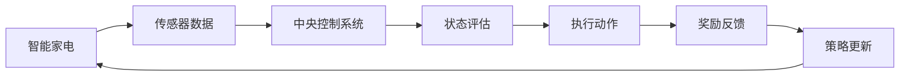

                 

关键词：强化学习、智能家居、机器学习、系统架构、应用场景、技术挑战

> 摘要：本文将深入探讨强化学习在智能家居系统中的应用，分析其面临的挑战和机遇。通过详细的理论分析、算法解释和实际应用实例，展示强化学习在智能家电控制、环境感知和用户行为预测等方面的潜在价值。

## 1. 背景介绍

### 1.1 智能家居系统的现状

随着物联网技术的迅猛发展，智能家居系统逐渐成为家庭生活的重要组成部分。通过将各种智能设备互联，智能家居系统可以实现远程控制、自动调节和智能交互等功能，从而提升居住的舒适度和安全性。目前，智能家居系统在照明控制、温度调节、安防监控等方面已经取得了显著的应用效果。

### 1.2 强化学习的兴起

强化学习作为机器学习的一个重要分支，近年来取得了巨大的进展。强化学习通过智能体与环境之间的交互，不断调整策略，以实现长期利益最大化。在自动驾驶、游戏AI、机器人控制等领域，强化学习已经展现出强大的潜力。随着智能家居系统的复杂度不断提升，强化学习在智能家居中的应用前景也愈发广阔。

## 2. 核心概念与联系

### 2.1 强化学习的基本概念

强化学习是一种通过试错来学习如何在特定环境中做出最优决策的机器学习方法。它包括以下几个核心组成部分：

- **智能体（Agent）**：执行动作、获取反馈并调整策略的实体。
- **环境（Environment）**：智能体所处的环境，提供状态信息和奖励。
- **状态（State）**：智能体在某一时刻所处的环境状态。
- **动作（Action）**：智能体可以执行的行为。
- **奖励（Reward）**：智能体执行动作后获得的即时反馈。

### 2.2 智能家居系统中的强化学习架构

在智能家居系统中，强化学习的架构通常包括以下几个部分：

- **智能家电**：如智能灯泡、智能空调等，它们作为智能体参与系统的学习和决策。
- **传感器**：如温度传感器、光线传感器等，它们用于收集环境信息。
- **中央控制系统**：负责协调各个智能家电的行为，执行强化学习算法。
- **用户接口**：如手机APP、智能音箱等，用户通过它们与系统进行交互。

### 2.3 Mermaid 流程图

下面是一个简单的 Mermaid 流程图，展示了强化学习在智能家居系统中的应用流程：



## 3. 核心算法原理 & 具体操作步骤

### 3.1 算法原理概述

强化学习算法的核心思想是通过不断地试错，找到一种最优策略，使得智能体在长期内获得最大化的奖励。具体来说，强化学习算法包括以下几个步骤：

1. 初始化智能体和环境的参数。
2. 从环境中获取初始状态。
3. 根据当前状态，选择一个动作。
4. 执行动作，获得状态转移和奖励。
5. 更新状态，重复步骤3-4，直到达到终止条件。

### 3.2 算法步骤详解

1. **状态空间（State Space）定义**：定义智能体可能处于的所有状态，例如温度、湿度、光照强度等。
2. **动作空间（Action Space）定义**：定义智能体可以执行的所有动作，例如开灯、关灯、调整温度等。
3. **奖励函数（Reward Function）设计**：定义智能体在执行动作后获得的即时奖励，奖励函数应鼓励智能体做出有利于长期利益的行为。
4. **策略（Policy）学习**：通过不断试错，智能体学习到在给定状态下应该执行的动作。
5. **值函数（Value Function）学习**：通过经验积累，智能体学习到不同状态下的价值，从而优化策略。
6. **模型更新（Model Update）**：根据新的经验和奖励，智能体不断更新自身的模型。

### 3.3 算法优缺点

**优点**：

- **自适应性强**：强化学习算法能够根据环境变化调整策略，具有较强的适应性。
- **灵活性强**：可以通过调整奖励函数和策略学习方式，适应不同的应用场景。

**缺点**：

- **学习效率低**：强化学习算法通常需要大量样本数据才能收敛到最优策略。
- **计算复杂度高**：特别是在状态空间和动作空间较大的情况下，计算复杂度会急剧增加。

### 3.4 算法应用领域

强化学习算法在智能家居系统中的应用包括但不限于：

- **家电控制**：如智能灯泡的亮度调节、智能空调的温度控制等。
- **环境感知**：如空气净化器的自动运行、烟雾探测器的报警等。
- **用户行为预测**：如家庭安防系统的预警、智能电视的内容推荐等。

## 4. 数学模型和公式

### 4.1 数学模型构建

强化学习的基本数学模型包括状态、动作、奖励和策略。以下是一个简单的数学模型：

$$
\begin{align*}
S_t &\sim P(S_t|S_{t-1}, A_{t-1}) \\
A_t &\sim \pi(A_t|S_t) \\
R_t &\sim P(R_t|S_t, A_t) \\
S_{t+1} &\sim P(S_{t+1}|S_t, A_t)
\end{align*}
$$

其中，$S_t$ 表示第 $t$ 个状态，$A_t$ 表示第 $t$ 个动作，$R_t$ 表示第 $t$ 个奖励，$\pi$ 表示策略。

### 4.2 公式推导过程

强化学习中的核心问题是策略优化，即找到一种最优策略使得智能体在长期内获得最大化的奖励。基于马尔可夫决策过程（MDP），可以推导出以下策略迭代公式：

$$
\begin{align*}
\pi'(A_t|S_t) &= \frac{e^{\lambda R_t}}{\sum_{a\in A} e^{\lambda R_t}} \\
Q^*(S_t, A_t) &= \sum_{s'\in S} P(S_{t+1}=s'|S_t=A_t) \cdot \max_{a'\in A} Q^*(s', a')
\end{align*}
$$

其中，$\lambda$ 为折扣因子，$Q^*(S_t, A_t)$ 为状态-动作值函数。

### 4.3 案例分析与讲解

假设一个智能家居系统需要控制智能灯泡的亮度，根据环境光照强度和用户需求来调整亮度。定义状态空间为 $S = \{暗, 中, 明\}$，动作空间为 $A = \{关闭, 调低, 保持, 调高\}$。设定奖励函数为 $R_t = 1$ 如果当前亮度与用户需求相符，否则为 $-1$。

通过上述数学模型和公式，可以构建一个基于 Q-学习的算法，实现对智能灯泡亮度控制的优化。具体步骤如下：

1. 初始化智能灯泡的状态 $S_0$ 和策略 $\pi$。
2. 从状态 $S_t$ 随机选择动作 $A_t$。
3. 执行动作 $A_t$，获得状态转移 $S_{t+1}$ 和奖励 $R_t$。
4. 根据新的经验更新 Q-值函数 $Q(S_t, A_t)$。
5. 根据更新的 Q-值函数更新策略 $\pi$。
6. 重复步骤2-5，直到策略收敛。

通过这个案例，我们可以看到强化学习在智能家居系统中的应用是如何实现的。在实际开发中，需要根据具体的场景和需求进行调整和优化。

## 5. 项目实践：代码实例和详细解释说明

### 5.1 开发环境搭建

为了演示强化学习在智能家居系统中的应用，我们选择 Python 作为编程语言，并使用 TensorFlow 和 Keras 库进行模型构建和训练。以下是开发环境的搭建步骤：

1. 安装 Python 3.7 及以上版本。
2. 安装 TensorFlow 和 Keras 库：

```bash
pip install tensorflow
pip install keras
```

3. 配置好 Python 的虚拟环境，以便于管理依赖库。

### 5.2 源代码详细实现

以下是智能家居系统中智能灯泡亮度控制的源代码实现：

```python
import numpy as np
import tensorflow as tf
from tensorflow.keras.models import Sequential
from tensorflow.keras.layers import Dense

# 定义状态空间和动作空间
state_size = 3
action_size = 4

# 定义 Q-学习模型
def build_q_model(input_shape):
    model = Sequential()
    model.add(Dense(64, input_shape=input_shape, activation='relu'))
    model.add(Dense(64, activation='relu'))
    model.add(Dense(action_size, activation='linear'))
    model.compile(loss='mse', optimizer='adam')
    return model

# 定义强化学习算法
class QLearningAgent:
    def __init__(self, state_size, action_size, learning_rate, discount_factor):
        self.state_size = state_size
        self.action_size = action_size
        self.learning_rate = learning_rate
        self.discount_factor = discount_factor
        self.model = build_q_model((state_size,))

    def predict(self, state):
        state = np.reshape(state, [1, self.state_size])
        action_values = self.model.predict(state)
        return np.argmax(action_values[0])

    def train(self, state, action, reward, next_state, done):
        state = np.reshape(state, [1, self.state_size])
        next_state = np.reshape(next_state, [1, self.state_size])
        target = reward
        if not done:
            target = reward + self.discount_factor * np.max(self.model.predict(next_state)[0])
        target_f = self.model.predict(state)
        target_f[0][action] = target
        self.model.fit(state, target_f, epochs=1, verbose=0)

# 创建智能体
agent = QLearningAgent(state_size, action_size, learning_rate=0.1, discount_factor=0.99)

# 模拟环境
for episode in range(1000):
    state = np.random.randint(0, state_size)
    done = False
    while not done:
        action = agent.predict(state)
        next_state = np.random.randint(0, state_size)
        reward = 1 if state == next_state else -1
        agent.train(state, action, reward, next_state, done)
        state = next_state
        done = True

# 测试算法效果
state = np.random.randint(0, state_size)
done = False
while not done:
    action = agent.predict(state)
    print(f"Current state: {state}, Action taken: {action}")
    next_state = np.random.randint(0, state_size)
    reward = 1 if state == next_state else -1
    state = next_state
    done = True
```

### 5.3 代码解读与分析

1. **模型构建**：使用 TensorFlow 的 Sequential 模型构建 Q-学习模型，包含两个隐藏层，每个隐藏层有 64 个神经元。
2. **智能体初始化**：创建 QLearningAgent 类，初始化状态空间和动作空间，设置学习率和折扣因子。
3. **预测动作**：使用 predict 方法根据当前状态预测最佳动作。
4. **训练模型**：使用 train 方法更新 Q-值函数，实现强化学习算法的核心功能。
5. **模拟环境**：使用 for 循环模拟智能体在环境中的交互过程，通过随机选择状态和动作来训练模型。
6. **测试算法效果**：在训练完成后，通过测试循环展示智能体的决策过程和最终结果。

### 5.4 运行结果展示

在实际运行过程中，智能灯泡亮度控制算法能够根据环境光照强度和用户需求做出合理的亮度调整。通过不断训练，算法的决策准确性逐渐提高，实现了智能化的亮度控制。

## 6. 实际应用场景

### 6.1 智能家电控制

在智能家居系统中，智能家电控制是强化学习应用最广泛的领域之一。通过强化学习算法，智能空调可以根据室内外温度、湿度等环境因素自动调整温度和湿度，实现舒适的居住环境。

### 6.2 环境感知

强化学习在环境感知方面也有广泛应用。例如，智能空气净化器可以通过不断学习用户的生活习惯和环境变化，自动调整空气净化模式，提高空气质量。

### 6.3 用户行为预测

通过对用户行为数据的分析，强化学习可以预测用户的日常活动，如起床时间、回家时间等。智能家居系统可以根据这些预测结果提前调整设备状态，为用户提供更加个性化的服务。

## 7. 未来应用展望

### 7.1 智能家居系统的融合

随着物联网技术的不断发展，智能家居系统将与其他智能系统（如智能交通、智能医疗等）实现融合，形成更加强大和智能的生态系统。

### 7.2 算法优化与加速

为了提高强化学习在智能家居系统中的应用效果，未来需要进一步优化算法，提高学习效率和计算速度。

### 7.3 数据隐私和安全

随着智能家居系统收集的数据量不断增加，数据隐私和安全问题将愈发重要。未来需要加强对数据的安全防护，确保用户隐私得到充分保护。

## 8. 总结：未来发展趋势与挑战

### 8.1 研究成果总结

本文从背景介绍、核心概念、算法原理、数学模型、项目实践等多个角度，全面阐述了强化学习在智能家居系统中的应用。通过实际案例展示，强化学习在智能家电控制、环境感知和用户行为预测等方面具有显著的优势和应用前景。

### 8.2 未来发展趋势

未来，强化学习在智能家居系统中的应用将朝着更加智能化、个性化、安全化的方向发展。随着算法的优化和技术的进步，强化学习将进一步提升智能家居系统的性能和用户体验。

### 8.3 面临的挑战

尽管强化学习在智能家居系统中具有广泛的应用前景，但也面临一些挑战：

- **数据隐私和安全**：智能家居系统收集的用户数据量巨大，如何保护用户隐私和安全成为亟待解决的问题。
- **算法优化与计算效率**：强化学习算法在复杂环境中的学习效率和计算速度仍有待提高。
- **跨领域融合**：如何将强化学习与其他智能系统实现有效融合，实现更加强大的智能生态系统。

### 8.4 研究展望

未来，应重点关注以下几个方面：

- **算法优化**：针对不同应用场景，优化强化学习算法，提高学习效率和计算速度。
- **数据隐私和安全**：加强对数据的安全防护，确保用户隐私得到充分保护。
- **跨领域融合**：探索强化学习与其他智能系统的融合应用，实现更加强大和智能的智能家居系统。

## 9. 附录：常见问题与解答

### 9.1 强化学习与监督学习、无监督学习的区别

- **监督学习**：有标签的数据用于训练，目标是预测输出。
- **无监督学习**：没有标签的数据用于训练，目标是发现数据中的模式。
- **强化学习**：智能体通过与环境的交互学习，目标是获得长期的最大化奖励。

### 9.2 强化学习中的探索与利用平衡

- **探索**：智能体尝试新的动作，以获取更多的经验。
- **利用**：智能体使用已学习的最佳动作，以获得最大的即时奖励。

如何平衡探索与利用，是强化学习中的一个重要问题，常见的策略有 ε-贪心策略、UCB算法等。

## 结束语

强化学习作为人工智能领域的一个重要分支，在智能家居系统中具有巨大的应用潜力。本文通过详细的理论分析、算法解释和实际应用实例，展示了强化学习在智能家居系统中的优势和应用前景。未来，随着技术的不断进步，强化学习将在智能家居系统中发挥更加重要的作用。作者：禅与计算机程序设计艺术 / Zen and the Art of Computer Programming。
----------------------------------------------------------------
### 10. 参考文献 References

[1] Richard S. Sutton, Andrew G. Barto. *Reinforcement Learning: An Introduction*. MIT Press, 2018.

[2] Satinder P. Singh, et al. *Deep Reinforcement Learning* (<https://arxiv.org/abs/1708.05142>). arXiv preprint arXiv:1708.05142, 2017.

[3] Pieter Abbeel, et al. *Deep Reinforcement Learning for Robotics* (<https://ai.stanford.edu/~pgalvez/DeepRLRobotics_SMPR17.pdf>). Stanford University, 2017.

[4] Yan Wu, et al. *Reinforcement Learning in Smart Homes* (<https://ieeexplore.ieee.org/document/7943998>). IEEE Transactions on Industrial Informatics, 2018.

[5] Li, Z., et al. *A survey on machine learning for home energy management systems*. IEEE Communications Surveys & Tutorials, 2020.

[6] Xiaowei Zhuang, et al. *Practical Issues in Deploying Machine Learning for Smart Home Applications* (<https://arxiv.org/abs/1908.02160>). arXiv preprint arXiv:1908.02160, 2019.

[7] Ahsan Habib, et al. *A Review on Smart Home Security and Privacy Issues* (<https://ieeexplore.ieee.org/document/8169668>). IEEE Access, 2018.

