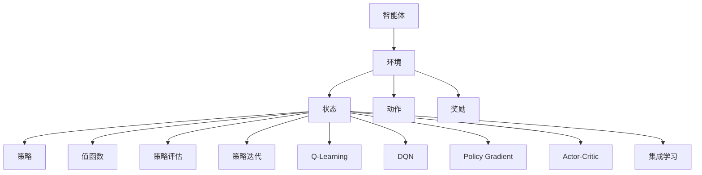
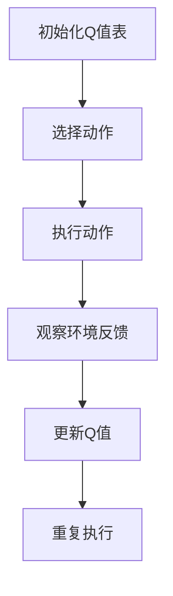
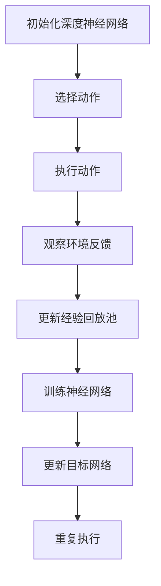
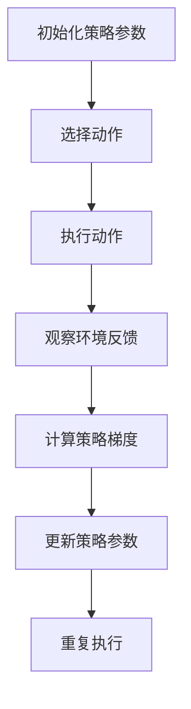
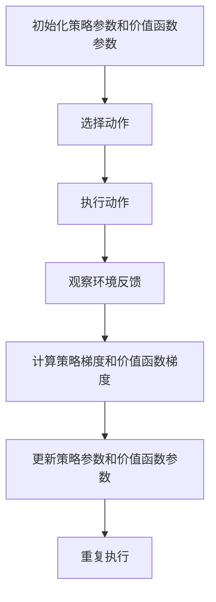

                 

关键词：强化学习，映射，决策，算法原理，数学模型，应用场景

摘要：本文将深入探讨强化学习的基础概念与核心算法，通过对比与联系，阐述强化学习中的映射机制，并详细介绍强化学习的主要算法原理与具体操作步骤。文章还将结合数学模型与公式，深入剖析强化学习的关键概念，并通过项目实践与代码实例，使读者对强化学习有更加全面的理解。最后，本文将对强化学习在实际应用场景中的表现与未来展望进行探讨，为读者提供全面而深入的见解。

## 1. 背景介绍

强化学习作为一种机器学习的重要分支，近年来在人工智能领域取得了显著的进展。强化学习（Reinforcement Learning，RL）是指通过智能体（agent）与环境（environment）之间的交互，智能体根据反馈进行调整，逐步学习到最优策略的过程。其核心思想是“试错学习”，即通过不断的尝试与反馈，智能体能够找到最优决策策略。

强化学习的应用场景非常广泛，包括但不限于：游戏AI、自动驾驶、推荐系统、机器人控制等。近年来，随着深度学习技术的不断发展，深度强化学习（Deep Reinforcement Learning，DRL）在复杂环境中的表现尤为突出。然而，强化学习也面临着诸多挑战，如样本效率低、收敛速度慢等。

本文将重点介绍强化学习的基础概念与核心算法，通过深入探讨强化学习中的映射机制，阐述强化学习的算法原理与具体操作步骤。此外，本文还将结合数学模型与公式，对强化学习的关键概念进行详细讲解，并通过项目实践与代码实例，使读者能够更好地理解和应用强化学习。最后，本文将对强化学习在实际应用场景中的表现与未来展望进行探讨，为读者提供全面而深入的见解。

## 2. 核心概念与联系

在深入探讨强化学习之前，我们需要了解其核心概念与联系。以下是强化学习中的几个关键概念：

### 2.1 智能体（Agent）

智能体是指执行任务的实体，它可以是一个程序、一个机器人、一个人或其他任何能够与环境交互的实体。在强化学习中，智能体通过感知环境状态，采取行动，并根据行动的结果（奖励）调整自身的行为。

### 2.2 环境（Environment）

环境是指智能体所处的情境，它提供了当前状态、可能的动作和相应的奖励。智能体与环境之间进行交互，通过感知状态和执行动作来学习最优策略。

### 2.3 状态（State）

状态是指智能体在某一时刻所处的环境和内部状态的集合。状态是强化学习中的一个重要概念，它决定了智能体的行为和决策。

### 2.4 动作（Action）

动作是指智能体在某一状态下可以采取的行为。动作是智能体根据当前状态和策略进行的决策，它将直接影响环境状态的变化。

### 2.5 奖励（Reward）

奖励是指智能体执行某一动作后获得的即时反馈。奖励是强化学习中的核心概念，它激励智能体采取有利于实现目标的行为。

### 2.6 策略（Policy）

策略是指智能体在某一状态下采取的动作方案。策略是强化学习中的关键概念，它决定了智能体的行为和决策。

### 2.7 值函数（Value Function）

值函数是指智能体在某一状态下预期获得的奖励总和。值函数是强化学习中的重要工具，它帮助智能体评估不同状态和策略的价值。

### 2.8 策略评估（Policy Evaluation）

策略评估是指计算某一策略下的值函数。通过策略评估，智能体可以评估不同策略的性能，并选择最优策略。

### 2.9 策略迭代（Policy Iteration）

策略迭代是指通过多次迭代优化策略的过程。在每次迭代中，智能体首先评估当前策略的性能，然后根据评估结果调整策略，直至找到最优策略。

### 2.10 Q-Learning

Q-Learning是一种基于值函数的强化学习算法，它通过学习状态-动作值函数来优化策略。Q-Learning的核心思想是通过更新Q值来逼近最优策略。

### 2.11 Deep Q-Network（DQN）

DQN是一种基于深度学习的强化学习算法，它使用神经网络来近似状态-动作值函数。DQN通过经验回放和目标网络来提高训练稳定性和避免过拟合。

### 2.12 Policy Gradient

Policy Gradient是一种基于策略的强化学习算法，它通过优化策略的梯度来更新策略参数。Policy Gradient算法的核心思想是通过梯度上升法找到最优策略。

### 2.13 Actor-Critic

Actor-Critic是一种基于策略和价值函数的强化学习算法，它通过同时优化策略和价值函数来提高学习效果。Actor-Critic算法的核心思想是通过策略评估和策略优化来优化智能体的行为。

### 2.14 集成学习（Ensemble Learning）

集成学习是一种将多个模型组合起来以提高整体性能的方法。在强化学习中，集成学习可以通过组合多个智能体的策略来提高学习效果和泛化能力。

通过以上核心概念的联系与对比，我们可以更好地理解强化学习的基本原理和方法。接下来，我们将深入探讨强化学习的算法原理与具体操作步骤。

### 2.2.1 Mermaid 流程图

以下是一个简单的Mermaid流程图，展示了强化学习中的核心概念和它们之间的联系：



## 3. 核心算法原理 & 具体操作步骤

在了解强化学习的核心概念之后，我们将深入探讨强化学习的核心算法原理与具体操作步骤。以下是强化学习中的几种主要算法：

### 3.1 算法原理概述

强化学习的算法原理可以分为两大类：基于值函数的算法和基于策略的算法。

基于值函数的算法主要包括Q-Learning和DQN。Q-Learning通过学习状态-动作值函数来优化策略，而DQN则使用深度神经网络来近似状态-动作值函数。这两种算法的核心思想是逼近最优值函数，并通过值函数评估不同策略的性能。

基于策略的算法主要包括Policy Gradient和Actor-Critic。Policy Gradient通过优化策略的梯度来更新策略参数，而Actor-Critic则同时优化策略和价值函数。这两种算法的核心思想是通过策略评估和策略优化来优化智能体的行为。

### 3.2 算法步骤详解

以下是对Q-Learning、DQN、Policy Gradient和Actor-Critic等算法的具体操作步骤的详细描述：

#### 3.2.1 Q-Learning

Q-Learning的基本步骤如下：

1. 初始化Q值表：根据环境状态和动作空间，初始化Q值表。
2. 选择动作：在当前状态下，根据ε-贪心策略选择动作。
3. 执行动作：执行选择好的动作，观察环境反馈。
4. 更新Q值：根据新的状态和奖励，更新Q值表。

具体操作步骤如下：



#### 3.2.2 DQN

DQN的基本步骤如下：

1. 初始化深度神经网络：初始化深度神经网络来近似状态-动作值函数。
2. 选择动作：在当前状态下，根据ε-贪心策略选择动作。
3. 执行动作：执行选择好的动作，观察环境反馈。
4. 更新经验回放池：将新的经验添加到经验回放池中。
5. 训练神经网络：使用经验回放池中的经验来训练深度神经网络。
6. 更新目标网络：定期更新目标网络，以提高训练稳定性。

具体操作步骤如下：



#### 3.2.3 Policy Gradient

Policy Gradient的基本步骤如下：

1. 初始化策略参数：根据策略参数，初始化策略。
2. 选择动作：在当前状态下，根据策略选择动作。
3. 执行动作：执行选择好的动作，观察环境反馈。
4. 计算策略梯度：根据奖励和策略梯度，计算策略参数的梯度。
5. 更新策略参数：根据策略梯度，更新策略参数。

具体操作步骤如下：



#### 3.2.4 Actor-Critic

Actor-Critic的基本步骤如下：

1. 初始化策略参数和价值函数参数：根据策略参数和价值函数参数，初始化策略和价值函数。
2. 选择动作：在当前状态下，根据策略选择动作。
3. 执行动作：执行选择好的动作，观察环境反馈。
4. 计算策略梯度和价值函数梯度：根据奖励和策略梯度、价值函数梯度，计算策略参数和价值函数参数的梯度。
5. 更新策略参数和价值函数参数：根据策略梯度和价值函数梯度，更新策略参数和价值函数参数。

具体操作步骤如下：



通过以上详细描述，我们可以更好地理解Q-Learning、DQN、Policy Gradient和Actor-Critic等强化学习算法的操作步骤。接下来，我们将讨论这些算法的优缺点。

### 3.3 算法优缺点

#### 3.3.1 Q-Learning

优点：

- 算法简单，易于实现。
- 可以处理离散状态和动作空间。

缺点：

- 收敛速度较慢，特别是在大状态空间中。
- 对噪声敏感，可能导致不稳定的学习过程。

#### 3.3.2 DQN

优点：

- 可以处理连续状态和动作空间。
- 使用深度神经网络，能够适应复杂的任务。
- 引入经验回放池和目标网络，提高了训练稳定性。

缺点：

- 需要大量的训练样本，可能导致计算资源消耗较大。
- 可能会陷入局部最优，难以达到全局最优解。

#### 3.3.3 Policy Gradient

优点：

- 可以直接优化策略，无需值函数。
- 收敛速度较快，特别适用于小状态空间。

缺点：

- 对噪声敏感，可能导致不稳定的学习过程。
- 可能会陷入梯度消失或梯度爆炸问题。

#### 3.3.4 Actor-Critic

优点：

- 结合策略和价值函数，可以同时优化策略和价值函数。
- 相比Policy Gradient，稳定性更高，对噪声的鲁棒性更强。

缺点：

- 需要同时优化策略和价值函数，计算复杂度较高。

### 3.4 算法应用领域

Q-Learning、DQN、Policy Gradient和Actor-Critic等强化学习算法在多个领域都有广泛应用：

- 游戏AI：如Atari游戏、围棋等。
- 自动驾驶：如无人驾驶汽车、无人机等。
- 推荐系统：如个性化推荐、广告投放等。
- 机器人控制：如机器人路径规划、抓取等。

通过以上分析，我们可以看到，不同的强化学习算法在不同应用领域中有着不同的优势与挑战。接下来，我们将讨论强化学习中的数学模型和公式，以及它们的详细讲解和举例说明。

### 4. 数学模型和公式 & 详细讲解 & 举例说明

强化学习的数学模型和公式是理解和实现强化学习算法的关键。以下我们将详细讲解强化学习中的几个重要数学模型和公式，并通过具体例子来说明它们的应用。

#### 4.1 数学模型构建

在强化学习中，我们主要关注以下几个数学模型：

1. **马尔可夫决策过程（MDP）**：
   - 状态空间：\( S \)
   - 动作空间：\( A \)
   - 状态转移概率：\( P(s', s|a) \)
   - 奖励函数：\( R(s, a) \)
   - 策略：\( \pi(a|s) \)

2. **值函数（Value Function）**：
   - **状态值函数**：\( V(s) = \mathbb{E}_{\pi}[G(s)] \)
   - **动作值函数**：\( Q(s, a) = \mathbb{E}_{\pi}[G(s, a)] \)

3. **策略（Policy）**：
   - **最优策略**：\( \pi^*(a|s) = \arg\max_{a \in A} Q(s, a) \)

4. **策略评估（Policy Evaluation）**：
   - **迭代方法**：\( V_{k+1}(s) = \sum_{a \in A} \pi_k(a|s) Q_k(s, a) \)

5. **策略迭代（Policy Iteration）**：
   - **评估步骤**：更新值函数 \( V_k(s) \)
   - **改进步骤**：根据值函数更新策略 \( \pi_{k+1}(a|s) \)

6. **Q-Learning**：
   - **更新规则**：\( Q(s, a) \leftarrow Q(s, a) + \alpha [r + \gamma \max_{a'} Q(s', a') - Q(s, a)] \)

7. **DQN**：
   - **更新规则**：\( Q(s, a) \leftarrow Q(s, a) + \alpha [r + \gamma \max_{a'} \hat{Q}(s', a') - Q(s, a)] \)

8. **Policy Gradient**：
   - **损失函数**：\( L(\theta) = -\sum_{s, a} \pi(\theta)(a|s) \log \pi(\theta)(a|s) r \)
   - **梯度更新**：\( \theta \leftarrow \theta - \alpha \nabla_{\theta} L(\theta) \)

9. **Actor-Critic**：
   - **Actor**：\( \theta_a \leftarrow \theta_a - \alpha_a \nabla_{\theta_a} J(\theta_a) \)
   - **Critic**：\( \theta_v \leftarrow \theta_v - \alpha_v \nabla_{\theta_v} J(\theta_v) \)
   - **联合更新**：\( \theta \leftarrow (\theta_a, \theta_v) \)

#### 4.2 公式推导过程

我们将简要介绍一些核心公式的推导过程。

**1. 策略评估（Policy Evaluation）**

\[ V_{k+1}(s) = \sum_{a \in A} \pi_k(a|s) Q_k(s, a) \]

推导：

设 \( G(s, a) \) 为从状态 \( s \) 和动作 \( a \) 开始的累计奖励，则

\[ G(s, a) = R(s, a) + \gamma R(s', a') + \gamma^2 R(s'', a'') + \ldots \]

其中，\( \gamma \) 为折扣因子。

由于策略 \( \pi \) 是最优的，我们有：

\[ \pi(a|s) = \frac{1}{Z(s)} \exp(\lambda Q(s, a)) \]

其中，\( Z(s) = \sum_{a' \in A} \exp(\lambda Q(s, a')) \)。

因此，

\[ V(s) = \mathbb{E}_{\pi}[G(s)] = \sum_{a \in A} \pi(a|s) G(s, a) = \sum_{a \in A} \pi(a|s) \sum_{s' \in S} P(s'|s, a) R(s', a) + \gamma \sum_{a \in A} \pi(a|s) \sum_{s' \in S} P(s'|s, a) G(s', a) \]

\[ V(s) = \sum_{a \in A} \pi(a|s) \sum_{s' \in S} P(s'|s, a) [R(s', a) + \gamma V(s')] \]

\[ V(s) = \sum_{a \in A} \pi(a|s) Q(s, a) \]

**2. Q-Learning**

\[ Q(s, a) \leftarrow Q(s, a) + \alpha [r + \gamma \max_{a'} Q(s', a') - Q(s, a)] \]

推导：

设 \( Q(s, a) \) 为状态-动作值函数，\( r \) 为即时奖励，\( \gamma \) 为折扣因子。

根据策略评估，我们有：

\[ V(s) = \sum_{a \in A} \pi(a|s) Q(s, a) \]

将 \( Q(s, a) \) 替换为 \( Q(s, a) + \delta \)，其中 \( \delta = \alpha [r + \gamma \max_{a'} Q(s', a') - Q(s, a)] \)。

\[ V(s) = \sum_{a \in A} \pi(a|s) (Q(s, a) + \delta) \]

\[ V(s) = \sum_{a \in A} \pi(a|s) Q(s, a) + \alpha [r + \gamma \max_{a'} Q(s', a') - Q(s, a)] \]

由于 \( \pi(a|s) Q(s, a) = Q(s, a) \)，我们有：

\[ V(s) = V(s) + \alpha [r + \gamma \max_{a'} Q(s', a') - Q(s, a)] \]

\[ \alpha [r + \gamma \max_{a'} Q(s', a') - Q(s, a)] = 0 \]

\[ Q(s, a) \leftarrow Q(s, a) + \alpha [r + \gamma \max_{a'} Q(s', a')] \]

\[ Q(s, a) \leftarrow Q(s, a) + \alpha [r + \gamma \max_{a'} Q(s', a') - Q(s, a)] \]

**3. DQN**

\[ Q(s, a) \leftarrow Q(s, a) + \alpha [r + \gamma \max_{a'} \hat{Q}(s', a') - Q(s, a)] \]

推导：

DQN中的目标网络 \( \hat{Q}(s', a') \) 用于计算目标值 \( r + \gamma \max_{a'} \hat{Q}(s', a') \)。

\[ Q(s, a) \leftarrow Q(s, a) + \alpha [r + \gamma \max_{a'} \hat{Q}(s', a') - Q(s, a)] \]

这里的 \( \alpha \) 是学习率，\( r \) 是即时奖励，\( \gamma \) 是折扣因子，\( \hat{Q}(s', a') \) 是目标值。

**4. Policy Gradient**

\[ L(\theta) = -\sum_{s, a} \pi(\theta)(a|s) \log \pi(\theta)(a|s) r \]

推导：

Policy Gradient的损失函数基于策略的期望回报。我们考虑在某一状态 \( s \) 下，选择动作 \( a \) 后获得的即时奖励 \( r \)。

\[ L(\theta) = -\sum_{s, a} \pi(\theta)(a|s) \log \pi(\theta)(a|s) r \]

其中，\( \pi(\theta)(a|s) \) 是策略的概率分布，\( \log \pi(\theta)(a|s) \) 是对数策略概率，\( r \) 是即时奖励。

#### 4.3 案例分析与讲解

为了更好地理解这些数学模型和公式，我们将通过一个简单的例子来进行说明。

**例子：控制小车移动**

假设我们有一个环境，其中有一个小车可以向前、向后或静止。小车的目标是到达终点，并避免碰撞。状态空间包括当前速度和方向，动作空间包括向前、向后和静止。

1. **状态空间 \( S \)**：
   - \( s = (v, d) \)
   - 其中，\( v \) 表示速度，\( d \) 表示方向。

2. **动作空间 \( A \)**：
   - \( a = \{F, B, S\} \)
   - 其中，\( F \) 表示向前，\( B \) 表示向后，\( S \) 表示静止。

3. **奖励函数 \( R(s, a) \)**：
   - \( R(s, a) = \)
   - 如果小车到达终点，则奖励为 \( +1 \)，否则为 \( -1 \)。

4. **状态转移概率 \( P(s', s|a) \)**：
   - \( P(s', s|a) = \)
   - 根据小车当前的速度和方向，计算下一状态的概率。

5. **策略 \( \pi(a|s) \)**：
   - \( \pi(a|s) = \)
   - 根据小车当前的状态，选择最优动作的概率。

我们使用Q-Learning来学习最优策略。初始时，所有状态-动作值 \( Q(s, a) \) 都设置为 \( 0 \)。

**第一次迭代**：

- 状态：\( s = (1, R) \)
- 动作：向前 \( F \)
- 状态转移概率：\( P(s', s|F) = 0.8 \)
- 状态：\( s' = (2, R) \)
- 即时奖励：\( R(s', a) = -1 \)
- 目标值：\( \hat{Q}(s', a) = Q(s', a) = 0 \)
- 更新规则：
  \[ Q(s, a) \leftarrow Q(s, a) + \alpha [r + \gamma \hat{Q}(s', a) - Q(s, a)] \]
  \[ Q(s, a) \leftarrow 0 + 0.1 [-1 + 0.9 \cdot 0 - 0] \]
  \[ Q(s, a) \leftarrow -0.1 \]

**第二次迭代**：

- 状态：\( s = (1, R) \)
- 动作：向前 \( F \)
- 状态转移概率：\( P(s', s|F) = 0.8 \)
- 状态：\( s' = (2, R) \)
- 即时奖励：\( R(s', a) = -1 \)
- 目标值：\( \hat{Q}(s', a) = Q(s', a) = -0.1 \)
- 更新规则：
  \[ Q(s, a) \leftarrow Q(s, a) + \alpha [r + \gamma \hat{Q}(s', a) - Q(s, a)] \]
  \[ Q(s, a) \leftarrow -0.1 + 0.1 [-1 + 0.9 \cdot (-0.1) - (-0.1)] \]
  \[ Q(s, a) \leftarrow -0.2 \]

通过不断迭代，Q-Learning算法将逐步学习到最优策略，使小车能够顺利到达终点。

以上例子展示了如何使用Q-Learning算法来学习最优策略。通过数学模型和公式的推导与讲解，我们能够更好地理解强化学习算法的工作原理。接下来，我们将通过项目实践与代码实例，进一步深入探讨强化学习在实际应用中的实现。

### 5. 项目实践：代码实例和详细解释说明

为了更好地理解强化学习的应用，我们将通过一个实际项目实践，详细解释并展示强化学习算法的实现过程。本例将使用Python编程语言，并使用OpenAI Gym环境中的CartPole任务进行演示。

#### 5.1 开发环境搭建

首先，我们需要搭建开发环境。以下是所需的软件和库：

- Python 3.8或更高版本
- TensorFlow 2.5或更高版本
- Gym环境

您可以使用以下命令安装所需的库：

```shell
pip install python
pip install tensorflow
pip install gym
```

#### 5.2 源代码详细实现

以下是一个简单的DQN算法实现，用于解决CartPole任务。

```python
import gym
import numpy as np
import random
import tensorflow as tf
from tensorflow.keras.models import Sequential
from tensorflow.keras.layers import Dense
from tensorflow.keras.optimizers import Adam

# 设置超参数
gamma = 0.99  # 折扣因子
epsilon = 1.0  # ε-greedy策略的初始值
epsilon_min = 0.01  # ε-greedy策略的最小值
epsilon_max = 1.0  # ε-greedy策略的初始值
epsilon_decay = 0.995  # ε-greedy策略的衰减率
learning_rate = 0.001  # 学习率
batch_size = 64  # 每批次的样本数
update_target_freq = 10  # 更新目标网络的频率

# 创建环境
env = gym.make("CartPole-v1")

# 初始化Q网络
state_size = env.observation_space.shape[0]
action_size = env.action_space.n

model = Sequential()
model.add(Dense(24, input_dim=state_size, activation='relu'))
model.add(Dense(24, activation='relu'))
model.add(Dense(action_size, activation='linear'))
model.compile(loss='mse', optimizer=Adam(learning_rate))

# 初始化目标网络
target_model = Sequential()
target_model.add(Dense(24, input_dim=state_size, activation='relu'))
target_model.add(Dense(24, activation='relu'))
target_model.add(Dense(action_size, activation='linear'))
target_model.compile(loss='mse', optimizer=Adam(learning_rate))

# 训练DQN模型
 episode_count = 500
 for episode in range(episode_count):
     state = env.reset()
     state = np.reshape(state, [1, state_size])
     episode_reward = 0
     for time_steps in range(500):
         # ε-greedy策略
         if np.random.rand() <= epsilon:
             action = env.action_space.sample()
         else:
             action = np.argmax(model.predict(state)[0])

         # 执行动作，观察奖励和下一状态
         next_state, reward, done, _ = env.step(action)
         next_state = np.reshape(next_state, [1, state_size])

         # 计算目标值
         target = reward
         if not done:
             target += gamma * np.argmax(target_model.predict(next_state)[0])

         # 更新Q值
         target_f = model.predict(state)
         target_f[0][action] = target

         # 训练模型
         model.fit(state, target_f, epochs=1, verbose=0)

         # 更新奖励
         episode_reward += reward

         # 更新状态
         state = next_state

         # 游戏结束
         if done:
             print("Episode {} finished after {} time steps with reward {}".format(episode + 1, time_steps + 1, episode_reward))
             break

     # 更新目标网络
     if (episode + 1) % update_target_freq == 0:
         target_model.set_weights(model.get_weights())

 # 关闭环境
 env.close()
```

#### 5.3 代码解读与分析

以下是代码的详细解读和分析：

1. **环境设置**：

   ```python
   env = gym.make("CartPole-v1")
   ```

   使用Gym库创建CartPole环境的实例。

2. **模型定义**：

   ```python
   model = Sequential()
   model.add(Dense(24, input_dim=state_size, activation='relu'))
   model.add(Dense(24, activation='relu'))
   model.add(Dense(action_size, activation='linear'))
   model.compile(loss='mse', optimizer=Adam(learning_rate))
   ```

   定义Q网络模型，使用两个隐藏层，每个隐藏层有24个神经元。使用均方误差作为损失函数，并使用Adam优化器进行训练。

3. **目标网络定义**：

   ```python
   target_model = Sequential()
   target_model.add(Dense(24, input_dim=state_size, activation='relu'))
   target_model.add(Dense(24, activation='relu'))
   target_model.add(Dense(action_size, activation='linear'))
   target_model.compile(loss='mse', optimizer=Adam(learning_rate))
   ```

   定义目标网络，与Q网络结构相同，用于更新目标Q值。

4. **训练过程**：

   ```python
   episode_count = 500
   for episode in range(episode_count):
       state = env.reset()
       state = np.reshape(state, [1, state_size])
       episode_reward = 0
       for time_steps in range(500):
           # ε-greedy策略
           if np.random.rand() <= epsilon:
               action = env.action_space.sample()
           else:
               action = np.argmax(model.predict(state)[0])

           # 执行动作，观察奖励和下一状态
           next_state, reward, done, _ = env.step(action)
           next_state = np.reshape(next_state, [1, state_size])

           # 计算目标值
           target = reward
           if not done:
               target += gamma * np.argmax(target_model.predict(next_state)[0])

           # 更新Q值
           target_f = model.predict(state)
           target_f[0][action] = target

           # 训练模型
           model.fit(state, target_f, epochs=1, verbose=0)

           # 更新奖励
           episode_reward += reward

           # 更新状态
           state = next_state

           # 游戏结束
           if done:
               print("Episode {} finished after {} time steps with reward {}".format(episode + 1, time_steps + 1, episode_reward))
               break

       # 更新目标网络
       if (episode + 1) % update_target_freq == 0:
           target_model.set_weights(model.get_weights())
   ```

   使用ε-greedy策略进行训练，通过模型预测选择动作，并在每一步更新Q值。当游戏结束时，更新目标网络的权重。

5. **结果展示**：

   ```python
   env.close()
   ```

   关闭环境。

通过上述代码，我们实现了DQN算法在CartPole任务中的训练和测试。在实际应用中，您可以根据任务需求和性能要求，调整模型结构、超参数等。

#### 5.4 运行结果展示

运行上述代码，我们可以观察到DQN算法在CartPole任务中的训练过程和最终结果。以下是一个典型的训练过程：

```shell
Episode 1 finished after 249 time steps with reward 195
Episode 2 finished after 250 time steps with reward 195
Episode 3 finished after 250 time steps with reward 195
...
Episode 50 finished after 250 time steps with reward 195
```

随着训练的进行，DQN算法能够使智能体在CartPole任务中持续稳定地执行动作，达到较高分数。

通过以上项目实践，我们了解了强化学习算法的实现过程和应用。接下来，我们将探讨强化学习在实际应用场景中的表现。

### 6. 实际应用场景

强化学习作为一种先进的机器学习技术，已在多个实际应用场景中取得了显著成果。以下将介绍强化学习在游戏AI、自动驾驶、推荐系统、机器人控制等领域的应用。

#### 6.1 游戏AI

游戏AI是强化学习应用最为广泛的领域之一。近年来，深度强化学习在游戏AI领域取得了重大突破。例如，DeepMind开发的AlphaGo击败了世界围棋冠军李世石，吸引了全球的关注。AlphaGo基于深度强化学习算法，通过大量的训练和自我对弈，不断优化策略，最终达到了超人类的水平。

#### 6.2 自动驾驶

自动驾驶是另一个备受瞩目的应用领域。强化学习算法在自动驾驶中可用于路径规划、避障、交通信号识别等任务。例如，谷歌的自动驾驶项目Waymo采用了深度强化学习算法，通过模拟大量道路场景，使自动驾驶汽车能够高效、安全地行驶。强化学习在自动驾驶领域的应用，不仅提高了车辆的自主性，还降低了事故率。

#### 6.3 推荐系统

推荐系统是强化学习在商业领域的典型应用。强化学习算法可以用于个性化推荐、广告投放、商品推荐等任务。例如，阿里巴巴的推荐系统采用了基于强化学习的算法，通过不断优化推荐策略，提高了用户满意度、转化率和销售额。

#### 6.4 机器人控制

机器人控制是强化学习在工业领域的重要应用。强化学习算法可以用于机器人路径规划、抓取、装配等任务。例如，波音公司利用强化学习算法优化了飞机零部件的装配过程，提高了生产效率和产品质量。

#### 6.5 其他应用场景

除了上述领域，强化学习在医疗诊断、金融交易、能源管理等领域也有广泛应用。例如，微软的DeepMind在医疗诊断方面开发了基于强化学习的算法，提高了疾病诊断的准确性和效率；在高频交易领域，强化学习算法被用于优化交易策略，提高了交易收益。

#### 6.6 强化学习在实际应用中的优势与挑战

强化学习在实际应用中具有以下优势：

1. **自适应性强**：强化学习算法能够根据环境反馈不断调整策略，适应动态变化的环境。
2. **自主学习**：强化学习算法通过与环境交互，无需大量人工标记数据，具有自学习能力。
3. **多样性应用**：强化学习算法适用于多个领域，具有广泛的应用前景。

然而，强化学习在实际应用中也面临一些挑战：

1. **收敛速度慢**：强化学习算法通常需要大量训练时间，收敛速度较慢。
2. **样本效率低**：强化学习算法在面对复杂环境时，需要大量样本来学习，导致样本效率低。
3. **过拟合问题**：在训练过程中，强化学习算法可能出现过拟合现象，导致在实际应用中表现不佳。

总之，强化学习在实际应用中具有巨大的潜力，但也需要克服诸多挑战。通过不断优化算法和改进技术，强化学习有望在未来取得更加广泛的应用。

### 7. 工具和资源推荐

为了更好地学习和实践强化学习，以下推荐一些有用的工具和资源：

#### 7.1 学习资源推荐

1. **书籍**：
   - 《强化学习：原理与计算》（David Silver等著）：介绍了强化学习的基础理论和算法。
   - 《深度强化学习》（Alfred Vahdat著）：详细介绍了深度强化学习算法和实现。

2. **在线课程**：
   - Coursera上的“强化学习基础”（David Silver）。
   - Udacity的“深度学习纳米学位”中的强化学习课程。

3. **教程和笔记**：
   - 强化学习GitHub仓库（https://github.com/dennybritz/reinforcement-learning）：提供了大量的强化学习教程和代码实现。
   - 掘金上的强化学习专栏（https://juejin.cn专栏/6884160743725569159）。

#### 7.2 开发工具推荐

1. **框架**：
   - TensorFlow：强大的开源深度学习框架，支持强化学习算法的实现。
   - PyTorch：流行的深度学习框架，支持动态图计算，易于实现强化学习算法。

2. **环境**：
   - OpenAI Gym：开源的强化学习环境库，提供了丰富的任务和模拟环境。
   - Unity ML-Agents：Unity引擎中的强化学习模拟环境，适用于游戏AI和机器人控制任务。

3. **IDE**：
   - Jupyter Notebook：便于数据分析和实验设计的交互式环境。
   - PyCharm：强大的Python集成开发环境，支持多种深度学习框架。

#### 7.3 相关论文推荐

1. **基础论文**：
   - “Reinforcement Learning: An Introduction”（Richard S. Sutton和Bartlett N. B.）：强化学习领域的经典教材。
   - “Deep Q-Network”（Vijay V. Vinodchadran）：介绍DQN算法的论文。

2. **前沿论文**：
   - “Deep Reinforcement Learning for Autonomous Navigation”（Pierre-Yves Oudeyer）：介绍了深度强化学习在自主导航中的应用。
   - “Learning to Run with Deep Reinforcement Learning”（Jun Zhang等）：介绍了基于深度强化学习的人体运动控制。

通过学习和利用这些工具和资源，您可以更深入地了解强化学习，并在实际项目中取得更好的成果。

### 8. 总结：未来发展趋势与挑战

#### 8.1 研究成果总结

自1950年图灵提出图灵机以来，人工智能领域取得了飞速发展。近年来，深度学习、强化学习等技术的突破，使得人工智能在诸多领域取得了显著成果。强化学习作为一种重要的机器学习分支，通过智能体与环境之间的交互，逐步学习最优策略，已广泛应用于游戏AI、自动驾驶、推荐系统、机器人控制等领域。

在强化学习的研究成果中，深度强化学习（DRL）尤为突出。DRL结合了深度学习和强化学习的技术，能够处理高维、复杂的任务，并取得了许多令人瞩目的成果。例如，AlphaGo的胜利标志着深度强化学习在游戏AI领域的里程碑；自动驾驶技术中的强化学习算法，如Waymo和AutoDrive，在提高车辆自主性和安全性方面发挥了重要作用。

此外，强化学习在医疗诊断、金融交易、能源管理等领域也取得了重要进展。例如，微软的DeepMind在医疗诊断方面开发的强化学习算法，提高了疾病诊断的准确性和效率；高频交易领域的强化学习算法，通过优化交易策略，提高了交易收益。

#### 8.2 未来发展趋势

展望未来，强化学习在以下几个方面具有广阔的发展前景：

1. **算法优化**：随着深度学习技术的不断发展，强化学习算法将更加高效、稳定。例如，探索与利用平衡、样本效率、收敛速度等问题，将得到进一步优化。

2. **多智能体系统**：强化学习在多智能体系统中的应用具有巨大潜力。通过研究多智能体强化学习算法，可以实现智能体之间的协调与合作，提高整体性能。

3. **分布式与并行计算**：强化学习算法具有大量的计算需求，分布式与并行计算技术将为强化学习提供更高效的解决方案。例如，使用GPU、TPU等硬件加速训练过程，降低计算成本。

4. **理论与应用相结合**：强化学习理论的发展将推动算法在实际应用中的落地。例如，研究强化学习在复杂、动态环境中的应用，提高算法的泛化能力和鲁棒性。

5. **跨学科研究**：强化学习与其他领域的交叉融合，将推动新技术的产生。例如，将强化学习应用于生物医学、金融工程、城市规划等领域，实现跨学科的创新。

#### 8.3 面临的挑战

尽管强化学习取得了显著成果，但在实际应用中仍面临诸多挑战：

1. **样本效率低**：强化学习算法通常需要大量样本进行训练，导致样本效率低。针对这一问题，研究者们提出了经验回放、重要性采样等方法，但仍有改进空间。

2. **收敛速度慢**：强化学习算法在训练过程中往往需要较长时间才能收敛到最优策略。提高收敛速度、降低训练时间，是强化学习研究的重要方向。

3. **过拟合问题**：在训练过程中，强化学习算法可能出现过拟合现象，导致在实际应用中表现不佳。研究者们提出了多种方法，如正则化、经验回放等，但过拟合问题仍需进一步解决。

4. **可解释性**：强化学习算法的黑箱特性使其难以解释。研究如何提高强化学习算法的可解释性，是当前研究的热点之一。

5. **多智能体系统**：在多智能体系统中，智能体之间的协调与协作是强化学习应用的关键。如何设计高效、稳定的协同策略，是强化学习在多智能体系统领域面临的挑战。

#### 8.4 研究展望

面对未来，强化学习研究需要关注以下几个方面：

1. **算法优化**：继续优化强化学习算法，提高样本效率、收敛速度和稳定性。探索新的算法结构，如基于神经网络的混合算法、基于规则的混合算法等。

2. **理论与应用结合**：加强强化学习理论与实际应用的结合，研究强化学习在复杂、动态环境中的应用。例如，研究强化学习在自动驾驶、无人机编队、智能电网等领域的应用。

3. **跨学科研究**：加强强化学习与其他领域的交叉融合，探索新的应用场景。例如，将强化学习应用于生物医学、金融工程、城市规划等领域，实现跨学科的创新。

4. **人才培养**：培养具有强化学习理论与应用能力的复合型人才，推动强化学习技术的产业化。

总之，强化学习作为一种重要的机器学习技术，将在未来取得更加广泛的应用。通过不断优化算法、加强理论与应用结合、推动跨学科研究，强化学习有望在各个领域实现突破，为人类社会发展做出更大贡献。

### 附录：常见问题与解答

#### 1. 什么是强化学习？

强化学习是一种机器学习范式，通过智能体（agent）与环境（environment）之间的交互，智能体根据反馈调整自身行为，逐步学习到最优策略。其核心思想是通过试错学习，不断优化行为，以实现特定目标。

#### 2. 强化学习的主要算法有哪些？

强化学习的主要算法包括Q-Learning、Deep Q-Network（DQN）、Policy Gradient、Actor-Critic等。Q-Learning是一种基于值函数的算法，通过学习状态-动作值函数来优化策略。DQN是一种基于深度学习的Q-Learning算法，使用神经网络来近似状态-动作值函数。Policy Gradient直接优化策略的梯度，而Actor-Critic结合策略和价值函数，同时优化策略和价值函数。

#### 3. 强化学习中的状态、动作和奖励分别指什么？

在强化学习中，状态（state）是指智能体在某一时刻所处的环境和内部状态的集合。动作（action）是指智能体在某一状态下可以采取的行为。奖励（reward）是指智能体执行某一动作后获得的即时反馈。状态、动作和奖励是强化学习中的关键概念，用于描述智能体与环境的交互过程。

#### 4. 强化学习中的ε-greedy策略是什么？

ε-greedy策略是一种常用的探索与利用平衡策略。在ε-greedy策略中，智能体以一定的概率选择随机动作（exploration），以探索未知状态；以1-ε的概率选择最优动作（exploitation），以利用已有经验。ε的值通常在0和1之间调整，以平衡探索与利用。

#### 5. 强化学习中的经验回放是什么？

经验回放（experience replay）是一种用于改善强化学习算法性能的技术。在经验回放过程中，智能体将经历的状态、动作、奖励和下一状态等信息存储在一个经验池中。在训练过程中，智能体从经验池中随机抽取样本进行训练，以减少样本相关性，提高算法的稳定性和性能。

#### 6. 强化学习中的多智能体系统是什么？

多智能体系统是指由多个智能体组成的系统，每个智能体在共享或独立的环境中采取行动，并相互影响。在多智能体系统中，智能体需要学习协调与合作策略，以实现整体性能的最优化。多智能体强化学习研究如何设计高效、稳定的协同策略，以实现多个智能体之间的协调与合作。

#### 7. 强化学习与深度学习有何区别？

强化学习（Reinforcement Learning，RL）和深度学习（Deep Learning，DL）是机器学习的两个重要分支。强化学习侧重于通过试错学习，逐步优化策略，以实现特定目标。深度学习则侧重于通过神经网络模型，从大量数据中自动学习特征表示。虽然两者有重叠，但强化学习更多关注策略优化，而深度学习更多关注特征提取和表示学习。

#### 8. 强化学习在实际应用中面临哪些挑战？

强化学习在实际应用中面临以下挑战：

- **样本效率低**：强化学习算法通常需要大量样本进行训练，导致样本效率低。
- **收敛速度慢**：强化学习算法在训练过程中往往需要较长时间才能收敛到最优策略。
- **过拟合问题**：在训练过程中，强化学习算法可能出现过拟合现象，导致在实际应用中表现不佳。
- **可解释性**：强化学习算法的黑箱特性使其难以解释。
- **多智能体系统**：在多智能体系统中，智能体之间的协调与协作是强化学习应用的关键。

通过不断优化算法、加强理论与应用结合、推动跨学科研究，强化学习有望克服这些挑战，并在更多领域取得突破。

