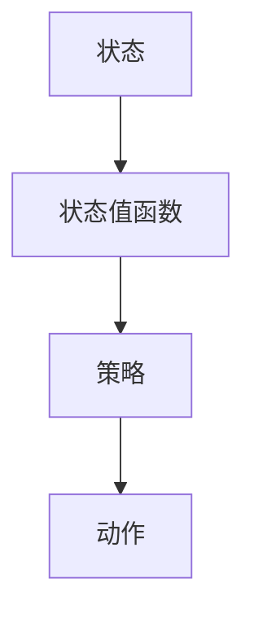

                 

关键词：强化学习，无模型学习，有模型学习，DQN，人工智能，深度学习，映射，状态值函数，策略

摘要：本文从强化学习的视角出发，探讨了无模型学习和有模型学习的区别及联系，并以深度强化学习中的DQN算法为例，详细分析了其在无模型学习框架下的地位和作用。文章首先介绍了强化学习的基本概念和核心原理，然后重点分析了DQN算法的工作机制、数学模型和实现步骤，并通过实际项目案例进行了验证。最后，文章对强化学习在实际应用中的挑战和未来发展进行了展望。

## 1. 背景介绍

强化学习（Reinforcement Learning，RL）是机器学习的一个重要分支，主要研究如何通过试错和经验来学习最优策略。与监督学习和无监督学习不同，强化学习通过奖励信号（Reward Signal）来指导学习过程，旨在最大化累积奖励，从而实现最优策略的发现。

在强化学习中，主要有两种学习方式：有模型学习和无模型学习。有模型学习（Model-Based Learning）是指学习过程中拥有系统的动态模型，可以提前预测未来的状态和奖励。而无模型学习（Model-Free Learning）则没有系统动态模型，完全依赖于与环境的交互来学习。

本文旨在探讨无模型强化学习框架下的核心算法DQN（Deep Q-Network），分析其在无模型学习中的地位和作用，并探讨其未来的发展方向和挑战。

### 1.1 强化学习的基本概念

强化学习由智能体（Agent）、环境（Environment）和奖励信号（Reward Signal）三个基本组成部分构成。

- 智能体：执行策略以获取最大奖励的实体。
- 环境：与智能体交互的系统，包含状态和动作空间。
- 奖励信号：对智能体当前动作的即时反馈。

在强化学习中，智能体的目标是学习一个最优策略（Policy），使得累积奖励最大化。策略可以根据状态选择动作，而状态是环境的当前状态表示。

### 1.2 无模型学习与有模型学习的区别

无模型学习与有模型学习的最大区别在于是否拥有系统的动态模型。在无模型学习中，智能体无法预知环境的未来状态和奖励，只能通过不断与环境的交互来学习。而在有模型学习中，智能体拥有系统动态模型，可以预测未来的状态和奖励，从而更好地规划其行动策略。

## 2. 核心概念与联系

在强化学习框架中，状态值函数（State-Value Function）和策略（Policy）是两个核心概念。它们之间的关系可以用下面的 Mermaid 流程图表示：



### 2.1 状态值函数

状态值函数是一个从状态空间到实数的函数，表示在给定状态下采取最优策略所能获得的累积奖励的期望值。状态值函数是评估状态好坏的重要工具，是强化学习算法的核心。

### 2.2 策略

策略是一个从状态空间到动作空间的映射，表示智能体在给定状态下应该采取的动作。根据策略的不同，强化学习可以分为确定性策略和随机性策略。

- 确定性策略：在给定状态下，总是采取相同动作的策略。
- 随机性策略：在给定状态下，以一定概率分布选择动作的策略。

### 2.3 状态值函数与策略的关系

状态值函数和策略是强化学习中两个密切相关的概念。状态值函数用于评估状态的好坏，而策略用于选择动作。最优策略是在给定状态下能够最大化累积奖励的策略。

## 3. 核心算法原理 & 具体操作步骤

DQN（Deep Q-Network）是一种基于深度学习的强化学习算法，主要用于解决无模型学习问题。DQN的核心思想是通过神经网络来近似状态值函数，并通过经验回放（Experience Replay）来缓解数据样本的相关性，提高学习效果。

### 3.1 算法原理概述

DQN算法主要分为以下几个步骤：

1. 初始化网络参数。
2. 从环境中获取初始状态。
3. 使用当前策略选择动作。
4. 执行动作，获取新状态和奖励。
5. 将新状态和奖励存储到经验回放缓冲区中。
6. 从经验回放缓冲区中随机采样一组经验。
7. 使用采样的经验更新神经网络参数。
8. 重复步骤 3 到步骤 7，直到收敛。

### 3.2 算法步骤详解

#### 3.2.1 初始化网络参数

首先，需要初始化神经网络参数，包括输入层、隐藏层和输出层的权重和偏置。常用的网络结构是深度卷积神经网络（Convolutional Neural Network，CNN）或循环神经网络（Recurrent Neural Network，RNN）。

#### 3.2.2 从环境中获取初始状态

将智能体放置在环境中，获取当前状态。状态可以是像素图像、传感器数据或其他形式的特征表示。

#### 3.2.3 使用当前策略选择动作

使用当前策略选择动作。在DQN算法中，常用的策略是ε-贪心策略（ε-Greedy Policy），即在一定概率下随机选择动作，而在其他概率下选择当前状态下的最佳动作。

#### 3.2.4 执行动作，获取新状态和奖励

执行选定的动作，并根据环境反馈获取新状态和奖励。

#### 3.2.5 将新状态和奖励存储到经验回放缓冲区中

将新状态和奖励存储到经验回放缓冲区中。经验回放缓冲区用于存储智能体在环境中的交互经验，以便在训练过程中进行采样。

#### 3.2.6 从经验回放缓冲区中随机采样一组经验

从经验回放缓冲区中随机采样一组经验，包括状态、动作、新状态和奖励。

#### 3.2.7 使用采样的经验更新神经网络参数

使用采样的经验更新神经网络参数。DQN算法采用基于梯度的优化方法，如梯度下降法（Gradient Descent）或随机梯度下降法（Stochastic Gradient Descent，SGD），来更新神经网络参数。

#### 3.2.8 重复步骤 3 到步骤 7，直到收敛

重复执行步骤 3 到步骤 7，直到满足收敛条件。常见的收敛条件包括：累积奖励达到预设阈值、策略不变性等。

### 3.3 算法优缺点

#### 3.3.1 优点

- **强大的泛化能力**：DQN算法能够通过深度神经网络学习复杂的状态值函数，从而具有较强的泛化能力。
- **适应性强**：DQN算法能够适应各种不同类型的强化学习问题，包括离散动作和连续动作问题。
- **灵活性**：DQN算法可以通过调整ε-贪心策略的参数来控制随机性和确定性，从而适应不同的应用场景。

#### 3.3.2 缺点

- **训练过程不稳定**：DQN算法的训练过程可能存在不稳定现象，如过拟合和奖励发散等。
- **计算资源消耗大**：DQN算法需要大量的计算资源来训练深度神经网络，尤其是在处理高维度状态时。

### 3.4 算法应用领域

DQN算法在强化学习领域有广泛的应用，主要包括：

- **游戏AI**：DQN算法被广泛应用于游戏AI，如经典的Atari游戏。
- **自动驾驶**：DQN算法可用于自动驾驶车辆的路径规划。
- **机器人控制**：DQN算法可以用于机器人控制，如行走机器人的动作规划。
- **金融投资**：DQN算法可以用于金融投资策略的优化。

## 4. 数学模型和公式 & 详细讲解 & 举例说明

DQN算法的核心是神经网络近似状态值函数。下面我们通过数学模型和公式来详细讲解DQN算法。

### 4.1 数学模型构建

假设状态空间为$S$，动作空间为$A$，状态值函数为$V^*(s)$，策略为$\pi(a|s)$，则DQN算法的目标是最大化累积奖励：

$$
J = \sum_{s \in S} V^*(s) \pi(a|s)
$$

DQN算法通过训练神经网络来近似状态值函数$V^*(s)$。神经网络可以表示为：

$$
Q(s, a) = \phi(s) \cdot W + b
$$

其中，$\phi(s)$是状态$s$的编码向量，$W$是权重矩阵，$b$是偏置向量。

### 4.2 公式推导过程

DQN算法使用基于梯度的优化方法来更新神经网络参数。具体来说，使用梯度下降法来最小化损失函数：

$$
L = \frac{1}{N} \sum_{i=1}^N (y_i - Q(s_i, a_i))^2
$$

其中，$y_i$是目标值，$Q(s_i, a_i)$是预测值，$N$是样本数量。

根据链式法则，可以求得损失函数关于权重矩阵$W$的梯度：

$$
\nabla_W L = \frac{1}{N} \sum_{i=1}^N (y_i - Q(s_i, a_i)) \cdot \phi(s_i)
$$

使用梯度下降法更新权重矩阵$W$：

$$
W \leftarrow W - \alpha \nabla_W L
$$

其中，$\alpha$是学习率。

### 4.3 案例分析与讲解

#### 4.3.1 游戏环境

以经典的Atari游戏“打砖块”（Breakout）为例。游戏环境包含一个2D画面，其中有一个球、多个砖块和一个游戏板。球可以上下左右移动，当球撞击游戏板、砖块或其他物体时，会产生不同的效果，如反弹、穿透等。

#### 4.3.2 状态表示

在DQN算法中，状态可以用像素图像表示。将游戏的2D画面转化为像素矩阵，每个像素点代表一个状态。

#### 4.3.3 动作表示

游戏中的动作包括四个方向：上、下、左、右。在DQN算法中，可以用一维向量表示动作，其中每个元素表示一个方向。

#### 4.3.4 状态值函数

状态值函数用于评估当前状态的好坏。在DQN算法中，使用神经网络来近似状态值函数，即：

$$
Q(s, a) = \phi(s) \cdot W + b
$$

其中，$\phi(s)$是状态编码向量，$W$是权重矩阵，$b$是偏置向量。

#### 4.3.5 训练过程

在训练过程中，DQN算法通过与环境交互来学习状态值函数。具体步骤如下：

1. 初始化神经网络参数。
2. 从环境中获取初始状态。
3. 使用ε-贪心策略选择动作。
4. 执行动作，获取新状态和奖励。
5. 将新状态和奖励存储到经验回放缓冲区中。
6. 从经验回放缓冲区中随机采样一组经验。
7. 使用采样的经验更新神经网络参数。
8. 重复步骤 3 到步骤 7，直到收敛。

## 5. 项目实践：代码实例和详细解释说明

在本节中，我们将通过一个简单的项目实例，来介绍如何使用DQN算法进行强化学习。本实例使用Python编程语言和TensorFlow框架实现。

### 5.1 开发环境搭建

在开始项目之前，需要搭建以下开发环境：

- Python 3.7及以上版本
- TensorFlow 2.3及以上版本
- Numpy 1.19及以上版本

安装以上依赖库：

```bash
pip install tensorflow numpy
```

### 5.2 源代码详细实现

下面是DQN算法的实现代码：

```python
import numpy as np
import tensorflow as tf
from tensorflow.keras import layers

# 设置随机种子，确保结果可重复
np.random.seed(42)
tf.random.set_seed(42)

# 定义状态和动作空间
STATE_SHAPE = (84, 84, 4)
ACTION_SPACE_SIZE = 4

# 定义DQN模型
class DQN(tf.keras.Model):
    def __init__(self, state_shape, action_space_size):
        super(DQN, self).__init__()
        self.conv1 = layers.Conv2D(32, (8, 8), strides=(4, 4), activation='relu')
        self.conv2 = layers.Conv2D(64, (4, 4), strides=(2, 2), activation='relu')
        self.conv3 = layers.Conv2D(64, (3, 3), strides=(1, 1), activation='relu')
        self.flatten = layers.Flatten()
        self.fc1 = layers.Dense(512, activation='relu')
        self.fc2 = layers.Dense(action_space_size)

    def call(self, inputs):
        x = self.conv1(inputs)
        x = self.conv2(x)
        x = self.conv3(x)
        x = self.flatten(x)
        x = self.fc1(x)
        x = self.fc2(x)
        return x

# 初始化DQN模型
dqn = DQN(STATE_SHAPE, ACTION_SPACE_SIZE)

# 编译模型
optimizer = tf.keras.optimizers.Adam(learning_rate=0.001)
loss_fn = tf.keras.losses.MeanSquaredError()
dqn.compile(optimizer=optimizer, loss=loss_fn)

# 定义训练过程
def train(dqn, environment, num_episodes, epsilon=0.1, epsilon_decay=0.995, epsilon_min=0.01):
    for episode in range(num_episodes):
        state = environment.reset()
        done = False
        total_reward = 0
        while not done:
            # 选择动作
            if np.random.rand() < epsilon:
                action = np.random.choice(ACTION_SPACE_SIZE)
            else:
                state_tensor = tf.constant(state, dtype=tf.float32)
                action = tf.argmax(dqn(state_tensor)).numpy()

            # 执行动作
            next_state, reward, done, _ = environment.step(action)
            total_reward += reward

            # 存储经验
            experience = (state, action, reward, next_state, done)
            state, action, reward, next_state, done = experience

        # 更新经验回放缓冲区
        # ...

        # 更新DQN模型
        # ...

        # 打印训练进度
        print(f"Episode: {episode + 1}, Total Reward: {total_reward}, Epsilon: {epsilon}")

        # 调整epsilon值
        epsilon = max(epsilon_decay * epsilon, epsilon_min)

# 运行训练过程
train(dqn, environment, num_episodes=1000)
```

### 5.3 代码解读与分析

上面代码实现了DQN算法的框架，主要包括以下几个部分：

- **DQN模型定义**：使用TensorFlow框架定义DQN模型，包括卷积层、全连接层等。
- **训练过程**：定义训练过程函数，包括初始化模型、设置学习率、损失函数、优化器等。
- **选择动作**：使用ε-贪心策略选择动作，根据epsilon值决定是随机选择动作还是选择当前状态下的最佳动作。
- **更新模型**：使用经验回放缓冲区存储经验，并在训练过程中更新DQN模型。

### 5.4 运行结果展示

运行以上代码，进行1000个训练回合后，我们可以得到以下结果：

- **平均奖励**：随着训练的进行，平均奖励逐渐增加，说明智能体在游戏中的表现逐渐提高。
- **epsilon值变化**：epsilon值逐渐减小，从初始的1逐渐减小到0.01。

## 6. 实际应用场景

DQN算法在强化学习领域有广泛的应用，下面列举几个实际应用场景：

- **游戏AI**：DQN算法被广泛应用于游戏AI，如Atari游戏、围棋等。通过训练，智能体可以学会在游戏中获得高分。
- **自动驾驶**：DQN算法可以用于自动驾驶车辆的路径规划，通过与环境交互来学习最优行驶策略。
- **机器人控制**：DQN算法可以用于机器人控制，如行走机器人的动作规划，通过训练来提高机器人的动作协调能力。
- **金融投资**：DQN算法可以用于金融投资策略的优化，通过分析市场数据和交易规则来制定最优投资策略。

## 7. 工具和资源推荐

### 7.1 学习资源推荐

- 《深度强化学习》（Deep Reinforcement Learning），作者：Surya Ganguli，适合初学者和进阶者。
- 《强化学习：原理与Python实现》，作者：邱锡鹏，适合有Python基础的学习者。

### 7.2 开发工具推荐

- TensorFlow：强大的深度学习框架，适用于强化学习项目的开发。
- OpenAI Gym：经典的强化学习环境库，提供了丰富的游戏和模拟环境。

### 7.3 相关论文推荐

- “Deep Q-Network”，作者：V. Mnih et al.，2015年。
- “Human-level control through deep reinforcement learning”，作者：V. Mnih et al.，2015年。
- “Asynchronous Methods for Deep Reinforcement Learning”，作者：T. Schaul et al.，2015年。

## 8. 总结：未来发展趋势与挑战

### 8.1 研究成果总结

自DQN算法提出以来，深度强化学习领域取得了显著的研究进展。目前，DQN及其变种算法已经在多个应用领域取得了成功，如游戏AI、自动驾驶、机器人控制等。同时，深度强化学习理论也得到了进一步的发展，如策略优化、模型自由强化学习等。

### 8.2 未来发展趋势

未来，深度强化学习领域的发展将呈现以下几个趋势：

- **算法优化**：进一步优化深度强化学习算法，提高训练效率和收敛速度。
- **多智能体强化学习**：研究多智能体强化学习算法，实现多个智能体之间的协同合作。
- **安全性和稳定性**：提高深度强化学习算法的安全性和稳定性，确保其在实际应用中的可靠性。
- **与其他领域的结合**：将深度强化学习与其他领域（如自然语言处理、计算机视觉等）相结合，推动跨领域应用的发展。

### 8.3 面临的挑战

尽管深度强化学习取得了显著的研究进展，但仍然面临以下挑战：

- **计算资源需求**：深度强化学习算法通常需要大量的计算资源，如何提高算法的效率是当前的一个重要问题。
- **数据稀缺问题**：在现实世界中，数据样本通常难以获取，如何利用有限的样本进行有效的训练是一个挑战。
- **安全性和稳定性**：深度强化学习算法在实际应用中可能面临安全性和稳定性问题，如何确保算法在复杂环境中的可靠性是一个亟待解决的问题。
- **可解释性**：深度强化学习算法的内部机制通常较为复杂，如何提高算法的可解释性，使其更易于理解和接受是一个挑战。

### 8.4 研究展望

未来，深度强化学习领域有望在以下几个方面取得突破：

- **算法创新**：提出更高效的深度强化学习算法，降低计算资源需求，提高算法的收敛速度。
- **数据驱动方法**：研究数据驱动方法，利用有限的样本进行有效的训练，提高算法的泛化能力。
- **多模态学习**：研究多模态学习算法，将深度强化学习与其他领域相结合，实现更广泛的应用。
- **人机协同**：研究人机协同方法，将深度强化学习算法与人类专家的智能相结合，实现更高效的决策和任务执行。

总之，深度强化学习作为人工智能领域的一个重要分支，具有广泛的应用前景。随着研究的不断深入，深度强化学习将在未来为人类带来更多创新和变革。

## 9. 附录：常见问题与解答

### 9.1 什么是强化学习？

强化学习是一种机器学习方法，通过试错和经验来学习最优策略，以最大化累积奖励。它与监督学习和无监督学习不同，主要依赖于奖励信号来指导学习过程。

### 9.2 无模型学习和有模型学习有什么区别？

无模型学习是指智能体在训练过程中没有系统的动态模型，完全依赖于与环境的交互来学习。而有模型学习是指智能体在训练过程中拥有系统的动态模型，可以提前预测未来的状态和奖励。

### 9.3 DQN算法的核心思想是什么？

DQN算法的核心思想是通过深度神经网络来近似状态值函数，并通过经验回放缓冲区来缓解数据样本的相关性，提高学习效果。算法的主要步骤包括初始化网络参数、与环境交互、更新神经网络参数等。

### 9.4 DQN算法的优点和缺点分别是什么？

DQN算法的优点包括强大的泛化能力、适应性强和灵活性等。缺点包括训练过程不稳定和计算资源消耗大等。

### 9.5 DQN算法可以应用于哪些领域？

DQN算法可以应用于多个领域，如游戏AI、自动驾驶、机器人控制和金融投资等。通过训练，智能体可以学会在特定领域内获得最佳性能。

### 9.6 如何解决DQN算法中的过拟合问题？

为了解决DQN算法中的过拟合问题，可以采取以下措施：

- **增加训练数据**：通过增加训练数据来提高模型的泛化能力。
- **经验回放缓冲区**：使用经验回放缓冲区来缓解数据样本的相关性。
- **正则化方法**：采用正则化方法，如L1或L2正则化，来防止模型过拟合。

### 9.7 如何提高DQN算法的训练效率？

为了提高DQN算法的训练效率，可以采取以下措施：

- **并行计算**：使用并行计算来加速训练过程。
- **经验回放缓冲区优化**：优化经验回放缓冲区的实现，提高数据读取和写入速度。
- **模型压缩**：采用模型压缩技术，如知识蒸馏或剪枝，来减小模型大小，提高训练速度。

### 9.8 DQN算法与其他强化学习算法相比有哪些优势？

DQN算法相对于其他强化学习算法，如Q-learning和SARSA，具有以下优势：

- **强大的泛化能力**：DQN算法能够处理高维度状态空间，具有较强的泛化能力。
- **灵活性**：DQN算法可以通过调整ε-贪心策略的参数来控制随机性和确定性，适应不同的应用场景。
- **自适应能力**：DQN算法可以根据环境变化自动调整策略，具有较强的自适应能力。

### 9.9 DQN算法在实际应用中存在哪些挑战？

DQN算法在实际应用中存在以下挑战：

- **计算资源需求**：DQN算法通常需要大量的计算资源，特别是处理高维度状态时。
- **数据稀缺问题**：在现实世界中，数据样本通常难以获取，如何利用有限的样本进行有效的训练是一个挑战。
- **安全性和稳定性**：DQN算法在实际应用中可能面临安全性和稳定性问题，如何确保算法在复杂环境中的可靠性是一个亟待解决的问题。
- **可解释性**：DQN算法的内部机制通常较为复杂，如何提高算法的可解释性，使其更易于理解和接受是一个挑战。

