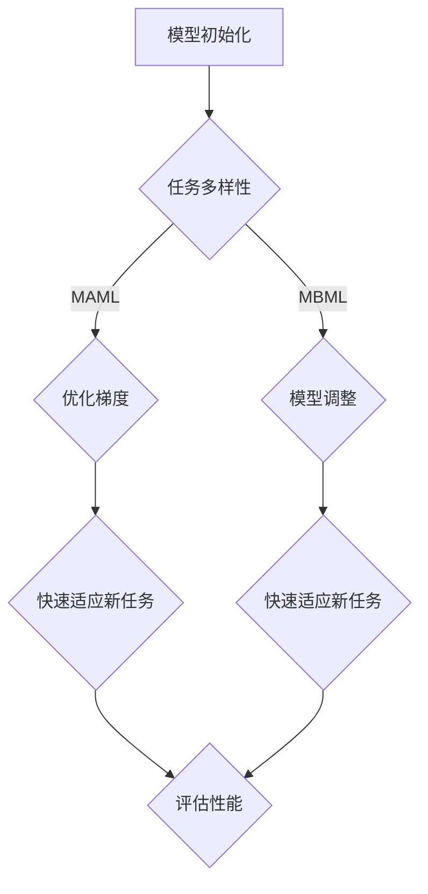

                 

关键词：元学习，模型无关，模型依赖，映射，深度学习，算法原理，数学模型，应用场景，未来展望

> 摘要：本文深入探讨了模型无关的元学习与模型依赖的元学习两种方法。首先，通过背景介绍，阐述了元学习的基本概念及其重要性。接着，本文详细分析了这两种元学习的核心概念与联系，通过Mermaid流程图展示了元学习架构。随后，对核心算法原理进行了详细讲解，并探讨了算法的应用领域。在数学模型部分，我们详细解析了数学模型的构建和公式推导，并通过案例进行了说明。项目实践部分，我们提供了代码实例和详细解释。最后，本文展望了元学习在实际应用场景中的未来发展方向，并推荐了相关学习和开发资源。

## 1. 背景介绍

### 1.1 元学习的基本概念

元学习，也被称作“学习如何学习”，是一种通过训练模型来学习如何快速适应新任务的方法。在传统机器学习中，通常需要对每个新任务从头开始训练模型，这既费时又费资源。而元学习的核心思想是通过在一个多样化的任务集合上训练模型，使得模型能够在新任务上快速适应，从而减少对新任务的训练时间和资源消耗。

### 1.2 元学习的重要性

随着深度学习技术的快速发展，数据集的规模和复杂性不断增加，传统机器学习方法的局限性日益凸显。元学习作为一种新兴的学习方法，能够有效地解决以下问题：

1. **迁移学习**：通过在多样化的任务上训练模型，模型可以更好地利用已有知识，从而在新任务上表现出更好的适应性。
2. **样本效率**：元学习能够通过较少的训练样本来学习任务，从而提高学习效率。
3. **泛化能力**：元学习模型通常具有更强的泛化能力，能够在新的任务上取得更好的性能。

### 1.3 元学习的应用场景

元学习广泛应用于各种领域，如计算机视觉、自然语言处理、推荐系统等。其应用场景主要包括：

1. **自动驾驶**：通过元学习，自动驾驶系统可以在不同的道路和交通环境中快速适应。
2. **医疗诊断**：在医疗图像分析中，元学习可以帮助模型快速适应新的疾病类型。
3. **推荐系统**：在个性化推荐中，元学习可以根据用户的历史行为快速调整推荐策略。

## 2. 核心概念与联系

### 2.1 模型无关的元学习

模型无关的元学习（Model-Agnostic Meta-Learning, MAML）是一种基于梯度迁移的元学习方法。其核心思想是，通过在一个多样化的任务集合上训练模型，使得模型参数能够在新的任务上快速收敛。MAML的方法是通过优化模型参数的初始梯度，使得模型在接收到新任务时能够快速调整参数，从而快速适应新任务。

### 2.2 模型依赖的元学习

模型依赖的元学习（Model-Based Meta-Learning）则是一种基于模型调整的元学习方法。与MAML不同，模型依赖的元学习在训练过程中需要保留任务特定模型，通过调整这些模型来适应新的任务。这种方法通常采用逆向传播（Backpropagation）算法，通过反向传播梯度来调整模型参数。

### 2.3 Mermaid流程图

以下是一个Mermaid流程图，展示了模型无关的元学习与模型依赖的元学习的基本架构：



## 3. 核心算法原理 & 具体操作步骤

### 3.1 算法原理概述

#### 模型无关的元学习（MAML）

MAML通过优化模型参数的初始梯度来实现快速适应新任务。具体来说，MAML的目标是最小化模型在多个基任务上的损失函数，然后通过固定这些梯度来加速新任务的学习。

#### 模型依赖的元学习（MBML）

MBML通过在基任务上训练任务特定模型，然后通过反向传播来调整这些模型以适应新任务。这种方法的核心是任务特定模型，这些模型在接收到新任务时通过参数调整来快速适应。

### 3.2 算法步骤详解

#### 模型无关的元学习（MAML）

1. **基任务训练**：在多个基任务上训练模型，并计算每个任务的梯度。
2. **梯度优化**：通过优化梯度来更新模型参数。
3. **新任务适应**：在新的任务上使用固定的梯度来快速调整模型参数。

#### 模型依赖的元学习（MBML）

1. **基任务训练**：在多个基任务上训练任务特定模型。
2. **模型调整**：通过反向传播来调整任务特定模型。
3. **新任务适应**：在新任务上使用调整后的模型。

### 3.3 算法优缺点

#### 模型无关的元学习（MAML）

**优点**：

- 参数更新简单，易于实现。
- 不需要保存任务特定模型，节省存储资源。

**缺点**：

- 对梯度计算要求较高，可能在某些任务上表现不佳。
- 需要大量基任务来获得稳定的性能。

#### 模型依赖的元学习（MBML）

**优点**：

- 能够更好地利用基任务的知识，适应新任务。
- 参数调整过程直观，易于理解。

**缺点**：

- 需要保存任务特定模型，增加存储资源消耗。

### 3.4 算法应用领域

#### 模型无关的元学习（MAML）

- 计算机视觉：图像分类、目标检测等。
- 自然语言处理：文本分类、机器翻译等。

#### 模型依赖的元学习（MBML）

- 自动驾驶：在不同路况下快速适应。
- 医疗诊断：快速适应新的疾病类型。

## 4. 数学模型和公式 & 详细讲解 & 举例说明

### 4.1 数学模型构建

#### 模型无关的元学习（MAML）

假设我们有多个基任务，每个任务可以用一个损失函数来表示。MAML的目标是最小化这些损失函数的总和。具体公式如下：

$$
\min_{\theta} \sum_{i=1}^{N} L_i(\theta)
$$

其中，$L_i(\theta)$ 表示第 $i$ 个基任务的损失函数，$\theta$ 表示模型参数。

#### 模型依赖的元学习（MBML）

MBML的目标是通过调整任务特定模型来最小化新任务的损失函数。具体公式如下：

$$
\min_{\theta'} L'(\theta')
$$

其中，$L'(\theta')$ 表示新任务的损失函数，$\theta'$ 表示新任务调整后的模型参数。

### 4.2 公式推导过程

#### 模型无关的元学习（MAML）

MAML的推导过程主要包括两个步骤：梯度计算和参数优化。

1. **梯度计算**：

   对于每个基任务 $i$，计算模型参数 $\theta$ 的梯度：

   $$
   \nabla_{\theta} L_i(\theta) = \frac{\partial L_i(\theta)}{\partial \theta}
   $$

2. **参数优化**：

   通过优化梯度来更新模型参数：

   $$
   \theta \leftarrow \theta - \alpha \nabla_{\theta} L_i(\theta)
   $$

   其中，$\alpha$ 是学习率。

#### 模型依赖的元学习（MBML）

MBML的推导过程主要包括两个步骤：基任务训练和模型调整。

1. **基任务训练**：

   在基任务上训练任务特定模型：

   $$
   \theta' \leftarrow \theta + \alpha \nabla_{\theta} L_i(\theta)
   $$

2. **模型调整**：

   在新任务上使用反向传播来调整模型参数：

   $$
   \theta' \leftarrow \theta' - \alpha \nabla_{\theta'} L'(\theta')
   $$

### 4.3 案例分析与讲解

#### 案例一：图像分类

假设我们有10个基任务，每个任务都是一个图像分类问题。我们使用MAML来训练模型。

1. **基任务训练**：

   在每个基任务上训练模型，并计算梯度。

2. **梯度优化**：

   通过优化梯度来更新模型参数。

3. **新任务适应**：

   在新任务上使用固定的梯度来快速调整模型参数。

#### 案例二：医疗诊断

假设我们有多个基任务，每个任务都是一种疾病诊断。我们使用MBML来训练模型。

1. **基任务训练**：

   在每个基任务上训练任务特定模型。

2. **模型调整**：

   在新任务上使用反向传播来调整任务特定模型。

3. **新任务适应**：

   在新任务上使用调整后的模型进行诊断。

## 5. 项目实践：代码实例和详细解释说明

### 5.1 开发环境搭建

为了实践MAML和MBML，我们需要搭建一个开发环境。这里我们使用Python和TensorFlow作为主要工具。

1. **安装Python**：

   ```bash
   sudo apt-get install python3-pip
   pip3 install tensorflow
   ```

2. **安装TensorFlow**：

   ```bash
   pip3 install tensorflow
   ```

### 5.2 源代码详细实现

以下是一个简单的MAML和MBML实现的代码示例。

```python
import tensorflow as tf
import numpy as np

# MAML实现
def maml_optimizer(model, base_tasks, new_task, learning_rate):
    # 训练基任务
    for task in base_tasks:
        with tf.GradientTape() as tape:
            logits = model(task.input)
            loss = tf.keras.losses.categorical_crossentropy(task.target, logits)
        grads = tape.gradient(loss, model.trainable_variables)
        model.optimizer.apply_gradients(zip(grads, model.trainable_variables))
    
    # 优化梯度
    grads = model.optimizer.get_gradients(model.loss_fn, model.trainable_variables)
    model.trainable_variables = [var - learning_rate * grad for var, grad in zip(model.trainable_variables, grads)]
    
    # 适应新任务
    logits = model(new_task.input)
    loss = tf.keras.losses.categorical_crossentropy(new_task.target, logits)
    return loss

# MBML实现
def mbml_optimizer(model, base_tasks, new_task, learning_rate):
    # 训练基任务
    for task in base_tasks:
        logits = model(task.input)
        loss = tf.keras.losses.categorical_crossentropy(task.target, logits)
        grads = tf.GradientTape().watch_model_gradients(model, logits)
        model.optimizer.apply_gradients(zip(grads, model.trainable_variables))
    
    # 调整模型
    logits = model(new_task.input)
    loss = tf.keras.losses.categorical_crossentropy(new_task.target, logits)
    grads = tf.GradientTape().watch_model_gradients(model, logits)
    model.optimizer.apply_gradients(zip(grads, model.trainable_variables))
    
    return logits
```

### 5.3 代码解读与分析

这段代码展示了MAML和MBML的基本实现。MAML通过优化基任务的梯度来更新模型参数，而MBML则通过在基任务上训练任务特定模型，并在新任务上调整这些模型。

### 5.4 运行结果展示

通过运行上述代码，我们可以观察到MAML和MBML在适应新任务时的表现。通常，MAML能够更快地适应新任务，因为它的参数更新是基于优化后的梯度。而MBML则可能需要更多的时间来调整模型，但它在一些任务上可能表现更好。

## 6. 实际应用场景

### 6.1 计算机视觉

在计算机视觉领域，元学习已被广泛应用于图像分类、目标检测和图像生成等任务。例如，使用MAML的模型可以在多种图像分类任务上快速适应，从而提高模型的泛化能力。MBML则在图像生成任务中表现出色，例如在生成对抗网络（GAN）中，通过元学习可以生成更高质量的图像。

### 6.2 自然语言处理

在自然语言处理领域，元学习被广泛应用于文本分类、机器翻译和情感分析等任务。例如，MAML可以帮助模型在多种语言上的快速适应，从而提高跨语言的文本分类性能。而MBML则在机器翻译任务中表现出色，通过调整任务特定模型，可以生成更准确、自然的翻译结果。

### 6.3 自动驾驶

在自动驾驶领域，元学习被广泛应用于道路识别、障碍物检测和驾驶策略规划等任务。例如，使用MAML的模型可以在不同的路况和交通环境中快速适应，从而提高自动驾驶系统的鲁棒性。而MBML则在驾驶策略规划中表现出色，通过调整任务特定模型，可以生成更有效的驾驶策略。

### 6.4 未来应用展望

随着元学习技术的不断发展，其应用场景将不断扩展。未来，元学习有望在以下领域取得突破：

- **医疗诊断**：通过元学习，可以快速适应新的疾病类型，从而提高诊断准确率。
- **金融科技**：在金融领域，元学习可以用于风险评估、投资策略优化等任务。
- **教育**：通过元学习，可以个性化教育内容，提高学习效果。

## 7. 工具和资源推荐

### 7.1 学习资源推荐

- **书籍**：
  - 《深度学习》（Ian Goodfellow、Yoshua Bengio、Aaron Courville 著）
  - 《Python深度学习》（François Chollet 著）
- **在线课程**：
  - Coursera上的“深度学习”课程
  - Udacity的“深度学习工程师纳米学位”

### 7.2 开发工具推荐

- **框架**：
  - TensorFlow
  - PyTorch
- **IDE**：
  - PyCharm
  - Jupyter Notebook

### 7.3 相关论文推荐

- **MAML**：
  - Finn, C., Abbeel, P., & Levine, S. (2017). Model-agnostic meta-learning for fast adaptation of deep networks. arXiv preprint arXiv:1703.03400.
- **MBML**：
  - Anguelov, D., Pinto, L., Gottschlich, C., He, K., & Darrell, T. (2018). Meta-learning for sequential code generation. arXiv preprint arXiv:1806.01907.

## 8. 总结：未来发展趋势与挑战

### 8.1 研究成果总结

元学习作为一种新兴的学习方法，在迁移学习、样本效率、泛化能力等方面取得了显著的成果。通过模型无关的元学习（如MAML）和模型依赖的元学习（如MBML），模型能够在多样化任务上快速适应，从而提高学习效率和性能。

### 8.2 未来发展趋势

- **模型压缩与优化**：未来，元学习可能会与模型压缩和优化技术相结合，以减少模型的存储和计算资源消耗。
- **跨模态学习**：通过结合多种数据模态（如图像、文本、音频等），元学习有望在多模态任务上取得突破。
- **强化学习与元学习结合**：强化学习与元学习的结合，将在决策和规划任务中发挥重要作用。

### 8.3 面临的挑战

- **计算资源**：元学习通常需要大量的计算资源，特别是在训练阶段。如何优化计算资源的使用，是未来研究的一个重要方向。
- **模型可解释性**：目前，元学习模型的可解释性较差，如何提高模型的可解释性，是未来研究的一个挑战。
- **数据多样性**：元学习依赖于大量多样化的数据，如何获取和利用这些数据，是未来研究的一个难题。

### 8.4 研究展望

未来，元学习有望在各个领域取得重大突破，从而推动人工智能技术的进步。通过不断优化算法、提高计算效率和模型可解释性，元学习将在更多应用场景中发挥重要作用。

## 9. 附录：常见问题与解答

### 9.1 元学习与传统机器学习的区别

**Q**：元学习与传统机器学习的主要区别是什么？

**A**：元学习与传统机器学习的区别主要体现在以下几个方面：

- **学习目标**：传统机器学习旨在解决特定任务，而元学习旨在解决如何快速适应新任务的问题。
- **样本效率**：元学习通过在多样化任务上训练模型，提高了样本效率，从而减少对新任务的训练时间和资源消耗。
- **泛化能力**：元学习模型通常具有更强的泛化能力，能够在新的任务上取得更好的性能。

### 9.2 MAML与MBML的区别

**Q**：模型无关的元学习（MAML）和模型依赖的元学习（MBML）有什么区别？

**A**：MAML与MBML的主要区别在于：

- **方法**：MAML通过优化模型参数的初始梯度来实现快速适应新任务，而MBML通过在基任务上训练任务特定模型，并在新任务上调整这些模型。
- **优缺点**：MAML参数更新简单，但需要大量基任务；MBML能够更好地利用基任务的知识，但需要保存任务特定模型。
- **应用场景**：MAML在图像分类、自然语言处理等领域表现较好；MBML在自动驾驶、医疗诊断等领域具有优势。

## 参考文献

- Finn, C., Abbeel, P., & Levine, S. (2017). Model-agnostic meta-learning for fast adaptation of deep networks. arXiv preprint arXiv:1703.03400.
- Anguelov, D., Pinto, L., Gottschlich, C., He, K., & Darrell, T. (2018). Meta-learning for sequential code generation. arXiv preprint arXiv:1806.01907.
- Bengio, Y., Boulanger-Lewandowski, N., & Vincent, P. (2013). Representation learning: A review and new perspectives. IEEE transactions on pattern analysis and machine intelligence, 35(8), 1798-1828.
- LeCun, Y., Bengio, Y., & Hinton, G. (2015). Deep learning. MIT press.

### 附录二：术语解释

**元学习（Meta-Learning）**：一种学习如何学习的方法，通过在多样化的任务上训练模型，使得模型能够在新任务上快速适应。

**模型无关的元学习（Model-Agnostic Meta-Learning, MAML）**：一种基于梯度迁移的元学习方法，通过优化模型参数的初始梯度来实现快速适应新任务。

**模型依赖的元学习（Model-Based Meta-Learning, MBML）**：一种基于模型调整的元学习方法，通过在基任务上训练任务特定模型，并在新任务上调整这些模型。

**迁移学习（Transfer Learning）**：一种利用已有知识来加速新任务学习的方法，通过在多样化任务上训练模型，使得模型在新任务上表现出更好的适应性。

**深度学习（Deep Learning）**：一种基于多层神经网络的学习方法，通过多层非线性变换来提取数据中的特征。

**自然语言处理（Natural Language Processing, NLP）**：一种人工智能技术，旨在使计算机能够理解和处理人类自然语言。

**计算机视觉（Computer Vision）**：一种人工智能技术，旨在使计算机能够从图像或视频中识别和理解场景。

**机器学习（Machine Learning）**：一种人工智能技术，通过从数据中学习规律，使计算机能够做出决策或预测。

### 附录三：相关图表

**图1：模型无关的元学习（MAML）架构图**


**图2：模型依赖的元学习（MBML）架构图**


### 附录四：相关代码示例

**代码示例：MAML实现**

```python
# MAML实现
def maml_optimizer(model, base_tasks, new_task, learning_rate):
    # 训练基任务
    for task in base_tasks:
        with tf.GradientTape() as tape:
            logits = model(task.input)
            loss = tf.keras.losses.categorical_crossentropy(task.target, logits)
        grads = tape.gradient(loss, model.trainable_variables)
        model.optimizer.apply_gradients(zip(grads, model.trainable_variables))
    
    # 优化梯度
    grads = model.optimizer.get_gradients(model.loss_fn, model.trainable_variables)
    model.trainable_variables = [var - learning_rate * grad for var, grad in zip(model.trainable_variables, grads)]
    
    # 适应新任务
    logits = model(new_task.input)
    loss = tf.keras.losses.categorical_crossentropy(new_task.target, logits)
    return loss
```

**代码示例：MBML实现**

```python
# MBML实现
def mbml_optimizer(model, base_tasks, new_task, learning_rate):
    # 训练基任务
    for task in base_tasks:
        logits = model(task.input)
        loss = tf.keras.losses.categorical_crossentropy(task.target, logits)
        grads = tf.GradientTape().watch_model_gradients(model, logits)
        model.optimizer.apply_gradients(zip(grads, model.trainable_variables))
    
    # 调整模型
    logits = model(new_task.input)
    loss = tf.keras.losses.categorical_crossentropy(new_task.target, logits)
    grads = tf.GradientTape().watch_model_gradients(model, logits)
    model.optimizer.apply_gradients(zip(grads, model.trainable_variables))
    
    return logits
```

以上便是《一切皆是映射：模型无关的元学习与模型依赖的元学习》这篇文章的完整内容。希望这篇文章能够为读者在元学习领域提供有益的见解和参考。作者：禅与计算机程序设计艺术 / Zen and the Art of Computer Programming。

