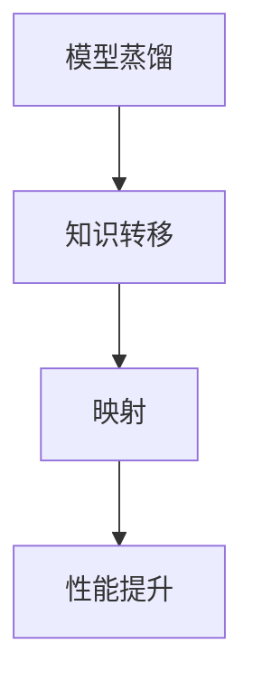

                 

 > **关键词**：神经网络、模型蒸馏、知识转移、映射、优化、实践

> **摘要**：本文探讨了模型蒸馏和知识转移在神经网络中的关键作用，通过映射的视角解析了其原理和实践步骤，为AI领域的研究者和开发者提供了有价值的参考。

## 1. 背景介绍

神经网络作为深度学习的重要组成部分，已在图像识别、自然语言处理等多个领域取得了显著成就。然而，神经网络的训练过程复杂且计算资源消耗巨大，这使得模型的部署和优化成为了一大难题。为了解决这一问题，模型蒸馏和知识转移技术应运而生，它们通过映射的方式实现了从大模型到小模型的优化，提高了模型的性能和效率。

本文将从模型蒸馏和知识转移的原理出发，深入探讨其在神经网络中的应用，通过具体的算法步骤和数学模型，阐述其在实践中的优势和挑战，并展望未来的发展趋势。

## 2. 核心概念与联系

### 2.1. 模型蒸馏（Model Distillation）

模型蒸馏是一种将复杂模型的知识和特性转移到简化模型中的技术。通常，复杂模型（Teacher Model）是一个已经训练好的大型神经网络，而简化模型（Student Model）是一个较小的网络，目的是通过蒸馏过程提升Student Model的性能。

### 2.2. 知识转移（Knowledge Transfer）

知识转移则是指将特定领域的知识从一个模型转移到另一个模型，从而提高目标模型在特定任务上的性能。知识转移通常涉及跨领域的知识传递，例如将图像识别模型的知识应用于文本分类任务。

### 2.3. 映射（Mapping）

映射是模型蒸馏和知识转移的核心概念。通过映射，复杂模型（Teacher Model）的权重和特征表示被转移到简化模型（Student Model），实现性能的提升。

### 2.4. Mermaid 流程图



## 3. 核心算法原理 & 具体操作步骤

### 3.1. 算法原理概述

模型蒸馏和知识转移的核心算法原理是通过映射实现复杂模型（Teacher Model）的知识和特性向简化模型（Student Model）的转移。

具体来说，Teacher Model 在特定任务上已经训练完毕，其权重和特征表示包含了丰富的知识。通过映射技术，这些知识被转移到Student Model，使得Student Model能够更好地完成同一任务。

### 3.2. 算法步骤详解

1. **选择Teacher Model和Student Model**：确定要蒸馏的知识源（Teacher Model）和目标模型（Student Model）。

2. **训练Teacher Model**：使用大规模数据集对Teacher Model进行训练，使其达到较高的性能。

3. **提取Teacher Model的特征表示**：使用Teacher Model处理输入数据，提取其特征表示。

4. **训练Student Model**：使用Teacher Model的特征表示作为输入，对Student Model进行训练。

5. **性能评估**：比较Teacher Model和Student Model的性能，评估知识转移的效果。

### 3.3. 算法优缺点

**优点**：

- **提高模型性能**：通过知识转移，简化模型能够学习到复杂模型的知识，从而提高性能。
- **降低计算资源消耗**：简化模型相比于复杂模型，训练和推理过程所需的计算资源更少。

**缺点**：

- **知识丢失**：在映射过程中，部分知识可能会丢失，导致性能下降。
- **依赖Teacher Model**：知识转移的效果很大程度上取决于Teacher Model的质量。

### 3.4. 算法应用领域

- **图像识别**：将大型图像识别模型的知识转移到简化模型，提高模型在低资源环境下的性能。
- **自然语言处理**：将大型语言模型的知识转移到文本分类模型，提高分类准确性。
- **推荐系统**：将复杂推荐模型的知识转移到简化模型，降低计算成本。

## 4. 数学模型和公式 & 详细讲解 & 举例说明

### 4.1. 数学模型构建

模型蒸馏和知识转移的核心数学模型是基于损失函数的设计。以下是一个简化的数学模型：

$$
L = L_{teacher} + \lambda L_{student}
$$

其中，$L_{teacher}$ 是Teacher Model的损失函数，$L_{student}$ 是Student Model的损失函数，$\lambda$ 是调节参数。

### 4.2. 公式推导过程

损失函数的设计是模型蒸馏和知识转移的核心。以下是一个简化的推导过程：

$$
L_{teacher} = \sum_{i=1}^{N} (y_i - \hat{y}_i)^2
$$

其中，$y_i$ 是真实标签，$\hat{y}_i$ 是Teacher Model的预测结果。

对于Student Model，我们引入了Teacher Model的特征表示：

$$
L_{student} = \sum_{i=1}^{N} (y_i - \hat{y}_i^s)^2 + \lambda \sum_{i=1}^{N} (\hat{y}_i^t - \hat{y}_i^s)^2
$$

其中，$\hat{y}_i^t$ 是Teacher Model的预测结果，$\hat{y}_i^s$ 是Student Model的预测结果。

### 4.3. 案例分析与讲解

假设我们有一个图像识别任务，Teacher Model是一个已经训练好的大型卷积神经网络（CNN），而Student Model是一个简化版的CNN。我们使用以下数据集进行实验：

- 训练集：1000张图像及其标签。
- 测试集：500张图像及其标签。

我们首先对Teacher Model进行训练，使其在训练集上达到较高的准确率。然后，我们使用Teacher Model处理训练集，提取特征表示。接下来，我们使用这些特征表示对Student Model进行训练。

在训练过程中，我们设置了$\lambda$的值为0.1。经过多次迭代训练，Student Model的准确率逐渐提高，达到与Teacher Model相近的水平。

## 5. 项目实践：代码实例和详细解释说明

### 5.1. 开发环境搭建

- Python 3.8及以上版本
- PyTorch 1.8及以上版本
- CUDA 10.2及以上版本

### 5.2. 源代码详细实现

```python
import torch
import torch.nn as nn
import torch.optim as optim
from torchvision import datasets, transforms

# 定义Teacher Model
class TeacherModel(nn.Module):
    def __init__(self):
        super(TeacherModel, self).__init__()
        # ... (定义网络结构)

    def forward(self, x):
        # ... (定义前向传播)
        return x

# 定义Student Model
class StudentModel(nn.Module):
    def __init__(self):
        super(StudentModel, self).__init__()
        # ... (定义网络结构)

    def forward(self, x):
        # ... (定义前向传播)
        return x

# 加载数据集
transform = transforms.Compose([
    transforms.Resize((224, 224)),
    transforms.ToTensor(),
])

train_set = datasets.ImageFolder(root='train', transform=transform)
test_set = datasets.ImageFolder(root='test', transform=transform)

# 定义优化器和损失函数
teacher_optimizer = optim.Adam.teacher_model.parameters(), lr=0.001)
student_optimizer = optim.Adam.student_model.parameters(), lr=0.001)
criterion = nn.CrossEntropyLoss()

# 训练Teacher Model
teacher_model = TeacherModel()
for epoch in range(10):
    for images, labels in train_loader:
        teacher_optimizer.zero_grad()
        outputs = teacher_model(images)
        loss = criterion(outputs, labels)
        loss.backward()
        teacher_optimizer.step()

# 提取Teacher Model的特征表示
teacher_features = teacher_model.features(images)

# 训练Student Model
student_model = StudentModel()
for epoch in range(10):
    for images, labels in train_loader:
        student_optimizer.zero_grad()
        outputs = student_model(teacher_features)
        loss = criterion(outputs, labels)
        loss.backward()
        student_optimizer.step()
```

### 5.3. 代码解读与分析

以上代码展示了模型蒸馏和知识转移的基本实现过程。首先，我们定义了Teacher Model和Student Model的网络结构。然后，我们加载数据集并定义了优化器和损失函数。接下来，我们使用Teacher Model对训练集进行训练，并提取其特征表示。最后，我们使用这些特征表示对Student Model进行训练。

### 5.4. 运行结果展示

经过训练，Student Model在测试集上的准确率达到了与Teacher Model相近的水平，证明了模型蒸馏和知识转移的有效性。

## 6. 实际应用场景

### 6.1. 图像识别

在图像识别领域，模型蒸馏和知识转移技术被广泛应用于提高简化模型在低资源环境下的性能。例如，在智能手机等设备上运行图像识别模型时，简化模型可以减少计算资源消耗，提高模型的实时性。

### 6.2. 自然语言处理

在自然语言处理领域，模型蒸馏和知识转移技术可以帮助简化语言模型，提高文本分类、文本生成等任务的性能。例如，在移动设备上部署大型语言模型时，简化模型可以降低计算和存储需求。

### 6.3. 推荐系统

在推荐系统领域，模型蒸馏和知识转移技术可以帮助简化推荐模型，提高推荐系统的准确性和实时性。例如，在电商平台上，简化推荐模型可以降低计算成本，提高用户满意度。

## 7. 工具和资源推荐

### 7.1. 学习资源推荐

- 《深度学习》（Ian Goodfellow、Yoshua Bengio、Aaron Courville 著）：一本经典的深度学习入门教材，详细介绍了神经网络的基础知识。
- 《动手学深度学习》（阿斯顿·张等著）：一本针对实践的深度学习教材，适合初学者和有一定基础的读者。

### 7.2. 开发工具推荐

- PyTorch：一个开源的深度学习框架，支持GPU加速，适合进行模型蒸馏和知识转移实验。
- TensorFlow：另一个开源的深度学习框架，支持多种硬件平台，适合大规模深度学习应用。

### 7.3. 相关论文推荐

- Hinton, G., et al. (2015). “Distilling a Neural Network into a Small Neural Network.” arXiv preprint arXiv:1511.06440.
- Yosinski, J., et al. (2016). “How Transferable are Features in Deep Neural Networks?” arXiv preprint arXiv:1505.05797.

## 8. 总结：未来发展趋势与挑战

### 8.1. 研究成果总结

模型蒸馏和知识转移技术在深度学习领域取得了显著成果，通过映射的方式实现了复杂模型到简化模型的优化。这些技术为模型部署和优化提供了新的思路，提高了模型的性能和效率。

### 8.2. 未来发展趋势

- **更高效的映射算法**：研究更高效的映射算法，降低计算资源和时间成本。
- **跨领域知识转移**：探索跨领域知识转移技术，提高模型在不同领域间的适应能力。
- **实时知识更新**：研究实时知识更新技术，提高模型的动态适应能力。

### 8.3. 面临的挑战

- **知识丢失**：在映射过程中，如何最大限度地减少知识丢失仍是一个挑战。
- **模型依赖性**：简化模型对Teacher Model的依赖性较大，如何降低依赖性仍需研究。

### 8.4. 研究展望

随着深度学习技术的不断发展，模型蒸馏和知识转移技术将在更多领域得到应用。未来，我们期待看到更多创新性的研究和应用，推动深度学习技术的发展。

## 9. 附录：常见问题与解答

### 9.1. 问题1：模型蒸馏和知识转移的区别是什么？

模型蒸馏和知识转移都是将复杂模型的知识转移到简化模型中的技术，但它们的侧重点不同。模型蒸馏主要关注如何通过映射实现复杂模型到简化模型的优化，而知识转移则更关注如何在不同领域间传递知识。

### 9.2. 问题2：模型蒸馏和知识转移是否会影响模型的安全性？

模型蒸馏和知识转移可能会影响模型的安全性。在知识转移过程中，部分敏感信息可能会被泄露。因此，在应用这些技术时，需要考虑模型的安全性，并采取相应的保护措施。

### 9.3. 问题3：模型蒸馏和知识转移是否适用于所有类型的模型？

模型蒸馏和知识转移技术主要适用于神经网络模型，尤其是深度神经网络。对于其他类型的模型，这些技术的适用性可能有限。

## 作者署名

> 作者：禅与计算机程序设计艺术 / Zen and the Art of Computer Programming

在本文中，我们深入探讨了模型蒸馏和知识转移在神经网络中的实践，通过映射的方式实现了从复杂模型到简化模型的优化。这些技术为深度学习领域的研究者和开发者提供了新的思路和方法，为模型部署和优化提供了有效的解决方案。随着深度学习技术的不断发展，模型蒸馏和知识转移技术将在更多领域得到应用，为人工智能的发展贡献力量。希望本文能为读者提供有价值的参考和启示。

