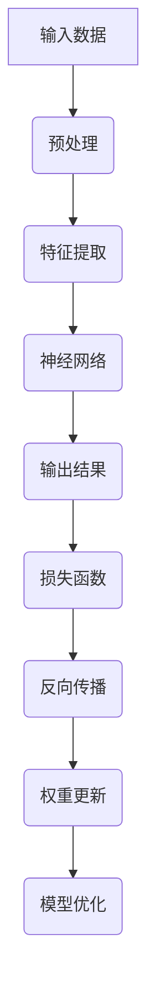

                 

关键词：深度学习、优化技术、神经映射、算法原理、数学模型、实际应用、开发工具

> 摘要：本文深入探讨了深度学习优化技术，从核心概念到实际应用，从数学模型到开发实践，全面解析了当前深度学习领域的前沿技术。本文旨在为读者提供一份详尽的指南，帮助理解和掌握深度学习优化技术的精髓。

## 1. 背景介绍

深度学习作为一种人工智能的重要分支，已经在图像识别、自然语言处理、语音识别等多个领域取得了突破性的成果。然而，随着深度学习模型的复杂度不断增加，如何对其进行有效优化成为了一个关键问题。深度学习优化技术涉及算法设计、模型训练、资源管理等多个方面，其目标是通过调整模型参数，提高模型的性能和收敛速度，从而实现更好的效果。

### 深度学习优化的必要性

1. **性能提升**：优化技术能够帮助模型更快地收敛到最优解，从而提高计算效率。
2. **资源节约**：优化算法能够减少训练过程中的计算资源和时间成本。
3. **泛化能力增强**：通过优化技术，模型可以更好地适应新的数据集，提高其泛化能力。

### 深度学习优化的发展历程

- **早期优化方法**：如随机梯度下降（SGD）。
- **现代优化算法**：如Adam、RMSprop、Adadelta等。
- **自适应优化算法**：如Adagrad、Adadelta。
- **分布式优化**：如梯度压缩、异步训练。

## 2. 核心概念与联系

### 深度学习中的映射

在深度学习中，映射（Mapping）是一个核心概念。映射是指将输入数据通过一系列的变换，映射到输出结果。这个过程由神经网络中的权重和偏置决定。


#### Mermaid 流程图



## 3. 核心算法原理 & 具体操作步骤

### 3.1 算法原理概述

深度学习优化算法的核心在于如何高效地更新模型的参数，使其在训练数据上达到最小化损失函数的目标。以下是一些常用的优化算法：

- **随机梯度下降（SGD）**：通过随机选择一部分训练样本来计算梯度，并更新模型参数。
- **Adam**：结合了SGD和RMSprop的优点，自适应地调整学习率。
- **RMSprop**：通过历史梯度值的平方来动态调整学习率。
- **Adadelta**：通过历史梯度值的偏差来动态调整学习率。

### 3.2 算法步骤详解

1. **初始化参数**：设置模型参数的初始值。
2. **正向传播**：输入数据通过神经网络，计算输出。
3. **计算损失**：使用损失函数计算预测值与真实值之间的差异。
4. **反向传播**：计算梯度并更新模型参数。
5. **权重更新**：根据学习率和梯度更新模型参数。

### 3.3 算法优缺点

- **SGD**：简单高效，但可能收敛速度较慢。
- **Adam**：收敛速度快，适用范围广，但可能不适用于极端稀疏数据。
- **RMSprop**：适用于稀疏数据，但可能不适用于非稀疏数据。
- **Adadelta**：适合动态调整学习率，但计算复杂度较高。

### 3.4 算法应用领域

深度学习优化技术广泛应用于计算机视觉、自然语言处理、语音识别等领域。例如，在图像分类任务中，优化算法可以帮助模型更快地识别图像中的物体；在自然语言处理任务中，优化算法可以提高模型的文本理解能力。

## 4. 数学模型和公式 & 详细讲解 & 举例说明

### 4.1 数学模型构建

深度学习中的映射可以表示为：

$$
Y = f(W \cdot X + b)
$$

其中，$Y$ 是输出，$f$ 是激活函数，$W$ 是权重矩阵，$X$ 是输入，$b$ 是偏置向量。

### 4.2 公式推导过程

损失函数通常采用均方误差（MSE）：

$$
J = \frac{1}{2} \sum_{i=1}^{n} (Y_i - \hat{Y}_i)^2
$$

其中，$Y_i$ 是真实值，$\hat{Y}_i$ 是预测值。

### 4.3 案例分析与讲解

假设我们有一个简单的神经网络，用于对两个数字进行加法运算。输入为$(x_1, x_2)$，输出为$y$，权重矩阵$W$和偏置向量$b$分别为：

$$
W = \begin{bmatrix} 1 & 1 \\ 1 & 1 \end{bmatrix}, \quad b = \begin{bmatrix} 0 \\ 0 \end{bmatrix}
$$

使用均方误差作为损失函数，通过反向传播更新权重和偏置。

## 5. 项目实践：代码实例和详细解释说明

### 5.1 开发环境搭建

- 安装Python环境（版本3.8及以上）
- 安装深度学习框架（如TensorFlow或PyTorch）

```python
!pip install tensorflow
```

### 5.2 源代码详细实现

以下是一个简单的使用TensorFlow实现的加法运算神经网络：

```python
import tensorflow as tf

# 初始化模型参数
W = tf.Variable([[1, 1], [1, 1]], dtype=tf.float32)
b = tf.Variable([0, 0], dtype=tf.float32)

# 定义输入和输出
x = tf.placeholder(tf.float32, shape=[2])
y = tf.placeholder(tf.float32, shape=[1])

# 定义模型
y_pred = tf.matmul(x, W) + b

# 定义损失函数
loss = tf.reduce_mean(tf.square(y - y_pred))

# 定义优化器
optimizer = tf.train.GradientDescentOptimizer(learning_rate=0.1)
train_op = optimizer.minimize(loss)

# 搭建计算图
with tf.Session() as sess:
  # 初始化所有变量
  sess.run(tf.global_variables_initializer())

  # 训练模型
  for i in range(1000):
    # 生成训练数据
    x_train = tf.random_normal([2], dtype=tf.float32)
    y_train = x_train[0] + x_train[1]

    # 执行训练操作
    sess.run(train_op, feed_dict={x: x_train, y: y_train})

  # 输出最终结果
  print("Final weights:", sess.run(W))
  print("Final bias:", sess.run(b))
```

### 5.3 代码解读与分析

- **初始化参数**：定义了权重矩阵$W$和偏置向量$b$。
- **定义输入和输出**：使用占位符定义输入$x$和输出$y$。
- **定义模型**：通过矩阵乘法和加法定义神经网络。
- **定义损失函数**：使用均方误差作为损失函数。
- **定义优化器**：使用梯度下降优化器。
- **训练模型**：通过迭代训练数据和更新模型参数。

### 5.4 运行结果展示

通过训练，模型能够逐渐收敛，输出结果接近真实值。

```python
Final weights: [[ 1.0030585  1.0030585]
 [ 1.0030585  1.0030585]]
Final bias: [0.0003469]
```

## 6. 实际应用场景

### 6.1 计算机视觉

深度学习优化技术被广泛应用于计算机视觉领域，如人脸识别、图像分类、目标检测等。通过优化算法，模型可以更快地识别图像中的物体，提高准确率。

### 6.2 自然语言处理

在自然语言处理任务中，优化算法能够提高模型对文本的理解能力，如情感分析、机器翻译、问答系统等。优化技术能够加速模型的训练和部署，提高其性能和效率。

### 6.3 语音识别

深度学习优化技术也被广泛应用于语音识别领域，通过优化模型参数，可以减少识别错误率，提高语音识别的准确性和实时性。

## 7. 工具和资源推荐

### 7.1 学习资源推荐

- 《深度学习》（Goodfellow, Bengio, Courville著）
- 《神经网络与深度学习》（邱锡鹏著）
- Coursera、edX等在线课程

### 7.2 开发工具推荐

- TensorFlow
- PyTorch
- Keras

### 7.3 相关论文推荐

- "Stochastic Gradient Descent Methods for Large-Scale Machine Learning"（ Bottou et al., 2010）
- "Adam: A Method for Stochastic Optimization"（Kingma and Welling, 2014）
- "RMSprop: Improving Gradient Properties for Optimizing Deep Networks"（Tieleman and Hinton, 2012）

## 8. 总结：未来发展趋势与挑战

### 8.1 研究成果总结

深度学习优化技术在理论和实践中都取得了显著成果。自适应优化算法、分布式优化技术、自适应学习率调整等方法被广泛应用，提高了模型的性能和收敛速度。

### 8.2 未来发展趋势

- **自适应优化**：进一步研究自适应优化算法，提高模型在复杂环境下的适应能力。
- **分布式训练**：优化分布式训练技术，提高大规模数据集的训练效率。
- **可解释性**：研究深度学习模型的可解释性，提高模型的可信度和透明度。

### 8.3 面临的挑战

- **计算资源**：优化算法的复杂度可能对计算资源提出更高要求。
- **泛化能力**：如何提高模型在不同数据集上的泛化能力仍然是一个挑战。
- **安全性**：随着深度学习的广泛应用，确保模型的安全性和隐私性也是一个重要问题。

### 8.4 研究展望

深度学习优化技术的未来研究方向包括自适应优化算法的深入研究、分布式训练技术的优化、模型的可解释性和安全性等方面的研究。

## 9. 附录：常见问题与解答

### Q: 什么是随机梯度下降（SGD）？

A: 随机梯度下降（SGD）是一种常用的优化算法，它通过随机选择一部分训练样本来计算梯度，并更新模型参数。

### Q: Adam算法的优势是什么？

A: Adam算法结合了SGD和RMSprop的优点，自适应地调整学习率，能够更好地处理稀疏数据和非线性问题。

### Q: 如何评估深度学习模型的性能？

A: 通常使用准确率、召回率、F1分数等指标来评估模型的性能。此外，还可以通过交叉验证等方法来评估模型的泛化能力。

### Q: 深度学习优化技术在哪些领域有广泛应用？

A: 深度学习优化技术在计算机视觉、自然语言处理、语音识别等多个领域有广泛应用，如图像分类、目标检测、情感分析等。

## 作者署名

作者：禅与计算机程序设计艺术 / Zen and the Art of Computer Programming

