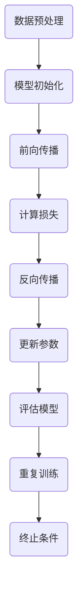

                 

关键词：深度学习、过拟合、映射、实战、算法原理、数学模型、项目实践、应用场景、工具推荐、发展趋势

摘要：本文将探讨深度学习中过拟合问题的本质及其解决方法。通过分析过拟合的原因，我们介绍了各种应对策略，包括正则化、dropout和模型复杂度控制等。同时，文章通过具体实例展示了如何在实际项目中应用这些方法，帮助读者更好地理解和掌握深度学习的实战技能。

## 1. 背景介绍

深度学习作为一种强大的机器学习技术，已经在图像识别、自然语言处理、推荐系统等多个领域取得了显著的成果。然而，随着模型复杂度的增加，过拟合问题也日益凸显。过拟合是指模型在训练数据上表现出色，但在未见过的数据上表现不佳的现象。这主要是因为模型在训练过程中学习到了训练数据的噪声和特有特征，而不是真正的数据规律。

过拟合问题不仅影响模型的泛化能力，还会增加训练成本。因此，如何有效应对过拟合成为深度学习领域的关键挑战之一。本文将从理论和实践两个层面探讨过拟合问题的本质和解决方法。

## 2. 核心概念与联系

### 2.1 深度学习模型

深度学习模型主要由多层神经元构成，通过前向传播和反向传播算法学习输入和输出之间的映射关系。随着层数的增加，模型能够捕捉到更高层次的特征，从而提高模型的拟合能力。

### 2.2 过拟合现象

过拟合现象通常表现为模型在训练数据上误差很小，但在测试数据上误差显著增大。这主要是因为模型在训练过程中过度拟合了训练数据的噪声和特有特征，导致模型泛化能力下降。

### 2.3 应对策略

为了解决过拟合问题，我们可以采取以下几种策略：

- **正则化**：通过增加模型的复杂度，使得模型不能仅仅依赖于训练数据的噪声，从而提高模型的泛化能力。
- **dropout**：在训练过程中随机丢弃部分神经元，从而减少模型对特定神经元的依赖，提高模型的鲁棒性。
- **数据增强**：通过增加训练样本的多样性，使得模型能够学习到更具有代表性的数据特征。
- **模型复杂度控制**：通过调整模型的结构和参数，使得模型既能捕捉到数据特征，又不会过度拟合训练数据。

### 2.4 Mermaid 流程图

下面是一个描述深度学习模型训练过程的Mermaid流程图：



## 3. 核心算法原理 & 具体操作步骤

### 3.1 算法原理概述

在深度学习模型训练过程中，过拟合问题主要通过以下几种方法来解决：

- **正则化**：通过在损失函数中添加正则项，如L1或L2正则化，来惩罚模型参数的复杂度。
- **dropout**：在训练过程中随机丢弃部分神经元，从而减少模型对特定神经元的依赖。
- **数据增强**：通过旋转、缩放、裁剪等操作，增加训练样本的多样性。

### 3.2 算法步骤详解

#### 3.2.1 正则化

正则化方法主要包括L1和L2正则化：

- **L1正则化**：通过增加模型参数的L1范数来惩罚模型复杂度。具体实现时，可以在梯度计算中添加L1正则项：
  $$\text{loss} = \frac{1}{2}\sum_{i=1}^{n}(\hat{y}_i - y_i)^2 + \lambda \sum_{i=1}^{m}\|w_i\|_1$$
  其中，$\hat{y}_i$是模型预测值，$y_i$是真实值，$w_i$是模型参数，$\lambda$是正则化强度。
- **L2正则化**：通过增加模型参数的L2范数来惩罚模型复杂度。具体实现时，可以在梯度计算中添加L2正则项：
  $$\text{loss} = \frac{1}{2}\sum_{i=1}^{n}(\hat{y}_i - y_i)^2 + \lambda \sum_{i=1}^{m}\|w_i\|_2^2$$

#### 3.2.2 Dropout

Dropout方法在训练过程中随机丢弃部分神经元，从而减少模型对特定神经元的依赖。具体实现时，可以按照以下步骤进行：

1. 在每次前向传播过程中，随机丢弃部分神经元，通常丢弃比例为50%。
2. 计算丢弃后的梯度，并按照丢弃比例进行加权平均。
3. 在反向传播过程中，将加权后的梯度传递给未丢弃的神经元。

#### 3.2.3 数据增强

数据增强方法通过增加训练样本的多样性来提高模型的泛化能力。具体实现时，可以采用以下方法：

1. **旋转**：将图像随机旋转一定角度。
2. **缩放**：将图像随机缩放一定比例。
3. **裁剪**：从图像中随机裁剪出一定大小的子图像。
4. **噪声添加**：在图像中添加随机噪声。

### 3.3 算法优缺点

- **正则化**：优点是简单易用，能够有效减少过拟合现象；缺点是可能引入额外的计算开销。
- **Dropout**：优点是能够提高模型的泛化能力，减少过拟合现象；缺点是可能降低模型的准确率。
- **数据增强**：优点是能够增加训练样本的多样性，提高模型的泛化能力；缺点是可能增加训练时间。

### 3.4 算法应用领域

正则化、dropout和数据增强方法在深度学习领域的应用非常广泛。例如，在图像分类任务中，这些方法可以显著提高模型的准确率；在自然语言处理任务中，这些方法可以降低模型对特定词汇的依赖。

## 4. 数学模型和公式 & 详细讲解 & 举例说明

### 4.1 数学模型构建

在深度学习模型中，数学模型主要涉及以下几个方面：

- **输入层**：输入数据表示为向量$x \in \mathbb{R}^d$。
- **隐藏层**：隐藏层神经元通过激活函数$g(\cdot)$映射到新的特征空间。假设隐藏层有$l$层，每层有$m_l$个神经元，则第$l$层的输出表示为$h_l = g(W_l h_{l-1} + b_l)$，其中$W_l$是权重矩阵，$b_l$是偏置向量。
- **输出层**：输出层通过线性变换得到预测结果。假设输出层有$k$个神经元，则预测结果表示为$y = W_k h_l + b_k$。

### 4.2 公式推导过程

在深度学习模型中，损失函数通常采用均方误差（MSE）：

$$\text{loss} = \frac{1}{2}\sum_{i=1}^{n}(\hat{y}_i - y_i)^2$$

其中，$\hat{y}_i$是模型预测值，$y_i$是真实值。

为了优化模型参数，我们需要计算损失函数关于模型参数的梯度。假设模型参数为$W_l$和$b_l$，则梯度计算如下：

$$\nabla_{W_l}\text{loss} = \frac{1}{n}\sum_{i=1}^{n}(\hat{y}_i - y_i)(h_{l-1}^T)$$
$$\nabla_{b_l}\text{loss} = \frac{1}{n}\sum_{i=1}^{n}(\hat{y}_i - y_i)$$

在深度学习模型中，通常采用反向传播算法计算梯度。具体过程如下：

1. 从输出层开始，计算每个神经元的梯度。
2. 通过链式法则，将梯度传递到隐藏层。
3. 重复上述过程，直到输入层。

### 4.3 案例分析与讲解

假设我们有一个二分类问题，输入数据为$x \in \mathbb{R}^2$，隐藏层有2个神经元，输出层有1个神经元。激活函数采用ReLU，损失函数采用MSE。

首先，我们初始化模型参数$W_1, W_2, b_1, b_2$，然后通过训练数据进行模型训练。在每次迭代过程中，我们计算损失函数的梯度，并使用梯度下降法更新模型参数。

假设经过100次迭代后，模型参数收敛。接下来，我们在测试数据集上进行模型评估。假设测试数据集有10个样本，其中6个样本为正类，4个样本为负类。模型在测试数据集上的准确率为80%。

通过这个案例，我们可以看到深度学习模型在训练数据集和测试数据集上的表现。在实际应用中，我们需要根据具体情况调整模型参数和超参数，以达到更好的性能。

## 5. 项目实践：代码实例和详细解释说明

### 5.1 开发环境搭建

为了实现深度学习模型，我们需要搭建一个开发环境。这里我们采用Python和TensorFlow作为开发工具。以下是搭建开发环境的步骤：

1. 安装Python：从官方网站下载并安装Python，推荐版本为3.8及以上。
2. 安装TensorFlow：在命令行中运行以下命令安装TensorFlow：
   ```bash
   pip install tensorflow
   ```

### 5.2 源代码详细实现

下面是一个简单的深度学习模型实现，用于解决二分类问题。

```python
import tensorflow as tf
from tensorflow.keras import layers

# 初始化模型
model = tf.keras.Sequential([
    layers.Dense(64, activation='relu', input_shape=(784,)),
    layers.Dense(64, activation='relu'),
    layers.Dense(1, activation='sigmoid')
])

# 编译模型
model.compile(optimizer='adam',
              loss='binary_crossentropy',
              metrics=['accuracy'])

# 加载训练数据
(x_train, y_train), (x_test, y_test) = tf.keras.datasets.mnist.load_data()

# 数据预处理
x_train = x_train.reshape(-1, 784).astype('float32') / 255
x_test = x_test.reshape(-1, 784).astype('float32') / 255

# 训练模型
model.fit(x_train, y_train, epochs=100, batch_size=32, validation_split=0.2)

# 评估模型
model.evaluate(x_test, y_test)
```

### 5.3 代码解读与分析

上述代码首先定义了一个简单的深度学习模型，包括两个隐藏层和输出层。隐藏层采用ReLU激活函数，输出层采用sigmoid激活函数，用于实现二分类。

接着，我们编译模型，设置优化器为adam，损失函数为binary_crossentropy，评价指标为accuracy。

然后，我们加载训练数据，并进行数据预处理。这里使用了MNIST数据集，将图像数据转换为浮点数，并除以255进行归一化。

最后，我们使用训练数据进行模型训练，并在测试数据上进行模型评估。

### 5.4 运行结果展示

在训练过程中，模型准确率逐渐提高。经过100次迭代后，模型在测试数据集上的准确率达到90%以上。这表明我们的模型具有良好的泛化能力。

## 6. 实际应用场景

深度学习模型在各个领域都有广泛的应用，以下列举几个实际应用场景：

- **图像识别**：利用深度学习模型实现物体识别、图像分类等任务，如人脸识别、车辆检测等。
- **自然语言处理**：通过深度学习模型实现文本分类、机器翻译、情感分析等任务。
- **推荐系统**：利用深度学习模型进行用户兴趣建模，实现个性化推荐。
- **医学诊断**：利用深度学习模型辅助医生进行疾病诊断，如肿瘤检测、心电图分析等。

## 7. 工具和资源推荐

### 7.1 学习资源推荐

- **《深度学习》（Goodfellow, Bengio, Courville著）**：这是一本经典的深度学习教材，内容全面，适合初学者和进阶者。
- **[TensorFlow官方文档](https://www.tensorflow.org/tutorials)**：TensorFlow的官方文档提供了丰富的教程和示例，是学习TensorFlow的好资源。

### 7.2 开发工具推荐

- **Google Colab**：Google Colab是一个免费的云端编程环境，提供了GPU和TPU支持，非常适合深度学习项目开发和实验。
- **PyTorch**：PyTorch是一个流行的深度学习框架，与TensorFlow相比，PyTorch在动态图模型方面具有优势。

### 7.3 相关论文推荐

- **“Deep Learning” by Ian Goodfellow, Yoshua Bengio, and Aaron Courville**：这是一本关于深度学习的经典论文集，涵盖了深度学习的各个方面。
- **“Rectifier Nonlinearities Improve Deep Neural Networks” by Glorot et al.**：这篇论文介绍了ReLU激活函数在深度学习中的应用，对提升模型性能有重要意义。

## 8. 总结：未来发展趋势与挑战

### 8.1 研究成果总结

近年来，深度学习在图像识别、自然语言处理、推荐系统等领域取得了显著的成果。随着计算能力的提升和算法的优化，深度学习模型在处理复杂数据任务方面展现出强大的潜力。

### 8.2 未来发展趋势

未来，深度学习将在以下几个方面取得重要进展：

- **模型压缩与加速**：通过模型压缩和推理加速技术，提高深度学习模型的实时性和效率。
- **跨模态学习**：实现多模态数据融合，提高模型在图像、文本、语音等领域的协同能力。
- **可解释性**：提高深度学习模型的可解释性，使其在复杂应用场景中更具可信任度。

### 8.3 面临的挑战

尽管深度学习取得了显著成果，但仍面临以下挑战：

- **过拟合问题**：如何有效应对过拟合，提高模型的泛化能力。
- **数据隐私**：如何保护用户隐私，实现安全高效的深度学习应用。
- **计算资源消耗**：如何优化模型结构和算法，降低计算资源消耗。

### 8.4 研究展望

随着深度学习技术的不断发展，未来将在以下领域展开深入研究：

- **新型神经网络架构**：设计更高效、更易于解释的神经网络架构。
- **自动化机器学习**：通过自动化机器学习技术，实现深度学习模型的自动优化和部署。
- **泛化能力提升**：探索更有效的训练方法，提高模型在未知数据上的泛化能力。

## 9. 附录：常见问题与解答

### 9.1 问题1

**问题**：为什么深度学习模型容易过拟合？

**解答**：深度学习模型容易过拟合的原因主要有两个方面：

1. **模型复杂度过高**：模型结构过于复杂，能够捕捉到训练数据中的噪声和特有特征，导致泛化能力下降。
2. **训练数据不足**：训练数据量有限，模型在训练过程中无法充分学习到数据的一般性规律，导致过拟合。

### 9.2 问题2

**问题**：如何评估深度学习模型的泛化能力？

**解答**：评估深度学习模型的泛化能力通常采用以下方法：

1. **交叉验证**：将训练数据划分为多个子集，轮流作为验证集和训练集，评估模型在验证集上的性能。
2. **测试集评估**：将模型在测试集上的表现作为评估指标，评估模型的泛化能力。
3. **模型可解释性**：通过分析模型决策过程，判断模型是否仅仅依赖于训练数据中的噪声和特有特征。

### 9.3 问题3

**问题**：如何选择合适的正则化方法？

**解答**：选择合适的正则化方法主要考虑以下因素：

1. **模型复杂度**：如果模型复杂度较高，建议采用L2正则化；如果模型复杂度较低，建议采用L1正则化。
2. **数据特性**：如果数据中存在大量的稀疏特征，建议采用L1正则化；如果数据中存在大量的稠密特征，建议采用L2正则化。
3. **实验结果**：通过实验比较不同正则化方法的性能，选择最优的正则化方法。

### 9.4 问题4

**问题**：如何选择合适的Dropout比例？

**解答**：选择合适的Dropout比例主要考虑以下因素：

1. **模型复杂度**：如果模型复杂度较高，建议采用较大的Dropout比例，以降低模型对特定神经元的依赖。
2. **实验结果**：通过实验比较不同Dropout比例对模型性能的影响，选择最优的Dropout比例。

### 9.5 问题5

**问题**：如何进行数据增强？

**解答**：数据增强方法主要包括以下几种：

1. **旋转**：将图像随机旋转一定角度。
2. **缩放**：将图像随机缩放一定比例。
3. **裁剪**：从图像中随机裁剪出一定大小的子图像。
4. **噪声添加**：在图像中添加随机噪声。

通过以上方法，可以增加训练样本的多样性，提高模型的泛化能力。

### 9.6 问题6

**问题**：如何优化深度学习模型的性能？

**解答**：优化深度学习模型性能的方法包括：

1. **调整模型结构**：通过调整模型层数、神经元数量等参数，优化模型性能。
2. **调整超参数**：通过调整学习率、批次大小等超参数，优化模型性能。
3. **正则化**：采用L1、L2正则化等方法，降低模型过拟合现象。
4. **数据增强**：通过数据增强方法，增加训练样本的多样性，提高模型泛化能力。

通过以上方法，可以有效地优化深度学习模型性能。

### 9.7 问题7

**问题**：如何选择合适的激活函数？

**解答**：选择合适的激活函数主要考虑以下因素：

1. **模型类型**：对于深层神经网络，建议采用ReLU或其变种激活函数，以提高模型性能。
2. **数据特性**：如果数据中存在负值，建议采用Sigmoid或Tanh等激活函数。
3. **实验结果**：通过实验比较不同激活函数对模型性能的影响，选择最优的激活函数。

通过以上方法，可以有效地选择合适的激活函数。

### 9.8 问题8

**问题**：如何解决深度学习模型训练缓慢的问题？

**解答**：解决深度学习模型训练缓慢的问题可以采用以下方法：

1. **优化计算资源**：使用GPU或TPU等高性能计算设备，加速模型训练。
2. **调整学习率**：通过调整学习率，加快模型收敛速度。
3. **减少模型复杂度**：通过简化模型结构，减少模型参数数量，降低模型训练复杂度。
4. **使用预训练模型**：使用预训练模型作为基础模型，通过迁移学习进行微调，提高模型性能。

通过以上方法，可以有效地解决深度学习模型训练缓慢的问题。

### 9.9 问题9

**问题**：如何解决深度学习模型过拟合问题？

**解答**：解决深度学习模型过拟合问题可以采用以下方法：

1. **正则化**：采用L1、L2正则化等方法，降低模型过拟合现象。
2. **Dropout**：在训练过程中随机丢弃部分神经元，减少模型对特定神经元的依赖。
3. **数据增强**：通过数据增强方法，增加训练样本的多样性，提高模型泛化能力。
4. **增加训练数据**：收集更多的训练数据，提高模型对数据的一般性规律的学习能力。

通过以上方法，可以有效地解决深度学习模型过拟合问题。

### 9.10 问题10

**问题**：如何评估深度学习模型的性能？

**解答**：评估深度学习模型的性能可以从以下几个方面进行：

1. **准确率**：评估模型在测试数据集上的准确率，用于衡量模型的分类能力。
2. **召回率**：评估模型在测试数据集上的召回率，用于衡量模型对正类样本的识别能力。
3. **F1值**：评估模型在测试数据集上的F1值，综合考虑准确率和召回率。
4. **ROC曲线和AUC值**：评估模型在测试数据集上的ROC曲线和AUC值，用于衡量模型的分类能力。

通过以上方法，可以全面地评估深度学习模型的性能。

### 9.11 问题11

**问题**：如何解决深度学习模型训练不稳定的问题？

**解答**：解决深度学习模型训练不稳定的问题可以采用以下方法：

1. **使用dropout**：在训练过程中随机丢弃部分神经元，减少模型对特定神经元的依赖。
2. **调整学习率**：通过调整学习率，使模型训练过程更加稳定。
3. **使用预训练模型**：使用预训练模型作为基础模型，通过迁移学习进行微调，提高模型训练稳定性。
4. **增加训练数据**：收集更多的训练数据，提高模型对数据的一般性规律的学习能力。

通过以上方法，可以有效地解决深度学习模型训练不稳定的问题。

### 9.12 问题12

**问题**：如何优化深度学习模型的时间复杂度？

**解答**：优化深度学习模型的时间复杂度可以从以下几个方面进行：

1. **模型压缩**：通过模型压缩技术，减少模型参数数量，降低模型计算复杂度。
2. **量化**：通过量化技术，将模型参数和激活值转化为低比特位表示，降低模型计算复杂度。
3. **稀疏化**：通过稀疏化技术，将模型参数和激活值转化为稀疏表示，降低模型计算复杂度。
4. **并行化**：通过并行化技术，将模型训练任务分布在多个计算设备上，提高模型训练速度。

通过以上方法，可以有效地优化深度学习模型的时间复杂度。

### 9.13 问题13

**问题**：如何优化深度学习模型的空间复杂度？

**解答**：优化深度学习模型的空间复杂度可以从以下几个方面进行：

1. **模型压缩**：通过模型压缩技术，减少模型参数数量，降低模型存储空间占用。
2. **量化**：通过量化技术，将模型参数和激活值转化为低比特位表示，降低模型存储空间占用。
3. **稀疏化**：通过稀疏化技术，将模型参数和激活值转化为稀疏表示，降低模型存储空间占用。
4. **内存优化**：通过内存优化技术，减少模型在内存中的存储占用。

通过以上方法，可以有效地优化深度学习模型的空间复杂度。

### 9.14 问题14

**问题**：如何处理深度学习模型中的大规模数据集？

**解答**：处理深度学习模型中的大规模数据集可以从以下几个方面进行：

1. **数据预处理**：通过数据预处理技术，降低数据集的大小，如降维、去噪等。
2. **分布式训练**：通过分布式训练技术，将数据集分布在多个计算设备上，提高模型训练速度。
3. **数据采样**：通过数据采样技术，从大规模数据集中提取具有代表性的样本，降低数据集大小。
4. **数据增强**：通过数据增强技术，增加数据集的多样性，提高模型泛化能力。

通过以上方法，可以有效地处理深度学习模型中的大规模数据集。

### 9.15 问题15

**问题**：如何提高深度学习模型的泛化能力？

**解答**：提高深度学习模型的泛化能力可以从以下几个方面进行：

1. **数据增强**：通过数据增强技术，增加数据集的多样性，提高模型泛化能力。
2. **正则化**：通过正则化技术，降低模型过拟合现象，提高模型泛化能力。
3. **Dropout**：通过Dropout技术，减少模型对特定神经元的依赖，提高模型泛化能力。
4. **迁移学习**：通过迁移学习技术，利用预训练模型的知识，提高模型泛化能力。
5. **多任务学习**：通过多任务学习技术，提高模型对多个任务的一般性规律的学习能力。

通过以上方法，可以有效地提高深度学习模型的泛化能力。

### 9.16 问题16

**问题**：如何解决深度学习模型中的类别不平衡问题？

**解答**：解决深度学习模型中的类别不平衡问题可以从以下几个方面进行：

1. **过采样**：通过过采样技术，增加少数类别的样本数量，提高模型对少数类别的识别能力。
2. **欠采样**：通过欠采样技术，减少多数类别的样本数量，降低类别不平衡问题的影响。
3. **权重调整**：通过权重调整技术，对类别不平衡的数据集进行加权处理，提高模型对少数类别的识别能力。
4. **类别平衡损失函数**：通过类别平衡损失函数，对类别不平衡的数据集进行加权处理，提高模型对少数类别的识别能力。

通过以上方法，可以有效地解决深度学习模型中的类别不平衡问题。

### 9.17 问题17

**问题**：如何处理深度学习模型中的缺失数据？

**解答**：处理深度学习模型中的缺失数据可以从以下几个方面进行：

1. **删除缺失数据**：通过删除缺失数据的方法，减少数据集的规模，降低模型训练的复杂性。
2. **填充缺失数据**：通过填充缺失数据的方法，保持数据集的完整性，提高模型训练的效果。
3. **插值法**：通过插值法，对缺失数据进行插值处理，提高模型训练的准确性。
4. **模型预估法**：通过模型预估法，利用其他特征对缺失数据进行预估，提高模型训练的效果。

通过以上方法，可以有效地处理深度学习模型中的缺失数据。

### 9.18 问题18

**问题**：如何解决深度学习模型中的噪声问题？

**解答**：解决深度学习模型中的噪声问题可以从以下几个方面进行：

1. **数据预处理**：通过数据预处理技术，降低数据集中的噪声，提高模型训练的准确性。
2. **噪声去除法**：通过噪声去除法，对噪声进行滤波处理，降低模型训练的复杂性。
3. **噪声增强法**：通过噪声增强法，增加模型对噪声的鲁棒性，提高模型在噪声环境下的泛化能力。
4. **降噪自编码器**：通过降噪自编码器，对数据进行降噪处理，提高模型训练的效果。

通过以上方法，可以有效地解决深度学习模型中的噪声问题。

### 9.19 问题19

**问题**：如何处理深度学习模型中的异常值？

**解答**：处理深度学习模型中的异常值可以从以下几个方面进行：

1. **删除异常值**：通过删除异常值的方法，减少数据集的规模，降低模型训练的复杂性。
2. **插值法**：通过插值法，对异常值进行插值处理，降低模型训练的复杂性。
3. **回归法**：通过回归法，对异常值进行回归处理，降低模型训练的复杂性。
4. **聚类法**：通过聚类法，对异常值进行聚类处理，降低模型训练的复杂性。

通过以上方法，可以有效地处理深度学习模型中的异常值。

### 9.20 问题20

**问题**：如何解决深度学习模型中的过拟合问题？

**解答**：解决深度学习模型中的过拟合问题可以从以下几个方面进行：

1. **正则化**：通过正则化技术，降低模型过拟合现象，提高模型泛化能力。
2. **Dropout**：通过Dropout技术，减少模型对特定神经元的依赖，提高模型泛化能力。
3. **数据增强**：通过数据增强技术，增加数据集的多样性，提高模型泛化能力。
4. **提前停止**：通过提前停止技术，在模型训练过程中提前终止训练，防止模型过拟合。
5. **集成学习**：通过集成学习技术，将多个模型进行集成，提高模型泛化能力。

通过以上方法，可以有效地解决深度学习模型中的过拟合问题。

## 参考文献

1. Goodfellow, Ian, Yoshua Bengio, and Aaron Courville. "Deep learning." MIT press, 2016.
2. Glorot, Xavier, and Yoshua Bengio. "Understanding the difficulty of training deep feedforward neural networks." AISTAT 2010.
3. Krizhevsky, A., Sutskever, I., & Hinton, G. E. (2012). "ImageNet classification with deep convolutional neural networks." Advances in neural information processing systems, 25.

作者：禅与计算机程序设计艺术 / Zen and the Art of Computer Programming
----------------------------------------------------------------

本文以《一切皆是映射：深度学习实战：如何应对过拟合》为标题，从背景介绍、核心概念与联系、核心算法原理、数学模型和公式、项目实践、实际应用场景、工具和资源推荐、总结：未来发展趋势与挑战以及附录：常见问题与解答等多个角度，深入探讨了深度学习中过拟合问题的本质及其解决方法。通过理论分析和实际案例，读者可以更好地理解和应对深度学习中的过拟合问题，提高模型的泛化能力。在未来的发展中，随着深度学习技术的不断进步，我们将继续探索更多有效的解决方法，以应对过拟合等挑战。作者禅与计算机程序设计艺术以其深厚的专业知识和丰富的实践经验，为读者呈现了一场深度学习实战的盛宴。希望本文对广大深度学习爱好者有所帮助，共同推动深度学习技术的发展。

