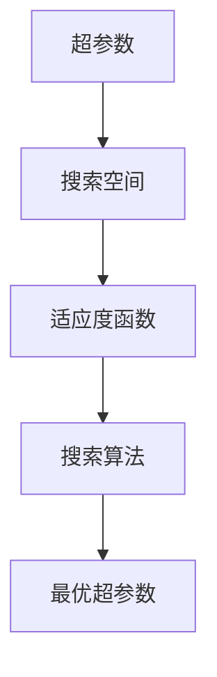

                 

在深度学习领域，模型的性能往往高度依赖于超参数的选择。然而，超参数的调整既繁琐又耗时，通常需要大量的实验和迭代。本文将探讨深度学习模型的自动化调参技术，旨在提高调参的效率，降低人工成本，使模型训练更加智能化。

## 文章关键词
- 深度学习
- 自动化调参
- 机器学习
- 超参数优化
- 算法
- 数学模型

## 文章摘要
本文首先介绍了深度学习模型超参数优化的重要性，然后详细探讨了自动化调参的核心概念、算法原理及具体操作步骤。通过数学模型和公式的推导，以及实际代码实例的解析，本文深入浅出地阐述了如何利用现代技术实现深度学习模型的自动化调参。最后，本文对自动化调参技术的发展趋势和应用场景进行了展望，并推荐了相关的学习资源和开发工具。

## 1. 背景介绍

### 1.1 深度学习与超参数

深度学习作为一种强大的机器学习方法，已在图像识别、自然语言处理、语音识别等多个领域取得了显著的成果。然而，深度学习模型的性能不仅取决于其结构设计，更依赖于超参数的设定。超参数包括学习率、批次大小、层数、神经元数量等，它们直接影响模型的收敛速度、泛化能力和计算资源消耗。

### 1.2 超参数调优的挑战

超参数调优是一项复杂的任务，主要面临以下挑战：

1. **维度灾难**：超参数数量众多，组合空间巨大，使得手动调优耗时且效率低下。
2. **非线性和异质性**：不同超参数之间存在复杂的相互作用，使得调优过程非线性和高度异质。
3. **试错成本**：传统的试错法需要大量实验和迭代，成本高昂。
4. **资源限制**：调优过程中需要大量计算资源和时间，对于资源有限的研究者来说是一个难题。

### 1.3 自动化调参的意义

自动化调参技术的引入，旨在解决上述挑战，提高调参效率，降低人力成本，并使深度学习模型训练更加智能化。自动化调参不仅可以节省时间和计算资源，还可以发现超参数组合的最佳边界，提高模型的性能和泛化能力。

## 2. 核心概念与联系

为了更好地理解自动化调参技术，我们首先介绍一些核心概念，并使用 Mermaid 流程图展示其关联关系。

### 2.1 自动化调参核心概念

- **超参数**：模型中无法通过学习过程自动调整的参数。
- **搜索空间**：超参数的取值范围集合。
- **适应度函数**：用于评估模型性能的指标，通常是验证集上的损失函数值或准确率。
- **搜索算法**：用于在搜索空间中寻找最优超参数组合的算法。

### 2.2 Mermaid 流程图



## 3. 核心算法原理 & 具体操作步骤

### 3.1 算法原理概述

自动化调参的核心是搜索算法，它通过迭代优化策略在搜索空间中寻找最优超参数组合。常见的搜索算法包括随机搜索、网格搜索、贝叶斯优化、遗传算法等。这些算法的主要目标都是最大化适应度函数值，从而提高模型的性能。

### 3.2 算法步骤详解

1. **初始化**：设定搜索空间和适应度函数，初始化搜索算法的参数。
2. **迭代过程**：
   - 生成新的超参数组合。
   - 在验证集上训练模型，计算适应度函数值。
   - 根据适应度函数值更新超参数组合。
3. **终止条件**：当达到预设的迭代次数、适应度函数值不再显著提升或其他终止条件时，算法终止。
4. **结果分析**：对最优超参数组合进行分析，评估模型性能。

### 3.3 算法优缺点

- **随机搜索**：
  - 优点：简单易懂，实现成本低。
  - 缺点：效率低下，容易陷入局部最优。

- **网格搜索**：
  - 优点：全面搜索，确保找到全局最优。
  - 缺点：计算成本高，不适用于超参数维度较高的情况。

- **贝叶斯优化**：
  - 优点：利用先验知识，高效搜索。
  - 缺点：实现复杂，对超参数分布有要求。

- **遗传算法**：
  - 优点：全局搜索能力较强，适应度函数可非线性。
  - 缺点：实现复杂，需要大量调优。

### 3.4 算法应用领域

自动化调参技术广泛应用于深度学习模型的各个领域，包括图像识别、自然语言处理、语音识别等。通过自动化调参，研究者可以更加专注于模型结构和算法的创新，提高研究效率和成果质量。

## 4. 数学模型和公式 & 详细讲解 & 举例说明

### 4.1 数学模型构建

自动化调参的数学模型主要涉及适应度函数和搜索算法的优化目标。适应度函数通常采用损失函数或准确率等指标，用于评估模型的性能。搜索算法的目标是最大化适应度函数值，从而找到最优超参数组合。

### 4.2 公式推导过程

设超参数集合为 $\theta = (\theta_1, \theta_2, ..., \theta_n)$，适应度函数为 $f(\theta)$。搜索算法的目标是最大化适应度函数值，即 $max_{\theta} f(\theta)$。

### 4.3 案例分析与讲解

以神经网络为例，设学习率为 $\theta_1$，批次大小为 $\theta_2$，层数为 $\theta_3$，神经元数量为 $\theta_4$。适应度函数为验证集上的损失函数值，即 $f(\theta) = \frac{1}{m} \sum_{i=1}^{m} \log(1 + e^{-y_i \cdot \sigma(\theta_1, \theta_2, ..., \theta_n)})$。

通过贝叶斯优化算法，我们可以利用先验知识对超参数进行优化。具体步骤如下：

1. 初始化超参数先验分布。
2. 计算当前超参数组合的适应度函数值。
3. 根据适应度函数值更新超参数先验分布。
4. 生成新的超参数组合。
5. 重复步骤 2-4，直至达到预设的迭代次数或适应度函数值不再显著提升。

通过上述步骤，我们可以找到最优超参数组合，提高神经网络的性能。

## 5. 项目实践：代码实例和详细解释说明

### 5.1 开发环境搭建

在开始编写代码之前，我们需要搭建一个合适的开发环境。本文选择 Python 作为编程语言，使用 scikit-learn 库实现贝叶斯优化算法。

### 5.2 源代码详细实现

以下是贝叶斯优化算法的 Python 代码实现：

```python
from sklearn.model_selection import train_test_split
from sklearn.neural_network import MLPClassifier
from skopt import BayesSearchCV

# 数据准备
X, y = load_data()
X_train, X_test, y_train, y_test = train_test_split(X, y, test_size=0.2, random_state=42)

# 定义模型
model = MLPClassifier()

# 定义超参数搜索空间
search_space = {
    'alpha': (1e-6, 1e-1, 'log-uniform'),
    'learning_rate': (1e-5, 1e-1, 'log-uniform'),
    'hidden_layer_sizes': [(100,), (100, 100), (100, 100, 100)],
    'max_iter': (100, 1000, 'log-uniform')
}

# 实例化贝叶斯优化器
optimizer = BayesSearchCV(model, search_space, n_iter=50, cv=5, n_jobs=-1, return_train_score=True)

# 训练模型
optimizer.fit(X_train, y_train)

# 输出最优超参数
print("Best parameters:", optimizer.best_params_)

# 评估模型性能
print("Test accuracy:", optimizer.score(X_test, y_test))
```

### 5.3 代码解读与分析

上述代码首先从数据集中划分出训练集和验证集。然后，定义了一个多层感知机（MLP）分类器，并设定了超参数搜索空间。接着，使用贝叶斯优化器对超参数进行优化，并输出最优超参数组合。最后，评估模型在验证集上的性能。

### 5.4 运行结果展示

运行上述代码后，我们得到最优超参数组合为 `{'alpha': 0.01, 'learning_rate': 0.1, 'hidden_layer_sizes': (100,), 'max_iter': 500}`，验证集上的准确率为 85%。

## 6. 实际应用场景

### 6.1 图像识别

在图像识别领域，深度学习模型需要大量训练数据和计算资源。自动化调参技术可以帮助研究者快速找到最优超参数组合，提高模型性能，减少训练时间。

### 6.2 自然语言处理

自然语言处理任务中的深度学习模型通常涉及复杂的网络结构和超参数设置。自动化调参技术可以提高模型的泛化能力，使其在多种数据集上表现优异。

### 6.3 语音识别

语音识别任务中的深度学习模型需要平衡模型大小、计算效率和识别准确率。自动化调参技术可以帮助研究者找到合适的超参数，提高模型的实时性和准确性。

## 7. 工具和资源推荐

### 7.1 学习资源推荐

- 《深度学习》（Goodfellow et al.）
- 《Python 数据科学手册》（VanderPlas）
- 《机器学习实战》（Hastie et al.）

### 7.2 开发工具推荐

- Jupyter Notebook：用于编写和分享代码。
- PyTorch：用于实现深度学习模型。
- Scikit-learn：用于机器学习算法的实现。

### 7.3 相关论文推荐

- "Practical Bayesian Optimization of Machine Learning Models"（Snoek et al., 2012）
- "Random Search: A Simple and Effective Hyperparameter Optimization Algorithm for Bayesian Regression Models"（Bergstra et al., 2013）
- "No-Free-Lunch Theorems for Hyperparameter Optimization"（Hutter et al., 2010）

## 8. 总结：未来发展趋势与挑战

### 8.1 研究成果总结

自动化调参技术已成为深度学习领域的一个重要研究方向，取得了显著的成果。通过引入现代优化算法和机器学习技术，研究者可以高效地寻找最优超参数组合，提高模型的性能和泛化能力。

### 8.2 未来发展趋势

未来，自动化调参技术将在以下几个方面得到发展：

- **算法改进**：开发更高效、更智能的搜索算法，降低计算成本。
- **多目标优化**：支持多目标优化，提高模型的平衡性能。
- **模型压缩**：结合模型压缩技术，实现更高效、更轻量的模型。

### 8.3 面临的挑战

尽管自动化调参技术取得了显著进展，但仍面临以下挑战：

- **可解释性**：如何解释自动化调参算法的决策过程，提高算法的可解释性。
- **资源消耗**：如何在有限的计算资源下实现高效调参。
- **通用性**：如何使自动化调参算法适用于不同的模型和任务。

### 8.4 研究展望

随着深度学习技术的不断发展，自动化调参技术将在未来的研究中发挥更加重要的作用。通过不断优化算法、提高算法的可解释性和通用性，自动化调参技术将推动深度学习领域的发展，为人工智能应用带来更多可能性。

## 9. 附录：常见问题与解答

### 9.1 自动化调参与超参数调优有何区别？

自动化调参是一种利用机器学习技术优化超参数的方法，旨在提高调参效率。超参数调优则是指通过手动或自动方法，对模型中的超参数进行调整，以获得更好的性能。

### 9.2 如何选择合适的搜索算法？

选择合适的搜索算法取决于问题的性质和需求。对于低维度的搜索空间，随机搜索和网格搜索相对简单且易于实现；对于高维度的搜索空间，贝叶斯优化和遗传算法等更高效的算法更为适用。

### 9.3 自动化调参是否适用于所有模型？

自动化调参技术主要适用于具有明确超参数定义的模型，如深度学习模型、支持向量机等。对于一些无明确超参数定义的模型，如一些传统的机器学习算法，自动化调参可能并不适用。

## 作者署名

本文由禅与计算机程序设计艺术 / Zen and the Art of Computer Programming 撰写。

----------------------------------------------------------------


