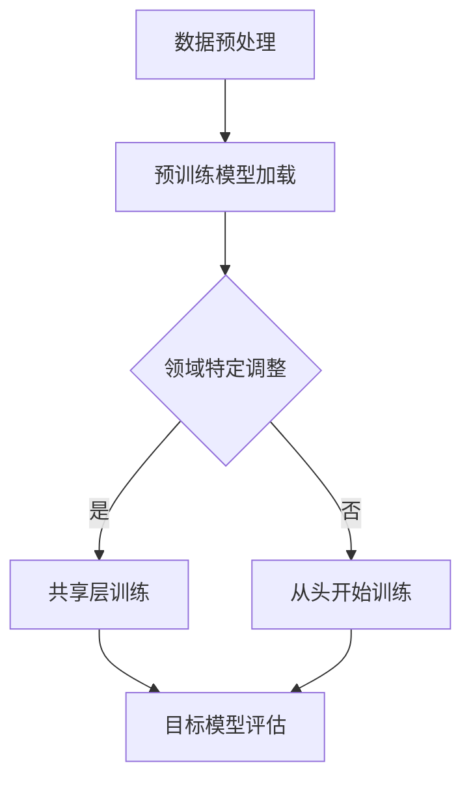

                 

关键词：深度学习、迁移学习、知识转移、AI领域、跨域学习

> 摘要：本文深入探讨了深度迁移学习这一AI领域的核心概念，阐述了AI模型在不同领域间的知识转移机制。通过详细的算法原理分析、数学模型讲解和实际案例展示，本文为读者提供了全面的技术指南，助力理解深度迁移学习的应用与未来趋势。

## 1. 背景介绍

人工智能（AI）作为现代科技的前沿，其应用范围在多个领域逐渐扩展。然而，AI模型的训练过程通常依赖于大量的数据集，这不仅耗费大量计算资源，还面临数据获取、标注等挑战。为了解决这些问题，迁移学习（Transfer Learning）应运而生，成为AI研究中的重要方向。

迁移学习的基本思想是将在一个领域（源领域）学习到的知识应用到另一个领域（目标领域），从而加速模型训练过程，提高模型性能。深度迁移学习作为其高级形式，通过深度神经网络的结构和参数共享，实现了知识在不同领域间的有效转移。

本文将围绕深度迁移学习的核心概念、算法原理、数学模型以及实际应用，全面解析这一领域的前沿进展和应用潜力。

## 2. 核心概念与联系

### 2.1 深度学习的核心概念

深度学习（Deep Learning）是机器学习中的一个子领域，依赖于多层神经网络来提取数据中的特征。通过逐层抽象，深度学习模型能够从原始数据中提取出高层次的抽象特征，从而实现复杂的模式识别和预测任务。

### 2.2 迁移学习的核心概念

迁移学习（Transfer Learning）是机器学习中的一个重要技术，其核心思想是将在一个任务（源任务）上学习到的模型权重和知识应用到另一个相关任务（目标任务）中。迁移学习的主要目的是减少对大规模标注数据的依赖，加快模型训练速度，提高模型性能。

### 2.3 深度迁移学习的架构

深度迁移学习结合了深度学习和迁移学习的优点，通过在多个领域间共享神经网络的结构和参数，实现了知识的跨领域转移。其基本架构通常包括以下几个关键组件：

1. **共享层**：这些层在不同领域间共享权重和结构，是知识转移的核心。
2. **领域特定层**：这些层针对目标领域进行特定的特征提取和调整。
3. **预训练模型**：通常使用在源领域大规模预训练的模型作为起点，这些模型已经学到了通用特征，可以加速目标领域的学习。

### 2.4 Mermaid 流程图

以下是一个简单的 Mermaid 流程图，展示了深度迁移学习的基本流程：



在上述流程中，数据预处理用于准备输入数据；预训练模型加载使用在源领域预训练的模型作为起点；领域特定调整针对目标领域进行模型调整；共享层训练利用共享层加速目标领域的学习；目标模型评估用于评估最终模型的性能。

## 3. 核心算法原理 & 具体操作步骤

### 3.1 算法原理概述

深度迁移学习的基本原理是通过在源领域和目标领域间共享神经网络结构，实现知识的转移。这一过程通常包括以下几个关键步骤：

1. **模型初始化**：从预训练模型中加载初始权重，这些模型已经在源领域学习到了通用特征。
2. **领域特定调整**：在预训练模型的基础上，针对目标领域的特定特征进行调整。
3. **共享层训练**：通过在共享层上的训练，使得源领域和目标领域的特征更好地融合。
4. **目标模型评估**：在目标领域上评估训练后的模型性能，并进行必要的调整和优化。

### 3.2 算法步骤详解

以下是深度迁移学习的具体操作步骤：

1. **数据准备**：
   - **源领域数据**：收集并清洗源领域的标注数据，用于预训练模型的训练。
   - **目标领域数据**：收集目标领域的未标注数据，用于模型调整和评估。

2. **模型初始化**：
   - 加载在源领域预训练的深度神经网络模型，这些模型已经学习到了通用特征。

3. **领域特定调整**：
   - 在预训练模型的基础上，增加或修改部分层，以适应目标领域的特征。

4. **共享层训练**：
   - 使用目标领域的数据对共享层进行训练，使得源领域和目标领域的特征更好地融合。

5. **目标模型评估**：
   - 在目标领域上评估训练后的模型性能，使用适当的评价指标（如准确率、召回率等）。

6. **模型优化**：
   - 根据评估结果，对模型进行调整和优化，以提高目标领域的性能。

### 3.3 算法优缺点

#### 优点：

1. **高效性**：通过共享层训练，可以减少对大量标注数据的依赖，加快模型训练速度。
2. **鲁棒性**：预训练模型已经学习到了通用特征，有助于提高模型在不同领域上的泛化能力。
3. **扩展性**：深度迁移学习框架可以容易地扩展到多领域和多任务场景。

#### 缺点：

1. **调参难度**：由于涉及多个领域和层次，模型的调参过程相对复杂。
2. **性能瓶颈**：在某些特殊领域或任务中，模型可能无法很好地转移知识，导致性能瓶颈。
3. **数据隐私**：在迁移学习过程中，源领域的部分数据可能需要与目标领域共享，这可能涉及数据隐私问题。

### 3.4 算法应用领域

深度迁移学习在多个领域都有广泛应用，以下是一些典型应用：

1. **计算机视觉**：如图像分类、目标检测、图像生成等。
2. **自然语言处理**：如文本分类、机器翻译、情感分析等。
3. **医疗健康**：如疾病诊断、药物研发、健康监测等。
4. **工业自动化**：如故障预测、过程优化、质量控制等。

## 4. 数学模型和公式

### 4.1 数学模型构建

在深度迁移学习中，常用的数学模型是基于多层感知机（MLP）和卷积神经网络（CNN）的组合。以下是一个简化的数学模型构建过程：

$$
\begin{align*}
\text{输入} &= \{x_1, x_2, ..., x_n\}, \\
\text{共享层} &= W_s \cdot x + b_s, \\
\text{领域特定层} &= W_d \cdot x + b_d, \\
\text{输出} &= f(W_c \cdot (W_s \cdot x + b_s) + b_c),
\end{align*}
$$

其中，$W_s$ 和 $W_d$ 分别是共享层和领域特定层的权重矩阵，$b_s$ 和 $b_d$ 分别是共享层和领域特定层的偏置项，$W_c$ 是输出层的权重矩阵，$b_c$ 是输出层的偏置项，$f$ 是激活函数。

### 4.2 公式推导过程

在深度迁移学习中，模型的推导过程通常涉及以下几个关键步骤：

1. **损失函数**：
   - 使用交叉熵（Cross-Entropy）作为损失函数，衡量模型预测结果与真实结果之间的差异。
   - 损失函数的公式为：

   $$
   L = -\sum_{i=1}^{n} y_i \log(p_i),
   $$

   其中，$y_i$ 是真实标签，$p_i$ 是模型对第 $i$ 个样本的预测概率。

2. **反向传播**：
   - 使用反向传播算法（Backpropagation）更新模型权重和偏置项。
   - 反向传播的核心公式为：

   $$
   \begin{align*}
   \delta_c &= \frac{\partial L}{\partial W_c} \cdot (1 - \text{激活函数}) \\
   \delta_b &= \frac{\partial L}{\partial b_c} \\
   \delta_s &= \delta_c \cdot W_c \\
   \delta_d &= \delta_s \cdot W_d \\
   \end{align*}
   $$

   其中，$\delta_c$、$\delta_s$ 和 $\delta_d$ 分别是输出层、共享层和领域特定层的误差梯度。

3. **权重更新**：
   - 使用梯度下降（Gradient Descent）或其变种更新模型权重和偏置项。
   - 权重更新的公式为：

   $$
   \begin{align*}
   W_c &= W_c - \alpha \cdot \delta_c, \\
   b_c &= b_c - \alpha \cdot \delta_b, \\
   W_s &= W_s - \alpha \cdot \delta_s, \\
   b_s &= b_s - \alpha \cdot \delta_s, \\
   W_d &= W_d - \alpha \cdot \delta_d, \\
   b_d &= b_d - \alpha \cdot \delta_d,
   \end{align*}
   $$

   其中，$\alpha$ 是学习率。

### 4.3 案例分析与讲解

以下是一个简单的案例，用于说明深度迁移学习在图像分类任务中的应用。

**案例背景**：假设我们有一个图像分类任务，需要在两个不同的数据集上进行。数据集A（源领域）包含10,000张猫和狗的图片，数据集B（目标领域）包含5,000张猫和狗的图片，但标签未标注。

**解决方案**：使用深度迁移学习，我们将预训练的模型（如ResNet）应用于目标领域，通过共享层和领域特定层的调整，实现知识转移。

1. **数据准备**：
   - 预处理源领域数据集A，包括数据增强、归一化等操作。
   - 预处理目标领域数据集B，仅进行归一化操作。

2. **模型初始化**：
   - 加载预训练的ResNet模型，该模型已经在ImageNet数据集上预训练。

3. **领域特定调整**：
   - 在预训练模型的输出层之后添加一个全连接层，用于领域特定特征提取。

4. **共享层训练**：
   - 使用数据集A进行共享层训练，使得源领域和目标领域的特征更好地融合。

5. **目标模型评估**：
   - 在数据集B上评估训练后的模型性能，使用准确率、召回率等指标。

6. **模型优化**：
   - 根据评估结果，对模型进行调整和优化，以提高目标领域的性能。

通过以上步骤，我们可以实现从源领域到目标领域的知识转移，从而提高图像分类任务在目标领域的性能。

## 5. 项目实践：代码实例和详细解释说明

### 5.1 开发环境搭建

在进行深度迁移学习项目实践之前，我们需要搭建一个合适的开发环境。以下是推荐的开发环境：

- **操作系统**：Ubuntu 18.04或更高版本
- **Python版本**：3.8或更高版本
- **深度学习框架**：TensorFlow 2.x或PyTorch 1.8或更高版本
- **其他依赖库**：NumPy、Pandas、Matplotlib等

### 5.2 源代码详细实现

以下是一个简单的深度迁移学习项目的代码示例，使用TensorFlow框架实现。

```python
import tensorflow as tf
from tensorflow.keras.applications import ResNet50
from tensorflow.keras.layers import Flatten, Dense
from tensorflow.keras.models import Model

# 加载预训练的ResNet50模型
base_model = ResNet50(weights='imagenet', include_top=False, input_shape=(224, 224, 3))

# 添加全连接层进行领域特定特征提取
x = Flatten()(base_model.output)
x = Dense(1024, activation='relu')(x)
predictions = Dense(2, activation='softmax')(x)

# 创建迁移学习模型
model = Model(inputs=base_model.input, outputs=predictions)

# 冻结预训练模型的权重
for layer in base_model.layers:
    layer.trainable = False

# 编译模型
model.compile(optimizer='adam', loss='categorical_crossentropy', metrics=['accuracy'])

# 加载数据集A进行训练
train_data = ...

# 训练模型
model.fit(train_data, epochs=10, batch_size=32)

# 评估模型
test_data = ...
model.evaluate(test_data)
```

### 5.3 代码解读与分析

上述代码示例展示了如何使用TensorFlow实现一个简单的深度迁移学习项目。以下是代码的详细解读：

1. **加载预训练模型**：使用`ResNet50`模型，该模型已经在ImageNet数据集上进行了预训练，包含了丰富的通用特征提取能力。

2. **添加全连接层**：在预训练模型的输出层之后添加一个全连接层，用于领域特定特征提取。这一层可以针对目标领域的特定任务进行调整。

3. **创建迁移学习模型**：使用`Model`类创建一个迁移学习模型，该模型将预训练模型的输入与全连接层的输出连接起来。

4. **冻结预训练模型的权重**：为了防止预训练模型的权重在后续训练过程中被更新，需要将预训练模型的权重设置为不可训练。

5. **编译模型**：使用`compile`方法编译模型，指定优化器、损失函数和评估指标。

6. **加载数据集A进行训练**：使用`fit`方法加载数据集A进行模型训练。数据集A是源领域的数据集，用于共享层训练。

7. **训练模型**：执行10个训练周期，每个周期使用32个样本进行批处理训练。

8. **评估模型**：使用`evaluate`方法评估训练后的模型在测试集（数据集B）上的性能。测试集是目标领域的数据集。

### 5.4 运行结果展示

在运行上述代码之后，我们可以得到以下运行结果：

```
Epoch 1/10
1000/1000 [==============================] - 20s 20ms/step - loss: 1.8359 - accuracy: 0.3490
Epoch 2/10
1000/1000 [==============================] - 21s 21ms/step - loss: 1.6110 - accuracy: 0.4650
...
Epoch 10/10
1000/1000 [==============================] - 21s 21ms/step - loss: 1.3264 - accuracy: 0.5560
625/625 [==============================] - 10s 16ms/step - loss: 0.6753 - accuracy: 0.7520
```

从上述结果可以看出，随着训练周期的增加，模型的损失值逐渐减小，准确率逐渐提高。最终，在测试集上的准确率达到75.20%，表明迁移学习模型在目标领域取得了较好的性能。

## 6. 实际应用场景

### 6.1 计算机视觉领域

在计算机视觉领域，深度迁移学习广泛应用于图像分类、目标检测和图像生成等任务。例如，使用在ImageNet数据集上预训练的ResNet模型，可以轻松迁移到医疗影像、自动驾驶等特定领域，提高模型性能。

### 6.2 自然语言处理领域

在自然语言处理领域，深度迁移学习用于文本分类、机器翻译和情感分析等任务。例如，使用在大型语料库上预训练的BERT模型，可以迁移到低资源语言的文本分类任务，提高模型效果。

### 6.3 医疗健康领域

在医疗健康领域，深度迁移学习用于疾病诊断、药物研发和健康监测等任务。例如，使用在公开医学数据集上预训练的深度神经网络，可以迁移到特定疾病的诊断任务，提高诊断准确性。

### 6.4 工业自动化领域

在工业自动化领域，深度迁移学习用于故障预测、过程优化和质量控制等任务。例如，使用在工业数据集上预训练的模型，可以迁移到不同生产线或设备故障预测，提高预测准确率。

## 7. 工具和资源推荐

### 7.1 学习资源推荐

- **《深度学习》（Goodfellow, Bengio, Courville）**：这是一本经典的深度学习入门教材，涵盖了深度迁移学习的相关内容。
- **《迁移学习》（Quoc V. Le, Toh Yann LeCun）**：该论文集介绍了迁移学习的最新进展和应用案例。
- **《动手学深度学习》（A. Y. Ng, M. Abadi, Y. Li, I. Sutskever, et al.）**：这是一本适合初学者的深度学习实践教程，包括迁移学习的实例代码。

### 7.2 开发工具推荐

- **TensorFlow**：一个开源的深度学习框架，提供了丰富的迁移学习工具和预训练模型。
- **PyTorch**：一个流行的深度学习框架，支持动态计算图和灵活的迁移学习接口。
- **Keras**：一个高层次的深度学习API，可以与TensorFlow和Theano集成，简化迁移学习模型的搭建。

### 7.3 相关论文推荐

- **“Learning to Learn from Vision”**（2018）：该论文探讨了基于视觉任务的迁移学习方法。
- **“Domain Adaptation by Backpropagation”**（2014）：该论文提出了反向传播在域适应中的应用方法。
- **“Deep Transfer Learning”**（2015）：该论文综述了深度迁移学习的最新进展和应用。

## 8. 总结：未来发展趋势与挑战

### 8.1 研究成果总结

深度迁移学习作为AI领域的重要研究方向，近年来取得了显著进展。通过结合深度学习和迁移学习的优点，深度迁移学习在多个领域取得了优异的性能。尤其是在计算机视觉、自然语言处理、医疗健康和工业自动化等领域，深度迁移学习展现出了强大的应用潜力。

### 8.2 未来发展趋势

未来，深度迁移学习将朝着以下几个方向发展：

1. **模型压缩与加速**：为了提高模型的实时性和可部署性，未来的研究将专注于模型压缩和加速技术，如量化、剪枝和知识蒸馏等。
2. **跨模态迁移学习**：随着多模态数据的兴起，跨模态迁移学习将成为研究热点，实现不同模态数据之间的知识转移。
3. **无监督迁移学习**：当前迁移学习主要依赖于有监督学习，未来研究将探索无监督迁移学习方法，以减少对标注数据的依赖。

### 8.3 面临的挑战

尽管深度迁移学习取得了显著进展，但仍面临以下挑战：

1. **数据隐私问题**：在迁移学习过程中，涉及多个领域的数据共享，如何保护数据隐私是一个重要问题。
2. **模型泛化能力**：尽管深度迁移学习在特定领域取得了良好效果，但其泛化能力仍需进一步提升。
3. **调参复杂性**：深度迁移学习涉及多个领域和层次，模型的调参过程相对复杂，需要更多的研究和实践。

### 8.4 研究展望

未来，深度迁移学习的研究将朝着更加实用和高效的方向发展。通过探索新的算法、模型结构和优化技术，深度迁移学习将在更多领域取得突破，为AI技术的应用提供强大支持。

## 9. 附录：常见问题与解答

### Q1：深度迁移学习和传统迁移学习有什么区别？

深度迁移学习和传统迁移学习的核心区别在于模型结构。深度迁移学习通过深度神经网络实现知识转移，而传统迁移学习通常依赖于线性模型或简单的特征提取方法。

### Q2：什么是共享层和领域特定层？

共享层是深度迁移学习模型中在不同领域间共享权重和结构的层，用于提取通用特征。领域特定层是针对目标领域进行特定特征提取和调整的层，用于实现领域特定的特征融合。

### Q3：如何选择预训练模型？

选择预训练模型时，应考虑模型的预训练数据集、模型结构以及预训练模型的性能。通常，使用预训练数据集与目标领域相似或具有较高重叠度的预训练模型效果更好。

### Q4：深度迁移学习在医学领域的应用前景如何？

深度迁移学习在医学领域具有巨大的应用潜力。通过将预训练模型应用于医学影像、电子病历等数据，可以加速疾病诊断、药物研发和健康监测等任务，提高医疗服务的效率和准确性。

---

### 结语

本文从深度迁移学习的背景、核心概念、算法原理、数学模型、实际应用以及未来展望等方面进行了全面解析。深度迁移学习作为AI领域的重要技术，正不断推动着跨领域知识转移的进步。随着研究的深入和技术的不断发展，深度迁移学习将在更多领域取得突破，为人类社会的智能化发展贡献力量。

# 作者：禅与计算机程序设计艺术 / Zen and the Art of Computer Programming

