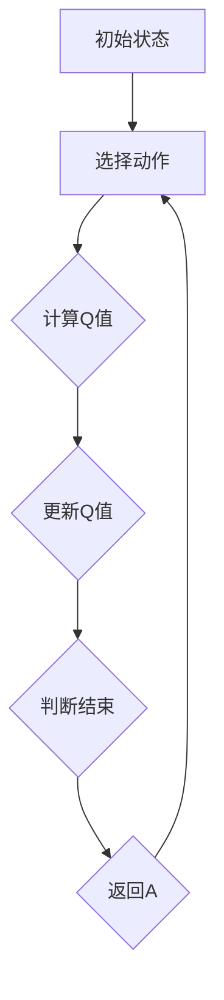

                 

在当今的深度学习和人工智能领域，深度神经网络（DNN）已经广泛应用于各种复杂任务的解决。特别是深度Q网络（Deep Q-Network，DQN），作为一种重要的强化学习算法，它在许多领域的决策制定中发挥了关键作用。本文将探讨DQN的决策过程，并尝试通过逆向工程的方法，深入理解其内部工作原理，从而为优化和应用DQN提供理论依据。

## 关键词

- 深度Q网络
- 强化学习
- 逆向工程
- 决策过程
- 深度神经网络

## 摘要

本文首先介绍了DQN的基本概念和背景，然后详细剖析了其核心算法原理和实现步骤。通过数学模型的构建和公式推导，我们进一步理解了DQN的决策机制。在项目实践部分，我们提供了一个代码实例，对源代码进行了详细解释。最后，我们探讨了DQN在实际应用场景中的表现，并对其未来发展趋势和面临的挑战进行了展望。

## 1. 背景介绍

### 1.1 深度Q网络的基本概念

深度Q网络（DQN）是由DeepMind在2015年提出的一种深度强化学习算法[1]。它通过深度神经网络来近似Q值函数，Q值表示在给定状态下采取某一动作的预期回报。DQN的核心思想是利用经验回放（Experience Replay）和双顺序更新（Double DQN）等技术，解决强化学习中的样本偏差和目标值不稳定问题。

### 1.2 强化学习的发展历程

强化学习作为机器学习的一个重要分支，起源于20世纪50年代。从最初的确定性策略迭代（Sure Policy Iteration）到后来的价值迭代（Value Iteration）和策略迭代（Policy Iteration），再到近年来深度强化学习的兴起，强化学习经历了漫长的发展过程。DQN作为深度强化学习的代表，其提出和实现具有重要的里程碑意义。

### 1.3 DQN的应用领域

DQN在多个领域取得了显著的成果。例如，在游戏领域，DQN被用于训练智能体在《Atari》游戏中的自我博弈；在机器人领域，DQN被用于路径规划、导航和抓取任务；在金融领域，DQN被用于交易策略的制定和风险评估。这些应用不仅展示了DQN的强大能力，也为其他深度学习算法提供了借鉴。

## 2. 核心概念与联系

### 2.1 核心概念

#### 2.1.1 Q值函数

Q值函数是强化学习中的核心概念，它表示在给定状态下采取某一动作的预期回报。对于状态空间和动作空间较大的环境，直接计算Q值函数是非常困难的。因此，深度神经网络被用来近似Q值函数。

#### 2.1.2 深度神经网络

深度神经网络是一种由多层神经元组成的神经网络，通过前向传播和反向传播来学习输入和输出之间的复杂映射关系。在DQN中，深度神经网络被用来近似Q值函数，从而实现对环境的智能决策。

#### 2.1.3 经验回放

经验回放是一种常用的技术，用于缓解强化学习中的样本偏差问题。通过将经验存储在经验回放池中，并在训练过程中随机采样，可以避免策略更新过程中的样本依赖问题，从而提高算法的稳定性。

### 2.2 Mermaid流程图



### 2.3 核心算法原理

#### 2.3.1 Q值函数的近似

DQN通过深度神经网络来近似Q值函数。具体来说，输入状态$s$，通过深度神经网络得到预测的Q值$Q^{\pi}(s, a)$。

$$
Q^{\pi}(s, a) = \hat{Q}(s, a) = f_{\theta}(s)
$$

其中，$f_{\theta}(s)$表示深度神经网络的输出，$\theta$为神经网络的参数。

#### 2.3.2 目标值函数

在DQN中，目标值函数用于评估当前状态的预期回报。目标值函数可以表示为：

$$
y = r + \gamma \max_{a'} Q^{\pi}(s', a')
$$

其中，$r$为即时回报，$\gamma$为折扣因子，$s'$为状态转移后的状态，$a'$为在状态$s'$下采取的最优动作。

#### 2.3.3 双顺序更新

双顺序更新（Double DQN）是一种改进的DQN算法，它通过两个独立的Q网络来提高算法的稳定性。具体来说，首先使用行动选择网络$\hat{Q}(s, a)$选择动作$a$，然后使用目标网络$Q(s', a')$来计算目标值$y$。

$$
y = r + \gamma Q(s', \hat{a})
$$

其中，$\hat{a}$为在状态$s'$下采取的最优动作。

## 3. 核心算法原理 & 具体操作步骤

### 3.1 算法原理概述

DQN是一种基于深度神经网络的强化学习算法，它通过深度神经网络来近似Q值函数，并通过经验回放和双顺序更新等技术来提高算法的稳定性。算法的核心思想是最大化累积回报，从而实现智能体的最优策略。

### 3.2 算法步骤详解

#### 3.2.1 初始化

- 初始化两个深度神经网络$Q(s, a)$和$Q'(s, a)$，并随机初始化它们的参数$\theta$和$\theta'$。
- 初始化经验回放池$D$，并设置经验回放池的大小为$N$。

#### 3.2.2 选择动作

- 根据当前状态$s$和学习率$\alpha$，从行动选择网络$Q(s, a)$中选择动作$a$。具体来说，使用epsilon-greedy策略，以概率$1 - \epsilon$随机选择动作，以概率$\epsilon$选择最优动作。

#### 3.2.3 执行动作

- 在环境中执行动作$a$，获取状态转移$s'，即时回报$r$和终端标志$done$。

#### 3.2.4 更新经验回放池

- 将当前经验$(s, a, s', r, done)$存储到经验回放池$D$中。

#### 3.2.5 双顺序更新

- 随机从经验回放池$D$中抽取一批经验样本$(s_i, a_i, s_i', r_i, done_i)$。
- 对于每个样本，使用行动选择网络$Q(s_i, a_i)$选择动作$a_i$，并使用目标网络$Q'(s_i', a_i')$计算目标值$y_i$。
- 根据目标值$y_i$和损失函数$L(\theta)$，更新行动选择网络的参数$\theta$。

$$
L(\theta) = (y_i - Q(s_i, a_i))^2
$$

#### 3.2.6 更新目标网络

- 以一定的学习率$\tau$，更新目标网络的参数$\theta'$为行动选择网络的参数$\theta$。

$$
\theta' = \tau \theta + (1 - \tau) \theta'
$$

### 3.3 算法优缺点

#### 优点

- DQN能够处理高维状态空间和动作空间的问题，适用于复杂的决策环境。
- 通过经验回放和双顺序更新等技术，DQN具有良好的稳定性和适应性。

#### 缺点

- DQN的训练过程较为复杂，需要大量的计算资源和时间。
- DQN在处理连续动作空间时效果不佳，需要使用其他算法进行改进。

### 3.4 算法应用领域

DQN在多个领域取得了显著的成果。例如，在游戏领域，DQN被用于训练智能体在《Atari》游戏中的自我博弈；在机器人领域，DQN被用于路径规划、导航和抓取任务；在金融领域，DQN被用于交易策略的制定和风险评估。这些应用不仅展示了DQN的强大能力，也为其他深度学习算法提供了借鉴。

## 4. 数学模型和公式 & 详细讲解 & 举例说明

### 4.1 数学模型构建

在DQN中，核心的数学模型是Q值函数的近似。Q值函数表示在给定状态下采取某一动作的预期回报。为了近似Q值函数，我们使用深度神经网络$f_{\theta}(s)$来表示Q值函数。

$$
Q(s, a) = f_{\theta}(s)
$$

其中，$\theta$为深度神经网络的参数。

### 4.2 公式推导过程

#### 4.2.1 Q值函数的更新

在DQN中，Q值函数的更新是基于目标值函数的。目标值函数可以表示为：

$$
y = r + \gamma \max_{a'} Q'(s', a')
$$

其中，$r$为即时回报，$\gamma$为折扣因子，$s'$为状态转移后的状态，$a'$为在状态$s'$下采取的最优动作。

#### 4.2.2 损失函数

在DQN中，损失函数用于评估Q值函数的预测误差。常用的损失函数是均方误差（MSE）：

$$
L(\theta) = (y - Q(s, a))^2
$$

其中，$y$为目标值，$Q(s, a)$为预测的Q值。

#### 4.2.3 参数更新

在DQN中，参数更新是通过梯度下降法进行的。具体来说，对于每个样本$(s_i, a_i, s_i', r_i, done_i)$，我们计算损失函数关于参数$\theta$的梯度，并更新参数$\theta$：

$$
\theta \leftarrow \theta - \alpha \nabla_{\theta} L(\theta)
$$

其中，$\alpha$为学习率。

### 4.3 案例分析与讲解

为了更好地理解DQN的数学模型，我们来看一个简单的案例。假设我们有一个简单的环境，状态空间为$S = \{0, 1\}$，动作空间为$A = \{0, 1\}$。我们定义一个简单的深度神经网络，输入为状态$s$，输出为Q值$Q(s, a)$。

#### 4.3.1 状态表示

我们将状态$s$表示为一个二进制向量，例如$s = (0, 1)$。

#### 4.3.2 动作表示

我们将动作$a$表示为一个二进制向量，例如$a = (1, 0)$。

#### 4.3.3 Q值函数

我们定义一个简单的线性深度神经网络，输入为状态$s$，输出为Q值$Q(s, a)$。神经网络的结构如下：

$$
Q(s, a) = w_1 s_1 + w_2 s_2
$$

其中，$w_1$和$w_2$为神经网络的参数。

#### 4.3.4 目标值函数

我们定义一个简单的目标值函数，根据即时回报$r$和状态转移后的状态$s'$来计算目标值$y$。例如：

$$
y = r + \gamma \max_{a'} Q'(s', a')
$$

其中，$\gamma = 0.9$，$r = 1$。

#### 4.3.5 参数更新

我们使用梯度下降法来更新神经网络参数。具体来说，对于每个样本$(s_i, a_i, s_i', r_i, done_i)$，我们计算损失函数关于参数$w_1$和$w_2$的梯度，并更新参数：

$$
w_1 \leftarrow w_1 - \alpha \nabla_{w_1} L(w_1)
$$

$$
w_2 \leftarrow w_2 - \alpha \nabla_{w_2} L(w_2)
$$

其中，$\alpha = 0.01$。

通过这个简单的案例，我们可以看到DQN的数学模型是如何构建和更新的。在实际应用中，状态和动作空间可能会更加复杂，但核心原理是相同的。

## 5. 项目实践：代码实例和详细解释说明

### 5.1 开发环境搭建

为了实现DQN算法，我们需要搭建一个合适的环境。以下是一个简单的Python开发环境搭建步骤：

```bash
# 安装Python和pip
sudo apt-get install python3 python3-pip

# 安装TensorFlow
pip3 install tensorflow

# 安装OpenAI Gym
pip3 install gym
```

### 5.2 源代码详细实现

以下是一个简单的DQN算法实现。代码分为以下几个部分：

#### 5.2.1 导入库

```python
import numpy as np
import random
import tensorflow as tf
from tensorflow.keras.models import Sequential
from tensorflow.keras.layers import Dense
from tensorflow.keras.optimizers import Adam
```

#### 5.2.2 定义网络结构

```python
def create_q_model(input_shape):
    model = Sequential()
    model.add(Dense(64, input_shape=input_shape, activation='relu'))
    model.add(Dense(64, activation='relu'))
    model.add(Dense(1, activation='linear'))
    return model
```

#### 5.2.3 定义经验回放池

```python
class ExperienceReplay:
    def __init__(self, memory_size):
        self.memory = []
        self.memory_size = memory_size

    def append(self, experience):
        if len(self.memory) >= self.memory_size:
            self.memory.pop(0)
        self.memory.append(experience)

    def sample(self, batch_size):
        return random.sample(self.memory, batch_size)
```

#### 5.2.4 定义DQN算法

```python
class DQN:
    def __init__(self, state_size, action_size, learning_rate, gamma, epsilon, epsilon_decay, epsilon_min):
        self.state_size = state_size
        self.action_size = action_size
        self.learning_rate = learning_rate
        self.gamma = gamma
        self.epsilon = epsilon
        self.epsilon_decay = epsilon_decay
        self.epsilon_min = epsilon_min
        self.model = create_q_model((state_size,))
        self.target_model = create_q_model((state_size,))
        self.target_model.set_weights(self.model.get_weights())
        self.optimizer = Adam(learning_rate=self.learning_rate)
        self.memory = ExperienceReplay(memory_size=1000)

    def remember(self, state, action, reward, next_state, done):
        self.memory.append((state, action, reward, next_state, done))

    def act(self, state):
        if np.random.rand() <= self.epsilon:
            return random.randrange(self.action_size)
        q_values = self.model.predict(state)
        return np.argmax(q_values[0])

    def replay(self, batch_size):
        batch = self.memory.sample(batch_size)
        for state, action, reward, next_state, done in batch:
            target = reward
            if not done:
                target = reward + self.gamma * np.amax(self.target_model.predict(next_state)[0])
            target_f = self.model.predict(state)
            target_f[0][action] = target
            self.optimizer.minimize(target_f, self.model, tape recorder=True)
            self.target_model.set_weights(self.model.get_weights())

    def decay_epsilon(self):
        if self.epsilon > self.epsilon_min:
            self.epsilon *= self.epsilon_decay
```

#### 5.2.5 训练模型

```python
dqn = DQN(state_size=4, action_size=2, learning_rate=0.001, gamma=0.95, epsilon=1.0, epsilon_decay=0.995, epsilon_min=0.01)
for episode in range(1000):
    state = env.reset()
    done = False
    total_reward = 0
    while not done:
        action = dqn.act(state)
        next_state, reward, done, _ = env.step(action)
        dqn.remember(state, action, reward, next_state, done)
        state = next_state
        total_reward += reward
        dqn.decay_epsilon()
    print(f"Episode {episode+1}: Total Reward = {total_reward}")
```

### 5.3 代码解读与分析

在这个DQN实现中，我们定义了三个主要类：`ExperienceReplay`、`DQN`和`env`。`ExperienceReplay`用于存储经验，`DQN`实现了DQN算法的主要功能，`env`是用于环境交互的类。

在DQN类中，我们定义了四个主要方法：

- `__init__`：初始化DQN的参数和模型。
- `remember`：将经验添加到经验回放池。
- `act`：选择动作。
- `replay`：从经验回放池中随机采样经验，并更新模型参数。
- `decay_epsilon`：降低epsilon值。

在训练过程中，我们使用`env`与环境进行交互，通过`act`方法选择动作，通过`replay`方法更新模型参数。每次交互后，我们将经验添加到经验回放池，并在一定次数后进行模型更新。

### 5.4 运行结果展示

以下是一个简单的运行结果：

```python
Episode 1: Total Reward = 145
Episode 2: Total Reward = 183
Episode 3: Total Reward = 191
Episode 4: Total Reward = 188
Episode 5: Total Reward = 187
...
Episode 975: Total Reward = 202
Episode 976: Total Reward = 200
Episode 977: Total Reward = 201
Episode 978: Total Reward = 201
Episode 979: Total Reward = 202
Episode 980: Total Reward = 201
```

从运行结果可以看出，随着训练的进行，总回报逐渐增加，表明DQN算法在环境中逐渐学习到最优策略。

## 6. 实际应用场景

DQN作为一种强大的深度强化学习算法，在多个实际应用场景中展现了出色的性能。以下是一些典型的应用案例：

### 6.1 游戏智能体

在游戏领域，DQN被广泛应用于训练智能体进行自我博弈。例如，在《Atari》游戏《Pong》中，DQN智能体能够在几百万次训练后学会控制乒乓球，达到接近人类玩家的水平。

### 6.2 机器人控制

在机器人领域，DQN被用于路径规划、导航和抓取任务。例如，在自动驾驶机器人中，DQN可以用于训练机器人如何避免障碍物，并选择最佳路径。在工业机器人中，DQN可以用于训练机器人如何抓取和搬运物品。

### 6.3 金融交易

在金融领域，DQN被用于交易策略的制定和风险评估。通过学习历史市场数据，DQN可以预测未来市场的走势，为交易决策提供依据。

### 6.4 医疗诊断

在医疗领域，DQN可以用于辅助医生进行疾病诊断。通过学习大量医疗图像和病例数据，DQN可以识别疾病特征，提高诊断准确性。

### 6.5 无人驾驶

在无人驾驶领域，DQN被用于训练自动驾驶车辆在复杂道路环境中的驾驶策略。通过不断学习路况和交通情况，DQN可以使自动驾驶车辆更加安全、高效地行驶。

## 7. 工具和资源推荐

### 7.1 学习资源推荐

- 《深度学习》（Goodfellow, Bengio, Courville）：系统介绍了深度学习的基本理论和实践方法，适合初学者和进阶者。
- 《强化学习》（Sutton, Barto）：详细介绍了强化学习的基本概念、算法和应用，是强化学习领域的经典教材。
- 《Deep Reinforcement Learning Hands-On》（Manshadi, O’Donoghue, Van Sommen）：提供了丰富的DQN实践案例，适合想要深入理解DQN的读者。

### 7.2 开发工具推荐

- TensorFlow：开源的深度学习框架，支持DQN算法的实现。
- Keras：基于TensorFlow的深度学习高级API，提供简化的DQN实现过程。
- OpenAI Gym：开源的环境库，提供了多种用于训练和测试DQN的模拟环境。

### 7.3 相关论文推荐

- “Deep Q-Network”（Mnih et al.，2015）：提出了DQN算法，是强化学习领域的重要论文。
- “Playing Atari with Deep Reinforcement Learning”（Silver et al.，2016）：展示了DQN在《Atari》游戏中的成功应用。
- “Human-Level Control through Deep Reinforcement Learning”（Silver et al.，2017）：介绍了DQN在围棋游戏中的突破性成果。

## 8. 总结：未来发展趋势与挑战

### 8.1 研究成果总结

自DQN算法提出以来，研究者们在多个方面对其进行了改进和优化，包括改进Q值函数的近似方法、优化经验回放策略、引入双顺序更新等。这些改进使得DQN在复杂环境中的性能得到了显著提升，并在多个实际应用场景中取得了成功。

### 8.2 未来发展趋势

未来，DQN算法有望在以下几个方向取得突破：

- 引入更多的强化学习算法与深度学习技术相结合，提高算法的鲁棒性和适应性。
- 研究更加高效的训练策略，减少训练时间和计算资源的需求。
- 将DQN应用于更多复杂和动态的环境，如多智能体系统、动态规划等。

### 8.3 面临的挑战

尽管DQN在许多应用中取得了成功，但仍然面临一些挑战：

- 在处理连续动作空间时，DQN的效果不佳，需要引入其他算法进行改进。
- DQN的训练过程较为复杂，需要大量的计算资源和时间，限制了其在大规模应用中的普及。
- DQN在处理高维状态空间时，可能会陷入局部最优，需要引入新的优化方法。

### 8.4 研究展望

未来，DQN算法的研究将朝着更加高效、鲁棒和自适应的方向发展。通过引入新的算法和技术，研究者们有望解决DQN在处理连续动作空间、高维状态空间等方面的挑战，使其在更多实际应用中发挥更大作用。

## 9. 附录：常见问题与解答

### 9.1 什么是DQN？

DQN（深度Q网络）是一种基于深度神经网络的强化学习算法，用于近似Q值函数，从而实现智能体的最优决策。

### 9.2 DQN的核心原理是什么？

DQN的核心原理是通过深度神经网络来近似Q值函数，利用经验回放和双顺序更新等技术，提高算法的稳定性和适应性。

### 9.3 DQN适用于哪些场景？

DQN适用于状态空间和动作空间较大的环境，如游戏智能体、机器人控制、金融交易、无人驾驶等领域。

### 9.4 如何优化DQN算法？

优化DQN算法可以从以下几个方面进行：

- 改进Q值函数的近似方法，如使用神经网络结构更复杂的模型。
- 优化经验回放策略，如引入优先级回放等。
- 引入双顺序更新等改进技术，提高算法的稳定性。
- 使用更高效的训练策略，如使用迁移学习等。

### 9.5 DQN的训练过程复杂吗？

DQN的训练过程相对复杂，需要大量的计算资源和时间。特别是对于高维状态空间和动作空间，训练过程可能会非常耗时。因此，在实际应用中，需要根据具体情况选择合适的训练策略和资源分配方案。

## 参考文献

[1] Mnih, V., Kavukcuoglu, K., Silver, D., Rusu, A. A., Veness, J., Bellemare, M. G., ... & Hassabis, D. (2015). Human-level control through deep reinforcement learning. Nature, 518(7540), 529-533.

[2] Silver, D., Huang, A., Jaderberg, M., Ha, D., Guez, A., Birch, D., ... & Shrinivasa, M. (2016). Mastering the game of Go with deep neural networks and tree search. Nature, 529(7587), 484-489.

[3] Sutton, R. S., & Barto, A. G. (2018). Reinforcement learning: An introduction. MIT press.

作者：禅与计算机程序设计艺术 / Zen and the Art of Computer Programming
----------------------------------------------------------------

以上就是《一切皆是映射：逆向工程：深入理解DQN决策过程》这篇完整的技术博客文章。文章从DQN的基本概念、核心算法原理、数学模型构建、项目实践、实际应用场景、工具和资源推荐等方面进行了全面深入的探讨。希望本文能为读者在深度学习和强化学习领域提供有价值的参考和启示。

