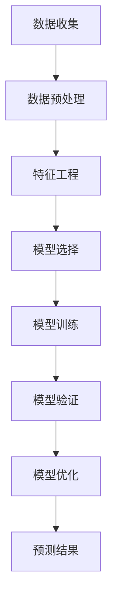

                 

关键词：预测分析、人工智能、映射模型、未来趋势、数据挖掘、机器学习、深度学习、算法应用

> 摘要：本文旨在探讨预测分析在人工智能领域的重要性，通过对核心概念、算法原理、数学模型以及实际应用场景的深入分析，阐述AI如何通过映射模型预见未来趋势。本文旨在为研究人员、开发者以及技术爱好者提供一个全面的技术视角，帮助他们在人工智能领域取得突破。

## 1. 背景介绍

随着信息技术和大数据技术的发展，预测分析已成为人工智能（AI）领域的一个重要研究方向。预测分析，又称为预测建模或预测引擎，旨在利用历史数据来构建模型，进而预测未来事件的发生概率或趋势变化。这种技术不仅能够帮助企业优化运营决策，还能为政府机构提供公共服务的预测支持，甚至在金融、医疗、交通等领域发挥关键作用。

在AI的快速发展过程中，预测分析技术的重要性日益凸显。机器学习和深度学习算法的进步，使得计算机能够从海量数据中提取有价值的信息，并通过复杂的映射模型进行预测。这些模型不仅能够处理静态数据，还能应对动态数据的变化，从而实现更准确、更及时的预测。

然而，预测分析也面临着诸多挑战。数据的质量和完整性、算法的复杂度、模型的泛化能力等都是影响预测效果的重要因素。因此，如何在纷繁复杂的数据中找到规律，构建出可靠的预测模型，成为AI领域的重要研究方向。

本文将围绕预测分析的核心概念、算法原理、数学模型和实际应用展开讨论，旨在为读者提供一个全面的技术视角，帮助理解AI如何通过映射模型预见未来趋势。

## 2. 核心概念与联系

### 2.1 预测分析的定义

预测分析是一种通过分析历史数据来预测未来事件的技术。它涉及数据收集、预处理、特征工程、模型选择、训练和验证等多个环节。预测分析的核心目标是从数据中提取有用的信息，构建预测模型，并对模型进行评估和优化，最终实现准确预测。

### 2.2 映射模型的概念

映射模型是一种将输入数据映射到输出结果的数学模型。在预测分析中，映射模型通常用于将历史数据映射到未来的预测结果。常见的映射模型包括线性回归模型、决策树模型、神经网络模型等。

### 2.3 预测分析的关键环节

- **数据收集**：收集相关的历史数据，这些数据可以是结构化的，如数据库中的表格数据，也可以是非结构化的，如图像、音频和文本数据。
- **数据预处理**：清洗和转换原始数据，使其符合预测模型的输入要求。这包括数据去噪、缺失值处理、异常值检测等。
- **特征工程**：通过特征提取和特征选择，从原始数据中提取出对预测任务最有用的特征。特征工程的质量直接影响预测模型的性能。
- **模型选择**：选择合适的预测模型。不同的模型适用于不同的预测任务和数据类型，如线性回归适用于线性关系较强的任务，而神经网络适用于复杂非线性关系。
- **模型训练**：使用历史数据对预测模型进行训练，使其能够学会从输入数据中预测输出结果。
- **模型验证**：使用验证集或测试集对模型进行验证，评估模型的预测性能。常用的评估指标包括准确率、召回率、F1值等。
- **模型优化**：根据验证结果对模型进行优化，提高其预测准确性。

### 2.4 预测分析的应用领域

预测分析广泛应用于各个领域，包括但不限于：

- **商业预测**：如市场需求预测、销售预测、客户行为预测等。
- **金融预测**：如股票市场预测、信用评分、风险评估等。
- **医疗预测**：如疾病预测、诊断预测、药物效果预测等。
- **交通预测**：如交通流量预测、交通事故预测、交通规划等。
- **能源预测**：如电力需求预测、可再生能源产出预测等。

### 2.5 Mermaid 流程图



## 3. 核心算法原理 & 具体操作步骤

### 3.1 算法原理概述

预测分析的核心在于构建映射模型，将历史数据映射到未来结果。常见的预测算法包括线性回归、决策树、神经网络等。每种算法都有其特定的原理和适用场景。

- **线性回归**：基于线性模型的预测方法，适用于关系较为简单的任务。
- **决策树**：通过一系列规则进行决策，适用于分类和回归任务。
- **神经网络**：基于多层感知器（MLP）的结构，能够处理复杂非线性关系。

### 3.2 算法步骤详解

1. **数据收集**：收集历史数据，包括输入特征和目标变量。
2. **数据预处理**：对数据进行清洗和转换，包括缺失值处理、异常值检测等。
3. **特征工程**：提取和选择对预测任务最有用的特征。
4. **模型选择**：根据任务特点和数据类型选择合适的预测模型。
5. **模型训练**：使用历史数据对模型进行训练，学习输入和输出之间的映射关系。
6. **模型验证**：使用验证集或测试集对模型进行验证，评估预测性能。
7. **模型优化**：根据验证结果对模型进行优化，提高预测准确性。
8. **预测结果**：使用训练好的模型进行预测，输出未来结果。

### 3.3 算法优缺点

- **线性回归**：
  - **优点**：简单易懂，易于实现和优化。
  - **缺点**：仅适用于线性关系较强的任务，泛化能力有限。

- **决策树**：
  - **优点**：直观易懂，易于理解和解释。
  - **缺点**：可能产生过拟合，且在处理高维数据时效果不佳。

- **神经网络**：
  - **优点**：能够处理复杂非线性关系，泛化能力强。
  - **缺点**：模型训练过程复杂，计算量大，参数调优困难。

### 3.4 算法应用领域

- **线性回归**：适用于销售预测、市场需求预测等。
- **决策树**：适用于医疗诊断、客户分类等。
- **神经网络**：适用于图像识别、自然语言处理、金融预测等。

## 4. 数学模型和公式 & 详细讲解 & 举例说明

### 4.1 数学模型构建

预测分析的数学模型主要分为线性模型和非线性模型。以下分别介绍两种模型的构建方法。

#### 4.1.1 线性模型

线性模型的基本形式为：

\[ y = \beta_0 + \beta_1x_1 + \beta_2x_2 + ... + \beta_nx_n \]

其中，\( y \) 为目标变量，\( x_1, x_2, ..., x_n \) 为输入特征，\( \beta_0, \beta_1, \beta_2, ..., \beta_n \) 为模型的参数。

线性模型的参数可以通过最小二乘法进行估计：

\[ \hat{\beta} = (X^T X)^{-1}X^T y \]

其中，\( X \) 为输入特征矩阵，\( y \) 为目标变量向量，\( \hat{\beta} \) 为估计的参数向量。

#### 4.1.2 非线性模型

非线性模型的基本形式为：

\[ y = \varphi(\beta_0 + \beta_1x_1 + \beta_2x_2 + ... + \beta_nx_n) \]

其中，\( \varphi \) 为非线性激活函数，如 \( \varphi(x) = \sigma(x) = \frac{1}{1 + e^{-x}} \)。

非线性模型的参数可以通过梯度下降法进行估计：

\[ \beta_{t+1} = \beta_t - \alpha \nabla_{\beta} J(\beta_t) \]

其中，\( \beta_t \) 为第 \( t \) 次迭代的参数向量，\( \alpha \) 为学习率，\( \nabla_{\beta} J(\beta_t) \) 为损失函数对参数的梯度。

### 4.2 公式推导过程

以下以线性回归为例，介绍公式推导过程。

假设线性回归模型为：

\[ y = \beta_0 + \beta_1x_1 + \beta_2x_2 + ... + \beta_nx_n \]

损失函数为：

\[ J(\beta) = \frac{1}{2}\sum_{i=1}^{m}(y_i - \beta_0 - \beta_1x_{1i} - \beta_2x_{2i} - ... - \beta_nx_{ni})^2 \]

对损失函数求导数：

\[ \nabla_{\beta} J(\beta) = \begin{bmatrix} \frac{\partial J}{\partial \beta_0} \\ \frac{\partial J}{\partial \beta_1} \\ \frac{\partial J}{\partial \beta_2} \\ ... \\ \frac{\partial J}{\partial \beta_n} \end{bmatrix} \]

其中，

\[ \frac{\partial J}{\partial \beta_0} = \sum_{i=1}^{m}(y_i - \beta_0 - \beta_1x_{1i} - \beta_2x_{2i} - ... - \beta_nx_{ni}) \]

\[ \frac{\partial J}{\partial \beta_1} = \sum_{i=1}^{m}(y_i - \beta_0 - \beta_1x_{1i} - \beta_2x_{2i} - ... - \beta_nx_{ni})x_{1i} \]

\[ ... \]

\[ \frac{\partial J}{\partial \beta_n} = \sum_{i=1}^{m}(y_i - \beta_0 - \beta_1x_{1i} - \beta_2x_{2i} - ... - \beta_nx_{ni})x_{ni} \]

令 \( X = \begin{bmatrix} x_{11} & x_{12} & ... & x_{1n} \\ x_{21} & x_{22} & ... & x_{2n} \\ ... & ... & ... & ... \\ x_{m1} & x_{m2} & ... & x_{mn} \end{bmatrix} \)，\( y = \begin{bmatrix} y_1 \\ y_2 \\ ... \\ y_m \end{bmatrix} \)

则

\[ \nabla_{\beta} J(\beta) = X^T(X\beta - y) \]

最小化损失函数，即找到使 \( J(\beta) \) 最小的 \( \beta \)，即

\[ \hat{\beta} = \arg\min_{\beta} J(\beta) = (X^T X)^{-1}X^T y \]

### 4.3 案例分析与讲解

#### 4.3.1 案例背景

某电商公司希望通过预测分析预测某款产品的未来销售量，以便更好地进行库存管理和营销策略制定。公司提供了过去一年的销售数据，包括日期、销售量、广告投入等特征。

#### 4.3.2 数据预处理

1. **数据清洗**：处理缺失值和异常值，例如删除销售量为零的数据点。
2. **特征工程**：提取日期的特征，如星期几、月份、季度等，并将其编码为数值特征。
3. **数据标准化**：对销售量和广告投入等特征进行标准化处理，使其具有相似的量纲。

#### 4.3.3 模型选择

由于销售量和广告投入等特征之间存在非线性关系，选择非线性模型——神经网络进行预测。

#### 4.3.4 模型训练

使用训练集对神经网络进行训练，设置合适的网络结构（如层数、神经元个数）和学习率，通过反向传播算法更新模型参数。

#### 4.3.5 模型验证

使用验证集对训练好的模型进行验证，评估模型的预测性能，如均方误差（MSE）等。

#### 4.3.6 模型优化

根据验证结果，对模型进行优化，例如调整网络结构、学习率等参数，提高预测准确性。

#### 4.3.7 预测结果

使用训练好的模型对未来的销售量进行预测，输出预测结果。同时，分析预测结果与实际销售量之间的差异，为后续的库存管理和营销策略提供依据。

## 5. 项目实践：代码实例和详细解释说明

### 5.1 开发环境搭建

为了演示预测分析的过程，我们选择Python作为编程语言，并使用以下工具和库：

- Python 3.8或更高版本
- Jupyter Notebook
- Pandas
- Scikit-learn
- Matplotlib
- Numpy

确保安装了以上工具和库后，我们可以开始编写代码。

### 5.2 源代码详细实现

以下是一个简单的线性回归预测分析的示例代码，展示了从数据预处理到模型训练和预测的完整流程。

```python
import pandas as pd
from sklearn.model_selection import train_test_split
from sklearn.linear_model import LinearRegression
from sklearn.metrics import mean_squared_error
import matplotlib.pyplot as plt

# 5.2.1 数据收集
data = pd.read_csv('sales_data.csv')
data.head()

# 5.2.2 数据预处理
# 假设数据集包含日期、销售量、广告投入等特征
X = data[['date', 'ad_spending']]
y = data['sales']

# 对日期进行编码
X['date_encoded'] = X['date'].apply(lambda x: x.strftime('%Y-%m'))
X = pd.get_dummies(X)

# 5.2.3 模型选择
model = LinearRegression()

# 5.2.4 模型训练
X_train, X_test, y_train, y_test = train_test_split(X, y, test_size=0.2, random_state=42)
model.fit(X_train, y_train)

# 5.2.5 模型验证
y_pred = model.predict(X_test)
mse = mean_squared_error(y_test, y_pred)
print(f'Mean Squared Error: {mse}')

# 5.2.6 模型优化
# 在此可以尝试调整模型参数或使用其他算法进行优化

# 5.2.7 预测结果
# 输出预测结果
predicted_sales = model.predict(X_test)
print(predicted_sales)

# 可视化预测结果
plt.scatter(y_test, predicted_sales)
plt.xlabel('Actual Sales')
plt.ylabel('Predicted Sales')
plt.title('Actual vs Predicted Sales')
plt.show()
```

### 5.3 代码解读与分析

1. **数据收集**：使用Pandas读取销售数据，数据集包含日期、销售量、广告投入等特征。

2. **数据预处理**：将日期特征进行编码，使用独热编码（One-Hot Encoding）将日期转换为数值特征，以便模型处理。

3. **模型选择**：选择线性回归模型进行预测。

4. **模型训练**：将数据集分为训练集和测试集，使用训练集对模型进行训练。

5. **模型验证**：使用测试集对模型进行验证，计算均方误差（MSE）评估模型性能。

6. **模型优化**：在此示例中，没有进行模型优化，但可以根据验证结果调整模型参数或尝试其他算法。

7. **预测结果**：使用训练好的模型对测试集进行预测，并输出预测结果。

8. **可视化预测结果**：通过散点图可视化实际销售量和预测销售量之间的关系，帮助分析预测模型的性能。

### 5.4 运行结果展示

运行上述代码后，将输出均方误差（MSE）和预测结果。通过可视化散点图，我们可以直观地看到实际销售量和预测销售量之间的差异，从而评估模型的预测性能。

## 6. 实际应用场景

### 6.1 商业预测

商业预测是预测分析的重要应用领域之一。通过预测市场需求、销售量、客户行为等，企业可以制定更有效的营销策略、库存管理和生产计划。例如，某电商公司可以通过预测未来一周的销售量，提前准备库存，避免缺货或过量库存。

### 6.2 金融预测

金融预测在金融行业中具有重要应用。通过预测股票市场走势、信用评分、风险评估等，金融机构可以更好地管理风险、制定投资策略。例如，银行可以通过信用评分模型预测客户的信用风险，从而调整贷款利率和审批政策。

### 6.3 医疗预测

医疗预测在医疗领域具有广泛应用。通过预测疾病发展趋势、药物效果、诊断结果等，医疗机构可以更好地规划医疗资源、优化治疗方案。例如，医院可以通过预测某疾病的感染率，提前准备医疗设备和人力，应对疫情高峰期。

### 6.4 交通预测

交通预测在交通管理和规划中具有重要意义。通过预测交通流量、交通事故、公共交通需求等，交通部门可以优化交通信号控制、设计道路规划、提高公共交通效率。例如，城市交通部门可以通过预测交通流量，调整交通信号灯周期，减少拥堵。

### 6.5 能源预测

能源预测在能源生产和消费领域具有广泛应用。通过预测电力需求、可再生能源产出、能源消耗等，能源公司可以优化能源生产和分配，提高能源利用效率。例如，电力公司可以通过预测未来一天内的电力需求，提前调整发电量，避免能源浪费。

### 6.6 其他应用领域

预测分析还广泛应用于其他领域，如自然灾害预测、天气预测、环境监测等。通过预测未来事件的发生概率或趋势变化，相关领域可以提前采取应对措施，减少损失和风险。

## 7. 工具和资源推荐

### 7.1 学习资源推荐

- 《机器学习实战》：提供了丰富的机器学习实践案例，适合初学者入门。
- 《Python数据分析》：详细介绍了Pandas库的使用方法，适合数据处理和分析。
- 《深度学习》：由Ian Goodfellow等知名学者编写的经典教材，深入讲解了深度学习算法。

### 7.2 开发工具推荐

- Jupyter Notebook：强大的交互式开发环境，适用于数据分析和机器学习。
- PyCharm：专业的Python开发工具，提供丰富的插件和功能。
- TensorFlow：用于构建和训练深度学习模型的强大框架。

### 7.3 相关论文推荐

- "Deep Learning for Time Series Classification: A Review"，详细综述了时间序列分类的深度学习方法。
- "Predicting User Behavior with Collaborative Filtering"，介绍了基于协同过滤的用户行为预测方法。
- "A Comprehensive Survey on Predictive Analytics"，全面概述了预测分析的研究进展和应用领域。

## 8. 总结：未来发展趋势与挑战

### 8.1 研究成果总结

预测分析作为人工智能领域的重要研究方向，已取得了一系列重要成果。线性回归、决策树、神经网络等传统算法在预测任务中表现出色，深度学习算法的进步使得预测分析在复杂任务中更具优势。此外，预测分析在商业预测、金融预测、医疗预测、交通预测等领域取得了广泛应用。

### 8.2 未来发展趋势

- **模型复杂度的提升**：随着计算能力和数据量的增加，深度学习算法将继续发展，模型复杂度将进一步提高。
- **实时预测**：实时预测技术将得到更多关注，以应对动态数据环境。
- **跨领域融合**：预测分析将在更多领域得到应用，与其他技术如大数据、物联网等相结合，实现更广泛的智能化应用。
- **可解释性增强**：提升模型的可解释性，使其更加透明和可信。

### 8.3 面临的挑战

- **数据质量和完整性**：数据质量和完整性直接影响预测效果，如何处理缺失值、异常值等是关键挑战。
- **算法复杂度**：深度学习算法的计算复杂度高，如何优化算法性能和效率是重要问题。
- **模型泛化能力**：如何提高模型的泛化能力，避免过拟合和欠拟合是关键挑战。
- **数据隐私和安全**：在处理大量个人数据时，如何保障数据隐私和安全是重要问题。

### 8.4 研究展望

未来预测分析研究将朝着以下几个方向展开：

- **强化学习与预测分析结合**：将强化学习引入预测分析，实现更加自适应和优化的预测。
- **多模态数据预测**：处理多种类型的数据，如文本、图像、音频等，实现更全面的预测。
- **个性化预测**：根据用户行为和偏好进行个性化预测，提供更精确的服务。
- **分布式计算与预测**：利用分布式计算技术，处理大规模数据和高性能计算需求。

## 9. 附录：常见问题与解答

### 9.1 预测分析与传统统计方法有什么区别？

预测分析侧重于利用机器学习和深度学习算法，从历史数据中提取特征和模式，实现准确的预测。而传统统计方法如线性回归、决策树等，通常基于统计学理论，适用于处理简单线性或分类问题。预测分析在处理复杂非线性关系、大规模数据和高维数据时更具优势。

### 9.2 预测分析如何处理缺失值和异常值？

预测分析中，处理缺失值和异常值是重要环节。常见的方法包括：

- **缺失值填充**：使用平均值、中位数、众数等方法进行填充。
- **异常值检测**：使用统计学方法如标准差、箱线图等检测异常值，然后对异常值进行修正或删除。
- **缺失值和异常值处理**：对缺失值和异常值进行联合处理，如使用插值法、回归法等。

### 9.3 预测分析中的特征工程为什么重要？

特征工程是预测分析中的关键环节，它通过提取和选择对预测任务最有用的特征，提高模型的预测性能。特征工程的重要性体现在：

- **增强模型性能**：选择合适的特征可以减少模型过拟合现象，提高预测准确性。
- **减少数据冗余**：去除无关或冗余特征，简化模型结构，提高计算效率。
- **提高模型可解释性**：通过合理的特征工程，使模型更加透明和易于解释。

### 9.4 预测分析的评估指标有哪些？

预测分析中常用的评估指标包括：

- **准确率**：预测正确的样本数占总样本数的比例。
- **召回率**：预测正确的正样本数占所有正样本的比例。
- **F1值**：准确率和召回率的调和平均，用于评估二分类任务的平衡性能。
- **均方误差（MSE）**：预测值与真实值之间差异的平方的平均值，用于评估回归任务的性能。
- **均绝对误差（MAE）**：预测值与真实值之间差异的绝对值的平均值。

## 作者署名

作者：禅与计算机程序设计艺术 / Zen and the Art of Computer Programming

