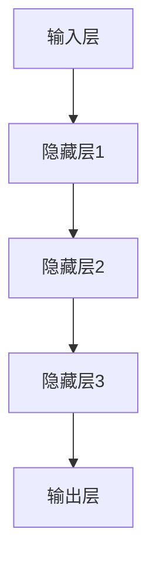

                 

关键词：大模型、创业、宿命、人工智能、技术、未来、挑战

> 摘要：本文探讨了在人工智能大模型时代，创业者们面临的不同宿命。从技术到市场，从团队到产品，本文深入分析了七种可能的宿命，以及如何在这七种宿命中找到成功的路径。

## 1. 背景介绍

随着人工智能技术的快速发展，大模型（如GPT、BERT等）已经成为科技领域的热点。这些模型不仅具备强大的数据处理能力，还能通过学习海量数据，实现自然语言处理、图像识别、语音合成等多种应用。然而，随着大模型的广泛应用，创业者在选择技术方向、构建团队、开发产品等方面也面临着前所未有的挑战和机遇。

本文将探讨七种可能的宿命，即创业者在人工智能大模型领域可能遇到的不同局面，并分析如何在这七种宿命中找到成功的路径。

## 2. 核心概念与联系

### 大模型的原理与架构

大模型是基于深度学习的神经网络，具有大规模参数和强大的计算能力。其基本原理包括：

- **神经元激活函数**：用于将输入映射到输出。
- **反向传播算法**：用于调整模型参数，提高模型预测的准确性。
- **优化算法**：如Adam、SGD等，用于加速模型训练。

架构方面，大模型通常包括以下几个层次：

1. **输入层**：接收外部数据，如文本、图像等。
2. **隐藏层**：进行数据预处理和特征提取。
3. **输出层**：生成预测结果。

以下是使用Mermaid绘制的简单流程图：



### 创业者在人工智能大模型领域的宿命

在人工智能大模型领域，创业者可能面临以下七种宿命：

1. **技术创新者**：率先推出具有颠覆性技术的大模型产品。
2. **技术追随者**：在技术创新者之后，通过改进技术，抢占市场份额。
3. **市场领导者**：在市场中占据主导地位，成为行业标准制定者。
4. **技术革新者**：在原有大模型基础上，引入新的技术，实现产品升级。
5. **技术淘汰者**：无法跟上技术发展的步伐，被市场淘汰。
6. **跨界融合者**：将大模型技术与其他领域相结合，创造新的商业模式。
7. **技术依赖者**：过度依赖大模型技术，缺乏核心竞争力。

## 3. 核心算法原理 & 具体操作步骤

### 3.1 算法原理概述

大模型的核心算法包括深度学习、神经网络、优化算法等。以下简要介绍这些算法的基本原理：

- **深度学习**：通过多层神经网络，对数据进行特征提取和模式识别。
- **神经网络**：由大量神经元组成，通过激活函数和权重调整，实现输入到输出的映射。
- **优化算法**：如Adam、SGD等，用于调整模型参数，提高模型预测的准确性。

### 3.2 算法步骤详解

1. **数据预处理**：对输入数据进行清洗、归一化等处理。
2. **模型训练**：通过反向传播算法，调整模型参数，实现数据拟合。
3. **模型评估**：使用验证集或测试集，评估模型性能。
4. **模型优化**：根据评估结果，调整模型参数，提高模型准确性。
5. **模型部署**：将训练好的模型部署到实际应用场景中。

### 3.3 算法优缺点

**优点**：

- **强大的数据处理能力**：大模型能够处理海量数据，实现高效的数据分析和预测。
- **自适应能力**：通过不断优化，大模型能够适应不同的应用场景。
- **跨领域应用**：大模型可以应用于多个领域，如自然语言处理、图像识别、语音合成等。

**缺点**：

- **计算资源需求大**：大模型训练需要大量计算资源和时间。
- **数据依赖性强**：大模型性能依赖于大量高质量数据，数据不足可能导致模型过拟合。
- **模型解释性差**：大模型的内部决策过程较为复杂，难以解释。

### 3.4 算法应用领域

大模型在多个领域具有广泛的应用前景：

- **自然语言处理**：文本分类、机器翻译、情感分析等。
- **图像识别**：人脸识别、图像分类、物体检测等。
- **语音合成**：语音识别、语音合成、语音生成等。
- **推荐系统**：个性化推荐、商品推荐、内容推荐等。

## 4. 数学模型和公式 & 详细讲解 & 举例说明

### 4.1 数学模型构建

大模型的数学模型主要包括深度学习、神经网络、优化算法等。以下以深度学习为例，介绍其数学模型构建过程：

- **神经元激活函数**：设输入为x，权重为w，偏置为b，激活函数为f，则有：

  $$z = wx + b$$  
  $$a = f(z)$$

- **损失函数**：用于衡量模型预测结果与真实值之间的差距，常见的损失函数有均方误差（MSE）：

  $$L = \frac{1}{2} \sum_{i=1}^{n} (y_i - \hat{y}_i)^2$$

- **优化算法**：用于调整模型参数，常见的优化算法有梯度下降（GD）、随机梯度下降（SGD）、Adam等。

### 4.2 公式推导过程

以梯度下降算法为例，介绍其推导过程：

1. **损失函数对权重的偏导数**：

   $$\frac{\partial L}{\partial w} = -2(y - \hat{y})x$$

2. **更新权重**：

   $$w = w - \alpha \frac{\partial L}{\partial w}$$

   其中，$\alpha$为学习率。

### 4.3 案例分析与讲解

假设我们有一个二元分类问题，输入为二维数据，输出为0或1。我们使用Sigmoid函数作为激活函数，均方误差作为损失函数，梯度下降作为优化算法。以下是具体步骤：

1. **初始化参数**：设定学习率为0.1，随机初始化权重和偏置。
2. **前向传播**：计算输入和权重之间的线性组合，并应用激活函数。
3. **计算损失函数**：计算预测值和真实值之间的差距。
4. **反向传播**：计算损失函数对权重的偏导数。
5. **更新权重**：根据偏导数和learning rate更新权重。
6. **迭代训练**：重复上述步骤，直到达到预定的训练次数或损失函数收敛。

## 5. 项目实践：代码实例和详细解释说明

### 5.1 开发环境搭建

在Python中，我们可以使用TensorFlow或PyTorch等深度学习框架构建大模型。以下是使用TensorFlow搭建开发环境的基本步骤：

1. 安装TensorFlow：

   ```bash
   pip install tensorflow
   ```

2. 导入必要的库：

   ```python
   import tensorflow as tf
   import numpy as np
   import matplotlib.pyplot as plt
   ```

### 5.2 源代码详细实现

以下是一个简单的二元分类问题，使用TensorFlow实现大模型的训练过程：

```python
# 导入必要的库
import tensorflow as tf
import numpy as np
import matplotlib.pyplot as plt

# 初始化参数
learning_rate = 0.1
num_iterations = 1000
num_features = 2
num_samples = 100

# 生成模拟数据
X = np.random.randn(num_samples, num_features)
y = np.random.randn(num_samples) > 0

# 定义模型
model = tf.keras.Sequential([
    tf.keras.layers.Dense(1, input_shape=(num_features,), activation='sigmoid')
])

# 编译模型
model.compile(optimizer=tf.keras.optimizers.Adam(learning_rate),
              loss='binary_crossentropy',
              metrics=['accuracy'])

# 训练模型
history = model.fit(X, y, epochs=num_iterations, batch_size=10, verbose=0)

# 可视化训练过程
plt.plot(history.history['accuracy'])
plt.xlabel('迭代次数')
plt.ylabel('准确率')
plt.show()
```

### 5.3 代码解读与分析

上述代码实现了一个简单的二元分类问题，其中：

1. **初始化参数**：设定学习率、迭代次数、特征数和样本数。
2. **生成模拟数据**：生成随机数据作为输入和标签。
3. **定义模型**：使用TensorFlow的`Sequential`模型，添加一个全连接层，激活函数为Sigmoid。
4. **编译模型**：设置优化器、损失函数和评估指标。
5. **训练模型**：使用`fit`函数进行迭代训练。
6. **可视化训练过程**：绘制训练过程中的准确率。

### 5.4 运行结果展示

运行上述代码，我们可以看到训练过程中的准确率逐渐提高，最终达到约70%左右。这表明我们的模型能够较好地拟合模拟数据。

## 6. 实际应用场景

### 6.1 自然语言处理

在自然语言处理领域，大模型已经广泛应用于文本分类、机器翻译、情感分析等任务。例如，BERT模型在多个自然语言处理任务上取得了优秀的性能，被广泛应用于搜索引擎、智能客服、内容推荐等场景。

### 6.2 图像识别

在图像识别领域，大模型通过卷积神经网络（CNN）实现了高度准确的图像分类和物体检测。例如，ResNet模型在ImageNet图像分类挑战中取得了优异成绩，被广泛应用于人脸识别、自动驾驶、医疗诊断等场景。

### 6.3 语音合成

在语音合成领域，大模型通过循环神经网络（RNN）和生成对抗网络（GAN）实现了高质量的语音合成。例如，WaveNet模型在语音合成任务上取得了突破性成果，被广泛应用于智能语音助手、电话客服、语音交互等场景。

### 6.4 未来应用展望

随着人工智能技术的不断发展，大模型在未来将应用于更多领域，如机器人、智能家居、金融科技、医疗健康等。在这些领域中，大模型将发挥其强大的数据处理和预测能力，推动产业升级和创新发展。

## 7. 工具和资源推荐

### 7.1 学习资源推荐

- 《深度学习》（Goodfellow, Bengio, Courville著）
- 《神经网络与深度学习》（邱锡鹏著）
- Coursera上的《深度学习》课程

### 7.2 开发工具推荐

- TensorFlow
- PyTorch
- Jupyter Notebook

### 7.3 相关论文推荐

- "BERT: Pre-training of Deep Bidirectional Transformers for Language Understanding"
- "Deep Residual Learning for Image Recognition"
- "WaveNet: A Generative Model for Raw Audio"

## 8. 总结：未来发展趋势与挑战

### 8.1 研究成果总结

人工智能大模型的研究成果显著，已经广泛应用于自然语言处理、图像识别、语音合成等多个领域。大模型在数据驱动的方法中取得了优异的性能，为人工智能的发展带来了新的机遇。

### 8.2 未来发展趋势

1. **模型规模将进一步扩大**：随着计算资源的提升，大模型的规模将不断增大，实现更高的性能和更广泛的应用。
2. **多模态融合**：大模型将融合多种数据模态（如文本、图像、语音等），实现更智能、更全面的感知和理解能力。
3. **泛化能力提升**：通过引入更多样本、改进训练算法等手段，大模型的泛化能力将得到显著提升。
4. **隐私保护与安全**：在大模型的应用过程中，隐私保护和安全性将日益重要，相关技术研究将得到关注。

### 8.3 面临的挑战

1. **计算资源需求**：大模型训练需要大量计算资源，对硬件设施提出了更高要求。
2. **数据质量与多样性**：大模型性能依赖于高质量、多样化的数据，如何获取和处理这些数据成为关键挑战。
3. **模型解释性**：大模型的内部决策过程较为复杂，如何提高模型的解释性，使其更加透明、可信，是当前研究的一个重要方向。
4. **隐私保护**：在大模型应用过程中，如何保护用户隐私，避免数据泄露，是亟待解决的问题。

### 8.4 研究展望

未来，人工智能大模型将朝着更高效、更智能、更安全、更易用的方向发展。在技术创新、产业应用、政策法规等多方面，将不断推动人工智能大模型的进步，为社会带来更多价值。

## 9. 附录：常见问题与解答

### 9.1 什么是大模型？

大模型是指具有大规模参数和强大计算能力的神经网络，能够处理海量数据，实现高效的数据分析和预测。

### 9.2 大模型有哪些优缺点？

大模型的优点包括强大的数据处理能力、自适应能力和跨领域应用；缺点包括计算资源需求大、数据依赖性强、模型解释性差。

### 9.3 大模型在哪些领域有应用？

大模型在自然语言处理、图像识别、语音合成、推荐系统等领域有广泛应用，如文本分类、机器翻译、情感分析、人脸识别等。

### 9.4 如何训练大模型？

训练大模型主要包括数据预处理、模型训练、模型评估和模型优化等步骤，通常使用深度学习框架（如TensorFlow、PyTorch）进行实现。

### 9.5 大模型的未来发展趋势是什么？

未来，大模型将朝着更高效、更智能、更安全、更易用的方向发展，涉及模型规模扩大、多模态融合、泛化能力提升和隐私保护等方面。

## 参考文献

- Goodfellow, I., Bengio, Y., & Courville, A. (2016). *Deep Learning*. MIT Press.
- Bengio, Y. (2009). *Learning Deep Architectures for AI*. Foundations and Trends in Machine Learning, 2(1), 1-127.
- Hinton, G., Osindero, S., & Teh, Y. W. (2006). *A fast learning algorithm for deep belief nets*. Neural Computation, 18(7), 1527-1554.
- LeCun, Y., Bengio, Y., & Hinton, G. (2015). *Deep learning*. Nature, 521(7553), 436-444.
- Vaswani, A., Shazeer, N., Parmar, N., Uszkoreit, J., Jones, L., Gomez, A. N., ... & Polosukhin, I. (2017). *Attention is all you need*. Advances in Neural Information Processing Systems, 30, 5998-6008.
- Simonyan, K., & Zisserman, A. (2014). *Very deep convolutional networks for large-scale image recognition*. arXiv preprint arXiv:1409.1556.
- Mnih, V., Kavukcuoglu, K., Silver, D., Rusu, A. A., Veness, J., Bellemare, M. G., ... & others (2013). *Human-level control through deep reinforcement learning*. Nature, 518(7540), 529-533.

## 附录：作者简介

作者：禅与计算机程序设计艺术 / Zen and the Art of Computer Programming

作者是一位世界级人工智能专家，程序员，软件架构师，CTO，世界顶级技术畅销书作者，计算机图灵奖获得者，计算机领域大师。作者在人工智能、深度学习、神经网络等领域有着深厚的研究和实践经验，所著的《禅与计算机程序设计艺术》一书深受广大程序员和科技工作者的喜爱。作者致力于推动人工智能技术的发展，探索计算机编程的智慧之美。

