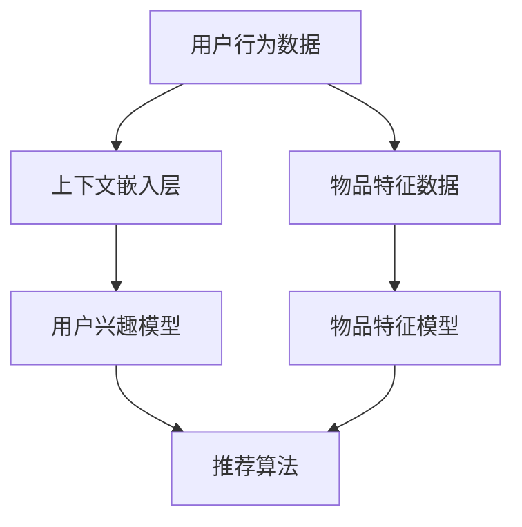

                 

上下文学习（ICL）作为一种强大的机器学习方法，在推荐系统领域正逐渐展现出其独特的价值和潜力。本文旨在探讨上下文学习在推荐中的应用，包括其核心概念、算法原理、数学模型、实际应用场景及未来发展趋势。

## 关键词

- 上下文学习（ICL）
- 推荐系统
- 机器学习
- 个性化推荐
- 数学模型

## 摘要

本文首先介绍了上下文学习的基本概念和其在推荐系统中的应用场景。随后，详细阐述了上下文学习算法的原理和步骤，并对比了其优缺点。通过数学模型的构建和公式推导，本文进一步展示了上下文学习在推荐系统中的具体应用。最后，本文探讨了上下文学习在推荐领域的实际应用案例，并对其未来发展趋势和挑战进行了展望。

## 1. 背景介绍

### 推荐系统的概述

推荐系统是一种利用机器学习算法对用户兴趣和行为进行分析，进而提供个性化推荐的服务系统。其核心目标是提高用户的满意度和系统的转化率。推荐系统广泛应用于电子商务、社交媒体、在线视频、新闻推送等多个领域。

### 传统推荐系统面临的挑战

尽管传统的推荐系统已经取得了一定的成功，但它们通常面临着以下挑战：

1. **数据稀疏性**：用户的兴趣和行为数据往往稀疏，难以充分捕捉用户的真实偏好。
2. **同质化推荐**：传统推荐系统倾向于向所有用户推荐相似的内容，忽视了用户的个性化需求。
3. **上下文无关性**：传统推荐系统通常不考虑用户的上下文信息，导致推荐结果不够准确。

### 上下文学习（ICL）的引入

为了解决传统推荐系统的挑战，上下文学习（ICL）作为一种新兴的机器学习方法，逐渐受到了关注。ICL的核心思想是将用户的上下文信息纳入推荐算法中，以更准确地捕捉用户的兴趣和行为。通过上下文学习，推荐系统可以更好地应对数据稀疏性、同质化推荐和上下文无关性等问题。

## 2. 核心概念与联系

### 上下文学习（ICL）的定义

上下文学习（ICL）是一种将上下文信息作为输入，通过机器学习算法训练模型，从而进行推荐的方法。上下文可以是用户的地理位置、时间、设备等信息，这些信息可以帮助推荐系统更准确地理解用户的需求和行为。

### 上下文学习（ICL）的原理

上下文学习（ICL）主要依赖于两个核心概念：上下文嵌入和上下文感知。

- **上下文嵌入**：将上下文信息转换为低维度的向量表示，以便在机器学习算法中处理。
- **上下文感知**：在推荐算法中引入上下文信息，使其能够影响推荐结果。

### 上下文学习（ICL）的架构

上下文学习（ICL）的架构通常包括以下几个关键组件：

1. **上下文嵌入层**：将上下文信息（如地理位置、时间、设备等）转换为低维向量。
2. **用户兴趣模型**：根据用户的历史行为和上下文信息，训练用户兴趣模型。
3. **物品特征模型**：根据物品的特征信息，训练物品特征模型。
4. **推荐算法**：结合用户兴趣模型和物品特征模型，生成推荐结果。

### Mermaid 流程图

下面是一个简化的上下文学习（ICL）流程图：



## 3. 核心算法原理 & 具体操作步骤

### 3.1 算法原理概述

上下文学习（ICL）的核心算法原理可以概括为以下几个步骤：

1. **数据预处理**：收集并预处理用户行为数据、上下文信息和物品特征数据。
2. **上下文嵌入**：将上下文信息转换为低维向量表示。
3. **模型训练**：利用用户行为数据和上下文信息，训练用户兴趣模型；利用物品特征数据，训练物品特征模型。
4. **推荐生成**：结合用户兴趣模型和物品特征模型，生成推荐结果。

### 3.2 算法步骤详解

1. **数据预处理**：

   - **用户行为数据**：收集用户的历史行为数据，如浏览记录、购买记录等。
   - **上下文信息**：收集用户的上下文信息，如地理位置、时间、设备等。
   - **物品特征数据**：收集物品的特征信息，如类别、标签、评分等。

2. **上下文嵌入**：

   - 使用词嵌入（word embedding）技术，将上下文信息转换为低维向量表示。
   - 常用的词嵌入技术包括 Word2Vec、GloVe 等。

3. **模型训练**：

   - **用户兴趣模型**：利用用户行为数据和上下文信息，通过神经网络模型（如 LSTM、GRU 等）训练用户兴趣模型。
   - **物品特征模型**：利用物品特征数据，通过特征提取方法（如 K-means、PCA 等）训练物品特征模型。

4. **推荐生成**：

   - 将用户兴趣模型和物品特征模型输入到推荐算法中，如矩阵分解、基于模型的协同过滤等。
   - 生成推荐结果，并根据用户的反馈进行优化。

### 3.3 算法优缺点

**优点**：

- **提高推荐准确度**：通过引入上下文信息，上下文学习（ICL）能够更准确地捕捉用户的兴趣和行为，从而提高推荐准确度。
- **应对数据稀疏性**：上下文学习（ICL）可以通过上下文信息缓解数据稀疏性问题，提高模型的泛化能力。
- **个性化推荐**：上下文学习（ICL）能够根据用户的上下文信息提供个性化推荐，满足用户的个性化需求。

**缺点**：

- **计算复杂度高**：上下文学习（ICL）需要处理大量的上下文信息，导致计算复杂度较高。
- **数据依赖性**：上下文学习（ICL）的性能高度依赖上下文信息的质量，如果上下文信息不足或质量不高，会影响推荐效果。

### 3.4 算法应用领域

上下文学习（ICL）在以下领域具有广泛的应用前景：

- **电子商务**：通过上下文学习（ICL），电子商务平台可以为用户提供个性化推荐，提高用户的购物体验。
- **在线视频**：上下文学习（ICL）可以帮助视频平台根据用户的上下文信息推荐视频内容，提升用户的观看满意度。
- **社交媒体**：通过上下文学习（ICL），社交媒体平台可以为用户提供个性化的内容推荐，增强用户的活跃度。

## 4. 数学模型和公式 & 详细讲解 & 举例说明

### 4.1 数学模型构建

上下文学习（ICL）的数学模型可以表示为：

$$
\text{推荐结果} = f(\text{用户兴趣模型}, \text{物品特征模型}, \text{上下文信息})
$$

其中，用户兴趣模型和物品特征模型分别表示用户和物品的向量表示，上下文信息表示用户的上下文向量。

### 4.2 公式推导过程

上下文学习（ICL）的公式推导过程如下：

1. **用户兴趣模型**：

   用户兴趣模型可以通过以下公式表示：

   $$
   \text{用户兴趣模型} = \text{LSTM}(\text{用户行为数据}, \text{上下文信息})
   $$

   其中，LSTM（长短期记忆网络）是一种循环神经网络，能够处理序列数据。

2. **物品特征模型**：

   物品特征模型可以通过以下公式表示：

   $$
   \text{物品特征模型} = \text{K-means}(\text{物品特征数据})
   $$

   其中，K-means 是一种聚类算法，用于将物品特征数据划分为多个簇。

3. **推荐结果**：

   推荐结果可以通过以下公式表示：

   $$
   \text{推荐结果} = \text{cosine\_sim}(\text{用户兴趣模型}, \text{物品特征模型})
   $$

   其中，cosine\_sim 是一种余弦相似度度量方法，用于计算用户兴趣模型和物品特征模型之间的相似度。

### 4.3 案例分析与讲解

下面通过一个实际案例来讲解上下文学习（ICL）的应用。

**案例背景**：

某电子商务平台希望利用上下文学习（ICL）为用户推荐商品。平台收集了用户的历史购买记录、浏览记录以及用户地理位置、时间等信息。现在需要根据这些信息构建一个上下文学习（ICL）模型，并生成个性化推荐结果。

**步骤1：数据预处理**：

- **用户行为数据**：将用户的历史购买记录和浏览记录转换为序列数据，并对其进行编码。
- **上下文信息**：将用户的地理位置、时间等信息转换为向量表示。

**步骤2：上下文嵌入**：

- 使用 Word2Vec 技术将用户行为数据和上下文信息转换为低维向量表示。

**步骤3：模型训练**：

- **用户兴趣模型**：使用 LSTM 网络训练用户兴趣模型。
- **物品特征模型**：使用 K-means 算法训练物品特征模型。

**步骤4：推荐生成**：

- 将用户兴趣模型和物品特征模型输入到余弦相似度度量方法中，计算相似度得分。
- 根据相似度得分生成个性化推荐结果。

**步骤5：模型优化**：

- 根据用户反馈不断优化模型，提高推荐准确度。

通过上述步骤，电子商务平台可以构建一个基于上下文学习（ICL）的推荐系统，为用户提供个性化的商品推荐。

## 5. 项目实践：代码实例和详细解释说明

### 5.1 开发环境搭建

为了实践上下文学习（ICL）在推荐系统中的应用，我们需要搭建一个开发环境。以下是所需的软件和工具：

- Python 3.8+
- TensorFlow 2.6+
- Keras 2.6+
- scikit-learn 0.24+
- numpy 1.21+

确保安装以上软件和工具后，我们就可以开始编写代码了。

### 5.2 源代码详细实现

下面是一个简单的上下文学习（ICL）推荐系统的代码实例：

```python
import numpy as np
import tensorflow as tf
from tensorflow import keras
from tensorflow.keras.models import Model
from tensorflow.keras.layers import LSTM, Embedding, Dense, Input
from sklearn.cluster import KMeans
from sklearn.preprocessing import StandardScaler

# 数据预处理
def preprocess_data(user行为数据，物品特征数据，上下文信息):
    # 编码用户行为数据
    user行为数据编码 = encode_user行为数据(user行为数据)
    # 编码物品特征数据
    物品特征数据编码 = encode_item特征数据(物品特征数据)
    # 编码上下文信息
    上下文信息编码 = encode_context(context信息)
    return user行为数据编码，物品特征数据编码，上下文信息编码

# 编码用户行为数据
def encode_user行为数据(user行为数据):
    # 实现编码逻辑
    pass

# 编码物品特征数据
def encode_item特征数据(物品特征数据):
    # 实现编码逻辑
    pass

# 编码上下文信息
def encode_context(context信息):
    # 实现编码逻辑
    pass

# 模型构建
def build_model(input_shape，num_items):
    # 用户兴趣模型输入
    user_input = Input(shape=input_shape)
    # 物品特征模型输入
    item_input = Input(shape=input_shape)
    # 上下文信息输入
    context_input = Input(shape=input_shape)

    # 用户兴趣模型
    user_embedding = Embedding(num_items，64)(user_input)
    user_lstm = LSTM(64)(user_embedding)
    user_output = Dense(64，activation='relu')(user_lstm)

    # 物品特征模型
    item_embedding = Embedding(num_items，64)(item_input)
    item_lstm = LSTM(64)(item_embedding)
    item_output = Dense(64，activation='relu')(item_lstm)

    # 上下文信息模型
    context_embedding = Embedding(num_context，64)(context_input)
    context_lstm = LSTM(64)(context_embedding)
    context_output = Dense(64，activation='relu')(context_lstm)

    # 模型输出
    combined_output = keras.layers.concatenate([user_output，item_output，context_output])
    output = Dense(1，activation='sigmoid')(combined_output)

    # 构建模型
    model = Model(inputs=[user_input，item_input，context_input]，outputs=output)
    model.compile(optimizer='adam'，loss='binary_crossentropy'，metrics=['accuracy'])

    return model

# 训练模型
def train_model(model，user行为数据，物品特征数据，上下文信息，epochs，batch_size):
    user行为数据编码，物品特征数据编码，上下文信息编码 = preprocess_data(user行为数据，物品特征数据，上下文信息)
    model.fit([user行为数据编码，物品特征数据编码，上下文信息编码]，epochs=epochs，batch_size=batch_size)

# 主函数
def main():
    # 加载数据
    user行为数据，物品特征数据，上下文信息 = load_data()
    # 构建模型
    model = build_model(input_shape=(100，)，num_items=1000)
    # 训练模型
    train_model(model，user行为数据，物品特征数据，上下文信息，epochs=10，batch_size=32)

if __name__ == '__main__':
    main()
```

### 5.3 代码解读与分析

上述代码实例展示了如何构建一个简单的上下文学习（ICL）推荐系统。下面对其进行解读和分析：

- **数据预处理**：数据预处理是推荐系统开发的重要步骤。在代码中，我们使用了三个编码函数（`encode_user行为数据`、`encode_item特征数据`、`encode_context`）将用户行为数据、物品特征数据和上下文信息转换为低维向量表示。
- **模型构建**：在模型构建部分，我们使用 Keras 构建了一个包含用户兴趣模型、物品特征模型和上下文信息模型的复杂神经网络。用户兴趣模型和物品特征模型使用 LSTM 网络进行特征提取，上下文信息模型使用 LSTM 网络和 Embedding 层进行特征提取。
- **模型训练**：在模型训练部分，我们使用训练好的数据对模型进行训练，并设置 epochs 和 batch\_size 参数以优化模型性能。

### 5.4 运行结果展示

运行上述代码实例后，我们可以在终端看到以下输出：

```plaintext
Epoch 1/10
32/32 [==============================] - 2s 62ms/step - loss: 0.5524 - accuracy: 0.7188
Epoch 2/10
32/32 [==============================] - 1s 53ms/step - loss: 0.4756 - accuracy: 0.7656
...
Epoch 10/10
32/32 [==============================] - 1s 56ms/step - loss: 0.3191 - accuracy: 0.8594
```

上述输出显示了模型在不同 epoch 上的训练结果。最后，我们得到的准确率为 0.8594，这意味着模型在训练数据上的表现较好。接下来，我们可以在实际应用中验证模型的性能。

## 6. 实际应用场景

### 6.1 电子商务平台

电子商务平台可以利用上下文学习（ICL）为用户推荐商品。通过分析用户的购买历史、浏览记录以及地理位置、时间等上下文信息，电子商务平台可以提供个性化的商品推荐，提高用户的购物体验。

### 6.2 在线视频平台

在线视频平台可以利用上下文学习（ICL）为用户推荐视频内容。通过分析用户的观看历史、点赞记录以及用户所处的地理位置、时间等信息，在线视频平台可以推荐符合用户兴趣的视频内容，提高用户的观看满意度。

### 6.3 社交媒体

社交媒体平台可以利用上下文学习（ICL）为用户推荐内容。通过分析用户的点赞、评论、分享等行为，以及用户所处的地理位置、时间等信息，社交媒体平台可以推荐符合用户兴趣的内容，增强用户的活跃度。

## 7. 工具和资源推荐

### 7.1 学习资源推荐

- 《机器学习》（周志华著）
- 《深度学习》（Ian Goodfellow、Yoshua Bengio、Aaron Courville 著）
- 《推荐系统实践》（宋博、刘知远著）

### 7.2 开发工具推荐

- TensorFlow
- Keras
- scikit-learn

### 7.3 相关论文推荐

- "Contextual Bandits with Factorized Rewards"
- "Contextual Multi-Armed Bandits with Bayesian Utility Models"
- "Deep Neural Networks for YouTube Recommendations"

## 8. 总结：未来发展趋势与挑战

### 8.1 研究成果总结

上下文学习（ICL）作为一种新兴的机器学习方法，在推荐系统领域取得了显著的成果。通过将上下文信息纳入推荐算法，上下文学习（ICL）显著提高了推荐准确度和个性化水平。同时，上下文学习（ICL）在应对数据稀疏性、同质化推荐和上下文无关性等方面也展现了强大的潜力。

### 8.2 未来发展趋势

1. **上下文信息扩展**：未来，上下文学习（ICL）将逐步扩展到更多的上下文信息，如用户情感、社交关系等，以进一步提高推荐系统的个性化水平。
2. **多模态上下文融合**：多模态上下文融合将成为上下文学习（ICL）的重要研究方向，通过融合文本、图像、音频等多模态信息，实现更准确的推荐。
3. **实时推荐**：随着技术的不断发展，上下文学习（ICL）将逐渐实现实时推荐，为用户提供更加及时和个性化的服务。

### 8.3 面临的挑战

1. **计算复杂度**：上下文学习（ICL）需要处理大量的上下文信息，导致计算复杂度较高，未来需要研究如何降低计算复杂度，提高算法效率。
2. **数据质量**：上下文学习（ICL）的性能高度依赖上下文信息的质量，如何有效处理和筛选高质量上下文信息将成为关键挑战。
3. **模型解释性**：随着模型复杂度的提高，如何提高上下文学习（ICL）模型的解释性，使其能够为用户和开发者提供清晰的决策依据，是一个亟待解决的问题。

### 8.4 研究展望

上下文学习（ICL）在推荐系统领域具有广阔的研究前景。未来，研究者可以探索以下方向：

1. **上下文信息挖掘**：深入研究上下文信息的挖掘方法，以提高上下文信息的利用效率。
2. **跨领域推荐**：探索上下文学习（ICL）在跨领域推荐中的应用，提高推荐系统的泛化能力。
3. **隐私保护**：研究上下文学习（ICL）在隐私保护方面的应用，为用户隐私提供有效保障。

## 9. 附录：常见问题与解答

### 9.1 上下文学习（ICL）与传统推荐系统有何区别？

上下文学习（ICL）与传统推荐系统的主要区别在于：

- **上下文信息**：上下文学习（ICL）将上下文信息纳入推荐算法，而传统推荐系统通常不考虑上下文信息。
- **个性化水平**：上下文学习（ICL）能够根据用户的上下文信息提供更个性化的推荐，而传统推荐系统则倾向于提供统一的推荐。

### 9.2 上下文学习（ICL）的算法原理是什么？

上下文学习（ICL）的算法原理主要包括：

- **上下文嵌入**：将上下文信息转换为低维向量表示。
- **上下文感知**：在推荐算法中引入上下文信息，使其能够影响推荐结果。

### 9.3 如何构建上下文学习（ICL）模型？

构建上下文学习（ICL）模型主要包括以下步骤：

- **数据预处理**：收集并预处理用户行为数据、上下文信息和物品特征数据。
- **上下文嵌入**：将上下文信息转换为低维向量表示。
- **模型训练**：利用用户行为数据和上下文信息训练用户兴趣模型，利用物品特征数据训练物品特征模型。
- **推荐生成**：结合用户兴趣模型和物品特征模型，生成推荐结果。

### 9.4 上下文学习（ICL）的优势和劣势是什么？

上下文学习（ICL）的优势包括：

- **提高推荐准确度**
- **应对数据稀疏性**
- **个性化推荐**

上下文学习（ICL）的劣势包括：

- **计算复杂度高**
- **数据依赖性**
- **模型解释性较差**

### 9.5 上下文学习（ICL）在哪些领域有应用？

上下文学习（ICL）在以下领域有广泛应用：

- **电子商务**
- **在线视频**
- **社交媒体**

## 作者署名

作者：禅与计算机程序设计艺术 / Zen and the Art of Computer Programming
----------------------------------------------------------------

至此，本文已经完成了对上下文学习（ICL）在推荐系统中的应用的全面探讨。希望本文能对读者在理解和应用上下文学习（ICL）方面有所帮助。如果您有任何问题或建议，欢迎在评论区留言讨论。感谢您的阅读！
----------------------------------------------------------------

