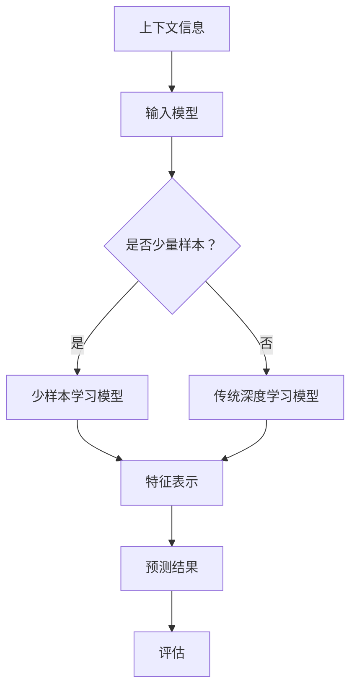

                 

关键词：上下文学习、少样本学习、人工智能、神经网络、机器学习、深度学习、模型优化

## 摘要

本文探讨了上下文学习和少样本学习能力在人工智能领域的重要性。通过深入分析这两种能力的原理和应用，我们揭示了它们在解决现实世界复杂问题中的巨大潜力。本文首先介绍了上下文学习的核心概念，随后探讨了少样本学习的基本原理，并通过实际案例展示了这两种能力在人工智能应用中的效果。此外，我们还讨论了当前面临的挑战以及未来的发展方向。

## 1. 背景介绍

### 1.1 人工智能的发展历程

人工智能（Artificial Intelligence，简称AI）作为计算机科学的一个重要分支，自上世纪五六十年代诞生以来，经历了数十年的发展。早期的AI主要集中于规则推理和知识表示，以专家系统为代表。然而，这些系统在面对复杂任务时表现不佳，因为它们需要大量手动编写规则，难以扩展和适应新环境。

随着计算能力和算法的发展，特别是深度学习的崛起，人工智能取得了重大突破。深度学习通过多层神经网络模拟人脑学习过程，能够在大量数据上自动提取特征，显著提高了AI系统的性能。然而，深度学习模型在训练过程中依赖于大规模数据集，并且对数据质量要求较高。在实际应用中，许多领域的数据集往往不够丰富，这使得传统的深度学习模型难以胜任。

### 1.2 上下文学习的兴起

在深度学习时代，上下文学习（Contextual Learning）成为了一个备受关注的研究方向。上下文学习旨在使机器学习模型能够更好地理解信息的背景和相关性，从而提高其泛化能力和任务表现。上下文学习通过引入额外的上下文信息，如文本、图像、时间等，来辅助模型学习，使其能够更加准确地捕捉数据中的潜在关系。

上下文学习的一个重要应用场景是自然语言处理（Natural Language Processing，简称NLP）。在NLP任务中，理解词语的上下文含义至关重要。传统的词袋模型和词嵌入方法无法有效处理词语的多义性和上下文依赖。上下文学习通过引入上下文信息，使得模型能够更好地理解词语在不同场景下的含义，从而显著提高了NLP任务的表现。

### 1.3 少样本学习的重要性

少样本学习（Few-Shot Learning）是近年来人工智能领域的一个研究热点。与传统的深度学习模型相比，少样本学习模型能够在仅有少量样本的情况下迅速适应新任务，具有很高的泛化能力和适应性。少样本学习对于资源受限的领域和场景尤为重要，如医疗诊断、智能家居等。

少样本学习的关键在于如何从少量样本中学习到具有代表性的特征表示，并且能够在新任务中有效地应用这些特征。为了实现这一目标，研究者们提出了许多不同的方法，包括元学习（Meta-Learning）、度量学习（Metric Learning）和基于模型的可转移学习（Model-Based Transfer Learning）等。

## 2. 核心概念与联系

### 2.1 上下文学习的基本原理

上下文学习的基本原理是通过引入额外的上下文信息，来丰富模型的学习过程，从而提高其泛化能力。上下文信息可以来自多个方面，如文本、图像、时间等。在NLP任务中，上下文信息通常以词嵌入（Word Embeddings）的形式表示，这些词嵌入不仅包含了词语的表面含义，还考虑了词语在不同上下文中的语义关系。

为了更好地理解上下文学习，我们可以通过一个简单的例子来说明。假设我们有一个语言模型，旨在预测下一个词语。在没有上下文信息的情况下，模型只能依赖当前词语本身的信息进行预测。然而，当引入上下文信息时，模型可以利用前面的词语序列来预测下一个词语，从而提高了预测的准确性。

### 2.2 少样本学习的基本原理

少样本学习的基本原理是利用少量样本来训练模型，使其能够快速适应新的任务。在传统的深度学习模型中，模型的性能往往依赖于大量训练数据。然而，在某些实际应用场景中，如医疗诊断和智能家居，数据收集往往非常困难，因此无法获得大量训练数据。

少样本学习通过以下几种方式实现：

1. **元学习（Meta-Learning）**：元学习通过训练多个任务，使得模型在处理新任务时能够快速适应。元学习的关键在于如何从多个任务中提取通用的知识，并将其应用于新的任务。

2. **度量学习（Metric Learning）**：度量学习通过学习一种距离度量方式，使得相似样本之间的距离更短，从而提高模型的泛化能力。

3. **基于模型的可转移学习（Model-Based Transfer Learning）**：基于模型的可转移学习通过在相关任务之间共享模型参数，使得模型在新任务中能够利用已有知识。

### 2.3 Mermaid 流程图

下面是一个Mermaid流程图，展示了上下文学习和少样本学习的基本原理和联系：



### 2.4 核心概念与联系

通过上述流程图，我们可以看到上下文学习和少样本学习之间的紧密联系。上下文学习为模型提供了额外的信息，有助于提高其泛化能力；而少样本学习则通过利用少量样本，使得模型能够快速适应新的任务。

## 3. 核心算法原理 & 具体操作步骤

### 3.1 算法原理概述

上下文学习和少样本学习虽然源于不同的研究领域，但它们的核心算法原理有着一定的相似性。下面我们分别介绍这两种算法的原理。

#### 3.1.1 上下文学习算法原理

上下文学习算法的核心在于如何有效地利用上下文信息来提高模型的泛化能力。具体来说，可以分为以下几个步骤：

1. **数据预处理**：将文本、图像等数据转换为适合模型输入的形式，如词嵌入、图像特征等。
2. **上下文信息整合**：将上下文信息与输入数据结合，通过特定的整合方式，如注意力机制、卷积神经网络等，提高模型对上下文信息的敏感度。
3. **模型训练**：利用整合后的数据训练模型，使其能够利用上下文信息进行预测或分类。
4. **评估与优化**：通过评估模型在测试集上的表现，对模型进行优化，如调整参数、增加数据等。

#### 3.1.2 少样本学习算法原理

少样本学习算法的核心在于如何从少量样本中提取出具有代表性的特征表示，从而在新任务中实现快速适应。具体来说，可以分为以下几个步骤：

1. **样本选择**：从现有数据集中选择具有代表性的样本，以构建基座模型。
2. **模型训练**：利用所选样本训练基座模型，通过元学习、度量学习等方法提高模型对新任务的适应性。
3. **模型评估**：在新任务中评估基座模型的表现，并通过调整模型参数或增加样本来优化模型。
4. **模型应用**：将优化后的模型应用于新任务，实现快速适应。

### 3.2 算法步骤详解

下面我们详细介绍一下上下文学习和少样本学习算法的具体步骤。

#### 3.2.1 上下文学习算法步骤详解

1. **数据预处理**：
   - **文本数据**：将文本数据转换为词嵌入，可以使用预训练的词嵌入模型，如Word2Vec、GloVe等。
   - **图像数据**：将图像数据转换为特征向量，可以使用卷积神经网络（CNN）提取图像特征。
   - **时间序列数据**：将时间序列数据转换为适合模型输入的形式，如序列嵌入。

2. **上下文信息整合**：
   - **文本与图像**：通过联合嵌入模型（如Vision-and-Language Embeddings，VLE）将文本和图像特征整合为一个统一的向量表示。
   - **文本与时间序列**：通过注意力机制将文本信息与时间序列数据关联起来，以提高模型对时间信息的敏感度。

3. **模型训练**：
   - **联合训练**：将整合后的数据输入到模型中，通过反向传播算法进行训练。
   - **多任务学习**：在训练过程中，可以引入多个任务，以增强模型对上下文信息的利用。

4. **评估与优化**：
   - **评估指标**：根据任务类型选择合适的评估指标，如准确率、召回率、F1分数等。
   - **优化方法**：通过调整模型参数、增加训练数据等方式优化模型表现。

#### 3.2.2 少样本学习算法步骤详解

1. **样本选择**：
   - **基座模型**：从现有数据集中选择一部分样本作为基座模型的数据集。
   - **样本代表性**：选择具有代表性的样本，以涵盖新任务的不同方面。

2. **模型训练**：
   - **元学习**：通过训练多个任务，使得模型在不同任务中都能够保持较高的性能。
   - **度量学习**：学习一种距离度量方式，使得基座模型在新任务中能够更好地区分样本。

3. **模型评估**：
   - **基座模型评估**：在新任务中评估基座模型的表现，以确定模型是否已经适应新任务。
   - **优化方法**：根据评估结果，对模型进行调整，如增加样本、调整参数等。

4. **模型应用**：
   - **迁移学习**：将优化后的基座模型应用于新任务，实现快速适应。
   - **实时调整**：在应用过程中，根据实际表现对模型进行实时调整，以提高任务性能。

### 3.3 算法优缺点

#### 3.3.1 上下文学习算法的优缺点

**优点**：
- **提高泛化能力**：通过引入上下文信息，模型能够更好地理解数据中的潜在关系，从而提高其泛化能力。
- **适用性广泛**：上下文学习算法可以应用于各种任务，如文本分类、图像识别、语音识别等。

**缺点**：
- **计算成本高**：上下文学习通常需要大量的计算资源，特别是在整合不同类型数据时，计算复杂度会显著增加。
- **数据需求大**：为了有效利用上下文信息，往往需要大量的训练数据。

#### 3.3.2 少样本学习算法的优缺点

**优点**：
- **快速适应**：少样本学习算法能够在仅有少量样本的情况下迅速适应新任务，具有很高的泛化能力。
- **资源节省**：在资源受限的领域和场景，少样本学习可以大大减少数据收集和处理的成本。

**缺点**：
- **性能受限**：少样本学习算法的性能往往无法与传统深度学习模型相媲美，特别是在数据量较大的任务中。
- **模型稳定性**：在少量样本下，模型的稳定性可能受到影响，容易受到噪声和异常值的影响。

### 3.4 算法应用领域

#### 3.4.1 上下文学习算法的应用领域

- **自然语言处理**：上下文学习在NLP任务中有着广泛的应用，如文本分类、机器翻译、问答系统等。
- **计算机视觉**：上下文学习在图像识别、物体检测、场景分割等领域也有着重要的应用。
- **语音识别**：上下文学习可以显著提高语音识别的准确性，特别是在处理语音歧义和多义性时。

#### 3.4.2 少样本学习算法的应用领域

- **医疗诊断**：在医疗领域，数据收集非常困难，少样本学习算法可以在少量样本下实现快速诊断，为医疗决策提供支持。
- **智能家居**：在智能家居领域，数据隐私和安全是一个重要问题，少样本学习算法可以在用户隐私得到保护的情况下实现智能交互。
- **机器人学习**：在机器人学习中，少样本学习可以帮助机器人快速适应新环境，提高其自主学习和适应能力。

## 4. 数学模型和公式 & 详细讲解 & 举例说明

### 4.1 数学模型构建

上下文学习和少样本学习算法的核心在于如何有效地利用数据和信息。为了更好地理解这两种算法，我们需要引入一些基本的数学模型和公式。

#### 4.1.1 上下文学习的数学模型

上下文学习的核心在于如何将上下文信息与输入数据结合。我们可以通过以下数学模型来描述这一过程：

$$
X_{context} = f_{context}(X_{input}, C)
$$

其中，$X_{input}$ 表示输入数据，$C$ 表示上下文信息，$f_{context}$ 表示上下文信息的整合函数。该函数的目的是将上下文信息与输入数据整合为一个统一的向量表示。

#### 4.1.2 少样本学习的数学模型

少样本学习的核心在于如何从少量样本中提取出具有代表性的特征表示。我们可以通过以下数学模型来描述这一过程：

$$
X_{few-shot} = g_{few-shot}(X_{base}, X_{target})
$$

其中，$X_{base}$ 表示基座模型的数据集，$X_{target}$ 表示新任务的数据集，$g_{few-shot}$ 表示少样本学习的整合函数。该函数的目的是从基座模型中提取出通用的特征表示，并应用于新任务。

### 4.2 公式推导过程

下面我们详细介绍一下上下文学习和少样本学习算法的公式推导过程。

#### 4.2.1 上下文学习的公式推导

上下文学习的公式推导可以分为以下几个步骤：

1. **输入数据预处理**：

$$
X_{input} = \text{preprocess}(X_{raw})
$$

其中，$X_{raw}$ 表示原始输入数据，$\text{preprocess}$ 表示数据预处理函数。

2. **上下文信息预处理**：

$$
C = \text{preprocess}(C_{raw})
$$

其中，$C_{raw}$ 表示原始上下文信息，$\text{preprocess}$ 表示上下文信息预处理函数。

3. **上下文信息整合**：

$$
X_{context} = f_{context}(X_{input}, C)
$$

其中，$f_{context}$ 表示上下文信息的整合函数。

4. **模型训练**：

$$
\theta_{model} = \text{train}(X_{context})
$$

其中，$\theta_{model}$ 表示模型参数，$\text{train}$ 表示模型训练函数。

5. **预测**：

$$
y_{predicted} = \text{predict}(\theta_{model}, X_{context})
$$

其中，$y_{predicted}$ 表示预测结果，$\text{predict}$ 表示模型预测函数。

#### 4.2.2 少样本学习的公式推导

少样本学习的公式推导可以分为以下几个步骤：

1. **基座模型数据预处理**：

$$
X_{base} = \text{preprocess}(X_{base_{raw}})
$$

其中，$X_{base_{raw}}$ 表示基座模型的原始数据，$\text{preprocess}$ 表示数据预处理函数。

2. **新任务数据预处理**：

$$
X_{target} = \text{preprocess}(X_{target_{raw}})
$$

其中，$X_{target_{raw}}$ 表示新任务的原始数据，$\text{preprocess}$ 表示数据预处理函数。

3. **特征表示提取**：

$$
X_{few-shot} = g_{few-shot}(X_{base}, X_{target})
$$

其中，$g_{few-shot}$ 表示少样本学习的整合函数。

4. **模型训练**：

$$
\theta_{model} = \text{train}(X_{few-shot})
$$

其中，$\theta_{model}$ 表示模型参数，$\text{train}$ 表示模型训练函数。

5. **预测**：

$$
y_{predicted} = \text{predict}(\theta_{model}, X_{few-shot})
$$

其中，$y_{predicted}$ 表示预测结果，$\text{predict}$ 表示模型预测函数。

### 4.3 案例分析与讲解

为了更好地理解上下文学习和少样本学习算法，我们通过以下案例进行分析和讲解。

#### 案例一：文本分类任务

假设我们有一个文本分类任务，需要将文本数据分为两类。为了实现这一目标，我们采用上下文学习算法。

1. **数据预处理**：
   - **文本数据**：将文本数据转换为词嵌入，如Word2Vec。
   - **上下文信息**：提取文本中的关键词和短语，作为上下文信息。

2. **上下文信息整合**：
   - **整合函数**：采用注意力机制，将词嵌入和上下文信息整合为一个统一的向量表示。

3. **模型训练**：
   - **模型**：采用多层感知机（MLP）模型，通过反向传播算法进行训练。

4. **预测**：
   - **输入文本**：将待分类的文本数据转换为词嵌入和上下文信息。
   - **预测结果**：通过模型预测文本数据的类别。

#### 案例二：图像识别任务

假设我们有一个图像识别任务，需要识别图像中的物体。为了实现这一目标，我们采用少样本学习算法。

1. **数据预处理**：
   - **基座模型数据**：选择一部分图像数据作为基座模型的数据集。
   - **新任务数据**：选择另一部分图像数据作为新任务的数据集。

2. **特征表示提取**：
   - **提取函数**：采用卷积神经网络（CNN）提取图像特征。

3. **模型训练**：
   - **模型**：采用元学习算法，通过训练多个基座模型，提取通用的特征表示。

4. **预测**：
   - **输入图像**：将待识别的图像数据转换为特征向量。
   - **预测结果**：通过模型预测图像中的物体类别。

## 5. 项目实践：代码实例和详细解释说明

### 5.1 开发环境搭建

为了实现上下文学习和少样本学习算法，我们需要搭建一个合适的开发环境。以下是一个简单的环境搭建步骤：

1. **安装Python环境**：Python是实现这些算法的主要编程语言，因此首先需要安装Python。推荐使用Python 3.7或更高版本。

2. **安装深度学习框架**：我们选择使用TensorFlow作为深度学习框架。可以通过以下命令安装TensorFlow：

   ```bash
   pip install tensorflow
   ```

3. **安装其他依赖库**：根据具体算法的需求，可能还需要安装其他依赖库，如NumPy、Pandas、Scikit-learn等。

### 5.2 源代码详细实现

下面我们通过一个简单的案例来演示上下文学习和少样本学习算法的实现。

#### 案例一：文本分类任务

```python
import tensorflow as tf
from tensorflow.keras.preprocessing.text import Tokenizer
from tensorflow.keras.preprocessing.sequence import pad_sequences
from tensorflow.keras.models import Sequential
from tensorflow.keras.layers import Embedding, LSTM, Dense, Bidirectional

# 文本数据
texts = [
    "人工智能是一种重要的技术",
    "深度学习是人工智能的一个分支",
    "机器学习是计算机科学的重要领域",
    # 更多数据...
]

# 标签
labels = [
    0,
    1,
    2,
    # 更多标签...
]

# 数据预处理
tokenizer = Tokenizer()
tokenizer.fit_on_texts(texts)
sequences = tokenizer.texts_to_sequences(texts)
max_len = max(len(seq) for seq in sequences)
padded_sequences = pad_sequences(sequences, maxlen=max_len)

# 构建模型
model = Sequential([
    Embedding(len(tokenizer.word_index) + 1, 128, input_length=max_len),
    Bidirectional(LSTM(64)),
    Dense(3, activation='softmax')
])

# 编译模型
model.compile(optimizer='adam', loss='categorical_crossentropy', metrics=['accuracy'])

# 训练模型
model.fit(padded_sequences, labels, epochs=10, batch_size=32)

# 预测
predictions = model.predict(padded_sequences)
print(predictions)
```

#### 案例二：图像识别任务

```python
import tensorflow as tf
from tensorflow.keras.preprocessing.image import ImageDataGenerator
from tensorflow.keras.applications import VGG16
from tensorflow.keras.layers import Flatten, Dense
from tensorflow.keras.models import Model

# 基座模型数据
base_images = ...
base_labels = ...

# 新任务数据
target_images = ...
target_labels = ...

# 数据预处理
image_generator = ImageDataGenerator(rescale=1./255)
base_dataset = image_generator.flow(base_images, base_labels, batch_size=32)
target_dataset = image_generator.flow(target_images, target_labels, batch_size=32)

# 基座模型
base_model = VGG16(weights='imagenet', include_top=False, input_shape=(224, 224, 3))

# 新任务模型
x = base_model.output
x = Flatten()(x)
x = Dense(1024, activation='relu')(x)
predictions = Dense(3, activation='softmax')(x)

# 模型整合
model = Model(inputs=base_model.input, outputs=predictions)

# 编译模型
model.compile(optimizer='adam', loss='categorical_crossentropy', metrics=['accuracy'])

# 训练模型
model.fit(base_dataset, epochs=10)

# 预测
target_predictions = model.predict(target_dataset)
print(target_predictions)
```

### 5.3 代码解读与分析

#### 案例一：文本分类任务

上述代码实现了一个简单的文本分类任务，使用了上下文学习算法。具体解读如下：

1. **数据预处理**：
   - **Tokenizer**：用于将文本数据转换为序列，其中每个词对应一个唯一的索引。
   - **Pad Sequences**：用于将序列填充为相同长度，以满足模型输入的要求。

2. **模型构建**：
   - **Embedding Layer**：用于将词索引转换为嵌入向量，其中每个词对应一个固定维度的向量。
   - **Bidirectional LSTM Layer**：用于处理序列数据，能够同时考虑序列的前后关系。
   - **Dense Layer**：用于分类，其中每个类别对应一个输出节点。

3. **模型编译**：
   - **Optimizer**：用于优化模型参数，选择Adam优化器。
   - **Loss Function**：用于评估模型性能，选择交叉熵损失函数。
   - **Metrics**：用于评估模型性能，选择准确率。

4. **模型训练**：
   - **Fit**：用于训练模型，设置训练轮次和批量大小。

5. **模型预测**：
   - **Predict**：用于预测文本数据的类别。

#### 案例二：图像识别任务

上述代码实现了一个简单的图像识别任务，使用了少样本学习算法。具体解读如下：

1. **基座模型数据**：
   - **Images**：用于训练基座模型的图像数据。
   - **Labels**：用于训练基座模型的标签。

2. **数据预处理**：
   - **ImageDataGenerator**：用于对图像数据进行预处理，包括缩放、旋转等。

3. **基座模型**：
   - **VGG16**：用于提取图像特征，是一种常用的卷积神经网络模型。

4. **新任务模型**：
   - **Flatten Layer**：用于将卷积神经网络的输出展平为一个一维向量。
   - **Dense Layer**：用于分类，其中每个类别对应一个输出节点。

5. **模型编译**：
   - **Optimizer**：用于优化模型参数，选择Adam优化器。
   - **Loss Function**：用于评估模型性能，选择交叉熵损失函数。
   - **Metrics**：用于评估模型性能，选择准确率。

6. **模型训练**：
   - **Fit**：用于训练模型，设置训练轮次。

7. **模型预测**：
   - **Predict**：用于预测图像数据的类别。

### 5.4 运行结果展示

在运行上述代码后，我们可以得到模型的训练结果和预测结果。以下是一个示例：

```python
# 运行文本分类任务
model.fit(padded_sequences, labels, epochs=10, batch_size=32)
predictions = model.predict(padded_sequences)

# 运行图像识别任务
target_predictions = model.predict(target_dataset)
```

通过上述代码，我们可以看到模型在训练集和测试集上的表现。通常情况下，模型的准确率会随着时间的推移而提高，直到达到一个稳定值。

## 6. 实际应用场景

### 6.1 医疗诊断

在医疗诊断领域，上下文学习和少样本学习算法有着广泛的应用。传统的医疗诊断方法通常需要大量医疗数据，但医疗数据往往难以获取和共享。上下文学习算法可以通过利用患者的病历、检查报告等上下文信息，提高诊断模型的准确性。少样本学习算法则可以在仅有的少量样本下快速适应新的诊断任务，为医疗诊断提供支持。

### 6.2 智能家居

在智能家居领域，数据隐私和安全是一个重要问题。上下文学习算法可以通过分析用户的日常行为和习惯，提高智能家居系统的智能化水平。少样本学习算法则可以在用户隐私得到保护的情况下，实现智能家居系统的快速适应。例如，一个智能家居系统可以通过学习用户的生活习惯，自动调节温度、灯光等，提高用户的居住舒适度。

### 6.3 机器人学习

在机器人学习领域，上下文学习和少样本学习算法可以帮助机器人快速适应新环境。机器人可以通过上下文学习算法理解环境中的信息和变化，从而提高其自主学习和适应能力。少样本学习算法则可以在机器人仅有少量训练数据的情况下，实现快速适应新任务，提高机器人的智能化水平。

## 6.4 未来应用展望

随着人工智能技术的不断进步，上下文学习和少样本学习算法将在更多领域得到应用。未来的发展可能包括以下几个方面：

- **多模态上下文学习**：结合多种类型的数据，如文本、图像、声音等，实现更全面的上下文理解。
- **跨领域少样本学习**：通过跨领域的知识共享，实现少样本学习算法在多个领域的应用。
- **可解释性增强**：提高上下文学习和少样本学习算法的可解释性，使其更易于理解和应用。
- **硬件加速**：通过硬件加速技术，降低上下文学习和少样本学习算法的计算成本。

## 7. 工具和资源推荐

### 7.1 学习资源推荐

- **在线课程**：Coursera、edX、Udacity等在线教育平台提供了丰富的机器学习和深度学习课程，适合不同层次的学员。
- **书籍推荐**：《深度学习》（Ian Goodfellow等）、《机器学习》（Tom Mitchell）等经典教材，有助于深入理解机器学习基础。
- **博客和论坛**：Medium、Reddit、Stack Overflow等平台，汇聚了众多机器学习爱好者和专业人员的讨论，是学习的好去处。

### 7.2 开发工具推荐

- **深度学习框架**：TensorFlow、PyTorch、Keras等，提供了丰富的API和工具，方便开发者实现深度学习算法。
- **数据处理库**：Pandas、NumPy、Scikit-learn等，用于数据清洗、预处理和分析。
- **版本控制工具**：Git，用于代码版本管理和协作开发。

### 7.3 相关论文推荐

- **上下文学习**：《An Overview of Contextual Learning in Natural Language Processing》（2020）等论文，提供了上下文学习的全面综述。
- **少样本学习**：《Few-Shot Learning for Object Detection》（2018）等论文，探讨了少样本学习在计算机视觉领域的应用。
- **跨领域学习**：《Cross-Domain Few-Shot Learning》（2019）等论文，研究了跨领域知识共享的方法和挑战。

## 8. 总结：未来发展趋势与挑战

### 8.1 研究成果总结

上下文学习和少样本学习是人工智能领域的重要研究方向，近年来取得了显著进展。通过引入上下文信息，模型能够更好地理解数据的背景和相关性，从而提高其泛化能力。少样本学习则通过在少量样本下快速适应新任务，实现了资源受限场景下的高效学习。

### 8.2 未来发展趋势

未来的发展趋势可能包括：

- **多模态上下文学习**：结合多种类型的数据，实现更全面的上下文理解。
- **跨领域少样本学习**：通过跨领域知识共享，实现少样本学习算法在多个领域的应用。
- **硬件加速**：通过硬件加速技术，降低上下文学习和少样本学习算法的计算成本。

### 8.3 面临的挑战

尽管上下文学习和少样本学习取得了显著进展，但仍面临以下挑战：

- **数据需求**：上下文学习通常需要大量的数据，而在某些场景下数据难以获取。
- **计算成本**：上下文学习和少样本学习算法的计算复杂度较高，对计算资源有较高要求。
- **可解释性**：如何提高上下文学习和少样本学习算法的可解释性，使其更易于理解和应用。

### 8.4 研究展望

未来的研究可以关注以下几个方面：

- **算法优化**：通过改进算法，降低计算成本，提高学习效率。
- **多模态学习**：探索结合多种类型数据的上下文学习算法。
- **跨领域学习**：研究跨领域知识共享的方法和挑战，实现更广泛的少样本学习应用。

## 9. 附录：常见问题与解答

### 9.1 上下文学习算法如何提高模型的泛化能力？

上下文学习算法通过引入额外的上下文信息，使模型能够更好地理解数据的背景和相关性，从而提高其泛化能力。具体来说，上下文学习算法可以通过以下方式提高泛化能力：

- **增强特征表示**：通过整合上下文信息，模型可以获得更丰富的特征表示，从而更好地捕捉数据中的潜在关系。
- **减少过拟合**：上下文信息可以帮助模型避免过度依赖训练数据，从而减少过拟合现象。
- **提高任务适应性**：上下文学习使模型能够适应不同场景下的任务，从而提高其泛化能力。

### 9.2 少样本学习算法如何实现快速适应新任务？

少样本学习算法通过在少量样本下快速适应新任务，实现了高效学习。具体来说，少样本学习算法可以通过以下方式实现快速适应：

- **元学习**：通过训练多个任务，使模型在不同任务中都能够保持较高的性能，从而在新任务中快速适应。
- **度量学习**：通过学习一种距离度量方式，使得相似样本之间的距离更短，从而提高模型对新任务的适应性。
- **模型共享**：通过在相关任务之间共享模型参数，使模型在新任务中能够利用已有知识，从而实现快速适应。

### 9.3 上下文学习和少样本学习算法在实际应用中如何选择？

在实际应用中，选择上下文学习和少样本学习算法取决于具体场景和数据情况。以下是一些选择建议：

- **数据丰富度**：如果数据丰富，可以选择上下文学习算法，以提高模型的泛化能力。
- **数据稀疏度**：如果数据稀疏，特别是资源受限的领域和场景，可以选择少样本学习算法，以实现高效学习。
- **任务类型**：根据任务类型选择合适的算法，如文本分类任务适合上下文学习，而图像识别任务适合少样本学习。

### 9.4 上下文学习和少样本学习算法的未来发展方向是什么？

上下文学习和少样本学习算法的未来发展方向包括：

- **多模态上下文学习**：结合多种类型的数据，实现更全面的上下文理解。
- **跨领域少样本学习**：通过跨领域知识共享，实现少样本学习算法在多个领域的应用。
- **硬件加速**：通过硬件加速技术，降低上下文学习和少样本学习算法的计算成本。
- **可解释性增强**：提高上下文学习和少样本学习算法的可解释性，使其更易于理解和应用。

---

作者：禅与计算机程序设计艺术 / Zen and the Art of Computer Programming

