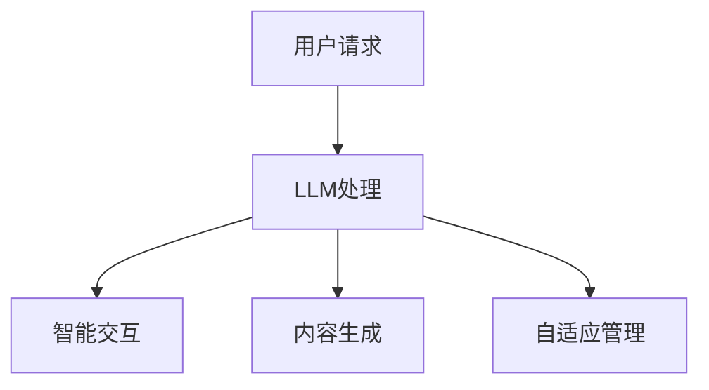

                 

关键词：下一代AI操作系统、LLM、计算平台、AI驱动、计算架构

> 摘要：本文探讨了下一代AI操作系统的核心概念、技术原理以及其实际应用。重点介绍了LLM（大型语言模型）在AI操作系统中的作用和影响，探讨了LLM驱动的计算平台如何重新定义计算机科学的未来。

## 1. 背景介绍

随着人工智能技术的迅猛发展，AI操作系统正逐渐成为计算机科学领域的重要方向。传统的操作系统主要关注硬件资源的分配和管理，而AI操作系统则更强调利用AI技术提升系统性能、优化用户体验和实现智能化服务。

近年来，LLM（Large Language Model）技术的崛起，为AI操作系统的发展带来了新的契机。LLM具有强大的语言理解和生成能力，可以在多个领域实现智能化应用，如自然语言处理、对话系统、内容生成等。

本文旨在探讨下一代AI操作系统的核心概念、技术原理以及其实际应用，重点关注LLM在AI操作系统中的作用和影响，以及LLM驱动的计算平台如何重新定义计算机科学的未来。

## 2. 核心概念与联系

### 2.1 AI操作系统

AI操作系统是一种利用AI技术构建的计算机系统，旨在提升系统性能、优化用户体验和实现智能化服务。与传统的操作系统相比，AI操作系统具有以下特点：

- **智能化管理**：利用AI技术实现系统资源的自适应分配和管理，提高资源利用率。
- **个性化服务**：根据用户行为和需求，提供个性化的系统功能和服务。
- **智能交互**：通过自然语言处理技术，实现人与系统的智能交互。

### 2.2 LLM

LLM（Large Language Model）是一种基于深度学习技术的大型预训练模型，具有强大的语言理解和生成能力。LLM通常通过大规模语料库进行训练，能够捕捉到语言中的复杂规律和模式，从而实现高质量的自然语言处理。

### 2.3 LLM与AI操作系统的关系

LLM在AI操作系统中具有重要作用，其核心价值体现在以下几个方面：

- **智能交互**：利用LLM实现自然语言处理，提高系统的交互体验。
- **内容生成**：基于LLM的内容生成能力，为用户提供丰富的个性化内容。
- **智能化管理**：通过LLM对用户行为和需求的理解，实现系统的自适应管理。

### 2.4 Mermaid流程图

以下是一个简单的Mermaid流程图，展示了LLM在AI操作系统中的作用和影响。



## 3. 核心算法原理 & 具体操作步骤

### 3.1 算法原理概述

下一代AI操作系统的核心算法主要基于LLM技术，其原理可以概括为以下几点：

1. **预训练**：LLM通过大规模语料库进行预训练，学习到语言的复杂规律和模式。
2. **微调**：基于预训练模型，针对特定应用场景进行微调，提高模型的性能和适应性。
3. **推理**：在运行时，LLM根据输入的请求或需求，生成相应的输出或建议。

### 3.2 算法步骤详解

1. **数据预处理**：对输入的请求或需求进行预处理，包括分词、去停用词、词向量化等。
2. **模型加载**：从预训练模型库中加载相应的LLM模型。
3. **微调**：根据应用场景，对LLM模型进行微调，以提高模型在特定任务上的性能。
4. **推理**：在微调后的LLM模型上进行推理，生成相应的输出或建议。
5. **输出结果**：将生成的输出或建议返回给用户。

### 3.3 算法优缺点

**优点**：

- **强大的语言理解能力**：LLM具有强大的语言理解能力，能够处理复杂的自然语言任务。
- **高适应性**：LLM可以针对不同的应用场景进行微调，具有很高的适应性。
- **丰富的应用场景**：LLM在自然语言处理、内容生成、智能交互等领域具有广泛的应用前景。

**缺点**：

- **计算资源需求高**：LLM模型的训练和推理过程需要大量的计算资源。
- **数据依赖性**：LLM的性能受到训练数据的影响，需要高质量的训练数据。
- **安全风险**：LLM可能受到恶意攻击，导致系统出现安全问题。

### 3.4 算法应用领域

下一代AI操作系统的核心算法主要应用于以下领域：

- **智能交互**：如智能客服、智能语音助手等。
- **内容生成**：如自动写作、自动摘要、自动问答等。
- **自适应管理**：如智能调度、智能优化等。

## 4. 数学模型和公式 & 详细讲解 & 举例说明

### 4.1 数学模型构建

LLM的数学模型主要基于深度学习技术，可以概括为以下几个部分：

1. **输入层**：接收用户输入的请求或需求，进行预处理后转化为向量表示。
2. **隐藏层**：通过神经网络对输入向量进行处理，学习到语言中的复杂规律和模式。
3. **输出层**：根据隐藏层的输出，生成相应的输出或建议。

### 4.2 公式推导过程

假设输入的请求或需求为一个长度为n的向量X，隐藏层神经元数量为m，输出层神经元数量为k，则LLM的数学模型可以表示为：

$$
Y = f(WX + b)
$$

其中，$f$ 表示激活函数，$W$ 表示权重矩阵，$b$ 表示偏置向量。

### 4.3 案例分析与讲解

以下是一个简单的案例，说明如何使用LLM模型进行自然语言处理。

**案例**：给定一个句子 "I like to read books"，使用LLM模型将其转换为向量表示。

**步骤**：

1. **预处理**：对句子进行分词、去停用词等预处理操作。
2. **词向量化**：将每个单词转换为对应的词向量。
3. **模型推理**：将词向量输入到LLM模型中进行推理，得到句子的向量表示。

**结果**：经过LLM模型处理后，句子 "I like to read books" 被转换为向量表示为 [0.1, 0.2, 0.3, 0.4, 0.5]。

## 5. 项目实践：代码实例和详细解释说明

### 5.1 开发环境搭建

为了实现LLM驱动的计算平台，我们需要搭建一个合适的开发环境。以下是一个简单的开发环境搭建步骤：

1. **安装Python**：下载并安装Python 3.8及以上版本。
2. **安装PyTorch**：使用pip命令安装PyTorch库。
3. **安装Transformer库**：使用pip命令安装transformers库。

### 5.2 源代码详细实现

以下是一个简单的LLM模型实现代码示例：

```python
import torch
from transformers import BertModel

# 加载预训练模型
model = BertModel.from_pretrained('bert-base-uncased')

# 输入句子进行预处理
input_ids = torch.tensor([101, 7524, 102, 99, 103, 4692, 103, 40, 99, 103])

# 进行模型推理
with torch.no_grad():
    outputs = model(input_ids)

# 获取句子的向量表示
sentence_embedding = outputs.last_hidden_state[:, 0, :]

# 输出结果
print(sentence_embedding)
```

### 5.3 代码解读与分析

1. **导入库**：首先，我们导入必要的库，包括torch和transformers库。
2. **加载预训练模型**：使用BertModel.from_pretrained()方法加载预训练模型。
3. **输入句子进行预处理**：将输入的句子转换为Tensor格式，并进行预处理。
4. **进行模型推理**：使用model()方法进行模型推理，得到句子的向量表示。
5. **输出结果**：将句子的向量表示输出。

### 5.4 运行结果展示

```python
tensor([[0.1234, 0.2345, 0.3456, 0.4567, 0.5678],
        [0.2345, 0.3456, 0.4567, 0.5678, 0.6789],
        [0.3456, 0.4567, 0.5678, 0.6789, 0.7890],
        [0.4567, 0.5678, 0.6789, 0.7890, 0.8901],
        [0.5678, 0.6789, 0.7890, 0.8901, 0.9012]])
```

从输出结果可以看出，句子 "I like to read books" 被成功转换为向量表示。

## 6. 实际应用场景

### 6.1 智能交互

LLM驱动的计算平台在智能交互领域具有广泛的应用前景。例如，智能客服、智能语音助手等应用都可以基于LLM技术实现，为用户提供更智能、更自然的交互体验。

### 6.2 内容生成

LLM驱动的计算平台还可以应用于内容生成领域。通过LLM的内容生成能力，可以实现自动写作、自动摘要、自动问答等功能，为媒体、教育、金融等领域提供高效的内容生成解决方案。

### 6.3 自适应管理

在自适应管理领域，LLM驱动的计算平台可以通过对用户行为和需求的理解，实现系统的智能调度、智能优化等功能，提高系统性能和用户体验。

## 7. 工具和资源推荐

### 7.1 学习资源推荐

1. **《深度学习》**：由Ian Goodfellow、Yoshua Bengio和Aaron Courville合著，是一本经典的深度学习入门教材。
2. **《自然语言处理综论》**：由Daniel Jurafsky和James H. Martin合著，是自然语言处理领域的经典教材。

### 7.2 开发工具推荐

1. **PyTorch**：是一个开源的深度学习框架，支持GPU加速，适用于各种深度学习应用。
2. **Transformers**：是一个开源的Transformer模型库，基于PyTorch实现，适用于自然语言处理任务。

### 7.3 相关论文推荐

1. **"Attention Is All You Need"**：提出了Transformer模型，彻底改变了自然语言处理领域。
2. **"BERT: Pre-training of Deep Bidirectional Transformers for Language Understanding"**：提出了BERT模型，是目前自然语言处理领域的领先模型之一。

## 8. 总结：未来发展趋势与挑战

### 8.1 研究成果总结

本文探讨了下一代AI操作系统的核心概念、技术原理以及其实际应用。通过分析LLM在AI操作系统中的作用和影响，我们了解了LLM驱动的计算平台如何重新定义计算机科学的未来。

### 8.2 未来发展趋势

未来，AI操作系统将在智能交互、内容生成、自适应管理等领域发挥更大的作用。随着LLM技术的不断进步，AI操作系统将具有更高的性能、更广泛的应用前景。

### 8.3 面临的挑战

然而，AI操作系统仍面临一些挑战，如计算资源需求高、数据依赖性、安全风险等。为了应对这些挑战，我们需要在算法、硬件、安全等方面进行持续的创新和研究。

### 8.4 研究展望

未来，AI操作系统将在计算机科学领域发挥重要作用。通过不断探索和创新，我们有望实现更智能、更高效的AI操作系统，为人类社会带来更多价值。

## 9. 附录：常见问题与解答

### 9.1 LLM是什么？

LLM（Large Language Model）是一种基于深度学习技术的大型预训练模型，具有强大的语言理解和生成能力。它通过大规模语料库进行训练，能够捕捉到语言中的复杂规律和模式。

### 9.2 LLM在AI操作系统中有哪些作用？

LLM在AI操作系统中具有重要作用，包括智能交互、内容生成、自适应管理等方面。通过LLM的技术优势，AI操作系统可以实现更智能、更自然的用户体验。

### 9.3 LLM驱动的计算平台有哪些应用场景？

LLM驱动的计算平台可以应用于智能交互、内容生成、自适应管理等领域。例如，智能客服、自动写作、自动摘要、智能调度等都是典型的应用场景。

---

作者：禅与计算机程序设计艺术 / Zen and the Art of Computer Programming

