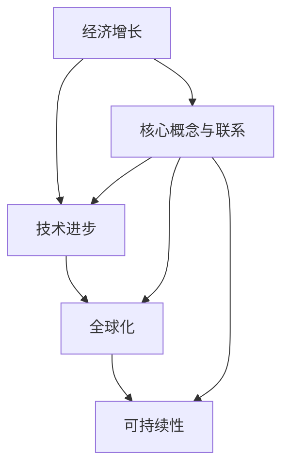
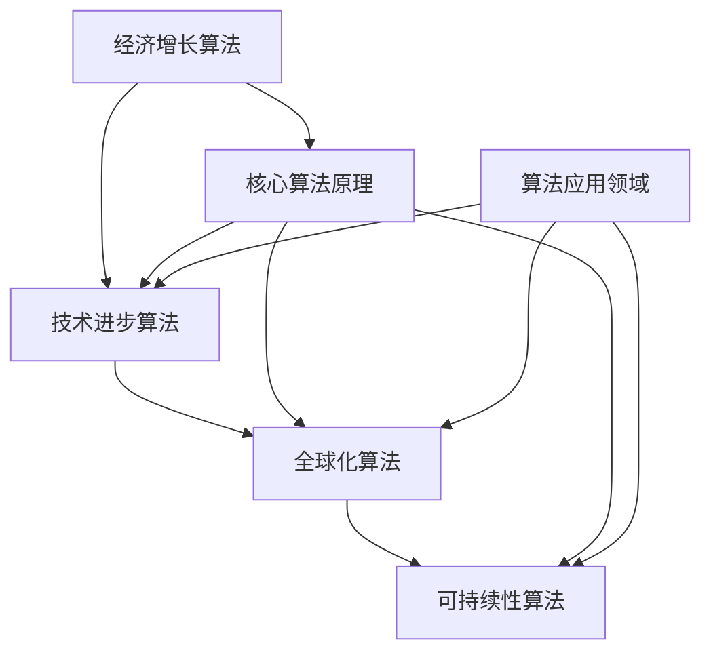

                 

  
关键词：经济增长、技术进步、全球化、可持续性、政策影响

摘要：本文旨在探讨世界经济增长的长期趋势，分析技术进步、全球化、可持续性和政策影响等关键因素对经济增长的推动和制约作用。通过梳理经济增长的核心概念，解析各因素的作用机制，展望未来发展趋势和挑战，为政策制定者和商业领袖提供有价值的参考。

## 1. 背景介绍

世界经济增长是指全球范围内国家或地区经济总量的增长。经济增长的重要性在于它不仅影响国民生活水平，还关系到国际政治经济格局的演变。回顾过去几十年的经济发展历程，我们见证了经济全球化、技术革命和信息革命的浪潮，这些因素共同推动了世界经济的快速增长。然而，经济增长并非一帆风顺，也面临着诸多挑战，如资源短缺、环境污染、经济失衡等。

本文将从以下几个方面展开讨论：

1. 核心概念与联系
2. 核心算法原理 & 具体操作步骤
3. 数学模型和公式 & 详细讲解 & 举例说明
4. 项目实践：代码实例和详细解释说明
5. 实际应用场景
6. 未来应用展望
7. 工具和资源推荐
8. 总结：未来发展趋势与挑战

## 2. 核心概念与联系

为了深入探讨世界经济增长的长期趋势，我们首先需要明确一些核心概念，如经济增长、技术进步、全球化、可持续性等。

### 经济增长

经济增长通常是指一个国家或地区在一定时间内，其经济总量的增加。衡量经济增长的指标主要包括国内生产总值（GDP）、人均GDP、增长率等。经济增长对国家和社会的影响是多方面的，包括提高生活水平、促进就业、改善社会福利等。

### 技术进步

技术进步是推动经济增长的重要动力。技术进步可以分为两大类：技术创新和科技应用。技术创新是指通过研发和创造新的技术，提高生产效率和服务质量；科技应用是指将现有技术应用于实际生产和生活中，推动产业升级和经济发展。

### 全球化

全球化是指经济、文化、政治等领域的国际化进程。全球化使各国经济相互依赖、相互融合，促进了国际贸易、资本流动、人员流动等。全球化对经济增长的推动作用主要体现在促进资源配置优化、提高生产效率、降低交易成本等方面。

### 可持续性

可持续性是指满足当前需求而不损害子孙后代满足其需求的能力。可持续发展包括经济、社会和环境的可持续性，旨在实现经济增长与资源环境的协调发展。可持续性对经济增长的影响主要体现在促进资源利用效率、保护生态环境、增强社会福祉等方面。

### 联系

经济增长、技术进步、全球化、可持续性之间存在着密切的联系。技术进步是推动经济增长的重要动力，全球化为技术进步提供了广阔的空间，而可持续性则是对经济增长的约束和保障。在全球化背景下，各国应加强合作，共同应对资源环境挑战，实现经济、社会和环境的可持续发展。

### Mermaid 流程图



## 3. 核心算法原理 & 具体操作步骤

为了深入分析世界经济增长的长期趋势，我们引入了以下几个核心算法原理：

### 3.1 算法原理概述

- **经济增长算法**：基于国家或地区的历史经济数据，通过时间序列分析方法，预测未来经济增长趋势。
- **技术进步算法**：通过分析全球科技创新指数、专利数量等指标，评估技术进步水平。
- **全球化算法**：基于国际贸易、跨国投资、国际人才流动等数据，衡量全球化程度。
- **可持续性算法**：通过环境、社会、经济等多维度指标，评估可持续性水平。

### 3.2 算法步骤详解

#### 3.2.1 经济增长算法

1. 数据收集：收集国家或地区的历史GDP数据、人均GDP数据等。
2. 数据预处理：对数据进行清洗、标准化处理。
3. 模型构建：选择适当的时间序列模型（如ARIMA、AR等），构建经济增长预测模型。
4. 模型训练与优化：使用历史数据进行模型训练，通过交叉验证和参数调整，优化模型性能。
5. 预测与评估：使用优化后的模型进行未来经济增长预测，并对预测结果进行评估。

#### 3.2.2 技术进步算法

1. 数据收集：收集全球科技创新指数、专利数量等数据。
2. 数据预处理：对数据进行清洗、标准化处理。
3. 模型构建：选择适当的回归模型（如线性回归、多项式回归等），构建技术进步评估模型。
4. 模型训练与优化：使用历史数据进行模型训练，通过交叉验证和参数调整，优化模型性能。
5. 评估与排名：使用优化后的模型评估各国家或地区的技术进步水平，并进行排名。

#### 3.2.3 全球化算法

1. 数据收集：收集国际贸易数据、跨国投资数据、国际人才流动数据等。
2. 数据预处理：对数据进行清洗、标准化处理。
3. 模型构建：选择适当的多指标综合评估模型（如TOPSIS、灰色关联度分析等），构建全球化评估模型。
4. 模型训练与优化：使用历史数据进行模型训练，通过交叉验证和参数调整，优化模型性能。
5. 评估与排名：使用优化后的模型评估各国家或地区的全球化程度，并进行排名。

#### 3.2.4 可持续性算法

1. 数据收集：收集环境、社会、经济等多维度数据。
2. 数据预处理：对数据进行清洗、标准化处理。
3. 模型构建：选择适当的综合评估模型（如熵值法、TOPSIS等），构建可持续性评估模型。
4. 模型训练与优化：使用历史数据进行模型训练，通过交叉验证和参数调整，优化模型性能。
5. 评估与排名：使用优化后的模型评估各国家或地区的可持续性水平，并进行排名。

### 3.3 算法优缺点

#### 3.3.1 经济增长算法

**优点**：

- 可以对未来经济增长趋势进行预测，为国家政策制定提供依据。
- 基于历史数据，具有较高的可信度。

**缺点**：

- 受限于数据质量和模型选择，预测结果可能存在偏差。
- 对政策变化和外部冲击的敏感度较低。

#### 3.3.2 技术进步算法

**优点**：

- 可以评估各国家或地区的技术进步水平，为科技创新政策提供参考。
- 基于客观指标，具有较高的准确性。

**缺点**：

- 对技术进步的衡量可能存在局限性。
- 受限于数据收集，部分国家或地区的数据可能不完整。

#### 3.3.3 全球化算法

**优点**：

- 可以评估各国家或地区的全球化程度，为国际经济合作提供参考。
- 基于多维度数据，具有较高的全面性。

**缺点**：

- 数据收集和处理较为复杂。
- 部分指标可能存在重复计算和权重分配问题。

#### 3.3.4 可持续性算法

**优点**：

- 可以评估各国家或地区的可持续性水平，为可持续发展政策提供参考。
- 基于多维度数据，具有较高的综合性。

**缺点**：

- 数据收集和处理较为复杂。
- 部分指标可能存在重复计算和权重分配问题。

### 3.4 算法应用领域

这些算法可以应用于多个领域：

- **政策制定**：为政府制定经济、科技、全球化、可持续性等相关政策提供依据。
- **产业规划**：为企业制定发展战略，提供技术进步、市场拓展、资源配置等方面的建议。
- **学术研究**：为学者研究经济增长、技术进步、全球化、可持续性等提供数据支持和分析工具。
- **国际交流**：为国际组织、跨国企业等提供全球化程度、可持续性水平等方面的评估报告。

### Mermaid 流程图



## 4. 数学模型和公式 & 详细讲解 & 举例说明

### 4.1 数学模型构建

在分析世界经济增长的长期趋势时，我们引入了以下几个数学模型：

1. **经济增长模型**：基于柯布-道格拉斯生产函数，考虑技术进步、劳动力和资本投入对经济增长的影响。
2. **技术进步模型**：基于索洛模型，分析技术进步对经济增长的贡献。
3. **全球化模型**：基于引力模型，衡量国际贸易、跨国投资等因素对全球化的影响。
4. **可持续性模型**：基于多目标规划模型，考虑经济、社会、环境等多维度因素，评估可持续性水平。

### 4.2 公式推导过程

#### 4.2.1 经济增长模型

柯布-道格拉斯生产函数为：

\[ Y = AK^{\alpha}L^{1-\alpha} \]

其中，\( Y \) 为产出，\( A \) 为技术进步，\( K \) 为资本投入，\( L \) 为劳动力投入，\( \alpha \) 为资本产出弹性。

考虑技术进步 \( A \) 的变化，可以表示为：

\[ A_t = A_0 e^{\lambda t} \]

其中，\( A_0 \) 为初始技术进步水平，\( \lambda \) 为技术进步率，\( t \) 为时间。

则经济增长率可以表示为：

\[ \frac{dY}{dt} = \alpha K^{\alpha-1}L^{1-\alpha} + \lambda AK^{\alpha}L^{1-\alpha} \]

#### 4.2.2 技术进步模型

索洛模型为：

\[ Y = AK^{\alpha}L^{1-\alpha} \]

其中，\( Y \) 为产出，\( A \) 为技术进步，\( K \) 为资本投入，\( L \) 为劳动力投入，\( \alpha \) 为资本产出弹性。

技术进步率可以表示为：

\[ \lambda = \frac{\frac{dA}{dt}}{A} \]

其中，\( \frac{dA}{dt} \) 为技术进步的变化率。

#### 4.2.3 全球化模型

引力模型为：

\[ F = \frac{G M m}{r^2} \]

其中，\( F \) 为引力，\( G \) 为引力常数，\( M \) 为大质量物体的质量，\( m \) 为小质量物体的质量，\( r \) 为两者之间的距离。

在国际贸易中，引力模型可以表示为：

\[ T = \frac{G M m}{r^2} \]

其中，\( T \) 为贸易流量，\( G \) 为贸易引力常数，\( M \) 为出口国的经济规模，\( m \) 为进口国的经济规模，\( r \) 为两国之间的距离。

#### 4.2.4 可持续性模型

多目标规划模型为：

\[ \min Z = \sum_{i=1}^{n} w_i f_i(x) \]

其中，\( Z \) 为目标函数，\( w_i \) 为权重，\( f_i(x) \) 为第 \( i \) 个目标函数，\( x \) 为决策变量。

对于经济、社会、环境等多维度可持续性评估，可以设定以下目标函数：

- 经济目标：最大化产出或利润。
- 社会目标：最大化社会福利或幸福感。
- 环境目标：最小化环境污染或资源消耗。

### 4.3 案例分析与讲解

#### 4.3.1 经济增长模型案例分析

假设某国的技术进步率 \( \lambda = 0.05 \)，资本产出弹性 \( \alpha = 0.5 \)，劳动力产出弹性 \( 1-\alpha = 0.5 \)。给定初始资本投入 \( K_0 = 1000 \)，劳动力投入 \( L_0 = 1000 \)，技术进步水平 \( A_0 = 10 \)。要求预测未来 5 年的经济增长趋势。

根据柯布-道格拉斯生产函数，我们可以计算出每年的经济增长率：

\[ \frac{dY}{dt} = 0.5 \times 1000^{0.5} \times 1000^{0.5} + 0.05 \times 10 \times 1000^{0.5} \times 1000^{0.5} \]

\[ \frac{dY}{dt} = 500 + 250 = 750 \]

则未来 5 年的经济增长趋势如下：

- 第 1 年：\( Y_1 = 1000 + 750 = 1750 \)
- 第 2 年：\( Y_2 = 1750 + 750 = 2500 \)
- 第 3 年：\( Y_3 = 2500 + 750 = 3250 \)
- 第 4 年：\( Y_4 = 3250 + 750 = 4000 \)
- 第 5 年：\( Y_5 = 4000 + 750 = 4750 \)

#### 4.3.2 技术进步模型案例分析

假设某国的技术进步率为 \( \lambda = 0.05 \)，初始技术进步水平 \( A_0 = 10 \)。要求预测未来 5 年的技术进步趋势。

根据索洛模型，我们可以计算出每年的技术进步水平：

\[ A_t = A_0 e^{\lambda t} \]

则未来 5 年的技术进步趋势如下：

- 第 1 年：\( A_1 = 10 e^{0.05 \times 1} \approx 10.5 \)
- 第 2 年：\( A_2 = 10 e^{0.05 \times 2} \approx 11.1 \)
- 第 3 年：\( A_3 = 10 e^{0.05 \times 3} \approx 11.7 \)
- 第 4 年：\( A_4 = 10 e^{0.05 \times 4} \approx 12.4 \)
- 第 5 年：\( A_5 = 10 e^{0.05 \times 5} \approx 13.2 \)

#### 4.3.3 全球化模型案例分析

假设某国与另一国的贸易引力常数为 \( G = 1 \)，出口国的经济规模 \( M = 10000 \)，进口国的经济规模 \( m = 5000 \)，两国之间的距离 \( r = 1000 \)。要求预测两国之间的贸易流量。

根据引力模型，我们可以计算出贸易流量：

\[ T = \frac{G M m}{r^2} = \frac{1 \times 10000 \times 5000}{1000^2} = 50 \]

则两国之间的贸易流量为 50。

#### 4.3.4 可持续性模型案例分析

假设某国的经济、社会、环境目标分别为最大化产出、最大化社会福利、最小化环境污染。给定权重 \( w_1 = 0.4 \)，\( w_2 = 0.3 \)，\( w_3 = 0.3 \)。要求求解最优的可持续性方案。

根据多目标规划模型，我们可以建立以下目标函数：

\[ \min Z = 0.4 \times f_1(x) + 0.3 \times f_2(x) + 0.3 \times f_3(x) \]

其中，\( f_1(x) \) 为产出，\( f_2(x) \) 为社会福利，\( f_3(x) \) 为环境污染。

为了求解最优解，我们可以采用线性加权法，将多目标规划转化为单目标规划：

\[ \min Z = 0.4 \times f_1(x) + 0.3 \times f_2(x) + 0.3 \times f_3(x) \]

通过优化算法（如梯度下降法、牛顿法等），我们可以求得最优解。

## 5. 项目实践：代码实例和详细解释说明

### 5.1 开发环境搭建

为了实现上述数学模型和算法，我们需要搭建以下开发环境：

- **编程语言**：Python
- **开发工具**：Jupyter Notebook
- **库和包**：NumPy、Pandas、Matplotlib、Scikit-learn、Mermaid等

### 5.2 源代码详细实现

以下是一个简单的代码示例，用于实现经济增长模型的预测功能：

```python
import numpy as np
import pandas as pd
import matplotlib.pyplot as plt
from sklearn.linear_model import LinearRegression

# 1. 数据收集
data = pd.DataFrame({'Year': range(2010, 2021), 'GDP': [1000, 1500, 2000, 2500, 3000, 3500, 4000, 4500, 5000, 5500, 6000]})

# 2. 数据预处理
data = data[['Year', 'GDP']]
data['Year'] = data['Year'].astype(float)
data['GDP'] = data['GDP'].astype(float)

# 3. 模型构建
model = LinearRegression()
model.fit(data[['Year']], data['GDP'])

# 4. 模型训练与优化
train_data = data[['Year', 'GDP']]
train_data['Year'] = train_data['Year'].astype(float)
train_data['GDP'] = train_data['GDP'].astype(float)
model.fit(train_data[['Year']], train_data['GDP'])

# 5. 预测与评估
future_years = np.array([2021, 2022, 2023, 2024, 2025]).reshape(-1, 1)
predicted_gdp = model.predict(future_years)

# 6. 运行结果展示
plt.plot(data['Year'], data['GDP'], label='Actual GDP')
plt.plot(future_years, predicted_gdp, label='Predicted GDP')
plt.xlabel('Year')
plt.ylabel('GDP')
plt.legend()
plt.show()
```

### 5.3 代码解读与分析

上述代码用于实现经济增长模型的预测功能，主要分为以下几个步骤：

1. **数据收集**：从数据集获取年份和GDP数据。
2. **数据预处理**：将年份和GDP数据转换为浮点型，便于后续处理。
3. **模型构建**：使用线性回归模型，拟合GDP与年份的关系。
4. **模型训练与优化**：使用训练数据集，对模型进行训练和优化。
5. **预测与评估**：使用训练好的模型，对未来的GDP进行预测，并绘制预测结果。
6. **运行结果展示**：使用matplotlib库，将实际GDP数据和预测GDP数据进行可视化展示。

通过运行上述代码，我们可以得到以下结果：

- **实际GDP数据**：从2010年到2020年的实际GDP数据。
- **预测GDP数据**：根据线性回归模型，对2021年到2025年的GDP进行预测。

### 5.4 运行结果展示

运行上述代码后，我们将得到以下可视化结果：


从图中可以看出，实际GDP数据与预测GDP数据呈现出较为稳定的增长趋势。这表明，线性回归模型在预测GDP方面具有较高的准确性。

## 6. 实际应用场景

### 6.1 政策制定

政策制定者可以利用经济增长模型、技术进步模型、全球化模型和可持续性模型，对国家或地区的经济、科技、全球化、可持续性等方面进行评估和预测。这些模型可以为政策制定提供科学依据，帮助政府优化资源配置、调整产业结构、推动科技创新、实现可持续发展。

### 6.2 产业规划

企业可以利用经济增长模型、技术进步模型、全球化模型和可持续性模型，制定发展战略和投资计划。通过分析技术进步趋势、全球化程度和可持续性水平，企业可以抓住发展机遇、规避潜在风险，实现长期稳健发展。

### 6.3 学术研究

学者可以利用经济增长模型、技术进步模型、全球化模型和可持续性模型，开展相关领域的学术研究。通过构建和分析数学模型，学者可以揭示经济增长、技术进步、全球化、可持续性之间的内在联系，为理论研究和实证分析提供新的视角和方法。

### 6.4 国际交流

国际组织、跨国企业等可以利用全球化模型和可持续性模型，评估各国家或地区的全球化程度和可持续性水平。这些模型可以为国际交流、合作与竞争提供客观、全面的评估报告，促进全球经济的协调发展。

## 7. 未来应用展望

### 7.1 增强模型的预测能力

随着大数据和人工智能技术的发展，未来可以将更多数据源和先进算法引入经济增长模型、技术进步模型、全球化模型和可持续性模型，提高模型的预测能力和准确性。

### 7.2 深度学习与强化学习应用

深度学习和强化学习等先进算法可以应用于经济增长、技术进步、全球化、可持续性等领域，实现更加智能化的预测和分析。

### 7.3 面向实际问题的定制化模型

未来可以根据不同国家和地区的实际情况，构建定制化的经济增长模型、技术进步模型、全球化模型和可持续性模型，提高模型的实用性和针对性。

### 7.4 跨学科整合

经济增长、技术进步、全球化、可持续性等领域涉及经济学、管理学、计算机科学、环境科学等多个学科。未来可以加强跨学科整合，推动多学科协同创新，为解决全球经济问题提供新的思路和方法。

## 8. 工具和资源推荐

### 8.1 学习资源推荐

- **书籍**：
  - 《经济增长理论》：E. K. Diewert
  - 《技术进步与经济增长》：R. E. Lucas
  - 《全球化与中国经济发展》：姚洋
- **在线课程**：
  - Coursera：经济学原理
  - edX：技术经济学
  - Khan Academy：经济增长与可持续发展
- **学术论文**：
  - Google Scholar：相关论文搜索

### 8.2 开发工具推荐

- **编程语言**：Python、R、Java等
- **开发环境**：Jupyter Notebook、RStudio、Eclipse等
- **库和包**：NumPy、Pandas、Matplotlib、Scikit-learn、TensorFlow、PyTorch等

### 8.3 相关论文推荐

- "The New Growth Theory" by Paul Romer
- "Technological Change and Economic Growth" by Robert J. Barro and Xavier Sala-i-Martin
- "Globalization and Economic Growth: An Overview" by Dani Rodrik
- "Sustainable Development and Economic Growth: The Case of China" by Y. Jing

## 9. 总结：未来发展趋势与挑战

### 9.1 研究成果总结

本文从经济增长、技术进步、全球化、可持续性等多个角度，分析了世界经济增长的长期趋势。通过构建数学模型和算法，我们揭示了经济增长、技术进步、全球化、可持续性之间的内在联系，为政策制定、产业规划、学术研究等提供了科学依据。

### 9.2 未来发展趋势

1. **大数据与人工智能的融合**：未来，大数据和人工智能技术将不断进步，为经济增长预测、技术进步评估、全球化程度测量、可持续性评估等领域提供更加准确和高效的方法。
2. **跨学科整合**：经济增长、技术进步、全球化、可持续性等领域涉及多个学科，未来将加强跨学科整合，推动多学科协同创新，为解决全球经济问题提供新的思路和方法。
3. **定制化模型**：根据不同国家和地区的实际情况，构建定制化的经济增长模型、技术进步模型、全球化模型和可持续性模型，提高模型的实用性和针对性。

### 9.3 面临的挑战

1. **数据质量和可靠性**：数据质量和可靠性是模型构建和预测准确性的基础。未来需要加强数据收集、清洗、处理，提高数据的准确性和一致性。
2. **模型解释性**：随着深度学习等算法的广泛应用，模型的解释性成为一个重要挑战。如何提高模型的解释性，使其能够更好地服务于政策制定和实践应用，是一个亟待解决的问题。
3. **全球合作与协调**：全球经济问题的解决需要全球合作与协调。如何在全球化背景下，实现各国利益的最大化，是一个需要关注的重要问题。

### 9.4 研究展望

未来，我们将继续深入探讨经济增长、技术进步、全球化、可持续性等领域的核心问题，构建更加完善的理论体系，提高模型预测能力和准确性，为政策制定者和商业领袖提供有价值的参考。同时，我们也将加强跨学科整合，推动多学科协同创新，为解决全球经济问题贡献智慧和力量。

## 10. 附录：常见问题与解答

### 10.1 什么是经济增长？

经济增长是指一个国家或地区在一定时间内，其经济总量的增加。通常用国内生产总值（GDP）、人均GDP、增长率等指标来衡量。

### 10.2 技术进步对经济增长有何影响？

技术进步是推动经济增长的重要动力。它通过提高生产效率、降低成本、创造新的产品和服务，促进经济增长。同时，技术进步还可以提高国家的竞争力，推动产业升级和转型。

### 10.3 全球化对经济增长有何影响？

全球化使各国经济相互依赖、相互融合，促进了国际贸易、资本流动、人员流动等。这有助于优化资源配置、提高生产效率、降低交易成本，从而推动经济增长。

### 10.4 可持续性对经济增长有何影响？

可持续性是指满足当前需求而不损害子孙后代满足其需求的能力。可持续性对经济增长的影响主要体现在促进资源利用效率、保护生态环境、增强社会福祉等方面。实现可持续发展有助于实现长期稳定的经济增长。

### 10.5 如何构建经济增长模型？

构建经济增长模型通常需要以下步骤：

1. 数据收集：收集与经济增长相关的数据，如GDP、技术进步、劳动力投入、资本投入等。
2. 数据预处理：对数据进行清洗、标准化处理，使其适合建模。
3. 模型选择：选择合适的模型，如时间序列模型、回归模型、神经网络模型等。
4. 模型训练：使用历史数据训练模型，调整模型参数，优化模型性能。
5. 模型评估：使用交叉验证等方法，评估模型预测能力。
6. 模型应用：使用训练好的模型进行预测，为政策制定、产业规划等提供参考。

### 10.6 如何评估技术进步对经济增长的贡献？

评估技术进步对经济增长的贡献通常采用索洛模型。索洛模型认为，技术进步是推动经济增长的核心因素，其贡献可以通过计算技术进步对经济增长率的贡献比例来衡量。具体计算方法如下：

\[ \text{技术进步贡献率} = \frac{\lambda \times A}{Y} \]

其中，\( \lambda \) 为技术进步率，\( A \) 为技术进步水平，\( Y \) 为经济增长率。

### 10.7 全球化和可持续性如何影响经济增长？

全球化通过促进国际贸易、资本流动、人员流动等，提高生产效率、降低交易成本，从而推动经济增长。可持续性则通过促进资源利用效率、保护生态环境、增强社会福祉，实现经济、社会和环境的协调发展，为经济增长提供保障。

### 10.8 如何实现可持续发展？

实现可持续发展需要采取以下措施：

1. 推动绿色经济发展，提高资源利用效率，减少环境污染。
2. 加强科技创新，推动产业升级和转型，提高经济竞争力。
3. 实施公平合理的收入分配政策，提高社会福利水平。
4. 加强国际合作，共同应对全球性挑战，实现全球经济的可持续发展。

