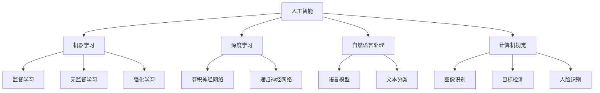
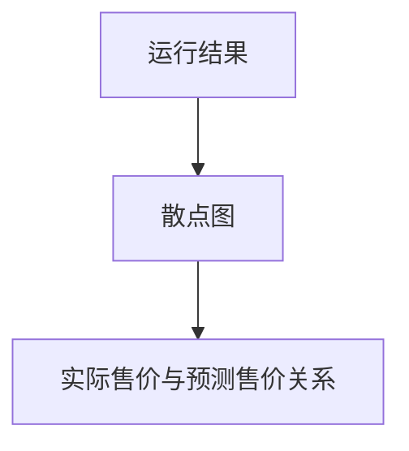

                 

在当今技术飞速发展的时代，人工智能（AI）已成为推动各行业创新与发展的关键力量。随着AI技术的不断进步和应用场景的日益广泛，选择合适的AI工具成为了企业和开发者面临的重要课题。本文旨在探讨个性化AI工具选择的重要性，分析其核心概念、算法原理、数学模型、实践应用以及未来发展趋势。

> **关键词：** 个性化AI，工具选择，人工智能，算法原理，数学模型，实践应用，未来展望

> **摘要：** 本文首先介绍了个性化AI工具选择的重要性，然后深入探讨了核心概念、算法原理、数学模型和实践应用等方面，最后对个性化AI工具的未来发展趋势进行了展望。

## 1. 背景介绍

随着大数据、云计算和深度学习等技术的快速发展，人工智能已经逐渐成为各行各业的核心驱动力。无论是金融、医疗、制造业还是零售业，AI技术的应用都在不断深化和扩展。然而，面对市场上众多AI工具和平台，如何选择适合自己需求的工具成为了许多企业和开发者的难题。

个性化AI工具选择的重要性体现在以下几个方面：

1. **提高开发效率**：选择合适的AI工具可以大幅提升开发效率和项目成功率，避免不必要的时间和资源浪费。
2. **满足业务需求**：不同的业务场景需要不同类型的AI工具，个性化选择能够更好地满足特定的业务需求。
3. **降低技术门槛**：对于非专业的开发者而言，个性化AI工具的选择可以降低入门门槛，促进AI技术在更广泛领域的应用。
4. **提升用户体验**：个性化AI工具可以帮助企业更好地理解和满足用户需求，提升用户体验和满意度。

## 2. 核心概念与联系

在讨论个性化AI工具选择之前，我们需要了解一些核心概念和它们之间的关系。

### 2.1 人工智能（AI）

人工智能是计算机科学的一个分支，旨在使机器能够模拟、延伸和扩展人类的智能。它包括机器学习、深度学习、自然语言处理、计算机视觉等多个领域。

### 2.2 机器学习（ML）

机器学习是一种使计算机从数据中学习模式并做出预测或决策的技术。它分为监督学习、无监督学习和强化学习等类型。

### 2.3 深度学习（DL）

深度学习是机器学习的一种，它使用多层神经网络来模拟人脑的决策过程。深度学习在图像识别、语音识别和自然语言处理等方面取得了显著成果。

### 2.4 自然语言处理（NLP）

自然语言处理是人工智能的一个分支，旨在使计算机理解和处理人类语言。它包括语言识别、文本分类、机器翻译等任务。

### 2.5 计算机视觉（CV）

计算机视觉是人工智能的一个分支，旨在使计算机理解和解释视觉信息。它包括图像识别、目标检测、人脸识别等任务。

下面是一个用Mermaid绘制的流程图，展示了这些核心概念之间的关系：



## 3. 核心算法原理 & 具体操作步骤

### 3.1 算法原理概述

个性化AI工具的选择需要基于对算法原理的深入理解。以下是一些常见的AI算法及其原理：

1. **监督学习**：监督学习是一种有监督的学习方法，通过已标记的数据集来训练模型。常见的监督学习算法包括线性回归、支持向量机（SVM）和决策树等。

2. **无监督学习**：无监督学习是一种无监督的学习方法，通过未标记的数据集来发现数据中的模式。常见的无监督学习算法包括聚类算法（如K-means聚类）、主成分分析（PCA）等。

3. **深度学习**：深度学习是一种多层神经网络的学习方法，通过学习数据的高层次特征来实现复杂的任务。常见的深度学习算法包括卷积神经网络（CNN）、递归神经网络（RNN）和生成对抗网络（GAN）等。

4. **强化学习**：强化学习是一种通过试错来学习如何在特定环境中做出最优决策的方法。常见的强化学习算法包括Q-learning、深度Q网络（DQN）等。

### 3.2 算法步骤详解

以下是选择个性化AI工具的一般步骤：

1. **需求分析**：明确项目需求和目标，确定需要解决的问题类型（如分类、回归、聚类等）。

2. **数据准备**：收集并清洗相关数据，确保数据质量。

3. **算法选择**：根据需求分析的结果，选择合适的算法。可以考虑算法的准确性、效率和可扩展性等因素。

4. **模型训练**：使用选择好的算法对数据进行训练，调整参数以获得最佳性能。

5. **模型评估**：使用验证集或测试集对模型进行评估，确保其性能满足需求。

6. **模型部署**：将训练好的模型部署到实际应用环境中，进行实时预测或决策。

### 3.3 算法优缺点

每种算法都有其优缺点，以下是几种常见算法的优缺点分析：

1. **线性回归**：
   - 优点：简单易用，易于理解和实现。
   - 缺点：对于非线性关系表现较差，易受到异常值的影响。

2. **支持向量机（SVM）**：
   - 优点：在处理高维数据时性能较好，具有较好的泛化能力。
   - 缺点：计算复杂度较高，对于大量数据的训练可能需要较长时间。

3. **决策树**：
   - 优点：易于理解和实现，能够处理非线性关系。
   - 缺点：对于大量数据可能产生过拟合，且无法处理连续特征。

4. **卷积神经网络（CNN）**：
   - 优点：在图像识别和计算机视觉任务中表现出色，具有自动特征提取能力。
   - 缺点：对于其他类型的任务可能不太适用，需要大量数据进行训练。

5. **递归神经网络（RNN）**：
   - 优点：能够处理序列数据，适用于时间序列预测和自然语言处理任务。
   - 缺点：训练过程可能较慢，且对于长期依赖关系表现较差。

### 3.4 算法应用领域

不同的算法适用于不同的应用领域，以下是几种算法的应用领域：

1. **线性回归**：适用于简单的回归任务，如房价预测、股票价格预测等。

2. **支持向量机（SVM）**：适用于分类任务，如文本分类、图像分类等。

3. **决策树**：适用于分类和回归任务，如客户流失预测、疾病诊断等。

4. **卷积神经网络（CNN）**：适用于图像识别和计算机视觉任务，如图像分类、目标检测等。

5. **递归神经网络（RNN）**：适用于序列数据处理，如时间序列预测、机器翻译等。

## 4. 数学模型和公式 & 详细讲解 & 举例说明

### 4.1 数学模型构建

个性化AI工具的选择涉及到多种数学模型，下面以线性回归为例进行介绍。

线性回归模型的基本形式为：

$$y = \beta_0 + \beta_1x_1 + \beta_2x_2 + ... + \beta_nx_n + \epsilon$$

其中，$y$为预测值，$x_1, x_2, ..., x_n$为输入特征，$\beta_0, \beta_1, \beta_2, ..., \beta_n$为模型的参数，$\epsilon$为误差项。

### 4.2 公式推导过程

为了求解线性回归模型的参数，我们通常使用最小二乘法。最小二乘法的目标是最小化预测值与实际值之间的误差平方和。

误差平方和为：

$$\sum_{i=1}^{n}(y_i - \hat{y}_i)^2$$

其中，$y_i$为实际值，$\hat{y}_i$为预测值。

对误差平方和关于模型参数求导并令导数为0，可以得到最小二乘法的参数估计公式：

$$\beta_j = \frac{\sum_{i=1}^{n}(y_i - \hat{y}_i)x_{ij}}{\sum_{i=1}^{n}x_{ij}^2}$$

其中，$x_{ij}$为输入特征的第$i$个样本的第$j$个特征值。

### 4.3 案例分析与讲解

假设我们要预测一个房屋的售价，输入特征包括房屋面积、卧室数量和房屋年代。现在我们使用线性回归模型进行预测。

首先，收集一组房屋数据，并对其进行预处理，包括归一化和缺失值处理。然后，将数据集分为训练集和测试集。

接下来，使用训练集数据训练线性回归模型，计算参数$\beta_0, \beta_1, \beta_2, \beta_3$。具体计算过程如下：

$$\beta_0 = \frac{\sum_{i=1}^{n}(y_i - \hat{y}_i)}{\sum_{i=1}^{n}}$$

$$\beta_1 = \frac{\sum_{i=1}^{n}(y_i - \hat{y}_i)x_{1i}}{\sum_{i=1}^{n}x_{1i}^2}$$

$$\beta_2 = \frac{\sum_{i=1}^{n}(y_i - \hat{y}_i)x_{2i}}{\sum_{i=1}^{n}x_{2i}^2}$$

$$\beta_3 = \frac{\sum_{i=1}^{n}(y_i - \hat{y}_i)x_{3i}}{\sum_{i=1}^{n}x_{3i}^2}$$

最后，使用测试集数据对模型进行评估，计算预测值与实际值之间的误差平方和，以验证模型的性能。

## 5. 项目实践：代码实例和详细解释说明

### 5.1 开发环境搭建

为了实现线性回归模型，我们需要搭建一个Python开发环境。以下是一个简单的环境搭建步骤：

1. 安装Python（建议使用3.8版本或更高版本）
2. 安装必要的库，如NumPy、Pandas、Matplotlib等（使用pip命令进行安装）

### 5.2 源代码详细实现

以下是一个简单的线性回归模型实现代码：

```python
import numpy as np
import pandas as pd
import matplotlib.pyplot as plt

# 加载数据
data = pd.read_csv('house_data.csv')

# 数据预处理
data['Area'] = data['Area'] / data['Area'].max()
data['Bedrooms'] = data['Bedrooms'] / data['Bedrooms'].max()
data['Year'] = 2021 - data['Year']

# 拆分特征和标签
X = data[['Area', 'Bedrooms', 'Year']]
y = data['Price']

# 添加偏置项
X = np.hstack((np.ones((X.shape[0], 1)), X))

# 模型参数
theta = np.random.rand(X.shape[1])

# 最小二乘法求解参数
theta = (np.linalg.inv(X.T @ X) @ X.T @ y)

# 预测
y_pred = X @ theta

# 绘制结果
plt.scatter(y, y_pred)
plt.xlabel('Actual Price')
plt.ylabel('Predicted Price')
plt.show()
```

### 5.3 代码解读与分析

1. **数据加载与预处理**：首先，我们加载并预处理了房屋数据，包括归一化和缺失值处理。
2. **特征和标签拆分**：将特征和标签分离，以便进行模型训练和预测。
3. **添加偏置项**：在特征矩阵中添加偏置项，使得模型具有线性变换能力。
4. **最小二乘法求解参数**：使用最小二乘法求解模型参数$\theta$。
5. **预测与绘制结果**：使用训练好的模型进行预测，并绘制实际值与预测值的关系图。

### 5.4 运行结果展示

运行代码后，我们得到了一个散点图，展示了实际售价与预测售价之间的关系。从图中可以看出，大部分预测售价与实际售价较为接近，说明线性回归模型具有一定的预测能力。



## 6. 实际应用场景

个性化AI工具在各个领域的实际应用场景非常广泛，以下是一些典型应用：

### 6.1 金融领域

在金融领域，个性化AI工具可以用于股票市场预测、信用评分、风险控制和欺诈检测等。例如，使用深度学习算法可以对股票市场的价格进行预测，帮助投资者做出更明智的决策。

### 6.2 医疗领域

在医疗领域，个性化AI工具可以用于疾病诊断、治疗方案推荐、健康风险评估等。例如，使用卷积神经网络可以分析医学影像，帮助医生更准确地诊断疾病。

### 6.3 制造业

在制造业，个性化AI工具可以用于质量检测、设备故障预测、生产优化等。例如，使用计算机视觉技术可以对生产过程中的产品进行质量检测，提高生产效率。

### 6.4 零售业

在零售业，个性化AI工具可以用于推荐系统、客户行为分析、库存管理等。例如，使用机器学习算法可以分析客户行为，为用户提供个性化的购物推荐。

## 7. 工具和资源推荐

为了更好地进行个性化AI工具的选择和应用，以下是一些学习资源和工具的推荐：

### 7.1 学习资源推荐

1. **《深度学习》（Goodfellow, Bengio, Courville）**：这是一本深度学习领域的经典教材，涵盖了深度学习的理论基础和实战应用。
2. **《机器学习实战》（ Harrington）**：这本书通过实例介绍了多种机器学习算法的实现和应用，适合初学者入门。
3. **Coursera、edX、Udacity等在线课程**：这些平台提供了丰富的AI和机器学习课程，适合不同层次的学习者。

### 7.2 开发工具推荐

1. **TensorFlow**：由Google开发的开源深度学习框架，广泛应用于图像识别、语音识别和自然语言处理等领域。
2. **PyTorch**：由Facebook开发的开源深度学习框架，以其灵活性和易用性受到开发者的青睐。
3. **Scikit-learn**：一个强大的机器学习库，提供了多种经典的机器学习算法的实现。

### 7.3 相关论文推荐

1. **"Deep Learning" (Goodfellow, Bengio, Courville)**：这篇综述文章详细介绍了深度学习的理论基础和应用。
2. **"Learning Deep Architectures for AI" (Bengio)**：这篇文章探讨了深度学习的架构设计和优化方法。
3. **"Machine Learning: A Probabilistic Perspective" (Kevin P. Murphy)**：这本书从概率论的角度介绍了机器学习的基本原理和方法。

## 8. 总结：未来发展趋势与挑战

个性化AI工具选择在未来将面临以下发展趋势和挑战：

### 8.1 发展趋势

1. **算法的多样性和复杂性**：随着AI技术的不断进步，越来越多的复杂算法将应用于实际场景，为个性化AI工具的选择提供更多可能性。
2. **数据驱动的发展**：AI技术的发展将更加依赖高质量的数据，数据的质量和数量将成为个性化AI工具选择的关键因素。
3. **跨学科融合**：AI技术将与生物学、心理学、经济学等学科相结合，推动个性化AI工具在更广泛领域的应用。

### 8.2 面临的挑战

1. **数据隐私和安全性**：在个性化AI工具的选择和应用过程中，数据隐私和安全问题将日益突出，需要采取有效措施保护用户数据。
2. **算法解释性和透明度**：随着AI算法的复杂化，如何解释和验证AI算法的决策过程将成为一个重要挑战。
3. **计算资源和成本**：大规模的AI应用需要强大的计算资源和资金支持，这对于一些中小企业来说可能是一个挑战。

### 8.3 研究展望

未来，个性化AI工具的研究将朝着更加智能、高效和安全的方向发展。在算法方面，将更加注重算法的可解释性和透明度；在数据方面，将更加注重数据的隐私保护和数据质量；在应用方面，将更加注重跨学科的融合和应用场景的拓展。

## 9. 附录：常见问题与解答

### 9.1 如何选择适合自己的AI工具？

选择适合自己的AI工具需要考虑以下几个因素：

1. **业务需求**：明确自己的业务需求和目标，选择能够满足这些需求的AI工具。
2. **数据特点**：了解自己的数据类型和特点，选择适合这些数据的算法和工具。
3. **计算资源**：评估自己的计算资源，选择能够充分利用现有资源的AI工具。
4. **可扩展性**：考虑未来业务的发展需求，选择具有良好可扩展性的AI工具。

### 9.2 如何保证AI算法的可解释性？

保证AI算法的可解释性可以从以下几个方面着手：

1. **模型选择**：选择具有较高解释性的算法，如线性回归、决策树等。
2. **模型可视化**：通过可视化工具将模型的决策过程进行展示，如决策树可视化、神经网络权重可视化等。
3. **模型解释方法**：使用模型解释方法，如SHAP值、LIME等，对模型的决策过程进行解释。

### 9.3 如何处理数据隐私和安全性问题？

处理数据隐私和安全性问题可以从以下几个方面着手：

1. **数据加密**：对敏感数据进行加密，确保数据在传输和存储过程中安全。
2. **访问控制**：设置严格的访问控制策略，确保只有授权人员才能访问敏感数据。
3. **匿名化处理**：对敏感数据进行匿名化处理，降低数据泄露的风险。
4. **安全审计**：定期进行安全审计，确保数据安全和系统安全。

## 作者署名

作者：禅与计算机程序设计艺术 / Zen and the Art of Computer Programming
```markdown
---
# 个性化AI工具选择的重要性

> 关键词：个性化AI，工具选择，人工智能，算法原理，数学模型，实践应用，未来展望

> 摘要：本文探讨了个性化AI工具选择的重要性，分析了核心概念、算法原理、数学模型和实践应用，并对未来发展趋势进行了展望。

## 1. 背景介绍

## 2. 核心概念与联系
### 2.1 人工智能（AI）
### 2.2 机器学习（ML）
### 2.3 深度学习（DL）
### 2.4 自然语言处理（NLP）
### 2.5 计算机视觉（CV）


## 3. 核心算法原理 & 具体操作步骤
### 3.1 算法原理概述
### 3.2 算法步骤详解 
### 3.3 算法优缺点
### 3.4 算法应用领域

## 4. 数学模型和公式 & 详细讲解 & 举例说明
### 4.1 数学模型构建
### 4.2 公式推导过程
### 4.3 案例分析与讲解

## 5. 项目实践：代码实例和详细解释说明
### 5.1 开发环境搭建
### 5.2 源代码详细实现
### 5.3 代码解读与分析
### 5.4 运行结果展示

## 6. 实际应用场景
### 6.1 金融领域
### 6.2 医疗领域
### 6.3 制造业
### 6.4 零售业

## 7. 工具和资源推荐
### 7.1 学习资源推荐
### 7.2 开发工具推荐
### 7.3 相关论文推荐

## 8. 总结：未来发展趋势与挑战
### 8.1 研究成果总结
### 8.2 未来发展趋势
### 8.3 面临的挑战
### 8.4 研究展望

## 9. 附录：常见问题与解答
### 9.1 如何选择适合自己的AI工具？
### 9.2 如何保证AI算法的可解释性？
### 9.3 如何处理数据隐私和安全性问题？

## 作者署名
作者：禅与计算机程序设计艺术 / Zen and the Art of Computer Programming
```

