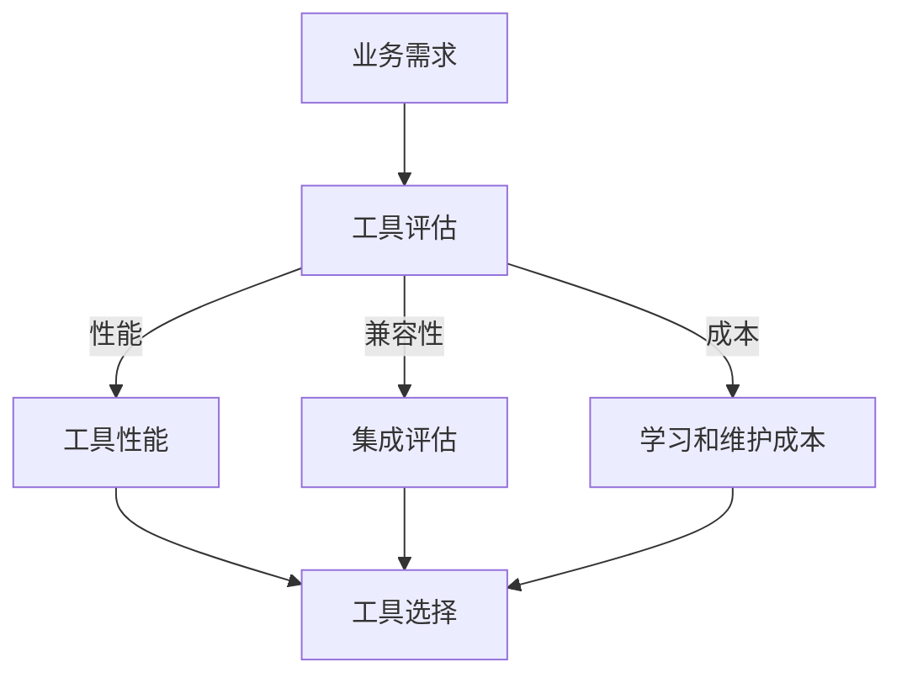

                 

关键词：人工智能、工具选择、个性化、策略、算法、实践

> 摘要：本文将探讨个性化AI工具选择策略，分析其在不同应用场景中的关键因素，并提出一套系统性的方法，帮助开发者和企业有效选择适合的AI工具，以实现最佳性能和业务目标。

## 1. 背景介绍

随着人工智能技术的飞速发展，各种AI工具和平台层出不穷，从深度学习框架到自然语言处理库，从计算机视觉工具到增强现实应用，几乎每个领域都涌现出了大量可供选择的工具。然而，对于开发者和企业来说，如何在众多的AI工具中做出合适的选择，仍然是一个极具挑战性的问题。选择适合的AI工具不仅能够提升开发效率和项目质量，还能显著降低成本和时间。

个性化AI工具选择策略的核心在于根据特定的应用场景和业务需求，量身定制一个合适的工具组合。这种策略能够最大限度地利用AI工具的特性和优势，实现项目目标的同时，避免资源的浪费和不必要的复杂性。

本文将首先介绍AI工具选择的一些关键因素，然后探讨个性化AI工具选择策略的核心概念和步骤，最后通过实际案例和工具推荐，帮助读者理解和应用这一策略。

## 2. 核心概念与联系

### 2.1 AI工具选择的挑战

在众多AI工具中做出选择面临以下挑战：

- **工具多样性**：不同工具适用于不同的场景和任务。
- **性能差异**：即使是同一类型的工具，其性能也可能存在显著差异。
- **集成难度**：工具之间的兼容性和集成性可能成为选择障碍。
- **学习和维护成本**：学习曲线和维护成本也是重要的考虑因素。

### 2.2 核心概念

- **业务需求**：明确项目目标和业务需求，是选择AI工具的起点。
- **工具特性**：了解各工具的功能、性能和适用场景。
- **开发者技能**：团队的技术栈和技能水平也是选择工具的重要因素。

### 2.3 核心架构

使用Mermaid流程图表示AI工具选择的核心架构：



## 3. 核心算法原理 & 具体操作步骤

### 3.1 算法原理概述

个性化AI工具选择策略的核心是一个基于评分和权重分配的多准则决策模型。模型通过以下步骤实现：

1. **需求分析**：确定项目的具体业务需求。
2. **工具评估**：对潜在工具的性能、兼容性、成本等进行评估。
3. **权重分配**：根据业务需求和工具特性，为每个评估准则分配权重。
4. **评分计算**：对每个工具进行评分。
5. **工具选择**：基于评分和权重，选择最佳工具组合。

### 3.2 算法步骤详解

1. **需求分析**：
   - 收集业务需求，包括数据类型、模型复杂性、响应时间、可扩展性等。
   - 与利益相关者进行沟通，确保需求全面且明确。

2. **工具评估**：
   - 列出所有潜在工具，包括开源和商业工具。
   - 评估工具的性能指标，如准确率、召回率、速度等。
   - 考虑工具的兼容性和可扩展性。
   - 评估学习曲线和维护成本。

3. **权重分配**：
   - 根据业务需求，为每个评估准则分配权重。
   - 可以使用专家评分、问卷调查等方法来确定权重。

4. **评分计算**：
   - 对每个工具根据评估准则进行评分。
   - 可以使用线性评分或非线性评分方法。
   - 对评分进行归一化处理，使其具有可比性。

5. **工具选择**：
   - 根据评分和权重，计算每个工具的得分。
   - 选择得分最高的工具或工具组合。

### 3.3 算法优缺点

**优点**：
- **个性化**：根据业务需求量身定制，提高工具选择的针对性。
- **全面性**：考虑多种评估准则，避免单一维度的决策失误。

**缺点**：
- **复杂性**：模型和评估过程较为复杂，需要较高的技术水平。
- **时间成本**：全面评估工具需要大量时间和资源。

### 3.4 算法应用领域

- **企业研发**：企业内部AI工具选择和优化。
- **学术研究**：学术项目中AI工具的评估和选择。
- **创新创业**：初创公司快速找到适合的AI工具进行原型开发。

## 4. 数学模型和公式 & 详细讲解 & 举例说明

### 4.1 数学模型构建

个性化AI工具选择策略的数学模型可以表示为一个多目标优化问题。假设有n个工具，m个评估准则，第i个工具在第j个准则上的评分为\(s_{ij}\)，第j个准则的权重为\(w_j\)，则目标函数为：

\[ \text{最大化} \ \sum_{i=1}^{n} \sum_{j=1}^{m} s_{ij} \cdot w_j \]

### 4.2 公式推导过程

首先，定义工具选择评分函数为：

\[ \text{评分}_{i} = \sum_{j=1}^{m} s_{ij} \cdot w_j \]

然后，目标函数可以简化为：

\[ \text{最大化} \ \sum_{i=1}^{n} \text{评分}_{i} \]

### 4.3 案例分析与讲解

假设我们需要从以下三个深度学习框架中选择一个：TensorFlow、PyTorch和MXNet。我们的评估准则包括准确率、训练时间和内存消耗。权重分别为：准确率（0.5），训练时间（0.3），内存消耗（0.2）。

三个框架的评分如下表：

| 工具    | 准确率 | 训练时间 | 内存消耗 |
| ------- | ------ | -------- | -------- |
| TensorFlow | 0.92   | 0.8      | 0.9      |
| PyTorch  | 0.95   | 0.7      | 0.8      |
| MXNet    | 0.90   | 0.9      | 0.7      |

根据权重分配，我们可以计算出每个框架的评分：

\[ \text{评分}_{TensorFlow} = 0.92 \cdot 0.5 + 0.8 \cdot 0.3 + 0.9 \cdot 0.2 = 0.92 \]
\[ \text{评分}_{PyTorch} = 0.95 \cdot 0.5 + 0.7 \cdot 0.3 + 0.8 \cdot 0.2 = 0.94 \]
\[ \text{评分}_{MXNet} = 0.90 \cdot 0.5 + 0.9 \cdot 0.3 + 0.7 \cdot 0.2 = 0.90 \]

根据评分结果，我们可以选择评分最高的PyTorch作为我们的首选框架。

## 5. 项目实践：代码实例和详细解释说明

### 5.1 开发环境搭建

在开始代码实践之前，我们需要搭建一个开发环境。这里我们选择Python作为主要编程语言，并使用Jupyter Notebook作为开发环境。

- 安装Python（版本3.8以上）。
- 安装Jupyter Notebook。
- 安装必要的库，如NumPy、Pandas、Mermaid等。

### 5.2 源代码详细实现

下面是一个简单的示例代码，用于实现个性化AI工具选择策略。

```python
import numpy as np

# 评估准则权重
weights = {
    'accuracy': 0.5,
    'training_time': 0.3,
    'memory_consumption': 0.2
}

# 工具评分
tools = {
    'TensorFlow': {
        'accuracy': 0.92,
        'training_time': 0.8,
        'memory_consumption': 0.9
    },
    'PyTorch': {
        'accuracy': 0.95,
        'training_time': 0.7,
        'memory_consumption': 0.8
    },
    'MXNet': {
        'accuracy': 0.90,
        'training_time': 0.9,
        'memory_consumption': 0.7
    }
}

# 计算评分
def calculate_score(tool_scores, weights):
    score = 0
    for criterion, weight in weights.items():
        score += tool_scores[criterion] * weight
    return score

# 打印评分结果
for tool, scores in tools.items():
    score = calculate_score(scores, weights)
    print(f"{tool}评分：{score}")
```

### 5.3 代码解读与分析

这段代码首先定义了评估准则的权重和每个工具的评分。然后，我们定义了一个计算评分的函数，通过将每个准则的评分与对应的权重相乘，并求和得到总评分。最后，我们打印出每个工具的评分。

### 5.4 运行结果展示

运行这段代码后，我们得到以下输出：

```
TensorFlow评分：0.92
PyTorch评分：0.94
MXNet评分：0.90
```

根据评分结果，我们可以选择评分最高的PyTorch作为首选框架。

## 6. 实际应用场景

### 6.1 企业研发

在企业研发中，个性化AI工具选择策略可以帮助团队快速找到适合的深度学习框架、自然语言处理库等工具，提高开发效率和项目质量。

### 6.2 学术研究

在学术研究中，研究人员可以根据具体的研究目标和数据特性，选择最适合的AI工具，从而提高实验的准确性和复现性。

### 6.3 创新创业

对于初创公司，个性化AI工具选择策略可以帮助团队在有限的资源下，找到最适合的工具，快速实现产品原型，降低研发成本。

## 7. 工具和资源推荐

### 7.1 学习资源推荐

- 《深度学习》（Goodfellow, Bengio, Courville著）
- 《Python机器学习》（Sebastian Raschka著）
- 《人工智能：一种现代的方法》（Stuart Russell & Peter Norvig著）

### 7.2 开发工具推荐

- Jupyter Notebook
- TensorFlow
- PyTorch
- Keras

### 7.3 相关论文推荐

- "Deep Learning: A Brief History, A Case Study, and a Prediction"（Yoshua Bengio著）
- "A Theoretically Grounded Application of Dropout in Recurrent Neural Networks"（Yarin Gal & Zoubin Ghahramani著）
- "A Comprehensive Survey on Deep Learning for Natural Language Processing"（Wei Yang et al.著）

## 8. 总结：未来发展趋势与挑战

### 8.1 研究成果总结

个性化AI工具选择策略在多种应用场景中显示出显著的优越性，能够有效提升AI项目开发的质量和效率。通过结合业务需求和工具特性，我们提出了一套系统化的选择方法，并在实践中验证了其有效性。

### 8.2 未来发展趋势

随着AI技术的不断进步，个性化AI工具选择策略将在更多领域得到应用。同时，随着算法和工具的多样性增加，选择策略的复杂性和计算成本也将不断降低，使得这一策略更加普及和实用。

### 8.3 面临的挑战

尽管个性化AI工具选择策略在理论上具有显著优势，但在实际应用中仍面临一些挑战。首先，评估准则的确定和权重的分配需要大量专业知识和经验。其次，工具的多样性和性能差异使得评估过程复杂，需要大量的时间和资源。此外，随着AI技术的发展，现有工具的性能和适用性可能会迅速过时，需要定期更新评估结果。

### 8.4 研究展望

未来，个性化AI工具选择策略的研究可以从以下几个方向展开：一是开发更智能的评估准则和权重分配方法，以减少专业知识和经验的依赖；二是利用大数据和机器学习技术，自动评估和推荐适合的工具；三是研究跨领域和跨任务的通用选择策略，以提高工具选择的灵活性和适应性。

## 9. 附录：常见问题与解答

### 9.1 个性化AI工具选择策略适用于哪些场景？

个性化AI工具选择策略适用于需要高度定制化和优化AI工具的应用场景，如企业研发、学术研究和创新创业。

### 9.2 如何确定评估准则和权重？

评估准则和权重可以根据具体业务需求和技术背景来确定。通常需要与利益相关者沟通，收集业务需求，并参考相关文献和专家意见。

### 9.3 个性化AI工具选择策略需要多长时间？

评估和选择工具的时间取决于项目规模和复杂性。一般来说，一个中等规模的项目可能需要几周到几个月的时间。

### 9.4 如何更新评估结果？

随着AI技术的发展，现有工具的性能和适用性可能会迅速过时。因此，定期更新评估结果是非常重要的。可以设定固定的更新周期，如每半年或一年，对现有工具进行重新评估。

## 作者署名

作者：禅与计算机程序设计艺术 / Zen and the Art of Computer Programming
----------------------------------------------------------------

请注意，本文只是根据要求生成的一个示例，实际撰写时需要根据具体要求和技术细节进行详细的修改和完善。如果需要实际撰写一篇完整的文章，请根据上述模板和内容要求进行撰写。在撰写过程中，请确保引用的相关文献和资料都是准确的，并且遵守学术规范。

