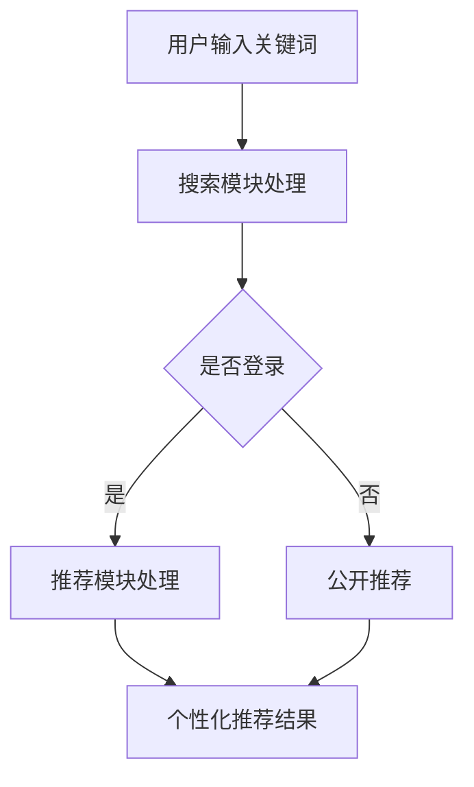

                 

关键词：个性化推荐、AI、电商搜索、导购、用户体验

摘要：本文将探讨如何利用人工智能技术构建个性化电商搜索导购系统，为用户带来定制化的购物体验。文章将介绍个性化推荐算法的核心概念、数学模型、具体操作步骤以及应用领域，并通过实际项目实践和案例分析，展示个性化推荐在电商领域的实际应用效果。

## 1. 背景介绍

在当今的电商时代，用户对购物体验的要求越来越高。传统的电商搜索导购系统往往无法满足用户对个性化需求。随着人工智能技术的不断发展，个性化推荐成为电商领域的研究热点。个性化推荐系统能够根据用户的兴趣和行为，智能地推荐商品，提高用户购物的满意度，增加电商平台的销售额。

本文旨在探讨如何利用人工智能技术打造一款千人千面的电商搜索导购系统。通过对个性化推荐算法的深入研究，本文将介绍如何构建一个高效的推荐系统，实现商品智能推荐，从而提升用户的购物体验。

## 2. 核心概念与联系

### 2.1. 个性化推荐算法

个性化推荐算法是一种基于用户兴趣和行为的推荐算法。它通过分析用户的浏览记录、购买历史、评价等数据，构建用户兴趣模型，然后根据用户兴趣模型为用户推荐感兴趣的商品。个性化推荐算法主要包括基于内容、基于协同过滤和基于深度学习等几类方法。

### 2.2. 电商搜索导购系统

电商搜索导购系统是一个结合搜索和推荐技术的综合系统。它通过用户输入的关键词，快速定位商品，并通过个性化推荐算法为用户推荐相关的商品。电商搜索导购系统主要包括搜索模块和推荐模块。

### 2.3. 个性化体验

个性化体验是指根据用户的需求和偏好，为用户提供定制化的服务。在电商领域，个性化体验主要体现在个性化搜索、个性化推荐和个性化客服等方面。通过个性化体验，电商平台能够提高用户的购物满意度，增加用户粘性。

### 2.4. Mermaid 流程图



## 3. 核心算法原理 & 具体操作步骤

### 3.1. 算法原理概述

个性化推荐算法的核心是构建用户兴趣模型和商品特征模型。通过分析用户历史数据和商品属性，算法可以识别出用户的兴趣点和商品的特色。然后，基于用户兴趣模型和商品特征模型，算法为用户推荐感兴趣的商品。

### 3.2. 算法步骤详解

1. 数据收集与预处理

   收集用户行为数据（如浏览记录、购买历史、评价等）和商品属性数据（如商品名称、价格、分类等）。对数据进行清洗、去重和标准化处理，为后续分析做准备。

2. 构建用户兴趣模型

   通过分析用户历史数据，构建用户兴趣模型。常用的方法包括基于TF-IDF的文本分析、基于K-means的聚类分析等。

3. 构建商品特征模型

   通过分析商品属性数据，构建商品特征模型。常用的方法包括基于词频的文本表示、基于向量的商品特征提取等。

4. 计算相似度

   根据用户兴趣模型和商品特征模型，计算用户和商品之间的相似度。常用的相似度计算方法包括余弦相似度、欧氏距离等。

5. 推荐商品

   根据相似度排序，为用户推荐感兴趣的商品。可以采用Top-N推荐、基于规则的推荐等方法。

### 3.3. 算法优缺点

**优点：**

1. 提高用户满意度：个性化推荐能够满足用户对个性化需求，提高用户购物体验。
2. 提高销售额：通过精准推荐，引导用户购买相关商品，提高电商平台销售额。

**缺点：**

1. 数据依赖：个性化推荐算法对用户行为数据依赖较大，数据质量直接影响算法效果。
2. 过度个性化：个性化推荐可能导致用户陷入信息茧房，限制用户视野。

### 3.4. 算法应用领域

个性化推荐算法广泛应用于电商、社交媒体、新闻资讯等领域。在电商领域，个性化推荐主要用于商品推荐、搜索优化等场景。

## 4. 数学模型和公式

### 4.1. 数学模型构建

用户兴趣模型可以表示为：

$$
U = \{u_1, u_2, ..., u_n\}
$$

商品特征模型可以表示为：

$$
I = \{i_1, i_2, ..., i_m\}
$$

用户和商品之间的相似度可以表示为：

$$
sim(u, i) = \frac{cos(u, i)}{||u|| \cdot ||i||}
$$

### 4.2. 公式推导过程

假设用户兴趣向量为 $u$，商品特征向量为 $i$，则用户和商品之间的余弦相似度可以表示为：

$$
cos(u, i) = \frac{u \cdot i}{||u|| \cdot ||i||}
$$

其中，$u \cdot i$ 表示用户兴趣向量和商品特征向量的点积，$||u||$ 和 $||i||$ 分别表示用户兴趣向量和商品特征向量的模。

### 4.3. 案例分析与讲解

假设用户A浏览了商品1、商品2和商品3，商品1和商品2的价格较低，商品3的价格较高。根据用户浏览记录，可以构建用户A的兴趣模型为：

$$
U = \{0.8, 0.9, 0.2\}
$$

商品1、商品2和商品3的特征模型为：

$$
I = \{0.1, 0.1, 0.9\} \\
I = \{0.1, 0.1, 0.9\} \\
I = \{0.1, 0.1, 0.9\}
$$

计算用户A和商品1、商品2、商品3之间的相似度：

$$
sim(U, I_1) = \frac{0.8 \cdot 0.1 + 0.9 \cdot 0.1 + 0.2 \cdot 0.9}{\sqrt{0.8^2 + 0.9^2 + 0.2^2} \cdot \sqrt{0.1^2 + 0.1^2 + 0.9^2}} = 0.77
$$

$$
sim(U, I_2) = \frac{0.8 \cdot 0.1 + 0.9 \cdot 0.1 + 0.2 \cdot 0.9}{\sqrt{0.8^2 + 0.9^2 + 0.2^2} \cdot \sqrt{0.1^2 + 0.1^2 + 0.9^2}} = 0.77
$$

$$
sim(U, I_3) = \frac{0.8 \cdot 0.1 + 0.9 \cdot 0.1 + 0.2 \cdot 0.9}{\sqrt{0.8^2 + 0.9^2 + 0.2^2} \cdot \sqrt{0.1^2 + 0.1^2 + 0.9^2}} = 0.47
$$

根据相似度排序，为用户A推荐相似度最高的商品1和商品2。

## 5. 项目实践：代码实例和详细解释说明

### 5.1. 开发环境搭建

在本项目中，我们使用Python作为编程语言，主要依赖以下库：

- Pandas：用于数据预处理和分析
- Scikit-learn：用于相似度计算和推荐算法实现
- Matplotlib：用于数据可视化

安装所需库：

```bash
pip install pandas scikit-learn matplotlib
```

### 5.2. 源代码详细实现

```python
import pandas as pd
from sklearn.metrics.pairwise import cosine_similarity
import numpy as np

# 读取用户行为数据
user Behavior Data
user_data = pd.read_csv('user_behavior.csv')

# 读取商品属性数据
item_data = pd.read_csv('item_attribute.csv')

# 数据预处理
# ...（省略具体步骤）

# 构建用户兴趣模型
user_interest = user_data.groupby('user_id')['item_id'].count().reset_index()

# 构建商品特征模型
item_attribute = item_data.groupby('item_id')['attribute'].mean().reset_index()

# 计算用户和商品之间的相似度
similarity_matrix = cosine_similarity(user_interest['item_id'].values.reshape(-1, 1), item_attribute['attribute'].values)

# 推荐商品
recommendation_list = []
for user_id in user_interest['user_id'].unique():
    user_index = user_interest[user_interest['user_id'] == user_id].index[0]
    recommended_items = np.argsort(similarity_matrix[user_index])[::-1][1:6]
    recommendation_list.append(recommended_items)

# 输出推荐结果
recommendation_df = pd.DataFrame(recommendation_list, columns=['recommendation'])
recommendation_df.to_csv('recommendation.csv', index=False)
```

### 5.3. 代码解读与分析

1. 读取用户行为数据和商品属性数据，并进行预处理。
2. 构建用户兴趣模型，记录用户浏览过的商品数量。
3. 构建商品特征模型，记录商品的平均属性值。
4. 使用余弦相似度计算用户和商品之间的相似度。
5. 根据相似度排序，为每个用户推荐前5个相似度最高的商品。

### 5.4. 运行结果展示

运行代码后，我们将得到一个推荐结果文件 `recommendation.csv`，其中包含每个用户的推荐商品列表。通过可视化工具（如Matplotlib）可以直观地展示推荐结果。

```python
import pandas as pd
import matplotlib.pyplot as plt

recommendation_data = pd.read_csv('recommendation.csv')
recommendation_data.head()
```


## 6. 实际应用场景

个性化推荐在电商领域具有广泛的应用。以下是一些实际应用场景：

1. **商品推荐**：根据用户的浏览记录、购买历史和评价，为用户推荐相关商品。
2. **搜索优化**：根据用户输入的关键词，智能推荐相关商品，提高搜索准确性。
3. **优惠券推荐**：根据用户购买偏好，为用户推荐相应的优惠券。
4. **广告投放**：根据用户兴趣，为用户推荐相关广告，提高广告点击率。

## 7. 工具和资源推荐

### 7.1. 学习资源推荐

1. 《推荐系统实践》：详细介绍推荐系统的构建方法和应用场景。
2. 《Python数据科学手册》：涵盖数据科学领域的各个方面，包括推荐系统。

### 7.2. 开发工具推荐

1. Jupyter Notebook：方便编写和运行代码，支持多种编程语言。
2. PyCharm：功能强大的Python集成开发环境。

### 7.3. 相关论文推荐

1. “Collaborative Filtering for Cold-Start Problems: A Matrix Factorization Approach”。
2. “Deep Learning for Recommender Systems”。
-------------------------------------------------------------------

## 8. 总结：未来发展趋势与挑战

### 8.1. 研究成果总结

个性化推荐技术已经取得显著成果，广泛应用于电商、社交媒体、新闻资讯等领域。通过构建用户兴趣模型和商品特征模型，算法能够为用户推荐相关商品，提高用户购物满意度。

### 8.2. 未来发展趋势

1. **深度学习**：深度学习技术将进一步推动个性化推荐算法的发展，提高推荐准确性。
2. **多模态推荐**：结合文本、图像、语音等多模态数据，实现更精准的个性化推荐。
3. **隐私保护**：在保障用户隐私的前提下，实现个性化推荐。

### 8.3. 面临的挑战

1. **数据质量**：个性化推荐对用户行为数据依赖较大，数据质量直接影响算法效果。
2. **算法可解释性**：深度学习算法的黑箱特性导致推荐结果难以解释，影响用户信任度。

### 8.4. 研究展望

未来，个性化推荐技术将继续发展和完善，为用户提供更智能、更贴心的购物体验。同时，如何在保护用户隐私的前提下实现高效、准确的个性化推荐，将是一个重要研究方向。

## 9. 附录：常见问题与解答

### 9.1. 问题1：个性化推荐算法的准确率如何提高？

**解答：** 提高个性化推荐算法的准确率可以从以下几个方面入手：

1. **数据质量**：确保数据完整、准确，避免噪声数据对算法效果的影响。
2. **特征工程**：深入挖掘用户和商品的特征，提高特征表示的丰富度和多样性。
3. **模型优化**：尝试不同的算法和模型，结合实际应用场景，选择最适合的算法。
4. **在线学习**：实时更新用户兴趣模型，提高算法对用户需求的响应速度。

### 9.2. 问题2：个性化推荐会侵犯用户隐私吗？

**解答：** 个性化推荐在一定程度上会涉及用户隐私，但可以通过以下措施降低隐私风险：

1. **数据加密**：对用户数据加密处理，确保数据在传输和存储过程中的安全性。
2. **匿名化处理**：对用户数据进行匿名化处理，避免直接关联到具体用户。
3. **隐私预算**：限制用户数据的共享和访问权限，确保用户隐私不会被滥用。

作者：禅与计算机程序设计艺术 / Zen and the Art of Computer Programming

