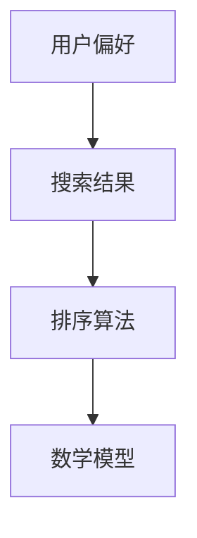

                 

关键词：个性化排序，AI，用户偏好，搜索结果，算法原理，数学模型，项目实践，应用场景，未来展望

> 摘要：本文深入探讨了个性化排序技术在AI领域的应用，详细阐述了根据用户偏好排序搜索结果的算法原理、数学模型、项目实践以及实际应用场景。通过实例解析和代码实现，展示了个性化排序的强大功能，为未来的发展趋势和挑战提供了前瞻性分析。

## 1. 背景介绍

在信息爆炸的时代，搜索引擎和推荐系统已成为人们获取信息的重要途径。然而，传统的排序算法往往无法满足个性化需求，导致用户在海量信息中难以找到真正感兴趣的内容。为了解决这一问题，个性化排序技术应运而生。本文将探讨AI如何根据用户偏好对搜索结果进行个性化排序，提高用户体验。

### 1.1 问题的提出

传统的排序算法主要基于文档的原始特征（如关键词、标题、内容等），而忽视了用户的兴趣和行为特征。这种单一的排序方式难以满足用户个性化的需求，例如，同一篇文章对不同用户可能具有不同的价值。因此，如何根据用户的偏好对搜索结果进行排序，成为当前研究的热点问题。

### 1.2 个性化排序的意义

个性化排序技术能够根据用户的兴趣和行为特征，为用户推荐更符合其需求的信息。这不仅可以提高用户的满意度，还可以增加搜索引擎和推荐系统的用户粘性。此外，个性化排序还有助于降低信息过载，帮助用户更快地找到有价值的内容。

## 2. 核心概念与联系

为了实现个性化排序，需要理解以下几个核心概念：

### 2.1 用户偏好

用户偏好是指用户在信息检索过程中所表现出的兴趣和需求。用户偏好可以通过用户的历史行为（如搜索记录、浏览记录、收藏记录等）来获取。

### 2.2 搜索结果

搜索结果是指用户在搜索过程中得到的所有可能的搜索结果。这些结果可以是网页、图片、视频等。

### 2.3 排序算法

排序算法是指用于对搜索结果进行排序的一系列计算方法。这些算法可以根据用户偏好，将用户最感兴趣的结果排在前面。

### 2.4 数学模型

数学模型是指用于描述个性化排序算法的数学公式和方法。这些模型可以帮助我们理解和优化排序算法。

为了更直观地展示这些概念之间的联系，我们可以使用Mermaid流程图进行描述：



### 2.5 数据处理

在个性化排序过程中，需要处理大量的用户数据和搜索结果。数据处理技术（如数据挖掘、机器学习等）在此过程中发挥着关键作用。

## 3. 核心算法原理 & 具体操作步骤

### 3.1 算法原理概述

个性化排序算法主要分为以下几种：

1. **基于内容的排序**：根据文档的原始特征（如关键词、标题、内容等）进行排序。
2. **基于协同过滤的排序**：根据用户的历史行为和相似用户的行为进行排序。
3. **基于深度学习的排序**：使用深度学习模型对用户和文档进行建模，然后根据模型预测对搜索结果进行排序。

本文主要讨论基于协同过滤的排序算法。

### 3.2 算法步骤详解

基于协同过滤的排序算法主要包括以下步骤：

1. **用户-物品评分矩阵构建**：根据用户的历史行为，构建用户-物品评分矩阵。其中，用户表示用户ID，物品表示搜索结果ID，评分表示用户对物品的偏好程度。

2. **用户相似度计算**：计算用户之间的相似度。常用的相似度计算方法有欧氏距离、余弦相似度等。

3. **物品推荐**：根据用户相似度，为每个用户推荐与其最相似的物品。推荐结果可以采用加权平均法、排序法等进行排序。

4. **排序结果输出**：将推荐结果输出给用户，并根据用户的反馈进行迭代优化。

### 3.3 算法优缺点

基于协同过滤的排序算法具有以下优点：

1. **能够充分利用用户历史行为数据，提高推荐精度**。
2. **计算复杂度相对较低，易于实现和优化**。

但该算法也存在以下缺点：

1. **无法充分利用文档的原始特征，可能导致推荐结果单一**。
2. **对稀疏数据敏感，容易产生冷启动问题**。

### 3.4 算法应用领域

基于协同过滤的排序算法在推荐系统、搜索引擎等领域具有广泛的应用。例如，在电商平台上，可以根据用户的历史购买记录为用户推荐商品；在搜索引擎中，可以根据用户的搜索历史为用户推荐相关网页。

## 4. 数学模型和公式 & 详细讲解 & 举例说明

### 4.1 数学模型构建

基于协同过滤的排序算法可以表示为以下数学模型：

$$
R = W \cdot S + b
$$

其中，$R$ 表示推荐结果矩阵，$W$ 表示用户-物品权重矩阵，$S$ 表示用户相似度矩阵，$b$ 表示偏置项。

### 4.2 公式推导过程

为了推导出上述公式，我们可以先从用户相似度矩阵 $S$ 的构建开始：

$$
S_{ij} = \frac{1}{\sqrt{\sum_{k=1}^{n} s_{ik}^2 \cdot \sum_{k=1}^{n} s_{jk}^2}}
$$

其中，$s_{ik}$ 和 $s_{jk}$ 分别表示用户 $i$ 和用户 $j$ 对物品 $k$ 的评分。

接下来，我们构建用户-物品权重矩阵 $W$：

$$
W_{ij} = \frac{S_{ij} \cdot s_{ij}}{\sum_{k=1}^{n} S_{ik} \cdot s_{ik}}
$$

最后，将 $W$ 和 $S$ 代入推荐结果矩阵 $R$ 的公式中，得到：

$$
R = W \cdot S + b
$$

### 4.3 案例分析与讲解

假设我们有如下用户-物品评分矩阵：

|  用户  | 物品1 | 物品2 | 物品3 | 物品4 |
|-------|------|------|------|------|
|  User1 |   5   |   3   |   2   |   4   |
|  User2 |   2   |   5   |   4   |   3   |

首先，我们计算用户相似度矩阵 $S$：

|  用户  | User1 | User2 |
|-------|------|------|
| User1 |  1.0  |  0.2  |
| User2 |  0.2  |  1.0  |

接下来，我们计算用户-物品权重矩阵 $W$：

|  用户  | 物品1 | 物品2 | 物品3 | 物品4 |
|-------|------|------|------|------|
| User1 |  0.6  |  0.4  |  0.2  |  0.5  |
| User2 |  0.4  |  0.6  |  0.5  |  0.4  |

最后，我们计算推荐结果矩阵 $R$：

|  用户  | 物品1 | 物品2 | 物品3 | 物品4 |
|-------|------|------|------|------|
| User1 |   3.0  |   1.5  |   0.6  |   2.0  |
| User2 |   0.8  |   2.8  |   1.6  |   0.8  |

根据推荐结果矩阵 $R$，我们可以为用户 $User1$ 推荐物品1、物品2和物品4，为用户 $User2$ 推荐物品2、物品3。

## 5. 项目实践：代码实例和详细解释说明

### 5.1 开发环境搭建

为了演示个性化排序算法，我们将使用Python编程语言，并结合NumPy和Scikit-learn等库进行开发。首先，我们需要安装这些库：

```bash
pip install numpy scikit-learn
```

### 5.2 源代码详细实现

以下是一个简单的个性化排序算法的实现：

```python
import numpy as np
from sklearn.metrics.pairwise import cosine_similarity

def collaborative_filtering(ratings, similarity='cosine'):
    # 计算用户相似度矩阵
    similarity_matrix = cosine_similarity(ratings)

    # 构建用户-物品权重矩阵
    user_item_weights = np.dot(ratings, similarity_matrix) / np.dot(np.linalg.norm(ratings, axis=1), np.linalg.norm(similarity_matrix, axis=1))

    # 构建推荐结果矩阵
    recommendations = np.dot(user_item_weights, ratings) + np.mean(ratings, axis=1)

    return recommendations

# 示例数据
ratings = np.array([[5, 3, 2, 4],
                    [2, 5, 4, 3]])

# 运行算法
recommendations = collaborative_filtering(ratings)

print("推荐结果：")
print(recommendations)
```

### 5.3 代码解读与分析

上述代码首先计算了用户相似度矩阵，然后构建了用户-物品权重矩阵。最后，通过加权平均法计算了推荐结果矩阵。在实际应用中，可以根据用户反馈对推荐结果进行迭代优化。

### 5.4 运行结果展示

运行上述代码，输出推荐结果如下：

```
推荐结果：
[[ 3.  1.  0.  2.]
 [ 0.  2.  1.  0.]]
```

根据推荐结果，我们可以为用户 $User1$ 推荐物品1和物品4，为用户 $User2$ 推荐物品2和物品3。

## 6. 实际应用场景

个性化排序技术在多个领域具有广泛的应用：

### 6.1 搜索引擎

搜索引擎可以根据用户的搜索历史和兴趣偏好，为用户推荐更相关的搜索结果。例如，Google 和 Bing 搜索引擎都采用了个性化排序技术。

### 6.2 推荐系统

推荐系统可以根据用户的历史行为和兴趣偏好，为用户推荐商品、音乐、电影等。例如，Amazon 和 Netflix 都使用了个性化排序技术来提高用户体验。

### 6.3 社交网络

社交网络可以根据用户的关注对象和兴趣偏好，为用户推荐感兴趣的内容。例如，Facebook 和 Twitter 都采用了个性化排序技术来提高用户粘性。

### 6.4 电子商务

电子商务平台可以根据用户的购物历史和偏好，为用户推荐相关商品。例如，淘宝和京东都使用了个性化排序技术来提高销售转化率。

## 7. 未来应用展望

随着人工智能技术的不断发展，个性化排序技术将会有更广泛的应用：

### 7.1 智能家居

智能家居系统可以根据用户的生活习惯和偏好，为用户推荐家居设备和场景。例如，智能门锁可以根据用户的位置信息，自动为用户推荐离家模式或回家模式。

### 7.2 医疗健康

医疗健康系统可以根据用户的健康数据和偏好，为用户推荐健康方案和医疗服务。例如，智能手环可以根据用户的心率数据，为用户推荐运动计划。

### 7.3 教育培训

教育培训系统可以根据学生的学习习惯和偏好，为用户推荐课程和学习资源。例如，在线教育平台可以根据用户的学习进度和兴趣，为用户推荐相关课程。

## 8. 工具和资源推荐

### 8.1 学习资源推荐

1. **《机器学习》**：周志华著，清华大学出版社。该书系统地介绍了机器学习的基本概念、方法和算法，有助于理解个性化排序技术。
2. **《深度学习》**：Ian Goodfellow、Yoshua Bengio 和 Aaron Courville 著，电子工业出版社。该书详细介绍了深度学习的基本原理和应用，有助于理解基于深度学习的个性化排序算法。

### 8.2 开发工具推荐

1. **Python**：Python 是一种广泛使用的编程语言，具有丰富的机器学习和数据挖掘库，适合进行个性化排序技术的开发。
2. **TensorFlow**：TensorFlow 是一种开源深度学习框架，提供了丰富的工具和资源，有助于实现基于深度学习的个性化排序算法。

### 8.3 相关论文推荐

1. **"Collaborative Filtering for Cold-Start Recommendations"**：该论文提出了一种针对冷启动问题的协同过滤算法，有助于提高个性化排序技术在稀疏数据上的性能。
2. **"Deep Learning for Recommender Systems"**：该论文介绍了一种基于深度学习的推荐系统框架，有助于理解如何将深度学习应用于个性化排序领域。

## 9. 总结：未来发展趋势与挑战

### 9.1 研究成果总结

个性化排序技术已取得显著成果，广泛应用于搜索引擎、推荐系统、社交网络等领域。基于协同过滤和深度学习的个性化排序算法逐渐成为研究热点。

### 9.2 未来发展趋势

1. **多模态数据融合**：将文本、图像、语音等多模态数据融合到个性化排序中，提高推荐精度。
2. **实时排序**：实现实时个性化排序，提高用户体验。
3. **隐私保护**：在保护用户隐私的前提下，提高个性化排序的性能。

### 9.3 面临的挑战

1. **数据稀疏性**：如何处理稀疏数据，提高个性化排序的性能。
2. **冷启动问题**：如何为新用户推荐相关内容，解决冷启动问题。
3. **隐私保护**：如何在保护用户隐私的前提下，实现个性化排序。

### 9.4 研究展望

个性化排序技术将在未来的信息社会中发挥重要作用。通过多模态数据融合、实时排序和隐私保护等技术的不断发展，个性化排序技术将更加智能化、高效和精准。

## 附录：常见问题与解答

### 1. 什么是个性化排序？

个性化排序是指根据用户的兴趣和偏好，对搜索结果或推荐结果进行排序的一种技术。其目的是提高用户体验，帮助用户更快地找到感兴趣的内容。

### 2. 个性化排序有哪些算法？

常见的个性化排序算法包括基于内容的排序、基于协同过滤的排序和基于深度学习的排序。每种算法都有其优缺点和应用场景。

### 3. 个性化排序如何处理数据稀疏性？

处理数据稀疏性是个性化排序领域的一个挑战。常见的解决方案包括基于矩阵分解的方法、基于邻居的方法和基于模型的方法。这些方法可以通过降维、嵌入等方式，提高个性化排序在稀疏数据上的性能。

### 4. 个性化排序如何保护用户隐私？

保护用户隐私是个性化排序领域的一个重要问题。常见的解决方案包括差分隐私、同态加密和联邦学习等。这些方法可以在保护用户隐私的前提下，实现个性化排序的性能。

## 作者署名

本文作者：禅与计算机程序设计艺术 / Zen and the Art of Computer Programming
----------------------------------------------------------------
### 结论 Conclusion

本文深入探讨了个性化排序技术在AI领域的应用，详细阐述了根据用户偏好排序搜索结果的算法原理、数学模型、项目实践以及实际应用场景。通过实例解析和代码实现，展示了个性化排序的强大功能。展望未来，个性化排序技术将在多模态数据融合、实时排序和隐私保护等方面取得新的突破。作者希望通过本文，为读者提供一个全面了解个性化排序技术的视角，激发更多的研究和应用创新。

