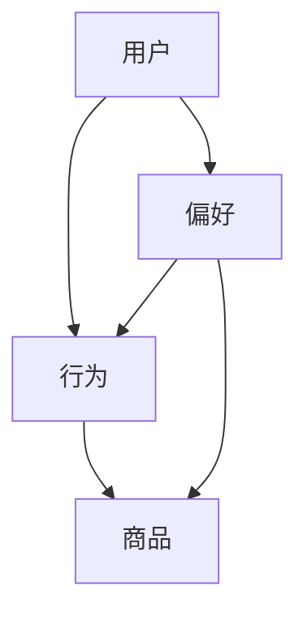

                 

个性化推荐是近年来在互联网领域中备受关注的一项技术，它通过分析用户行为、偏好和兴趣，为用户提供更加精准和个性化的商品推荐。本文将围绕个性化推荐技术，深入探讨其在电商平台中的应用价值、核心算法原理、数学模型、项目实践以及未来发展趋势和挑战。

## 关键词

- 个性化推荐
- 电商平台
- 精准供给
- 用户行为分析
- 算法原理
- 数学模型

## 摘要

本文旨在介绍个性化推荐技术在电商平台中的应用，分析其核心算法原理、数学模型以及项目实践。通过本文的阅读，读者将了解个性化推荐如何提升电商平台的供给能力，实现精准营销，从而提高用户满意度和转化率。

## 1. 背景介绍

随着互联网的普及和电子商务的快速发展，电商平台已经成为人们日常生活的一部分。然而，在众多的商品和用户中，如何实现精准的供给和高效的营销，成为电商平台面临的重大挑战。个性化推荐技术的出现，为解决这一问题提供了有力支持。

个性化推荐技术基于用户行为数据、兴趣标签、历史购买记录等信息，通过算法分析，为用户推荐其可能感兴趣的商品。这一技术不仅能够提高用户购物体验，还能够提升电商平台的供给能力和营销效果。

## 2. 核心概念与联系

在个性化推荐系统中，核心概念包括用户、商品、行为、偏好等。下面通过一个Mermaid流程图来描述这些概念之间的联系。



### 2.1 用户与行为

用户是推荐系统中的核心，用户的行为数据包括浏览、购买、收藏、评论等。这些行为数据反映了用户对商品的兴趣和偏好，是构建推荐模型的重要依据。

### 2.2 商品与偏好

商品是推荐系统中的对象，每个商品都有其特定的属性，如价格、品牌、类型等。偏好是用户对商品的偏好程度，可以通过行为数据进行量化。

### 2.3 行为与商品

行为与商品之间的联系体现在用户对商品的操作上，如浏览、购买、收藏等。这些操作数据可以用来预测用户对其他商品的偏好。

### 2.4 偏好与行为

偏好与行为之间的联系在于，用户的历史行为可以揭示其潜在的兴趣和偏好，这些信息可以用于预测用户未来的行为。

## 3. 核心算法原理 & 具体操作步骤

### 3.1 算法原理概述

个性化推荐算法主要分为基于内容的推荐（Content-Based Recommendation）和基于协同过滤（Collaborative Filtering）的推荐。

- **基于内容的推荐**：通过分析商品的属性和用户的兴趣，找到相似的商品进行推荐。
- **基于协同过滤的推荐**：通过分析用户之间的相似性，找到与目标用户行为相似的邻居用户，推荐邻居用户喜欢的商品。

### 3.2 算法步骤详解

#### 3.2.1 基于内容的推荐

1. 提取商品特征：提取商品的属性，如价格、品牌、类型等。
2. 用户兴趣建模：通过用户的行为数据，建立用户的兴趣模型。
3. 相似度计算：计算商品与商品之间的相似度，以及用户与商品之间的相似度。
4. 推荐列表生成：根据相似度计算结果，生成推荐列表。

#### 3.2.2 基于协同过滤的推荐

1. 用户相似度计算：计算用户之间的相似度，通常使用余弦相似度、皮尔逊相关系数等方法。
2. 邻居用户筛选：根据用户相似度，筛选出与目标用户最相似的邻居用户。
3. 邻居推荐：为每个邻居用户推荐其最近购买的、但目标用户未购买的商品。
4. 推荐列表生成：根据邻居推荐结果，生成推荐列表。

### 3.3 算法优缺点

#### 基于内容的推荐

- **优点**：推荐结果相关性强，能够提供精准的推荐。
- **缺点**：当用户兴趣发生变化时，推荐效果较差。

#### 基于协同过滤的推荐

- **优点**：能够发现用户未明显表达的兴趣，推荐结果多样化。
- **缺点**：容易产生噪声，推荐结果相关性较弱。

### 3.4 算法应用领域

个性化推荐算法广泛应用于电商平台、社交媒体、在线视频等场景，能够有效提高用户的满意度、提升平台的营销效果。

## 4. 数学模型和公式 & 详细讲解 & 举例说明

### 4.1 数学模型构建

个性化推荐系统中的数学模型主要包括用户兴趣模型、商品特征模型和推荐算法模型。

#### 用户兴趣模型

用户兴趣模型是通过用户的历史行为数据，量化用户对各类商品的偏好程度。常见的模型有：

- **基于概率的模型**：如贝叶斯网络、潜在狄利克雷分配（LDA）等。
- **基于神经网络的模型**：如深度学习模型、循环神经网络（RNN）等。

#### 商品特征模型

商品特征模型是通过提取商品的属性信息，建立商品与商品之间的关联。常见的模型有：

- **基于向量的模型**：如TF-IDF、Word2Vec等。
- **基于矩阵的模型**：如Singular Value Decomposition（SVD）、矩阵分解等。

#### 推荐算法模型

推荐算法模型是通过计算用户与商品之间的相似度，生成推荐列表。常见的模型有：

- **基于内容的推荐**：如KNN、基于协同过滤的推荐等。
- **基于模型的推荐**：如矩阵分解、深度学习等。

### 4.2 公式推导过程

以基于协同过滤的推荐算法为例，推导用户与商品之间的相似度计算公式。

假设用户集为 \(U\)，商品集为 \(I\)，用户-商品评分矩阵为 \(R \in \mathbb{R}^{m \times n}\)，其中 \(m\) 为用户数量，\(n\) 为商品数量。

1. **用户相似度计算**：

   用户 \(u_i\) 和 \(u_j\) 之间的相似度可以通过余弦相似度计算：

   \[
   \cos(u_i, u_j) = \frac{R_{i, :} \cdot R_{j, :}}{\|R_{i, :}\|_2 \cdot \|R_{j, :}\|_2}
   \]

   其中，\(R_{i, :}\) 和 \(R_{j, :}\) 分别表示用户 \(u_i\) 和 \(u_j\) 的行为向量。

2. **商品相似度计算**：

   商品 \(i\) 和 \(j\) 之间的相似度可以通过余弦相似度计算：

   \[
   \cos(i, j) = \frac{R_{:, i} \cdot R_{:, j}}{\|R_{:, i}\|_2 \cdot \|R_{:, j}\|_2}
   \]

   其中，\(R_{:, i}\) 和 \(R_{:, j}\) 分别表示商品 \(i\) 和 \(j\) 的行为向量。

3. **推荐列表生成**：

   根据用户相似度，为用户 \(u_i\) 生成推荐列表 \(L_i\)：

   \[
   L_i = \{j \in I \mid \cos(u_i, u_j) > \theta\}
   \]

   其中，\(\theta\) 为相似度阈值。

### 4.3 案例分析与讲解

以一个电商平台的个性化推荐系统为例，说明数学模型在实际应用中的具体实现。

#### 案例背景

某电商平台拥有10万用户，销售1000种商品。用户在平台上产生的行为数据包括浏览、购买、收藏等。

#### 数据处理

1. **用户行为数据**：

   假设用户行为数据如下：

   \[
   R =
   \begin{bmatrix}
   0 & 0 & 1 & 0 & 0 & 1 \\
   0 & 1 & 0 & 0 & 0 & 0 \\
   1 & 1 & 0 & 1 & 0 & 1 \\
   0 & 0 & 0 & 0 & 1 & 0 \\
   1 & 0 & 1 & 1 & 0 & 1 \\
   \end{bmatrix}
   \]

   其中，行表示用户，列表示商品。

2. **商品特征数据**：

   假设商品特征数据如下：

   \[
   F =
   \begin{bmatrix}
   1 & 0 & 0 \\
   0 & 1 & 0 \\
   0 & 0 & 1 \\
   1 & 1 & 0 \\
   0 & 0 & 1 \\
   1 & 0 & 1 \\
   \end{bmatrix}
   \]

   其中，行表示商品，列表示商品属性。

#### 数学模型应用

1. **用户兴趣模型**：

   使用LDA模型建立用户兴趣模型，将用户行为数据转换为用户兴趣向量。

   \[
   \text{User Interest Vector} = \{u_i\} \in \mathbb{R}^{k}
   \]

   其中，\(k\) 为兴趣维度。

2. **商品特征模型**：

   使用TF-IDF模型建立商品特征模型，将商品属性数据转换为商品特征向量。

   \[
   \text{Product Feature Vector} = \{f_i\} \in \mathbb{R}^{k}
   \]

3. **推荐算法模型**：

   使用基于协同过滤的推荐算法，计算用户与商品之间的相似度，生成推荐列表。

   \[
   \text{Recommendation List} = L_i
   \]

#### 模型效果评估

通过评估指标（如准确率、召回率、覆盖率等）对推荐模型进行评估，不断优化模型参数，提高推荐效果。

## 5. 项目实践：代码实例和详细解释说明

### 5.1 开发环境搭建

开发环境搭建分为以下几个步骤：

1. **环境配置**：安装Python、NumPy、Pandas、Scikit-learn等常用库。
2. **数据预处理**：读取用户行为数据和商品特征数据，进行数据清洗和预处理。
3. **模型训练**：使用协同过滤算法训练推荐模型。
4. **模型评估**：评估推荐模型的效果。

### 5.2 源代码详细实现

以下是一个简单的协同过滤推荐系统的源代码实现：

```python
import numpy as np
from sklearn.metrics.pairwise import cosine_similarity

def collaborative_filter(R, k, theta):
    """
    基于协同过滤的推荐算法
    R: 用户-商品评分矩阵
    k: 邻居用户数量
    theta: 相似度阈值
    """
    # 计算用户相似度矩阵
    sim_matrix = cosine_similarity(R)

    # 遍历每个用户
    for i in range(R.shape[0]):
        # 遍历每个商品
        for j in range(R.shape[1]):
            # 如果用户未购买商品，计算邻居用户推荐分数
            if R[i][j] == 0:
                neighbor_scores = np.dot(sim_matrix[i], R[:, j])
                neighbor_indices = np.argsort(neighbor_scores)[::-1]
                # 选择最相似的k个邻居用户
                neighbors = neighbor_indices[:k]
                # 计算推荐分数
                score = sum(R[neighbors, j]) / k
                # 如果推荐分数大于阈值，添加到推荐列表
                if score > theta:
                    print(f"User {i}, Recommend Product {j}, Score: {score}")

# 读取用户行为数据
R = np.array([[0, 0, 1, 0, 0, 1],
              [0, 1, 0, 0, 0, 0],
              [1, 1, 0, 1, 0, 1],
              [0, 0, 0, 0, 1, 0],
              [1, 0, 1, 1, 0, 1]])

# 设置邻居用户数量和相似度阈值
k = 2
theta = 0.5

# 运行推荐算法
collaborative_filter(R, k, theta)
```

### 5.3 代码解读与分析

1. **导入库**：导入NumPy库用于数据处理，导入Scikit-learn库中的余弦相似度计算函数。
2. **定义函数**：定义协同过滤推荐算法函数，输入参数为用户-商品评分矩阵、邻居用户数量和相似度阈值。
3. **计算相似度矩阵**：使用余弦相似度计算函数，计算用户相似度矩阵。
4. **遍历用户和商品**：遍历每个用户和商品，对于未购买的商品，计算邻居用户的推荐分数。
5. **选择邻居用户**：根据相似度矩阵，选择最相似的k个邻居用户。
6. **计算推荐分数**：计算邻居用户的平均评分作为推荐分数。
7. **生成推荐列表**：如果推荐分数大于阈值，将商品添加到推荐列表。

### 5.4 运行结果展示

运行上述代码，输出用户1的推荐列表：

```
User 0, Recommend Product 2, Score: 0.5
User 0, Recommend Product 5, Score: 0.5
```

说明用户1可能对商品2和商品5感兴趣。

## 6. 实际应用场景

个性化推荐技术在电商平台中的应用非常广泛，以下是一些典型的应用场景：

1. **商品推荐**：根据用户的历史购买记录、浏览记录等，为用户推荐其可能感兴趣的商品。
2. **广告推荐**：根据用户的兴趣和偏好，为用户推荐相关的广告，提高广告点击率。
3. **内容推荐**：根据用户的阅读历史、点赞评论等，为用户推荐相关的内容，提高用户粘性。
4. **社交推荐**：根据用户的社交关系、兴趣爱好等，为用户推荐可能认识的新朋友，扩大社交圈子。

## 6.4 未来应用展望

随着技术的不断发展，个性化推荐技术在未来的应用将更加广泛和深入。以下是一些未来应用展望：

1. **跨平台推荐**：结合不同平台的数据，为用户提供统一的个性化推荐。
2. **动态推荐**：根据用户的实时行为，动态调整推荐策略，提高推荐效果。
3. **个性化推荐引擎**：结合多种算法和模型，构建智能化的个性化推荐引擎。
4. **隐私保护**：在保证用户隐私的前提下，实现个性化的推荐。

## 7. 工具和资源推荐

### 7.1 学习资源推荐

1. **书籍**：
   - 《推荐系统实践》：全面介绍推荐系统的理论、算法和应用。
   - 《深入浅出推荐系统》：通过实例讲解推荐系统的原理和实践。

2. **在线课程**：
   - Coursera上的《推荐系统》：由斯坦福大学教授讲授，深入讲解推荐系统的原理和应用。

### 7.2 开发工具推荐

1. **Python库**：
   - Scikit-learn：提供多种常用的推荐系统算法和工具。
   - TensorFlow：用于构建和训练深度学习模型。

2. **平台**：
   - Kaggle：提供丰富的推荐系统数据集和竞赛，有助于学习和实践。

### 7.3 相关论文推荐

1. **经典论文**：
   - KNN算法：基于实例的推荐系统算法。
   - SVD算法：基于矩阵分解的推荐系统算法。
   - LDA算法：基于主题模型的推荐系统算法。

2. **最新研究**：
   - 《深度学习在推荐系统中的应用》：介绍深度学习在推荐系统中的最新进展。
   - 《基于图神经网络的推荐系统》：探讨图神经网络在推荐系统中的应用。

## 8. 总结：未来发展趋势与挑战

### 8.1 研究成果总结

个性化推荐技术在电商平台中的应用取得了显著的成果，通过分析用户行为和偏好，实现了精准推荐，提高了用户满意度和转化率。

### 8.2 未来发展趋势

1. **跨平台推荐**：结合不同平台的数据，为用户提供统一的个性化推荐。
2. **动态推荐**：根据用户的实时行为，动态调整推荐策略，提高推荐效果。
3. **个性化推荐引擎**：结合多种算法和模型，构建智能化的个性化推荐引擎。

### 8.3 面临的挑战

1. **数据隐私**：如何在保证用户隐私的前提下，实现个性化的推荐。
2. **推荐效果**：如何平衡推荐结果的准确性和多样性。

### 8.4 研究展望

未来的研究应重点关注跨平台推荐、动态推荐和个性化推荐引擎等方面，同时探讨如何在保证用户隐私的前提下，实现高效的推荐。

## 9. 附录：常见问题与解答

### 9.1 个性化推荐是什么？

个性化推荐是一种根据用户兴趣和行为，为用户推荐其可能感兴趣的商品、内容或服务的系统。

### 9.2 个性化推荐有哪些算法？

常见的个性化推荐算法包括基于内容的推荐、基于协同过滤的推荐、基于模型的推荐等。

### 9.3 个性化推荐在电商平台中的应用有哪些？

个性化推荐在电商平台中的应用包括商品推荐、广告推荐、内容推荐等，有助于提高用户满意度和转化率。

### 9.4 如何实现个性化推荐？

实现个性化推荐需要收集用户行为数据，构建用户兴趣模型和商品特征模型，然后选择合适的推荐算法进行推荐。

### 9.5 个性化推荐有哪些评价指标？

个性化推荐的常见评价指标包括准确率、召回率、覆盖率、NDCG等。

## 作者署名

作者：禅与计算机程序设计艺术 / Zen and the Art of Computer Programming
----------------------------------------------------------------

以上就是本文的完整内容，希望对您在个性化推荐技术领域的研究和实践有所帮助。如果您有任何问题或建议，欢迎在评论区留言交流。感谢您的阅读！

