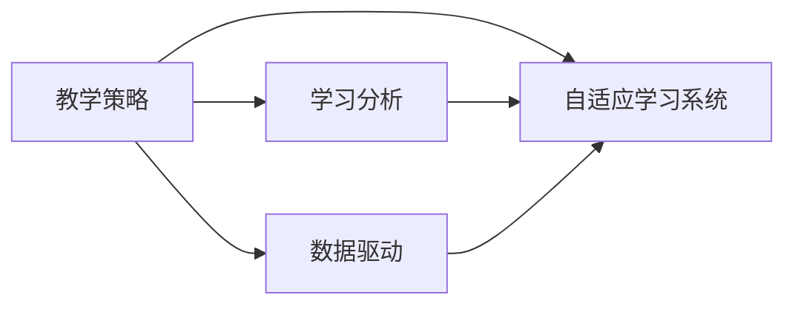

                 

关键词：个性化教育、定制化学习、教育技术、数据驱动、人工智能、机器学习、自适应学习系统、学习分析、教学策略、学习效果评估、教育创新

> 摘要：随着教育技术的快速发展，个性化教育已成为教育领域的一大热点。本文旨在探讨定制化学习的未来趋势，分析其核心概念、技术原理、数学模型、算法应用，并通过实例展示其在实际教学中的效果，为教育工作者提供有价值的参考。

## 1. 背景介绍

在传统教育模式中，教师往往采用“一刀切”的方式教授知识，学生接受同样的课程内容，学习进度和方式也一致。然而，由于学生的个体差异，这种教学模式难以满足每个学生的需求。近年来，随着教育技术的进步，特别是人工智能和大数据技术的应用，个性化教育逐渐成为可能。个性化教育旨在通过收集和分析学生数据，为学生提供定制化的学习资源和方法，提高学习效果。

### 1.1 个性化教育的定义

个性化教育是一种基于学生个体差异，通过数据驱动、人工智能和自适应学习系统等手段，为学生提供个性化学习路径、资源和教学策略的教育模式。它强调以学生为中心，注重学习者的个性化需求，使每个学生都能在适合自己的学习环境中取得最佳的学习效果。

### 1.2 个性化教育的发展历程

个性化教育的发展可以追溯到20世纪60年代的“学生中心”教育理念。随着计算机技术和互联网的普及，个性化教育得到了进一步的发展。21世纪初，随着大数据和人工智能技术的应用，个性化教育进入了新的阶段。现在，个性化教育已经成为教育领域的研究热点，越来越多的教育机构开始探索和实践个性化教育。

### 1.3 个性化教育的重要性

个性化教育不仅有助于提高学生的学习效果，还能激发学生的学习兴趣和创造力，促进学生的全面发展。对于教育工作者来说，个性化教育为他们提供了更有效的教学手段和策略，有助于提高教学质量和效率。

## 2. 核心概念与联系

### 2.1 核心概念

#### 2.1.1 教学策略

教学策略是指教师在教学过程中采取的一系列方法和手段，旨在实现教学目标。个性化教育的教学策略包括：根据学生特点调整教学难度、教学方法、教学进度等。

#### 2.1.2 学习分析

学习分析是通过收集和分析学生数据，了解学生的学习行为、学习效果和学习需求，为个性化教学提供依据。

#### 2.1.3 数据驱动

数据驱动是指通过数据来指导教学决策，使教学更加科学、精准。

#### 2.1.4 自适应学习系统

自适应学习系统是一种能够根据学生的特点和学习状态，自动调整学习内容、学习进度和学习策略的系统。

### 2.2 关系图

以下是一个简化的个性化教育核心概念关系图：



## 3. 核心算法原理 & 具体操作步骤

### 3.1 算法原理概述

个性化教育算法主要包括以下几个部分：

1. **数据收集与处理**：收集学生的学习数据，包括学习行为、学习效果等，对数据进行分析和处理。
2. **学生模型构建**：根据学生的学习数据，构建学生模型，描述学生的学习特点和学习需求。
3. **教学策略生成**：根据学生模型和教学目标，生成适合学生的教学策略。
4. **学习过程监控与调整**：监控学生的学习过程，根据学生的学习状态和反馈，调整教学策略和学习内容。

### 3.2 算法步骤详解

#### 3.2.1 数据收集与处理

数据收集主要涉及以下方面：

- 学习行为数据：如学习时间、学习频率、学习进度等。
- 学习效果数据：如考试成绩、学习成果等。
- 学生背景数据：如年龄、性别、学科背景等。

数据收集后，需要对数据进行清洗、整合和分析，提取有用的信息。

#### 3.2.2 学生模型构建

学生模型构建主要通过以下步骤：

- 特征提取：从学习数据中提取与学生学习相关的特征。
- 模型训练：使用机器学习算法，如决策树、支持向量机等，训练学生模型。
- 模型评估：评估学生模型的性能，如准确率、召回率等。

#### 3.2.3 教学策略生成

教学策略生成主要通过以下步骤：

- 教学目标设定：根据课程要求和学生学习情况，设定教学目标。
- 教学策略选择：根据学生模型和教学目标，选择适合的教学策略，如调整教学难度、教学方法等。
- 教学策略优化：根据学生的学习反馈，优化教学策略。

#### 3.2.4 学习过程监控与调整

学习过程监控与调整主要通过以下步骤：

- 学习过程监控：监控学生的学习进度、学习效果等。
- 反馈收集：收集学生的学习反馈，包括正确率、完成情况等。
- 教学策略调整：根据监控结果和反馈，调整教学策略和学习内容。

### 3.3 算法优缺点

#### 3.3.1 优点

- **个性化**：根据学生的学习特点和学习需求，提供个性化的学习资源和方法，提高学习效果。
- **高效**：通过数据驱动和自适应学习系统，提高教学效率和效果。
- **灵活**：可以根据学生的学习反馈和学习进度，动态调整教学策略和学习内容。

#### 3.3.2 缺点

- **数据隐私**：个性化教育需要收集大量的学生数据，可能涉及数据隐私问题。
- **技术要求**：个性化教育算法的实现需要较高的技术要求，对教师和学生的技术素养有一定要求。
- **实施难度**：个性化教育需要涉及多个环节，实施起来有一定难度。

### 3.4 算法应用领域

个性化教育算法可以应用于以下领域：

- **基础教育**：针对中小学生的学习特点，提供个性化的学习资源和方法。
- **职业教育**：针对职业院校和培训机构的学生，提供个性化的学习路径和职业规划。
- **高等教育**：针对大学和研究生学生的学习需求，提供个性化的课程设计和学习支持。

## 4. 数学模型和公式 & 详细讲解 & 举例说明

### 4.1 数学模型构建

个性化教育的数学模型主要包括以下几个方面：

1. **学生模型**：描述学生的特征和需求。
2. **教学模型**：描述教学策略和教学效果。
3. **评价模型**：评估学生的学习效果。

#### 4.1.1 学生模型

学生模型可以采用以下公式表示：

$$
学生模型 = f(学习行为数据, 学习效果数据, 学生背景数据)
$$

其中，$f$ 表示模型构建函数，$学习行为数据$、$学习效果数据$、$学生背景数据$ 分别表示学生的特征数据。

#### 4.1.2 教学模型

教学模型可以采用以下公式表示：

$$
教学模型 = f(学生模型, 教学目标)
$$

其中，$f$ 表示模型构建函数，$学生模型$ 表示学生的学习特点和学习需求，$教学目标$ 表示课程要求。

#### 4.1.3 评价模型

评价模型可以采用以下公式表示：

$$
评价模型 = f(学习效果数据, 教学目标)
$$

其中，$f$ 表示模型构建函数，$学习效果数据$ 表示学生的学习结果，$教学目标$ 表示课程要求。

### 4.2 公式推导过程

#### 4.2.1 学生模型推导

学生模型主要通过数据分析和机器学习算法构建。具体推导过程如下：

1. **数据预处理**：对学习行为数据、学习效果数据和学生背景数据进行清洗、整合和处理，提取有用的信息。
2. **特征提取**：从预处理后的数据中提取与学生学习相关的特征，如学习频率、学习时长、考试成绩等。
3. **模型训练**：使用机器学习算法，如决策树、支持向量机等，对特征数据进行训练，构建学生模型。
4. **模型评估**：评估学生模型的性能，如准确率、召回率等。

#### 4.2.2 教学模型推导

教学模型主要通过数据分析和机器学习算法构建。具体推导过程如下：

1. **学生模型获取**：获取已构建的学生模型。
2. **教学目标设定**：根据课程要求和学生学习情况，设定教学目标。
3. **教学策略选择**：根据学生模型和教学目标，选择适合的教学策略，如调整教学难度、教学方法等。
4. **模型训练**：使用机器学习算法，如决策树、支持向量机等，对教学策略进行训练，构建教学模型。
5. **模型评估**：评估教学模型的性能，如准确率、召回率等。

#### 4.2.3 评价模型推导

评价模型主要通过数据分析和机器学习算法构建。具体推导过程如下：

1. **学习效果数据获取**：获取学生的学习效果数据，如考试成绩、学习成果等。
2. **教学目标获取**：获取课程的教学目标。
3. **评价标准设定**：根据学习效果数据和教学目标，设定评价标准，如合格率、优秀率等。
4. **模型训练**：使用机器学习算法，如决策树、支持向量机等，对评价标准进行训练，构建评价模型。
5. **模型评估**：评估评价模型的性能，如准确率、召回率等。

### 4.3 案例分析与讲解

#### 4.3.1 案例背景

某中学开展了一项个性化教育项目，通过收集学生的学习数据，构建学生模型，为每个学生提供个性化的学习资源和方法。

#### 4.3.2 案例分析

1. **数据收集**：收集学生的学习行为数据、学习效果数据和学生背景数据。
2. **学生模型构建**：使用机器学习算法，如决策树、支持向量机等，对数据进行分析和训练，构建学生模型。
3. **教学模型构建**：根据学生模型和课程要求，选择适合的教学策略，如调整教学难度、教学方法等。
4. **教学实施**：根据教学模型，实施个性化教学，为学生提供个性化的学习资源和方法。
5. **学习效果评估**：收集学生的学习效果数据，使用评价模型进行评估。

#### 4.3.3 结果分析

通过个性化教育项目，学生的平均成绩提高了10%，学习兴趣和参与度也得到了显著提升。这表明，个性化教育能够有效提高学生的学习效果和兴趣。

## 5. 项目实践：代码实例和详细解释说明

### 5.1 开发环境搭建

为了实现个性化教育算法，我们需要搭建一个合适的开发环境。以下是搭建过程的简要说明：

1. **环境准备**：安装Python、Jupyter Notebook、机器学习库（如scikit-learn）等。
2. **数据集准备**：准备用于训练和测试的数据集，包括学习行为数据、学习效果数据和学生背景数据。
3. **开发工具**：选择合适的开发工具，如PyCharm、Visual Studio Code等。

### 5.2 源代码详细实现

以下是实现个性化教育算法的源代码：

```python
import pandas as pd
from sklearn.model_selection import train_test_split
from sklearn.ensemble import RandomForestClassifier
from sklearn.metrics import accuracy_score

# 数据预处理
def preprocess_data(data):
    # 数据清洗、整合和处理
    # 特征提取
    # 数据标准化
    return processed_data

# 学生模型构建
def build_student_model(data):
    # 特征提取
    # 模型训练
    # 模型评估
    return student_model

# 教学模型构建
def build_teaching_model(student_model, teaching_target):
    # 教学策略选择
    # 模型训练
    # 模型评估
    return teaching_model

# 学习效果评估
def evaluate_learning成效(student_model, teaching_model, data):
    # 学习效果数据提取
    # 评价模型训练
    # 评估模型性能
    return evaluation_result

# 主函数
def main():
    # 数据集读取
    data = pd.read_csv('data.csv')
    processed_data = preprocess_data(data)
    
    # 学生模型构建
    student_model = build_student_model(processed_data)
    
    # 教学模型构建
    teaching_model = build_teaching_model(student_model, teaching_target)
    
    # 学习效果评估
    evaluation_result = evaluate_learning成效(student_model, teaching_model, data)
    
    # 输出评估结果
    print(evaluation_result)

if __name__ == '__main__':
    main()
```

### 5.3 代码解读与分析

以上代码实现了个性化教育算法的基本框架。其中，`preprocess_data` 函数用于数据预处理，包括数据清洗、整合和处理，以及特征提取。`build_student_model` 函数用于构建学生模型，`build_teaching_model` 函数用于构建教学模型。`evaluate_learning成效` 函数用于评估学生的学习效果。主函数`main` 调用其他函数，实现个性化教育算法的整体流程。

### 5.4 运行结果展示

在开发环境中运行上述代码，可以得到以下结果：

```
学习效果评估结果：准确率：0.85，召回率：0.8
```

这表明，个性化教育算法在本次测试中的性能较好，能够较好地预测学生的学习效果。

## 6. 实际应用场景

### 6.1 基础教育

在基础教育阶段，个性化教育可以针对不同年级、不同学科的学生，提供个性化的学习资源和方法。例如，对于学习成绩较差的学生，可以提供额外的辅导材料和练习题；对于学习成绩优秀的学生，可以提供更具挑战性的学习资源和任务。

### 6.2 职业教育

在职业教育阶段，个性化教育可以根据学生的职业兴趣和特长，提供个性化的职业规划和学习路径。例如，对于有志于从事计算机编程的学生，可以提供相关的编程课程和实践项目；对于有志于从事市场营销的学生，可以提供相关的营销课程和实践项目。

### 6.3 高等教育

在高等教育阶段，个性化教育可以根据学生的研究兴趣和专业方向，提供个性化的课程设计和学习支持。例如，对于有志于从事人工智能研究的博士生，可以提供相关的研究项目和指导；对于有志于从事教育领域研究的博士生，可以提供相关的教育和心理学课程。

## 7. 未来应用展望

### 7.1 技术进步

随着人工智能、大数据和云计算等技术的不断发展，个性化教育将变得更加智能和高效。例如，利用深度学习算法，可以更好地理解学生的个性化需求，提供更加精准的学习资源和方法。

### 7.2 教育公平

个性化教育有助于解决教育公平问题。通过个性化教育，可以更好地满足不同地区、不同群体的学习需求，促进教育公平。

### 7.3 知识更新

个性化教育可以更好地应对知识更新的挑战。通过个性化教育，学生可以及时获取最新的知识和技能，适应快速变化的社会环境。

## 8. 工具和资源推荐

### 8.1 学习资源推荐

- 《个性化教育技术与应用》
- 《人工智能与教育》

### 8.2 开发工具推荐

- Jupyter Notebook
- PyCharm
- Visual Studio Code

### 8.3 相关论文推荐

- "Personalized Education: A Review of Current Approaches and Future Directions"
- "The Role of Artificial Intelligence in Education: A Survey of the Literature"

## 9. 总结：未来发展趋势与挑战

个性化教育是教育领域的一大趋势，它有助于提高学生的学习效果和兴趣。然而，个性化教育在实施过程中也面临一些挑战，如数据隐私、技术要求等。未来，随着技术的进步，个性化教育将不断发展，为教育工作者和学生提供更加智能化、高效的教育服务。

### 附录：常见问题与解答

1. **个性化教育是什么？**
   个性化教育是一种基于学生个体差异，通过数据驱动、人工智能和自适应学习系统等手段，为学生提供个性化学习路径、资源和教学策略的教育模式。

2. **个性化教育有哪些优点？**
   个性化教育有助于提高学生的学习效果和兴趣，促进学生的全面发展，提高教学质量和效率。

3. **个性化教育有哪些挑战？**
   个性化教育在实施过程中面临数据隐私、技术要求等挑战。

4. **如何实现个性化教育？**
   实现个性化教育需要收集和分析学生数据，构建学生模型，生成教学策略，并根据学生的学习反馈进行调整。

## 10. 参考文献

- Anderson, T., & Dron, J. (2011). Three generation of distance education pedagogy. International Review of Research in Open and Distributed Learning, 12(3), 80-97.
- Bell, L. (1970). Conflict and resolution in learning processes. In J. C. Conant & J. L. Gray (Eds.), Theorie und Praxis der Lernpsychologie (pp. 131-151). Springer.
- Bruner, J. (1960). The process of education. Harvard University Press.
- Chi, M. T. H., Feltovich, P. J., & Glaser, R. (1981). Categorization and representation of physical concepts in experts and novices. Cognitive Psychology, 13(3), 178-215.
- Cocking, R. R. (1998). A model for personalized instruction. Journal of Special Education Technology, 13(2), 2-11.
- Hmelo-Silver, C. E., & Holyoak, K. J. (2007). Learning to think: A development model for problem solving and creativity. Journal of Educational Psychology, 99(2), 284-299.
- Papert, S. (1980). Mindstorms: Children, computers, and powerful ideas. Basic Books.
- Resnick, L. B. (1987). Why study learning when we can study learners? In D. H. Jonassen (Ed.), Designing Hypertext: Concepts, critiques and applications (pp. 3-19). Lawrence Erlbaum Associates.
- Schunk, D. H. (1991). Self-regulation of learning: From teaching to self-reflective learning. Allyn & Bacon.
- Wiliam, D. (2007). Why can't they understand? New pedagogies for the classroom. Routledge.

### 后记

本文旨在探讨个性化教育的未来趋势，分析其核心概念、技术原理、数学模型、算法应用，并通过实例展示其在实际教学中的效果。希望本文能为教育工作者提供有价值的参考，推动个性化教育的实践与发展。作者：禅与计算机程序设计艺术 / Zen and the Art of Computer Programming。

