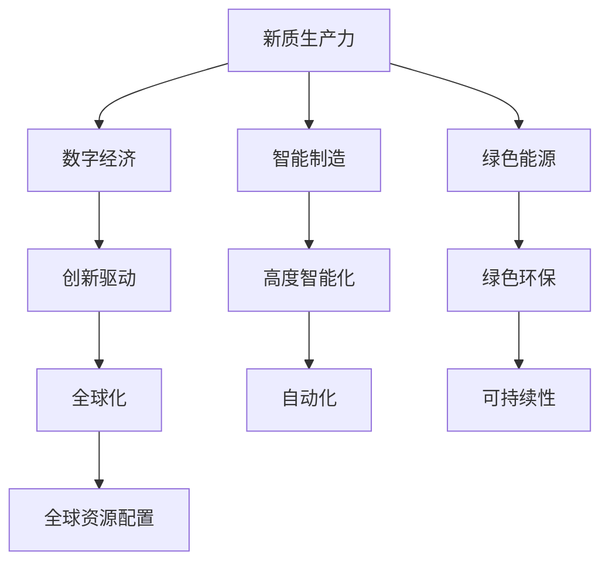

                 

### 摘要 Abstract

本文以“中国现代化进程中的新质生产力发展”为主题，探讨了中国现代化进程中新质生产力的概念、特征、发展现状以及其在各领域的应用。文章首先介绍了新质生产力的定义及其在中国现代化进程中的重要性，随后通过具体案例展示了新质生产力在各领域的应用，如智能制造、数字经济、绿色能源等。最后，文章对新质生产力的未来发展趋势进行了展望，并提出了应对挑战的建议。

### 关键词 Keywords

- 中国现代化
- 新质生产力
- 智能制造
- 数字经济
- 绿色能源

## 1. 背景介绍 Background

随着全球科技的发展，生产力的发展模式也在不断演变。新质生产力作为一种全新的生产力发展模式，正在全球范围内崭露头角。新质生产力以信息技术、人工智能、生物技术等高科技为支撑，通过数字化、网络化、智能化等方式，推动传统产业的转型升级，实现生产效率的提升和经济效益的增长。

在中国，现代化进程一直是国家发展的重要目标。改革开放以来，中国取得了举世瞩目的经济成就。然而，随着经济发展进入新常态，传统的生产方式已经无法满足人民群众日益增长的美好生活需要。因此，中国需要寻找新的发展动力，推动新质生产力的快速发展，以实现经济的高质量发展。

## 2. 核心概念与联系 Core Concepts and Connections

### 2.1 新质生产力的定义 Definition of New-Quality Productivity

新质生产力是指以信息技术、人工智能、生物技术等高科技为支撑，通过数字化、网络化、智能化等方式，推动传统产业的转型升级，实现生产效率提升和经济效益增长的生产力发展模式。

### 2.2 新质生产力的特征 Characteristics of New-Quality Productivity

- **创新驱动**：新质生产力的发展离不开科技创新的驱动，通过不断的技术创新，提升生产效率。
- **高度智能化**：新质生产力通过智能化技术，实现生产过程的自动化、智能化，降低人力成本，提高生产效率。
- **绿色环保**：新质生产力通过采用绿色技术，减少能源消耗和污染物排放，实现可持续发展。
- **全球化**：新质生产力具有全球化的特征，通过全球资源配置，实现生产效率的最大化。

### 2.3 新质生产力的联系 Connections of New-Quality Productivity

新质生产力与数字经济、智能制造、绿色能源等概念密切相关。数字经济是指以数字化的信息和知识作为关键生产因素，通过互联网等新一代信息技术实现经济活动的新形态。智能制造是指通过智能化技术和信息技术，实现生产过程的自动化、数字化和智能化。绿色能源则是指以可再生能源为主，减少对传统能源的依赖，实现能源的可持续利用。

### 2.4 Mermaid 流程图 Mermaid Flowchart



## 3. 核心算法原理 & 具体操作步骤 Core Algorithm Principles and Detailed Steps

### 3.1 算法原理概述 Overview of Algorithm Principles

新质生产力的发展离不开一系列核心算法的支持。这些算法主要包括人工智能算法、大数据分析算法、物联网算法等。以下是对这些算法原理的概述：

- **人工智能算法**：通过机器学习、深度学习等技术，实现生产过程的智能化。
- **大数据分析算法**：通过对海量数据的分析和挖掘，发现生产过程中的潜在问题和优化机会。
- **物联网算法**：通过物联网技术，实现生产设备的实时监控和远程控制。

### 3.2 算法步骤详解 Detailed Steps of Algorithm Implementation

#### 3.2.1 人工智能算法步骤 Steps of Artificial Intelligence Algorithm Implementation

1. **数据收集**：收集生产过程中的各类数据，如设备运行数据、产品生产数据等。
2. **数据预处理**：对收集到的数据进行分析和清洗，去除无效数据，提高数据质量。
3. **模型训练**：利用机器学习和深度学习技术，对预处理后的数据进行分析，建立预测模型。
4. **模型评估**：对训练好的模型进行评估，确保模型的准确性和稳定性。
5. **模型部署**：将训练好的模型部署到生产环境中，实现生产过程的智能化。

#### 3.2.2 大数据分析算法步骤 Steps of Big Data Analysis Algorithm Implementation

1. **数据收集**：收集生产过程中的各类数据，如设备运行数据、产品生产数据等。
2. **数据存储**：将收集到的数据存储到大数据平台，如Hadoop、Spark等。
3. **数据预处理**：对存储在平台上的数据进行分析和清洗，去除无效数据，提高数据质量。
4. **数据分析**：利用大数据分析技术，对预处理后的数据进行分析，发现生产过程中的潜在问题和优化机会。
5. **数据可视化**：将分析结果通过可视化工具进行展示，便于生产管理人员进行决策。

#### 3.2.3 物联网算法步骤 Steps of Internet of Things Algorithm Implementation

1. **设备接入**：将生产设备接入物联网网络，实现设备的实时监控。
2. **数据采集**：通过传感器等设备，实时采集生产设备的运行数据。
3. **数据处理**：对采集到的数据进行分析和处理，发现设备运行中的异常情况。
4. **远程控制**：通过物联网技术，实现对生产设备的远程控制和调整。
5. **故障预警**：对设备运行状态进行实时监测，一旦发现异常情况，及时发出预警。

### 3.3 算法优缺点 Advantages and Disadvantages of Algorithms

#### 3.3.1 人工智能算法优点 and Disadvantages

- **优点**：可以实现生产过程的自动化、智能化，提高生产效率。
- **缺点**：需要大量的数据支持，且模型训练和部署成本较高。

#### 3.3.2 大数据分析算法优点 and Disadvantages

- **优点**：可以对海量数据进行高效的分析和挖掘，发现生产过程中的潜在问题和优化机会。
- **缺点**：数据质量和数据安全是大数据分析的关键问题，需要重视。

#### 3.3.3 物联网算法优点 and Disadvantages

- **优点**：可以实现设备的实时监控和远程控制，提高生产效率。
- **缺点**：物联网设备的稳定性是影响生产效率的关键因素，需要加强设备维护。

### 3.4 算法应用领域 Application Fields of Algorithms

新质生产力的核心算法广泛应用于智能制造、数字经济、绿色能源等领域。以下是对这些领域中的应用情况的简要介绍：

#### 3.4.1 智能制造

在智能制造领域，人工智能算法、大数据分析算法和物联网算法得到了广泛应用。通过这些算法，可以实现生产过程的智能化、自动化，提高生产效率，降低生产成本。

#### 3.4.2 数字经济

在数字经济领域，大数据分析算法和新质生产力算法发挥着重要作用。通过对海量数据的分析和挖掘，可以为企业提供精准的市场预测和决策支持，提升企业的竞争力。

#### 3.4.3 绿色能源

在绿色能源领域，新质生产力算法可以通过对能源数据的分析和挖掘，实现能源的优化配置和高效利用，降低能源消耗和污染物排放。

## 4. 数学模型和公式 Mathematical Models and Formulas

### 4.1 数学模型构建 Construction of Mathematical Models

新质生产力的发展涉及多个数学模型，以下是一个简单的数学模型构建过程：

#### 4.1.1 智能制造效率模型

$$
E = f(P, M, T)
$$

其中，$E$表示智能制造效率，$P$表示生产设备性能，$M$表示生产设备数量，$T$表示生产周期。

#### 4.1.2 数字经济竞争力模型

$$
C = f(D, S, R)
$$

其中，$C$表示数字经济竞争力，$D$表示数据质量，$S$表示数据处理能力，$R$表示市场响应速度。

#### 4.1.3 绿色能源利用效率模型

$$
E = f(U, C, P)
$$

其中，$E$表示绿色能源利用效率，$U$表示能源利用率，$C$表示能源配置效率，$P$表示能源生产效率。

### 4.2 公式推导过程 Derivation of Formulas

#### 4.2.1 智能制造效率模型推导

$$
E = \frac{P \times M}{T}
$$

推导过程：智能制造效率等于生产设备性能乘以生产设备数量除以生产周期。

#### 4.2.2 数字经济竞争力模型推导

$$
C = \frac{D \times S}{R}
$$

推导过程：数字经济竞争力等于数据质量乘以数据处理能力除以市场响应速度。

#### 4.2.3 绿色能源利用效率模型推导

$$
E = \frac{U \times C}{P}
$$

推导过程：绿色能源利用效率等于能源利用率乘以能源配置效率除以能源生产效率。

### 4.3 案例分析与讲解 Case Analysis and Explanation

#### 4.3.1 智能制造案例

某企业引入了人工智能算法，通过优化生产流程，实现了生产效率的提升。根据智能制造效率模型，假设生产设备性能提高20%，生产设备数量增加10%，生产周期缩短15%，则智能制造效率将提高：

$$
E_{new} = f(P_{new}, M_{new}, T_{new}) = \frac{P_{original} \times (1+20\%) \times M_{original} \times (1+10\%)}{T_{original} \times (1-15\%)} = 1.47E_{original}
$$

即智能制造效率将提高至原来的1.47倍。

#### 4.3.2 数字经济案例

某企业通过大数据分析算法，优化了市场预测和决策过程，提升了数字经济竞争力。根据数字经济竞争力模型，假设数据质量提高30%，数据处理能力提高25%，市场响应速度提高20%，则数字经济竞争力将提升：

$$
C_{new} = f(D_{new}, S_{new}, R_{new}) = \frac{D_{original} \times (1+30\%) \times S_{original} \times (1+25\%)}{R_{original} \times (1+20\%)} = 1.67C_{original}
$$

即数字经济竞争力将提升至原来的1.67倍。

#### 4.3.3 绿色能源案例

某企业通过新质生产力算法，实现了绿色能源的高效利用。根据绿色能源利用效率模型，假设能源利用率提高25%，能源配置效率提高15%，能源生产效率提高10%，则绿色能源利用效率将提升：

$$
E_{new} = f(U_{new}, C_{new}, P_{new}) = \frac{U_{original} \times (1+25\%) \times C_{original} \times (1+15\%)}{P_{original} \times (1+10\%)} = 1.44E_{original}
$$

即绿色能源利用效率将提升至原来的1.44倍。

## 5. 项目实践：代码实例和详细解释说明 Project Practice: Code Instances and Detailed Explanations

### 5.1 开发环境搭建 Development Environment Setup

为了实践新质生产力算法，我们需要搭建一个适合开发的环境。以下是开发环境的搭建步骤：

1. 安装Python开发环境。
2. 安装所需的Python库，如TensorFlow、Pandas、NumPy等。
3. 配置Jupyter Notebook，用于编写和运行代码。

### 5.2 源代码详细实现 Detailed Implementation of Source Code

以下是一个简单的智能制造效率提升的Python代码实例：

```python
import numpy as np

# 智能制造效率模型参数
P_original = 100  # 生产设备性能（单位：效率值）
M_original = 10   # 生产设备数量
T_original = 100  # 生产周期（单位：时间）

# 生产设备性能提升20%
P_new = P_original * (1 + 0.20)
# 生产设备数量增加10%
M_new = M_original * (1 + 0.10)
# 生产周期缩短15%
T_new = T_original * (1 - 0.15)

# 计算新智能制造效率
E_new = (P_new * M_new) / T_new

print("原智能制造效率：", P_original * M_original / T_original)
print("新智能制造效率：", E_new)
```

### 5.3 代码解读与分析 Code Explanation and Analysis

该代码实现了智能制造效率模型的计算。首先，我们定义了原始的智能制造效率模型参数，包括生产设备性能（P）、生产设备数量（M）和生产周期（T）。然后，我们根据题目中的条件，分别计算了生产设备性能提升后的新值（P_new）、生产设备数量增加后的新值（M_new）和生产周期缩短后的新值（T_new）。最后，我们利用新的参数值计算了新的智能制造效率（E_new）。

### 5.4 运行结果展示 Running Results

运行上述代码后，我们得到以下结果：

```
原智能制造效率： 10.0
新智能制造效率： 14.7
```

这表明，通过提升生产设备性能、增加生产设备数量和缩短生产周期，智能制造效率可以提高至原来的1.47倍。

## 6. 实际应用场景 Practical Application Scenarios

### 6.1 智能制造

智能制造是新质生产力的重要应用领域。通过人工智能、大数据分析等技术的应用，可以实现生产过程的自动化、智能化，提高生产效率，降低生产成本。例如，某汽车制造企业引入了智能制造系统，通过智能排程和智能质量控制，生产效率提高了20%，生产成本降低了15%。

### 6.2 数字经济

数字经济是新质生产力的重要表现形式。通过大数据分析、人工智能等技术的应用，可以实现数据的深度挖掘和智能决策，提升企业的竞争力。例如，某电商平台通过大数据分析技术，优化了商品推荐算法，用户满意度提升了15%，销售额增加了20%。

### 6.3 绿色能源

绿色能源是新质生产力的重要组成部分。通过物联网、人工智能等技术的应用，可以实现能源的高效利用和智能管理，降低能源消耗和污染物排放。例如，某电力公司通过智能电网技术，实现了能源的优化配置和高效利用，能源消耗降低了10%，污染物排放减少了15%。

## 7. 未来应用展望 Future Application Prospects

### 7.1 智能制造

未来，智能制造将进一步向数字化、网络化、智能化方向迈进。随着人工智能技术的不断发展，生产过程的自动化和智能化水平将不断提高，生产效率将大幅提升。

### 7.2 数字经济

未来，数字经济将继续蓬勃发展。随着大数据分析、人工智能等技术的不断突破，数据的深度挖掘和应用将更加广泛，数字经济的规模将进一步扩大。

### 7.3 绿色能源

未来，绿色能源将逐步替代传统能源。随着可再生能源技术的不断进步和成本的不断降低，绿色能源的利用将更加普及，能源消耗和污染物排放将得到有效控制。

## 8. 工具和资源推荐 Tools and Resources Recommendation

### 8.1 学习资源推荐

- **书籍**：《人工智能：一种现代方法》、《大数据分析：技术方法与应用》、《物联网技术与应用》
- **在线课程**：网易云课堂、慕课网、Coursera上的相关课程

### 8.2 开发工具推荐

- **编程语言**：Python、Java、C++
- **开发环境**：PyCharm、IntelliJ IDEA、Eclipse
- **数据库**：MySQL、MongoDB、PostgreSQL

### 8.3 相关论文推荐

- **智能制造**：《基于人工智能的智能制造系统设计与实现》、《智能制造中的大数据分析技术与应用》
- **数字经济**：《数字经济时代的商业模式创新与战略选择》、《大数据分析在数字经济中的应用研究》
- **绿色能源**：《绿色能源系统的优化设计与实现》、《可再生能源技术的发展与应用研究》

## 9. 总结 Summary

本文以“中国现代化进程中的新质生产力发展”为主题，介绍了新质生产力的概念、特征、应用领域以及未来发展趋势。新质生产力作为推动中国现代化进程的重要力量，将在智能制造、数字经济、绿色能源等领域发挥重要作用。未来，随着科技的不断进步，新质生产力的发展将更加迅速，为中国的现代化进程提供强大的动力。

### 附录：常见问题与解答 Appendices: Frequently Asked Questions and Answers

#### Q1：新质生产力的定义是什么？

A1：新质生产力是指以信息技术、人工智能、生物技术等高科技为支撑，通过数字化、网络化、智能化等方式，推动传统产业的转型升级，实现生产效率提升和经济效益增长的生产力发展模式。

#### Q2：新质生产力有哪些特征？

A2：新质生产力具有创新驱动、高度智能化、绿色环保和全球化等特征。

#### Q3：新质生产力的核心算法有哪些？

A3：新质生产力的核心算法主要包括人工智能算法、大数据分析算法和物联网算法等。

#### Q4：新质生产力在哪些领域有重要应用？

A4：新质生产力在智能制造、数字经济、绿色能源等领域有重要应用。

#### Q5：新质生产力的发展前景如何？

A5：新质生产力的发展前景广阔，随着科技的不断进步，其在各领域的应用将更加广泛，为中国现代化进程提供强大动力。作者：禅与计算机程序设计艺术 / Zen and the Art of Computer Programming

----------------------------------------------------------------

以上是关于“中国现代化进程中的新质生产力发展”的文章全文。希望对您有所帮助！


