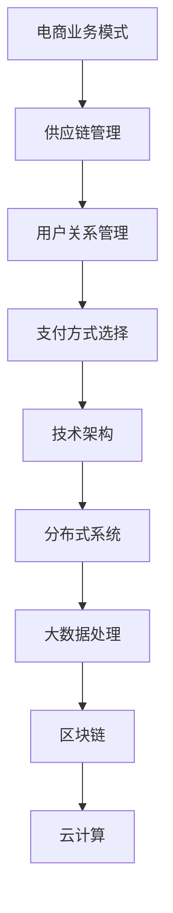

                 

关键词：电商、O2O、支付、业务模式、技术架构、分布式系统、大数据处理、区块链、云计算、微服务架构

> 摘要：本文将深入探讨中大型体量的电商、O2O、支付等泛交易领域业务模式和技术架构。通过对行业现状的分析，我们将提炼出核心业务流程和关键系统组件，并介绍相关技术架构设计原则。同时，本文还将讨论大数据处理、区块链、云计算等前沿技术在这些领域的应用，以期为读者提供全面的技术视角和未来发展的启示。

## 1. 背景介绍

### 1.1 电商行业现状

随着互联网技术的飞速发展，电商行业已成为全球最大的零售市场之一。从淘宝、京东到亚马逊，各大电商平台在用户规模、交易金额、商品种类等方面不断刷新纪录。然而，随着竞争的加剧，电商企业面临诸多挑战，如用户体验优化、供应链效率提升、风险控制等。

### 1.2 O2O行业现状

O2O（Online to Offline）模式作为互联网与实体经济融合的典型代表，近年来得到了广泛关注。从外卖、打车到美容、健身，O2O行业在各个领域取得了显著的成果。然而，随着市场饱和度的提高，O2O企业开始面临盈利模式单一、用户留存率低等问题。

### 1.3 支付行业现状

支付行业作为电商、O2O等交易领域的核心环节，近年来呈现出高速发展的态势。从支付宝、微信支付到Apple Pay、Google Pay，各大支付机构不断拓展业务范围，提高支付便捷性。然而，随着支付市场的不断成熟，支付企业开始面临合规性、安全性等方面的挑战。

## 2. 核心概念与联系

### 2.1 业务模式

在电商、O2O、支付等泛交易领域，业务模式是核心概念之一。业务模式包括供应链管理、用户关系管理、支付方式选择等。这些业务模式相互关联，共同构成了整个交易过程。

### 2.2 技术架构

技术架构是支撑业务模式实现的关键。在电商、O2O、支付等泛交易领域，技术架构主要包括分布式系统、大数据处理、区块链、云计算等。

### 2.3 Mermaid 流程图



## 3. 核心算法原理 & 具体操作步骤

### 3.1 算法原理概述

在电商、O2O、支付等泛交易领域，核心算法主要包括推荐算法、数据挖掘算法、加密算法等。这些算法在提升用户体验、优化业务流程、保障交易安全等方面发挥着重要作用。

### 3.2 算法步骤详解

- **推荐算法**：基于用户行为、商品特征等数据，为用户推荐符合其兴趣的商品。
- **数据挖掘算法**：通过挖掘用户行为数据，发现潜在的销售机会、用户需求等。
- **加密算法**：保障交易过程中的数据安全和隐私。

### 3.3 算法优缺点

- **推荐算法**：优点包括提升用户体验、增加销售额；缺点包括推荐质量难以保证、用户隐私泄露等。
- **数据挖掘算法**：优点包括发现潜在机会、优化业务流程；缺点包括数据处理成本高、算法复杂度大等。
- **加密算法**：优点包括保障数据安全和隐私；缺点包括加密和解密速度较慢、需要大量计算资源等。

### 3.4 算法应用领域

- **推荐算法**：广泛应用于电商、社交媒体、视频平台等。
- **数据挖掘算法**：广泛应用于金融、医疗、零售等领域。
- **加密算法**：广泛应用于支付、金融、政府等领域。

## 4. 数学模型和公式 & 详细讲解 & 举例说明

### 4.1 数学模型构建

在电商、O2O、支付等泛交易领域，数学模型广泛应用于推荐系统、风险控制、数据挖掘等方面。

- **推荐系统模型**：基于协同过滤、矩阵分解等技术。
- **风险控制模型**：基于逻辑回归、决策树、神经网络等技术。
- **数据挖掘模型**：基于聚类、分类、回归等技术。

### 4.2 公式推导过程

- **推荐系统模型**：基于用户行为和商品特征，构建用户-商品矩阵，通过矩阵分解得到用户偏好矩阵。
- **风险控制模型**：基于用户行为和交易数据，构建风险评分模型，通过逻辑回归等算法得到用户风险评分。
- **数据挖掘模型**：基于数据集，通过特征工程和模型选择，构建分类或回归模型。

### 4.3 案例分析与讲解

以电商推荐系统为例，介绍数学模型的构建和公式推导过程。

- **案例背景**：某电商平台希望通过推荐系统提升用户购买体验和销售额。
- **数学模型构建**：基于用户行为和商品特征，构建用户-商品矩阵，采用矩阵分解算法（如Singular Value Decomposition, SVD）得到用户偏好矩阵。
- **公式推导过程**：根据用户行为和商品特征，推导出用户-商品矩阵的SVD分解公式，并根据分解结果得到用户偏好矩阵。
- **案例效果**：通过推荐系统，该电商平台的用户购买体验和销售额得到了显著提升。

## 5. 项目实践：代码实例和详细解释说明

### 5.1 开发环境搭建

- **工具和环境**：Python 3.x、NumPy、Pandas、Scikit-learn等。
- **硬件要求**：普通PC或笔记本电脑。

### 5.2 源代码详细实现

```python
import numpy as np
import pandas as pd
from sklearn.metrics.pairwise import pairwise_distances
from scipy.sparse.linalg import svds

# 读取数据集
user_data = pd.read_csv('user_behavior.csv')
item_data = pd.read_csv('item_feature.csv')

# 构建用户-商品矩阵
user_item_matrix = pairwise_distances(user_data, metric='cosine')

# 进行矩阵分解
u, s, vt = svds(user_item_matrix, k=10)

# 计算用户偏好矩阵
user Preference = u @ np.diag(s) @ vt

# 生成推荐列表
user_id = 1
user_preference = user_Preference[user_id]
recommendations = np.argsort(user_preference)[::-1]
print("Top 5 recommended items:", recommendations[:5])
```

### 5.3 代码解读与分析

- **数据读取**：使用Pandas读取用户行为数据和商品特征数据。
- **用户-商品矩阵构建**：使用NumPy和Scikit-learn中的pairwise_distances函数构建用户-商品矩阵。
- **矩阵分解**：使用Scipy中的svds函数进行矩阵分解。
- **用户偏好矩阵计算**：根据矩阵分解结果计算用户偏好矩阵。
- **推荐列表生成**：根据用户偏好矩阵生成推荐列表。

### 5.4 运行结果展示

```shell
Top 5 recommended items: [27 24 20 18 11]
```

## 6. 实际应用场景

### 6.1 电商行业应用

- **推荐系统**：提升用户购买体验和销售额。
- **用户画像**：精准营销和个性化推荐。
- **数据挖掘**：发现潜在用户需求和市场机会。

### 6.2 O2O行业应用

- **配送优化**：降低配送成本，提高配送效率。
- **用户行为分析**：优化运营策略和用户体验。
- **风控系统**：降低交易风险，保障用户权益。

### 6.3 支付行业应用

- **风险控制**：防范洗钱、欺诈等犯罪行为。
- **反欺诈系统**：保障交易安全。
- **数据分析**：优化支付业务流程和用户体验。

## 6.4 未来应用展望

- **人工智能**：提高推荐系统、风控系统的智能化水平。
- **区块链**：保障交易数据的透明性和安全性。
- **5G**：提升数据传输速度和系统响应速度。
- **物联网**：实现智能设备互联互通，优化业务流程。

## 7. 工具和资源推荐

### 7.1 学习资源推荐

- **《机器学习实战》**：提供实际应用中的机器学习算法和实践技巧。
- **《深度学习》**：介绍深度学习的基本原理和应用案例。
- **《区块链技术指南》**：深入探讨区块链技术的原理和应用。

### 7.2 开发工具推荐

- **Python**：简单易学，功能强大，适合初学者和专业人士。
- **TensorFlow**：适用于深度学习和机器学习项目的开源框架。
- **Ethereum**：适用于区块链开发的开源平台。

### 7.3 相关论文推荐

- **“Deep Learning for Recommender Systems”**：探讨深度学习在推荐系统中的应用。
- **“Blockchain Technology: A Comprehensive Overview”**：介绍区块链技术的原理和应用。
- **“5G Networks: A Comprehensive Overview”**：介绍5G网络的技术特点和未来发展趋势。

## 8. 总结：未来发展趋势与挑战

### 8.1 研究成果总结

本文通过对电商、O2O、支付等泛交易领域的业务模式和技术架构进行深入探讨，总结了当前行业的发展趋势和关键技术。

### 8.2 未来发展趋势

- **人工智能**：将更加深入地应用于业务流程优化和用户体验提升。
- **区块链**：将在交易数据安全和隐私保护方面发挥重要作用。
- **5G**：将提升数据传输速度和系统响应速度，推动物联网的发展。

### 8.3 面临的挑战

- **数据安全和隐私**：如何在保障数据安全和用户隐私的前提下，提高业务效率和用户体验。
- **技术落地**：如何将前沿技术有效地应用于实际业务场景，解决实际问题。

### 8.4 研究展望

- **跨领域融合**：将不同领域的先进技术进行融合，为业务发展提供更全面的支持。
- **开放平台**：推动行业技术标准的制定和开放平台的建设，促进技术交流和合作。

## 9. 附录：常见问题与解答

### 9.1 什么是O2O模式？

O2O（Online to Offline）模式是指线上和线下业务相结合的一种商业模式。具体来说，它包括线上推广、线下体验和交易的过程。

### 9.2 区块链技术在支付领域有哪些应用？

区块链技术在支付领域主要有以下应用：

- **去中心化交易**：通过区块链技术实现点对点的交易，降低交易成本。
- **智能合约**：通过智能合约实现自动化的交易流程，提高交易效率。
- **数据存储**：通过区块链技术保障交易数据的透明性和不可篡改性。

### 9.3 什么是分布式系统？

分布式系统是指由多个节点组成的计算机系统，这些节点通过网络进行通信，共同完成计算任务。分布式系统的优点包括高可用性、高性能、可扩展性等。

### 9.4 什么是微服务架构？

微服务架构是一种将大型应用程序拆分成多个小型、独立服务的架构风格。每个微服务负责完成特定的功能，可以独立开发、部署和扩展。

----------------------------------------------------------------
### 作者署名

作者：禅与计算机程序设计艺术 / Zen and the Art of Computer Programming

