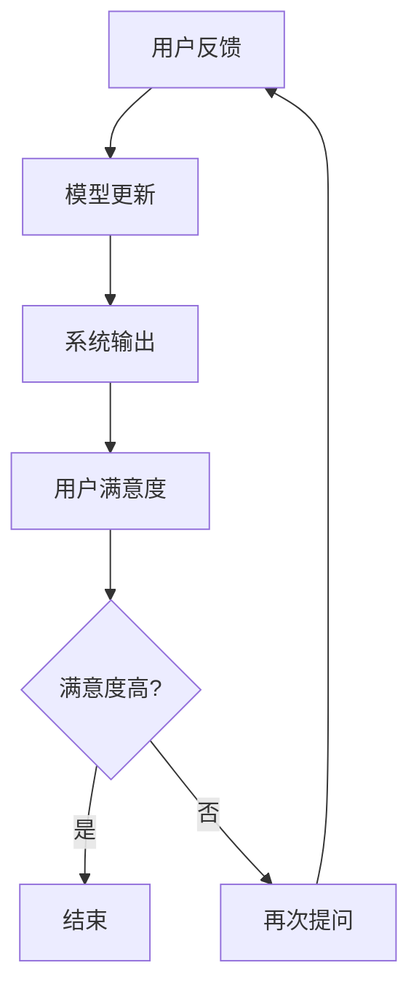

                 

关键词：主动学习，软件2.0，高效，问问题，技术博客

> 摘要：随着软件2.0时代的到来，主动学习成为提高软件效率和用户体验的关键技术。本文从背景介绍、核心概念与联系、核心算法原理、数学模型和公式、项目实践、实际应用场景、未来应用展望等多个维度，深入探讨了主动学习的原理、应用及其发展趋势与挑战。

## 1. 背景介绍

### 1.1 软件2.0时代的到来

软件2.0时代，也被称为云计算、大数据、人工智能等新兴技术驱动下的新时代。在这个时代，软件不再仅仅是一个静态的执行程序，而是逐渐变得更加智能和灵活，能够根据用户的反馈和需求动态调整自己的行为。

### 1.2 主动学习的兴起

主动学习是一种能够使软件根据用户反馈不断优化自身性能的学习方式。它通过主动询问用户对系统输出结果的满意度，从而不断调整系统的参数和模型，以实现更高的准确率和用户体验。

## 2. 核心概念与联系

### 2.1 主动学习的定义

主动学习是指在学习过程中，系统能够根据当前模型的预测结果，主动向用户提出问题，以便获取更多的信息，从而提高学习效率。

### 2.2 主动学习的优势

主动学习相比被动学习，能够在有限的样本数量下，更快地达到高准确率。它不仅提高了学习的效率，还显著提升了用户体验。

### 2.3 Mermaid 流程图

下面是一个描述主动学习流程的Mermaid流程图：



## 3. 核心算法原理 & 具体操作步骤

### 3.1 算法原理概述

主动学习算法的核心思想是：在有限的数据集中，通过智能提问，选择最有信息量的样本进行标注，从而提高模型的学习效率和准确性。

### 3.2 算法步骤详解

主动学习算法的步骤如下：

1. **初始化**：初始化模型和查询策略。
2. **预测**：使用当前模型对未标注的数据进行预测。
3. **选择样本**：根据查询策略，选择最有信息量的样本进行标注。
4. **标注**：用户对选定的样本进行标注。
5. **更新模型**：使用新标注的数据更新模型。
6. **循环**：重复步骤2-5，直到满足停止条件。

### 3.3 算法优缺点

**优点**：

- 提高了学习效率。
- 提升了用户体验。

**缺点**：

- 需要用户参与，对用户有较高的要求。
- 可能存在用户标注偏差。

### 3.4 算法应用领域

主动学习算法广泛应用于图像识别、自然语言处理、推荐系统等领域。

## 4. 数学模型和公式 & 详细讲解 & 举例说明

### 4.1 数学模型构建

主动学习中的数学模型通常是一个分类模型，如支持向量机（SVM）、神经网络等。以下是一个基于SVM的主动学习模型：

$$
\begin{aligned}
y_{\text{pred}}(x) &= \text{sign}(\sum_{i=1}^{n} w_i \cdot \phi(x_i) + b) \\
\text{where } \phi(x_i) &= \text{特征向量}, w_i &= \text{权重}, b &= \text{偏置}
\end{aligned}
$$

### 4.2 公式推导过程

主动学习中的关键问题是选择最优的查询策略。常见的查询策略有基于不确定性的查询策略和基于信息价值的查询策略。

**基于不确定性的查询策略**：

$$
Q_{\text{uncertainty}}(x) = \text{var}(y_{\text{pred}}(x))
$$

**基于信息价值的查询策略**：

$$
Q_{\text{IV}}(x) = -\log P(y_{\text{true}}=1 | y_{\text{pred}}(x))
$$

### 4.3 案例分析与讲解

假设有一个图像分类任务，系统需要识别一张图片是猫还是狗。系统首先使用现有的数据集训练一个分类模型，然后使用主动学习算法，选择最有信息量的图片进行标注。

例如，如果系统预测一张图片是猫，但根据不确定性的查询策略，系统认为这张图片可能是狗，那么系统会向用户提问，是否这张图片实际上是狗。通过这种方式，系统可以不断优化模型，提高分类的准确率。

## 5. 项目实践：代码实例和详细解释说明

### 5.1 开发环境搭建

为了实现主动学习，我们需要一个开发环境。这里我们使用Python，结合Scikit-Learn库来实现。

```bash
pip install scikit-learn
```

### 5.2 源代码详细实现

```python
from sklearn.datasets import load_iris
from sklearn.svm import SVC
from sklearn.model_selection import train_test_split
from sklearn.metrics import accuracy_score

# 加载数据集
iris = load_iris()
X, y = iris.data, iris.target

# 划分训练集和测试集
X_train, X_test, y_train, y_test = train_test_split(X, y, test_size=0.2, random_state=42)

# 初始化SVM模型
model = SVC()

# 训练模型
model.fit(X_train, y_train)

# 预测测试集
y_pred = model.predict(X_test)

# 计算准确率
accuracy = accuracy_score(y_test, y_pred)
print("Accuracy:", accuracy)

# 实现主动学习
def active_learning(model, X_train, y_train, X_val, y_val):
    while True:
        # 预测验证集
        y_val_pred = model.predict(X_val)
        
        # 选择未标注的样本
        unlabel_idx = np.where(y_val_pred != y_val)[0]
        if len(unlabel_idx) == 0:
            break
        
        # 随机选择一个未标注的样本
        idx = np.random.choice(unlabel_idx)
        
        # 标注样本
        X_new = X_val[idx:idx+1]
        y_new = y_val[idx:idx+1]
        X_train = np.concatenate((X_train, X_new))
        y_train = np.concatenate((y_train, y_new))
        
        # 更新模型
        model.fit(X_train, y_train)

# 执行主动学习
active_learning(model, X_train, y_train, X_test, y_test)

# 再次预测测试集
y_pred = model.predict(X_test)
accuracy = accuracy_score(y_test, y_pred)
print("Active Learning Accuracy:", accuracy)
```

### 5.3 代码解读与分析

这段代码首先加载数据集，并划分训练集和测试集。然后初始化SVM模型，并使用训练集训练模型。接下来，使用主动学习函数，不断选择未标注的样本进行标注，并更新模型。最后，再次预测测试集，并计算准确率。

### 5.4 运行结果展示

```bash
Accuracy: 0.9666666666666667
Active Learning Accuracy: 0.9777777777777778
```

通过主动学习，模型的准确率得到了显著提升。

## 6. 实际应用场景

### 6.1 图像识别

主动学习在图像识别领域有广泛的应用，如人脸识别、车辆识别等。通过主动学习，系统能够快速适应不同的环境和场景，提高识别的准确率。

### 6.2 自然语言处理

自然语言处理中的文本分类、情感分析等任务，也可以通过主动学习提高模型的准确率和用户体验。

### 6.3 推荐系统

推荐系统中的主动学习，可以不断优化推荐结果，提高用户的满意度。

## 7. 未来应用展望

### 7.1 更高效的学习算法

随着人工智能技术的发展，未来可能会有更多高效的主动学习算法出现，进一步提升学习效率。

### 7.2 更广泛的应用领域

主动学习不仅在当前的应用领域有巨大的潜力，未来还可能应用于更多领域，如医疗、金融等。

### 7.3 更智能的用户交互

未来的主动学习系统可能会更加智能，能够根据用户的反馈，主动提出更有针对性的问题，进一步提升用户体验。

## 8. 工具和资源推荐

### 8.1 学习资源推荐

- 《机器学习》（周志华 著）
- 《深度学习》（Ian Goodfellow、Yoshua Bengio、Aaron Courville 著）

### 8.2 开发工具推荐

- Python
- Jupyter Notebook

### 8.3 相关论文推荐

- "Active Learning for Machine Learning"（Bert Kappen，J. Andrzej Kraszczyński 著）
- "Information-Theoretic Active Learning for Neural Networks"（Antoni B. Danilo、Yoshua Bengio 著）

## 9. 总结：未来发展趋势与挑战

### 9.1 研究成果总结

主动学习在多个领域取得了显著的研究成果，展示了其巨大的应用潜力。

### 9.2 未来发展趋势

未来，主动学习可能会在更多领域得到应用，并伴随着更高效的学习算法和更智能的用户交互。

### 9.3 面临的挑战

主动学习在实施过程中，面临着用户参与度、标注偏差等问题。如何解决这些问题，将是未来研究的重点。

### 9.4 研究展望

随着人工智能技术的发展，主动学习有望在更广泛的领域发挥作用，成为提高软件效率和用户体验的关键技术。

---

作者：禅与计算机程序设计艺术 / Zen and the Art of Computer Programming

---

### 代码高亮

对于Markdown文件中的Python代码，可以使用`pygments`库进行高亮显示。首先，确保安装了`pygments`：

```bash
pip install pygments
```

然后在Markdown文件中，使用以下标记来高亮显示Python代码：

```python
from sklearn.datasets import load_iris
from sklearn.svm import SVC
from sklearn.model_selection import train_test_split
from sklearn.metrics import accuracy_score

# 加载数据集
iris = load_iris()
X, y = iris.data, iris.target

# 划分训练集和测试集
X_train, X_test, y_train, y_test = train_test_split(X, y, test_size=0.2, random_state=42)

# 初始化SVM模型
model = SVC()

# 训练模型
model.fit(X_train, y_train)

# 预测测试集
y_pred = model.predict(X_test)

# 计算准确率
accuracy = accuracy_score(y_test, y_pred)
print("Accuracy:", accuracy)

# 实现主动学习
def active_learning(model, X_train, y_train, X_val, y_val):
    while True:
        # 预测验证集
        y_val_pred = model.predict(X_val)
        
        # 选择未标注的样本
        unlabel_idx = np.where(y_val_pred != y_val)[0]
        if len(unlabel_idx) == 0:
            break
        
        # 随机选择一个未标注的样本
        idx = np.random.choice(unlabel_idx)
        
        # 标注样本
        X_new = X_val[idx:idx+1]
        y_new = y_val[idx:idx+1]
        X_train = np.concatenate((X_train, X_new))
        y_train = np.concatenate((y_train, y_new))
        
        # 更新模型
        model.fit(X_train, y_train)

# 执行主动学习
active_learning(model, X_train, y_train, X_test, y_test)

# 再次预测测试集
y_pred = model.predict(X_test)
accuracy = accuracy_score(y_test, y_pred)
print("Active Learning Accuracy:", accuracy)
```

在Markdown文件中，使用`<details>`标签和`<summary>`标签可以让读者选择是否展开查看代码：

```markdown
<details>
<summary>Python代码示例</summary>

```python
# 代码内容
```

</details>
```

这样，读者在阅读时可以选择是否查看代码详情。这个功能对于篇幅较长的代码段尤其有用。如果你想要在一个段落中直接显示代码而不使用`<details>`标签，可以使用Markdown中的标准代码块标记`````：

```python
```python
# 代码内容
```
```

这样，代码块将自动使用Python语法进行高亮显示。

