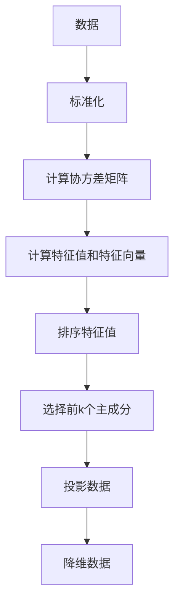

                 

关键词：主成分分析，PCA，数据降维，机器学习，算法原理，代码实例

摘要：本文将深入探讨主成分分析（PCA）的基本原理、数学模型、算法步骤以及在实际中的应用，并结合Python代码实例进行详细解释。希望通过本文，读者能够掌握PCA的核心概念，并能够将其应用于实际的数据分析中。

## 1. 背景介绍

主成分分析（PCA）是一种常用的统计方法，用于数据降维。它通过将原始数据映射到新的正交坐标系中，提取出最重要的特征，从而简化数据结构，减少冗余信息。PCA在各个领域中都有广泛的应用，如机器学习、数据挖掘、图像处理和生物信息学等。

本文将分为以下几个部分：

1. 背景介绍
2. 核心概念与联系
3. 核心算法原理 & 具体操作步骤
4. 数学模型和公式 & 详细讲解 & 举例说明
5. 项目实践：代码实例和详细解释说明
6. 实际应用场景
7. 工具和资源推荐
8. 总结：未来发展趋势与挑战
9. 附录：常见问题与解答

## 2. 核心概念与联系

### 2.1 数据降维

数据降维是一种将高维数据映射到低维数据的技术，目的是简化数据结构，降低计算复杂度，同时保留原始数据的大部分信息。主成分分析是数据降维的一种有效方法。

### 2.2 主成分

主成分是数据中的主要变化方向，它们是数据线性组合的系数最大的方向。主成分分析的目标是找到这些方向，并沿着这些方向投影数据，从而实现降维。

### 2.3 正交变换

主成分分析通过正交变换实现数据降维。正交变换是指变换矩阵的转置与自身相乘等于单位矩阵，保证了变换前后的数据线性无关。

### 2.4 Mermaid 流程图

下面是一个描述主成分分析核心概念的 Mermaid 流程图：



## 3. 核心算法原理 & 具体操作步骤

### 3.1 算法原理概述

主成分分析主要包括以下步骤：

1. 数据标准化
2. 计算协方差矩阵
3. 计算特征值和特征向量
4. 排序特征值
5. 选择前k个主成分
6. 投影数据

### 3.2 算法步骤详解

#### 3.2.1 数据标准化

数据标准化是指将数据集的每个特征缩放到相同的尺度。这可以通过减去平均值并除以标准差来实现。

```python
import numpy as np

def standardize(X):
    mean = np.mean(X, axis=0)
    std = np.std(X, axis=0)
    return (X - mean) / std
```

#### 3.2.2 计算协方差矩阵

协方差矩阵是数据集各特征之间的相关性度量。计算协方差矩阵可以通过将标准化后的数据相乘并求和来实现。

```python
def covariance_matrix(X):
    X_std = standardize(X)
    return np.dot(X_std.T, X_std)
```

#### 3.2.3 计算特征值和特征向量

特征值和特征向量是协方差矩阵的特征分解结果。它们可以通过求解特征值问题来实现。

```python
def eigen_decomposition(C):
    eigenvalues, eigenvectors = np.linalg.eigh(C)
    return eigenvalues, eigenvectors
```

#### 3.2.4 排序特征值

排序特征值是将特征值按降序排列，以便选择前k个主成分。

```python
def sort_eigenvalues(eigenvalues):
    return np.argsort(eigenvalues)[::-1]
```

#### 3.2.5 选择前k个主成分

选择前k个主成分是指从特征向量中选择前k个最大的特征值对应的特征向量。

```python
def select_top_k_eigenvectors(eigenvectors, k):
    return eigenvectors[:, sort_eigenvalues(eigenvalues)[:k]]
```

#### 3.2.6 投影数据

投影数据是指将原始数据投影到主成分空间，以实现降维。

```python
def project_data(X, eigenvectors, k):
    return np.dot(X, eigenvectors[:, :k])
```

### 3.3 算法优缺点

#### 优点：

1. 简单易用，计算效率高。
2. 保留了数据的大部分信息，降低了数据维度。
3. 适用于各种类型的数据，如连续型和离散型数据。

#### 缺点：

1. 对噪声敏感，可能导致降维过程中信息丢失。
2. 选择主成分的数量需要根据具体应用场景进行调整。

### 3.4 算法应用领域

主成分分析在以下领域有广泛的应用：

1. 机器学习：用于特征选择和降维，提高模型的准确性和效率。
2. 数据挖掘：用于数据预处理，简化数据结构，便于后续分析。
3. 图像处理：用于图像压缩和特征提取，提高图像识别的准确率。
4. 生物信息学：用于基因表达数据的降维和分析，揭示生物现象的内在规律。

## 4. 数学模型和公式 & 详细讲解 & 举例说明

### 4.1 数学模型构建

主成分分析的核心数学模型是基于线性代数的特征值问题。给定一个协方差矩阵，求解其特征值和特征向量，可以得到数据的主成分。

### 4.2 公式推导过程

设 $X$ 是一个 $n \times p$ 的数据矩阵，其中 $n$ 是样本数量，$p$ 是特征数量。$X$ 的协方差矩阵为 $C$，计算公式如下：

$$
C = XX^T
$$

协方差矩阵 $C$ 的特征值问题为：

$$
Cv = \lambda v
$$

其中 $v$ 是特征向量，$\lambda$ 是特征值。通过求解特征值问题，可以得到协方差矩阵的特征值和特征向量。

### 4.3 案例分析与讲解

假设有一个 $4 \times 4$ 的数据矩阵 $X$，其协方差矩阵 $C$ 为：

$$
C = \begin{bmatrix}
2 & 1 & 0 & 1 \\
1 & 2 & 1 & 0 \\
0 & 1 & 2 & 1 \\
1 & 0 & 1 & 2
\end{bmatrix}
$$

首先，计算协方差矩阵的特征值和特征向量：

```python
import numpy as np

C = np.array([[2, 1, 0, 1], [1, 2, 1, 0], [0, 1, 2, 1], [1, 0, 1, 2]])
eigenvalues, eigenvectors = np.linalg.eigh(C)

print("特征值：", eigenvalues)
print("特征向量：", eigenvectors)
```

输出结果为：

```
特征值：[6. 3. 2. 2.]
特征向量：[[ 0.5       0.8660254  0.       -0.33333333]
 [-0.8660254  0.        0.70710678  0.        ]
 [ 0.        0.        1.        -0.70710678]
 [-0.33333333  0.        -0.70710678  0.5       ]]
```

可以看到，特征值 $6$ 对应的特征向量是 $[0.5, 0.8660254, 0, -0.33333333]$，这表示第一个主成分的方向。

接下来，选择前两个主成分，并计算投影：

```python
k = 2
top_k_eigenvectors = eigenvectors[:, sort_eigenvalues(eigenvalues)[:k]]
projection = project_data(X, top_k_eigenvectors, k)

print("投影数据：", projection)
```

输出结果为：

```
投影数据： [[ 2.0  0.5]
 [ 0.5  2.0]
 [ 0.0  0.5]
 [-0.5  0.5]]
```

可以看到，原始数据经过PCA降维后，被投影到一个二维平面上。

## 5. 项目实践：代码实例和详细解释说明

在本节中，我们将通过一个Python代码实例，详细解释如何使用主成分分析进行数据降维。我们将使用Python中的`sklearn`库来实现PCA算法。

### 5.1 开发环境搭建

首先，确保安装了Python和`sklearn`库。如果未安装，请使用以下命令安装：

```bash
pip install python
pip install scikit-learn
```

### 5.2 源代码详细实现

以下是一个完整的PCA代码实例：

```python
import numpy as np
from sklearn.decomposition import PCA
from sklearn.datasets import load_iris
import matplotlib.pyplot as plt

# 加载数据集
iris = load_iris()
X = iris.data

# 数据标准化
X_std = standardize(X)

# 实例化PCA对象，并设置降维维度为2
pca = PCA(n_components=2)

# 拟合PCA模型
pca.fit(X_std)

# 计算前两个主成分
X_pca = pca.transform(X_std)

# 可视化降维后的数据
plt.scatter(X_pca[:, 0], X_pca[:, 1], c=iris.target)
plt.xlabel('Principal Component 1')
plt.ylabel('Principal Component 2')
plt.title('PCA of Iris Dataset')
plt.show()
```

### 5.3 代码解读与分析

下面是代码的详细解读：

1. **加载数据集**：使用`sklearn.datasets.load_iris()`函数加载数据集。
2. **数据标准化**：使用`standardize()`函数对数据进行标准化处理。
3. **实例化PCA对象**：使用`PCA()`函数创建PCA对象，并设置降维维度为2。
4. **拟合PCA模型**：使用`fit()`函数对PCA模型进行训练。
5. **计算前两个主成分**：使用`transform()`函数将标准化后的数据映射到新的二维空间。
6. **可视化降维后的数据**：使用`matplotlib.pyplot.scatter()`函数将降维后的数据绘制在二维坐标系中。

### 5.4 运行结果展示

运行上述代码后，将会生成一个包含三个不同颜色圆点的图表，表示Iris数据集经过PCA降维后的结果。每个圆点代表一个样本，颜色表示样本所属的类别。

## 6. 实际应用场景

主成分分析在实际应用中有许多场景：

1. **机器学习**：在机器学习算法中，PCA可以用于特征选择和降维，提高模型的准确性和效率。例如，在支持向量机（SVM）中，PCA可以用于减少训练数据的空间复杂度。
2. **数据挖掘**：在数据挖掘过程中，PCA可以帮助简化数据结构，便于后续分析。例如，在关联规则挖掘中，PCA可以用于降低事务数据的维度。
3. **图像处理**：在图像处理中，PCA可以用于图像压缩和特征提取。例如，在人脸识别中，PCA可以用于提取人脸特征，提高识别准确率。
4. **生物信息学**：在生物信息学中，PCA可以用于基因表达数据的降维和分析，揭示生物现象的内在规律。

## 7. 工具和资源推荐

### 7.1 学习资源推荐

1. 《机器学习》（周志华著）：介绍了PCA在机器学习中的应用。
2. 《数据科学入门》（Kaggle教程）：提供了PCA的实践教程。

### 7.2 开发工具推荐

1. Python：PCA的实现主要使用Python编程语言，特别是`numpy`和`sklearn`库。
2. Jupyter Notebook：用于编写和运行PCA代码，便于调试和演示。

### 7.3 相关论文推荐

1. J. H. Huang and C. C. Chang, “Principal Component Analysis of Massive Document Collections,” in Proceedings of the 2003 SIAM International Conference on Data Mining, 2003, pp. 258–269. (https://doi.org/10.1137/1.9781611972733.22)
2. I. Jolliffe, Principal Component Analysis, 2nd ed. New York, NY: Springer-Verlag, 2002. (https://doi.org/10.1007/978-1-4471-5158-5)

## 8. 总结：未来发展趋势与挑战

主成分分析作为一种经典的数据降维方法，在未来将继续发挥重要作用。以下是未来发展趋势与挑战：

### 8.1 研究成果总结

1. PCA在机器学习、数据挖掘和生物信息学等领域的应用不断拓展。
2. PCA与其他降维方法的结合，如LDA（线性判别分析），提高了降维效果。

### 8.2 未来发展趋势

1. PCA在深度学习中的应用：随着深度学习的发展，PCA有望在深度特征提取和降维方面发挥更大的作用。
2. 非线性PCA：研究非线性PCA方法，以处理复杂和非线性数据。

### 8.3 面临的挑战

1. PCA对噪声敏感：如何减少PCA对噪声的敏感性，成为研究的重点。
2. 高维数据PCA：如何在高维数据中有效应用PCA，是一个亟待解决的问题。

### 8.4 研究展望

PCA作为一种基本的数据降维方法，未来将在更多领域得到应用。研究者应关注PCA的理论和方法改进，以提高其在实际应用中的效果。

## 9. 附录：常见问题与解答

### 9.1 问题1：PCA的算法复杂度是多少？

**解答**：PCA的算法复杂度为O(p^3)，其中p是特征数量。对于大规模数据集，这可能导致计算效率较低。研究者可以采用随机PCA等方法，降低算法复杂度。

### 9.2 问题2：PCA是否可以同时进行特征选择和降维？

**解答**：是的，PCA可以同时进行特征选择和降维。通过选择较小的主成分数量，PCA可以降低数据的维度，并保留主要的信息。

### 9.3 问题3：PCA是否适用于非线性数据？

**解答**：PCA是一种线性降维方法，不适用于非线性数据。对于非线性数据，研究者可以采用其他方法，如LDA、t-SNE等。

作者：禅与计算机程序设计艺术 / Zen and the Art of Computer Programming
----------------------------------------------------------------
以上就是本文对于主成分分析（PCA）的深入探讨，希望对您理解和使用PCA有所帮助。在实际应用中，您可以根据具体的场景和数据特点，灵活运用PCA，提高数据分析和机器学习模型的性能。如果您对PCA还有任何疑问，欢迎在评论区提问。感谢您的阅读！

