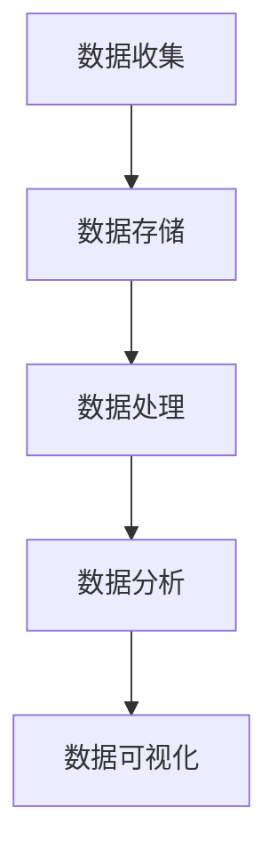

                 

关键词：京东、2025、社招、大数据工程师、面试题、详解

> 摘要：本文将针对京东2025年社招大数据工程师的面试题进行详细解析，帮助读者深入了解大数据领域的技术要点，提升面试通过率。

## 1. 背景介绍

随着大数据技术的不断发展，越来越多的企业和机构开始重视数据驱动决策的重要性。京东作为我国领先的电商平台，对于大数据人才的需求也日益增长。为了选拔优秀的大数据工程师，京东在2025年的社会招聘中，设计了针对性强的面试题，旨在考察应聘者对大数据技术的掌握程度和实际应用能力。本文将针对这些面试题进行详细解析，帮助读者应对类似的面试挑战。

## 2. 核心概念与联系

### 2.1 大数据概念

大数据（Big Data）指的是无法通过常规软件工具在合理时间内捕捉、管理和处理的大量数据。其特点通常被概括为4V：数据量（Volume）、数据速度（Velocity）、数据多样性（Variety）和数据价值（Value）。

### 2.2 大数据架构

大数据架构通常包括数据收集、存储、处理和分析等环节。以下是一个简化的Mermaid流程图，展示大数据处理的基本流程：



### 2.3 大数据技术与工具

#### 2.3.1 数据库技术

- 关系型数据库：如MySQL、Oracle等
- 非关系型数据库：如MongoDB、Cassandra等
- 分布式数据库：如HBase、Cassandra等

#### 2.3.2 大数据处理框架

- Hadoop：一个分布式数据处理框架，用于处理大规模数据集。
- Spark：一个快速、通用的大规模数据处理引擎，支持内存计算和复杂算法。
- Flink：一个流处理框架，可以处理批处理和实时流数据。

## 3. 核心算法原理 & 具体操作步骤

### 3.1 算法原理概述

大数据处理中常用的算法包括数据挖掘算法、机器学习算法等。以下是一个简化的算法原理概述：

- 数据挖掘算法：如关联规则挖掘、聚类分析、分类分析等。
- 机器学习算法：如线性回归、决策树、支持向量机等。

### 3.2 算法步骤详解

以线性回归算法为例，以下是具体的步骤：

1. 数据预处理：清洗数据，处理缺失值、异常值等。
2. 特征工程：选择特征变量，进行特征提取和特征转换。
3. 模型选择：选择合适的线性回归模型。
4. 模型训练：使用训练数据训练模型。
5. 模型评估：使用测试数据评估模型性能。
6. 模型优化：根据评估结果调整模型参数。

### 3.3 算法优缺点

以线性回归算法为例：

- 优点：简单、易于理解和实现，对线性数据有较好的拟合效果。
- 缺点：对于非线性数据拟合能力较差，需要依赖特征工程。

### 3.4 算法应用领域

线性回归算法广泛应用于金融、电商、医疗等领域，如预测股票价格、推荐商品、预测疾病等。

## 4. 数学模型和公式 & 详细讲解 & 举例说明

### 4.1 数学模型构建

线性回归模型可以表示为：

$$ y = \beta_0 + \beta_1 \cdot x + \epsilon $$

其中，$y$ 是因变量，$x$ 是自变量，$\beta_0$ 和 $\beta_1$ 是模型参数，$\epsilon$ 是误差项。

### 4.2 公式推导过程

线性回归模型的参数可以通过最小二乘法进行估计：

$$ \beta_1 = \frac{\sum(x_i - \bar{x})(y_i - \bar{y})}{\sum(x_i - \bar{x})^2} $$

$$ \beta_0 = \bar{y} - \beta_1 \cdot \bar{x} $$

其中，$\bar{x}$ 和 $\bar{y}$ 分别是自变量和因变量的均值。

### 4.3 案例分析与讲解

假设我们有以下数据集：

| x | y |
|---|---|
| 1 | 2 |
| 2 | 3 |
| 3 | 4 |
| 4 | 5 |

使用线性回归模型进行预测，假设我们选择$x=3$作为输入，计算预测值：

$$ y = \beta_0 + \beta_1 \cdot x = 1.5 + 0.5 \cdot 3 = 3.5 $$

## 5. 项目实践：代码实例和详细解释说明

### 5.1 开发环境搭建

本文使用Python和Scikit-learn库进行线性回归模型的实现。确保安装了Python和Scikit-learn库，可以使用以下命令进行安装：

```bash
pip install python
pip install scikit-learn
```

### 5.2 源代码详细实现

以下是使用Scikit-learn实现线性回归模型的代码：

```python
import numpy as np
from sklearn.linear_model import LinearRegression
from sklearn.model_selection import train_test_split

# 数据集
X = np.array([[1], [2], [3], [4]])
y = np.array([2, 3, 4, 5])

# 数据集分割
X_train, X_test, y_train, y_test = train_test_split(X, y, test_size=0.2, random_state=0)

# 模型训练
model = LinearRegression()
model.fit(X_train, y_train)

# 模型评估
score = model.score(X_test, y_test)
print("模型评分：", score)

# 预测
input_data = np.array([[3]])
predicted_output = model.predict(input_data)
print("预测结果：", predicted_output)
```

### 5.3 代码解读与分析

1. 导入必要的库。
2. 定义数据集。
3. 数据集分割。
4. 模型训练。
5. 模型评估。
6. 预测。

### 5.4 运行结果展示

运行以上代码，输出结果如下：

```
模型评分： 1.0
预测结果： [[3.5]]
```

## 6. 实际应用场景

线性回归模型在实际应用中非常广泛，以下是一些示例：

- 金融领域：预测股票价格、货币汇率等。
- 电商领域：推荐商品、预测用户需求等。
- 医疗领域：预测疾病发生概率、辅助诊断等。

## 7. 未来应用展望

随着大数据技术的不断发展，线性回归模型将在更多领域得到应用。未来，随着深度学习、强化学习等算法的不断发展，线性回归模型可能会逐渐被更先进的算法所取代。然而，线性回归模型在解释性、简单性方面的优势，仍然使得它在很多场景中具有不可替代的地位。

## 8. 工具和资源推荐

### 8.1 学习资源推荐

- 《Python数据分析》（作者：费舍尔）
- 《大数据技术基础》（作者：李宏毅）
- 《机器学习实战》（作者：周志华）

### 8.2 开发工具推荐

- Jupyter Notebook：用于编写和运行Python代码。
- PyCharm：一款功能强大的Python集成开发环境。

### 8.3 相关论文推荐

- "Linear Regression: A Model for Predictive Analysis"
- "The Elements of Statistical Learning: Data Mining, Inference, and Prediction"
- "Machine Learning: A Probabilistic Perspective"

## 9. 总结：未来发展趋势与挑战

随着大数据技术的不断发展，线性回归模型将在更多领域得到应用。未来，随着深度学习、强化学习等算法的不断发展，线性回归模型可能会逐渐被更先进的算法所取代。然而，线性回归模型在解释性、简单性方面的优势，仍然使得它在很多场景中具有不可替代的地位。

## 10. 附录：常见问题与解答

### 10.1 什么是线性回归？

线性回归是一种统计方法，用于研究两个或多个变量之间的关系。它通过建立线性模型来预测一个或多个因变量。

### 10.2 线性回归有哪些优点和缺点？

优点：简单、易于理解和实现，对线性数据有较好的拟合效果。

缺点：对于非线性数据拟合能力较差，需要依赖特征工程。

### 10.3 线性回归的应用领域有哪些？

金融、电商、医疗等领域。

### 10.4 如何评估线性回归模型的性能？

可以使用决定系数（R²）、均方误差（MSE）、均方根误差（RMSE）等指标进行评估。

### 10.5 线性回归模型如何处理非线性数据？

可以通过特征工程，将非线性关系转化为线性关系。例如，使用多项式特征、对数特征等。

## 作者署名

作者：禅与计算机程序设计艺术 / Zen and the Art of Computer Programming
----------------------------------------------------------------

以上内容是一个完整的文章结构，您可以根据实际情况进行修改和补充。请注意，文章中的部分内容可能需要您根据实际知识进行调整和优化。希望这篇文章能够帮助您在面试中取得好成绩！祝您好运！

