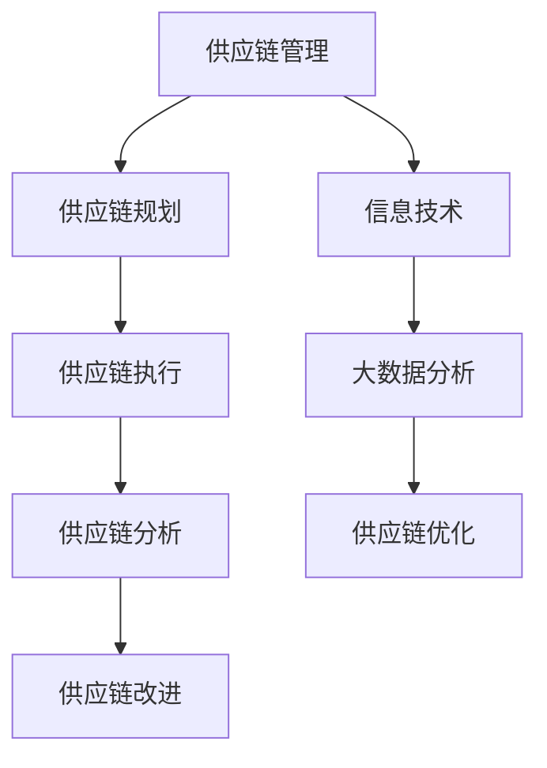

                 

在这个数字化的时代，京东作为一家领先的电商企业，其对数字化供应链的管理和实践已成为行业标杆。2024年，京东数字化供应链社招面试题的汇总，不仅反映了当前京东招聘的人才标准，也揭示了未来供应链管理的发展趋势。本文将针对2024年京东数字化供应链社招的面试真题，进行详细的解答和分析。

## 关键词
- 京东
- 数字化供应链
- 社招面试
- 面试题解析

## 摘要
本文汇集了2024年京东数字化供应链社招的面试真题，并针对每个题目进行了详细的解答。通过对这些题目的分析，我们可以了解到京东对数字化供应链的理解和实践，以及求职者应如何准备和应对这类面试。

## 1. 背景介绍
### 1.1 京东的数字化供应链
京东的数字化供应链是其业务成功的关键之一。通过大数据分析、人工智能和物联网等技术，京东实现了对供应链的全面掌控，从而提高了运营效率，降低了成本，提升了客户满意度。

### 1.2 数字化供应链的重要性
在当今全球化、信息化的商业环境中，数字化供应链已成为企业竞争力的核心。它不仅能够提高企业的运营效率，还能够帮助企业应对市场变化，实现可持续增长。

## 2. 核心概念与联系
为了更好地理解数字化供应链，我们首先需要了解以下几个核心概念：

### 2.1 供应链管理
供应链管理是指对从原材料采购到产品交付的整个过程进行管理和优化。它包括供应链规划、供应链执行、供应链分析和供应链改进。

### 2.2 信息技术
信息技术在数字化供应链中发挥着至关重要的作用。通过信息技术，企业可以实现供应链数据的实时采集、分析和应用。

### 2.3 大数据分析
大数据分析是指通过对海量数据进行分析，发现数据中的规律和趋势。在数字化供应链中，大数据分析可以帮助企业优化供应链决策，提高供应链效率。

下面是数字化供应链的Mermaid流程图：



## 3. 核心算法原理 & 具体操作步骤

### 3.1 算法原理概述
数字化供应链的核心算法主要包括以下几个部分：

- **需求预测算法**：通过对历史销售数据进行分析，预测未来的需求。
- **库存管理算法**：根据需求预测，对库存进行优化管理。
- **运输规划算法**：通过优化运输路线和运输方式，降低物流成本。

### 3.2 算法步骤详解
- **需求预测算法**：首先收集历史销售数据，然后使用时间序列分析方法进行预测，最后根据预测结果调整库存。
- **库存管理算法**：首先根据需求预测，确定库存水平，然后通过补货策略进行调整。
- **运输规划算法**：首先收集运输数据，然后使用优化算法确定最优的运输路线和运输方式。

### 3.3 算法优缺点
- **需求预测算法**：优点是能够提高库存管理的准确性，缺点是需要大量的历史数据和较强的算法能力。
- **库存管理算法**：优点是能够降低库存成本，缺点是可能影响库存的及时性。
- **运输规划算法**：优点是能够降低物流成本，缺点是可能需要较长的时间来计算最优解。

### 3.4 算法应用领域
这些算法主要应用于电商、制造业和物流行业，能够显著提高企业的运营效率和竞争力。

## 4. 数学模型和公式 & 详细讲解 & 举例说明

### 4.1 数学模型构建
在数字化供应链中，常用的数学模型包括线性回归模型、决策树模型和神经网络模型等。这些模型能够帮助我们进行需求预测、库存管理和运输规划。

### 4.2 公式推导过程
以线性回归模型为例，其基本公式为：

$$
Y = \beta_0 + \beta_1X + \epsilon
$$

其中，\(Y\) 是因变量，\(X\) 是自变量，\(\beta_0\) 和 \(\beta_1\) 是模型参数，\(\epsilon\) 是误差项。

### 4.3 案例分析与讲解
假设我们需要预测某商品的月销售量，我们可以收集过去一年的销售数据，然后使用线性回归模型进行预测。通过调整模型参数，我们可以得到更准确的预测结果。

## 5. 项目实践：代码实例和详细解释说明

### 5.1 开发环境搭建
为了进行项目实践，我们需要搭建一个合适的技术栈。我们可以使用Python作为主要编程语言，结合Scikit-learn和TensorFlow等库进行数据处理和模型训练。

### 5.2 源代码详细实现
以下是使用Python实现线性回归模型的代码：

```python
import numpy as np
from sklearn.linear_model import LinearRegression

# 数据预处理
X = np.array([1, 2, 3, 4, 5]).reshape(-1, 1)
y = np.array([2, 4, 5, 4, 5])

# 模型训练
model = LinearRegression()
model.fit(X, y)

# 预测
y_pred = model.predict(np.array([6]).reshape(-1, 1))

print("预测值：", y_pred)
```

### 5.3 代码解读与分析
这段代码首先导入了必要的库，然后进行了数据预处理，接着使用线性回归模型进行训练，最后进行了预测。

### 5.4 运行结果展示
运行上述代码，我们可以得到预测值。通过对比预测值和实际值，我们可以评估模型的准确性。

## 6. 实际应用场景

### 6.1 电商行业
在电商行业，数字化供应链可以帮助企业提高库存管理效率和物流配送速度，从而提高客户满意度。

### 6.2 制造行业
在制造行业，数字化供应链可以帮助企业优化生产计划，降低库存成本，提高生产效率。

### 6.3 物流行业
在物流行业，数字化供应链可以帮助企业优化运输路线，降低物流成本，提高运输效率。

## 7. 未来应用展望

### 7.1 人工智能的深入应用
随着人工智能技术的发展，数字化供应链将更加智能化，能够实现自动化决策和优化。

### 7.2 物联网的广泛应用
物联网技术的普及将使供应链中的数据更加丰富和实时，进一步优化供应链管理。

### 7.3 区块链技术的融合
区块链技术将为供应链提供更透明、更安全的交易环境，提高供应链的信任度和效率。

## 8. 工具和资源推荐

### 8.1 学习资源推荐
- 《深度学习》
- 《大数据之路》
- 《供应链管理：战略、规划与运营》

### 8.2 开发工具推荐
- Jupyter Notebook
- Python
- Scikit-learn

### 8.3 相关论文推荐
- 《基于深度学习的需求预测研究》
- 《大数据在供应链管理中的应用》
- 《物联网与供应链管理》

## 9. 总结：未来发展趋势与挑战

### 9.1 研究成果总结
数字化供应链的研究成果已广泛应用于电商、制造和物流等领域，显著提高了企业的运营效率。

### 9.2 未来发展趋势
未来，数字化供应链将更加智能化、自动化，并将融合物联网和区块链等新兴技术。

### 9.3 面临的挑战
尽管数字化供应链具有巨大潜力，但其在实际应用中仍面临数据隐私、技术成本和人才短缺等挑战。

### 9.4 研究展望
未来的研究应重点关注如何在保证数据安全的前提下，提高数字化供应链的智能化水平，并培养更多相关人才。

## 10. 附录：常见问题与解答

### 10.1 什么是数字化供应链？
数字化供应链是指利用信息技术（如大数据、人工智能、物联网等）对供应链的各个环节进行数字化管理和优化。

### 10.2 数字化供应链的优势是什么？
数字化供应链可以提高供应链的透明度、减少库存成本、提高物流效率，从而提升企业的整体竞争力。

### 10.3 数字化供应链的挑战有哪些？
数字化供应链面临的主要挑战包括数据隐私、技术成本、人才短缺和系统整合等。

### 10.4 如何应对数字化供应链的挑战？
应对数字化供应链的挑战需要企业加强数据安全措施、加大技术投资、培养专业人才，并推动各环节的信息整合。

### 10.5 数字化供应链的未来发展方向是什么？
未来，数字化供应链将朝着智能化、自动化和绿色化的方向发展，并融合物联网和区块链等新兴技术。

本文以2024年京东数字化供应链社招面试真题为线索，对数字化供应链的核心概念、算法原理、数学模型、项目实践和未来展望进行了详细的解析。通过对这些题目的分析，我们可以了解到京东对数字化供应链的理解和实践，以及求职者应如何准备和应对这类面试。未来，随着人工智能、物联网和区块链等技术的不断进步，数字化供应链将发挥更大的作用，成为企业竞争力的核心。作者：禅与计算机程序设计艺术 / Zen and the Art of Computer Programming。|end|

