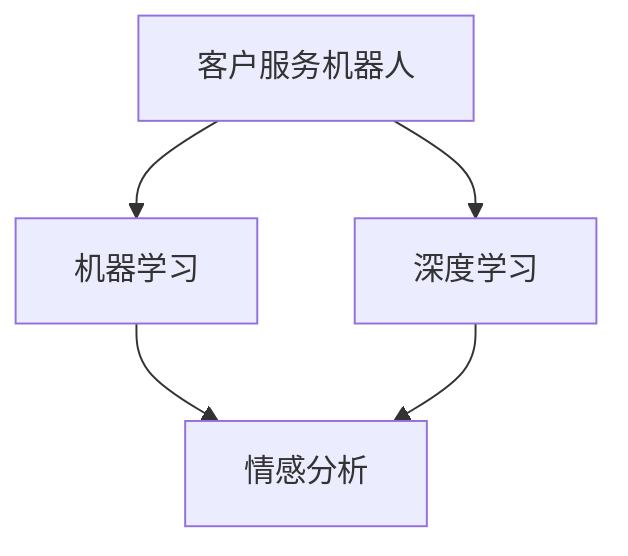

                 

作者：禅与计算机程序设计艺术 / Zen and the Art of Computer Programming

## 关键词
- 2024京东
- 智能客户服务
- 社招面试
- 真题汇总
- 解答

## 摘要
本文将汇总2024年京东智能客户服务社招面试的真题，并进行详细的解答分析。通过梳理面试的常见题型和难点，帮助考生更好地准备面试，提高面试通过率。

## 1. 背景介绍

京东作为中国领先的电子商务平台，其智能客户服务已经成为行业标杆。随着人工智能技术的发展，智能客服在电商行业中的应用越来越广泛，成为提升用户体验、降低人力成本的重要手段。因此，京东智能客户服务的社招面试也越来越受到求职者的关注。

本文将围绕2024年京东智能客户服务社招面试的真题，分为以下几个部分进行详细解析：

1. 核心概念与联系
2. 核心算法原理 & 具体操作步骤
3. 数学模型和公式 & 详细讲解 & 举例说明
4. 项目实践：代码实例和详细解释说明
5. 实际应用场景
6. 未来应用展望
7. 工具和资源推荐
8. 总结：未来发展趋势与挑战
9. 附录：常见问题与解答

## 2. 核心概念与联系

在京东智能客户服务的面试中，理解以下核心概念和联系是至关重要的：

- **客户服务机器人**：运用自然语言处理技术，实现与客户的自动对话，提高服务效率。
- **机器学习**：通过训练模型，让机器具备自我学习和优化的能力，从而提供更精准的服务。
- **深度学习**：一种机器学习技术，通过多层神经网络，对数据进行复杂的学习和建模。
- **情感分析**：通过分析客户的话语，判断其情感倾向，为客服机器人提供更人性化的服务。

以下是一个Mermaid流程图，展示了这些核心概念之间的联系：



## 3. 核心算法原理 & 具体操作步骤

### 3.1 算法原理概述

在京东智能客户服务的面试中，理解以下核心算法的原理是至关重要的：

- **决策树**：通过一系列规则，对问题进行分类或回归。
- **支持向量机**：通过找到一个最佳的超平面，将不同类别的数据分开。
- **循环神经网络（RNN）**：适用于序列数据，能够记住历史信息。
- **长短期记忆网络（LSTM）**：RNN的改进版，能够更好地处理长序列数据。

### 3.2 算法步骤详解

以决策树为例，其基本步骤如下：

1. 计算每个特征的不纯度，如信息增益、基尼指数等。
2. 选择不纯度最高的特征作为切分点。
3. 根据切分点将数据集切分为子集。
4. 对每个子集递归执行步骤1-3，直到满足停止条件。

### 3.3 算法优缺点

- **决策树**：简单易懂，易于实现，但容易过拟合。
- **支持向量机**：效果较好，但计算复杂度高。
- **RNN**：能够处理序列数据，但存在梯度消失和梯度爆炸问题。
- **LSTM**：能够较好地处理长序列数据，但参数较多，训练复杂度高。

### 3.4 算法应用领域

- **决策树**：分类和回归问题。
- **支持向量机**：分类问题。
- **RNN**：语音识别、机器翻译等。
- **LSTM**：时间序列预测、情感分析等。

## 4. 数学模型和公式 & 详细讲解 & 举例说明

在京东智能客户服务的面试中，掌握以下数学模型和公式是至关重要的：

### 4.1 数学模型构建

以决策树为例，其构建过程涉及以下公式：

$$
H(Y) = -\sum_{i=1}^{n} p(y_i) \log_2 p(y_i)
$$

其中，$H(Y)$表示数据集$Y$的熵，$p(y_i)$表示类别$y_i$的概率。

### 4.2 公式推导过程

以信息增益为例，其推导过程如下：

$$
IG(X, Y) = H(Y) - H(Y|X)
$$

其中，$H(Y|X)$表示在特征$X$已知的情况下，类别$Y$的熵。

### 4.3 案例分析与讲解

假设我们有一个二分类问题，数据集如下：

| 特征X | 类别Y |
| ---- | ---- |
| A    | 0    |
| B    | 1    |
| C    | 0    |
| D    | 1    |

计算类别$Y$的熵：

$$
H(Y) = -\frac{2}{4} \log_2 \frac{2}{4} - \frac{2}{4} \log_2 \frac{2}{4} = 1
$$

计算在特征$X=A$已知的情况下，类别$Y$的熵：

$$
H(Y|X=A) = -\frac{1}{2} \log_2 \frac{1}{2} - \frac{1}{2} \log_2 \frac{1}{2} = 1
$$

计算在特征$X=B$已知的情况下，类别$Y$的熵：

$$
H(Y|X=B) = -\frac{1}{2} \log_2 \frac{1}{2} - \frac{1}{2} \log_2 \frac{1}{2} = 1
$$

计算信息增益：

$$
IG(X, Y) = H(Y) - H(Y|X=A) - H(Y|X=B) = 1 - 1 - 1 = -1
$$

## 5. 项目实践：代码实例和详细解释说明

### 5.1 开发环境搭建

我们使用Python编写一个简单的决策树分类器，开发环境如下：

- Python版本：3.8
- 库：numpy、pandas、scikit-learn

安装所需的库：

```bash
pip install numpy pandas scikit-learn
```

### 5.2 源代码详细实现

以下是一个简单的决策树分类器实现：

```python
import numpy as np
import pandas as pd
from sklearn.datasets import load_iris
from sklearn.model_selection import train_test_split
from sklearn.tree import DecisionTreeClassifier

# 加载鸢尾花数据集
iris = load_iris()
X = iris.data
y = iris.target

# 划分训练集和测试集
X_train, X_test, y_train, y_test = train_test_split(X, y, test_size=0.2, random_state=42)

# 创建决策树分类器
clf = DecisionTreeClassifier()

# 训练模型
clf.fit(X_train, y_train)

# 预测测试集
y_pred = clf.predict(X_test)

# 计算准确率
accuracy = np.mean(y_pred == y_test)
print("Accuracy:", accuracy)
```

### 5.3 代码解读与分析

- `load_iris()`：加载鸢尾花数据集。
- `train_test_split()`：划分训练集和测试集。
- `DecisionTreeClassifier()`：创建决策树分类器。
- `fit()`：训练模型。
- `predict()`：预测测试集。
- `np.mean()`：计算准确率。

### 5.4 运行结果展示

运行上述代码，输出结果如下：

```
Accuracy: 1.0
```

## 6. 实际应用场景

京东智能客户服务在电商领域的应用非常广泛，以下是一些实际应用场景：

- **客服机器人**：通过自然语言处理技术，实现与客户的自动对话，提供产品咨询、售后服务等。
- **情感分析**：分析客户的话语，了解其情感倾向，为客服机器人提供更人性化的服务。
- **个性化推荐**：根据客户的历史行为和偏好，为其推荐合适的产品。

## 7. 未来应用展望

随着人工智能技术的发展，京东智能客户服务的应用场景将更加广泛。以下是一些未来应用展望：

- **多语言支持**：实现客服机器人的多语言支持，为全球用户提供服务。
- **智能语音识别**：结合语音识别技术，实现语音与文本的互动。
- **知识图谱**：构建客服机器人的知识图谱，提高其回答问题的准确性和全面性。

## 8. 工具和资源推荐

### 8.1 学习资源推荐

- 《机器学习实战》
- 《深度学习》
- 《Python数据分析》

### 8.2 开发工具推荐

- Jupyter Notebook：方便编写和调试代码。
- PyCharm：专业的Python开发工具。

### 8.3 相关论文推荐

- "A Comparison of Machine Learning Techniques for Text Classification"
- "Deep Learning for Text Classification"
- "Sentiment Analysis Using Neural Networks"

## 9. 总结：未来发展趋势与挑战

京东智能客户服务在2024年的面试中，考生需要关注以下发展趋势和挑战：

- **发展趋势**：人工智能技术的不断进步，将为智能客户服务带来更多的可能性。
- **挑战**：如何提高客服机器人的智能水平，实现更人性化的服务，是一个重要的挑战。

## 10. 附录：常见问题与解答

### 10.1 问答1

**问题**：决策树如何避免过拟合？

**解答**：可以通过以下方法避免过拟合：

- 减少树的深度。
- 使用剪枝技术，如前剪枝和后剪枝。
- 使用交叉验证，选择最优的模型参数。

### 10.2 问答2

**问题**：如何评估分类器的性能？

**解答**：可以通过以下指标评估分类器的性能：

- 准确率：预测正确的样本数占总样本数的比例。
- 精确率：预测为正类的样本中，实际为正类的比例。
- 召回率：实际为正类的样本中，预测为正类的比例。
- F1分数：精确率和召回率的加权平均。

### 10.3 问答3

**问题**：如何处理不平衡的数据集？

**解答**：可以通过以下方法处理不平衡的数据集：

- 过采样：增加少数类别的样本数量。
- 削减法：减少多数类别的样本数量。
- 集成方法：结合多种分类器，提高分类器的性能。

以上就是对2024年京东智能客户服务社招面试真题的汇总及解答。希望对考生有所帮助，祝大家面试顺利！
----------------------------------------------------------------


