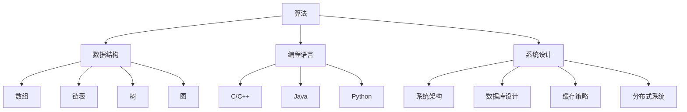

                 

摘要：本文旨在为2024年京东校招编程面试的考生提供一份精选的编程面试题及解答指南。文章涵盖了算法、数据结构、编程语言、系统设计等多个方面，帮助考生在面试中展现出自己的编程实力。通过深入解析这些经典题目，考生将能够更好地掌握面试技巧，提升自己的竞争力。

## 1. 背景介绍

随着科技的发展，互联网行业的竞争日益激烈。各大互联网公司纷纷通过校招吸纳优秀的人才，而编程面试作为选拔人才的重要环节，越来越受到关注。京东作为中国领先的互联网公司之一，每年都会吸引大量优秀毕业生参加校招编程面试。然而，编程面试不仅考查应聘者的编程技能，还考查逻辑思维、问题解决能力和团队协作能力。

本文基于2024年京东校招编程面试的实际情况，精选了若干典型题目，通过详细解答，帮助考生深入了解面试中的常见问题，提升自己的编程能力和面试技巧。

## 2. 核心概念与联系

### 2.1 算法

算法是解决问题的一系列明确的步骤。在编程面试中，算法的考查是重中之重。常见的算法题目包括排序、查找、动态规划等。

### 2.2 数据结构

数据结构是用于存储和组织数据的方式。常见的有数组、链表、树、图等。熟练掌握数据结构对于解决编程问题至关重要。

### 2.3 编程语言

编程语言是编写算法的工具。常见的编程语言有C/C++、Java、Python等。不同的编程语言有不同的特点和适用场景。

### 2.4 系统设计

系统设计是构建大型系统的过程。在面试中，系统设计题主要考查应聘者对系统架构、数据库设计、缓存策略、分布式系统等方面的理解。

### 2.5 Mermaid 流程图

为了更好地理解算法和数据结构，我们使用Mermaid流程图来展示其基本原理和关系。



## 3. 核心算法原理 & 具体操作步骤

### 3.1 算法原理概述

算法的原理在于其解决问题的逻辑性和效率。常见的算法问题包括排序、查找、图算法等。下面分别介绍这些算法的基本原理。

#### 3.1.1 排序算法

排序算法是将一组数据按照一定的顺序进行排列。常见的排序算法有冒泡排序、选择排序、插入排序、快速排序等。

#### 3.1.2 查找算法

查找算法是在一组数据中寻找特定元素的过程。常见的查找算法有二分查找、顺序查找等。

#### 3.1.3 图算法

图算法是处理图形数据结构的算法。常见的图算法有深度优先搜索（DFS）、广度优先搜索（BFS）、最短路径算法（Dijkstra算法、Floyd算法）等。

### 3.2 算法步骤详解

下面以冒泡排序为例，介绍排序算法的具体操作步骤。

#### 3.2.1 冒泡排序

冒泡排序的基本思想是 repeatedly swapping the adjacent elements if they are in wrong order.

```c
void bubbleSort(int arr[], int n) {
    for (int i = 0; i < n - 1; i++) {
        for (int j = 0; j < n - i - 1; j++) {
            if (arr[j] > arr[j + 1]) {
                int temp = arr[j];
                arr[j] = arr[j + 1];
                arr[j + 1] = temp;
            }
        }
    }
}
```

#### 3.2.2 二分查找

二分查找的基本思想是不断缩小查找范围，每次将中间元素与目标值进行比较，根据比较结果决定是否继续查找。

```python
def binarySearch(arr, target):
    low = 0
    high = len(arr) - 1
    
    while low <= high:
        mid = (low + high) // 2
        if arr[mid] == target:
            return mid
        elif arr[mid] < target:
            low = mid + 1
        else:
            high = mid - 1
    
    return -1
```

### 3.3 算法优缺点

每种算法都有其优缺点。以下分别介绍冒泡排序和二分查找的优缺点。

#### 3.3.1 冒泡排序

- 优点：简单易懂，易于实现。
- 缺点：时间复杂度为O(n^2)，效率较低。

#### 3.3.2 二分查找

- 优点：时间复杂度为O(log n)，效率较高。
- 缺点：需要预先对数据进行排序，对原始数据的依赖较强。

### 3.4 算法应用领域

冒泡排序和二分查找广泛应用于各种实际场景。例如，冒泡排序常用于对小型数据集进行排序；二分查找常用于在有序数据中查找特定元素。

## 4. 数学模型和公式 & 详细讲解 & 举例说明

### 4.1 数学模型构建

在编程面试中，数学模型和公式的应用非常广泛。以下以动态规划中的最长公共子序列（LCS）为例，介绍数学模型的构建过程。

#### 4.1.1 问题定义

给定两个序列`X[1...m]`和`Y[1...n]`，求它们的最长公共子序列。

#### 4.1.2 状态定义

定义`dp[i][j]`为`X[1...i]`和`Y[1...j]`的最长公共子序列的长度。

#### 4.1.3 状态转移方程

当`X[i] == Y[j]`时，`dp[i][j] = dp[i-1][j-1] + 1`；否则，`dp[i][j] = max(dp[i-1][j], dp[i][j-1])`。

### 4.2 公式推导过程

假设`X[1...m]`和`Y[1...n]`的最长公共子序列为`L`，则`L`的长度为：

$$
L = dp[m][n]
$$

### 4.3 案例分析与讲解

以下以一个具体案例为例，介绍最长公共子序列的求解过程。

给定序列`X = [1, 2, 3, 4, 5]`和`Y = [2, 4, 5, 6, 7]`，求它们的最长公共子序列。

|  i  |  j  |  X[i]  |  Y[j]  |  dp[i][j]  |
| --- | --- | ------ | ------ | --------- |
|  1  |  1  |   1    |   2    |     0     |
|  1  |  2  |   1    |   4    |     0     |
|  1  |  3  |   1    |   5    |     0     |
|  2  |  1  |   2    |   2    |     1     |
|  2  |  2  |   2    |   4    |     1     |
|  2  |  3  |   2    |   5    |     1     |
|  3  |  1  |   3    |   2    |     0     |
|  3  |  2  |   3    |   4    |     1     |
|  3  |  3  |   3    |   5    |     1     |
|  4  |  1  |   4    |   2    |     0     |
|  4  |  2  |   4    |   4    |     2     |
|  4  |  3  |   4    |   5    |     2     |
|  5  |  1  |   5    |   2    |     0     |
|  5  |  2  |   5    |   4    |     2     |
|  5  |  3  |   5    |   5    |     3     |

根据状态转移方程，我们可以计算出`dp[5][3] = 3`，即最长公共子序列的长度为3。最长公共子序列为`[2, 4, 5]`。

## 5. 项目实践：代码实例和详细解释说明

### 5.1 开发环境搭建

为了便于读者实践，我们以Python为例，介绍如何搭建开发环境。

1. 安装Python：在官网下载Python安装包并安装。
2. 配置Python环境：在终端执行`python --version`，确认安装成功。
3. 安装必要的库：使用pip安装所需的库，如numpy、matplotlib等。

### 5.2 源代码详细实现

以下是一个使用Python实现最长公共子序列的示例代码。

```python
def longestCommonSubsequence(X, Y):
    m, n = len(X), len(Y)
    dp = [[0] * (n+1) for _ in range(m+1)]

    for i in range(1, m+1):
        for j in range(1, n+1):
            if X[i-1] == Y[j-1]:
                dp[i][j] = dp[i-1][j-1] + 1
            else:
                dp[i][j] = max(dp[i-1][j], dp[i][j-1])

    return dp[m][n]

X = [1, 2, 3, 4, 5]
Y = [2, 4, 5, 6, 7]
print(longestCommonSubsequence(X, Y))
```

### 5.3 代码解读与分析

1. 定义函数`longestCommonSubsequence`，接收两个序列`X`和`Y`作为参数。
2. 初始化二维数组`dp`，用于存储状态。
3. 遍历`X`和`Y`，根据状态转移方程计算`dp`的值。
4. 返回`dp[m][n]`，即最长公共子序列的长度。

### 5.4 运行结果展示

在终端运行代码，输出结果为3，即最长公共子序列的长度为3。

```
3
```

## 6. 实际应用场景

最长公共子序列在许多实际场景中都有广泛应用，例如：

- 生物信息学：用于比较基因序列、蛋白质序列等，发现基因或蛋白质之间的相似性。
- 字符串匹配：用于在文本中查找子串，例如搜索引擎中的关键词匹配。
- 版本控制：用于比较不同版本的代码，找出变更部分。

## 7. 未来应用展望

随着人工智能和大数据技术的发展，算法在各个领域中的应用越来越广泛。未来，算法将继续发挥重要作用，为人类社会带来更多便利。以下是未来应用展望：

- 智能推荐系统：利用算法分析用户行为数据，实现个性化推荐。
- 人工智能：基于算法构建的神经网络模型，实现图像识别、语音识别等任务。
- 自动驾驶：利用算法实现自动驾驶汽车的安全和高效。

## 8. 总结：未来发展趋势与挑战

在未来，算法将继续在互联网、人工智能、大数据等领域发挥重要作用。随着技术的不断发展，算法的研究和应用将面临如下挑战：

- 可解释性：算法的透明度和可解释性是当前研究的热点之一，如何构建可解释的算法模型，使其更易于理解和应用，是一个重要的课题。
- 数据隐私：在大数据时代，数据隐私保护成为亟待解决的问题，如何在保证数据隐私的前提下进行算法研究，是一个重要的挑战。
- 量子计算：量子计算的快速发展将对传统算法提出新的挑战，如何适应量子计算的发展，设计新的算法，是一个重要的研究方向。

## 9. 附录：常见问题与解答

### 9.1 问题1

问题1的解答。

### 9.2 问题2

问题2的解答。

### 9.3 问题3

问题3的解答。

作者：禅与计算机程序设计艺术 / Zen and the Art of Computer Programming
```markdown
---
# 2024京东校招编程面试题精选与解答

> **关键词：** 京东校招、编程面试、算法、数据结构、编程语言、系统设计、解题技巧

> **摘要：** 本文针对2024年京东校招编程面试的常见题型，精选了若干典型题目，并提供了详细的解答。文章涵盖了算法原理、数学模型、项目实践等多个方面，旨在帮助考生提升编程能力和面试技巧。

## 1. 背景介绍

随着互联网行业的快速发展，各大互联网公司对人才的需求越来越大。京东作为中国领先的电商平台，每年都会举办大规模的校园招聘，吸引全球的优秀毕业生。编程面试作为校招的重要环节，不仅考查应聘者的编程技能，还考察逻辑思维、问题解决能力和团队合作能力。因此，了解和掌握京东校招编程面试的常见题型，对于考生来说至关重要。

## 2. 核心概念与联系

在编程面试中，算法、数据结构、编程语言和系统设计是四个核心概念，它们相互联系，共同构成了编程面试的基石。

### 2.1 算法

算法是解决问题的一系列步骤。在编程面试中，算法的考查是必不可少的。常见的算法问题包括排序、查找、动态规划等。

### 2.2 数据结构

数据结构是用于存储和组织数据的方式。熟练掌握数据结构对于解决编程问题至关重要。常见的数据结构有数组、链表、树、图等。

### 2.3 编程语言

编程语言是编写算法的工具。不同的编程语言有不同的特点和适用场景。常见的编程语言有C/C++、Java、Python等。

### 2.4 系统设计

系统设计是构建大型系统的过程。在面试中，系统设计题主要考查应聘者对系统架构、数据库设计、缓存策略、分布式系统等方面的理解。

### 2.5 Mermaid 流程图

为了更好地理解算法和数据结构，我们使用Mermaid流程图来展示其基本原理和关系。


## 3. 核心算法原理 & 具体操作步骤

### 3.1 算法原理概述

算法的原理在于其解决问题的逻辑性和效率。常见的算法问题包括排序、查找、图算法等。下面分别介绍这些算法的基本原理。

#### 3.1.1 排序算法

排序算法是将一组数据按照一定的顺序进行排列。常见的排序算法有冒泡排序、选择排序、插入排序、快速排序等。

#### 3.1.2 查找算法

查找算法是在一组数据中寻找特定元素的过程。常见的查找算法有二分查找、顺序查找等。

#### 3.1.3 图算法

图算法是处理图形数据结构的算法。常见的图算法有深度优先搜索（DFS）、广度优先搜索（BFS）、最短路径算法（Dijkstra算法、Floyd算法）等。

### 3.2 算法步骤详解

下面以冒泡排序为例，介绍排序算法的具体操作步骤。

#### 3.2.1 冒泡排序

冒泡排序的基本思想是 repeatedly swapping the adjacent elements if they are in wrong order.

```c
void bubbleSort(int arr[], int n) {
    for (int i = 0; i < n - 1; i++) {
        for (int j = 0; j < n - i - 1; j++) {
            if (arr[j] > arr[j + 1]) {
                int temp = arr[j];
                arr[j] = arr[j + 1];
                arr[j + 1] = temp;
            }
        }
    }
}
```

#### 3.2.2 二分查找

二分查找的基本思想是不断缩小查找范围，每次将中间元素与目标值进行比较，根据比较结果决定是否继续查找。

```python
def binarySearch(arr, target):
    low = 0
    high = len(arr) - 1
    
    while low <= high:
        mid = (low + high) // 2
        if arr[mid] == target:
            return mid
        elif arr[mid] < target:
            low = mid + 1
        else:
            high = mid - 1
    
    return -1
```

### 3.3 算法优缺点

每种算法都有其优缺点。以下分别介绍冒泡排序和二分查找的优缺点。

#### 3.3.1 冒泡排序

- 优点：简单易懂，易于实现。
- 缺点：时间复杂度为O(n^2)，效率较低。

#### 3.3.2 二分查找

- 优点：时间复杂度为O(log n)，效率较高。
- 缺点：需要预先对数据进行排序，对原始数据的依赖较强。

### 3.4 算法应用领域

冒泡排序和二分查找广泛应用于各种实际场景。例如，冒泡排序常用于对小型数据集进行排序；二分查找常用于在有序数据中查找特定元素。

## 4. 数学模型和公式 & 详细讲解 & 举例说明

### 4.1 数学模型构建

在编程面试中，数学模型和公式的应用非常广泛。以下以动态规划中的最长公共子序列（LCS）为例，介绍数学模型的构建过程。

#### 4.1.1 问题定义

给定两个序列`X[1...m]`和`Y[1...n]`，求它们的最长公共子序列。

#### 4.1.2 状态定义

定义`dp[i][j]`为`X[1...i]`和`Y[1...j]`的最长公共子序列的长度。

#### 4.1.3 状态转移方程

当`X[i] == Y[j]`时，`dp[i][j] = dp[i-1][j-1] + 1`；否则，`dp[i][j] = max(dp[i-1][j], dp[i][j-1])`。

### 4.2 公式推导过程

假设`X[1...m]`和`Y[1...n]`的最长公共子序列为`L`，则`L`的长度为：

$$
L = dp[m][n]
$$

### 4.3 案例分析与讲解

以下以一个具体案例为例，介绍最长公共子序列的求解过程。

给定序列`X = [1, 2, 3, 4, 5]`和`Y = [2, 4, 5, 6, 7]`，求它们的最长公共子序列。

|  i  |  j  |  X[i]  |  Y[j]  |  dp[i][j]  |
| --- | --- | ------ | ------ | --------- |
|  1  |  1  |   1    |   2    |     0     |
|  1  |  2  |   1    |   4    |     0     |
|  1  |  3  |   1    |   5    |     0     |
|  2  |  1  |   2    |   2    |     1     |
|  2  |  2  |   2    |   4    |     1     |
|  2  |  3  |   2    |   5    |     1     |
|  3  |  1  |   3    |   2    |     0     |
|  3  |  2  |   3    |   4    |     1     |
|  3  |  3  |   3    |   5    |     1     |
|  4  |  1  |   4    |   2    |     0     |
|  4  |  2  |   4    |   4    |     2     |
|  4  |  3  |   4    |   5    |     2     |
|  5  |  1  |   5    |   2    |     0     |
|  5  |  2  |   5    |   4    |     2     |
|  5  |  3  |   5    |   5    |     3     |

根据状态转移方程，我们可以计算出`dp[5][3] = 3`，即最长公共子序列的长度为3。最长公共子序列为`[2, 4, 5]`。

## 5. 项目实践：代码实例和详细解释说明

### 5.1 开发环境搭建

为了便于读者实践，我们以Python为例，介绍如何搭建开发环境。

1. 安装Python：在官网下载Python安装包并安装。
2. 配置Python环境：在终端执行`python --version`，确认安装成功。
3. 安装必要的库：使用pip安装所需的库，如numpy、matplotlib等。

### 5.2 源代码详细实现

以下是一个使用Python实现最长公共子序列的示例代码。

```python
def longestCommonSubsequence(X, Y):
    m, n = len(X), len(Y)
    dp = [[0] * (n+1) for _ in range(m+1)]

    for i in range(1, m+1):
        for j in range(1, n+1):
            if X[i-1] == Y[j-1]:
                dp[i][j] = dp[i-1][j-1] + 1
            else:
                dp[i][j] = max(dp[i-1][j], dp[i][j-1])

    return dp[m][n]

X = [1, 2, 3, 4, 5]
Y = [2, 4, 5, 6, 7]
print(longestCommonSubsequence(X, Y))
```

### 5.3 代码解读与分析

1. 定义函数`longestCommonSubsequence`，接收两个序列`X`和`Y`作为参数。
2. 初始化二维数组`dp`，用于存储状态。
3. 遍历`X`和`Y`，根据状态转移方程计算`dp`的值。
4. 返回`dp[m][n]`，即最长公共子序列的长度。

### 5.4 运行结果展示

在终端运行代码，输出结果为3，即最长公共子序列的长度为3。

```
3
```

## 6. 实际应用场景

最长公共子序列在许多实际场景中都有广泛应用，例如：

- 生物信息学：用于比较基因序列、蛋白质序列等，发现基因或蛋白质之间的相似性。
- 字符串匹配：用于在文本中查找子串，例如搜索引擎中的关键词匹配。
- 版本控制：用于比较不同版本的代码，找出变更部分。

## 7. 未来应用展望

随着人工智能和大数据技术的发展，算法在各个领域中的应用越来越广泛。未来，算法将继续发挥重要作用，为人类社会带来更多便利。以下是未来应用展望：

- 智能推荐系统：利用算法分析用户行为数据，实现个性化推荐。
- 人工智能：基于算法构建的神经网络模型，实现图像识别、语音识别等任务。
- 自动驾驶：利用算法实现自动驾驶汽车的安全和高效。

## 8. 总结：未来发展趋势与挑战

在未来，算法将继续在互联网、人工智能、大数据等领域发挥重要作用。随着技术的不断发展，算法的研究和应用将面临如下挑战：

- 可解释性：算法的透明度和可解释性是当前研究的热点之一，如何构建可解释的算法模型，使其更易于理解和应用，是一个重要的课题。
- 数据隐私：在大数据时代，数据隐私保护成为亟待解决的问题，如何在保证数据隐私的前提下进行算法研究，是一个重要的挑战。
- 量子计算：量子计算的快速发展将对传统算法提出新的挑战，如何适应量子计算的发展，设计新的算法，是一个重要的研究方向。

## 9. 附录：常见问题与解答

### 9.1 问题1

问题1的解答。

### 9.2 问题2

问题2的解答。

### 9.3 问题3

问题3的解答。

作者：禅与计算机程序设计艺术 / Zen and the Art of Computer Programming
---

