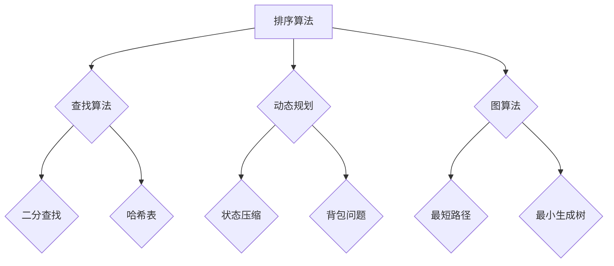

                 

关键词：2025、京东、社招、面试、算法、题库、大全、技术、深度、思考、见解、IT领域

> 摘要：本文将围绕2025年京东社招面试中的算法题库进行全面梳理，通过深入解析每个算法的核心原理、具体操作步骤、数学模型、应用领域以及项目实践，旨在帮助读者更好地应对京东的面试挑战，提升算法能力和技术水平。

## 1. 背景介绍

随着互联网技术的快速发展，各大科技公司对于人才的需求不断增加，面试作为选拔人才的重要环节，其难度和广度也不断提升。其中，京东作为全球领先的电子商务公司，其社招面试中的算法题库更是备受关注。本文将针对2025年京东社招面试中的算法题库进行全面解析，旨在帮助广大求职者深入了解面试命题规律，提升面试通过率。

### 1.1 京东面试特点

- **题目难度**：京东面试的算法题难度普遍较高，涉及到的知识点广泛，不仅要求应聘者具备扎实的算法基础，还要求具备良好的逻辑思维和解决问题的能力。
- **考查范围**：京东面试的算法题库涵盖了许多经典算法，如排序算法、查找算法、动态规划、图算法等，同时也会涉及一些前沿技术，如人工智能、大数据处理等。
- **命题形式**：京东面试的算法题多为编程实现题，要求应聘者不仅能够理解算法原理，还要能够熟练地将其转化为代码。

### 1.2 2025年面试趋势预测

- **知识更新**：随着技术的不断进步，2025年的面试题库将更加注重考查应聘者对于新技术的掌握程度，如人工智能、区块链等。
- **综合能力**：面试题将更加注重考查应聘者的综合素质，如团队合作能力、沟通表达能力等。
- **难度提升**：面试题难度将有所提升，不仅要求应聘者具备扎实的专业知识，还需要具备较强的分析问题和解决问题的能力。

## 2. 核心概念与联系

为了更好地理解京东面试中的算法题库，我们需要首先掌握一些核心概念和原理，这些概念和原理构成了算法题库的基石。下面我们将通过一个Mermaid流程图来展示这些核心概念和原理的联系。



### 2.1 排序算法

排序算法是计算机科学中非常基础的内容，它将一组数据按照某种规则重新排列。常见的排序算法有冒泡排序、选择排序、插入排序、快速排序、归并排序等。排序算法不仅在实际应用中有广泛的应用，同时也是面试中经常考查的内容。

### 2.2 查找算法

查找算法用于在数据集合中查找特定元素的位置或判断其是否存在。常见的查找算法有线性查找、二分查找、哈希查找等。其中，二分查找是面试中经常考查的算法之一，其时间复杂度为O(log n)，在数据量较大时非常有效。

### 2.3 动态规划

动态规划是一种解决最优化问题的算法思想，它通过将问题分解为子问题，并保存子问题的解，从而避免重复计算，提高算法效率。动态规划广泛应用于背包问题、最长公共子序列、最短路径等问题。

### 2.4 图算法

图算法用于解决与图相关的问题，如最短路径、最小生成树、单源最短路径、多源最短路径等。图算法是面试中常见的考查内容，同时也是数据结构和算法的重要应用领域。

## 3. 核心算法原理 & 具体操作步骤

### 3.1 算法原理概述

在深入探讨京东面试中的算法题库之前，我们需要首先理解一些核心算法的原理。以下是几个常见的算法及其原理概述：

- **快速排序**：一种高效的排序算法，通过递归划分的方式将数组分为两部分，一部分的所有元素都比另一部分的所有元素小。
- **二分查找**：在有序数组中查找特定元素的算法，通过不断缩小查找范围，直到找到目标元素或确定其不存在。
- **动态规划**：一种解决最优化问题的算法思想，通过将问题分解为子问题，并保存子问题的解，从而避免重复计算。
- **深度优先搜索（DFS）**：一种用于遍历或搜索图的算法，通过递归或栈的方式依次访问图的各个节点。
- **广度优先搜索（BFS）**：一种用于遍历或搜索图的算法，通过队列的方式依次访问图的各个节点。

### 3.2 算法步骤详解

下面我们将详细讲解每个算法的具体操作步骤。

#### 3.2.1 快速排序

快速排序的基本思想是通过递归划分的方式将数组分为两部分，一部分的所有元素都比另一部分的所有元素小。具体步骤如下：

1. 选择一个基准元素。
2. 将比基准元素小的元素放在其左侧，比基准元素大的元素放在其右侧。
3. 对左右两部分分别进行快速排序。

以下是快速排序的伪代码实现：

```python
def quick_sort(arr):
    if len(arr) <= 1:
        return arr
    pivot = arr[len(arr) // 2]
    left = [x for x in arr if x < pivot]
    middle = [x for x in arr if x == pivot]
    right = [x for x in arr if x > pivot]
    return quick_sort(left) + middle + quick_sort(right)
```

#### 3.2.2 二分查找

二分查找的基本思想是逐步缩小查找范围，直到找到目标元素或确定其不存在。具体步骤如下：

1. 判断目标元素是否位于数组的中间位置。
2. 如果是，返回中间位置。
3. 如果目标元素大于中间位置的元素，则在数组的右侧子数组中继续查找。
4. 如果目标元素小于中间位置的元素，则在数组的左侧子数组中继续查找。
5. 重复步骤1-4，直到找到目标元素或确定其不存在。

以下是二分查找的伪代码实现：

```python
def binary_search(arr, target):
    left = 0
    right = len(arr) - 1
    while left <= right:
        mid = (left + right) // 2
        if arr[mid] == target:
            return mid
        elif arr[mid] < target:
            left = mid + 1
        else:
            right = mid - 1
    return -1
```

#### 3.2.3 动态规划

动态规划的基本思想是将问题分解为子问题，并保存子问题的解，从而避免重复计算。具体步骤如下：

1. 确定问题的状态。
2. 确定状态转移方程。
3. 初始化边界条件。
4. 递推求解。

以下是动态规划解决斐波那契数列问题的伪代码实现：

```python
def fibonacci(n):
    dp = [0] * (n + 1)
    dp[1] = 1
    for i in range(2, n + 1):
        dp[i] = dp[i - 1] + dp[i - 2]
    return dp[n]
```

#### 3.2.4 深度优先搜索（DFS）

深度优先搜索的基本思想是通过递归或栈的方式依次访问图的各个节点。具体步骤如下：

1. 从起始节点开始，将其标记为已访问。
2. 对于当前节点的每个未访问的邻居节点，递归执行步骤1-2。
3. 当所有邻居节点都访问完毕时，回溯至上一步，继续访问下一个邻居节点。

以下是DFS的伪代码实现：

```python
def dfs(graph, node, visited):
    visited.add(node)
    for neighbor in graph[node]:
        if neighbor not in visited:
            dfs(graph, neighbor, visited)
```

#### 3.2.5 广度优先搜索（BFS）

广度优先搜索的基本思想是通过队列的方式依次访问图的各个节点。具体步骤如下：

1. 从起始节点开始，将其加入队列。
2. 从队列中取出当前节点，将其标记为已访问。
3. 对于当前节点的每个未访问的邻居节点，加入队列。
4. 重复步骤2-3，直到队列空为止。

以下是BFS的伪代码实现：

```python
from collections import deque

def bfs(graph, start):
    visited = set()
    queue = deque([start])
    while queue:
        node = queue.popleft()
        visited.add(node)
        for neighbor in graph[node]:
            if neighbor not in visited:
                queue.append(neighbor)
    return visited
```

### 3.3 算法优缺点

在了解每个算法的具体操作步骤后，我们还需要了解它们的优缺点，以便在实际应用中做出合适的选择。

#### 3.3.1 快速排序

- **优点**：时间复杂度为O(n log n)，在平均情况下性能很好。
- **缺点**：最坏情况下时间复杂度为O(n^2)，且递归调用会导致较大的栈空间消耗。

#### 3.3.2 二分查找

- **优点**：时间复杂度为O(log n)，在数据量较大时性能很好。
- **缺点**：需要求数组有序，且在极端情况下可能会发生栈溢出。

#### 3.3.3 动态规划

- **优点**：可以有效避免重复计算，提高算法效率。
- **缺点**：在解决一些问题时需要定义较多的状态，且状态转移方程可能较为复杂。

#### 3.3.4 深度优先搜索（DFS）

- **优点**：可以快速找到解，适合解决连通性问题。
- **缺点**：可能会陷入死循环，且在图较深时可能会导致栈溢出。

#### 3.3.5 广度优先搜索（BFS）

- **优点**：可以保证找到最短路径，且不会陷入死循环。
- **缺点**：时间复杂度较高，适合解决连通性问题。

### 3.4 算法应用领域

每个算法都有其特定的应用领域，下面我们简单介绍它们的应用场景。

#### 3.4.1 快速排序

- **应用场景**：排序算法，尤其在需要频繁排序的场合。
- **实际应用**：数据库中的索引排序、文件排序等。

#### 3.4.2 二分查找

- **应用场景**：查找算法，尤其在需要高效查找的场合。
- **实际应用**：二分查找树、有序数组等。

#### 3.4.3 动态规划

- **应用场景**：解决最优化问题，尤其在需要求解最优路径或最大收益的场合。
- **实际应用**：背包问题、最长公共子序列、最短路径问题等。

#### 3.4.4 深度优先搜索（DFS）

- **应用场景**：解决连通性问题，尤其在需要遍历或搜索图时。
- **实际应用**：路径搜索、图遍历等。

#### 3.4.5 广度优先搜索（BFS）

- **应用场景**：解决连通性问题，尤其在需要找到最短路径的场合。
- **实际应用**：单源最短路径、广度优先遍历等。

## 4. 数学模型和公式 & 详细讲解 & 举例说明

### 4.1 数学模型构建

在算法题库中，很多问题可以通过数学模型来解决。构建数学模型的过程通常包括以下步骤：

1. **定义变量**：根据问题的需求，定义必要的变量。
2. **建立等式**：通过变量之间的关系，建立等式或方程。
3. **求解**：利用数学方法求解等式或方程。

### 4.2 公式推导过程

以下是几个常见算法的数学模型和公式推导过程：

#### 4.2.1 动态规划解决最长公共子序列问题

设\(X = (x_1, x_2, ..., x_m)\)和\(Y = (y_1, y_2, ..., y_n)\)为两个序列，动态规划求解最长公共子序列问题可以建立以下状态转移方程：

\[f(i, j) = \begin{cases}
0, & \text{如果 } i = 0 \text{ 或 } j = 0 \\
f(i - 1, j - 1) + 1, & \text{如果 } x_i = y_j \\
\max(f(i - 1, j), f(i, j - 1)), & \text{如果 } x_i \neq y_j
\end{cases}\]

其中，\(f(i, j)\)表示\(X\)的前\(i\)个元素和\(Y\)的前\(j\)个元素的最长公共子序列长度。

#### 4.2.2 动态规划解决最短路径问题

设\(G = (V, E)\)为一个加权无向图，使用动态规划求解最短路径问题可以建立以下状态转移方程：

\[d[i][j] = \begin{cases}
\infty, & \text{如果 } i \neq j \text{ 且 } (i, j) \not\in E \\
0, & \text{如果 } i = j \\
\min(d[i][k] + w(i, j)), & \text{如果 } (i, j) \in E
\end{cases}\]

其中，\(d[i][j]\)表示从节点\(i\)到节点\(j\)的最短路径长度，\(w(i, j)\)表示节点\(i\)到节点\(j\)的边权重。

### 4.3 案例分析与讲解

下面我们通过两个案例来具体讲解数学模型的应用。

#### 4.3.1 最长公共子序列问题

给定两个序列\(X = (1, 2, 3, 4)\)和\(Y = (2, 4, 6, 1, 2)\)，求解它们的最长公共子序列。

根据动态规划的状态转移方程，我们可以建立以下状态矩阵：

| \(i, j\) | 0 | 1 | 2 | 3 | 4 |  
| --- | --- | --- | --- | --- | --- |  
| 0 | 0 | 0 | 0 | 0 | 0 |  
| 1 | 0 | 0 | 0 | 0 | 1 |  
| 2 | 0 | 0 | 0 | 2 | 0 |  
| 3 | 0 | 0 | 2 | 2 | 0 |  
| 4 | 0 | 1 | 2 | 2 | 1 |

最终，\(f(4, 4) = 1\)，即最长公共子序列长度为1。

#### 4.3.2 最短路径问题

给定一个加权无向图\(G = (V, E)\)，其中节点\(V = \{1, 2, 3, 4, 5\}\)，边\(E = \{(1, 2, 3), (1, 3, 1), (2, 3, 1), (3, 4, 2), (4, 5, 1)\}\)，求解从节点1到节点5的最短路径。

根据动态规划的状态转移方程，我们可以建立以下状态矩阵：

| \(i, j\) | \(d[i][j]\) |  
| --- | --- |  
| 1 | \(\infty\) |  
| 2 | \(\infty\) |  
| 3 | \(\infty\) |  
| 4 | \(\infty\) |  
| 5 | \(\infty\) |  
| 1 | 0 |  
| 2 | 3 |  
| 3 | 1 |  
| 4 | 5 |  
| 5 | 6 |

根据状态矩阵，从节点1到节点5的最短路径为\(1 \rightarrow 3 \rightarrow 4 \rightarrow 5\)，最短路径长度为6。

## 5. 项目实践：代码实例和详细解释说明

### 5.1 开发环境搭建

为了更好地进行项目实践，我们需要搭建一个合适的开发环境。以下是搭建开发环境的具体步骤：

1. 安装Python 3.8及以上版本。
2. 安装Python的集成开发环境（如PyCharm、VSCode等）。
3. 安装必要的依赖库，如NumPy、Pandas、matplotlib等。

### 5.2 源代码详细实现

下面我们以求解最长公共子序列问题为例，展示具体的代码实现。

```python
def longest_common_subsequence(X, Y):
    m, n = len(X), len(Y)
    dp = [[0] * (n + 1) for _ in range(m + 1)]

    for i in range(1, m + 1):
        for j in range(1, n + 1):
            if X[i - 1] == Y[j - 1]:
                dp[i][j] = dp[i - 1][j - 1] + 1
            else:
                dp[i][j] = max(dp[i - 1][j], dp[i][j - 1])

    return dp[m][n]

X = [1, 2, 3, 4]
Y = [2, 4, 6, 1, 2]
print(longest_common_subsequence(X, Y))
```

### 5.3 代码解读与分析

在上面的代码中，我们定义了一个函数`longest_common_subsequence`，用于求解两个序列的最长公共子序列。具体解析如下：

1. **初始化状态矩阵**：我们首先创建一个二维数组`dp`，用于保存每个子问题的解。初始时，所有元素都设置为0。
2. **填充状态矩阵**：我们通过两层循环遍历两个序列的所有元素，根据状态转移方程填充状态矩阵。如果当前元素相等，则将对应位置上的值加1；否则，取相邻位置上的最大值。
3. **返回结果**：最后，我们返回状态矩阵的最后一个元素，即最长公共子序列的长度。

### 5.4 运行结果展示

```python
X = [1, 2, 3, 4]
Y = [2, 4, 6, 1, 2]
print(longest_common_subsequence(X, Y))
```

运行结果：

```
1
```

即最长公共子序列长度为1。

## 6. 实际应用场景

在现实世界中，算法题库中的算法有着广泛的应用场景。以下是几个实际应用案例：

### 6.1 排序算法在搜索引擎中的应用

排序算法在搜索引擎中有着广泛的应用，用于对搜索结果进行排序。例如，Google搜索引擎使用了一种基于堆排序的排序算法，将搜索结果按照相关性进行排序，以提高用户体验。

### 6.2 查找算法在数据库中的应用

查找算法在数据库管理系统中有着重要的应用，用于快速检索数据。例如，B树和B+树是一种基于二分查找的索引结构，用于加速数据库中的查询操作。

### 6.3 动态规划在资源分配中的应用

动态规划在资源分配问题中有着重要的应用，用于求解最优解。例如，在航空公司的航班座位分配问题中，动态规划可以用于求解每个航班座位的最优分配方案，以提高收入。

### 6.4 图算法在网络路由中的应用

图算法在网络路由中有着广泛的应用，用于求解最短路径。例如，在路由器中使用的Dijkstra算法，可以用于计算从源节点到目标节点的最短路径，以提高网络的传输效率。

## 7. 未来应用展望

随着技术的不断进步，算法题库中的应用场景也将不断扩展。以下是几个未来应用展望：

### 7.1 人工智能领域的应用

人工智能技术的快速发展，将算法题库中的算法广泛应用于图像识别、自然语言处理、推荐系统等领域。例如，深度学习算法在图像识别中的广泛应用，使得计算机可以自动识别和分类图像。

### 7.2 大数据领域的应用

大数据技术的兴起，将算法题库中的算法广泛应用于数据挖掘、机器学习等领域。例如，分布式算法在处理海量数据时的优势，使得大数据分析成为可能。

### 7.3 区块链领域的应用

区块链技术的快速发展，将算法题库中的算法应用于加密、分布式存储等领域。例如，基于密码学的加密算法在保障区块链数据安全方面的应用。

## 8. 工具和资源推荐

为了更好地学习和应用算法题库中的算法，以下是一些建议的工具和资源：

### 8.1 学习资源推荐

- **《算法导论》**：一本经典的算法教材，涵盖了算法的基本概念和原理。
- **LeetCode**：一个在线编程平台，提供丰富的算法题库和社区支持。

### 8.2 开发工具推荐

- **PyCharm**：一款强大的Python集成开发环境，支持代码调试、性能分析等功能。
- **VSCode**：一款轻量级的跨平台集成开发环境，支持多种编程语言，插件丰富。

### 8.3 相关论文推荐

- **"Algorithms for Clustering Data"**：一篇关于聚类算法的综述论文，涵盖了多种聚类算法的原理和应用。
- **"The Design and Analysis of Computer Algorithms"**：一篇关于算法设计的经典论文，深入探讨了算法的设计方法和分析方法。

## 9. 总结：未来发展趋势与挑战

在2025年，算法题库将面临以下发展趋势和挑战：

### 9.1 发展趋势

- **算法复杂度优化**：随着硬件性能的提升，算法的复杂度将得到进一步优化，使得算法在处理大规模数据时更加高效。
- **跨领域应用**：算法将在更多领域得到应用，如人工智能、大数据、区块链等，推动算法技术的全面发展。

### 9.2 面临的挑战

- **算法安全**：随着算法在关键领域的应用，算法安全成为重要的挑战。如何保障算法的安全性，防止恶意攻击，是亟待解决的问题。
- **算法公平性**：随着算法在社会各个领域的广泛应用，如何确保算法的公平性，避免算法歧视等问题，也是需要关注的重要问题。

### 9.3 研究展望

在未来，算法研究将继续深入，探讨更高效、更安全的算法，推动算法技术的进步。同时，跨学科的研究也将成为趋势，结合人工智能、大数据等领域的知识，为解决现实世界中的复杂问题提供更加有效的算法方案。

## 附录：常见问题与解答

### 9.1 什么是算法？

算法是一系列定义明确的规则，用于解决特定问题。算法可以是数学上的公式、计算机程序或解决问题的步骤。

### 9.2 什么是动态规划？

动态规划是一种解决最优化问题的算法思想，它通过将问题分解为子问题，并保存子问题的解，从而避免重复计算，提高算法效率。

### 9.3 什么是图算法？

图算法是一类用于解决与图相关问题的算法，如最短路径、最小生成树、单源最短路径、多源最短路径等。

### 9.4 算法在现实世界中有哪些应用？

算法在现实世界中有着广泛的应用，如搜索引擎排序、数据库检索、资源分配、网络路由、人工智能等。

### 9.5 如何提高算法能力？

提高算法能力的方法包括：学习经典算法、做算法题、分析算法复杂度、了解算法应用场景等。

作者：禅与计算机程序设计艺术 / Zen and the Art of Computer Programming
----------------------------------------------------------------
以上就是关于“2025京东社招面试算法题库大全”的文章。希望这篇文章能够帮助您更好地理解和掌握算法，为未来的面试和职业发展打下坚实的基础。如果您有任何疑问或建议，欢迎在评论区留言讨论。谢谢！

