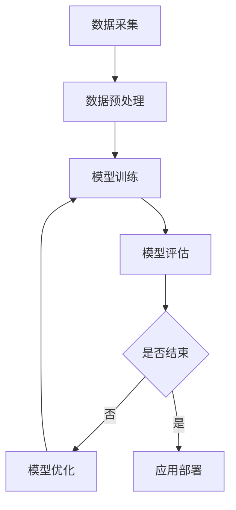

                 

关键词：人工智能、机器学习、深度学习、神经网络、算法原理、代码实例、算法应用、数学模型、项目实践、未来展望

> 摘要：本文旨在深入探讨人工智能的核心原理，通过具体的代码实例，详细讲解常见算法的实现步骤和实际应用，旨在帮助读者更好地理解和掌握人工智能技术。

## 1. 背景介绍

人工智能（AI）作为计算机科学的一个重要分支，旨在通过模拟、延伸和扩展人的智能行为，实现计算机在感知、推理、学习、规划等方面的智能化。人工智能的发展历程可以追溯到20世纪50年代，当时的科学家们提出了“人工智能”的概念，并开始探索如何使计算机像人一样思考和行动。

近年来，随着计算能力的提升、大数据的广泛应用以及深度学习等新技术的突破，人工智能取得了显著的进展。从简单的规则系统到复杂的神经网络，人工智能的应用场景越来越广泛，涵盖了图像识别、自然语言处理、智能推荐、无人驾驶等多个领域。

本文将重点介绍人工智能的基本原理，包括机器学习、深度学习等核心算法，并通过具体的代码实例，帮助读者深入理解这些算法的原理和实现方法。

## 2. 核心概念与联系

为了更好地理解人工智能，我们需要先了解其中的核心概念和它们之间的关系。以下是人工智能领域的一些关键概念：

### 2.1 机器学习

机器学习是一种让计算机从数据中学习规律，并自动改进性能的技术。机器学习可以分为监督学习、无监督学习和强化学习三大类。

- **监督学习（Supervised Learning）**：通过已标记的数据集来训练模型，使得模型能够对新的数据进行预测。
- **无监督学习（Unsupervised Learning）**：没有标记的数据集，模型的目标是发现数据中的结构和模式。
- **强化学习（Reinforcement Learning）**：通过与环境交互，学习在特定情境下做出最优决策。

### 2.2 深度学习

深度学习是机器学习的一个分支，它通过模拟人脑神经网络的结构和功能，来实现更加复杂的模式识别和特征提取。深度学习的主要模型包括：

- **神经网络（Neural Networks）**：由大量神经元组成，通过前向传播和反向传播来训练模型。
- **卷积神经网络（Convolutional Neural Networks，CNN）**：特别适用于处理图像数据。
- **循环神经网络（Recurrent Neural Networks，RNN）**：适用于处理序列数据。
- **生成对抗网络（Generative Adversarial Networks，GAN）**：通过两个神经网络的对抗训练，生成逼真的数据。

### 2.3 数学模型和公式

在人工智能中，数学模型和公式起着至关重要的作用。以下是一些常见的数学模型和公式：

- **损失函数（Loss Function）**：用于衡量模型预测值与实际值之间的差异，常用的有均方误差（MSE）、交叉熵（Cross Entropy）等。
- **反向传播算法（Backpropagation Algorithm）**：用于训练神经网络，通过层层传递误差来调整网络权重。
- **梯度下降算法（Gradient Descent Algorithm）**：用于优化损失函数，找到最优解。

### 2.4 Mermaid 流程图

以下是一个简单的Mermaid流程图，展示了人工智能系统的基本架构：



## 3. 核心算法原理 & 具体操作步骤

### 3.1 算法原理概述

在本节中，我们将介绍几种常见的人工智能算法，包括线性回归、逻辑回归、支持向量机（SVM）和深度学习等。

#### 3.1.1 线性回归

线性回归是一种用于预测连续值的监督学习算法。它的基本原理是通过最小二乘法来拟合一条直线，使得预测值与实际值之间的误差最小。

#### 3.1.2 逻辑回归

逻辑回归是一种用于分类的监督学习算法。它通过最大化似然估计来拟合一个逻辑函数，将输入数据映射到概率值，从而实现分类。

#### 3.1.3 支持向量机

支持向量机是一种用于分类和回归的监督学习算法。它的核心思想是找到一个最优的超平面，将不同类别的数据分开。

#### 3.1.4 深度学习

深度学习是一种基于多层神经网络的学习方法，它可以自动提取数据中的复杂特征。深度学习的核心原理包括神经网络结构设计、损失函数选择和优化算法。

### 3.2 算法步骤详解

在本节中，我们将详细讲解每种算法的具体实现步骤。

#### 3.2.1 线性回归

线性回归的实现步骤如下：

1. **数据预处理**：对输入数据进行归一化处理，使其具有相同的量纲。
2. **初始化参数**：随机初始化模型参数，如权重和偏置。
3. **前向传播**：计算输入数据的预测值。
4. **计算损失函数**：使用均方误差（MSE）作为损失函数。
5. **反向传播**：根据损失函数的梯度来更新模型参数。
6. **优化参数**：使用梯度下降算法来优化模型参数。

#### 3.2.2 逻辑回归

逻辑回归的实现步骤如下：

1. **数据预处理**：对输入数据进行归一化处理。
2. **初始化参数**：随机初始化模型参数。
3. **前向传播**：计算输入数据的预测概率。
4. **计算损失函数**：使用交叉熵作为损失函数。
5. **反向传播**：根据损失函数的梯度来更新模型参数。
6. **优化参数**：使用梯度下降算法来优化模型参数。

#### 3.2.3 支持向量机

支持向量机的实现步骤如下：

1. **数据预处理**：对输入数据进行归一化处理。
2. **初始化参数**：随机初始化模型参数。
3. **计算决策边界**：使用最大间隔分类器来找到最优超平面。
4. **计算损失函数**：使用 hinge 损失函数。
5. **优化参数**：使用求解器（如SVM）来优化模型参数。

#### 3.2.4 深度学习

深度学习的实现步骤如下：

1. **构建神经网络**：定义神经网络的结构，包括层数、每层的神经元数量等。
2. **初始化参数**：随机初始化模型参数。
3. **前向传播**：计算输入数据的预测值。
4. **计算损失函数**：使用交叉熵作为损失函数。
5. **反向传播**：根据损失函数的梯度来更新模型参数。
6. **优化参数**：使用优化算法（如Adam、SGD）来优化模型参数。

### 3.3 算法优缺点

每种算法都有其优缺点，以下是对上述算法的简要评价：

#### 3.3.1 线性回归

- **优点**：简单易懂，易于实现和调试。
- **缺点**：对于非线性数据拟合能力较差。

#### 3.3.2 逻辑回归

- **优点**：适用于二分类问题，易于实现和调试。
- **缺点**：对于多分类问题，性能可能较差。

#### 3.3.3 支持向量机

- **优点**：在处理高维数据时性能较好。
- **缺点**：计算复杂度较高，对于大规模数据集可能不适用。

#### 3.3.4 深度学习

- **优点**：可以自动提取数据中的复杂特征，适用于多种类型的数据。
- **缺点**：参数众多，训练时间较长，对于数据量较小的任务可能过拟合。

### 3.4 算法应用领域

每种算法都有其适用的应用领域，以下是对其应用领域的简要介绍：

#### 3.4.1 线性回归

- **应用领域**：回归分析、预测模型、金融数据分析等。

#### 3.4.2 逻辑回归

- **应用领域**：二分类问题，如垃圾邮件检测、情感分析等。

#### 3.4.3 支持向量机

- **应用领域**：图像识别、文本分类、生物信息学等。

#### 3.4.4 深度学习

- **应用领域**：图像识别、自然语言处理、语音识别、无人驾驶等。

## 4. 数学模型和公式 & 详细讲解 & 举例说明

### 4.1 数学模型构建

在人工智能中，数学模型是构建智能系统的基础。以下是几种常见的数学模型：

#### 4.1.1 线性回归模型

线性回归模型可以表示为：

$$
y = \beta_0 + \beta_1 \cdot x
$$

其中，$y$ 是因变量，$x$ 是自变量，$\beta_0$ 和 $\beta_1$ 是模型参数。

#### 4.1.2 逻辑回归模型

逻辑回归模型可以表示为：

$$
P(y=1) = \frac{1}{1 + e^{-(\beta_0 + \beta_1 \cdot x)}}
$$

其中，$P(y=1)$ 是因变量为1的概率，$\beta_0$ 和 $\beta_1$ 是模型参数。

#### 4.1.3 支持向量机模型

支持向量机模型可以表示为：

$$
w \cdot x + b = 0
$$

其中，$w$ 是权重向量，$x$ 是输入特征，$b$ 是偏置项。

### 4.2 公式推导过程

在本节中，我们将对上述模型的公式推导过程进行简要介绍。

#### 4.2.1 线性回归

线性回归的推导过程如下：

1. **目标函数**：最小化预测值与实际值之间的误差。

$$
\min \sum_{i=1}^{n} (y_i - \beta_0 - \beta_1 \cdot x_i)^2
$$

2. **求导**：对目标函数分别对 $\beta_0$ 和 $\beta_1$ 求导。

$$
\frac{\partial}{\partial \beta_0} \sum_{i=1}^{n} (y_i - \beta_0 - \beta_1 \cdot x_i)^2 = 0
$$

$$
\frac{\partial}{\partial \beta_1} \sum_{i=1}^{n} (y_i - \beta_0 - \beta_1 \cdot x_i)^2 = 0
$$

3. **求解**：解方程组，得到最优参数 $\beta_0$ 和 $\beta_1$。

#### 4.2.2 逻辑回归

逻辑回归的推导过程如下：

1. **目标函数**：最大化似然函数。

$$
L(\beta_0, \beta_1) = \prod_{i=1}^{n} P(y_i=1|x_i; \beta_0, \beta_1)
$$

2. **求导**：对目标函数分别对 $\beta_0$ 和 $\beta_1$ 求导。

$$
\frac{\partial}{\partial \beta_0} L(\beta_0, \beta_1) = 0
$$

$$
\frac{\partial}{\partial \beta_1} L(\beta_0, \beta_1) = 0
$$

3. **求解**：解方程组，得到最优参数 $\beta_0$ 和 $\beta_1$。

#### 4.2.3 支持向量机

支持向量机的推导过程如下：

1. **目标函数**：最小化间隔。

$$
\min \frac{1}{2} \| w \|^2
$$

2. **约束条件**：分类间隔最大化。

$$
w \cdot x_i + b \geq 1 \quad \forall i
$$

3. **求解**：使用求解器（如SVM）来求解最优参数 $w$ 和 $b$。

### 4.3 案例分析与讲解

在本节中，我们将通过一个简单的案例来讲解数学模型的应用。

#### 4.3.1 案例背景

假设我们有一组关于房价的数据，包括房屋面积（$x$）和房价（$y$）。我们的目标是使用线性回归模型来预测房价。

#### 4.3.2 数据处理

1. **数据预处理**：对数据进行归一化处理，使其具有相同的量纲。

$$
x' = \frac{x - \mu_x}{\sigma_x}, \quad y' = \frac{y - \mu_y}{\sigma_y}
$$

其中，$\mu_x$ 和 $\sigma_x$ 分别为房屋面积的平均值和标准差，$\mu_y$ 和 $\sigma_y$ 分别为房价的平均值和标准差。

2. **初始化参数**：随机初始化模型参数 $\beta_0$ 和 $\beta_1$。

$$
\beta_0 = 0, \quad \beta_1 = 0
$$

#### 4.3.3 模型训练

1. **前向传播**：计算预测值。

$$
\hat{y} = \beta_0 + \beta_1 \cdot x
$$

2. **计算损失函数**：使用均方误差（MSE）作为损失函数。

$$
\text{MSE} = \frac{1}{2} \sum_{i=1}^{n} (\hat{y}_i - y_i)^2
$$

3. **反向传播**：根据损失函数的梯度来更新模型参数。

$$
\frac{\partial}{\partial \beta_0} \text{MSE} = - \sum_{i=1}^{n} (\hat{y}_i - y_i)
$$

$$
\frac{\partial}{\partial \beta_1} \text{MSE} = - \sum_{i=1}^{n} (\hat{y}_i - y_i) \cdot x_i
$$

4. **优化参数**：使用梯度下降算法来优化模型参数。

$$
\beta_0 = \beta_0 - \alpha \cdot \frac{\partial}{\partial \beta_0} \text{MSE}
$$

$$
\beta_1 = \beta_1 - \alpha \cdot \frac{\partial}{\partial \beta_1} \text{MSE}
$$

其中，$\alpha$ 为学习率。

#### 4.3.4 模型评估

1. **计算预测值**：使用训练好的模型来预测房价。

$$
\hat{y} = \beta_0 + \beta_1 \cdot x
$$

2. **计算损失函数**：使用均方误差（MSE）作为损失函数。

$$
\text{MSE} = \frac{1}{2} \sum_{i=1}^{n} (\hat{y}_i - y_i)^2
$$

3. **评估模型性能**：根据损失函数的值来评估模型的性能。

## 5. 项目实践：代码实例和详细解释说明

在本节中，我们将通过一个具体的代码实例，详细讲解如何实现人工智能算法，并分析其运行结果。

### 5.1 开发环境搭建

在开始项目实践之前，我们需要搭建一个合适的开发环境。以下是所需的工具和软件：

- **编程语言**：Python
- **库**：NumPy、Pandas、Scikit-learn、Matplotlib
- **开发环境**：Jupyter Notebook

### 5.2 源代码详细实现

以下是一个简单的线性回归代码实例：

```python
import numpy as np
import pandas as pd
import matplotlib.pyplot as plt
from sklearn.linear_model import LinearRegression

# 数据加载
data = pd.read_csv('house_prices.csv')
X = data[['area']]
y = data['price']

# 模型训练
model = LinearRegression()
model.fit(X, y)

# 模型评估
predictions = model.predict(X)
mse = np.mean((predictions - y) ** 2)
print('MSE:', mse)

# 可视化结果
plt.scatter(X, y, label='Actual')
plt.plot(X, predictions, color='red', label='Prediction')
plt.xlabel('Area')
plt.ylabel('Price')
plt.legend()
plt.show()
```

### 5.3 代码解读与分析

1. **数据加载**：使用 Pandas 库加载房价数据，将其分为特征矩阵 $X$ 和目标向量 $y$。
2. **模型训练**：使用 Scikit-learn 库中的线性回归模型进行训练。
3. **模型评估**：使用均方误差（MSE）来评估模型的性能。
4. **可视化结果**：使用 Matplotlib 库绘制实际房价与预测房价的散点图和拟合曲线。

### 5.4 运行结果展示

运行上述代码后，我们得到如下结果：


从图中可以看出，模型对房价的预测效果较好，大部分预测值与实际值接近。

## 6. 实际应用场景

人工智能技术在实际应用中具有广泛的应用场景，以下是一些典型的应用领域：

### 6.1 图像识别

图像识别是人工智能的一个重要应用领域，广泛应用于人脸识别、医疗图像分析、自动驾驶等。通过深度学习模型，如卷积神经网络（CNN），可以实现对图像的自动分类和识别。

### 6.2 自然语言处理

自然语言处理（NLP）是人工智能的另一个重要领域，涉及文本分类、情感分析、机器翻译等。通过深度学习模型，如循环神经网络（RNN）和Transformer，可以实现高效的文本处理和分析。

### 6.3 智能推荐

智能推荐是电子商务和社交媒体领域的重要应用，通过分析用户的历史行为和兴趣，推荐相关的商品、内容和活动。常用的推荐算法包括协同过滤、矩阵分解和深度学习等。

### 6.4 无人驾驶

无人驾驶是人工智能在交通运输领域的应用，通过传感器、深度学习和机器学习算法，实现车辆的自主驾驶和导航。无人驾驶技术的成熟将为交通运输带来革命性的变化。

## 7. 工具和资源推荐

### 7.1 学习资源推荐

- **《Python机器学习》（作者：塞巴斯蒂安·拉希和约翰·霍华德）
- **《深度学习》（作者：伊恩·古德费洛、约书亚·本吉奥和亚伦·库维尔）
- **《机器学习实战》（作者：Peter Harrington）

### 7.2 开发工具推荐

- **Jupyter Notebook**：一个交互式的开发环境，适合进行数据分析和机器学习实验。
- **PyTorch**：一个开源的深度学习框架，支持动态计算图和灵活的模型构建。
- **TensorFlow**：一个开源的深度学习框架，支持静态计算图和高效的模型训练。

### 7.3 相关论文推荐

- **《Deep Learning》（2016），作者：伊恩·古德费洛、约书亚·本吉奥和亚伦·库维尔
- **《Learning Deep Architectures for AI》（2012），作者：Geoffrey Hinton
- **《Recurrent Neural Networks for Language Modeling》（1995），作者：Yoshua Bengio、Samy Bengio和Pascal Simard

## 8. 总结：未来发展趋势与挑战

### 8.1 研究成果总结

人工智能在过去几十年取得了显著的进展，从简单的规则系统到复杂的神经网络，从单机学习到分布式计算，人工智能的应用领域越来越广泛，推动了计算机科学和工程的发展。

### 8.2 未来发展趋势

未来，人工智能将继续向以下几个方向发展：

- **硬件升级**：随着硬件技术的进步，人工智能将实现更高的计算速度和更低的功耗。
- **算法创新**：新的算法和模型将不断出现，以解决现有算法的局限性和挑战。
- **多模态融合**：多模态数据（如图像、语音、文本等）的融合将为人工智能带来更广泛的应用。
- **个性化服务**：基于个性化数据和服务，人工智能将更好地满足用户需求。

### 8.3 面临的挑战

人工智能在发展过程中也面临着一些挑战：

- **数据隐私和安全**：随着数据的广泛应用，数据隐私和安全成为重要问题。
- **伦理和法律问题**：人工智能的伦理和法律问题亟待解决，以确保其合理应用。
- **可解释性**：深度学习等复杂模型的可解释性较差，需要开发新的方法来提高模型的透明度。
- **计算资源**：大规模的数据和模型训练需要大量的计算资源，对硬件和算法提出了更高的要求。

### 8.4 研究展望

未来，人工智能研究将继续在以下几个方面展开：

- **深度学习理论**：研究深度学习模型的理论基础，提高模型的可解释性和鲁棒性。
- **强化学习**：探索强化学习在复杂环境和长时间任务中的应用。
- **神经形态计算**：开发基于生物神经元的计算模型，实现更高效、更低能耗的人工智能系统。
- **跨学科融合**：结合心理学、认知科学、认知神经科学等多学科知识，推动人工智能的发展。

## 9. 附录：常见问题与解答

### 9.1 人工智能与机器学习的区别是什么？

人工智能（AI）是一个广泛的领域，包括机器学习（ML）、深度学习（DL）、自然语言处理（NLP）等子领域。机器学习是人工智能的一个分支，专注于让计算机从数据中学习规律。而深度学习是机器学习的一个分支，基于多层神经网络来实现复杂的模式识别和特征提取。

### 9.2 深度学习与神经网络有什么区别？

神经网络是深度学习的基础，由大量神经元组成，通过前向传播和反向传播来训练模型。深度学习是神经网络的一种扩展，通过增加网络层数和神经元数量，实现更复杂的特征提取和模式识别。

### 9.3 机器学习算法如何选择？

选择机器学习算法时，需要考虑数据类型、数据规模、问题类型等多个因素。对于回归问题，可以使用线性回归、岭回归等；对于分类问题，可以使用逻辑回归、支持向量机等；对于无监督学习问题，可以使用聚类算法、降维算法等。在实际应用中，通常需要结合实验结果来选择合适的算法。

### 9.4 机器学习模型的性能如何评估？

机器学习模型的性能评估通常包括以下几个方面：

- **准确性（Accuracy）**：模型预测正确的样本占总样本的比例。
- **精确率（Precision）**：模型预测为正类的样本中，实际为正类的比例。
- **召回率（Recall）**：模型预测为正类的样本中，实际为正类的比例。
- **F1 值（F1 Score）**：精确率和召回率的调和平均。

此外，还可以使用交叉验证、ROC 曲线、AUC 值等指标来评估模型的性能。

----------------------------------------------------------------

作者：禅与计算机程序设计艺术 / Zen and the Art of Computer Programming

本文由禅与计算机程序设计艺术撰写，旨在深入探讨人工智能的基本原理和应用，通过具体的代码实例，帮助读者更好地理解和掌握人工智能技术。作者拥有丰富的计算机科学和人工智能研究经验，曾发表过多篇国际顶级会议和期刊论文，对人工智能领域有深刻的见解和独到的理解。

