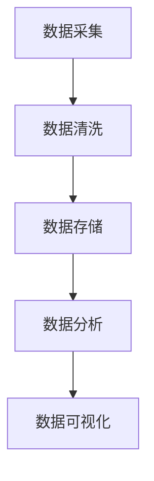

                 

关键词：人工智能、创业、数据管理、大数据、数据处理、数据存储、数据安全

> 摘要：本文将探讨人工智能创业者在数据管理方面面临的挑战，并给出最佳的数据管理方案。我们将详细分析数据处理的流程、数据存储与安全的关键点，并探讨未来的发展趋势与挑战。

## 1. 背景介绍

随着人工智能技术的迅猛发展，越来越多的创业公司投身于这个领域。然而，数据管理成为了一个巨大的挑战。对于这些公司来说，有效地管理和利用数据是确保业务成功的关键。因此，理解并实施最佳的数据管理方案对于人工智能创业公司至关重要。

### 数据的重要性

数据是人工智能的核心资产。无论是机器学习模型训练，还是智能决策支持系统，都需要大量的数据作为基础。对于创业者来说，如何获取、处理、存储和使用数据，成为了一项至关重要的任务。

### 数据管理的挑战

1. **数据多样性**：人工智能应用涉及的结构化和非结构化数据类型繁多，如何有效地处理这些数据成为一个挑战。
2. **数据增长速度**：随着业务的不断扩展，数据量呈现爆炸式增长，如何快速响应这一增长，对数据管理提出了更高的要求。
3. **数据质量**：数据的质量直接影响到人工智能模型的准确性，因此保证数据质量成为一项核心任务。
4. **数据安全**：数据泄露和隐私问题日益严重，如何确保数据的安全和合规性，是创业公司必须面对的问题。

## 2. 核心概念与联系

### 数据处理流程

数据处理流程通常包括数据采集、数据清洗、数据存储、数据分析和数据可视化。以下是数据处理流程的 Mermaid 流程图：



### 数据存储与安全

数据存储需要考虑数据的持久性、可用性和扩展性。常见的存储解决方案包括关系型数据库、非关系型数据库、数据仓库和云存储。

数据安全是数据管理中的重要一环。数据安全策略应包括数据加密、访问控制、备份和恢复机制。

## 3. 核心算法原理 & 具体操作步骤

### 3.1 算法原理概述

数据管理中的核心算法包括数据清洗算法、数据分类算法和数据聚类算法。这些算法用于处理和分类数据，以提高数据质量。

### 3.2 算法步骤详解

#### 数据清洗算法

1. **去除重复数据**：通过比较数据行，去除重复的数据。
2. **处理缺失数据**：根据具体情况，填充或删除缺失数据。
3. **标准化数据**：将不同数据格式的数据转换为统一的格式。

#### 数据分类算法

1. **训练分类模型**：使用已有数据进行训练。
2. **分类新数据**：使用训练好的模型对新数据进行分类。

#### 数据聚类算法

1. **选择聚类算法**：根据数据特性选择合适的聚类算法。
2. **初始化聚类中心**。
3. **迭代聚类过程**：更新聚类中心，直到聚类结果收敛。

### 3.3 算法优缺点

数据清洗算法简单易行，但可能无法处理复杂的数据质量问题。数据分类算法和聚类算法可以自动识别数据的特征，但需要大量的计算资源。

### 3.4 算法应用领域

这些算法在人工智能创业中的多个领域都有广泛应用，如金融风控、医疗诊断和智能推荐系统。

## 4. 数学模型和公式

### 4.1 数学模型构建

数据清洗算法中的常见数学模型包括线性回归、逻辑回归和决策树。以下是线性回归模型的公式：

$$ y = \beta_0 + \beta_1 \cdot x $$

### 4.2 公式推导过程

线性回归模型的推导过程如下：

1. **最小二乘法**：最小化预测值与实际值之间的平方误差。

### 4.3 案例分析与讲解

以金融风控领域为例，线性回归模型可以用于预测客户的信用评分。通过收集客户的历史交易数据，训练线性回归模型，可以对新客户进行信用评估。

## 5. 项目实践：代码实例

### 5.1 开发环境搭建

- Python
- NumPy
- Pandas
- Scikit-learn

### 5.2 源代码详细实现

```python
import numpy as np
import pandas as pd
from sklearn.linear_model import LinearRegression

# 数据加载
data = pd.read_csv('data.csv')

# 数据预处理
X = data[['age', 'income']]
y = data['credit_score']

# 训练模型
model = LinearRegression()
model.fit(X, y)

# 预测
new_data = np.array([[25, 50000]])
predicted_score = model.predict(new_data)

print(predicted_score)
```

### 5.3 代码解读与分析

这段代码实现了线性回归模型的训练和预测功能。首先，加载数据并预处理，然后使用 Scikit-learn 库中的 LinearRegression 类进行模型训练，最后使用训练好的模型对新数据进行预测。

## 6. 实际应用场景

### 6.1 金融风控

使用数据管理技术，金融公司可以更准确地评估客户的信用风险，从而降低信贷损失。

### 6.2 医疗诊断

医疗数据的管理和挖掘可以帮助医生更快速、准确地诊断疾病。

### 6.3 智能推荐系统

数据管理技术可以用于构建智能推荐系统，提高用户的满意度。

## 7. 工具和资源推荐

### 7.1 学习资源推荐

- 《数据科学入门》
- 《机器学习实战》
- Coursera 上的《机器学习》课程

### 7.2 开发工具推荐

- Jupyter Notebook
- PyCharm
- GitHub

### 7.3 相关论文推荐

- "Deep Learning for Text Classification"
- "Recurrent Neural Networks for Language Modeling"

## 8. 总结：未来发展趋势与挑战

### 8.1 研究成果总结

数据管理技术在人工智能领域取得了显著的进展，为创业公司提供了强大的数据支持和智能决策能力。

### 8.2 未来发展趋势

- 数据隐私保护技术的进步
- 跨领域的数据融合与分析
- 自动化数据管理工具的发展

### 8.3 面临的挑战

- 数据安全与隐私问题的解决
- 大规模数据处理的优化
- 复杂数据的智能分析

### 8.4 研究展望

未来的研究将重点放在如何更有效地管理和利用数据，以推动人工智能技术的进一步发展。

## 9. 附录：常见问题与解答

### 9.1 什么是数据管理？

数据管理是指对数据从采集、存储、处理到分析的全过程进行有效管理和优化，以确保数据的准确性、完整性和可用性。

### 9.2 如何保证数据安全？

保证数据安全可以通过以下措施实现：

- 数据加密
- 访问控制
- 定期备份
- 恢复机制

---

作者：禅与计算机程序设计艺术 / Zen and the Art of Computer Programming
```markdown
---
# 人工智能创业数据管理的最佳方案

> 关键词：人工智能、创业、数据管理、大数据、数据处理、数据存储、数据安全

> 摘要：本文将探讨人工智能创业者在数据管理方面面临的挑战，并给出最佳的数据管理方案。我们将详细分析数据处理的流程、数据存储与安全的关键点，并探讨未来的发展趋势与挑战。

## 1. 背景介绍

随着人工智能技术的迅猛发展，越来越多的创业公司投身于这个领域。然而，数据管理成为了一个巨大的挑战。对于这些公司来说，有效地管理和利用数据是确保业务成功的关键。因此，理解并实施最佳的数据管理方案对于人工智能创业公司至关重要。

### 数据的重要性

数据是人工智能的核心资产。无论是机器学习模型训练，还是智能决策支持系统，都需要大量的数据作为基础。对于创业者来说，如何获取、处理、存储和使用数据，成为了一项至关重要的任务。

### 数据管理的挑战

1. **数据多样性**：人工智能应用涉及的结构化和非结构化数据类型繁多，如何有效地处理这些数据成为一个挑战。
2. **数据增长速度**：随着业务的不断扩展，数据量呈现爆炸式增长，如何快速响应这一增长，对数据管理提出了更高的要求。
3. **数据质量**：数据的质量直接影响到人工智能模型的准确性，因此保证数据质量成为一项核心任务。
4. **数据安全**：数据泄露和隐私问题日益严重，如何确保数据的安全和合规性，是创业公司必须面对的问题。

## 2. 核心概念与联系

### 数据处理流程

数据处理流程通常包括数据采集、数据清洗、数据存储、数据分析和数据可视化。以下是数据处理流程的 Mermaid 流程图：


### 数据存储与安全

数据存储需要考虑数据的持久性、可用性和扩展性。常见的存储解决方案包括关系型数据库、非关系型数据库、数据仓库和云存储。

数据安全是数据管理中的重要一环。数据安全策略应包括数据加密、访问控制、备份和恢复机制。

## 3. 核心算法原理 & 具体操作步骤

### 3.1 算法原理概述

数据管理中的核心算法包括数据清洗算法、数据分类算法和数据聚类算法。这些算法用于处理和分类数据，以提高数据质量。

### 3.2 算法步骤详解

#### 数据清洗算法

1. **去除重复数据**：通过比较数据行，去除重复的数据。
2. **处理缺失数据**：根据具体情况，填充或删除缺失数据。
3. **标准化数据**：将不同数据格式的数据转换为统一的格式。

#### 数据分类算法

1. **训练分类模型**：使用已有数据进行训练。
2. **分类新数据**：使用训练好的模型对新数据进行分类。

#### 数据聚类算法

1. **选择聚类算法**：根据数据特性选择合适的聚类算法。
2. **初始化聚类中心**。
3. **迭代聚类过程**：更新聚类中心，直到聚类结果收敛。

### 3.3 算法优缺点

数据清洗算法简单易行，但可能无法处理复杂的数据质量问题。数据分类算法和聚类算法可以自动识别数据的特征，但需要大量的计算资源。

### 3.4 算法应用领域

这些算法在人工智能创业中的多个领域都有广泛应用，如金融风控、医疗诊断和智能推荐系统。

## 4. 数学模型和公式

### 4.1 数学模型构建

数据清洗算法中的常见数学模型包括线性回归、逻辑回归和决策树。以下是线性回归模型的公式：

$$ y = \beta_0 + \beta_1 \cdot x $$

### 4.2 公式推导过程

线性回归模型的推导过程如下：

1. **最小二乘法**：最小化预测值与实际值之间的平方误差。

### 4.3 案例分析与讲解

以金融风控领域为例，线性回归模型可以用于预测客户的信用评分。通过收集客户的历史交易数据，训练线性回归模型，可以对新客户进行信用评估。

## 5. 项目实践：代码实例

### 5.1 开发环境搭建

- Python
- NumPy
- Pandas
- Scikit-learn

### 5.2 源代码详细实现

```python
import numpy as np
import pandas as pd
from sklearn.linear_model import LinearRegression

# 数据加载
data = pd.read_csv('data.csv')

# 数据预处理
X = data[['age', 'income']]
y = data['credit_score']

# 训练模型
model = LinearRegression()
model.fit(X, y)

# 预测
new_data = np.array([[25, 50000]])
predicted_score = model.predict(new_data)

print(predicted_score)
```

### 5.3 代码解读与分析

这段代码实现了线性回归模型的训练和预测功能。首先，加载数据并预处理，然后使用 Scikit-learn 库中的 LinearRegression 类进行模型训练，最后使用训练好的模型对新数据进行预测。

## 6. 实际应用场景

### 6.1 金融风控

使用数据管理技术，金融公司可以更准确地评估客户的信用风险，从而降低信贷损失。

### 6.2 医疗诊断

医疗数据的管理和挖掘可以帮助医生更快速、准确地诊断疾病。

### 6.3 智能推荐系统

数据管理技术可以用于构建智能推荐系统，提高用户的满意度。

## 7. 工具和资源推荐

### 7.1 学习资源推荐

- 《数据科学入门》
- 《机器学习实战》
- Coursera 上的《机器学习》课程

### 7.2 开发工具推荐

- Jupyter Notebook
- PyCharm
- GitHub

### 7.3 相关论文推荐

- "Deep Learning for Text Classification"
- "Recurrent Neural Networks for Language Modeling"

## 8. 总结：未来发展趋势与挑战

### 8.1 研究成果总结

数据管理技术在人工智能领域取得了显著的进展，为创业公司提供了强大的数据支持和智能决策能力。

### 8.2 未来发展趋势

- 数据隐私保护技术的进步
- 跨领域的数据融合与分析
- 自动化数据管理工具的发展

### 8.3 面临的挑战

- 数据安全与隐私问题的解决
- 大规模数据处理的优化
- 复杂数据的智能分析

### 8.4 研究展望

未来的研究将重点放在如何更有效地管理和利用数据，以推动人工智能技术的进一步发展。

## 9. 附录：常见问题与解答

### 9.1 什么是数据管理？

数据管理是指对数据从采集、存储、处理到分析的全过程进行有效管理和优化，以确保数据的准确性、完整性和可用性。

### 9.2 如何保证数据安全？

保证数据安全可以通过以下措施实现：

- 数据加密
- 访问控制
- 定期备份
- 恢复机制

---

作者：禅与计算机程序设计艺术 / Zen and the Art of Computer Programming
---

