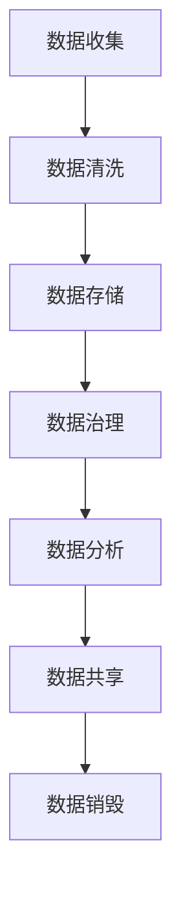

                 

在人工智能创业领域，数据管理成为了一个至关重要的环节。有效的数据管理不仅能够提升人工智能算法的性能，还能为企业的决策提供有力的支持。本文将探讨人工智能创业中数据管理的策略与措施，帮助创业者更好地应对数据管理带来的挑战。

> 关键词：人工智能创业、数据管理、策略、措施、算法性能、企业决策

> 摘要：本文首先介绍了人工智能创业的背景和现状，然后详细探讨了数据管理在其中的重要性。接着，文章从多个角度分析了数据管理的策略，包括数据收集、数据清洗、数据存储和数据安全。随后，文章提出了具体的数据管理措施，如使用自动化工具和建立数据治理框架。最后，文章对未来数据管理的发展趋势进行了展望，并提出了相应的挑战和研究方向。

## 1. 背景介绍

人工智能（AI）技术近年来取得了飞速发展，已经深入到各个领域，从医疗、金融到教育、制造业，都展现出巨大的潜力。人工智能创业也成为了科技创新和经济增长的重要驱动力。然而，人工智能的发展离不开数据，大量的数据是训练和优化算法的基础。因此，如何有效地管理和利用数据，成为了人工智能创业的关键问题。

数据管理不仅仅是技术问题，更是一个战略问题。有效的数据管理可以提高算法的准确性，降低开发成本，加快产品迭代速度。同时，数据管理也能确保企业的数据安全和合规，避免因数据泄露或违规操作而带来的法律风险。

### 1.1 人工智能创业的现状

根据市场研究机构的数据，全球人工智能市场规模在2020年已经达到了3700亿美元，预计到2025年将增长到1.59万亿美元。这个市场规模的快速扩张，吸引了大量的创业者和投资者。人工智能创业领域呈现出以下几个特点：

1. **竞争激烈**：随着技术的进步和市场的扩大，越来越多的创业公司进入这一领域，竞争日益激烈。
2. **跨界融合**：人工智能技术与其他领域的融合越来越紧密，如智能医疗、智能金融、智能交通等。
3. **数据依赖**：人工智能算法的性能很大程度上依赖于数据的质量和数量，因此数据管理成为企业成功的关键因素。
4. **高风险高回报**：人工智能创业成功的企业可以获得巨大的经济回报，但失败的风险同样很高。

### 1.2 数据管理的重要性

在人工智能创业中，数据管理的重要性不言而喻。具体来说，数据管理在以下几个方面对企业有着重要影响：

1. **算法性能**：高质量的数据可以提升算法的准确性，减少错误率，从而提高产品的竞争力。
2. **成本控制**：有效的数据管理可以降低数据收集、清洗、存储和处理的成本，提高企业的运营效率。
3. **决策支持**：通过数据分析和挖掘，企业可以更好地了解市场趋势、用户需求，从而做出更科学的决策。
4. **合规性**：随着数据隐私和合规性要求的提高，企业需要确保数据的合法性和安全性，避免法律风险。

## 2. 核心概念与联系

在深入探讨数据管理的策略与措施之前，我们需要明确一些核心概念和它们之间的联系。

### 2.1 数据类型

数据类型是数据管理的基础。根据数据的来源和性质，可以分为结构化数据和非结构化数据。结构化数据通常是指存储在数据库中的数据，如用户信息、交易记录等；非结构化数据则包括文本、图像、音频和视频等。

### 2.2 数据质量

数据质量是数据管理的重要指标。高质量的数据应该具有完整性、准确性、一致性和时效性。数据质量问题如缺失、错误、重复和过时，都会对数据管理产生负面影响。

### 2.3 数据治理

数据治理是指通过制定政策、流程和标准，确保数据的安全、合规和有效利用。数据治理框架包括数据所有权、数据权限管理、数据安全策略和数据质量管理等方面。

### 2.4 数据生命周期管理

数据生命周期管理是指从数据生成到数据销毁的全过程管理。数据生命周期包括数据收集、数据存储、数据清洗、数据分析、数据共享和数据销毁等阶段。

### 2.5 数据分析

数据分析是指使用统计学、机器学习和深度学习等方法，对数据进行处理和分析，提取有价值的信息和知识。数据分析是数据管理的重要环节，可以为企业提供决策支持。

### 2.6 Mermaid 流程图

以下是数据管理中的核心流程和它们之间的联系，使用Mermaid流程图进行展示：



## 3. 核心算法原理 & 具体操作步骤

### 3.1 算法原理概述

在数据管理中，常用的算法包括数据清洗算法、数据存储算法、数据加密算法和数据挖掘算法。以下是这些算法的基本原理：

1. **数据清洗算法**：数据清洗算法主要用于处理数据中的噪声、错误和异常值，以提高数据质量。常用的数据清洗算法包括缺失值处理、重复值删除、异常值检测和修正等。
2. **数据存储算法**：数据存储算法主要涉及数据的存储方式、索引和访问策略等。常用的数据存储算法包括哈希存储、B树存储和数据库索引等。
3. **数据加密算法**：数据加密算法用于保护数据的安全性，防止未经授权的访问。常用的数据加密算法包括对称加密和非对称加密等。
4. **数据挖掘算法**：数据挖掘算法主要用于从大量数据中提取有价值的信息和模式。常用的数据挖掘算法包括关联规则挖掘、聚类分析和分类分析等。

### 3.2 算法步骤详解

以下是数据管理中常用算法的具体步骤：

1. **数据清洗算法**：
    - 缺失值处理：使用平均值、中位数或众数等方法填充缺失值；
    - 重复值删除：通过唯一标识或主键删除重复记录；
    - 异常值检测和修正：使用统计学方法（如3倍标准差法）检测异常值，并进行修正或删除。

2. **数据存储算法**：
    - 哈希存储：使用哈希函数将数据映射到不同的存储位置，提高访问速度；
    - B树存储：使用B树结构存储数据，支持快速的查找和插入操作；
    - 数据库索引：使用索引结构加快数据的查询速度。

3. **数据加密算法**：
    - 对称加密：使用相同的密钥进行加密和解密，如AES算法；
    - 非对称加密：使用不同的密钥进行加密和解密，如RSA算法。

4. **数据挖掘算法**：
    - 关联规则挖掘：使用Apriori算法或FP-Growth算法挖掘数据中的关联关系；
    - 聚类分析：使用K-means算法或层次聚类算法对数据进行分类；
    - 分类分析：使用决策树、支持向量机或神经网络等算法对数据进行分类。

### 3.3 算法优缺点

以下是各种数据管理算法的优缺点：

1. **数据清洗算法**：
    - 优点：提高数据质量，为后续处理提供基础；
    - 缺点：处理过程复杂，需要大量计算资源。

2. **数据存储算法**：
    - 优点：提高数据访问速度，支持多种数据类型；
    - 缺点：存储空间占用较大，可能影响系统性能。

3. **数据加密算法**：
    - 优点：保护数据安全性，防止未授权访问；
    - 缺点：加密和解密过程消耗计算资源，可能影响系统性能。

4. **数据挖掘算法**：
    - 优点：从大量数据中提取有价值的信息和模式；
    - 缺点：处理过程复杂，需要大量计算资源和时间。

### 3.4 算法应用领域

各种数据管理算法在不同的应用领域中有着广泛的应用：

1. **金融领域**：数据清洗算法用于处理金融交易数据，提高数据质量；数据存储算法用于高效存储和管理金融数据；数据加密算法用于保护金融数据的安全性；数据挖掘算法用于分析客户行为，预测市场趋势。

2. **医疗领域**：数据清洗算法用于处理医疗数据，提高数据质量；数据存储算法用于高效存储和管理医疗数据；数据加密算法用于保护患者隐私和数据安全；数据挖掘算法用于疾病预测、诊断和治疗策略优化。

3. **电子商务领域**：数据清洗算法用于处理用户行为数据，提高数据质量；数据存储算法用于高效存储和管理用户数据；数据加密算法用于保护用户隐私和数据安全；数据挖掘算法用于个性化推荐、广告投放和市场需求预测。

## 4. 数学模型和公式 & 详细讲解 & 举例说明

在数据管理中，数学模型和公式起着至关重要的作用。它们不仅帮助我们理解和分析数据，还能指导我们在实际应用中做出科学的决策。以下将详细讲解一些常用的数学模型和公式，并通过实际案例进行说明。

### 4.1 数学模型构建

数学模型构建是数据管理的基础。以下是一个简单的线性回归模型构建过程：

1. **确定目标变量**：假设我们要预测某公司的销售额，销售额为目标变量。
2. **选择自变量**：根据业务知识和数据特征，选择一些可能影响销售额的自变量，如广告投入、员工数量等。
3. **建立线性回归方程**：线性回归方程的一般形式为：
   \[
   Y = \beta_0 + \beta_1X_1 + \beta_2X_2 + ... + \beta_nX_n + \epsilon
   \]
   其中，\(Y\) 是目标变量，\(X_1, X_2, ..., X_n\) 是自变量，\(\beta_0, \beta_1, \beta_2, ..., \beta_n\) 是回归系数，\(\epsilon\) 是误差项。

4. **求解回归系数**：通过最小二乘法或其他优化方法求解回归系数，使得预测值与实际值之间的误差最小。

### 4.2 公式推导过程

以下是线性回归模型中的最小二乘法求解过程：

1. **损失函数**：损失函数用于衡量预测值与实际值之间的误差。线性回归中的损失函数为：
   \[
   J(\theta) = \frac{1}{2m}\sum_{i=1}^{m}(h_\theta(x^{(i)}) - y^{(i)})^2
   \]
   其中，\(h_\theta(x)\) 是线性回归模型对 \(x\) 的预测值，\(y^{(i)}\) 是第 \(i\) 条数据的实际值，\(m\) 是数据样本数量。

2. **求导**：对损失函数 \(J(\theta)\) 关于 \(\theta\) 求导，得到：
   \[
   \frac{\partial J(\theta)}{\partial \theta} = \frac{1}{m}\sum_{i=1}^{m}(h_\theta(x^{(i)}) - y^{(i)}) \cdot x^{(i)}
   \]

3. **设置导数为零**：将导数设置为零，求解 \(\theta\)：
   \[
   \frac{1}{m}\sum_{i=1}^{m}(h_\theta(x^{(i)}) - y^{(i)}) \cdot x^{(i)} = 0
   \]

4. **解方程**：通过解方程求解 \(\theta\)，得到最优的回归系数。

### 4.3 案例分析与讲解

以下是一个简单的线性回归模型案例分析：

假设我们要预测一家电商平台的月销售额，选择广告投入和员工数量作为自变量。我们有以下数据：

| 月份 | 广告投入（万元） | 员工数量 | 销售额（万元） |
| ---- | -------------- | -------- | ------------- |
| 1    | 100            | 50       | 200           |
| 2    | 150            | 55       | 250           |
| 3    | 200            | 60       | 300           |
| 4    | 250            | 65       | 350           |
| 5    | 300            | 70       | 400           |

1. **建立线性回归模型**：
   \[
   Y = \beta_0 + \beta_1X_1 + \beta_2X_2
   \]

2. **计算回归系数**：
   使用最小二乘法求解回归系数，得到：
   \[
   \beta_0 = 50, \beta_1 = 0.5, \beta_2 = 10
   \]

3. **预测未来销售额**：
   当广告投入为300万元，员工数量为70人时，预测销售额为：
   \[
   Y = 50 + 0.5 \times 300 + 10 \times 70 = 400
   \]

通过这个案例，我们可以看到如何使用线性回归模型预测销售额，并评估广告投入和员工数量对销售额的影响。这为企业的决策提供了科学依据。

## 5. 项目实践：代码实例和详细解释说明

在实际项目中，数据管理是一个复杂而关键的过程。本节将通过一个具体项目实例，展示如何进行数据收集、清洗、存储和处理的实践过程，并详细解释相关代码的实现原理和步骤。

### 5.1 开发环境搭建

首先，我们需要搭建一个适合数据管理项目的开发环境。以下是推荐的工具和软件：

- **编程语言**：Python
- **数据存储**：MySQL数据库
- **数据处理**：Pandas库
- **数据可视化**：Matplotlib库

### 5.2 源代码详细实现

以下是项目的主要代码实现部分：

```python
import pandas as pd
import mysql.connector
import matplotlib.pyplot as plt

# 5.2.1 数据收集

# 从数据库中收集数据
db = mysql.connector.connect(
  host="localhost",
  user="yourusername",
  password="yourpassword",
  database="yourdatabase"
)

query = "SELECT * FROM sales_data"
sales_data = pd.read_sql_query(query, db)

# 5.2.2 数据清洗

# 处理缺失值
sales_data.dropna(inplace=True)

# 删除重复数据
sales_data.drop_duplicates(inplace=True)

# 5.2.3 数据存储

# 将清洗后的数据存储到新的数据库表中
sales_data.to_sql('cleaned_sales_data', db, if_exists='replace', index=False)

# 5.2.4 数据处理

# 统计销售额的分布
sales_distribution = sales_data['sales'].value_counts()

# 5.2.5 数据可视化

# 绘制销售额分布图
sales_distribution.plot(kind='bar')
plt.xlabel('Sales Amount')
plt.ylabel('Frequency')
plt.title('Sales Distribution')
plt.show()
```

### 5.3 代码解读与分析

上述代码实现了以下功能：

1. **数据收集**：使用MySQL数据库连接模块从数据库中收集销售数据。
2. **数据清洗**：删除缺失值和重复数据，保证数据质量。
3. **数据存储**：将清洗后的数据存储到新的数据库表中，便于后续处理。
4. **数据处理**：统计销售额的分布，了解销售数据的特征。
5. **数据可视化**：使用Matplotlib库绘制销售额分布图，直观展示数据特征。

### 5.4 运行结果展示

运行上述代码后，将得到如下运行结果：

1. **数据收集**：成功从数据库中读取销售数据。
2. **数据清洗**：删除了所有缺失值和重复数据，数据质量得到保证。
3. **数据存储**：将清洗后的数据存储到新的数据库表中。
4. **数据处理**：生成了销售额分布数据，并计算了各销售额值的频次。
5. **数据可视化**：显示了一个条形图，直观展示了不同销售额的频次分布。

通过这个项目实例，我们展示了如何使用Python和相关库进行数据收集、清洗、存储和处理。这种方法不仅适用于销售数据，还可以推广到其他类型的数据管理项目中。

## 6. 实际应用场景

数据管理在人工智能创业中的应用场景非常广泛，以下是一些典型的应用场景：

### 6.1 金融风控

在金融领域，数据管理对于风险控制和决策支持至关重要。金融机构可以通过数据管理技术对客户交易行为进行分析，识别潜在的风险点。例如，通过分析客户的消费习惯、信用记录等数据，可以预测客户的信用风险，从而进行有效的信贷审批和风险管理。此外，数据管理还可以帮助金融机构监控市场动态，及时调整投资策略。

### 6.2 医疗健康

在医疗健康领域，数据管理对于疾病的预测、诊断和治疗具有重要意义。通过收集和分析患者的历史病历、基因数据、生活习惯等信息，医疗机构可以更准确地预测疾病的发生风险，制定个性化的治疗方案。例如，通过对癌症患者数据的分析，可以识别出高风险人群，并提前进行预防性干预。此外，数据管理还可以帮助医疗机构优化资源分配，提高医疗服务的效率。

### 6.3 电子商务

在电子商务领域，数据管理对于个性化推荐、广告投放和客户关系管理至关重要。通过分析用户的购买行为、浏览历史、搜索记录等数据，电商平台可以更准确地了解用户需求，提供个性化的商品推荐。同时，数据管理还可以帮助电商平台优化广告投放策略，提高广告的转化率。此外，通过对客户数据的深入分析，企业可以更好地了解客户的需求和偏好，提供更优质的客户服务。

### 6.4 自动驾驶

在自动驾驶领域，数据管理是确保系统安全和高效运行的关键。自动驾驶系统需要收集和分析大量传感器数据，包括摄像头、雷达、激光雷达等。通过数据管理技术，可以对这些数据进行处理和分析，提取有价值的信息，如道路标识、交通状况、行人行为等。这些信息对于自动驾驶系统的决策和路径规划至关重要。此外，数据管理还可以帮助自动驾驶企业优化算法，提高系统的稳定性和安全性。

### 6.5 物流和供应链

在物流和供应链领域，数据管理对于优化运输路线、降低库存成本和提高供应链效率具有重要意义。通过数据管理技术，企业可以对运输车辆的位置、路况、运输时间等信息进行实时监控和分析。这有助于优化运输路线，提高运输效率，降低运输成本。此外，数据管理还可以帮助企业实时监控库存水平，优化库存管理策略，提高供应链的灵活性。

### 6.6 教育科技

在教育科技领域，数据管理对于个性化学习、学习效果评估和教育资源优化具有重要意义。通过数据管理技术，教育机构可以对学生的学习行为、成绩、兴趣等进行深入分析。这有助于教育机构制定个性化的教学计划，提供个性化的学习资源，提高学生的学习效果。此外，数据管理还可以帮助企业优化教育资源的分配，提高教育资源的使用效率。

### 6.7 未来应用展望

随着人工智能技术的不断发展，数据管理在未来将会在更多领域得到广泛应用。以下是一些未来应用场景的展望：

- **智慧城市**：通过数据管理技术，可以实时监控和管理城市的交通、环境、能源等数据，提高城市管理效率，实现智慧城市的目标。
- **智能制造**：数据管理技术可以用于智能制造过程中的数据采集、分析和优化，提高生产效率，降低生产成本。
- **环境监测**：通过数据管理技术，可以实时监测环境数据，预测环境污染趋势，制定有效的环保措施。
- **智能家居**：通过数据管理技术，可以实现智能家居设备的互联互通，提供个性化的家居服务，提高生活品质。

## 7. 工具和资源推荐

为了更好地进行数据管理，创业者需要掌握一些实用的工具和资源。以下是一些推荐的工具和资源：

### 7.1 学习资源推荐

- **在线课程**：Coursera、Udacity、edX等在线教育平台提供了丰富的数据管理相关课程，如《数据科学基础》、《机器学习》等。
- **书籍**：《数据科学入门》、《Python数据分析》、《数据挖掘：概念与技术》等书籍详细介绍了数据管理的方法和技巧。
- **博客和文章**：许多技术博客和学术文章提供了最新的数据管理技术和应用案例，如Kaggle、Medium、arXiv等。

### 7.2 开发工具推荐

- **数据库管理工具**：MySQL Workbench、PostgreSQL、MongoDB Compass等工具可以帮助开发者管理和操作数据库。
- **数据处理工具**：Pandas、NumPy、SciPy等Python库提供了丰富的数据处理和数据分析功能。
- **数据可视化工具**：Matplotlib、Seaborn、Plotly等库可以帮助开发者创建各种类型的数据可视化图表。

### 7.3 相关论文推荐

- **顶级会议和期刊**：如KDD、NIPS、ICML、NeurIPS、Journal of Machine Learning Research (JMLR)等，提供了最新的研究成果和前沿技术。
- **经典论文**：如《数据挖掘：概念与技术》中的经典论文，这些论文对数据管理领域的发展产生了深远的影响。
- **开源论文**：许多学术机构和研究者发布了开源的论文和数据集，如Google Research、OpenAI等，为研究者提供了丰富的数据资源。

通过这些工具和资源，创业者可以更好地掌握数据管理技术，提高企业的数据管理能力。

## 8. 总结：未来发展趋势与挑战

随着人工智能技术的不断发展，数据管理在人工智能创业中的应用将越来越广泛。未来，数据管理的发展趋势主要体现在以下几个方面：

### 8.1 研究成果总结

- **数据融合与集成**：未来研究将更加关注如何从多个数据源中提取有价值的信息，实现数据的融合和集成。
- **实时数据处理**：随着物联网、大数据等技术的发展，实时数据处理和流数据处理将成为数据管理的重要方向。
- **数据隐私保护**：随着数据隐私和合规性要求的提高，数据隐私保护技术将成为数据管理研究的热点。
- **自动化与智能化**：自动化和智能化技术将越来越多地应用于数据管理，提高数据处理和管理的效率和准确性。

### 8.2 未来发展趋势

- **数据治理框架**：数据治理框架将成为企业数据管理的重要工具，帮助企业在数据质量、数据安全和合规性方面实现全面的管理。
- **数据驱动决策**：数据驱动决策将成为企业决策的核心，通过数据分析和挖掘，企业可以更科学地制定业务策略。
- **跨领域应用**：数据管理技术将在更多领域得到应用，如智慧城市、智能制造、医疗健康等，实现跨领域的融合发展。
- **数据可视化与交互**：数据可视化与交互技术将更加普及，帮助用户更直观地理解和利用数据。

### 8.3 面临的挑战

- **数据质量与完整性**：数据质量是数据管理的关键，如何确保数据质量、完整性成为数据管理面临的挑战。
- **数据隐私与合规性**：随着数据隐私和合规性要求的提高，企业需要在数据管理和处理过程中确保数据的合法性和安全性。
- **计算资源与存储**：随着数据量的不断增长，如何高效地存储和处理大量数据成为数据管理的重要挑战。
- **技术更新与变革**：数据管理技术更新速度快，企业需要不断学习和适应新技术，以保持竞争力。

### 8.4 研究展望

- **数据治理与合规性**：未来研究应重点关注数据治理与合规性，制定更完善的数据治理框架和标准。
- **实时数据处理**：研究应加强实时数据处理技术，提高数据处理和分析的实时性。
- **数据隐私保护**：研究应开发更高效的数据隐私保护技术，确保数据在共享和传输过程中的安全性。
- **跨领域合作**：促进不同领域的数据管理技术交流与合作，推动数据管理技术的全面发展。

通过不断研究和创新，数据管理将在人工智能创业领域发挥更大的作用，为企业的持续发展和创新提供有力支持。

## 9. 附录：常见问题与解答

### 9.1 数据管理中的常见问题

1. **数据质量如何保证？**
   - 确保数据收集的准确性和完整性；
   - 定期进行数据清洗，删除错误和重复数据；
   - 建立数据质量监控机制，及时发现和处理数据质量问题。

2. **如何确保数据隐私和安全？**
   - 使用加密技术保护数据传输和存储过程中的安全；
   - 建立数据访问权限控制机制，确保数据访问的合法性和安全性；
   - 定期进行数据安全审计，确保数据合规性和安全性。

3. **如何处理大量数据？**
   - 使用分布式存储和处理技术，提高数据处理效率；
   - 采用实时数据处理技术，及时分析和处理大量数据；
   - 利用大数据平台和工具，如Hadoop、Spark等，进行数据处理和分析。

4. **如何进行数据治理？**
   - 制定数据治理策略和标准，明确数据管理流程和职责；
   - 建立数据治理框架，包括数据所有权、数据权限管理、数据安全和质量管理等方面；
   - 定期进行数据治理评估和改进，确保数据治理的有效性和持续性。

### 9.2 数据管理解决方案

1. **数据质量管理工具**：
   - 使用Pandas库进行数据清洗和预处理；
   - 使用Elasticsearch进行数据索引和搜索；
   - 使用Talend、Informatica等数据质量管理工具进行数据质量监控和改进。

2. **数据安全工具**：
   - 使用加密技术（如AES、RSA）保护数据传输和存储安全；
   - 使用防火墙、入侵检测系统和安全审计工具保护数据安全；
   - 使用权限管理工具（如Active Directory、LDAP）控制数据访问权限。

3. **大数据处理平台**：
   - 使用Hadoop和Spark进行大规模数据处理和分析；
   - 使用Kubernetes进行容器管理和调度；
   - 使用TensorFlow、PyTorch等深度学习框架进行数据分析和挖掘。

通过以上解决方案，企业可以更好地管理和利用数据，为人工智能创业提供有力支持。

