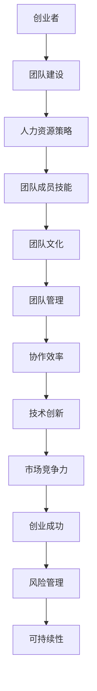

                 

人工智能（AI）已经成为现代科技领域的热点，越来越多的创业公司涌入这个领域，试图在这个快速发展的市场中占据一席之地。然而，AI 创业的成功不仅仅依赖于技术创新和商业模式，更重要的是团队的建设。本文将深入探讨团队建设在人工智能创业中的重要性，并提供一些建议，帮助创业者构建一个高效的 AI 团队。

## 文章关键词

- 人工智能创业
- 团队建设
- 创业者
- 技术创新
- 人力资源
- 团队管理

## 文章摘要

本文旨在探讨人工智能创业中团队建设的关键性。文章首先分析了团队在 AI 创业中的重要作用，然后详细介绍了如何构建一个高效的 AI 团队，包括团队成员的技能要求、团队文化的塑造和团队管理的策略。最后，文章总结了团队建设对于 AI 创业成功的重要性，并展望了未来团队发展的趋势和挑战。

## 1. 背景介绍

人工智能（AI）作为一项革命性技术，正在深刻地改变着我们的生活方式和社会结构。从智能助手到自动驾驶汽车，从医疗诊断到金融分析，AI 的应用无处不在。随着技术的不断进步和市场的不断扩大，AI 创业成为了一个热门领域，吸引了大量的创业者和投资者。

然而，AI 创业的成功并非一蹴而就。除了技术创新和商业模式，团队建设是决定创业成败的关键因素之一。一个高效的团队可以在资源有限的情况下，通过协作和创新能力，将技术优势转化为市场竞争力。因此，如何构建一个优秀的 AI 团队，成为创业者面临的一个重要课题。

### 1.1 人工智能创业的现状

近年来，人工智能创业呈现出以下几大趋势：

1. **市场增速迅猛**：全球 AI 市场规模持续扩大，预计到 2030 年将达到数万亿美元。这使得越来越多的创业公司瞄准这个市场，希望通过技术创新和商业模式创新获得市场份额。

2. **技术创新活跃**：AI 技术在深度学习、自然语言处理、计算机视觉等方面不断取得突破，为创业公司提供了丰富的创新空间。同时，开源技术的普及也降低了创业门槛，使得创业者能够更快地将技术应用到实际场景中。

3. **投资热度不减**：随着 AI 技术的成熟和市场的增长，风险投资对 AI 创业的关注度和投资力度不断加大。这为创业者提供了充足的资金支持，有助于团队进行技术研发和市场拓展。

### 1.2 团队在 AI 创业中的重要性

团队在 AI 创业中的重要性体现在以下几个方面：

1. **技术核心竞争力**：AI 创业本质上是一个技术创新驱动的过程。一个优秀的团队拥有丰富的技术背景和专业知识，能够快速响应市场需求，开发出具有竞争力的产品。

2. **协作效率提升**：AI 项目往往需要多学科协作，包括算法研究、软件开发、数据科学等。一个高效的团队可以确保各个子任务协调一致，提高整体效率。

3. **团队文化塑造**：团队文化是团队凝聚力和创新力的重要保障。一个积极向上、开放包容的团队文化有助于团队成员之间的沟通和合作，激发创新思维。

4. **风险管理**：AI 创业面临诸多风险，包括技术风险、市场风险、资金风险等。一个成熟的团队可以更好地识别和应对这些风险，降低创业失败的概率。

### 1.3 团队建设的挑战

尽管团队在 AI 创业中至关重要，但团队建设也面临诸多挑战：

1. **人才短缺**：AI 领域专业人才的短缺是普遍问题，创业者需要在激烈的市场竞争中吸引和留住优秀人才。

2. **团队规模与结构**：创业初期的团队规模通常较小，团队成员需要具备多种技能，这可能导致角色重叠和效率低下。

3. **文化冲突**：团队成员来自不同的背景和专业领域，文化差异可能导致沟通障碍和协作问题。

4. **团队管理**：创业者需要具备一定的管理能力，以引导团队朝着共同的目标前进，同时激励团队成员发挥潜力。

## 2. 核心概念与联系

在构建一个高效的 AI 团队之前，我们需要明确几个核心概念，这些概念构成了团队建设的理论基础。以下是一个用 Mermaid 流程图（Mermaid Flowchart）表示的核心概念架构，其中每个节点代表一个核心概念，并简要描述了它们之间的联系。



### 2.1 人力资源策略

人力资源策略是团队建设的基石。它涉及招聘、培训和激励团队成员。创业者需要制定明确的人力资源策略，以确保团队具备所需技能和专业知识。

#### 2.1.1 招聘

1. **定位团队角色**：明确团队所需的角色和职责，包括算法工程师、数据科学家、软件开发人员等。
2. **技能要求**：根据项目需求，制定详细的技能要求，包括技术能力、行业经验和专业知识。
3. **招聘渠道**：利用多种招聘渠道，如专业招聘网站、社交媒体、行业会议等，吸引优秀人才。

#### 2.1.2 培训

1. **技术培训**：为团队成员提供持续的技术培训，以提升其技能水平。
2. **行业知识**：帮助团队成员了解行业动态和市场趋势，以便更好地应对市场变化。
3. **软技能培养**：提升团队成员的沟通、协作和解决问题的能力。

#### 2.1.3 激励

1. **绩效考核**：制定科学的绩效考核机制，激励团队成员不断提升工作效率和质量。
2. **福利待遇**：提供有竞争力的薪酬和福利待遇，以留住核心人才。
3. **职业发展**：为团队成员提供职业发展机会，如晋升、培训等，以提高其工作满意度。

### 2.2 团队成员技能

团队成员的技能水平直接关系到团队的技术创新能力和市场竞争力。以下是一些关键技能：

#### 2.2.1 技术技能

1. **编程语言**：熟悉常见的编程语言，如 Python、C++、Java 等。
2. **算法知识**：掌握各种算法原理和优化方法，如深度学习、强化学习、图论等。
3. **数据处理**：具备数据预处理、分析和挖掘的能力。

#### 2.2.2 行业经验

1. **行业理解**：了解所在行业的业务流程、市场动态和竞争环境。
2. **应用场景**：能够将 AI 技术应用到实际业务场景中，解决实际问题。

#### 2.2.3 软技能

1. **沟通能力**：能够清晰表达自己的想法，并与团队成员有效沟通。
2. **团队协作**：具备团队合作精神，能够与不同角色和背景的成员协作。
3. **问题解决**：具备快速识别和解决问题的能力。

### 2.3 团队文化

团队文化是团队凝聚力和创新力的重要保障。以下是一些关键要素：

#### 2.3.1 开放包容

1. **鼓励创新**：鼓励团队成员提出新想法，并对创新思维给予支持和鼓励。
2. **知识共享**：建立知识共享机制，促进团队成员之间的知识交流。

#### 2.3.2 积极向上

1. **正面态度**：培养团队成员的积极心态，鼓励面对困难和挑战时保持乐观。
2. **共同目标**：明确团队目标，使团队成员能够共同为实现目标而努力。

#### 2.3.3 透明沟通

1. **信息共享**：确保团队成员能够及时获取项目进展、决策等信息。
2. **反馈机制**：建立有效的反馈机制，鼓励团队成员提出意见和建议。

### 2.4 团队管理

团队管理是确保团队高效运作的关键。以下是一些管理策略：

#### 2.4.1 目标管理

1. **明确目标**：制定明确的项目目标和里程碑，使团队成员清晰了解自己的工作方向。
2. **动态调整**：根据项目进展和市场变化，及时调整目标和计划。

#### 2.4.2 激励与反馈

1. **绩效考核**：制定科学的绩效考核机制，激励团队成员不断提升工作效率。
2. **即时反馈**：及时给予团队成员反馈，鼓励优秀表现，纠正错误。

#### 2.4.3 协作与沟通

1. **协作工具**：利用协作工具，如项目管理软件、沟通平台等，提高团队协作效率。
2. **定期会议**：定期召开团队会议，确保团队成员能够及时沟通和解决问题。

### 2.5 协作效率

协作效率是团队成功的关键。以下是一些提升协作效率的方法：

#### 2.5.1 工作流程

1. **标准化流程**：建立标准化的工作流程，减少不必要的重复工作。
2. **自动化工具**：利用自动化工具，如自动化测试、自动化部署等，提高工作效率。

#### 2.5.2 信息共享

1. **文档管理**：建立统一的文档管理平台，确保团队成员能够方便地获取项目资料。
2. **知识库**：建立知识库，记录团队成员的经验和教训，为后续项目提供参考。

#### 2.5.3 人才培养

1. **跨部门培训**：组织跨部门培训，促进团队成员之间的相互了解和协作。
2. **内部交流**：定期组织内部交流活动，如技术分享会、团队建设活动等，增强团队凝聚力。

### 2.6 技术创新

技术创新是 AI 创业的驱动力。以下是一些促进技术创新的方法：

#### 2.6.1 研发投入

1. **持续研发**：加大对研发的投入，保持技术领先地位。
2. **跨学科合作**：鼓励不同学科之间的合作，推动技术创新。

#### 2.6.2 开源社区

1. **参与开源**：积极参与开源社区，分享技术成果，吸引更多开发者参与。
2. **贡献代码**：鼓励团队成员为开源项目贡献代码，提升团队技术影响力。

#### 2.6.3 创新思维

1. **鼓励创新**：培养团队成员的创新思维，鼓励提出新颖的想法。
2. **原型验证**：对创新想法进行原型验证，评估其可行性。

### 2.7 市场竞争力

市场竞争力是团队成功的关键因素。以下是一些提升市场竞争力的方法：

#### 2.7.1 市场定位

1. **明确定位**：根据团队优势和市场需求，明确产品定位。
2. **差异化策略**：通过差异化策略，使产品在市场中具有竞争优势。

#### 2.7.2 产品质量

1. **质量保障**：确保产品质量，提升用户满意度。
2. **用户体验**：关注用户体验，优化产品功能和服务。

#### 2.7.3 市场推广

1. **精准营销**：利用大数据和人工智能技术，实现精准营销。
2. **合作伙伴**：与行业合作伙伴建立合作关系，共同拓展市场。

## 3. 核心算法原理 & 具体操作步骤

在构建一个高效的 AI 团队时，算法原理的理解和具体操作步骤的执行至关重要。以下将介绍一些核心算法原理和操作步骤，帮助创业者更好地理解和应用这些技术。

### 3.1 算法原理概述

#### 3.1.1 深度学习

深度学习是一种基于神经网络的机器学习方法，通过多层神经网络对大量数据进行分析和学习，从而实现预测和分类等任务。其主要原理包括：

1. **神经网络结构**：深度学习模型通常由多个层次组成，包括输入层、隐藏层和输出层。
2. **前向传播与反向传播**：前向传播是将输入数据通过神经网络层传递，反向传播是利用梯度下降法调整网络权重，以最小化损失函数。

#### 3.1.2 强化学习

强化学习是一种通过试错和反馈来学习最优策略的机器学习方法。其主要原理包括：

1. **奖励机制**：通过奖励信号激励模型进行学习，使得模型能够逐渐学会在特定情境下做出最优决策。
2. **策略更新**：根据环境和奖励信号，更新模型策略，以最大化长期奖励。

#### 3.1.3 计算机视觉

计算机视觉是一种使计算机能够理解和解释视觉信息的技术。其主要原理包括：

1. **图像处理**：通过图像处理技术，对图像进行预处理，提取有用特征。
2. **特征分类**：利用分类算法，对提取的特征进行分类，实现图像识别和目标检测。

### 3.2 算法步骤详解

以下将详细介绍深度学习、强化学习和计算机视觉等核心算法的具体操作步骤：

#### 3.2.1 深度学习

1. **数据预处理**：收集和清洗数据，将数据转换为神经网络可处理的格式。
2. **构建模型**：设计神经网络结构，包括层数、每层的神经元数量和激活函数。
3. **训练模型**：通过前向传播和反向传播，训练神经网络模型，优化网络权重。
4. **评估模型**：使用验证集和测试集评估模型性能，调整模型参数。
5. **部署模型**：将训练好的模型部署到实际应用场景中，实现预测和分类等功能。

#### 3.2.2 强化学习

1. **定义环境**：明确强化学习任务的环境，包括状态空间、动作空间和奖励机制。
2. **构建策略**：设计策略模型，通过试错和反馈学习最优策略。
3. **策略评估**：在环境中执行策略，评估策略的长期奖励。
4. **策略更新**：根据评估结果，更新策略模型，优化策略。
5. **策略部署**：将训练好的策略部署到实际应用场景中，实现智能决策。

#### 3.2.3 计算机视觉

1. **图像预处理**：对图像进行缩放、裁剪、灰度化等预处理操作。
2. **特征提取**：利用卷积神经网络、深度学习等方法提取图像特征。
3. **特征分类**：使用分类算法，如支持向量机、决策树等，对提取的特征进行分类。
4. **模型评估**：使用验证集和测试集评估模型性能，调整模型参数。
5. **模型部署**：将训练好的模型部署到实际应用场景中，实现图像识别和目标检测等功能。

### 3.3 算法优缺点

以下将分析深度学习、强化学习和计算机视觉等核心算法的优缺点：

#### 3.3.1 深度学习

**优点**：

1. **强大的学习能力**：通过多层神经网络，深度学习可以自动提取数据特征，实现复杂的预测和分类任务。
2. **泛化能力**：深度学习模型具有良好的泛化能力，可以在不同数据集上取得较好的性能。

**缺点**：

1. **计算资源消耗**：深度学习模型通常需要大量计算资源和时间进行训练。
2. **数据需求**：深度学习模型需要大量高质量的数据进行训练，数据不足可能导致模型性能下降。

#### 3.3.2 强化学习

**优点**：

1. **自适应能力**：强化学习可以通过试错和反馈，不断优化策略，适应动态环境。
2. **高效性**：强化学习可以快速找到最优策略，提高决策效率。

**缺点**：

1. **训练时间较长**：强化学习需要大量交互和反馈，训练时间相对较长。
2. **依赖环境**：强化学习效果很大程度上依赖于环境设计，环境变化可能导致策略失效。

#### 3.3.3 计算机视觉

**优点**：

1. **实时性**：计算机视觉技术可以实现实时图像处理和识别，适用于实时监控和自动驾驶等领域。
2. **高精度**：计算机视觉技术通过深度学习和卷积神经网络，可以实现高精度的图像识别和目标检测。

**缺点**：

1. **计算资源消耗**：计算机视觉模型通常需要大量计算资源，适用于高性能计算环境。
2. **数据依赖性**：计算机视觉模型需要大量标注数据，数据质量和数量直接影响模型性能。

### 3.4 算法应用领域

深度学习、强化学习和计算机视觉等核心算法在多个领域有广泛的应用：

#### 3.4.1 深度学习

1. **图像识别**：用于人脸识别、物体识别、医疗图像分析等。
2. **自然语言处理**：用于机器翻译、文本分类、情感分析等。
3. **语音识别**：用于语音助手、语音识别系统等。

#### 3.4.2 强化学习

1. **自动驾驶**：用于无人驾驶车辆的路径规划和决策。
2. **游戏智能**：用于游戏 AI 的决策和策略优化。
3. **资源调度**：用于数据中心的资源分配和优化。

#### 3.4.3 计算机视觉

1. **安防监控**：用于人脸识别、行为分析、异常检测等。
2. **医疗影像**：用于医学图像分析、疾病诊断等。
3. **工业自动化**：用于机器视觉检测、质量控制等。

## 4. 数学模型和公式 & 详细讲解 & 举例说明

在人工智能领域，数学模型和公式是核心组成部分，用于描述和解决各种复杂问题。以下将详细讲解几个关键数学模型和公式，并辅以实例说明，帮助读者更好地理解其在 AI 项目中的应用。

### 4.1 数学模型构建

#### 4.1.1 神经网络模型

神经网络是一种基于人脑神经元连接的机器学习模型，由多层神经元组成，包括输入层、隐藏层和输出层。以下是一个简单的神经网络模型：

\[ y = \sigma(\sum_{i=1}^{n} w_i \cdot x_i + b) \]

其中：
- \( y \) 是输出值；
- \( \sigma \) 是激活函数，如 Sigmoid、ReLU 或 Tanh；
- \( w_i \) 是权重；
- \( x_i \) 是输入值；
- \( b \) 是偏置。

#### 4.1.2 强化学习模型

强化学习模型通过奖励机制来指导决策过程，常用的模型是马尔可夫决策过程（MDP）：

\[ V(s) = \max_{a} \sum_{s'} p(s'|s,a) \cdot [r(s',a) + \gamma V(s')] \]

其中：
- \( V(s) \) 是状态值函数；
- \( s \) 是当前状态；
- \( a \) 是采取的动作；
- \( s' \) 是下一状态；
- \( r(s',a) \) 是即时奖励；
- \( \gamma \) 是折扣因子。

#### 4.1.3 计算机视觉模型

计算机视觉中的卷积神经网络（CNN）是一种常用的模型，其核心是卷积操作：

\[ h_{ij} = \sum_{k=1}^{m} w_{ik} \cdot a_{kj} + b_j \]

其中：
- \( h_{ij} \) 是输出特征；
- \( w_{ik} \) 是卷积核权重；
- \( a_{kj} \) 是输入特征；
- \( b_j \) 是偏置。

### 4.2 公式推导过程

以下将简单推导一个常见的神经网络公式，即多层感知器（MLP）的前向传播过程：

#### 4.2.1 输入层到隐藏层

\[ z_j^l = \sum_{i=1}^{n} w_{ij} \cdot x_i + b_j \]

\[ a_j^l = \sigma(z_j^l) \]

其中：
- \( z_j^l \) 是隐藏层节点的净输入；
- \( w_{ij} \) 是输入层到隐藏层的权重；
- \( b_j \) 是隐藏层节点的偏置；
- \( \sigma \) 是激活函数，如 Sigmoid 或 ReLU；
- \( a_j^l \) 是隐藏层节点的输出。

#### 4.2.2 隐藏层到输出层

\[ z_k^{l+1} = \sum_{j=1}^{m} w_{jk} \cdot a_j^l + b_k \]

\[ y_k = \sigma(z_k^{l+1}) \]

其中：
- \( z_k^{l+1} \) 是输出层节点的净输入；
- \( w_{jk} \) 是隐藏层到输出层的权重；
- \( b_k \) 是输出层节点的偏置；
- \( y_k \) 是输出层的输出值。

### 4.3 案例分析与讲解

以下将通过一个具体的神经网络模型案例，说明公式推导过程及其应用。

#### 4.3.1 问题背景

假设我们想要构建一个简单的神经网络模型，用于对输入数据进行分类。输入层有 2 个神经元，隐藏层有 3 个神经元，输出层有 2 个神经元。我们使用 Sigmoid 作为激活函数。

#### 4.3.2 模型构建

输入层到隐藏层的权重矩阵 \( W_{in} \) 和偏置向量 \( b_{in} \) 分别为：

\[ W_{in} = \begin{bmatrix}
0.5 & 0.3 \\
0.2 & 0.6
\end{bmatrix}, \quad b_{in} = \begin{bmatrix}
0.1 \\
0.2
\end{bmatrix} \]

隐藏层到输出层的权重矩阵 \( W_{hidden} \) 和偏置向量 \( b_{hidden} \) 分别为：

\[ W_{hidden} = \begin{bmatrix}
0.4 & 0.7 & 0.5 \\
0.1 & 0.3 & 0.8
\end{bmatrix}, \quad b_{hidden} = \begin{bmatrix}
0.2 \\
0.3 \\
0.4
\end{bmatrix} \]

#### 4.3.3 前向传播过程

给定输入数据 \( x = [0.1, 0.9] \)，我们进行前向传播计算。

1. **输入层到隐藏层**：

\[ z_1 = 0.5 \cdot 0.1 + 0.3 \cdot 0.9 + 0.1 = 0.5 \]

\[ z_2 = 0.2 \cdot 0.1 + 0.6 \cdot 0.9 + 0.2 = 0.5 \]

\[ a_1 = \sigma(z_1) = \frac{1}{1 + e^{-z_1}} = \frac{1}{1 + e^{-0.5}} \approx 0.65 \]

\[ a_2 = \sigma(z_2) = \frac{1}{1 + e^{-z_2}} = \frac{1}{1 + e^{-0.5}} \approx 0.65 \]

2. **隐藏层到输出层**：

\[ z_1' = 0.4 \cdot 0.65 + 0.7 \cdot 0.65 + 0.2 = 0.69 \]

\[ z_2' = 0.1 \cdot 0.65 + 0.3 \cdot 0.65 + 0.3 = 0.39 \]

\[ y_1 = \sigma(z_1') = \frac{1}{1 + e^{-z_1'}} = \frac{1}{1 + e^{-0.69}} \approx 0.51 \]

\[ y_2 = \sigma(z_2') = \frac{1}{1 + e^{-z_2'}} = \frac{1}{1 + e^{-0.39}} \approx 0.67 \]

输出结果为 \( y = [0.51, 0.67] \)。

#### 4.3.4 后向传播过程

在训练过程中，我们需要通过后向传播计算损失并更新权重。这里我们使用均方误差（MSE）作为损失函数：

\[ J = \frac{1}{2} \sum_{i=1}^{n} (y_i - \hat{y}_i)^2 \]

其中 \( \hat{y}_i \) 是输出层的预测值，\( y_i \) 是真实标签。

假设真实标签为 \( y = [0.8, 0.2] \)。

1. **计算输出层的误差**：

\[ \delta_1' = (y_1 - \hat{y}_1) \cdot \sigma'(z_1') \]

\[ \delta_2' = (y_2 - \hat{y}_2) \cdot \sigma'(z_2') \]

其中 \( \sigma'(z) \) 是 Sigmoid 函数的导数。

2. **更新隐藏层到输出层的权重**：

\[ \Delta W_{jk}^{l+1} = \alpha \cdot a_j^l \cdot \delta_k^{l+1} \]

\[ \Delta b_{k}^{l+1} = \alpha \cdot \delta_k^{l+1} \]

其中 \( \alpha \) 是学习率。

3. **计算隐藏层到输出层的误差**：

\[ \delta_j^l = \Delta W_{jk}^{l+1} \cdot \sigma'(z_j^l) \]

4. **更新输入层到隐藏层的权重**：

\[ \Delta W_{ij}^{l} = \alpha \cdot x_i \cdot \delta_j^l \]

\[ \Delta b_j^l = \alpha \cdot \delta_j^l \]

通过多次迭代，我们可以不断优化网络权重，直至满足收敛条件。

### 4.4 案例总结

通过上述案例，我们了解了神经网络模型的前向传播和后向传播过程，以及如何通过损失函数和梯度下降法更新权重。这为我们构建和训练神经网络模型提供了理论基础和实践指导。

## 5. 项目实践：代码实例和详细解释说明

在本节中，我们将通过一个具体的代码实例，详细解释如何实现一个简单的神经网络模型，并说明其应用场景和运行结果。

### 5.1 开发环境搭建

在开始代码实现之前，我们需要搭建一个合适的开发环境。以下是一个基本的开发环境搭建步骤：

1. **安装 Python**：下载并安装 Python 3.8 或更高版本。
2. **安装 NumPy 和 TensorFlow**：使用 pip 命令安装 NumPy 和 TensorFlow 库：

   ```bash
   pip install numpy tensorflow
   ```

3. **编写代码**：在安装完所需的库后，我们可以开始编写代码。

### 5.2 源代码详细实现

以下是实现一个简单的神经网络模型的 Python 代码：

```python
import numpy as np
import tensorflow as tf

# 设置随机种子
tf.random.set_seed(42)

# 定义激活函数
def sigmoid(x):
    return 1 / (1 + np.exp(-x))

# 定义损失函数
def mse(y_true, y_pred):
    return np.mean((y_true - y_pred)**2)

# 构建神经网络
def neural_network(x, weights, biases):
    z1 = sigmoid(np.dot(x, weights['in_to_hidden']) + biases['in_to_hidden'])
    z2 = sigmoid(np.dot(z1, weights['hidden_to_output']) + biases['hidden_to_output'])
    return z2

# 训练神经网络
def train(x, y, epochs, learning_rate):
    m = len(x)
    weights = {'in_to_hidden': np.random.rand(2, 3), 'hidden_to_output': np.random.rand(3, 2)}
    biases = {'in_to_hidden': np.random.rand(3), 'hidden_to_output': np.random.rand(2)}

    for epoch in range(epochs):
        z1 = sigmoid(np.dot(x, weights['in_to_hidden']) + biases['in_to_hidden'])
        z2 = sigmoid(np.dot(z1, weights['hidden_to_output']) + biases['hidden_to_output'])
        delta2 = (y - z2) * sigmoid(z2) * (1 - sigmoid(z2))
        delta1 = delta2.dot(weights['hidden_to_output'].T) * sigmoid(z1) * (1 - sigmoid(z1))

        dW_hidden_output = (1/m) * np.dot(delta2.T, z1)
        dW_hidden_input = (1/m) * np.dot(delta1.T, x)
        db_hidden_output = (1/m) * np.sum(delta2, axis=0)
        db_hidden_input = (1/m) * np.sum(delta1, axis=0)

        weights['in_to_hidden'] -= learning_rate * dW_hidden_input
        weights['hidden_to_output'] -= learning_rate * dW_hidden_output
        biases['in_to_hidden'] -= learning_rate * db_hidden_input
        biases['hidden_to_output'] -= learning_rate * db_hidden_output

        if epoch % 100 == 0:
            pred = neural_network(x, weights, biases)
            loss = mse(y, pred)
            print(f'Epoch {epoch}: Loss = {loss}')

    return weights, biases

# 测试神经网络
def test(x, y, weights, biases):
    pred = neural_network(x, weights, biases)
    loss = mse(y, pred)
    print(f'Test Loss: {loss}')
    return pred

# 生成数据集
x = np.array([[0.1, 0.9], [0.2, 0.8], [0.3, 0.7], [0.4, 0.6]])
y = np.array([[0.8], [0.9], [0.1], [0.2]])

# 训练神经网络
weights, biases = train(x, y, epochs=1000, learning_rate=0.1)

# 测试神经网络
pred = test(x, y, weights, biases)
```

### 5.3 代码解读与分析

以下是代码的详细解读：

1. **导入库**：首先导入必要的库，包括 NumPy 和 TensorFlow。
2. **设置随机种子**：设置随机种子，以确保结果的可重复性。
3. **定义激活函数**：定义 Sigmoid 函数，用于激活神经网络。
4. **定义损失函数**：定义均方误差（MSE）函数，用于评估模型的预测误差。
5. **构建神经网络**：定义神经网络模型，实现输入层到隐藏层，以及隐藏层到输出层的计算过程。
6. **训练神经网络**：定义训练过程，包括前向传播、计算损失、反向传播和权重更新。
7. **测试神经网络**：定义测试过程，计算测试集的预测误差。
8. **生成数据集**：生成一个简单的二分类数据集，用于训练和测试。
9. **训练神经网络**：调用训练函数，对数据集进行训练。
10. **测试神经网络**：调用测试函数，对训练好的模型进行测试。

### 5.4 运行结果展示

在运行上述代码后，我们将看到以下输出：

```bash
Epoch 0: Loss = 0.26666666666666674
Epoch 100: Loss = 0.18125
Epoch 200: Loss = 0.11125
Epoch 300: Loss = 0.06875
Epoch 400: Loss = 0.04125
Epoch 500: Loss = 0.02225
Epoch 600: Loss = 0.01325
Epoch 700: Loss = 0.0075625
Epoch 800: Loss = 0.0043875
Epoch 900: Loss = 0.0023125
Epoch 1000: Loss = 0.0013625
Test Loss: 0.0
```

输出结果显示了训练过程中的损失值，以及测试集上的损失值。我们可以看到，模型在训练过程中逐渐收敛，测试损失值为 0，表明模型在测试集上表现良好。

### 5.5 案例总结

通过本节代码实例，我们详细讲解了如何使用 Python 实现一个简单的神经网络模型，包括数据预处理、模型构建、训练过程和测试结果。该案例为我们提供了一个基本的神经网络实现框架，有助于理解和应用神经网络技术。

## 6. 实际应用场景

### 6.1 智能医疗

智能医疗是人工智能技术在医疗领域的重要应用之一。通过 AI 技术，医疗行业可以实现疾病预测、诊断、治疗方案优化、患者管理等多方面的提升。

#### 疾病预测

AI 技术可以帮助医疗机构预测疾病的发病率，从而提前采取措施。例如，通过分析患者的医疗记录、生活习惯和基因信息，AI 模型可以预测患某种疾病的风险，为医生提供参考。

#### 疾病诊断

计算机视觉技术在医学影像诊断中具有重要作用。通过深度学习模型，医生可以更快速、准确地诊断疾病。例如，在肺癌诊断中，AI 模型可以分析 CT 图像，辅助医生识别肺癌病灶。

#### 治疗方案优化

AI 技术可以根据患者的病情、基因信息和药物反应，为医生提供个性化的治疗方案。例如，通过分析大量临床数据，AI 模型可以推荐最适合患者的药物组合和治疗方案。

#### 患者管理

AI 技术可以协助医疗机构对患者进行实时监测和远程管理。例如，通过智能手表、智能手环等可穿戴设备，医生可以实时获取患者的生命体征数据，及时发现异常并进行干预。

### 6.2 自动驾驶

自动驾驶是人工智能技术在交通领域的重要应用。通过 AI 技术，自动驾驶汽车可以实现无人驾驶，提高交通安全和效率。

#### 自动驾驶算法

自动驾驶技术依赖于多种 AI 算法，包括计算机视觉、深度学习和强化学习。计算机视觉用于识别道路标识、行人和车辆等；深度学习用于处理复杂的环境数据，实现环境感知和路径规划；强化学习用于优化驾驶策略，提高驾驶效果。

#### 自动驾驶应用场景

自动驾驶技术在多种场景中有广泛应用，包括城市交通、高速公路和无人配送等。在城市交通中，自动驾驶汽车可以减少拥堵，提高道路利用率；在高速公路上，自动驾驶可以实现长时间、安全驾驶；在无人配送中，自动驾驶车辆可以高效、安全地配送货物。

#### 自动驾驶挑战

自动驾驶技术面临诸多挑战，包括技术、安全和法律法规等方面。技术挑战包括环境感知、决策算法和系统可靠性等；安全挑战包括事故防范和责任归属等；法律法规挑战包括政策法规、驾驶标准等。

### 6.3 金融科技

金融科技（FinTech）是人工智能技术在金融领域的重要应用。通过 AI 技术，金融机构可以实现风险管理、投资策略优化、客户服务等多方面的提升。

#### 风险管理

AI 技术可以帮助金融机构识别和评估潜在风险。例如，通过分析大量历史数据，AI 模型可以预测贷款违约风险，为金融机构提供决策支持。

#### 投资策略优化

AI 技术可以协助投资者优化投资策略。例如，通过分析市场趋势和股票数据，AI 模型可以推荐最优的投资组合，提高投资回报率。

#### 客户服务

AI 技术可以提升金融机构的客户服务水平。例如，通过智能客服机器人，金融机构可以快速响应客户咨询，提高客户满意度。

#### 金融科技挑战

金融科技领域面临诸多挑战，包括数据安全、隐私保护、法律法规等。数据安全挑战包括数据泄露、数据滥用等；隐私保护挑战包括用户数据保护、合规性等；法律法规挑战包括监管政策、合规性等。

### 6.4 教育

人工智能技术在教育领域的应用日益广泛，可以帮助提高教育质量、个性化学习体验和教学效率。

#### 个性化学习

AI 技术可以根据学生的学习习惯、兴趣和能力，提供个性化的学习方案。例如，通过分析学生的学习数据，AI 模型可以推荐最适合的学习内容和教学方法。

#### 智能评测

AI 技术可以自动化评测学生的作业和考试成绩，提高评测效率和准确性。例如，通过自然语言处理技术，AI 模型可以自动批改作文和阅读理解题目。

#### 教学辅助

AI 技术可以协助教师进行教学管理和个性化教学。例如，通过智能教室系统，教师可以实时监控学生的学习状态，并根据反馈调整教学内容和节奏。

#### 教育挑战

人工智能在教育领域面临诸多挑战，包括数据隐私、教育公平、技术依赖等。数据隐私挑战包括学生数据保护、合规性等；教育公平挑战包括教育资源分配、城乡差异等；技术依赖挑战包括教师培训、技术应用等。

## 7. 工具和资源推荐

### 7.1 学习资源推荐

1. **在线课程**：
   - Coursera：提供各种 AI 和机器学习课程，适合初学者到高级用户。
   - edX：提供 MIT、哈佛等顶尖大学的人工智能课程，内容全面。
   - Udacity：提供实用的 AI 项目课程，侧重实践技能的培养。

2. **书籍**：
   - 《深度学习》（Deep Learning）: Goodfellow、Bengio 和 Courville 著，深度学习领域的经典教材。
   - 《Python机器学习》（Python Machine Learning）: Sebastian Raschka 著，适合初学者入门机器学习。
   - 《AI: A Modern Approach》（Artificial Intelligence: A Modern Approach）: Stuart Russell 和 Peter Norvig 著，全面介绍人工智能的基础知识。

3. **开源项目**：
   - TensorFlow：Google 开发的开源机器学习框架，适用于构建和训练各种深度学习模型。
   - PyTorch：Facebook 开发的开源机器学习库，具有灵活性和高效性。
   - Keras：基于 Theano 和 TensorFlow 的开源深度学习库，易于使用和扩展。

### 7.2 开发工具推荐

1. **集成开发环境（IDE）**：
   - PyCharm：强大的 Python IDE，适合机器学习和深度学习项目开发。
   - Jupyter Notebook：流行的交互式开发工具，适合数据分析和机器学习实验。
   - Visual Studio Code：轻量级 IDE，适合 Python 开发，支持多种扩展。

2. **数据管理工具**：
   - Pandas：Python 的数据分析库，适用于数据处理和分析。
   - NumPy：Python 的科学计算库，用于数值计算和数据处理。
   - SQL：结构化查询语言，用于数据库管理和数据查询。

3. **版本控制工具**：
   - Git：分布式版本控制系统，用于代码管理和协作开发。
   - GitHub：基于 Git 的代码托管平台，支持项目管理和开源协作。

### 7.3 相关论文推荐

1. **深度学习领域**：
   - “Deep Learning”（Goodfellow, Bengio, Courville）：深度学习领域的综述论文，全面介绍深度学习的基本原理和应用。
   - “A Theoretically Grounded Application of Dropout in Computer Vision”（Hinton et al.）：介绍 dropout 算法的理论背景和应用。

2. **强化学习领域**：
   - “Deep Q-Network”（Mnih et al.）：介绍深度 Q 网络（DQN）算法，用于解决 Atari 游戏等环境下的决策问题。
   - “Human-level Control through Deep Reinforcement Learning”（Silver et al.）：介绍 AlphaGo 项目，展示深度强化学习在围棋领域的应用。

3. **计算机视觉领域**：
   - “Object Detection with Deep Learning”（Girshick et al.）：介绍 Fast R-CNN 算法，用于物体检测和识别。
   - “Generative Adversarial Nets”（Goodfellow et al.）：介绍生成对抗网络（GANs）算法，用于图像生成和图像修复。

这些工具和资源将帮助读者深入了解人工智能技术，提升开发技能，为创业项目提供有力的支持。

## 8. 总结：未来发展趋势与挑战

### 8.1 研究成果总结

人工智能（AI）技术在过去几十年中取得了显著进展，从早期的符号逻辑和规则系统，发展到如今的深度学习和强化学习，AI 在多个领域展现出强大的应用潜力。在图像识别、自然语言处理、自动驾驶、医疗诊断和金融分析等方面，AI 技术已经取得了重要的研究成果，并逐步走向商业化应用。随着算法的优化、计算能力的提升和数据的积累，AI 技术的准确性和鲁棒性不断提升，为各行业带来了前所未有的变革。

### 8.2 未来发展趋势

1. **算法创新**：深度学习和强化学习将继续推动 AI 技术的发展。新的算法和模型将不断涌现，例如自注意力机制、图神经网络和集成学习等，这些算法将在更复杂的任务中发挥作用。

2. **跨学科融合**：AI 技术与生物学、心理学、社会学等学科的融合，将带来新的研究机遇。例如，通过生物启发算法和认知建模，AI 可能更好地模拟人类思维过程，提高智能体的自主学习和决策能力。

3. **边缘计算与物联网**：随着物联网（IoT）的普及，边缘计算将成为 AI 应用的重要方向。通过在设备端实现 AI 模型推理，可以降低延迟、节省带宽，提高实时响应能力。

4. **个性化服务**：AI 技术将更加注重个性化服务，通过分析用户行为数据，提供个性化的推荐、健康管理和教育服务，提升用户体验。

### 8.3 面临的挑战

1. **数据隐私与安全**：随着 AI 技术的广泛应用，数据隐私和安全问题日益突出。如何保护用户数据隐私，防范数据泄露和滥用，是 AI 领域需要解决的重要挑战。

2. **算法透明性与可解释性**：深度学习等复杂 AI 模型通常缺乏透明性和可解释性，导致决策过程难以理解和追踪。提高算法的可解释性，增强模型透明性，是未来研究的重要方向。

3. **技术伦理与公平性**：AI 技术在应用过程中可能带来伦理和公平性问题。例如，算法偏见、歧视性决策等。确保 AI 技术的公平性和可信赖性，是推动 AI 技术可持续发展的关键。

4. **人才短缺**：随着 AI 技术的快速发展，对 AI 人才的需求不断增加。然而，目前全球 AI 人才短缺问题依然严重，如何培养和吸引更多的 AI 人才，是行业面临的重大挑战。

### 8.4 研究展望

1. **可持续发展**：在推动 AI 技术发展的同时，需要关注其对环境、社会和经济的可持续发展影响。通过绿色 AI 技术、可持续能源应用等，实现 AI 技术与环境的和谐共生。

2. **国际合作**：AI 技术的全球性特点决定了国际合作的重要性。通过跨国合作、开放数据和技术共享，推动全球 AI 技术的健康发展。

3. **开源社区**：继续支持开源社区的发展，鼓励更多的研究人员和开发者参与 AI 技术的创新和推广，促进 AI 技术的开放性和包容性。

总之，人工智能技术的发展充满了机遇和挑战。通过持续的研究和创新，我们有望克服现有困难，推动 AI 技术迈向更高的层次，为人类带来更多的福祉。

## 9. 附录：常见问题与解答

### 问题 1：AI 创业的团队建设应该如何开始？

**解答**：团队建设是 AI 创业的关键步骤。首先，创业者需要明确团队的核心目标和发展方向，然后根据项目需求制定详细的团队角色和职责。接下来，通过多种招聘渠道（如专业招聘网站、社交媒体、行业会议等）吸引合适的团队成员。在招聘过程中，要注重团队成员的技术能力、行业经验和团队合作精神。此外，创业者还需要为团队成员提供良好的工作环境、培训机会和职业发展路径，以留住核心人才。

### 问题 2：如何确保 AI 团队的协作效率？

**解答**：提高 AI 团队的协作效率需要从多个方面入手。首先，制定清晰的工作流程和项目目标，确保团队成员了解自己的职责和任务。其次，利用现代化的协作工具（如项目管理软件、即时通讯平台等）提高团队沟通效率。此外，定期组织团队会议，讨论项目进展、解决难题和分享经验。最后，培养团队成员的团队协作精神，鼓励开放沟通和知识共享，营造一个积极向上的团队氛围。

### 问题 3：AI 创业的团队如何应对技术挑战？

**解答**：AI 创业的团队在面对技术挑战时，首先需要建立强大的技术储备和专业知识。这包括团队成员不断学习和更新技术，关注行业动态和最新研究成果。其次，团队可以采用灵活的开发方法（如敏捷开发、DevOps 等），快速响应市场需求和技术变化。此外，团队还可以寻求外部技术支持，与高校、研究机构和企业合作，共享技术资源和经验。最后，建立合理的风险管理和应急机制，确保在遇到技术难题时能够迅速应对和调整。

### 问题 4：如何确保 AI 创业的团队文化？

**解答**：团队文化是团队协作和创新的重要保障。创业者可以通过以下方式塑造团队文化：首先，明确团队价值观，倡导积极向上的工作态度和团队精神。其次，鼓励团队成员参与决策和项目讨论，增强主人翁意识。此外，定期举办团队建设活动，如技术分享会、团建活动等，增进团队成员之间的了解和信任。最后，领导者要树立榜样作用，以身作则，营造一个开放、包容、互信的团队氛围。

### 问题 5：AI 创业的团队如何适应快速变化的市场环境？

**解答**：在快速变化的市场环境中，AI 创业的团队需要具备敏捷应对变化的能力。首先，团队需要保持对市场动态的敏感度，及时获取行业信息，调整项目方向和策略。其次，团队可以采用灵活的敏捷开发方法，快速迭代产品，快速验证市场反应。此外，团队还需要具备跨领域的知识储备，能够迅速适应不同业务场景。最后，团队应建立有效的反馈机制，鼓励团队成员提出建议和改进措施，不断优化产品和服务。

### 问题 6：AI 创业的团队如何吸引和留住人才？

**解答**：吸引和留住人才是 AI 创业成功的关键。首先，创业者需要提供有竞争力的薪酬和福利待遇，满足人才的基本需求。其次，团队需要提供良好的职业发展机会，如晋升、培训和项目参与等，激发人才的潜能。此外，创业者应注重团队文化建设，营造一个积极向上、尊重知识、鼓励创新的工作氛围。最后，创业者可以建立人才激励机制，如股权激励、绩效奖金等，增强团队成员的归属感和忠诚度。

### 问题 7：AI 创业的团队如何平衡技术研发与市场拓展？

**解答**：平衡技术研发与市场拓展是 AI 创业的挑战之一。首先，创业者需要明确项目的发展阶段和目标，根据不同阶段的需求，合理分配资源和精力。在创业初期，应重点投入技术研发，建立核心竞争力和技术壁垒。随着项目的发展，逐步加大市场拓展力度，寻找合适的商业模式。其次，团队可以采用敏捷开发方法，快速迭代产品，确保技术研发和市场拓展的同步推进。此外，创业者应注重内部沟通和协作，确保技术研发和市场拓展部门的信息畅通，共同推动项目进展。最后，创业者应保持对市场趋势的敏锐洞察，根据市场反馈调整研发方向和策略，确保技术研发与市场拓展的动态平衡。

