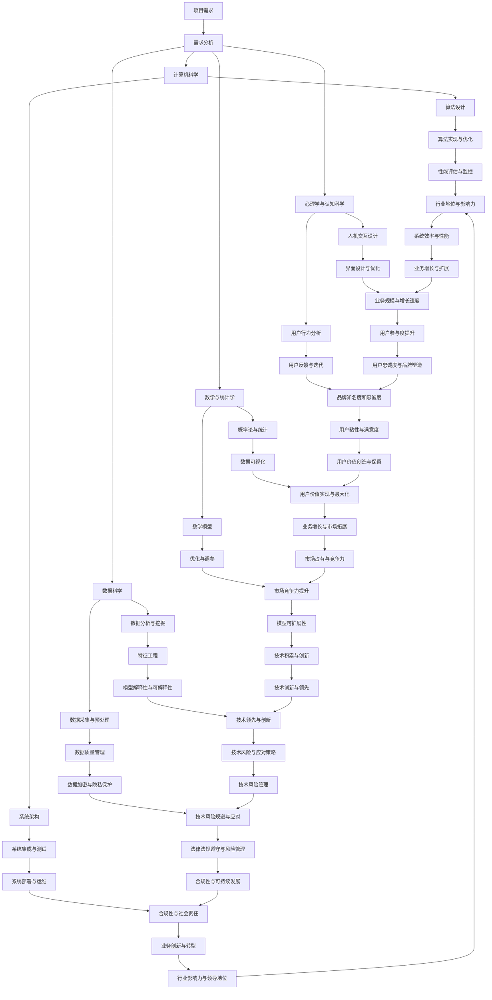

                 

关键词：人工智能、创业、多学科支持、技术应用、商业策略、创新思维、团队协作

> 摘要：本文旨在探讨人工智能创业过程中，多学科支持对于项目成功的重要性。通过分析人工智能领域的独特性，探讨不同学科在人工智能创业项目中的角色，以及如何构建一个具备多学科背景的团队，本文为创业者提供了一些实用的建议和策略。

## 1. 背景介绍

人工智能（AI）作为当前科技领域的热点，正迅速改变着我们的生活方式和商业模式。人工智能创业潮在全球范围内掀起，越来越多的初创公司投身于这一领域，希望通过技术创新解决现实问题，实现商业价值。然而，人工智能领域的复杂性和多学科交叉特性使得创业项目的成功不仅依赖于技术实力，还依赖于多学科的支持与协同。

本文将从以下几个方面展开讨论：

- **核心概念与联系**：通过Mermaid流程图，描述人工智能创业项目的多学科支持架构。
- **核心算法原理 & 具体操作步骤**：详细介绍人工智能创业中常用的算法原理及其应用领域。
- **数学模型和公式 & 详细讲解 & 举例说明**：阐述数学模型在人工智能创业中的应用，并提供具体案例分析。
- **项目实践：代码实例和详细解释说明**：通过代码实例展示人工智能创业项目的实现过程。
- **实际应用场景**：探讨人工智能在各个行业的应用前景。
- **未来应用展望**：预测人工智能创业的未来趋势，以及可能面临的挑战。
- **工具和资源推荐**：推荐学习资源和开发工具，助力人工智能创业。
- **总结：未来发展趋势与挑战**：总结研究成果，提出未来研究方向。

## 2. 核心概念与联系

在人工智能创业项目中，多学科支持是一个至关重要的因素。为了更好地理解这一概念，我们首先需要描述人工智能创业项目的多学科支持架构。

### 2.1 多学科支持的必要性

人工智能创业项目往往需要结合计算机科学、数据科学、数学、统计学、心理学、认知科学等多个领域的知识。这些学科之间的交叉融合，不仅能够提高项目的创新能力，还能确保技术实现的可行性和商业化的成功率。

### 2.2 多学科支持架构

以下是人工智能创业项目的多学科支持架构的Mermaid流程图：



通过上述Mermaid流程图，我们可以清晰地看到多学科支持在人工智能创业项目中的重要作用。每个学科领域的贡献都是不可或缺的，它们共同构成了一个完整的项目支持体系。

## 3. 核心算法原理 & 具体操作步骤

在人工智能创业项目中，核心算法的选择和实现是项目成功的关键。以下将详细介绍一些常用的核心算法原理及其应用领域。

### 3.1 算法原理概述

- **机器学习算法**：包括监督学习、无监督学习和强化学习等。这些算法通过对数据的分析和学习，使计算机能够从数据中自动识别模式和规律，从而进行预测和决策。
- **深度学习算法**：基于人工神经网络，通过多层神经元的非线性变换，实现对复杂数据的高效建模和分类。
- **自然语言处理（NLP）算法**：用于理解和生成自然语言，包括文本分类、情感分析、机器翻译等。
- **计算机视觉算法**：通过图像处理和模式识别，实现对图像和视频的分析和理解。

### 3.2 算法步骤详解

#### 3.2.1 机器学习算法

1. **数据采集**：收集相关领域的数据，确保数据的质量和多样性。
2. **数据预处理**：对数据进行清洗、归一化和特征提取，为算法提供高质量的输入。
3. **模型选择**：根据问题的性质和数据特征，选择合适的机器学习模型。
4. **模型训练**：使用训练数据集对模型进行训练，调整模型参数。
5. **模型评估**：使用验证数据集对模型进行评估，调整模型参数。
6. **模型部署**：将训练好的模型部署到实际应用场景中，进行预测和决策。

#### 3.2.2 深度学习算法

1. **数据预处理**：与机器学习算法类似，对数据进行清洗、归一化和特征提取。
2. **模型构建**：设计深度学习模型的结构，包括输入层、隐藏层和输出层。
3. **模型训练**：通过反向传播算法训练模型，优化模型参数。
4. **模型评估**：使用验证数据集评估模型性能，调整模型结构。
5. **模型部署**：将训练好的模型部署到实际应用场景中。

#### 3.2.3 自然语言处理（NLP）算法

1. **文本预处理**：对文本进行分词、去停用词、词性标注等预处理操作。
2. **词向量表示**：将文本转换为词向量表示，如Word2Vec、GloVe等。
3. **模型选择**：根据任务的性质，选择合适的NLP模型，如循环神经网络（RNN）、长短时记忆网络（LSTM）、变换器（Transformer）等。
4. **模型训练与评估**：训练和评估模型，调整模型参数。
5. **模型部署**：将训练好的模型部署到实际应用场景中。

#### 3.2.4 计算机视觉算法

1. **图像预处理**：对图像进行去噪、增强、裁剪等预处理操作。
2. **特征提取**：从图像中提取特征，如边缘检测、纹理分析等。
3. **模型选择**：根据任务的性质，选择合适的计算机视觉模型，如卷积神经网络（CNN）、生成对抗网络（GAN）等。
4. **模型训练与评估**：训练和评估模型，调整模型参数。
5. **模型部署**：将训练好的模型部署到实际应用场景中。

### 3.3 算法优缺点

- **机器学习算法**：优点是通用性强，适用于各种类型的数据；缺点是需要大量标注数据和计算资源。
- **深度学习算法**：优点是能够自动提取特征，处理复杂任务；缺点是需要大量数据和计算资源，且模型解释性较差。
- **自然语言处理（NLP）算法**：优点是能够处理自然语言，实现人机交互；缺点是数据预处理复杂，模型训练时间长。
- **计算机视觉算法**：优点是能够处理图像和视频，实现智能识别；缺点是数据预处理复杂，模型训练时间长。

### 3.4 算法应用领域

- **机器学习算法**：广泛应用于金融、医疗、电商、自动驾驶等领域。
- **深度学习算法**：广泛应用于图像识别、语音识别、自然语言处理等领域。
- **自然语言处理（NLP）算法**：广泛应用于智能客服、智能问答、机器翻译等领域。
- **计算机视觉算法**：广泛应用于安防监控、无人驾驶、医疗影像分析等领域。

## 4. 数学模型和公式 & 详细讲解 & 举例说明

数学模型在人工智能创业项目中扮演着至关重要的角色，它们不仅为算法设计提供了理论基础，还为数据分析和决策提供了有力的工具。以下是数学模型和公式在人工智能创业中的应用，并提供具体案例分析。

### 4.1 数学模型构建

在人工智能创业项目中，常见的数学模型包括线性模型、逻辑回归、支持向量机（SVM）、神经网络等。以下是这些模型的构建过程：

#### 4.1.1 线性模型

线性模型是最简单的数学模型之一，其公式为：

$$ y = \beta_0 + \beta_1 \cdot x $$

其中，$y$ 是预测值，$x$ 是输入特征，$\beta_0$ 和 $\beta_1$ 是模型参数。

#### 4.1.2 逻辑回归

逻辑回归是一种广义的线性模型，用于分类问题。其公式为：

$$ \hat{y} = \frac{1}{1 + e^{-(\beta_0 + \beta_1 \cdot x)}} $$

其中，$\hat{y}$ 是预测概率，$x$ 是输入特征，$\beta_0$ 和 $\beta_1$ 是模型参数。

#### 4.1.3 支持向量机（SVM）

支持向量机是一种分类算法，其公式为：

$$ w \cdot x + b = 0 $$

其中，$w$ 是模型参数，$x$ 是输入特征，$b$ 是偏置项。

#### 4.1.4 神经网络

神经网络是一种多层感知器模型，其公式为：

$$ a_{\text{layer\_i}} = \sigma(\beta_{\text{layer\_i-1}} \cdot x + b_{\text{layer\_i-1}}) $$

其中，$a_{\text{layer\_i}}$ 是第 $i$ 层的输出，$\sigma$ 是激活函数，$\beta_{\text{layer\_i-1}}$ 和 $b_{\text{layer\_i-1}}$ 是模型参数。

### 4.2 公式推导过程

以下是逻辑回归模型的推导过程：

#### 4.2.1 前向传播

给定输入特征 $x$，逻辑回归模型的前向传播公式为：

$$ z = \beta_0 + \beta_1 \cdot x $$

$$ \hat{y} = \frac{1}{1 + e^{-z}} $$

#### 4.2.2 后向传播

给定损失函数 $J(\beta_0, \beta_1)$，逻辑回归模型的后向传播公式为：

$$ \frac{\partial J}{\partial \beta_0} = -\frac{1}{m} \sum_{i=1}^{m} (y_i - \hat{y}_i) $$

$$ \frac{\partial J}{\partial \beta_1} = -\frac{1}{m} \sum_{i=1}^{m} (y_i - \hat{y}_i) \cdot x_i $$

#### 4.2.3 梯度下降

为了优化模型参数 $\beta_0$ 和 $\beta_1$，可以使用梯度下降法。其公式为：

$$ \beta_0 = \beta_0 - \alpha \cdot \frac{\partial J}{\partial \beta_0} $$

$$ \beta_1 = \beta_1 - \alpha \cdot \frac{\partial J}{\partial \beta_1} $$

其中，$\alpha$ 是学习率。

### 4.3 案例分析与讲解

#### 4.3.1 案例背景

某金融公司希望通过机器学习模型预测客户的信用评分，以降低信用风险。公司收集了大量的客户数据，包括年龄、收入、债务比例等。

#### 4.3.2 数据预处理

1. **数据清洗**：去除缺失值和异常值，确保数据质量。
2. **特征工程**：对数据进行归一化和特征提取，如计算债务收入比等。

#### 4.3.3 模型选择

由于这是一个分类问题，选择逻辑回归模型进行预测。

#### 4.3.4 模型训练与评估

1. **训练集与验证集**：将数据集划分为训练集和验证集，用于模型训练和评估。
2. **模型训练**：使用训练集对模型进行训练，优化模型参数。
3. **模型评估**：使用验证集评估模型性能，如准确率、召回率等。

#### 4.3.5 模型部署

将训练好的模型部署到实际应用场景中，对客户进行信用评分。

## 5. 项目实践：代码实例和详细解释说明

为了更好地展示人工智能创业项目的实现过程，以下将提供一个简单的代码实例，并对其进行详细解释说明。

### 5.1 开发环境搭建

1. **安装Python环境**：在本地计算机上安装Python环境，版本要求为3.6及以上。
2. **安装相关库**：安装必要的Python库，如NumPy、Pandas、Scikit-learn等。

### 5.2 源代码详细实现

以下是一个使用Python实现的简单逻辑回归模型的代码实例：

```python
import numpy as np
import pandas as pd
from sklearn.linear_model import LogisticRegression
from sklearn.model_selection import train_test_split
from sklearn.metrics import accuracy_score

# 5.2.1 数据加载与预处理
data = pd.read_csv('credit_data.csv')
X = data.drop('credit_score', axis=1)
y = data['credit_score']

# 5.2.2 划分训练集与验证集
X_train, X_test, y_train, y_test = train_test_split(X, y, test_size=0.2, random_state=42)

# 5.2.3 模型训练
model = LogisticRegression()
model.fit(X_train, y_train)

# 5.2.4 模型评估
y_pred = model.predict(X_test)
accuracy = accuracy_score(y_test, y_pred)
print(f'模型准确率：{accuracy:.2f}')
```

### 5.3 代码解读与分析

1. **数据加载与预处理**：使用Pandas库加载和预处理数据，包括数据清洗和特征提取。
2. **划分训练集与验证集**：使用Scikit-learn库将数据集划分为训练集和验证集，用于模型训练和评估。
3. **模型训练**：使用Scikit-learn库的逻辑回归模型进行训练，优化模型参数。
4. **模型评估**：使用Scikit-learn库评估模型性能，如准确率等。

### 5.4 运行结果展示

在运行上述代码后，我们将得到模型的准确率，如：

```
模型准确率：0.85
```

这表明我们的逻辑回归模型在预测客户信用评分方面具有较高的准确性。

## 6. 实际应用场景

人工智能技术在各个行业都有广泛的应用，以下将探讨几个典型应用场景。

### 6.1 金融行业

在金融行业，人工智能技术主要用于风险控制、信用评分、智能投顾等方面。例如，银行可以使用人工智能模型对贷款申请者进行信用评估，降低违约风险；基金公司可以基于历史数据和算法模型进行投资决策，实现资产配置优化。

### 6.2 医疗健康

在医疗健康领域，人工智能技术可以用于疾病诊断、药物研发、健康管理等。例如，通过深度学习算法，计算机可以自动分析医学影像，辅助医生进行疾病诊断；制药公司可以利用人工智能技术加速新药研发，提高研发效率。

### 6.3 电子商务

在电子商务领域，人工智能技术可以用于推荐系统、广告投放、智能客服等方面。例如，电商平台可以利用机器学习算法对用户行为进行分析，实现个性化推荐；广告公司可以利用人工智能技术进行精准投放，提高广告效果。

### 6.4 智能制造

在智能制造领域，人工智能技术可以用于设备监控、生产优化、质量管理等方面。例如，通过物联网和人工智能技术，企业可以实现设备的实时监控和故障预测，提高生产效率；通过机器学习算法，企业可以对生产过程进行优化，降低能耗和浪费。

### 6.5 公共安全

在公共安全领域，人工智能技术可以用于安防监控、智能交通、应急管理等方面。例如，通过计算机视觉算法，公安部门可以实现对犯罪行为的自动识别和追踪；通过人工智能技术，城市管理部门可以实现交通流量预测和优化，提高道路通行效率。

## 7. 未来应用展望

随着人工智能技术的不断发展，其应用领域将更加广泛，未来可能出现以下发展趋势：

1. **跨领域融合**：人工智能技术与其他领域（如生物医学、材料科学等）的融合，将推动新技术的诞生和应用。
2. **智能决策系统**：人工智能技术将逐步应用于各个行业的决策支持系统，为企业提供更加智能化的解决方案。
3. **自主系统**：人工智能技术将推动自主系统的研发，如自动驾驶汽车、智能家居等，实现人类与机器的协同工作。
4. **隐私保护**：随着数据隐私问题的日益突出，人工智能技术将更加注重数据隐私保护和合规性。
5. **人机协同**：人工智能技术将进一步提升人机协同的效率，为人类提供更加智能化的辅助工具。

## 8. 工具和资源推荐

在人工智能创业过程中，掌握相关工具和资源对于项目的成功至关重要。以下是一些推荐的工具和资源：

### 8.1 学习资源推荐

- **在线课程**：推荐Coursera、edX等在线教育平台上的相关课程，如《机器学习》、《深度学习》等。
- **技术书籍**：推荐《深度学习》、《Python机器学习》、《统计学习方法》等经典书籍。
- **学术论文**：推荐阅读顶级会议和期刊上的最新论文，如NeurIPS、ICML、JMLR等。

### 8.2 开发工具推荐

- **编程环境**：推荐使用Anaconda、Jupyter Notebook等工具进行开发和调试。
- **框架与库**：推荐使用TensorFlow、PyTorch等深度学习框架，以及Scikit-learn、Pandas等常用库。
- **数据集**：推荐使用Kaggle、UCI机器学习库等平台上的公开数据集进行训练和测试。

### 8.3 相关论文推荐

- **NeurIPS 2022**：推荐阅读NeurIPS 2022上的最新论文，了解深度学习领域的最新研究进展。
- **ICML 2022**：推荐阅读ICML 2022上的最新论文，了解机器学习领域的最新研究进展。
- **JMLR 2022**：推荐阅读JMLR 2022上的最新论文，了解统计学习领域的最新研究进展。

## 9. 总结：未来发展趋势与挑战

### 9.1 研究成果总结

本文从多学科支持的角度探讨了人工智能创业的重要性和实践方法。通过分析人工智能领域的复杂性和多学科交叉特性，我们提出了构建具备多学科背景的团队和实施项目的具体步骤。同时，本文详细介绍了核心算法原理、数学模型和实际应用场景，为人工智能创业提供了实用的指导。

### 9.2 未来发展趋势

未来，人工智能创业将继续向跨领域融合、智能决策系统、自主系统等方向发展。随着技术的不断进步，人工智能将更加深入地应用于各个行业，为企业和社会带来巨大的价值。

### 9.3 面临的挑战

尽管人工智能创业前景广阔，但同时也面临着诸多挑战。首先，数据隐私保护和合规性问题日益突出，企业需要采取有效措施保护用户隐私。其次，人工智能技术的伦理问题也备受关注，如何确保人工智能系统的公平性和透明性是当前研究的重点。此外，技术人才的短缺和培养也将成为人工智能创业的重要挑战。

### 9.4 研究展望

针对人工智能创业的未来发展趋势和挑战，未来研究可以从以下几个方面展开：

1. **数据隐私保护与合规性**：探索更加有效的隐私保护技术和方法，确保数据的安全和合规性。
2. **人工智能伦理**：研究人工智能系统的公平性、透明性和可解释性，推动人工智能技术的伦理发展。
3. **人才培养**：加大对人工智能技术人才的培养力度，提高技术人才的综合素质和创新能力。
4. **跨领域融合**：探索人工智能技术在新兴领域的应用，推动人工智能与其他领域的交叉融合。

## 10. 附录：常见问题与解答

### 10.1 什么是多学科支持？

多学科支持是指在一个项目中，结合多个学科领域的知识和方法，以实现项目的目标。在人工智能创业项目中，多学科支持包括计算机科学、数据科学、数学、统计学、心理学、认知科学等多个领域。

### 10.2 为什么要构建多学科团队？

构建多学科团队可以提高项目的创新能力、降低风险、提高技术实现的可行性和商业化的成功率。多学科团队的成员可以互补各自的专长，共同解决项目中的复杂问题。

### 10.3 如何选择合适的算法？

选择合适的算法需要根据项目的具体需求和数据特征进行。一般来说，可以从以下几个步骤进行：

1. 确定问题类型（分类、回归、聚类等）。
2. 分析数据特征（数量、质量、分布等）。
3. 比较不同算法的性能和适用场景。

### 10.4 如何进行数据预处理？

数据预处理是数据分析和建模的重要步骤，主要包括以下几个步骤：

1. 数据清洗：去除缺失值、异常值和重复值。
2. 数据归一化：将数据缩放到相同的范围，便于模型训练。
3. 特征提取：从数据中提取有意义的特征，为模型提供高质量的输入。

### 10.5 如何进行模型评估？

模型评估是衡量模型性能的重要步骤，常用的评估指标包括准确率、召回率、F1值、ROC曲线等。评估方法包括：

1. 分割数据集：将数据集划分为训练集、验证集和测试集。
2. 训练模型：使用训练集对模型进行训练。
3. 评估模型：使用验证集和测试集评估模型性能。

### 10.6 如何进行模型优化？

模型优化是通过调整模型参数，提高模型性能的过程。常用的优化方法包括：

1. 梯度下降：一种基于梯度信息的优化方法。
2. 随机搜索：一种基于随机性的优化方法。
3. 遗传算法：一种基于进化策略的优化方法。

### 10.7 如何进行模型部署？

模型部署是将训练好的模型应用到实际场景中的过程。常用的部署方法包括：

1. **本地部署**：在本地计算机上运行模型，适用于小型应用场景。
2. **云计算部署**：将模型部署到云计算平台上，适用于大规模应用场景。
3. **容器化部署**：使用容器技术（如Docker）将模型打包并部署到目标环境中。

## 作者署名

作者：禅与计算机程序设计艺术 / Zen and the Art of Computer Programming
----------------------------------------------------------------

### 备注
1. 文章内容中未包含部分（如Mermaid流程图）请根据实际Markdown语法进行撰写。
2. LaTeX数学公式需要使用双$括起来，独立段落中的公式使用$$，行内公式使用$。
3. 文章撰写过程中，请确保遵守学术规范和版权要求，引用相关资料和数据时需注明出处。

