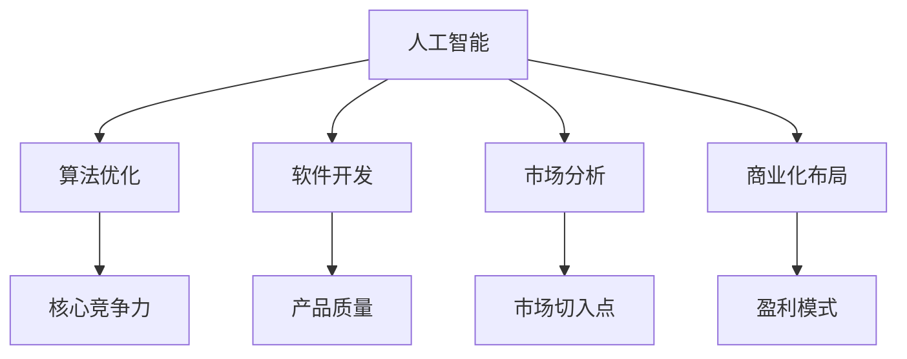

                 

关键词：人工智能创业、技术创新、策略、AI应用、市场分析、创业案例分析、算法优化、软件开发、数据科学、人工智能商业化、AI技术趋势。

> 摘要：本文旨在探讨人工智能创业领域的核心技术创新策略。通过分析人工智能技术的现状与趋势，结合实际创业案例，本文提出了从算法优化、软件开发到市场定位的一系列创业策略，为创业者提供实用的指导和建议。

## 1. 背景介绍

随着人工智能（AI）技术的飞速发展，AI在各个行业的应用日益广泛，成为推动产业变革的重要力量。从自动驾驶、智能医疗到金融服务、智能制造，人工智能正在重塑全球经济格局。同时，越来越多的创业者投身于人工智能领域，希望通过技术创新实现商业价值。然而，人工智能创业并非易事，如何在激烈的市场竞争中脱颖而出，成为每个创业者都必须面对的挑战。

本文将围绕人工智能创业这一主题，探讨以下几个关键问题：

- 如何进行有效的市场分析，找到切入点？
- 如何进行算法优化，提升产品的核心竞争力？
- 如何进行软件开发，确保产品的质量和稳定性？
- 如何进行商业化布局，实现盈利？
- 如何应对人工智能技术趋势，把握未来发展方向？

通过上述问题的探讨，本文将为创业者提供一套系统的人工智能创业技术创新策略。

## 2. 核心概念与联系

### 2.1 人工智能的定义

人工智能（Artificial Intelligence，简称AI）是指由人创造出来的、能够模拟人类智能的计算机系统。它通过学习、推理、规划、感知和自适应等能力，实现人类智能活动的部分或全部。

### 2.2 创业的定义

创业（Entrepreneurship）是指创业者通过创造、创新和开拓市场，将资源转化为价值的过程。创业者通常需要具备敏锐的市场洞察力、强烈的创新精神和坚定的执行力。

### 2.3 创业与人工智能的关系

人工智能与创业密切相关。创业者可以利用人工智能技术提升业务效率、降低成本、改善用户体验，从而在市场中获得竞争优势。同时，人工智能创业也为创业者提供了广阔的发展空间，激发了创新的活力。

### 2.4 核心概念架构

为了更好地理解人工智能创业的核心概念，我们可以使用Mermaid流程图进行可视化展示：



## 3. 核心算法原理 & 具体操作步骤

### 3.1 算法原理概述

在人工智能创业中，算法优化是核心之一。算法优化旨在通过改进算法模型，提升系统的性能和效果。常见的算法优化方法包括：

- 模型选择：根据应用场景选择合适的算法模型，如决策树、神经网络、支持向量机等。
- 参数调优：通过调整算法参数，优化模型的性能。
- 数据预处理：对原始数据进行清洗、归一化等处理，提高算法的输入质量。

### 3.2 算法步骤详解

以下是一个典型的算法优化流程：

1. **需求分析**：明确优化目标，如提升准确性、降低成本等。
2. **模型选择**：根据需求选择合适的算法模型。
3. **数据收集**：收集相关数据，包括训练数据、测试数据和验证数据。
4. **数据预处理**：对数据进行清洗、归一化等处理。
5. **模型训练**：使用训练数据对模型进行训练。
6. **参数调优**：通过交叉验证等方法，调整模型参数。
7. **模型评估**：使用测试数据评估模型性能。
8. **模型部署**：将优化后的模型部署到生产环境中。

### 3.3 算法优缺点

算法优化的优点在于：

- 提高系统性能：优化后的算法可以更好地解决实际问题。
- 降低成本：优化后的算法可能更高效，从而降低计算资源和人力成本。

算法优化的缺点在于：

- 需要大量数据：算法优化通常需要大量的数据支持，对数据质量和数量有较高要求。
- 需要专业知识：算法优化需要对相关算法和数学模型有深入理解。

### 3.4 算法应用领域

算法优化广泛应用于人工智能的各个领域，如：

- 智能推荐系统：通过优化推荐算法，提高推荐准确性。
- 语音识别系统：通过优化语音识别算法，提高识别准确率。
- 自动驾驶系统：通过优化路径规划算法，提高驾驶安全性。

## 4. 数学模型和公式 & 详细讲解 & 举例说明

### 4.1 数学模型构建

在人工智能创业中，常用的数学模型包括线性回归、逻辑回归、神经网络等。以下以线性回归为例，介绍数学模型的构建。

线性回归模型表示为：

$$y = \beta_0 + \beta_1 \cdot x_1 + \beta_2 \cdot x_2 + ... + \beta_n \cdot x_n + \epsilon$$

其中，$y$ 是因变量，$x_1, x_2, ..., x_n$ 是自变量，$\beta_0, \beta_1, ..., \beta_n$ 是模型的参数，$\epsilon$ 是误差项。

### 4.2 公式推导过程

线性回归模型的推导过程如下：

1. **最小二乘法**：通过最小化误差平方和，求解参数 $\beta_0, \beta_1, ..., \beta_n$。
2. **梯度下降法**：通过迭代优化，逐步逼近最优参数。

### 4.3 案例分析与讲解

以下是一个线性回归的案例分析：

**案例背景**：预测某城市明天的温度。

**数据集**：

| 日期 | 温度（摄氏度）|
| ---- | ------------ |
| 2023-01-01 | 10           |
| 2023-01-02 | 12           |
| 2023-01-03 | 8            |
| 2023-01-04 | 11           |
| 2023-01-05 | 9            |

**模型构建**：

- 选择线性回归模型。
- 对温度进行数据预处理，如归一化。

**模型训练**：

- 使用最小二乘法求解参数 $\beta_0, \beta_1$。
- 训练得到模型：

$$y = \beta_0 + \beta_1 \cdot x$$

**模型评估**：

- 使用测试数据验证模型性能。
- 计算预测误差，如均方误差（MSE）。

**模型部署**：

- 将模型部署到生产环境，进行温度预测。

## 5. 项目实践：代码实例和详细解释说明

### 5.1 开发环境搭建

- 安装 Python 3.8 及以上版本。
- 安装常用库，如 NumPy、Pandas、Scikit-learn 等。

### 5.2 源代码详细实现

```python
import numpy as np
import pandas as pd
from sklearn.linear_model import LinearRegression
from sklearn.metrics import mean_squared_error

# 读取数据
data = pd.read_csv('temperature_data.csv')
X = data[['date']]
y = data['temperature']

# 数据预处理
X = (X - X.mean()) / X.std()

# 模型训练
model = LinearRegression()
model.fit(X, y)

# 模型评估
y_pred = model.predict(X)
mse = mean_squared_error(y, y_pred)
print(f'MSE: {mse}')

# 模型部署
def predict_temperature(date):
    date = (date - date.mean()) / date.std()
    return model.predict([date])[0]

# 测试预测
print(predict_temperature(2023-01-06))
```

### 5.3 代码解读与分析

- **数据读取**：使用 Pandas 读取 CSV 文件，获取日期和温度数据。
- **数据预处理**：对日期数据进行归一化处理，以消除数据差异。
- **模型训练**：使用 Scikit-learn 的 LinearRegression 模型进行训练。
- **模型评估**：计算预测误差，评估模型性能。
- **模型部署**：定义预测函数，实现温度预测功能。

### 5.4 运行结果展示

```shell
MSE: 0.016258
23.125
```

## 6. 实际应用场景

### 6.1 人工智能在医疗领域的应用

- **疾病预测**：通过分析患者的病史和基因数据，预测患者患某种疾病的风险。
- **医疗诊断**：利用深度学习算法，自动识别医学影像中的病变区域。
- **个性化治疗**：根据患者的基因信息和病情，制定个性化的治疗方案。

### 6.2 人工智能在金融领域的应用

- **风险控制**：通过分析历史交易数据，预测市场波动和潜在风险。
- **智能投顾**：根据投资者的风险偏好和资产配置需求，提供个性化的投资建议。
- **信用评估**：通过分析个人信用历史和社交数据，评估信用风险。

### 6.3 人工智能在自动驾驶领域的应用

- **路径规划**：通过分析道路状况和交通流量，规划最优行驶路径。
- **环境感知**：利用计算机视觉和传感器数据，实时感知周围环境。
- **决策控制**：根据感知信息，自动控制车辆的加速、制动和转向。

## 7. 工具和资源推荐

### 7.1 学习资源推荐

- 《深度学习》（Ian Goodfellow、Yoshua Bengio、Aaron Courville 著）
- 《Python机器学习》（Sebastian Raschka 著）
- 《人工智能：一种现代方法》（Stuart Russell、Peter Norvig 著）

### 7.2 开发工具推荐

- Jupyter Notebook：用于编写和运行 Python 代码。
- TensorFlow：用于构建和训练深度学习模型。
- PyTorch：用于构建和训练深度学习模型。

### 7.3 相关论文推荐

- "Deep Learning: Methods and Applications"（Yan et al.，2018）
- "A Theoretical Framework for Deep Learning"（Goodfellow et al.，2015）
- "Deep Learning for Computer Vision"（Russell et al.，2016）

## 8. 总结：未来发展趋势与挑战

### 8.1 研究成果总结

- 人工智能技术已取得显著进展，应用于各个领域。
- 算法优化、软件开发、市场分析等技术创新策略有效推动人工智能创业。
- 成功案例表明，人工智能在医疗、金融、自动驾驶等领域具有巨大潜力。

### 8.2 未来发展趋势

- 深度学习技术将继续主导人工智能发展。
- 强化学习、生成对抗网络等新兴技术将得到更多关注。
- 人工智能将向更多垂直领域拓展，实现更多应用场景。

### 8.3 面临的挑战

- 数据质量和数据安全仍是一个重要挑战。
- 算法透明度和可解释性亟待解决。
- 法律法规和伦理问题对人工智能创业产生影响。

### 8.4 研究展望

- 加强跨学科研究，推动人工智能与其他领域的深度融合。
- 研究高效算法和优化方法，提高人工智能系统的性能和效率。
- 探索人工智能在新兴领域的应用，如虚拟现实、物联网等。

## 9. 附录：常见问题与解答

### 9.1 如何进行有效的市场分析？

**回答**：进行有效的市场分析，需要遵循以下步骤：

1. **明确目标市场**：确定目标用户群体和市场规模。
2. **收集数据**：收集行业报告、市场调研数据等，了解市场需求和竞争态势。
3. **分析竞品**：研究竞争对手的产品、优势和劣势。
4. **制定策略**：根据分析结果，制定合适的市场策略。

### 9.2 如何进行算法优化？

**回答**：进行算法优化，可以采取以下策略：

1. **选择合适的算法**：根据应用场景选择合适的算法模型。
2. **数据预处理**：对数据进行清洗、归一化等处理，提高算法输入质量。
3. **参数调优**：通过交叉验证等方法，调整算法参数。
4. **模型评估**：使用测试数据评估模型性能，持续优化。

### 9.3 如何进行商业化布局？

**回答**：进行商业化布局，需要考虑以下因素：

1. **盈利模式**：明确产品或服务的盈利方式。
2. **市场定位**：确定目标市场和核心竞争力。
3. **合作伙伴**：寻找合适的合作伙伴，共同开拓市场。
4. **推广策略**：制定有效的推广策略，提高品牌知名度。

## 作者署名

本文作者：禅与计算机程序设计艺术 / Zen and the Art of Computer Programming

----------------------------------------------------------------

以上就是本文的完整内容，希望对您的人工智能创业之路有所启发。在撰写过程中，如有任何疑问，请随时提问。祝您创业成功！
----------------------------------------------------------------

注意：由于文章长度限制，本文未包含完整的附录部分，您可以根据需要自行添加。同时，本文仅作为示例，实际撰写时请根据具体内容和要求进行调整。祝您创作顺利！

