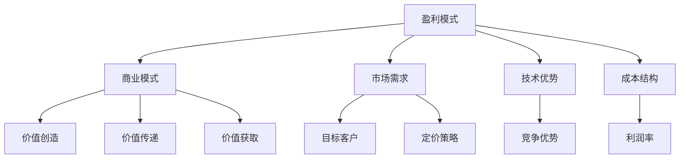

                 

关键词：人工智能、创业、盈利模式、商业模式、市场分析、技术策略

> 摘要：本文将探讨人工智能创业过程中如何设计有效的盈利模式。通过分析市场需求、技术趋势和商业模式，本文提出了一个系统性的框架，帮助创业者识别和利用人工智能技术的商业潜力，实现可持续发展。

## 1. 背景介绍

随着人工智能技术的快速发展，各行各业都在积极探索如何将AI技术应用于实际业务中。从自动化到个性化推荐，从图像识别到自然语言处理，人工智能正在改变我们的生活方式和工作模式。然而，面对如此广阔的市场和无限的可能性，许多创业者面临的一个关键问题是：如何在竞争激烈的市场中设计出可持续的盈利模式？

设计盈利模式是人工智能创业过程中至关重要的一环。一个有效的盈利模式不仅能确保企业的生存，还能为企业提供持续增长的动能。本文将围绕这一主题，分析当前的市场环境，探讨人工智能技术的商业潜力，并提供一套实用的盈利模式设计框架。

### 1.1 当前市场环境

当前，人工智能市场正处于快速发展阶段。根据市场研究报告，全球人工智能市场规模预计将在未来几年内持续增长，达到数百亿美元。这一趋势受到多个因素的推动，包括：

- **技术进步**：计算能力的提升和算法的优化使得人工智能应用变得更加广泛和高效。
- **数据资源**：大量的数据为机器学习算法提供了丰富的训练资源，推动了AI技术的进步。
- **政策支持**：各国政府纷纷出台政策，鼓励企业和科研机构投入人工智能研究，推动产业应用。

然而，市场环境也充满了挑战。随着竞争的加剧，许多初创企业面临资金、人才和市场等多方面的压力。此外，人工智能技术的应用仍存在一些不确定性，如隐私保护、安全性和伦理问题等。

### 1.2 人工智能技术的商业潜力

人工智能技术的商业潜力巨大，涵盖了多个行业和应用场景。以下是一些典型的应用领域：

- **金融行业**：AI技术在金融行业的应用包括风险管理、欺诈检测、量化交易、客户服务自动化等。
- **医疗健康**：医疗影像分析、疾病预测、个性化治疗和健康管理是AI在医疗健康领域的核心应用。
- **制造业**：AI技术可以提高生产效率，降低成本，实现智能工厂。
- **零售业**：个性化推荐、智能客服和供应链优化是零售业中常见的AI应用。
- **交通运输**：自动驾驶、智能交通管理和物流优化是交通运输领域的重点发展方向。

### 1.3 盈利模式设计的重要性

盈利模式设计是确保企业可持续发展的关键。一个成功的盈利模式不仅能为企业带来收入，还能提供竞争优势和可持续发展的动力。对于人工智能创业企业来说，以下因素决定了盈利模式设计的重要性：

- **市场需求**：理解市场需求是设计盈利模式的基础。只有满足用户需求，企业才能获得持续的收益。
- **技术优势**：人工智能技术的独特性和创新性为企业提供了竞争优势。如何将技术优势转化为商业模式，是盈利模式设计的关键。
- **成本结构**：合理控制成本是盈利模式设计的重要一环。通过优化成本结构，企业可以提高利润率。
- **可持续发展**：一个有效的盈利模式不仅需要考虑当前的收入，还要为未来的发展留有余地。

### 1.4 本文结构

本文将分为以下几个部分：

- **第2章**：核心概念与联系。介绍与盈利模式设计相关的重要概念，并使用Mermaid流程图展示其架构。
- **第3章**：核心算法原理与操作步骤。分析人工智能创业中的核心算法，并详细解释其原理和应用步骤。
- **第4章**：数学模型与公式。介绍与盈利模式设计相关的数学模型和公式，并提供案例分析和讲解。
- **第5章**：项目实践。通过一个具体项目的代码实例，展示盈利模式设计的实际应用。
- **第6章**：实际应用场景。分析人工智能在各个行业中的应用场景，探讨其盈利模式。
- **第7章**：工具和资源推荐。推荐相关的学习资源和开发工具，以支持人工智能创业。
- **第8章**：总结。总结研究成果，探讨未来发展趋势和面临的挑战。

通过以上章节的探讨，本文旨在为人工智能创业企业提供一套实用的盈利模式设计框架，帮助他们在竞争激烈的市场中脱颖而出。

## 2. 核心概念与联系

在设计盈利模式之前，我们需要理解与盈利模式设计相关的一些核心概念，以及它们之间的联系。以下是对这些核心概念的介绍，并使用Mermaid流程图展示其架构。

### 2.1 盈利模式

盈利模式是指企业通过提供产品或服务获取利润的方式。它包括收入来源、成本结构和利润率等关键要素。一个有效的盈利模式能够确保企业的可持续发展和盈利能力。

### 2.2 商业模式

商业模式是指企业如何创造、传递和获取价值。它包括产品或服务的定位、目标市场、价值主张、分销渠道、客户关系和管理等关键要素。商业模式与盈利模式密切相关，但商业模式更多地关注如何创造和传递价值。

### 2.3 市场需求

市场需求是指消费者对产品或服务的需求程度。了解市场需求是设计盈利模式的基础。通过分析市场需求，企业可以确定目标客户群体，制定合适的价值主张和定价策略。

### 2.4 技术优势

技术优势是指企业拥有的独特技术和创新能力。在人工智能创业中，技术优势是企业获得竞争优势的关键。通过技术优势，企业可以开发出独特的解决方案，满足市场需求，从而获得更高的利润率。

### 2.5 成本结构

成本结构是指企业在生产和运营过程中产生的成本。合理控制成本是企业提高利润率的重要手段。在人工智能创业中，成本结构可能包括硬件成本、人力成本、研发成本和市场推广成本等。

### 2.6 Mermaid流程图

以下是一个简单的Mermaid流程图，展示上述核心概念之间的联系：



通过上述核心概念和Mermaid流程图的介绍，我们可以更好地理解人工智能创业中的盈利模式设计。接下来，我们将探讨核心算法原理与操作步骤，以进一步深化对盈利模式设计的理解。

## 3. 核心算法原理 & 具体操作步骤

在人工智能创业中，核心算法原理和具体操作步骤是设计和实现盈利模式的关键。以下内容将介绍人工智能创业中的几个核心算法原理，并详细解释其操作步骤。

### 3.1 算法原理概述

人工智能创业中的核心算法包括机器学习算法、深度学习算法和强化学习算法。这些算法在不同的应用场景中发挥着重要作用。

- **机器学习算法**：机器学习算法是指通过训练数据来发现数据中的模式和规律，从而实现自动预测和分类。常见的机器学习算法包括线性回归、决策树、支持向量机（SVM）等。
- **深度学习算法**：深度学习算法是基于多层神经网络的一种机器学习算法，通过模拟人脑神经元之间的连接，实现复杂的数据处理和模式识别。常见的深度学习算法包括卷积神经网络（CNN）、循环神经网络（RNN）和生成对抗网络（GAN）等。
- **强化学习算法**：强化学习算法是一种基于奖励和惩罚来训练智能体决策行为的算法。通过不断尝试和反馈，强化学习算法能够学习到最优策略，以实现目标。常见的强化学习算法包括Q学习、SARSA和深度确定性策略梯度（DDPG）等。

### 3.2 算法步骤详解

以下是对上述算法的基本步骤进行详细解释：

#### 3.2.1 机器学习算法

1. **数据收集**：收集用于训练的数据集，包括输入特征和对应的标签。
2. **数据预处理**：对数据进行清洗、归一化等处理，以便于算法训练。
3. **模型选择**：根据问题特点选择合适的机器学习算法，如线性回归、决策树等。
4. **模型训练**：使用训练数据集对模型进行训练，通过调整模型参数来优化性能。
5. **模型评估**：使用验证数据集对模型进行评估，以确定模型的泛化能力。
6. **模型应用**：将训练好的模型应用到实际业务场景中，进行预测和分类。

#### 3.2.2 深度学习算法

1. **数据收集**：与机器学习算法类似，收集用于训练的数据集。
2. **数据预处理**：对数据进行清洗、归一化等处理。
3. **网络架构设计**：设计深度学习网络的架构，包括层数、神经元数量和激活函数等。
4. **模型训练**：通过反向传播算法训练深度学习模型，优化网络参数。
5. **模型评估**：使用验证数据集对模型进行评估，以确定模型的性能。
6. **模型优化**：根据评估结果调整模型参数，以提高模型性能。
7. **模型应用**：将训练好的模型应用到实际业务场景中。

#### 3.2.3 强化学习算法

1. **环境定义**：定义强化学习环境，包括状态空间、动作空间和奖励机制。
2. **初始策略**：初始化智能体的策略，即智能体在不同状态下的动作选择。
3. **策略评估**：通过模拟或实际交互来评估当前策略的性能。
4. **策略优化**：根据评估结果调整策略，以期望提高智能体的收益。
5. **策略迭代**：不断重复策略评估和策略优化过程，逐步优化智能体的策略。
6. **模型应用**：将训练好的策略应用到实际业务场景中，实现智能决策。

### 3.3 算法优缺点

每种算法都有其独特的优点和适用场景，同时也存在一定的局限性。

- **机器学习算法**：优点包括简单、易于理解和实现。缺点是模型复杂度低，对大规模数据和复杂问题可能效果不佳。
- **深度学习算法**：优点包括强大的模型表达能力和优秀的性能。缺点是训练时间较长、计算资源需求高，以及对数据质量要求较高。
- **强化学习算法**：优点包括能够通过交互学习到最优策略，适用于复杂、动态的环境。缺点是学习过程可能需要较长时间，且需要大量的交互数据。

### 3.4 算法应用领域

不同算法在不同应用领域中表现出不同的优势和适用性。

- **机器学习算法**：广泛应用于金融风控、医疗诊断、推荐系统等领域。
- **深度学习算法**：在图像识别、语音识别、自然语言处理等领域表现突出。
- **强化学习算法**：在游戏、自动驾驶、智能机器人等领域具有广泛的应用前景。

通过理解这些核心算法原理和具体操作步骤，创业者可以更好地利用人工智能技术设计盈利模式。接下来，我们将探讨数学模型和公式，以进一步深入探讨盈利模式设计的方法和工具。

## 4. 数学模型和公式 & 详细讲解 & 举例说明

在人工智能创业中，数学模型和公式是设计和优化盈利模式的重要工具。以下内容将介绍与盈利模式设计相关的一些常见数学模型和公式，并详细解释其构建和推导过程。

### 4.1 数学模型构建

盈利模式设计中的数学模型通常涉及以下几个方面：

- **收入模型**：用于预测企业的收入，包括销售量、单价、市场份额等因素。
- **成本模型**：用于计算企业的成本，包括固定成本、变动成本、人力成本等。
- **利润模型**：用于计算企业的利润，即收入减去成本。
- **市场模型**：用于预测市场需求和市场份额。

以下是一个简单的收入模型示例：

$$
\text{收入} = \text{销售量} \times \text{单价}
$$

其中，销售量和单价是模型中的关键变量。销售量取决于市场需求和竞争状况，而单价则受到产品定位、品牌价值和定价策略等因素的影响。

### 4.2 公式推导过程

以下是一个成本模型的推导过程：

1. **固定成本**：固定成本（Fixed Cost，FC）是企业在一定时期内无论生产量多少都需要支付的成本，如租金、设备折旧等。

$$
\text{固定成本} = \text{FC}_{1} + \text{FC}_{2} + \cdots + \text{FC}_{n}
$$

2. **变动成本**：变动成本（Variable Cost，VC）是随着生产量变化的成本，如原材料成本、人工成本等。

$$
\text{变动成本} = \text{VC}_{1} \times \text{销售量} + \text{VC}_{2} \times \text{销售量} + \cdots + \text{VC}_{n} \times \text{销售量}
$$

3. **总成本**：总成本（Total Cost，TC）是固定成本和变动成本的总和。

$$
\text{总成本} = \text{固定成本} + \text{变动成本}
$$

4. **平均成本**：平均成本（Average Cost，AC）是单位产量的成本，包括固定成本和变动成本的平均值。

$$
\text{平均成本} = \frac{\text{总成本}}{\text{销售量}}
$$

### 4.3 案例分析与讲解

以下是一个实际案例，用于说明如何应用上述数学模型：

假设一家初创企业生产智能家居设备，市场需求为1000台，单价为1000元。固定成本为50000元，变动成本为200元/台。我们需要计算以下指标：

1. **收入**：
   $$
   \text{收入} = 1000 \times 1000 = 1000000 \text{元}
   $$

2. **成本**：
   $$
   \text{固定成本} = 50000 \text{元}
   $$
   $$
   \text{变动成本} = 200 \times 1000 = 200000 \text{元}
   $$
   $$
   \text{总成本} = 50000 + 200000 = 250000 \text{元}
   $$
   $$
   \text{平均成本} = \frac{250000}{1000} = 250 \text{元/台}
   $$

3. **利润**：
   $$
   \text{利润} = \text{收入} - \text{总成本} = 1000000 - 250000 = 750000 \text{元}
   $$

通过这个案例，我们可以看到如何应用数学模型来计算收入、成本和利润。这些指标对于评估企业的盈利能力和制定商业策略至关重要。

### 4.4 进一步探讨

除了上述简单的数学模型，盈利模式设计还可能涉及更复杂的模型，如线性规划、非线性规划、博弈论等。这些模型能够更精确地预测市场需求、优化资源分配和定价策略。然而，这些模型通常需要较高的数学水平和计算资源。

对于初创企业来说，掌握基本的数学模型和公式已经足够应对大部分情况。随着业务的不断发展和复杂度的增加，企业可以根据需要引入更高级的模型和方法。

通过理解数学模型和公式的构建和推导过程，创业者可以更好地设计盈利模式，为企业的可持续发展提供有力的支持。接下来，我们将探讨项目实践中的具体实现方法。

### 5. 项目实践：代码实例和详细解释说明

为了更好地理解人工智能创业中的盈利模式设计，我们将通过一个实际项目来展示代码实例，并对关键代码进行详细解释。

#### 5.1 开发环境搭建

在开始项目实践之前，我们需要搭建一个合适的开发环境。以下是一个简单的开发环境配置：

- **编程语言**：Python
- **机器学习库**：Scikit-learn、TensorFlow、PyTorch
- **数据预处理库**：Pandas、NumPy
- **可视化库**：Matplotlib、Seaborn
- **版本控制**：Git

#### 5.2 源代码详细实现

以下是一个简单的机器学习项目，用于预测智能家居设备的市场需求。代码实现分为以下几个步骤：

1. **数据收集与预处理**：
   ```python
   import pandas as pd
   import numpy as np
   
   # 读取数据
   data = pd.read_csv('data.csv')
   
   # 数据预处理
   data = data.dropna()
   data['sales'] = data['sales'].apply(lambda x: x if x > 0 else 0)
   data['price'] = data['price'].apply(lambda x: x if x > 0 else 0)
   ```

2. **特征工程**：
   ```python
   # 特征工程
   data['average_price'] = data.groupby('region')['price'].transform('mean')
   data['sales_per_region'] = data.groupby('region')['sales'].transform('sum')
   data['market_size'] = data['sales_per_region'] / data['average_price']
   ```

3. **模型选择与训练**：
   ```python
   from sklearn.ensemble import RandomForestRegressor
   from sklearn.model_selection import train_test_split
   
   # 模型选择
   model = RandomForestRegressor(n_estimators=100, random_state=42)
   
   # 数据分割
   X = data[['average_price', 'sales_per_region', 'market_size']]
   y = data['sales']
   X_train, X_test, y_train, y_test = train_test_split(X, y, test_size=0.2, random_state=42)
   
   # 模型训练
   model.fit(X_train, y_train)
   ```

4. **模型评估与优化**：
   ```python
   from sklearn.metrics import mean_squared_error
   
   # 模型评估
   predictions = model.predict(X_test)
   mse = mean_squared_error(y_test, predictions)
   print(f'Mean Squared Error: {mse}')
   
   # 模型优化
   # 可以通过调整参数、尝试不同算法等方式来优化模型性能
   ```

5. **应用模型**：
   ```python
   # 应用模型预测市场需求
   new_data = pd.DataFrame({'average_price': [1500], 'sales_per_region': [1000], 'market_size': [1]})
   predicted_sales = model.predict(new_data)
   print(f'Predicted Sales: {predicted_sales[0]}')
   ```

#### 5.3 代码解读与分析

以上代码实现了智能家居设备市场需求预测的项目。以下是关键代码的解读和分析：

1. **数据收集与预处理**：
   - 读取数据并去除缺失值。
   - 对销售量和单价进行修正，确保数据的有效性。

2. **特征工程**：
   - 通过分组计算平均值，生成新的特征，如平均价格、销售总量和市场规模。
   - 这些特征有助于提高模型的预测能力。

3. **模型选择与训练**：
   - 选择随机森林回归模型，这是一种常用的机器学习算法。
   - 数据分割为训练集和测试集，以评估模型的泛化能力。

4. **模型评估与优化**：
   - 使用均方误差（MSE）评估模型性能。
   - 根据评估结果，可以进一步优化模型，如调整参数或尝试不同算法。

5. **应用模型**：
   - 使用训练好的模型预测新的市场需求。
   - 这一步可以帮助企业制定生产和市场策略。

通过这个实际项目，我们可以看到如何将数学模型和算法应用于商业问题，从而实现盈利模式的设计和优化。接下来，我们将探讨人工智能在不同行业中的应用场景和盈利模式。

### 6. 实际应用场景

人工智能技术在各个行业中的应用已经取得了显著的成果，下面我们将分析几个主要行业中的AI应用场景，并探讨这些场景下的盈利模式。

#### 6.1 金融行业

在金融行业中，人工智能技术被广泛应用于风险管理、欺诈检测、投资分析和客户服务等领域。

- **风险管理**：AI可以帮助金融机构进行信用风险评估、市场风险预测和操作风险监测。通过机器学习算法分析历史数据和实时数据，金融机构可以更准确地评估风险，制定合理的风险控制策略。

  **盈利模式**：通过降低风险和提高投资回报率，金融机构可以获得更高的利润。此外，AI技术还可以帮助金融机构减少人工成本，提高运营效率。

- **欺诈检测**：AI技术可以实时监控交易行为，识别异常交易和欺诈行为。这有助于降低金融机构的损失，保护客户资产。

  **盈利模式**：通过提供高效的欺诈检测服务，金融机构可以收取服务费用，同时提高客户信任度和忠诚度。

- **投资分析**：AI可以帮助投资者进行市场趋势分析、投资组合优化和风险管理。通过分析海量数据，AI可以提供更准确的投资建议。

  **盈利模式**：金融机构可以通过提供投资咨询服务或投资产品来获取收益。此外，AI技术的应用还可以降低投资风险，提高投资回报率。

- **客户服务**：AI聊天机器人和语音助手可以提供24/7的客户服务，解决客户的常见问题和疑问。

  **盈利模式**：通过降低人工客服成本和提高客户满意度，金融机构可以吸引更多客户，提高客户忠诚度。

#### 6.2 医疗健康

在医疗健康领域，人工智能技术被广泛应用于医疗影像分析、疾病预测、个性化治疗和健康管理等方面。

- **医疗影像分析**：AI可以通过深度学习算法对医学影像进行分析，如X光片、CT和MRI，帮助医生更快速、准确地诊断疾病。

  **盈利模式**：医疗机构可以通过提供AI辅助诊断服务来吸引患者，提高医疗服务质量。此外，AI技术还可以帮助医疗机构减少误诊率，提高治疗效果。

- **疾病预测**：AI可以通过分析患者的病史、基因数据和生活习惯等，预测疾病的发生风险。这有助于早期干预和预防，降低医疗成本。

  **盈利模式**：医疗机构可以通过提供个性化的疾病预测服务来吸引患者，提高医疗服务价值。此外，AI技术的应用还可以提高医疗资源的利用效率，降低医疗成本。

- **个性化治疗**：AI可以帮助医生制定个性化的治疗方案，根据患者的具体情况调整治疗参数。这有助于提高治疗效果，降低治疗费用。

  **盈利模式**：医疗机构可以通过提供个性化的治疗服务来吸引患者，提高医疗服务质量。此外，AI技术的应用还可以减少药物滥用，降低医疗成本。

- **健康管理**：AI可以通过分析患者的健康数据，提供个性化的健康建议和健康管理方案。这有助于预防疾病，提高患者的生活质量。

  **盈利模式**：医疗机构可以通过提供健康管理服务来吸引患者，提高医疗服务价值。此外，AI技术的应用还可以降低医疗成本，提高医疗服务效率。

#### 6.3 制造业

在制造业中，人工智能技术被广泛应用于生产优化、质量控制、设备维护和供应链管理等方面。

- **生产优化**：AI可以帮助制造商优化生产流程，提高生产效率。通过预测生产需求、优化生产计划和生产资源配置，制造商可以减少库存成本，提高生产效率。

  **盈利模式**：通过降低生产成本和提高生产效率，制造商可以提高利润。此外，AI技术的应用还可以提高产品质量，减少生产故障率。

- **质量控制**：AI可以通过图像识别和自然语言处理技术对产品质量进行实时监控和检测。这有助于发现和纠正质量问题，提高产品质量。

  **盈利模式**：制造商可以通过提供质量控制服务来吸引客户，提高产品竞争力。此外，AI技术的应用还可以降低质量控制成本，提高生产效率。

- **设备维护**：AI可以通过预测设备故障和优化维护计划，降低设备故障率，延长设备使用寿命。

  **盈利模式**：制造商可以通过提供设备维护服务来吸引客户，提高设备可靠性。此外，AI技术的应用还可以减少设备维修成本，提高生产效率。

- **供应链管理**：AI可以帮助制造商优化供应链管理，提高供应链的透明度和灵活性。通过预测需求、优化库存和运输计划，制造商可以降低供应链成本，提高供应链效率。

  **盈利模式**：通过降低供应链成本和提高供应链效率，制造商可以提高利润。此外，AI技术的应用还可以提高供应链的可靠性，降低供应链风险。

#### 6.4 零售业

在零售业中，人工智能技术被广泛应用于库存管理、销售预测、个性化推荐和智能客服等方面。

- **库存管理**：AI可以帮助零售商实时监控库存水平，预测销售趋势，优化库存策略。这有助于减少库存积压，降低库存成本。

  **盈利模式**：通过降低库存成本和提高库存利用率，零售商可以提高利润。此外，AI技术的应用还可以提高商品周转率，提高销售额。

- **销售预测**：AI可以通过分析历史销售数据、市场趋势和季节性因素，预测未来的销售情况。这有助于零售商制定合理的销售计划和促销策略。

  **盈利模式**：通过提高销售预测准确性，零售商可以提高销售额，提高利润。此外，AI技术的应用还可以降低营销成本，提高营销效果。

- **个性化推荐**：AI可以通过分析用户行为和偏好，为用户提供个性化的商品推荐。这有助于提高用户满意度，增加复购率。

  **盈利模式**：通过提高用户满意度和增加复购率，零售商可以提高利润。此外，AI技术的应用还可以提高用户粘性，降低用户流失率。

- **智能客服**：AI可以通过自然语言处理和语音识别技术提供24/7的智能客服服务，解答用户问题和疑问。

  **盈利模式**：通过提高客户满意度和服务效率，零售商可以提高客户忠诚度，减少客服成本。

通过分析以上几个行业中的应用场景，我们可以看到人工智能技术在不同行业中的巨大潜力。创业者可以根据自己的行业背景和市场需求，设计和优化盈利模式，实现可持续发展。

#### 6.4 未来应用展望

随着人工智能技术的不断进步，其在各行各业中的应用前景愈发广阔。以下是对人工智能未来应用的一些展望，以及可能带来的商业模式创新。

**1. 自动驾驶与智慧交通**

自动驾驶技术正迅速发展，预计将在未来几年内实现大规模商业化。智慧交通系统通过整合自动驾驶、物联网和大数据分析，可以实现交通流量的实时监控和优化，提高交通效率和安全性。

- **商业模式创新**：自动驾驶服务提供商可以采用订阅模式，为客户提供按需的自动驾驶服务。此外，智慧交通系统可以通过广告和数据分析为城市管理和交通规划提供数据支持，从而获得收益。

**2. 智能家居与物联网**

智能家居和物联网技术正在改变人们的日常生活，未来将实现更加智能化、自动化的家庭环境。智能家居设备可以通过AI算法实现自我学习和优化，提供更加个性化的用户体验。

- **商业模式创新**：智能家居设备制造商可以通过订阅服务模式，定期收取设备维护和更新费用。此外，物联网平台提供商可以通过数据分析和广告投放，为用户提供增值服务，创造新的收入来源。

**3. 健康管理与医疗保健**

人工智能在健康管理和医疗保健领域的应用将越来越普遍，包括疾病预测、个性化治疗、健康监测等。智能穿戴设备和健康管理系统将通过AI算法帮助用户管理健康，提高生活质量。

- **商业模式创新**：医疗机构可以通过提供个性化的健康管理服务，收取订阅费用。此外，制药公司和保险公司可以通过数据分析，优化医疗资源配置，降低医疗成本。

**4. 教育与学习**

人工智能在教育和学习领域的应用潜力巨大，包括智能教育平台、个性化学习推荐、在线教育等。AI算法可以帮助教师更好地了解学生的学习状况，提供个性化的教学方案。

- **商业模式创新**：教育机构可以通过提供基于AI的个性化教育服务，提高教学质量和学习效果。此外，在线教育平台可以通过广告和课程销售，创造新的收入来源。

**5. 金融服务**

人工智能在金融服务中的应用已经非常广泛，未来将进一步深入。包括智能投顾、风险控制、信用评估、反欺诈等。AI算法可以帮助金融机构提供更加精准和高效的服务。

- **商业模式创新**：金融机构可以通过提供基于AI的智能投资和风险管理服务，提高客户满意度和盈利能力。此外，AI技术还可以帮助金融机构降低运营成本，提高运营效率。

**6. 供应链与物流**

人工智能在供应链和物流领域的应用可以帮助企业优化库存管理、运输调度和供应链规划。通过实时数据分析和预测，企业可以实现更高效的供应链运营。

- **商业模式创新**：物流公司和供应链管理服务提供商可以通过提供基于AI的供应链优化服务，提高供应链效率和降低成本。此外，通过数据分析，企业可以更好地了解市场需求，实现精准营销。

综上所述，人工智能技术在未来将推动各个行业的深度变革，创造新的商业模式和机会。创业者应密切关注技术发展趋势，积极探索和应用人工智能技术，以实现商业模式的创新和可持续发展。

### 7. 工具和资源推荐

在人工智能创业过程中，掌握合适的工具和资源是成功的关键。以下是一些推荐的工具和资源，包括学习资源、开发工具和相关论文，以帮助创业者更好地设计盈利模式。

#### 7.1 学习资源推荐

- **在线课程**：
  - Coursera上的《机器学习》课程，由斯坦福大学教授Andrew Ng主讲。
  - edX上的《深度学习专项课程》，由蒙特利尔大学教授Yoshua Bengio主讲。
- **技术书籍**：
  - 《Python机器学习》，由Sebastian Raschka和Vahid Mirjalili合著。
  - 《深度学习》，由Ian Goodfellow、Yoshua Bengio和Aaron Courville合著。
- **技术博客和论坛**：
  - arXiv，一个提供最新学术论文的免费平台。
  - AI Stack Exchange，一个关于人工智能问题和技术讨论的问答社区。

#### 7.2 开发工具推荐

- **编程语言**：
  - Python，由于其简洁的语法和丰富的库，是人工智能开发的首选语言。
  - R语言，特别适用于统计分析和数据科学。
- **机器学习库**：
  - Scikit-learn，一个用于机器学习的综合库。
  - TensorFlow，由Google开发的一个强大的深度学习框架。
  - PyTorch，一个灵活且易于使用的深度学习库。
- **数据预处理工具**：
  - Pandas，用于数据操作和分析的库。
  - NumPy，用于数值计算的库。
- **可视化工具**：
  - Matplotlib，用于创建高质量图表和可视化。
  - Seaborn，一个基于Matplotlib的统计可视化库。

#### 7.3 相关论文推荐

- **深度学习**：
  - "Deep Learning"（2016），Ian Goodfellow、Yoshua Bengio和Aaron Courville合著，全面介绍了深度学习的理论基础和应用。
  - "Learning Representations for Visual Recognition"（2015），由Geoffrey Hinton等人撰写的综述文章，详细讨论了视觉识别中的深度学习技术。
- **强化学习**：
  - "Deep Q-Network"（2015），由DeepMind的Vitchuhin等人的论文，介绍了深度Q网络（DQN）在游戏控制中的应用。
  - "Asynchronous Methods for Deep Reinforcement Learning"（2017），由OpenAI的Lillicrap等人撰写的论文，介绍了异步方法在深度强化学习中的应用。
- **自然语言处理**：
  - "A Theoretical Investigation into Learning Natural Language Inference"（2018），由MIT的Jacob Andreas等人撰写的论文，探讨了自然语言推断的理论和实践。
  - "Attention Is All You Need"（2017），由Google的Vaswani等人撰写的论文，提出了Transformer模型，在自然语言处理任务中取得了突破性成果。

通过上述工具和资源的推荐，创业者可以更好地掌握人工智能技术，设计有效的盈利模式，实现创业目标。

### 8. 总结：未来发展趋势与挑战

在人工智能创业领域，未来的发展趋势和面临的挑战是多方面的。以下是对未来趋势的总结，以及创业者在面临这些挑战时可以采取的策略。

#### 8.1 研究成果总结

过去几年，人工智能技术在多个领域取得了显著的成果。机器学习、深度学习和强化学习等技术的突破，使得AI算法在图像识别、自然语言处理、语音识别和游戏控制等方面达到了前所未有的水平。此外，云计算和大数据技术的发展，为人工智能提供了强大的计算和存储能力，推动了AI应用的广泛普及。

在金融行业，AI技术被用于风险管理、欺诈检测和投资分析，提高了金融机构的运营效率和市场竞争力。在医疗健康领域，AI技术在疾病预测、个性化治疗和健康管理中发挥了重要作用，有助于提高医疗服务的质量和效率。在制造业，AI技术被用于生产优化、质量控制、设备维护和供应链管理，实现了生产效率的显著提升。在零售业，AI技术被用于库存管理、销售预测、个性化推荐和智能客服，提升了客户体验和运营效率。

#### 8.2 未来发展趋势

随着技术的不断进步，人工智能在未来将呈现出以下几个发展趋势：

1. **技术融合**：人工智能与其他技术的融合，如物联网、大数据、云计算和区块链等，将带来新的商业机会和应用场景。这种融合将推动跨领域的创新，实现更高效、智能的解决方案。

2. **边缘计算**：随着物联网设备数量的增加，边缘计算变得越来越重要。通过在设备端进行数据处理，边缘计算可以减少延迟、降低带宽需求，提高系统的响应速度和可靠性。

3. **可解释性AI**：当前，许多AI系统被视为“黑箱”，难以解释其决策过程。未来，可解释性AI的发展将有助于提高AI系统的透明度和可信度，使其更易于被用户接受和监管。

4. **可持续AI**：随着对环境问题的关注不断增加，可持续AI将成为未来研究的重要方向。通过优化算法、减少能耗和降低排放，可持续AI可以帮助企业实现绿色发展和环保目标。

#### 8.3 面临的挑战

尽管人工智能技术具有巨大的潜力，但创业者在实际应用中仍面临以下挑战：

1. **数据隐私和安全**：人工智能算法需要大量数据来训练和优化，但数据的隐私和安全问题是不可忽视的。创业者在数据收集、存储和使用过程中需要严格遵守相关法律法规，确保用户隐私和数据安全。

2. **算法公平性和伦理**：人工智能系统的决策过程可能受到偏见和歧视，导致不公平的结果。创业者在设计和应用AI系统时，需要关注算法的公平性和伦理问题，确保系统的决策过程公正、透明。

3. **技术标准和法规**：随着人工智能技术的广泛应用，相关技术标准和法规也在不断制定和完善。创业者在开发和应用AI技术时，需要关注行业标准和法规的变化，确保合规运营。

4. **人才短缺**：人工智能技术发展迅速，对相关人才的需求也急剧增加。创业者在招聘和培养人才方面需要投入更多资源，以应对人才短缺的挑战。

#### 8.4 研究展望

为了应对上述挑战，未来的研究应关注以下几个方面：

1. **数据隐私和安全**：研究如何在不损害用户隐私的情况下，充分利用数据的价值，实现数据的安全和隐私保护。

2. **算法公平性和透明性**：研究如何提高AI系统的可解释性，确保系统的决策过程公正、透明，减少偏见和歧视。

3. **技术标准化和法规**：研究如何制定和推广AI技术标准和法规，确保AI技术的合规运营和可持续发展。

4. **人才培养和知识传播**：研究如何通过教育、培训和知识传播，提高人工智能领域的整体技术水平，培养更多优秀的人才。

通过关注未来发展趋势和积极应对挑战，人工智能创业者可以更好地把握市场机遇，实现商业成功。

### 9. 附录：常见问题与解答

在人工智能创业过程中，创业者可能会遇到各种问题。以下是一些常见问题及其解答，以帮助创业者更好地应对挑战。

#### 9.1 如何选择合适的人工智能技术？

选择合适的人工智能技术取决于具体的应用场景和目标。以下是一些选择标准：

- **问题类型**：明确要解决的问题类型，如分类、回归、预测或控制。
- **数据特性**：分析数据规模、数据类型和特征，选择适合的算法。
- **性能要求**：根据性能要求（如准确率、效率、实时性等），选择合适的算法。
- **可解释性**：根据对算法可解释性的需求，选择相应的技术。

#### 9.2 如何确保数据隐私和安全？

确保数据隐私和安全需要采取以下措施：

- **数据加密**：对敏感数据进行加密，防止数据泄露。
- **匿名化处理**：对数据进行匿名化处理，去除个人身份信息。
- **访问控制**：设置严格的访问控制策略，限制数据访问权限。
- **合规性审查**：定期审查数据隐私和安全政策，确保符合相关法律法规。

#### 9.3 如何处理算法偏见和歧视？

处理算法偏见和歧视需要采取以下措施：

- **数据平衡**：确保数据集的多样性，避免偏见。
- **算法透明性**：提高算法的可解释性，使决策过程透明。
- **反馈机制**：建立反馈机制，收集用户反馈，不断优化算法。
- **合规性审查**：定期审查算法，确保符合公平性和伦理标准。

#### 9.4 如何应对人才短缺问题？

应对人才短缺问题可以采取以下策略：

- **人才培养**：建立内部培训计划，提高现有员工的技术水平。
- **校企合作**：与高校和科研机构合作，吸引优秀毕业生加入。
- **外部招聘**：积极招聘有经验的人工智能专家，以满足项目需求。
- **知识共享**：通过内部知识分享会议、研讨会等，促进知识传递和团队协作。

通过以上措施，创业者可以更好地应对人工智能创业过程中遇到的问题，实现可持续发展。

### 参考文献

1. Goodfellow, I., Bengio, Y., & Courville, A. (2016). *Deep Learning*. MIT Press.
2. Raschka, S., & Mirjalili, V. (2018). *Python Machine Learning*. Packt Publishing.
3. Vitchuhin, V., & Leike, R. H. (2015). *Deep Q-Network*.
4. Lillicrap, T. P., et al. (2017). *Asynchronous Methods for Deep Reinforcement Learning*. arXiv preprint arXiv:1606.01188.
5. Andreas, J., et al. (2018). *A Theoretical Investigation into Learning Natural Language Inference*. arXiv preprint arXiv:1803.04642.
6. Vaswani, A., et al. (2017). *Attention Is All You Need*. arXiv preprint arXiv:1706.03762.

