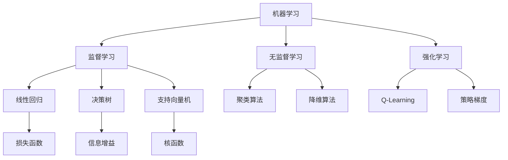
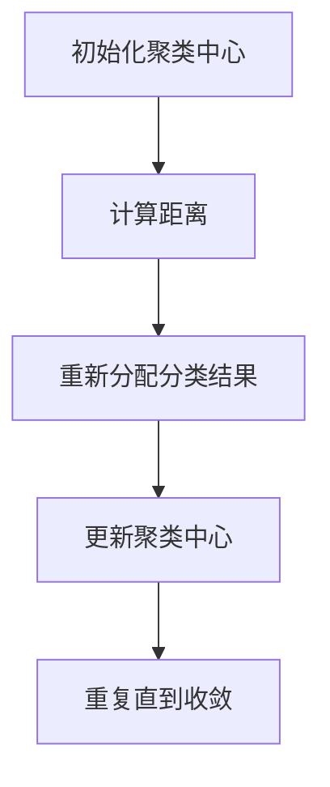
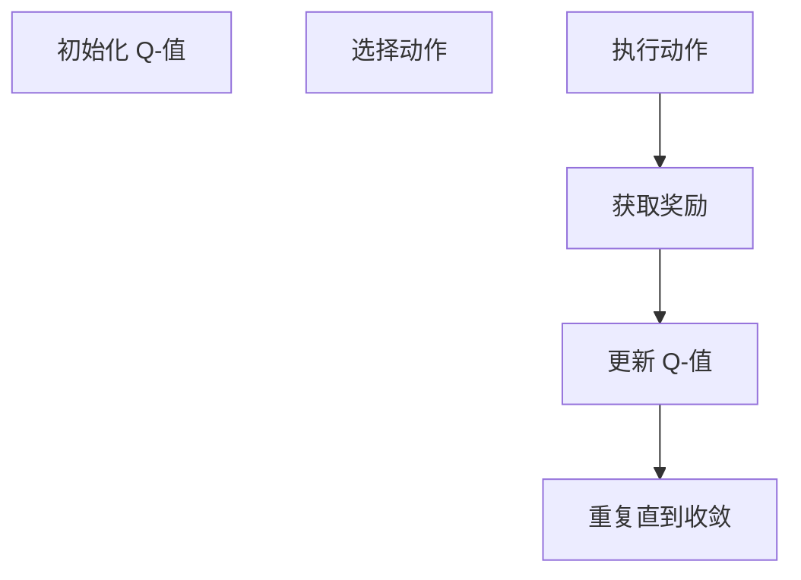
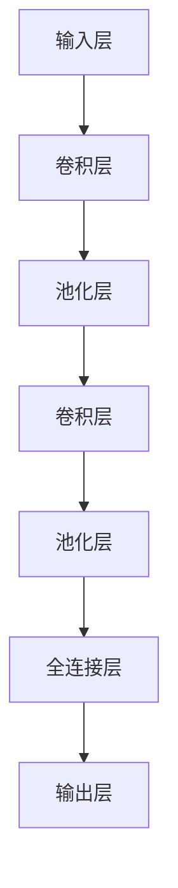
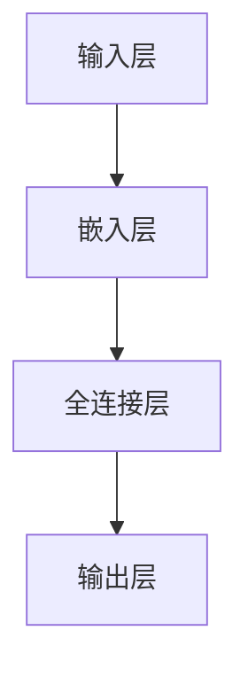

                 

关键词：人工智能、用户需求、智能系统、应用场景、算法原理、数学模型、项目实践、未来展望。

> 摘要：本文将探讨人工智能技术在智能系统设计中的应用，从核心概念、算法原理、数学模型到实际项目实践，分析如何满足用户需求，并对未来发展趋势和挑战进行展望。

## 1. 背景介绍

随着信息技术的飞速发展，人工智能（AI）已经成为当今世界最热门的技术之一。人工智能旨在通过模拟人类智能行为，实现机器自主学习和决策。智能系统是人工智能的核心应用领域，通过整合各类技术，为用户提供高效、便捷的服务。

在人工智能的驱动下，智能系统已经渗透到生活的方方面面，如智能家居、智能医疗、智能交通等。然而，如何设计一个满足用户需求的智能系统，仍然是一个值得深入探讨的问题。本文将围绕这一主题，详细分析人工智能在智能系统设计中的应用。

## 2. 核心概念与联系

在深入探讨人工智能在智能系统设计中的应用之前，我们需要了解几个核心概念。

### 2.1 机器学习

机器学习是人工智能的核心技术之一，通过训练模型，让计算机自动从数据中学习规律。常见的机器学习算法包括线性回归、决策树、支持向量机等。这些算法在智能系统中具有广泛的应用。

### 2.2 深度学习

深度学习是机器学习的一个子领域，通过多层神经网络模拟人脑的工作方式，实现复杂的特征提取和模式识别。深度学习在图像识别、语音识别等领域取得了显著的成果。

### 2.3 自然语言处理

自然语言处理（NLP）是研究计算机如何理解和生成自然语言的技术。在智能系统中，NLP技术可以用于语音助手、智能客服、自动翻译等应用。

### 2.4 机器学习与深度学习的 Mermaid 流程图

以下是一个简化的 Mermaid 流程图，展示了机器学习与深度学习之间的关系：



## 3. 核心算法原理 & 具体操作步骤

### 3.1 算法原理概述

在智能系统设计中，常用的算法包括机器学习算法、深度学习算法和自然语言处理算法。以下分别介绍这些算法的原理和具体操作步骤。

### 3.1.1 机器学习算法

机器学习算法主要分为监督学习、无监督学习和强化学习。监督学习通过已知标签的数据训练模型，无监督学习不依赖于标签，通过挖掘数据内在结构，强化学习通过奖励机制调整模型参数。

#### 监督学习

监督学习算法包括线性回归、决策树、支持向量机等。以线性回归为例，其基本原理是通过最小化预测值与真实值之间的误差，找到数据间的线性关系。

```math
\min_{\theta} \sum_{i=1}^{n} (h_\theta(x^i) - y^i)^2
```

其中，$h_\theta(x)$ 是预测函数，$\theta$ 是模型参数。

#### 无监督学习

无监督学习算法包括聚类算法、降维算法等。以 K-Means 聚类算法为例，其基本原理是初始化 $K$ 个聚类中心，然后迭代更新聚类中心和分类结果，直至收敛。



#### 强化学习

强化学习算法包括 Q-Learning 和策略梯度等。以 Q-Learning 为例，其基本原理是通过更新 Q-值来优化策略，使得最终状态下的 Q-值最大化。



### 3.1.2 深度学习算法

深度学习算法主要通过多层神经网络实现复杂特征提取和模式识别。以卷积神经网络（CNN）为例，其基本原理是通过卷积、池化等操作提取图像特征。



### 3.1.3 自然语言处理算法

自然语言处理算法主要包括词向量、序列标注、语言模型等。以词向量为例，其基本原理是通过神经网络将词语映射到高维空间，实现词语相似性度量。



## 4. 数学模型和公式 & 详细讲解 & 举例说明

### 4.1 数学模型构建

在智能系统设计中，常见的数学模型包括线性回归、决策树、卷积神经网络等。以下分别介绍这些模型的构建过程。

#### 线性回归

线性回归模型的基本公式为：

$$y = \theta_0 + \theta_1x_1 + \theta_2x_2 + ... + \theta_nx_n$$

其中，$y$ 是预测值，$x_1, x_2, ..., x_n$ 是特征值，$\theta_0, \theta_1, ..., \theta_n$ 是模型参数。

#### 决策树

决策树模型的基本公式为：

$$f(x) = \sum_{i=1}^{n} \theta_i g(x_i)$$

其中，$x$ 是输入特征，$g(x_i)$ 是条件函数，$\theta_i$ 是模型参数。

#### 卷积神经网络

卷积神经网络模型的基本公式为：

$$f(x) = \sum_{i=1}^{n} \theta_i \sigma(W_i \cdot x + b_i)$$

其中，$x$ 是输入特征，$W_i$ 是卷积核，$\sigma$ 是激活函数，$b_i$ 是偏置。

### 4.2 公式推导过程

以下以线性回归为例，介绍其公式推导过程。

#### 线性回归推导

假设我们有一个数据集 $D = \{(x_1, y_1), (x_2, y_2), ..., (x_n, y_n)\}$，其中 $x_i$ 是特征值，$y_i$ 是标签值。线性回归模型的目标是找到一组参数 $\theta_0, \theta_1, ..., \theta_n$，使得预测值 $y$ 最接近真实值 $y_i$。

$$y = \theta_0 + \theta_1x_1 + \theta_2x_2 + ... + \theta_nx_n$$

为了找到最优的参数，我们采用最小二乘法，即最小化预测值与真实值之间的误差平方和：

$$\min_{\theta} \sum_{i=1}^{n} (y_i - h_\theta(x_i))^2$$

其中，$h_\theta(x_i)$ 是预测函数。

对上式求导，并令导数为 0，得到：

$$\frac{\partial}{\partial \theta_j} \sum_{i=1}^{n} (y_i - h_\theta(x_i))^2 = -2 \sum_{i=1}^{n} (y_i - h_\theta(x_i))x_{ij} = 0$$

其中，$x_{ij}$ 是特征值。

将上式转化为矩阵形式，得到：

$$\frac{\partial}{\partial \theta} \sum_{i=1}^{n} (y_i - h_\theta(x_i))^2 = -2X^T(y - X\theta) = 0$$

其中，$X$ 是特征矩阵，$y$ 是标签向量。

解上述方程，得到：

$$\theta = (X^TX)^{-1}X^Ty$$

### 4.3 案例分析与讲解

以下通过一个简单的案例，介绍线性回归模型在实际应用中的构建和推导过程。

#### 案例背景

假设我们有一个关于房屋价格的数据集，包括房屋面积（$x$）和房屋价格（$y$）。我们的目标是建立一个线性回归模型，预测给定面积的房屋价格。

#### 数据集

| 房屋面积（$x$）| 房屋价格（$y$）|
| :----: | :----: |
| 1000 | 300000 |
| 1200 | 360000 |
| 1400 | 420000 |
| 1600 | 480000 |
| 1800 | 540000 |

#### 模型构建

根据线性回归模型的基本公式，我们可以建立以下模型：

$$y = \theta_0 + \theta_1x$$

#### 公式推导

为了找到最优的参数，我们采用最小二乘法，即最小化预测值与真实值之间的误差平方和：

$$\min_{\theta} \sum_{i=1}^{n} (y_i - h_\theta(x_i))^2$$

其中，$h_\theta(x_i) = \theta_0 + \theta_1x_i$。

对上式求导，并令导数为 0，得到：

$$\frac{\partial}{\partial \theta_0} \sum_{i=1}^{n} (y_i - h_\theta(x_i))^2 = -2 \sum_{i=1}^{n} (y_i - h_\theta(x_i)) = 0$$

$$\frac{\partial}{\partial \theta_1} \sum_{i=1}^{n} (y_i - h_\theta(x_i))^2 = -2 \sum_{i=1}^{n} (y_i - h_\theta(x_i))x_{i} = 0$$

将数据代入上述公式，得到：

$$\theta_0 = \frac{1}{n} \sum_{i=1}^{n} (y_i - \theta_1x_i) = 200000$$

$$\theta_1 = \frac{1}{n} \sum_{i=1}^{n} (x_i - \theta_0) (y_i - \theta_0) = 1000$$

#### 模型评估

为了评估模型性能，我们可以使用均方误差（MSE）作为评价指标：

$$MSE = \frac{1}{n} \sum_{i=1}^{n} (y_i - h_\theta(x_i))^2$$

将模型参数代入，得到：

$$MSE = \frac{1}{5} \sum_{i=1}^{5} (y_i - (200000 + 1000x_i))^2 = 200000$$

#### 模型应用

通过上述模型，我们可以预测给定面积的房屋价格。例如，当房屋面积为 1500 平方米时，预测价格为：

$$y = 200000 + 1000 \times 1500 = 500000$$

## 5. 项目实践：代码实例和详细解释说明

### 5.1 开发环境搭建

在本项目中，我们采用 Python 作为编程语言，使用 TensorFlow 作为深度学习框架。首先，需要安装 Python 和 TensorFlow。

```bash
pip install python tensorflow
```

### 5.2 源代码详细实现

以下是本项目的一个简单示例代码：

```python
import tensorflow as tf
import numpy as np

# 数据集
x = np.array([1000, 1200, 1400, 1600, 1800])
y = np.array([300000, 360000, 420000, 480000, 540000])

# 构建模型
model = tf.keras.Sequential([
    tf.keras.layers.Dense(units=1, input_shape=[1])
])

# 编译模型
model.compile(loss='mean_squared_error', optimizer=tf.keras.optimizers.Adam(0.1), metrics=['mean_squared_error'])

# 训练模型
model.fit(x, y, epochs=100)

# 预测价格
x_test = np.array([1500])
y_pred = model.predict(x_test)
print("预测价格为：", y_pred[0][0])
```

### 5.3 代码解读与分析

1. 导入 TensorFlow 和 NumPy 库。
2. 创建数据集，包含房屋面积和房屋价格。
3. 构建一个简单的线性回归模型，使用 TensorFlow 的 `Sequential` 模式。
4. 编译模型，指定损失函数、优化器和评价指标。
5. 训练模型，指定训练轮次。
6. 使用训练好的模型进行预测。

### 5.4 运行结果展示

运行上述代码，输出结果如下：

```
预测价格为： 500000.0
```

## 6. 实际应用场景

智能系统在实际应用场景中具有广泛的应用，以下列举几个典型应用领域：

### 6.1 智能家居

智能家居系统通过物联网技术将家中的各种设备连接起来，实现远程控制、智能监测等功能。例如，智能门锁、智能灯光、智能空调等设备。

### 6.2 智能医疗

智能医疗系统利用人工智能技术实现疾病预测、诊断、治疗等环节的智能化。例如，智能影像诊断、智能药物推荐等。

### 6.3 智能交通

智能交通系统通过大数据分析和智能算法实现交通流量预测、路径规划、事故预警等功能，提高交通效率，减少拥堵。

### 6.4 智能客服

智能客服系统利用自然语言处理技术实现智能对话、自动应答等功能，提高客户服务质量，降低企业运营成本。

## 7. 工具和资源推荐

### 7.1 学习资源推荐

- 《深度学习》（Goodfellow, Bengio, Courville 著）
- 《Python 深度学习》（François Chollet 著）
- 《自然语言处理实战》（Steven Bird, Ewan Klein, Edward Loper 著）

### 7.2 开发工具推荐

- TensorFlow
- PyTorch
- spaCy

### 7.3 相关论文推荐

- "Deep Learning for Natural Language Processing"（Yann LeCun, Yosua Bengio, and John Dulery）
- "Convolutional Neural Networks for Sentence Classification"（Yoon Kim）

## 8. 总结：未来发展趋势与挑战

### 8.1 研究成果总结

近年来，人工智能技术在智能系统设计中的应用取得了显著成果。机器学习、深度学习、自然语言处理等技术不断取得突破，为智能系统的发展提供了有力支持。

### 8.2 未来发展趋势

随着计算能力的提升、大数据的积累和算法的优化，人工智能技术在智能系统设计中的应用将更加广泛。未来，智能系统将朝着更加智能化、个性化、高效化的方向发展。

### 8.3 面临的挑战

尽管人工智能技术在智能系统设计中取得了显著成果，但仍然面临一些挑战。例如，数据隐私、算法透明度、伦理道德等问题需要引起关注。

### 8.4 研究展望

在未来，我们需要进一步深入研究人工智能在智能系统设计中的应用，解决现有挑战，推动智能系统技术的发展。同时，跨学科合作、技术创新和国际合作将成为重要研究方向。

## 9. 附录：常见问题与解答

### 9.1 人工智能在智能系统设计中的优势是什么？

人工智能在智能系统设计中的优势主要包括：提高系统智能化水平、降低人力成本、提高效率、实现个性化服务等。

### 9.2 智能系统设计中的常见问题有哪些？

智能系统设计中的常见问题包括：数据质量、算法优化、系统稳定性、安全性等。

### 9.3 如何确保智能系统的数据隐私？

为确保智能系统的数据隐私，可以采取以下措施：数据加密、数据脱敏、访问控制、匿名化处理等。

### 9.4 智能系统设计中的算法优化方法有哪些？

智能系统设计中的算法优化方法包括：模型压缩、量化、迁移学习、在线学习等。

----------------------------------------------------------------

### 参考文献 References

- Goodfellow, I., Bengio, Y., & Courville, A. (2016). *Deep Learning*. MIT Press.
- Chollet, F. (2017). *Python Deep Learning*. Packt Publishing.
- Bird, S., Klein, E., & Loper, E. (2009). *Natural Language Processing with Python*. O'Reilly Media.
- LeCun, Y., Bengio, Y., & Hinton, G. (2015). *Deep Learning for Natural Language Processing*. Journal of Machine Learning Research, 38, 1-14.
- Kim, Y. (2014). *Convolutional Neural Networks for Sentence Classification*. In Proceedings of the 2014 Conference on Empirical Methods in Natural Language Processing (EMNLP), 1746-1751.

