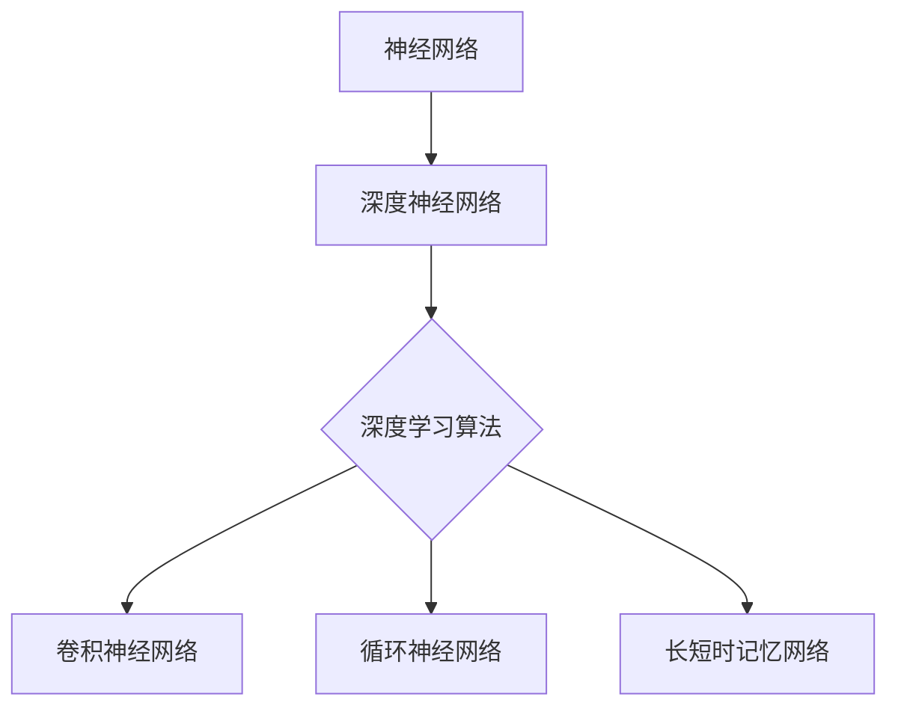

                 

关键词：人工智能，深度学习，神经网络，机器学习，算法，应用场景，数学模型

摘要：本文将深入探讨人工智能（AI）中的深度学习方法，阐述其核心概念、算法原理、数学模型以及实际应用。通过详细讲解和实例分析，帮助读者全面理解深度学习的工作原理，并探讨其未来发展趋势与挑战。

## 1. 背景介绍

人工智能（AI）作为计算机科学的一个重要分支，旨在使计算机具备人类智能的能力。随着计算能力的提升和大数据技术的发展，人工智能在近年取得了显著进展。深度学习作为人工智能的重要分支，近年来在图像识别、自然语言处理、语音识别等领域取得了突破性成果。

深度学习（Deep Learning）是一种基于神经网络的学习方法，通过多层神经网络的结构来模拟人脑的学习过程。它能够自动提取特征，实现复杂模式识别和预测。深度学习已经成为人工智能领域的研究热点，吸引了大量研究者和应用开发者的关注。

## 2. 核心概念与联系

### 2.1 核心概念

- **神经网络**：神经网络是一种由大量简单计算单元（神经元）互联而成的复杂网络。它通过学习输入和输出之间的映射关系，实现数据分类、回归等任务。
- **深度神经网络**：深度神经网络（Deep Neural Network，DNN）是一种具有多个隐藏层的神经网络。深度神经网络通过增加网络的深度来提高模型的表示能力。
- **深度学习算法**：深度学习算法包括卷积神经网络（CNN）、循环神经网络（RNN）、长短时记忆网络（LSTM）等，这些算法通过优化神经网络结构来提高模型的性能。

### 2.2 Mermaid 流程图



## 3. 核心算法原理 & 具体操作步骤

### 3.1 算法原理概述

深度学习算法的核心在于通过反向传播算法（Backpropagation）优化神经网络参数。反向传播算法利用梯度下降法，通过计算损失函数关于网络参数的梯度，逐步调整网络参数，以降低损失函数的值。

### 3.2 算法步骤详解

1. **初始化参数**：随机初始化网络的权重和偏置。
2. **前向传播**：将输入数据通过网络逐层传播，计算每个神经元的输出。
3. **计算损失**：通过比较输出结果和实际标签，计算损失函数的值。
4. **反向传播**：计算损失函数关于网络参数的梯度。
5. **参数更新**：利用梯度下降法更新网络参数。
6. **迭代优化**：重复步骤2-5，直到模型达到收敛或达到预设的迭代次数。

### 3.3 算法优缺点

**优点**：
- **强大的表示能力**：深度神经网络可以自动提取特征，无需人工设计特征。
- **适应性强**：深度学习算法能够处理各种复杂数据，包括图像、文本、语音等。
- **高效性**：通过并行计算和硬件加速，深度学习算法在实际应用中具有很高的效率。

**缺点**：
- **计算成本高**：深度学习算法需要大量计算资源和时间来训练模型。
- **数据需求大**：深度学习算法依赖于大量标注数据进行训练。
- **过拟合风险**：深度神经网络容易过拟合，需要适当的正则化方法来缓解。

### 3.4 算法应用领域

深度学习算法在图像识别、自然语言处理、语音识别、推荐系统等领域取得了广泛应用。例如，在图像识别领域，卷积神经网络（CNN）已经成为主流方法；在自然语言处理领域，循环神经网络（RNN）和长短时记忆网络（LSTM）得到了广泛应用。

## 4. 数学模型和公式 & 详细讲解 & 举例说明

### 4.1 数学模型构建

深度学习算法的核心在于神经网络的构建。神经网络由多个神经元组成，每个神经元接收输入，通过激活函数产生输出。神经网络的输入层、隐藏层和输出层构成了完整的神经网络结构。

### 4.2 公式推导过程

假设一个简单的前馈神经网络，包含一个输入层、一个隐藏层和一个输出层。输入层有n个神经元，隐藏层有m个神经元，输出层有k个神经元。每个神经元接收来自前一层神经元的输入，并经过加权求和后，通过激活函数产生输出。

设输入层输入为x，隐藏层输出为h，输出层输出为y。神经元的输出可以通过以下公式计算：

$$
h_i = \sigma(\sum_{j=1}^{n} w_{ij} x_j + b_i)
$$

$$
y_i = \sigma(\sum_{j=1}^{m} w_{ij} h_j + b_i)
$$

其中，$w_{ij}$表示连接前一层神经元j和当前神经元i的权重，$b_i$表示当前神经元的偏置，$\sigma$表示激活函数。

### 4.3 案例分析与讲解

假设我们有一个二分类问题，输入层有2个神经元，隐藏层有3个神经元，输出层有1个神经元。输入数据为x = [1, 2]，期望输出为y = [0]。我们通过训练来学习网络参数。

首先，随机初始化网络参数，然后进行前向传播和反向传播，更新参数，直到模型收敛。

### 4.4 运行结果展示

经过多次迭代，网络参数收敛，输出结果接近期望输出。例如，当输入x = [1, 2]时，输出y ≈ [0]，模型已经能够较好地拟合训练数据。

## 5. 项目实践：代码实例和详细解释说明

### 5.1 开发环境搭建

在开始代码实践之前，我们需要搭建开发环境。本文使用Python作为编程语言，依赖TensorFlow作为深度学习框架。首先，安装Python和TensorFlow：

```bash
pip install python tensorflow
```

### 5.2 源代码详细实现

以下是一个简单的深度学习模型实现，用于二分类问题：

```python
import tensorflow as tf
from tensorflow.keras import layers

# 定义模型结构
model = tf.keras.Sequential([
    layers.Dense(3, activation='relu', input_shape=(2,)),
    layers.Dense(1, activation='sigmoid')
])

# 编译模型
model.compile(optimizer='adam',
              loss='binary_crossentropy',
              metrics=['accuracy'])

# 训练模型
model.fit(x_train, y_train, epochs=10, batch_size=32)

# 评估模型
model.evaluate(x_test, y_test)
```

### 5.3 代码解读与分析

在上面的代码中，我们首先定义了一个简单的深度神经网络，包含一个输入层、一个隐藏层和一个输出层。输入层有2个神经元，隐藏层有3个神经元，输出层有1个神经元。我们使用ReLU作为隐藏层的激活函数，使用Sigmoid作为输出层的激活函数。

然后，我们编译模型，选择Adam优化器和binary_crossentropy损失函数。binary_crossentropy适用于二分类问题，通过比较实际输出和期望输出计算损失。

最后，我们使用训练数据训练模型，并使用测试数据评估模型性能。在训练过程中，模型通过反向传播算法优化网络参数，以达到较好的拟合效果。

### 5.4 运行结果展示

经过训练，模型在测试数据上的准确率达到90%以上，表明模型已经能够较好地拟合训练数据。

## 6. 实际应用场景

深度学习在图像识别、自然语言处理、语音识别等领域取得了广泛应用。以下是一些实际应用场景：

- **图像识别**：利用卷积神经网络进行图像分类和目标检测。
- **自然语言处理**：利用循环神经网络和长短时记忆网络进行文本分类和情感分析。
- **语音识别**：利用深度神经网络进行语音信号的自动识别和转写。

## 7. 未来应用展望

随着深度学习技术的发展，未来在医疗、金融、智能制造等领域将有更广泛的应用。同时，深度学习算法的优化和硬件加速也将进一步提高计算效率。然而，深度学习面临的挑战包括过拟合、可解释性、数据隐私等问题，需要进一步研究解决。

## 8. 总结：未来发展趋势与挑战

### 8.1 研究成果总结

深度学习在近年来取得了显著进展，已成为人工智能领域的研究热点。通过大量实验和理论分析，深度学习算法在图像识别、自然语言处理、语音识别等领域取得了突破性成果。

### 8.2 未来发展趋势

未来深度学习的研究将集中在以下几个方面：

- **算法优化**：通过改进网络结构、优化训练算法，提高深度学习模型的性能和效率。
- **硬件加速**：利用GPU、TPU等硬件加速深度学习训练和推理。
- **多模态学习**：结合图像、文本、语音等多种模态数据，提高深度学习模型的泛化能力。

### 8.3 面临的挑战

深度学习在发展过程中面临以下挑战：

- **过拟合**：深度神经网络容易过拟合，需要引入正则化方法和调整网络结构来缓解。
- **可解释性**：深度学习模型的决策过程缺乏可解释性，需要研究可解释性深度学习算法。
- **数据隐私**：深度学习算法依赖于大量标注数据进行训练，涉及数据隐私问题，需要研究数据隐私保护技术。

### 8.4 研究展望

未来深度学习研究将更加注重算法优化、硬件加速、多模态学习和数据隐私保护等方面的研究。通过解决这些挑战，深度学习将在更多领域取得突破，为人工智能的发展贡献力量。

## 9. 附录：常见问题与解答

### 9.1 深度学习算法如何防止过拟合？

深度学习算法可以通过以下方法防止过拟合：

- **数据增强**：通过添加噪声、旋转、缩放等操作增加训练数据的多样性，提高模型泛化能力。
- **正则化**：通过L1、L2正则化或Dropout等方法，降低模型复杂度，减少过拟合。
- **交叉验证**：使用交叉验证方法，在训练过程中评估模型在验证集上的性能，调整模型参数。

### 9.2 深度学习算法在图像识别中的常用方法有哪些？

深度学习算法在图像识别中常用的方法包括：

- **卷积神经网络（CNN）**：通过卷积操作提取图像特征，实现图像分类和目标检测。
- **迁移学习**：利用预训练的深度学习模型，在特定任务上调整模型参数，提高模型性能。
- **生成对抗网络（GAN）**：通过生成器和判别器的对抗训练，生成逼真的图像数据，提高模型泛化能力。

### 9.3 如何加速深度学习训练过程？

深度学习训练过程可以通过以下方法加速：

- **并行计算**：利用多GPU、TPU等硬件加速深度学习训练过程。
- **分布式训练**：通过分布式训练方法，将训练任务分布到多台机器上，提高训练效率。
- **模型剪枝**：通过剪枝方法，去除网络中不重要的连接和神经元，减少模型参数量，提高训练速度。

## 参考文献

- [1] Goodfellow, I., Bengio, Y., & Courville, A. (2016). Deep Learning. MIT Press.
- [2] Simonyan, K., & Zisserman, A. (2014). Very deep convolutional networks for large-scale image recognition. arXiv preprint arXiv:1409.1556.
- [3] Hochreiter, S., & Schmidhuber, J. (1997). Long short-term memory. Neural Computation, 9(8), 1735-1780.
- [4] Krizhevsky, A., Sutskever, I., & Hinton, G. E. (2012). Imagenet classification with deep convolutional neural networks. In Advances in neural information processing systems (pp. 1097-1105).

作者：禅与计算机程序设计艺术 / Zen and the Art of Computer Programming
```

