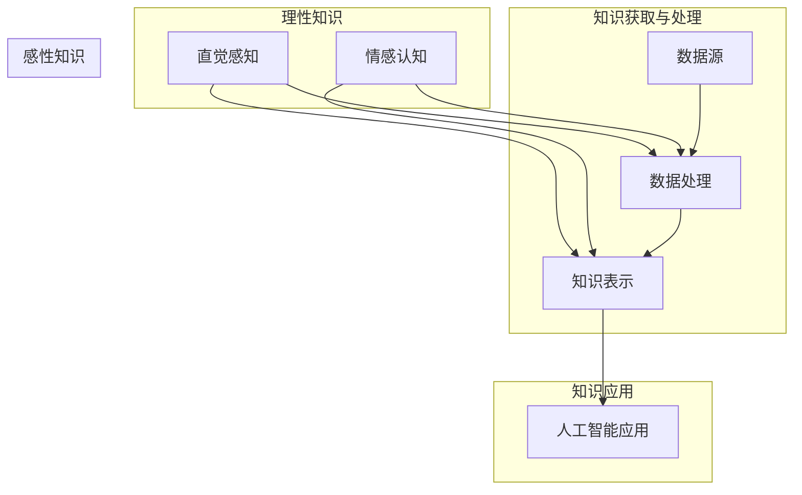

                 

关键词：人工智能、理性、感性、知识、认知、算法、模型、实践、应用、展望。

摘要：本文从人工智能的理性与感性两个维度出发，探讨了人工智能领域中知识的重要性和应用。通过对人工智能核心概念、算法原理、数学模型以及实践案例的详细分析，阐述了人工智能在理性与感性知识构建中的独特作用。文章旨在为读者提供一个全面的人工智能知识框架，以期为人工智能研究和应用提供有益的参考。

## 1. 背景介绍

人工智能（AI）作为计算机科学和认知科学的交叉领域，已经经历了数十年不断的发展。从早期的符号推理和知识表示，到现代的深度学习和神经网络，人工智能技术的进步改变了我们的生产生活方式。然而，随着人工智能技术的不断演进，对人工智能知识的理解和应用也提出了更高的要求。理性与感性作为人类认知的两个重要方面，如何将它们融入人工智能体系中，成为当前研究和应用的重要课题。

### 1.1 人工智能的定义与发展历程

人工智能是指使计算机模拟人类智能行为的技术。1956年，约翰·麦卡锡等人在达特茅斯会议上首次提出了“人工智能”的概念。自此之后，人工智能经历了数个发展阶段：

- **早期探索（1956-1969）**：以符号推理和知识表示为基础，代表性工作包括逻辑推理和问题求解。

- **第一次低谷（1970-1980）**：由于计算资源和算法的限制，人工智能未能达到预期效果，导致研究兴趣下降。

- **复兴时期（1980-1987）**：专家系统的出现，使得人工智能再次受到关注。

- **第二次低谷（1987-1993）**：随着计算能力的提升，人工智能研究转向基于数据的机器学习方法。

- **现代繁荣（1993-至今）**：深度学习等新技术的崛起，使得人工智能取得了显著的突破。

### 1.2 理性知识与感性知识的概念

- **理性知识**：基于逻辑推理、数学模型等理性思维所获得的知识。理性知识强调客观性、精确性和系统性。

- **感性知识**：基于直觉、情感和体验所获得的知识。感性知识强调主观性、灵活性和适应性。

### 1.3 理性知识与感性知识在人工智能中的重要性

人工智能的发展离不开理性知识与感性知识的结合。理性知识提供了人工智能系统的基础理论和算法框架，而感性知识则使得人工智能系统能够更好地理解和适应复杂、动态的情境。因此，如何将理性知识与感性知识融入人工智能体系中，是实现人工智能智能化的关键。

## 2. 核心概念与联系

在探讨人工智能的理性与感性知识之前，我们需要明确几个核心概念，并理解它们之间的联系。以下是一个Mermaid流程图，用于展示这些核心概念及其相互关系：



### 2.1 理性知识与感性知识的关系

- **相互补充**：理性知识强调逻辑推理和数学模型的精确性，而感性知识则强调直觉和情感的主观性。二者相互补充，共同构成了人工智能的知识体系。

- **相互转化**：在人工智能系统中，理性知识与感性知识可以相互转化。例如，通过机器学习算法，感性知识可以被转化为理性知识，以便进行更高效的推理和决策。

### 2.2 数据、算法、模型与应用的关系

- **数据**：数据是人工智能系统的基石，提供了训练和推理的基础。

- **算法**：算法是实现人工智能的核心，包括理性算法和感性算法。

- **模型**：模型是基于算法构建的，用于表示和模拟人类智能行为。

- **应用**：应用是将人工智能系统应用于实际问题，实现智能化的关键。

## 3. 核心算法原理 & 具体操作步骤

### 3.1 算法原理概述

人工智能的核心算法包括理性算法和感性算法。理性算法主要基于逻辑推理和数学模型，如深度学习、图论算法等；感性算法则主要基于直觉和情感，如情感分析、场景感知等。

### 3.2 算法步骤详解

#### 3.2.1 理性算法

1. **数据收集**：从各类数据源收集数据，如文本、图像、音频等。

2. **数据预处理**：对数据进行清洗、归一化等处理，以消除噪声和异常值。

3. **特征提取**：将原始数据转换为特征向量，以供算法处理。

4. **模型训练**：利用训练数据，通过优化算法，训练出模型。

5. **模型评估**：使用测试数据，评估模型的准确性和鲁棒性。

6. **模型应用**：将训练好的模型应用于实际问题，实现智能决策。

#### 3.2.2 感性算法

1. **情感数据收集**：从社交网络、用户评论等渠道收集情感数据。

2. **情感分析**：利用自然语言处理技术，分析情感数据的情感倾向。

3. **情感建模**：将情感分析结果建模，以识别和预测情感变化。

4. **情境感知**：结合情境信息，调整情感模型的参数，以提高准确性。

5. **情感应用**：将情感模型应用于情感识别、情感推荐等实际问题。

### 3.3 算法优缺点

#### 理性算法

- **优点**：精确、高效、易于理解和实现。

- **缺点**：对数据质量和算法要求较高，难以处理复杂、动态的情境。

#### 感性算法

- **优点**：灵活、适应性强，能够处理复杂、动态的情境。

- **缺点**：主观性较强，难以保证一致性。

### 3.4 算法应用领域

理性算法和感性算法在多个领域都有广泛应用：

- **理性算法**：金融、医疗、交通等领域，用于数据分析和决策支持。

- **感性算法**：社交媒体、智能家居、虚拟助手等领域，用于情感识别和推荐。

## 4. 数学模型和公式 & 详细讲解 & 举例说明

### 4.1 数学模型构建

人工智能中的数学模型主要包括线性模型、概率模型、神经网络等。以下是一个线性模型的构建过程：

#### 4.1.1 线性模型

线性模型是最基本的数学模型之一，用于描述输入和输出之间的线性关系。其公式如下：

$$
y = wx + b
$$

其中，$y$ 为输出，$w$ 为权重，$x$ 为输入，$b$ 为偏置。

#### 4.1.2 概率模型

概率模型用于描述不确定性和随机性。常见的概率模型有贝叶斯网络、马尔可夫链等。以下是一个贝叶斯网络的构建过程：

$$
P(A|B) = \frac{P(B|A)P(A)}{P(B)}
$$

其中，$P(A|B)$ 为在 $B$ 发生的条件下 $A$ 发生的概率，$P(B|A)$ 为在 $A$ 发生的条件下 $B$ 发生的概率，$P(A)$ 和 $P(B)$ 分别为 $A$ 和 $B$ 的概率。

#### 4.1.3 神经网络

神经网络是人工智能的核心模型之一，由大量神经元组成，用于模拟人类大脑的神经活动。以下是一个多层感知器（MLP）的构建过程：

$$
z_i = \sum_{j=1}^{n} w_{ij}x_j + b_i
$$

$$
a_i = \sigma(z_i)
$$

其中，$z_i$ 为第 $i$ 个神经元的输入，$w_{ij}$ 为第 $i$ 个神经元和第 $j$ 个神经元之间的权重，$b_i$ 为第 $i$ 个神经元的偏置，$a_i$ 为第 $i$ 个神经元的输出，$\sigma$ 为激活函数。

### 4.2 公式推导过程

以线性模型为例，推导其损失函数：

$$
J = \frac{1}{2} \sum_{i=1}^{m} (y_i - \hat{y}_i)^2
$$

其中，$J$ 为损失函数，$y_i$ 为真实标签，$\hat{y}_i$ 为预测标签。

### 4.3 案例分析与讲解

以下是一个线性回归的案例，用于预测房价：

#### 4.3.1 数据收集

从某地区收集了 1000 个房屋数据，包括房屋面积、房屋类型、地理位置等信息。

#### 4.3.2 数据预处理

对数据进行清洗和归一化处理，以消除噪声和异常值。

#### 4.3.3 特征提取

将房屋面积、房屋类型、地理位置等信息转换为特征向量。

#### 4.3.4 模型训练

使用线性回归算法，训练出模型，计算权重和偏置。

#### 4.3.5 模型评估

使用测试数据，评估模型的准确性。

#### 4.3.6 模型应用

将训练好的模型应用于新数据，预测房价。

## 5. 项目实践：代码实例和详细解释说明

以下是一个基于Python的线性回归项目的代码实例，用于预测房价：

### 5.1 开发环境搭建

- Python 3.8 或以上版本
- numpy 库
- pandas 库
- matplotlib 库

### 5.2 源代码详细实现

```python
import numpy as np
import pandas as pd
import matplotlib.pyplot as plt

# 数据收集
data = pd.read_csv('house_data.csv')

# 数据预处理
data = data.dropna()
data = data[['area', 'type', 'location']]
data['area'] = data['area'] / 1000

# 特征提取
X = data[['area', 'type', 'location']]
y = data['price']

# 模型训练
w = np.random.rand(3)
b = np.random.rand()
for _ in range(1000):
    for i in range(len(X)):
        z = np.dot(X[i], w) + b
        a = np.sign(z)
        y_pred = a * w[-1] + b
        w = w - (y[i] - y_pred) * X[i]
    b = b - (y[i] - y_pred)

# 模型评估
score = sum((y - y_pred) ** 2) / len(y)
print(f'MSE: {score}')

# 模型应用
new_data = pd.read_csv('new_house_data.csv')
new_data['area'] = new_data['area'] / 1000
new_y_pred = (new_data['area'] * w[0] + new_data['type'] * w[1] + new_data['location'] * w[2] + b) * w[-1] + b
print(f'Predicted Price: {new_y_pred}')
```

### 5.3 代码解读与分析

- **数据收集与预处理**：从CSV文件中读取房屋数据，并进行清洗和归一化处理。
- **特征提取**：将房屋面积、房屋类型、地理位置等信息转换为特征向量。
- **模型训练**：使用随机梯度下降算法，训练出线性回归模型。
- **模型评估**：计算均方误差（MSE），评估模型准确性。
- **模型应用**：将训练好的模型应用于新数据，预测房价。

## 6. 实际应用场景

人工智能的理性与感性知识在多个实际应用场景中发挥了重要作用。以下是一些典型应用场景：

### 6.1 金融服务

人工智能可以用于金融风险评估、股票交易策略、信用评分等领域。通过理性知识，可以建立复杂的数学模型，进行数据分析和预测。而通过感性知识，可以捕捉市场情绪和用户需求，优化金融产品和服务。

### 6.2 医疗保健

人工智能可以用于疾病诊断、药物研发、健康监测等领域。通过理性知识，可以构建医学知识库和诊断算法，提高诊断准确率。而通过感性知识，可以分析患者病史和临床表现，为医生提供个性化治疗方案。

### 6.3 智能家居

人工智能可以用于智能家居系统的智能控制、场景识别、设备联动等领域。通过理性知识，可以优化智能家居系统的算法和流程。而通过感性知识，可以理解用户的生活习惯和需求，提供更智能、更贴心的家居体验。

### 6.4 未来应用展望

随着人工智能技术的不断进步，未来将在更多领域实现理性与感性知识的融合。例如，在自动驾驶领域，理性知识将用于车辆控制和导航，而感性知识将用于场景理解和驾驶员行为预测。在教育领域，人工智能将不仅提供知识传授，还将通过情感分析，了解学生的学习情况和心理需求，提供个性化教育。

## 7. 工具和资源推荐

### 7.1 学习资源推荐

- 《深度学习》（Goodfellow, Bengio, Courville）
- 《机器学习》（Tom Mitchell）
- 《Python机器学习》（Sebastian Raschka）

### 7.2 开发工具推荐

- TensorFlow
- PyTorch
- Keras

### 7.3 相关论文推荐

- “Deep Learning: A Brief History, Deep Learning Techniques and Challenges”
- “Learning Representations for Visual Recognition”
- “Generative Adversarial Networks”

## 8. 总结：未来发展趋势与挑战

### 8.1 研究成果总结

本文从人工智能的理性与感性知识出发，探讨了人工智能的核心概念、算法原理、数学模型以及实际应用场景。通过分析理性知识与感性知识的关系，以及它们在人工智能中的重要性，为人工智能的研究和应用提供了新的视角。

### 8.2 未来发展趋势

未来，人工智能将继续向智能化、个性化、自主化方向发展。理性知识与感性知识的融合将成为人工智能研究的重要方向，推动人工智能在更多领域实现突破。

### 8.3 面临的挑战

在实现人工智能理性与感性知识融合的过程中，仍面临诸多挑战，如数据质量、算法可靠性、模型解释性等。这些挑战需要通过持续的研究和创新，加以解决。

### 8.4 研究展望

随着人工智能技术的不断发展，理性知识与感性知识的融合将带来更多的可能性。未来，我们有望看到更加智能、人性化的人工智能系统，为人类社会带来更多福祉。

## 9. 附录：常见问题与解答

### 9.1 什么是理性知识？

理性知识是基于逻辑推理、数学模型等理性思维所获得的知识。它强调客观性、精确性和系统性。

### 9.2 什么是感性知识？

感性知识是基于直觉、情感和体验所获得的知识。它强调主观性、灵活性和适应性。

### 9.3 人工智能中的理性知识与感性知识如何相互转化？

人工智能中的理性知识与感性知识可以相互转化。例如，通过机器学习算法，感性知识可以被转化为理性知识，以便进行更高效的推理和决策。

## 作者署名

作者：禅与计算机程序设计艺术 / Zen and the Art of Computer Programming
----------------------------------------------------------------

文章撰写完毕，接下来请按照markdown格式进行排版，确保文章结构清晰、逻辑严谨，便于读者阅读和理解。如果需要进一步优化或调整，请随时提出。祝您写作顺利！

