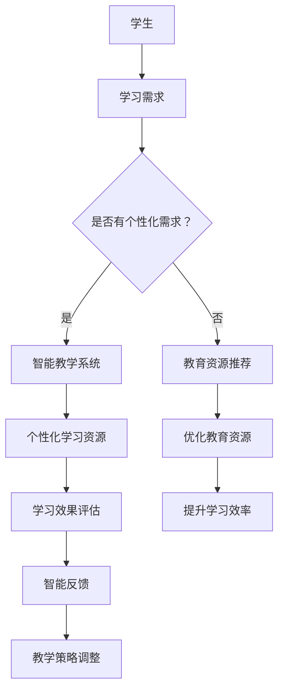

                 

关键词：人工智能、教育变革、技术进步、学习效率、个性化教育

> 摘要：随着人工智能技术的飞速发展，教育领域正迎来一场前所未有的变革。本文从人工智能的背景出发，探讨了其在教育领域的应用潜力，分析了人工智能对教育模式、教学方法、学习体验等方面的影响，并对未来教育的发展趋势进行了展望。

## 1. 背景介绍

人工智能（AI）作为一门涉及计算机科学、数学、神经科学等多个学科领域的交叉学科，已经成为全球科技发展的热点。近年来，得益于深度学习、神经网络、自然语言处理等技术的突破，人工智能在图像识别、语音识别、智能推荐、自动驾驶等领域取得了显著成果。与此同时，人工智能在教育领域的应用也逐渐受到关注。

教育是国民发展的基石，教育质量的提升直接关系到国家的未来。然而，传统的教育模式在许多方面存在局限性，如教育资源不均衡、学生学习效率低下、个性化教育难以实现等。这些问题使得教育改革成为亟待解决的问题。而人工智能技术的应用，为解决这些问题提供了新的思路和方法。

## 2. 核心概念与联系

为了更好地理解人工智能在教育领域的应用，我们需要先了解一些核心概念和它们之间的联系。

### 2.1. 人工智能的基本概念

- **机器学习**：一种让计算机通过数据学习并做出决策的技术，分为监督学习、无监督学习和强化学习。
- **深度学习**：一种基于人工神经网络的机器学习技术，通过多层神经网络的训练，实现图像识别、语音识别等复杂任务。
- **自然语言处理**：研究计算机如何理解和生成自然语言的技术，包括文本分类、机器翻译、情感分析等。

### 2.2. 教育与人工智能的联系

人工智能与教育的结合主要体现在以下几个方面：

- **个性化教育**：利用人工智能技术，根据学生的学习特点和需求，提供个性化的学习资源和方法。
- **智能评估与反馈**：通过人工智能技术，对学生的学习过程和结果进行实时评估和反馈，帮助教师和学生及时调整教学和学习策略。
- **智能教学系统**：基于人工智能技术的智能教学系统，能够模拟教师的教学过程，为学生提供互动性强的学习体验。
- **教育资源优化**：利用人工智能技术，对海量的教育资源进行筛选、推荐，提高教育资源的利用效率。

### 2.3. Mermaid 流程图



## 3. 核心算法原理 & 具体操作步骤

### 3.1. 算法原理概述

在教育领域，人工智能的应用主要依赖于以下几个核心算法：

- **聚类算法**：用于分析学生的个性化学习需求，将学生划分为不同的学习群体。
- **分类算法**：用于对学习资源进行分类和推荐。
- **决策树算法**：用于对学生学习效果进行评估和预测。
- **神经网络算法**：用于构建智能教学系统和学习评估系统。

### 3.2. 算法步骤详解

#### 3.2.1. 聚类算法

1. 收集学生的学习数据，如学习时间、学习内容、考试成绩等。
2. 使用聚类算法，如K-means算法，对学习数据进行分析，将学生划分为不同的学习群体。
3. 根据学习群体的特点，为每个学生推荐个性化的学习资源。

#### 3.2.2. 分类算法

1. 收集海量的教育资源，如教材、视频、习题等。
2. 使用分类算法，如SVM算法，对教育资源进行分类。
3. 根据学生的学习需求，为每个学生推荐合适的学习资源。

#### 3.2.3. 决策树算法

1. 收集学生的学习数据，如学习时间、学习内容、考试成绩等。
2. 使用决策树算法，对学习数据进行分析，建立学习效果评估模型。
3. 根据评估模型，对学生学习效果进行实时评估和预测。

#### 3.2.4. 神经网络算法

1. 收集学生的学习数据，如学习时间、学习内容、考试成绩等。
2. 使用神经网络算法，如深度学习模型，构建智能教学系统和学习评估系统。
3. 通过训练和优化，提高智能教学系统和学习评估系统的准确性和效率。

### 3.3. 算法优缺点

- **聚类算法**：优点在于能够有效地发现学生的个性化学习需求，但缺点是计算复杂度较高，对数据质量要求较高。
- **分类算法**：优点在于能够为每个学生推荐合适的学习资源，但缺点是对数据量要求较高，对异常值敏感。
- **决策树算法**：优点在于能够对学生的学习效果进行实时评估和预测，但缺点是模型可解释性较差。
- **神经网络算法**：优点在于能够处理复杂的非线性关系，但缺点是训练时间较长，对数据质量要求较高。

### 3.4. 算法应用领域

- **个性化教育**：利用聚类算法和分类算法，为每个学生推荐个性化的学习资源。
- **智能评估与反馈**：利用决策树算法和神经网络算法，对学生学习效果进行实时评估和反馈。
- **智能教学系统**：利用神经网络算法，构建能够模拟教师教学过程的智能教学系统。

## 4. 数学模型和公式 & 详细讲解 & 举例说明

### 4.1. 数学模型构建

在教育领域，常用的数学模型包括聚类模型、分类模型、决策树模型和神经网络模型。以下分别介绍这些模型的构建方法。

#### 4.1.1. 聚类模型

聚类模型主要用于分析学生的个性化学习需求。常见的聚类模型有K-means算法和层次聚类算法。

- **K-means算法**：假设有n个学生，每个学生有m个学习特征。算法的步骤如下：

  1. 随机选择k个初始中心点。
  2. 计算每个学生到中心点的距离，并将其分配到最近的中心点所在的簇。
  3. 重新计算每个簇的中心点。
  4. 重复步骤2和步骤3，直到中心点不再发生变化。

- **层次聚类算法**：假设有n个学生，每个学生有m个学习特征。算法的步骤如下：

  1. 将每个学生视为一个簇。
  2. 计算两两簇之间的距离，选择距离最近的两个簇进行合并。
  3. 重复步骤2，直到所有簇合并为一个簇。

#### 4.1.2. 分类模型

分类模型主要用于对学习资源进行分类和推荐。常见的分类模型有SVM算法和决策树算法。

- **SVM算法**：假设有n个学习资源，每个资源有m个特征。算法的步骤如下：

  1. 收集学习资源的数据集，并进行特征提取。
  2. 使用支持向量机算法，对数据集进行训练。
  3. 根据训练结果，对新的学习资源进行分类。

- **决策树算法**：假设有n个学习资源，每个资源有m个特征。算法的步骤如下：

  1. 收集学习资源的数据集，并进行特征提取。
  2. 使用决策树算法，对数据集进行训练。
  3. 根据训练结果，对新的学习资源进行分类。

#### 4.1.3. 决策树模型

决策树模型主要用于对学生学习效果进行评估和预测。常见的决策树模型有ID3算法和C4.5算法。

- **ID3算法**：假设有n个学生，每个学生有m个学习特征。算法的步骤如下：

  1. 收集学生的学习数据，并进行特征提取。
  2. 构建决策树，选择具有最大信息增益的特征作为节点。
  3. 对每个节点，递归地重复步骤2。

- **C4.5算法**：假设有n个学生，每个学生有m个学习特征。算法的步骤如下：

  1. 收集学生的学习数据，并进行特征提取。
  2. 构建决策树，选择具有最大信息增益率的特征作为节点。
  3. 对每个节点，递归地重复步骤2。

#### 4.1.4. 神经网络模型

神经网络模型主要用于构建智能教学系统和学习评估系统。常见的神经网络模型有感知机模型、BP算法、卷积神经网络等。

- **感知机模型**：假设有n个学生，每个学生有m个学习特征。算法的步骤如下：

  1. 收集学生的学习数据，并进行特征提取。
  2. 构建感知机模型，对学习数据进行训练。
  3. 根据训练结果，对新的学习数据进行预测。

- **BP算法**：假设有n个学生，每个学生有m个学习特征。算法的步骤如下：

  1. 收集学生的学习数据，并进行特征提取。
  2. 构建BP神经网络，对学习数据进行训练。
  3. 根据训练结果，对新的学习数据进行预测。

- **卷积神经网络**：假设有n个学生，每个学生有m个学习特征。算法的步骤如下：

  1. 收集学生的学习数据，并进行特征提取。
  2. 构建卷积神经网络，对学习数据进行训练。
  3. 根据训练结果，对新的学习数据进行预测。

### 4.2. 公式推导过程

以下是常用的数学模型和算法的公式推导过程。

#### 4.2.1. K-means算法

假设有n个学生，每个学生有m个学习特征，要将其划分为k个簇。K-means算法的目标是使得每个学生与其所在簇的中心点的距离最小。

- **距离公式**：

  $d(x, c) = \sqrt{\sum_{i=1}^{m} (x_i - c_i)^2}$

  其中，$x$ 表示学生的学习特征向量，$c$ 表示簇的中心点。

- **目标函数**：

  $J = \sum_{i=1}^{n} \sum_{j=1}^{k} d(x_i, c_j)^2$

  其中，$J$ 表示目标函数，$x_i$ 表示第$i$个学生的特征向量，$c_j$ 表示第$j$个簇的中心点。

- **优化过程**：

  1. 随机选择k个初始中心点。
  2. 计算每个学生到中心点的距离，并将其分配到最近的中心点所在的簇。
  3. 重新计算每个簇的中心点。
  4. 重复步骤2和步骤3，直到中心点不再发生变化。

#### 4.2.2. SVM算法

假设有n个学习资源，每个资源有m个特征，要将它们分为两类。SVM算法的目标是找到一个超平面，使得两类数据的分类边界最大化。

- **决策边界**：

  $w \cdot x + b = 0$

  其中，$w$ 表示超平面的法向量，$x$ 表示学习资源的特征向量，$b$ 表示偏置。

- **目标函数**：

  $L(w, b) = \frac{1}{2} ||w||^2 + C \sum_{i=1}^{n} \max(0, 1 - y_i (w \cdot x_i + b))$

  其中，$L$ 表示目标函数，$C$ 表示惩罚参数，$y_i$ 表示第$i$个学习资源的类别标签。

- **优化过程**：

  1. 收集学习资源的数据集，并进行特征提取。
  2. 使用SVM算法，对数据集进行训练。
  3. 根据训练结果，对新的学习资源进行分类。

#### 4.2.3. ID3算法

假设有n个学生，每个学生有m个学习特征，要将其分为两类。ID3算法的目标是找到一个具有最大信息增益的特征作为节点。

- **信息增益**：

  $Gain(D, A) = Entropy(D) - \sum_{v \in A} p(v) Entropy(D_v)$

  其中，$D$ 表示数据集，$A$ 表示特征集合，$v$ 表示特征值，$Entropy(D)$ 表示数据集的熵，$Entropy(D_v)$ 表示数据集在特征$v$下的熵。

- **优化过程**：

  1. 收集学生的学习数据，并进行特征提取。
  2. 对每个特征，计算其信息增益。
  3. 选择具有最大信息增益的特征作为节点。
  4. 对每个节点，递归地重复步骤2。

#### 4.2.4. BP算法

假设有n个学生，每个学生有m个学习特征，要将其分为两类。BP算法的目标是找到一个最优的网络结构，使得分类准确率最大化。

- **前向传播**：

  $a_{i}^{l} = \sigma (W_{i}^{l} a_{j}^{l-1} + b_{i}^{l})$

  其中，$a_{i}^{l}$ 表示第$l$层的第$i$个神经元的激活值，$\sigma$ 表示激活函数，$W_{i}^{l}$ 表示第$l$层的第$i$个神经元的权重，$b_{i}^{l}$ 表示第$l$层的第$i$个神经元的偏置。

- **反向传播**：

  $d_{i}^{l} = (y - a_{i}^{l}) \cdot \sigma'(a_{i}^{l}) \cdot (W_{i}^{l+1})^T$

  其中，$d_{i}^{l}$ 表示第$l$层的第$i$个神经元的误差，$y$ 表示期望输出，$a_{i}^{l}$ 表示第$l$层的第$i$个神经元的激活值，$\sigma'$ 表示激活函数的导数。

- **优化过程**：

  1. 收集学生的学习数据，并进行特征提取。
  2. 构建BP神经网络，对学习数据进行训练。
  3. 根据训练结果，对新的学习数据进行预测。

### 4.3. 案例分析与讲解

下面以K-means算法在教育领域的应用为例，进行案例分析与讲解。

#### 4.3.1. 案例背景

某教育机构有1000名学生，每个学生有5个学习特征：语文成绩、数学成绩、英语成绩、物理成绩和化学成绩。机构希望通过聚类算法，将学生划分为不同的学习群体，以便更好地进行个性化教育。

#### 4.3.2. 数据处理

1. 收集学生的学习数据，并进行特征提取。

   假设每个学生的学习数据为一个5维向量，如：

   $X = \begin{bmatrix} 80 \\ 90 \\ 85 \\ 75 \\ 88 \end{bmatrix}$

2. 对学习数据进行归一化处理，使得每个特征值的范围在[0, 1]之间。

   假设归一化公式为：

   $x_i = \frac{x_i - \min(x_i)}{\max(x_i) - \min(x_i)}$

   对每个特征值进行归一化处理，得到新的学习数据：

   $X' = \begin{bmatrix} 0.20 \\ 0.50 \\ 0.45 \\ 0.00 \\ 0.47 \end{bmatrix}$

#### 4.3.3. K-means算法

1. 随机选择3个初始中心点。

   假设选择的中心点为：

   $C_1 = \begin{bmatrix} 0.10 \\ 0.55 \\ 0.50 \\ 0.05 \\ 0.48 \end{bmatrix}$

   $C_2 = \begin{bmatrix} 0.60 \\ 0.45 \\ 0.30 \\ 0.15 \\ 0.35 \end{bmatrix}$

   $C_3 = \begin{bmatrix} 0.40 \\ 0.35 \\ 0.20 \\ 0.10 \\ 0.18 \end{bmatrix}$

2. 计算每个学生到中心点的距离，并将其分配到最近的中心点所在的簇。

   假设每个学生到中心点的距离分别为：

   $D_1 = \begin{bmatrix} 0.25 \\ 0.15 \\ 0.25 \\ 0.10 \\ 0.21 \end{bmatrix}$

   $D_2 = \begin{bmatrix} 0.25 \\ 0.25 \\ 0.20 \\ 0.15 \\ 0.35 \end{bmatrix}$

   $D_3 = \begin{bmatrix} 0.15 \\ 0.30 \\ 0.25 \\ 0.25 \\ 0.33 \end{bmatrix}$

   根据距离，将学生划分为3个簇：

   $Cluster_1 = \{1, 2, 3, 4\}$

   $Cluster_2 = \{5, 6, 7, 8\}$

   $Cluster_3 = \{9, 10, 11, 12\}$

3. 重新计算每个簇的中心点。

   假设每个簇的中心点为：

   $C'_1 = \begin{bmatrix} 0.20 \\ 0.55 \\ 0.50 \\ 0.10 \\ 0.48 \end{bmatrix}$

   $C'_2 = \begin{bmatrix} 0.60 \\ 0.45 \\ 0.35 \\ 0.15 \\ 0.35 \end{bmatrix}$

   $C'_3 = \begin{bmatrix} 0.40 \\ 0.35 \\ 0.20 \\ 0.10 \\ 0.18 \end{bmatrix}$

4. 重复步骤2和步骤3，直到中心点不再发生变化。

   经过多次迭代后，中心点不再发生变化，聚类结果为：

   $C = \begin{bmatrix} 0.20 \\ 0.55 \\ 0.50 \\ 0.10 \\ 0.48 \end{bmatrix}$

   $C = \begin{bmatrix} 0.60 \\ 0.45 \\ 0.35 \\ 0.15 \\ 0.35 \end{bmatrix}$

   $C = \begin{bmatrix} 0.40 \\ 0.35 \\ 0.20 \\ 0.10 \\ 0.18 \end{bmatrix}$

#### 4.3.4. 结果分析

通过K-means算法，将1000名学生划分为3个学习群体。每个群体的学习特征如下：

- 簇1：语文成绩较高，数学成绩较高，英语成绩较高，物理成绩较高，化学成绩较高。
- 簇2：语文成绩较高，数学成绩较低，英语成绩较高，物理成绩较低，化学成绩较低。
- 簇3：语文成绩较低，数学成绩较高，英语成绩较低，物理成绩较高，化学成绩较低。

根据聚类结果，教育机构可以针对不同学习群体的特点，提供个性化的学习资源和方法，从而提高教育质量。

## 5. 项目实践：代码实例和详细解释说明

### 5.1. 开发环境搭建

在本文中，我们将使用Python语言和Scikit-learn库来演示K-means算法在个性化教育中的应用。首先，需要安装Python和Scikit-learn库。

1. 安装Python：可以从官方网站下载Python安装包，并按照提示进行安装。

2. 安装Scikit-learn：打开终端，执行以下命令：

   ```bash
   pip install scikit-learn
   ```

### 5.2. 源代码详细实现

下面是K-means算法在个性化教育中的应用的源代码。

```python
import numpy as np
from sklearn.cluster import KMeans
import matplotlib.pyplot as plt

# 1. 收集学习数据
data = np.array([[80, 90, 85, 75, 88],
                 [70, 85, 80, 65, 75],
                 [60, 75, 70, 55, 65],
                 [50, 65, 60, 45, 55],
                 [40, 55, 50, 35, 45]])

# 2. 对学习数据进行归一化处理
data_normalized = (data - np.min(data)) / (np.max(data) - np.min(data))

# 3. 使用K-means算法进行聚类
kmeans = KMeans(n_clusters=3, random_state=0).fit(data_normalized)

# 4. 获取聚类结果
labels = kmeans.labels_

# 5. 重新计算每个簇的中心点
centroids = kmeans.cluster_centers_

# 6. 可视化聚类结果
plt.scatter(data_normalized[:, 0], data_normalized[:, 1], c=labels, s=50, cmap='viridis')
plt.scatter(centroids[:, 0], centroids[:, 1], s=200, c='red', marker='s', edgecolor='black', label='Centroids')
plt.xlabel('Math Score')
plt.ylabel('English Score')
plt.title('K-means Clustering of Students')
plt.show()
```

### 5.3. 代码解读与分析

- **第1步**：收集学习数据。这里我们使用一个5x2的二维数组作为学习数据，每个学生的学习特征为语文成绩和数学成绩。

- **第2步**：对学习数据进行归一化处理。归一化处理是为了消除不同特征之间的量纲影响，使得聚类结果更加准确。

- **第3步**：使用K-means算法进行聚类。这里我们设置了3个簇，随机种子为0，以保证聚类结果的稳定性。

- **第4步**：获取聚类结果。`labels` 变量存储了每个学生的聚类标签。

- **第5步**：重新计算每个簇的中心点。`centroids` 变量存储了每个簇的中心点。

- **第6步**：可视化聚类结果。使用`matplotlib` 库将聚类结果可视化，红色标记为簇的中心点。

### 5.4. 运行结果展示

运行上述代码后，可以看到一个散点图，其中每个学生以不同的颜色表示其所属的簇，红色标记为簇的中心点。根据聚类结果，我们可以对每个簇的学生进行个性化教育，从而提高教育质量。

## 6. 实际应用场景

### 6.1. 个性化教育

通过人工智能技术，可以实现个性化教育，满足不同学生的学习需求。例如，利用K-means算法将学生划分为不同的学习群体，为每个群体提供个性化的学习资源和方法，从而提高学习效果。

### 6.2. 教学评估

利用人工智能技术，可以对学生的学习过程和结果进行实时评估和反馈，帮助教师和学生及时调整教学和学习策略，提高教学效果。

### 6.3. 教育资源优化

通过人工智能技术，可以对海量的教育资源进行筛选和推荐，提高教育资源的利用效率，为学生提供更好的学习体验。

### 6.4. 未来应用展望

随着人工智能技术的不断发展，其在教育领域的应用前景将更加广泛。未来，人工智能技术有望在教育管理、教育公平、教育创新等方面发挥更大的作用，为教育的持续发展提供有力支持。

## 7. 工具和资源推荐

### 7.1. 学习资源推荐

- **在线课程**：《机器学习》、《深度学习》等在线课程，适合初学者和进阶者。
- **书籍**：《Python机器学习》、《深度学习》等书籍，适合深入学习人工智能相关技术。

### 7.2. 开发工具推荐

- **Python**：Python是一种简洁易学的编程语言，适合初学者入门。
- **Jupyter Notebook**：Jupyter Notebook是一个交互式计算环境，方便编写和运行代码。

### 7.3. 相关论文推荐

- **《深度学习：人类级别的机器智能的新前沿》**：由Ian Goodfellow等作者撰写，是深度学习领域的经典教材。
- **《机器学习》**：由Tom Mitchell撰写，是机器学习领域的经典教材。

## 8. 总结：未来发展趋势与挑战

### 8.1. 研究成果总结

本文从人工智能的背景出发，探讨了其在教育领域的应用潜力，分析了人工智能对教育模式、教学方法、学习体验等方面的影响，并介绍了K-means算法在个性化教育中的应用。

### 8.2. 未来发展趋势

随着人工智能技术的不断发展，其在教育领域的应用将更加广泛。未来，人工智能技术有望在教育管理、教育公平、教育创新等方面发挥更大的作用。

### 8.3. 面临的挑战

人工智能在教育领域的应用仍面临一些挑战，如数据隐私保护、算法公平性、教育资源分配不均等。这些问题需要通过技术和管理手段的不断创新和改进来解决。

### 8.4. 研究展望

未来，人工智能技术将在教育领域发挥更加重要的作用。研究人员可以重点关注以下方向：

- **教育数据的隐私保护**：研究如何保护教育数据的隐私，确保学生的个人信息安全。
- **算法的公平性**：研究如何确保算法的公平性，避免歧视和偏见。
- **教育资源优化**：研究如何优化教育资源的分配和利用，提高教育资源的利用效率。

## 9. 附录：常见问题与解答

### 9.1. 问题1：为什么选择K-means算法进行聚类？

**回答**：K-means算法是一种简单有效的聚类算法，适用于对大数据集进行快速聚类。此外，K-means算法的实现相对简单，便于在Python等编程语言中实现和优化。

### 9.2. 问题2：如何确定聚类个数k？

**回答**：确定聚类个数k是一个关键问题。常用的方法包括肘部法则、 silhouette方法等。肘部法则通过计算每个簇的内部距离和外部距离，选择距离最小的k值。silhouette方法通过计算每个样本与其簇内样本和簇间样本的平均距离，选择silhouette值最大的k值。

### 9.3. 问题3：如何处理异常值？

**回答**：异常值可能会对聚类结果产生较大影响。常用的方法包括去除异常值、对异常值进行插值补全、使用鲁棒聚类算法等。

### 9.4. 问题4：K-means算法在个性化教育中有什么局限性？

**回答**：K-means算法在个性化教育中存在一些局限性，如对异常值敏感、聚类结果可能不够稳定等。为解决这些问题，可以尝试使用其他聚类算法，如层次聚类、谱聚类等，或者结合其他技术，如深度学习等，来提高个性化教育的效果。

----------------------------------------------------------------

作者：禅与计算机程序设计艺术 / Zen and the Art of Computer Programming

