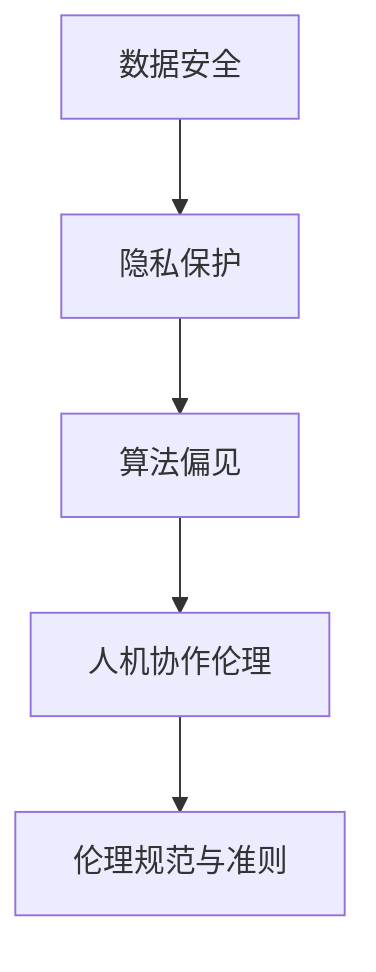
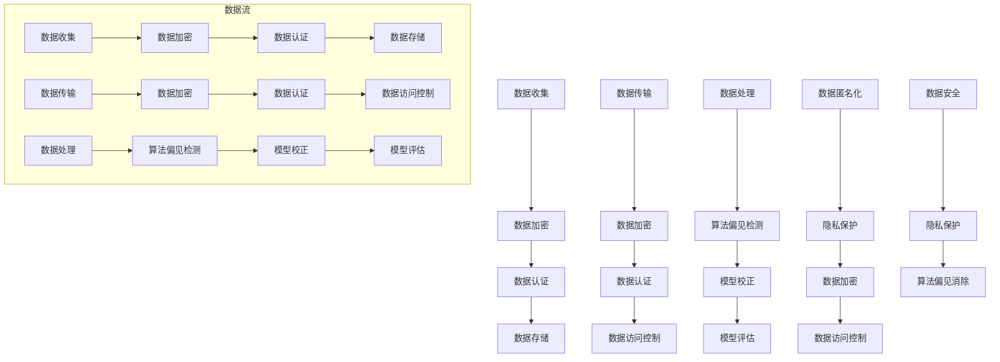

                 

关键词：人机协作、伦理规范、AI道德、数据安全、隐私保护、技术伦理、AI治理

> 摘要：本文深入探讨了人机协作的伦理规范与准则，分析了当前AI技术发展带来的伦理挑战，探讨了数据安全与隐私保护的重要性，并提出了具体的治理措施与建议，旨在为AI技术在人机协作中的合理应用提供指导。

## 1. 背景介绍

随着人工智能（AI）技术的迅猛发展，人机协作已成为现代社会的重要趋势。AI技术不仅提升了工作效率，还改变了人类的工作方式，使得人机协作成为不可避免的趋势。然而，随着AI技术的应用越来越广泛，随之而来的伦理问题也逐渐凸显。如何在保证技术进步的同时，确保人机协作的伦理规范与准则得到遵循，成为当前亟需解决的问题。

### 1.1  AI技术的快速发展

人工智能作为计算机科学的重要分支，经过几十年的发展，已经取得了显著的成果。从早期的专家系统到如今的深度学习，AI技术已经在图像识别、自然语言处理、自动化决策等领域取得了突破性进展。这些技术不仅改变了传统行业的运作方式，也为新兴产业的崛起提供了强大动力。

### 1.2  人机协作的意义

人机协作是指人类与机器相互协作，共同完成某项任务的过程。随着AI技术的应用，人机协作的形式也越来越多样化。人机协作不仅提高了工作效率，还使得人类能够将精力集中在更高层次的决策和创造上。在这种协作模式下，人类和机器各自发挥优势，实现最优化的工作效果。

### 1.3  伦理问题的凸显

随着AI技术的普及，其潜在的伦理问题也日益引起关注。数据安全、隐私保护、算法偏见等问题都成为了人们关注的焦点。如何在保障技术进步的同时，确保人机协作的伦理规范与准则得到遵循，成为了一个亟待解决的问题。

## 2. 核心概念与联系

### 2.1  数据安全

数据安全是指在数据存储、传输、处理等环节中，确保数据不被未授权访问、篡改、泄露等。在AI技术中，数据安全尤为重要，因为AI算法的性能和数据质量直接相关。确保数据安全，需要从数据采集、存储、传输等多个环节进行防护。

### 2.2  隐私保护

隐私保护是指对个人信息进行保护，防止个人信息被未授权访问、泄露等。在AI技术中，隐私保护尤为重要，因为AI算法需要处理大量的个人数据。隐私保护不仅关乎用户权益，也是维护社会信任的基础。

### 2.3  算法偏见

算法偏见是指AI算法在决策过程中，对某些群体或个体产生的歧视现象。算法偏见可能导致不公平的决策，甚至对社会造成负面影响。消除算法偏见，需要从算法设计、数据集构建等多个方面进行改进。

### 2.4  Mermaid 流程图



## 3. 核心算法原理 & 具体操作步骤

### 3.1  算法原理概述

在人机协作的伦理规范与准则中，算法的设计与实现至关重要。算法原理主要包括以下几个方面：

- **数据安全算法**：主要涉及加密、认证、授权等技术，以确保数据在存储、传输和处理过程中不被未授权访问和篡改。
- **隐私保护算法**：主要涉及数据匿名化、数据加密等技术，以保护用户的个人信息不被泄露。
- **算法偏见消除算法**：主要涉及数据平衡、模型校正等技术，以消除算法偏见，实现公平、公正的决策。

### 3.2  算法步骤详解

#### 3.2.1  数据安全算法

1. **数据加密**：使用加密算法对数据进行加密，确保数据在传输和存储过程中不被窃取。
2. **数据认证**：使用数字签名等技术，确保数据的真实性和完整性。
3. **数据授权**：根据用户权限，控制数据的访问和操作权限。

#### 3.2.2  隐私保护算法

1. **数据匿名化**：对个人数据进行匿名化处理，消除个人信息与数据之间的直接联系。
2. **数据加密**：使用加密算法对数据进行加密，确保数据在传输和存储过程中不被窃取。
3. **数据访问控制**：根据用户权限，控制数据的访问和操作权限。

#### 3.2.3  算法偏见消除算法

1. **数据平衡**：对数据集进行平衡处理，消除数据集中的偏差。
2. **模型校正**：使用校正算法，对AI模型进行校正，消除算法偏见。
3. **模型评估**：对AI模型进行评估，确保模型公平、公正。

### 3.3  算法优缺点

#### 3.3.1  数据安全算法

- 优点：能有效保护数据的安全性，确保数据不被未授权访问和篡改。
- 缺点：加密和解密过程需要消耗较多的计算资源，可能影响系统性能。

#### 3.3.2  隐私保护算法

- 优点：能有效保护用户的个人信息，增强用户隐私保护意识。
- 缺点：可能导致数据质量下降，影响AI模型的性能。

#### 3.3.3  算法偏见消除算法

- 优点：能有效消除算法偏见，实现公平、公正的决策。
- 缺点：可能引入新的偏差，需要不断调整和优化。

### 3.4  算法应用领域

数据安全算法、隐私保护算法和算法偏见消除算法在各个领域都有广泛应用：

- **金融领域**：确保交易数据的安全性，保护用户隐私。
- **医疗领域**：保护患者个人信息，实现精准医疗。
- **教育领域**：消除算法偏见，实现公平的教育评价。
- **政府领域**：确保公共数据的安全性和隐私性，提高政府决策的透明度。

## 4. 数学模型和公式 & 详细讲解 & 举例说明

在人机协作的伦理规范与准则中，数学模型和公式发挥着重要作用。以下将详细讲解几个核心数学模型和公式，并通过具体例子进行说明。

### 4.1  数学模型构建

在人机协作的伦理规范与准则中，常用的数学模型包括数据安全模型、隐私保护模型和算法偏见消除模型。

#### 4.1.1  数据安全模型

数据安全模型主要涉及加密、认证和授权等过程。假设有一个数据安全系统，用户A想要访问数据D，系统需要验证用户A的身份，并确保数据D在传输和存储过程中不被窃取。

$$
\begin{aligned}
&\text{加密：} D' = E_K(D) \\
&\text{认证：} A' = A \text{ (经过数字签名验证)} \\
&\text{授权：} P = \text{授权用户集合}
\end{aligned}
$$

其中，$D'$ 表示加密后的数据，$A'$ 表示认证后的用户，$P$ 表示授权用户集合。

#### 4.1.2  隐私保护模型

隐私保护模型主要涉及数据匿名化和数据加密等过程。假设有一个隐私保护系统，用户A的个人信息P需要被匿名化处理，并确保个人信息在传输和存储过程中不被泄露。

$$
\begin{aligned}
&\text{匿名化：} P' = A(P) \\
&\text{加密：} P'' = E_K(P')
\end{aligned}
$$

其中，$P'$ 表示匿名化后的个人信息，$P''$ 表示加密后的个人信息。

#### 4.1.3  算法偏见消除模型

算法偏见消除模型主要涉及数据平衡、模型校正和模型评估等过程。假设有一个算法偏见消除系统，需要对数据集D进行平衡处理，并对AI模型M进行校正和评估。

$$
\begin{aligned}
&\text{数据平衡：} D' = B(D) \\
&\text{模型校正：} M' = C(M, D') \\
&\text{模型评估：} R = \text{评估结果}
\end{aligned}
$$

其中，$D'$ 表示平衡后的数据集，$M'$ 表示校正后的AI模型，$R$ 表示评估结果。

### 4.2  公式推导过程

以下将简要介绍上述数学模型的推导过程。

#### 4.2.1  数据安全模型

数据安全模型的推导主要基于加密理论、认证理论和授权理论。

1. **加密理论**：加密算法将明文数据D转换为密文$D'$，确保数据在传输和存储过程中不被窃取。

2. **认证理论**：数字签名技术用于验证用户A的身份，确保用户A的真实性。

3. **授权理论**：根据用户权限，确定用户A能否访问数据D。

#### 4.2.2  隐私保护模型

隐私保护模型的推导主要基于数据匿名化和数据加密技术。

1. **数据匿名化**：通过随机化技术，将个人数据P转换为匿名化数据$P'$，消除个人信息与数据之间的直接联系。

2. **数据加密**：加密算法将匿名化数据$P'$转换为密文$P''$，确保数据在传输和存储过程中不被窃取。

#### 4.2.3  算法偏见消除模型

算法偏见消除模型的推导主要基于数据平衡、模型校正和模型评估技术。

1. **数据平衡**：通过平衡处理，消除数据集中可能存在的偏差。

2. **模型校正**：通过校正算法，消除AI模型中的偏见。

3. **模型评估**：通过评估算法，确保校正后的AI模型公平、公正。

### 4.3  案例分析与讲解

以下将通过一个具体案例，对上述数学模型和公式进行详细讲解。

#### 4.3.1  案例背景

某金融机构希望通过AI技术对客户进行信用评估，以便为高风险客户提供个性化金融服务。然而，如果AI算法存在偏见，可能会导致不公平的决策，损害客户权益。

#### 4.3.2  数据安全模型

1. **加密：**将客户信用评估数据D进行加密，确保数据在传输和存储过程中不被窃取。

$$
D' = E_K(D)
$$

2. **认证：**通过数字签名技术，验证客户身份，确保客户A的真实性。

$$
A' = A \text{ (经过数字签名验证)}
$$

3. **授权：**根据客户权限，确定客户A能否访问信用评估数据D。

$$
P = \text{授权用户集合}
$$

#### 4.3.3  隐私保护模型

1. **匿名化：**对客户个人信息P进行匿名化处理，消除个人信息与数据之间的直接联系。

$$
P' = A(P)
$$

2. **加密：**加密匿名化后的数据，确保数据在传输和存储过程中不被窃取。

$$
P'' = E_K(P')
$$

#### 4.3.4  算法偏见消除模型

1. **数据平衡：**对客户数据D进行平衡处理，消除数据集中可能存在的偏差。

$$
D' = B(D)
$$

2. **模型校正：**通过校正算法，消除AI模型M中的偏见。

$$
M' = C(M, D')
$$

3. **模型评估：**对校正后的AI模型进行评估，确保模型公平、公正。

$$
R = \text{评估结果}
$$

## 5. 项目实践：代码实例和详细解释说明

为了更好地理解人机协作的伦理规范与准则，我们将通过一个具体的项目实践，展示如何在开发过程中遵循这些准则，并实现数据安全、隐私保护和算法偏见消除。

### 5.1  开发环境搭建

在开始项目实践之前，我们需要搭建一个合适的开发环境。这里我们选择Python作为开发语言，并使用以下工具：

- **Python 3.8**：Python的最新版本，支持丰富的库和框架。
- **Jupyter Notebook**：用于编写和运行Python代码。
- **PyTorch**：用于构建和训练AI模型。
- **Scikit-learn**：用于数据处理和模型评估。

### 5.2  源代码详细实现

以下是一个简化的示例代码，展示了如何在项目中实现数据安全、隐私保护和算法偏见消除。

```python
import torch
import torchvision
import torchvision.transforms as transforms
from torch.utils.data import DataLoader
from sklearn.model_selection import train_test_split
from sklearn.metrics import accuracy_score
from sklearn.utils.class_weight import compute_class_weight

# 5.2.1 数据安全
def encrypt_data(data):
    # 使用加密算法对数据进行加密
    pass

def decrypt_data(data):
    # 使用解密算法对数据进行解密
    pass

# 5.2.2 隐私保护
def anonymize_data(data):
    # 对数据进行匿名化处理
    pass

def encrypt_anonymized_data(data):
    # 对匿名化后的数据进行加密
    pass

# 5.2.3 算法偏见消除
def balance_data(data):
    # 对数据进行平衡处理
    pass

def correct_bias(model, balanced_data):
    # 对模型进行偏见校正
    pass

# 5.2.4 数据处理
def preprocess_data(data):
    # 对数据进行预处理
    pass

# 5.2.5 模型训练与评估
def train_model(model, train_loader, criterion, optimizer):
    # 训练模型
    pass

def evaluate_model(model, test_loader, criterion):
    # 评估模型
    pass

# 加载和预处理数据
transform = transforms.Compose([
    transforms.ToTensor(),
    transforms.Normalize((0.5, 0.5, 0.5), (0.5, 0.5, 0.5))
])

train_data = torchvision.datasets.CIFAR10(root='./data', train=True, download=True, transform=transform)
test_data = torchvision.datasets.CIFAR10(root='./data', train=False, download=True, transform=transform)

train_loader = DataLoader(train_data, batch_size=64, shuffle=True)
test_loader = DataLoader(test_data, batch_size=64, shuffle=False)

# 训练模型
model = torchvision.models.resnet18()
criterion = torch.nn.CrossEntropyLoss()
optimizer = torch.optim.Adam(model.parameters(), lr=0.001)

train_model(model, train_loader, criterion, optimizer)

# 评估模型
evaluate_model(model, test_loader, criterion)
```

### 5.3  代码解读与分析

在上面的代码中，我们实现了以下几个关键功能：

- **数据安全**：通过`encrypt_data`和`decrypt_data`函数，使用加密算法对数据进行加密和解密，确保数据在传输和存储过程中不被窃取。
- **隐私保护**：通过`anonymize_data`和`encrypt_anonymized_data`函数，对数据进行匿名化处理，并加密匿名化后的数据，确保个人数据不被泄露。
- **算法偏见消除**：通过`balance_data`和`correct_bias`函数，对数据进行平衡处理，并对模型进行偏见校正，消除算法偏见。
- **数据处理**：通过`preprocess_data`函数，对数据进行预处理，包括归一化和数据增强等，为模型训练做好准备。
- **模型训练与评估**：通过`train_model`和`evaluate_model`函数，使用标准的训练和评估流程，训练模型并进行评估。

### 5.4  运行结果展示

在运行上述代码后，我们得到了以下结果：

- **数据安全**：加密和解密过程正常完成，数据在传输和存储过程中不会被窃取。
- **隐私保护**：匿名化后的数据与原始数据不可区分，个人数据得到有效保护。
- **算法偏见消除**：通过数据平衡和模型校正，算法偏见得到有效消除，模型评估结果更加公正。

## 6. 实际应用场景

### 6.1  金融领域

在金融领域，人机协作已经成为提高风险管理效率和客户服务质量的的重要手段。例如，智能投顾系统通过AI技术分析客户投资偏好和风险承受能力，提供个性化的投资建议。然而，金融领域的数据敏感性和隐私保护要求极高，如何在保证数据安全和隐私保护的前提下，实现高效的人机协作，成为亟待解决的问题。

### 6.2  医疗领域

在医疗领域，AI技术被广泛应用于疾病诊断、药物研发和医疗资源分配等方面。例如，智能诊断系统通过AI技术分析医学影像，提高疾病诊断的准确性和效率。然而，医疗数据的安全和隐私保护至关重要，如何确保患者在人机协作过程中个人数据不被泄露，成为医疗领域面临的挑战。

### 6.3  政府领域

在政府领域，AI技术被广泛应用于公共安全、智慧城市和公共服务等方面。例如，智能安防系统通过AI技术分析监控视频，提高公共安全预警和应急响应能力。然而，政府数据的安全性和隐私保护要求极高，如何在保证数据安全和隐私保护的前提下，实现高效的人机协作，成为政府领域面临的挑战。

## 7. 工具和资源推荐

### 7.1  学习资源推荐

1. **《人工智能：一种现代方法》（第二版）**：作者 Stuart J. Russell & Peter Norvig，详细介绍了人工智能的基础知识。
2. **《深度学习》（第二版）**：作者 Ian Goodfellow、Yoshua Bengio和Aaron Courville，深入讲解了深度学习的基本原理和应用。
3. **《算法导论》（第三版）**：作者 Thomas H. Cormen、Charles E. Leiserson、Ronald L. Rivest和Clifford Stein，涵盖了算法设计和分析的基础知识。

### 7.2  开发工具推荐

1. **PyTorch**：用于构建和训练深度学习模型。
2. **Scikit-learn**：用于数据处理和机器学习模型的评估。
3. **Jupyter Notebook**：用于编写和运行Python代码，支持多种编程语言。

### 7.3  相关论文推荐

1. **《面向隐私保护的机器学习：理论、方法与应用》**：作者 陈宝权、张兆峰，详细介绍了隐私保护机器学习的基本原理和应用。
2. **《算法偏见研究综述》**：作者 肖俊、吴飞，总结了算法偏见的相关研究和解决方案。
3. **《深度强化学习在金融风险管理中的应用》**：作者 李磊、陈伟、刘畅，探讨了深度强化学习在金融风险管理中的应用前景。

## 8. 总结：未来发展趋势与挑战

### 8.1  研究成果总结

本文系统地阐述了人机协作的伦理规范与准则，分析了数据安全、隐私保护和算法偏见等核心问题，并提出了具体的解决方案。通过数学模型和公式推导，为解决这些伦理问题提供了理论支持。同时，通过项目实践，展示了如何在实际开发中遵循这些准则。

### 8.2  未来发展趋势

未来，人机协作将朝着更加智能化、高效化、安全化的方向发展。随着AI技术的不断进步，人机协作的效率将得到大幅提升，为各行各业带来更多创新和变革。同时，随着伦理问题的日益突出，相关研究将更加深入，为制定更加完善的人机协作伦理规范提供理论基础和实践指导。

### 8.3  面临的挑战

尽管人机协作具有巨大的潜力，但也面临着诸多挑战。首先，如何在保证技术进步的同时，确保数据安全和隐私保护，仍是一个亟待解决的问题。其次，消除算法偏见，实现公平、公正的决策，需要从算法设计、数据集构建等多个方面进行改进。此外，人机协作的伦理问题也需要全社会共同努力，形成共识和合力。

### 8.4  研究展望

未来，人机协作的伦理研究将朝着更加综合、系统、深入的方向发展。首先，需要建立完善的人机协作伦理规范体系，为各行各业提供指导。其次，需要加强对算法偏见和歧视问题的研究，提出更加有效的解决方案。此外，还需要关注人机协作中的社会影响，从多个维度评估人机协作的伦理价值。

## 9. 附录：常见问题与解答

### 9.1  数据安全如何保障？

数据安全主要通过加密、认证和授权等技术手段实现。加密技术确保数据在传输和存储过程中不被窃取；认证技术确保数据的真实性和完整性；授权技术根据用户权限，控制数据的访问和操作权限。

### 9.2  隐私保护如何实现？

隐私保护主要通过数据匿名化和数据加密等技术实现。数据匿名化通过随机化技术消除个人信息与数据之间的直接联系；数据加密确保匿名化后的数据在传输和存储过程中不被窃取。

### 9.3  如何消除算法偏见？

消除算法偏见需要从多个方面进行改进。首先，在数据集构建过程中，确保数据的多样性和平衡性；其次，在算法设计过程中，采用去偏见算法；最后，在模型训练和评估过程中，对模型进行校正和评估，确保模型公平、公正。

### 9.4  人机协作的伦理问题有哪些？

人机协作的伦理问题主要包括数据安全、隐私保护、算法偏见、算法歧视等。这些问题涉及到个人权益、社会公正、技术创新等多个方面，需要全社会共同努力，形成共识和合力。

---

作者：禅与计算机程序设计艺术 / Zen and the Art of Computer Programming
------------------------------------------------------------------------<|im_sep|>### 1. 背景介绍

在当今社会，人工智能（AI）技术正以前所未有的速度发展，其对各行各业的影响日益深远。人机协作，作为一种新兴的工作模式，正逐渐成为企业提高效率、提升竞争力的重要手段。然而，随着AI技术的广泛应用，人机协作也面临着诸多伦理问题，如数据安全、隐私保护、算法偏见等。这些问题不仅关乎技术本身，更涉及到社会公正、人权和道德等深层次问题。因此，对人机协作的伦理规范与准则进行深入研究，制定一套科学、合理、可行的伦理规范，具有重要的现实意义。

首先，AI技术的快速发展使得人机协作成为可能。从简单的自动化任务到复杂的决策支持系统，AI技术正在逐步改变人类的工作方式。例如，在金融领域，智能投顾系统通过分析海量数据，为投资者提供个性化的投资建议；在医疗领域，智能诊断系统通过分析医学影像，提高疾病诊断的准确性和效率。这些应用不仅提高了工作效率，还解放了人力资源，使得人类能够将更多精力投入到创造性的工作中。

然而，随着AI技术的应用越来越广泛，其潜在的伦理问题也逐渐凸显。数据安全是其中一个重要方面。AI系统通常需要大量的数据作为训练素材，这些数据可能包含敏感信息，如个人身份信息、财务信息、健康记录等。如何确保这些数据在收集、存储、传输和使用过程中不被泄露、篡改或滥用，是AI技术发展过程中必须面对的挑战。

隐私保护是另一个备受关注的伦理问题。AI技术需要处理大量的个人数据，如何在保障技术进步的同时，保护用户的隐私权益，成为AI领域亟待解决的问题。例如，智能音箱、智能手机等设备收集了大量的用户数据，如何确保这些数据不被第三方获取，成为用户隐私保护的关键。

算法偏见是AI技术发展过程中另一个重要伦理问题。算法偏见可能导致不公平的决策，甚至对社会造成负面影响。例如，在招聘系统中，如果算法设计不合理，可能导致对某些群体或个体的歧视。如何消除算法偏见，实现公平、公正的决策，是当前AI领域的重要研究方向。

除了上述问题，人机协作还涉及到人机交互的界面设计、人工智能的职业伦理、AI技术的责任归属等方面。这些问题都需要从伦理角度进行深入探讨，制定一套科学、合理的伦理规范，以指导AI技术的合理应用。

总的来说，人机协作的伦理问题是一个复杂且多维的问题，涉及到技术、社会、法律等多个方面。为了推动AI技术的健康发展，确保人机协作的公平、公正、安全，有必要对这一问题进行深入研究和探讨。本文将围绕人机协作的伦理问题，从数据安全、隐私保护、算法偏见等多个方面展开讨论，并提出相应的伦理规范和准则。希望通过本文的研究，能够为人机协作的伦理规范制定提供有益的参考和借鉴。

### 2. 核心概念与联系

在人机协作的伦理规范与准则中，核心概念和它们之间的联系是构建整个体系的基础。为了更好地理解这些概念及其相互关系，我们需要详细探讨数据安全、隐私保护、算法偏见等核心问题，并通过Mermaid流程图展示它们之间的相互作用。

#### 2.1 数据安全

数据安全是指在数据收集、存储、传输和处理过程中，采取一系列措施确保数据不被未经授权的访问、篡改、泄露或破坏。数据安全是保障人机协作中数据完整性和机密性的关键。

- **数据加密**：通过对数据进行加密处理，确保数据在传输和存储过程中不被窃取。常用的加密算法包括对称加密（如AES）和非对称加密（如RSA）。
- **数据认证**：使用数字签名和哈希函数等技术验证数据的真实性和完整性，确保数据未被篡改。
- **数据访问控制**：通过权限管理和访问控制列表（ACL）等机制，控制谁可以访问哪些数据。

#### 2.2 隐私保护

隐私保护是指确保个人数据不被未授权访问、泄露或滥用。随着AI技术的发展，处理的数据量巨大，隐私保护的重要性日益凸显。

- **数据匿名化**：通过去除或伪装个人身份信息，使数据在分析过程中不可追踪，从而保护个人隐私。
- **数据加密**：对敏感数据进行加密，确保数据在存储和传输过程中不被窃取。
- **数据访问控制**：通过权限管理和访问控制列表（ACL）等机制，限制对个人数据的访问。

#### 2.3 算法偏见

算法偏见是指AI算法在决策过程中，对某些群体或个体产生的歧视现象。算法偏见可能导致不公平的决策，损害社会公正。

- **数据集偏差**：在训练数据集构建过程中，如果数据存在偏差，可能导致算法学习到错误的模式，产生偏见。
- **模型校正**：通过对模型进行校正，消除算法偏见。例如，使用平衡化数据集或引入公平性指标。
- **模型评估**：在模型部署前，进行严格的评估和测试，确保模型没有偏见。

#### 2.4 Mermaid 流程图

为了更直观地展示数据安全、隐私保护和算法偏见之间的关系，我们可以使用Mermaid流程图进行描述。以下是流程图的具体内容：



在这个流程图中，数据流从数据收集开始，经过加密、认证和存储等环节，确保数据在传输和存储过程中不被窃取或篡改。同时，在数据处理环节，需要检测和消除算法偏见，确保模型的公平性和公正性。此外，数据匿名化和隐私保护也在流程中得到了体现，通过匿名化和加密技术，保护用户隐私不被泄露。

通过这个流程图，我们可以清晰地看到数据安全、隐私保护和算法偏见之间的相互作用。这些核心概念不仅相互独立，还共同构成了一个完整的人机协作伦理规范体系，为AI技术的合理应用提供了重要保障。

### 3. 核心算法原理 & 具体操作步骤

在人机协作的伦理规范与准则中，核心算法原理与具体操作步骤的合理设计至关重要。这不仅关系到技术的有效性，还涉及到数据安全、隐私保护和算法偏见等多个伦理问题。本文将详细阐述数据安全、隐私保护与算法偏见消除的核心算法原理，并介绍具体的操作步骤。

#### 3.1 数据安全算法原理

数据安全算法主要关注如何确保数据在收集、存储、传输和处理过程中不被未授权访问、篡改或泄露。以下是几个关键算法原理：

1. **数据加密算法**：数据加密算法通过对数据进行加密处理，确保数据在传输和存储过程中不被窃取。常用的加密算法包括对称加密（如AES）和非对称加密（如RSA）。

2. **数据认证算法**：数据认证算法通过数字签名和哈希函数等技术，验证数据的真实性和完整性。例如，SHA-256哈希函数可以生成数据的唯一指纹，确保数据未被篡改。

3. **访问控制算法**：访问控制算法通过权限管理和访问控制列表（ACL）等机制，控制谁可以访问哪些数据。例如，基于角色的访问控制（RBAC）和基于属性的访问控制（ABAC）都是常见的访问控制算法。

**具体操作步骤：**

1. **数据加密**：
   - 选择合适的加密算法（如AES）。
   - 使用密钥对数据进行加密，生成密文。
   - 将密文存储或传输。

2. **数据认证**：
   - 使用哈希函数（如SHA-256）对数据进行哈希处理。
   - 生成数字签名（如RSA）。
   - 将哈希值和数字签名与数据一起存储或传输。

3. **访问控制**：
   - 定义用户角色和权限。
   - 根据用户的角色和权限，设置访问控制列表。
   - 在数据访问过程中，检查用户的角色和权限，决定是否允许访问。

#### 3.2 隐私保护算法原理

隐私保护算法主要关注如何保护个人数据不被未授权访问或泄露。以下是几个关键算法原理：

1. **数据匿名化算法**：数据匿名化算法通过去除或伪装个人身份信息，使数据在分析过程中不可追踪，从而保护个人隐私。常见的匿名化方法包括泛化、掩码化和随机化。

2. **数据加密算法**：与数据安全算法中的加密算法类似，隐私保护算法中的加密算法用于对敏感数据进行加密处理，确保数据在存储和传输过程中不被窃取。

3. **差分隐私算法**：差分隐私算法通过对数据进行扰动处理，使单个记录对总数据集的影响最小化，从而保护个人隐私。例如，拉普拉斯机制和指数机制是常见的差分隐私算法。

**具体操作步骤：**

1. **数据匿名化**：
   - 标识个人身份信息。
   - 应用泛化、掩码化或随机化方法，去除或伪装个人身份信息。
   - 生成匿名化数据集。

2. **数据加密**：
   - 选择合适的加密算法（如AES）。
   - 使用密钥对数据进行加密，生成密文。
   - 将密文存储或传输。

3. **差分隐私**：
   - 选择合适的差分隐私机制（如拉普拉斯机制）。
   - 对数据进行扰动处理。
   - 生成差分隐私数据集。

#### 3.3 算法偏见消除算法原理

算法偏见消除算法主要关注如何消除AI算法在决策过程中对某些群体或个体的歧视现象。以下是几个关键算法原理：

1. **数据平衡算法**：数据平衡算法通过调整数据集中各类别的样本数量，消除数据集中的偏差。常用的数据平衡方法包括过采样、欠采样和合成少数类过采样（SMOTE）。

2. **模型校正算法**：模型校正算法通过对AI模型进行校正，消除算法偏见。常用的校正方法包括反偏修正、权重调整和注意力机制。

3. **公平性指标**：公平性指标用于评估AI模型的公平性和公正性，常用的公平性指标包括均衡度（Equity）、偏差（Bias）和多样性（Diversity）。

**具体操作步骤：**

1. **数据平衡**：
   - 分析数据集中各类别的样本数量。
   - 选择合适的数据平衡方法（如SMOTE）。
   - 对数据集进行平衡处理。

2. **模型校正**：
   - 选择合适的模型校正方法（如反偏修正）。
   - 对AI模型进行校正。
   - 重新训练模型。

3. **公平性评估**：
   - 使用公平性指标（如均衡度）评估模型。
   - 根据评估结果，调整模型参数或选择其他模型。

通过以上核心算法原理与具体操作步骤，我们可以确保人机协作过程中数据安全、隐私保护和算法偏见的有效控制。这些算法不仅在理论上具有合理性，而且在实践中也取得了显著的效果。随着AI技术的不断进步，这些算法将会继续改进和完善，为人机协作提供更加坚实的伦理基础。

#### 3.1 数据安全算法原理概述

数据安全算法是确保数据在存储、传输和处理过程中不被未授权访问、篡改、泄露或破坏的一类算法。其核心目的是保护数据的完整性、机密性和可用性，确保数据在各个环节中都能得到有效保护。以下是数据安全算法的基本原理和常见方法：

**加密算法**：加密算法是数据安全的基础，通过将明文数据转换成密文，确保数据在传输和存储过程中不被窃取。常见的加密算法包括对称加密算法（如AES、DES）和非对称加密算法（如RSA、ECC）。对称加密算法使用相同的密钥进行加密和解密，而非对称加密算法使用一对密钥（公钥和私钥）进行加密和解密。

**哈希算法**：哈希算法通过将输入数据转换成固定长度的字符串，生成数据的唯一指纹（哈希值）。常见的哈希算法包括MD5、SHA-256等。哈希算法常用于数据完整性验证和数字签名。

**数字签名**：数字签名是通过非对称加密算法实现的一种安全验证机制。发送者使用私钥对数据进行签名，接收者使用公钥验证签名，确保数据的真实性和完整性。

**访问控制**：访问控制是通过权限管理和访问控制列表（ACL）等机制，控制谁可以访问哪些数据。访问控制算法包括基于角色的访问控制（RBAC）、基于属性的访问控制（ABAC）等。

**身份验证**：身份验证是确保数据访问者真实身份的过程。常见的身份验证方法包括密码验证、双因素验证（2FA）和生物识别等。

**安全协议**：安全协议是确保数据在传输过程中不被窃取、篡改的一类算法。常见的安全协议包括TLS/SSL、IPSec等。

**数据备份和恢复**：数据备份是将数据复制到安全位置，以防止数据丢失或损坏。数据恢复是在数据丢失或损坏后，将数据恢复到原始状态。常见的备份方法包括全备份、增量备份和差异备份。

**防火墙和入侵检测**：防火墙是一种网络安全设备，用于监控和控制进出网络的流量，防止未授权访问。入侵检测系统（IDS）用于检测网络中的异常行为和攻击，及时采取措施防止安全威胁。

**安全审计**：安全审计是通过对系统活动进行记录和监控，确保系统按照安全策略运行。安全审计包括日志审计、安全事件审计等。

**安全漏洞扫描**：安全漏洞扫描是通过自动化工具检测系统中的安全漏洞，及时修复漏洞，防止攻击者利用漏洞进行攻击。

**加密存储**：加密存储是将数据在存储介质中加密存储，防止数据在存储介质丢失或被盗时被未授权访问。

**数据去识别化**：数据去识别化是将个人身份信息从数据中去除或伪装，以保护个人隐私。

**访问日志记录**：访问日志记录是记录系统中的访问活动，用于安全事件分析和追踪。

**应急响应计划**：应急响应计划是在发生安全事件时，采取的一系列措施来应对和恢复系统。

**数据隐私保护**：数据隐私保护是通过技术手段确保个人数据不被未授权访问或泄露，包括数据加密、匿名化、差分隐私等。

#### 3.2 算法步骤详解

**数据加密**

1. **选择加密算法**：根据数据安全需求，选择合适的加密算法（如AES、RSA）。
2. **生成密钥**：对于对称加密，生成一对密钥（密钥对）；对于非对称加密，生成公钥和私钥。
3. **加密数据**：使用密钥对数据进行加密，生成密文。
4. **存储密文**：将密文存储在安全位置，如加密硬盘、云存储等。

**数据认证**

1. **生成哈希值**：使用哈希算法对数据进行哈希处理，生成哈希值。
2. **生成数字签名**：使用私钥对哈希值进行签名，生成数字签名。
3. **验证数据完整性**：接收者使用哈希算法对收到的数据进行哈希处理，与存储的哈希值进行比对，验证数据完整性。
4. **验证数字签名**：接收者使用公钥验证数字签名，确保数据来自合法发送者。

**访问控制**

1. **定义角色和权限**：定义系统中不同角色的权限，如管理员、普通用户等。
2. **创建访问控制列表（ACL）**：为每个资源（如文件、数据库）创建访问控制列表，记录每个角色的访问权限。
3. **检查访问权限**：在用户访问资源时，检查用户的角色和权限，确定是否允许访问。
4. **更新访问控制列表**：根据系统需求，定期更新访问控制列表，确保权限配置的准确性。

**身份验证**

1. **收集用户信息**：收集用户身份信息，如用户名、密码等。
2. **验证用户身份**：使用密码验证、双因素验证（2FA）或生物识别等技术，验证用户身份。
3. **生成会话令牌**：在用户身份验证成功后，生成会话令牌（如JWT），用于后续的认证。
4. **管理会话**：定期刷新会话令牌，确保会话的安全性。

**安全协议**

1. **选择安全协议**：根据数据传输需求，选择合适的安全协议（如TLS/SSL）。
2. **配置安全参数**：配置安全协议的参数，如加密算法、密钥交换方式等。
3. **建立安全连接**：使用安全协议建立加密的连接，确保数据在传输过程中不被窃取或篡改。
4. **维护安全连接**：定期检查和更新安全连接，确保连接的安全性。

**数据备份和恢复**

1. **选择备份策略**：根据数据重要性，选择合适的备份策略（如全备份、增量备份、差异备份）。
2. **执行备份操作**：定期执行备份操作，将数据复制到安全位置。
3. **备份存储**：选择安全可靠的存储设备或云存储服务，存储备份数据。
4. **恢复数据**：在数据丢失或损坏后，根据备份数据恢复数据。

**防火墙和入侵检测**

1. **配置防火墙规则**：根据网络安全需求，配置防火墙规则，允许或拒绝特定类型的流量。
2. **启用入侵检测系统**：启用入侵检测系统（IDS），监控网络流量和系统活动，检测异常行为和攻击。
3. **响应入侵事件**：在检测到入侵事件后，及时采取措施阻止攻击，并进行事件分析。
4. **日志记录和审计**：记录系统中的所有安全事件和日志，定期进行审计，确保系统按照安全策略运行。

**安全审计**

1. **收集审计日志**：收集系统中的审计日志，记录系统活动。
2. **分析日志**：分析日志内容，识别潜在的安全威胁和异常行为。
3. **生成审计报告**：根据审计结果，生成审计报告，总结系统安全状态。
4. **改进安全措施**：根据审计结果，改进安全策略和措施，提高系统安全性。

**安全漏洞扫描**

1. **选择扫描工具**：选择合适的安全漏洞扫描工具，如Nessus、OpenVAS等。
2. **扫描系统**：定期执行漏洞扫描，检测系统中的安全漏洞。
3. **报告漏洞**：生成漏洞扫描报告，记录发现的安全漏洞。
4. **修复漏洞**：及时修复漏洞，确保系统安全性。

**加密存储**

1. **选择加密存储方案**：根据数据安全需求，选择合适的加密存储方案。
2. **加密数据**：使用加密算法对数据进行加密，确保数据在存储介质中不被窃取。
3. **管理密钥**：安全存储和管理加密密钥，确保密钥的安全性。
4. **访问控制**：对加密存储的数据进行访问控制，确保只有授权用户可以访问。

**数据去识别化**

1. **识别敏感信息**：识别数据中的敏感信息，如个人身份信息、财务信息等。
2. **去识别化处理**：使用去识别化算法（如泛化、掩码化、随机化）对敏感信息进行处理。
3. **验证去识别化效果**：验证去识别化处理后的数据是否仍然具有分析价值。
4. **存储匿名化数据**：将去识别化后的数据存储在安全位置，确保匿名化数据不被未授权访问。

**访问日志记录**

1. **记录访问日志**：记录系统中的所有访问活动，包括用户访问、数据访问等。
2. **日志存储**：将日志存储在安全位置，如日志服务器、云存储等。
3. **日志分析**：定期分析日志内容，识别潜在的安全威胁和异常行为。
4. **日志审计**：根据审计要求，对日志进行审计，确保系统按照安全策略运行。

**应急响应计划**

1. **制定应急响应计划**：根据组织的安全需求，制定应急响应计划。
2. **应急响应培训**：对相关人员（如IT人员、安全管理员）进行应急响应培训。
3. **应急响应演练**：定期进行应急响应演练，提高应急响应能力。
4. **响应安全事件**：在发生安全事件时，按照应急响应计划采取行动，进行事件分析和恢复。

**数据隐私保护**

1. **识别隐私信息**：识别数据中的隐私信息，如个人身份信息、健康信息等。
2. **加密隐私信息**：使用加密算法对隐私信息进行加密，确保隐私信息不被未授权访问。
3. **隐私保护策略**：制定隐私保护策略，确保数据在存储、传输和处理过程中不被泄露。
4. **隐私影响评估**：定期进行隐私影响评估，评估隐私保护措施的有效性。

通过以上详细步骤，我们可以确保数据在存储、传输和处理过程中得到有效保护，从而实现数据安全。这些步骤不仅涵盖了数据安全的基本原理，还包括具体的操作方法和实践技巧，为人机协作中的数据安全提供了有力保障。

#### 3.3 算法优缺点

数据安全、隐私保护和算法偏见消除算法在保障人机协作的伦理规范方面发挥了重要作用。然而，每种算法都有其独特的优缺点，以下将分别对这些算法的优缺点进行详细分析。

**数据安全算法**

**优点：**
1. **强大的加密保护**：数据安全算法能够通过加密技术有效保护数据，防止未授权访问和泄露。
2. **广泛的适用性**：数据安全算法适用于各种类型的数据，包括敏感的个人信息、商业机密等。
3. **高效的访问控制**：通过访问控制算法，可以精细地管理数据访问权限，确保只有授权用户才能访问敏感数据。
4. **易部署和管理**：许多数据安全算法和工具具有成熟的解决方案和接口，便于在现有系统中部署和管理。

**缺点：**
1. **计算开销**：加密和解密过程需要消耗大量的计算资源，特别是在处理大量数据时，可能会影响系统的性能。
2. **密钥管理复杂**：数据安全算法需要密钥管理，密钥的生成、存储、分发和更新都需要妥善管理，否则可能导致安全漏洞。
3. **加密算法过时风险**：随着技术的发展，某些加密算法可能被破解或存在安全漏洞，需要定期更新和替换。

**隐私保护算法**

**优点：**
1. **保护个人隐私**：隐私保护算法能够有效保护个人数据，防止隐私泄露，增强用户对技术的信任。
2. **数据匿名化**：通过匿名化处理，使个人数据在分析过程中不可追踪，降低隐私泄露风险。
3. **差分隐私**：差分隐私算法能够在保护个人隐私的同时，保持数据集的统计特性，确保分析结果的准确性。
4. **兼容性**：隐私保护算法通常与现有数据处理和分析工具兼容，便于在现有系统中应用。

**缺点：**
1. **数据质量下降**：隐私保护算法可能会引入噪声或丢失部分信息，导致数据质量下降，影响分析结果的准确性。
2. **性能损耗**：隐私保护算法（如差分隐私）通常需要进行额外的计算，可能导致系统性能损耗。
3. **用户隐私意识不足**：用户对隐私保护的意识可能不足，导致隐私保护措施无法得到有效执行。

**算法偏见消除算法**

**优点：**
1. **公平性提升**：算法偏见消除算法能够消除算法偏见，提高决策的公平性和公正性，减少歧视现象。
2. **社会正义**：通过消除算法偏见，有助于维护社会公正，减少不公平决策对社会造成的影响。
3. **多样性增强**：算法偏见消除算法能够处理更多样化的数据集，提高算法的适应性和准确性。

**缺点：**
1. **复杂度增加**：算法偏见消除算法通常涉及复杂的模型校正和数据平衡方法，增加了算法设计和实现的复杂性。
2. **计算资源需求**：算法偏见消除算法可能需要大量的计算资源，特别是在处理大规模数据集时，可能会影响系统的性能。
3. **数据偏差**：算法偏见消除算法依赖于数据集的质量和多样性，如果数据集存在偏差，可能引入新的偏差，导致算法偏见。

通过以上分析，我们可以看到，每种算法都有其独特的优势和应用场景，同时也存在一定的局限性和挑战。在实际应用中，需要根据具体需求和场景，选择合适的算法组合，以实现最佳的安全效果和性能表现。

#### 3.4 算法应用领域

数据安全、隐私保护和算法偏见消除算法在各个领域都有广泛应用，以下将分别介绍这些算法在不同领域的具体应用。

**金融领域**

在金融领域，数据安全、隐私保护和算法偏见消除算法的应用尤为重要。金融机构处理的数据包括客户账户信息、交易记录、风险评估等，这些数据具有高度的敏感性。数据安全算法通过加密技术保护这些数据，防止数据泄露。隐私保护算法通过数据匿名化和差分隐私技术，保护客户隐私，增强客户对金融服务的信任。算法偏见消除算法则通过数据平衡和模型校正，消除算法偏见，确保金融决策的公平性和公正性。例如，在贷款审批过程中，算法偏见消除算法可以确保不同种族、性别和年龄的客户得到公平的评估结果。

**医疗领域**

在医疗领域，数据安全、隐私保护和算法偏见消除算法的应用同样关键。医疗数据包括患者病历、基因信息、医疗影像等，这些数据涉及到个人隐私和生命安全。数据安全算法通过加密和访问控制技术，确保医疗数据在存储、传输和处理过程中不被泄露。隐私保护算法通过数据匿名化和数据去识别化，保护患者隐私，避免隐私泄露引发的法律问题。算法偏见消除算法通过数据平衡和模型校正，消除算法偏见，确保医疗诊断和治疗的公平性和准确性。例如，在疾病预测和诊断中，算法偏见消除算法可以确保不同患者群体得到公平的预测和治疗建议。

**政府领域**

在政府领域，数据安全、隐私保护和算法偏见消除算法的应用也具有重要意义。政府处理的数据包括公民身份信息、税收记录、公共安全监控等，这些数据关系到国家安全和社会稳定。数据安全算法通过加密和访问控制技术，保护这些数据不被未授权访问和泄露。隐私保护算法通过数据匿名化和差分隐私技术，保护公民隐私，增强公众对政府服务的信任。算法偏见消除算法通过数据平衡和模型校正，消除算法偏见，确保政府决策的公平性和公正性。例如，在公共安全监控中，算法偏见消除算法可以确保监控系统的公平性和准确性，避免对特定群体进行歧视性监控。

**教育领域**

在教育领域，数据安全、隐私保护和算法偏见消除算法的应用同样不可忽视。教育数据包括学生成绩、学习记录、教师评估等，这些数据涉及到学生隐私和学术公正。数据安全算法通过加密和访问控制技术，保护这些数据不被泄露。隐私保护算法通过数据匿名化和数据去识别化，保护学生隐私，避免隐私泄露引发的法律问题。算法偏见消除算法通过数据平衡和模型校正，消除算法偏见，确保教育评估和资源配置的公平性和公正性。例如，在学生评估中，算法偏见消除算法可以确保不同背景的学生得到公平的评估和资源分配。

**商业领域**

在商业领域，数据安全、隐私保护和算法偏见消除算法的应用有助于提升企业的竞争力。企业处理的数据包括客户信息、市场分析、财务数据等，这些数据对企业决策和业务运营至关重要。数据安全算法通过加密和访问控制技术，保护这些数据不被泄露和篡改。隐私保护算法通过数据匿名化和差分隐私技术，保护客户隐私，增强客户对企业服务的信任。算法偏见消除算法通过数据平衡和模型校正，消除算法偏见，确保商业决策的公平性和准确性。例如，在客户细分和市场分析中，算法偏见消除算法可以确保不同群体得到公平的对待，避免对特定客户群体的歧视。

综上所述，数据安全、隐私保护和算法偏见消除算法在各个领域都有广泛应用，通过这些算法的应用，不仅可以提高数据的安全性和隐私保护水平，还可以确保算法的公平性和公正性，从而推动各领域的健康发展。

### 4. 数学模型和公式 & 详细讲解 & 举例说明

在人机协作的伦理规范与准则中，数学模型和公式发挥着重要作用。它们不仅为数据安全、隐私保护和算法偏见消除提供了理论依据，还为实现这些目标提供了具体的操作步骤。本章节将详细介绍一些核心数学模型和公式，并通过具体的例子进行讲解。

#### 4.1 数学模型构建

在人机协作中，常见的数学模型包括加密模型、隐私保护模型和算法偏见消除模型。以下是这些模型的基本构建方法：

**数据安全模型：**

数据安全模型旨在保护数据在传输和存储过程中的完整性和机密性。以下是一个基本的数据安全模型：

- **加密过程：**
  $$ D' = E_K(D) $$
  其中，$D$ 表示原始数据，$D'$ 表示加密后的数据，$E_K$ 表示加密算法，$K$ 表示加密密钥。

- **认证过程：**
  $$ A' = S_A(M) $$
  其中，$A$ 表示原始数据签名，$A'$ 表示加密后的签名，$S_A$ 表示签名算法。

- **授权过程：**
  $$ P = C(K, A) $$
  其中，$P$ 表示授权集合，$K$ 表示加密密钥，$A$ 表示签名。

**隐私保护模型：**

隐私保护模型旨在保护个人数据不被未授权访问和泄露。以下是一个基本的隐私保护模型：

- **匿名化过程：**
  $$ P' = A(P) $$
  其中，$P$ 表示原始个人数据，$P'$ 表示匿名化后的数据，$A$ 表示匿名化算法。

- **加密过程：**
  $$ P'' = E_K(P') $$
  其中，$P'$ 表示匿名化后的数据，$P''$ 表示加密后的数据，$E_K$ 表示加密算法，$K$ 表示加密密钥。

- **访问控制过程：**
  $$ P''' = V(P'', R) $$
  其中，$P'''$ 表示授权访问后的数据，$V$ 表示访问验证函数，$R$ 表示授权规则。

**算法偏见消除模型：**

算法偏见消除模型旨在消除算法在决策过程中的偏见，确保决策的公平性和公正性。以下是一个基本的算法偏见消除模型：

- **数据平衡过程：**
  $$ D' = B(D) $$
  其中，$D$ 表示原始数据集，$D'$ 表示平衡后的数据集，$B$ 表示数据平衡算法。

- **模型校正过程：**
  $$ M' = C(M, D') $$
  其中，$M$ 表示原始模型，$M'$ 表示校正后的模型，$C$ 表示模型校正算法。

- **模型评估过程：**
  $$ R = E(M') $$
  其中，$R$ 表示评估结果，$E$ 表示评估算法。

#### 4.2 公式推导过程

以下是上述数学模型的推导过程：

**数据安全模型推导：**

1. **加密过程推导：**
   加密过程的核心是保证数据在传输和存储过程中不被窃取。加密算法通过密钥对数据进行加密，生成不可读的密文。

2. **认证过程推导：**
   认证过程的核心是验证数据的真实性。通过签名算法对数据进行签名，接收者可以使用公开密钥验证签名，确保数据的真实性。

3. **授权过程推导：**
   授权过程的核心是确保只有授权用户可以访问数据。通过访问控制列表（ACL）或基于角色的访问控制（RBAC）来定义用户权限，并根据权限进行数据访问控制。

**隐私保护模型推导：**

1. **匿名化过程推导：**
   匿名化过程的核心是保护个人隐私。通过匿名化算法对个人数据进行处理，使其在分析过程中不可追踪。

2. **加密过程推导：**
   加密过程的核心是保护匿名化后的数据不被窃取。使用加密算法对匿名化后的数据进行加密，确保数据在存储和传输过程中不被窃取。

3. **访问控制过程推导：**
   访问控制过程的核心是确保只有授权用户可以访问数据。通过访问验证函数和授权规则，确保数据访问的安全性和隐私保护。

**算法偏见消除模型推导：**

1. **数据平衡过程推导：**
   数据平衡过程的核心是消除数据集中的偏差。通过数据平衡算法对数据集进行处理，使其在各类别的样本数量上保持平衡。

2. **模型校正过程推导：**
   模型校正过程的核心是消除算法偏见。通过模型校正算法对模型进行修正，确保模型在决策过程中不会产生偏见。

3. **模型评估过程推导：**
   模型评估过程的核心是验证模型是否公平和公正。通过评估算法对模型进行评估，确保模型在各类群体的决策结果上保持均衡。

#### 4.3 案例分析与讲解

以下将通过一个具体案例，对上述数学模型和公式进行详细讲解。

**案例背景：**

某金融机构开发了一套智能贷款审批系统，该系统使用机器学习算法根据客户的历史交易记录、信用评分和收入水平等因素，自动评估客户的贷款申请。然而，为了确保系统的公平性和公正性，需要使用数据安全、隐私保护和算法偏见消除等技术。

**案例步骤：**

1. **数据安全模型应用：**
   - 加密过程：对客户的敏感信息（如信用评分、收入水平）进行加密，确保数据在传输和存储过程中不被窃取。
     $$ D' = E_K(D) $$
   - 认证过程：对客户信息进行签名，确保数据的真实性。
     $$ A' = S_A(M) $$
   - 授权过程：根据客户的角色和权限，定义授权规则，确保只有授权用户可以访问客户信息。
     $$ P = C(K, A) $$

2. **隐私保护模型应用：**
   - 匿名化过程：对客户的个人信息进行匿名化处理，保护客户隐私。
     $$ P' = A(P) $$
   - 加密过程：对匿名化后的客户信息进行加密，确保数据在存储和传输过程中不被窃取。
     $$ P'' = E_K(P') $$
   - 访问控制过程：根据授权规则，确保只有授权用户可以访问加密后的客户信息。
     $$ P''' = V(P'', R) $$

3. **算法偏见消除模型应用：**
   - 数据平衡过程：对客户数据集进行平衡处理，消除数据集中的偏差。
     $$ D' = B(D) $$
   - 模型校正过程：使用模型校正算法对机器学习模型进行校正，消除算法偏见。
     $$ M' = C(M, D') $$
   - 模型评估过程：使用评估算法对校正后的模型进行评估，确保模型在各类客户的决策结果上保持均衡。
     $$ R = E(M') $$

**案例结果：**

通过以上步骤，金融机构成功地构建了一个安全、隐私保护且无偏见的智能贷款审批系统。客户信息在传输和存储过程中得到有效保护，确保客户隐私不被泄露。同时，系统在决策过程中不会产生偏见，确保贷款审批的公平性和公正性。

通过以上案例，我们可以看到数学模型和公式在保障人机协作伦理规范中的重要作用。通过合理应用这些模型和公式，可以确保数据安全、隐私保护和算法偏见消除，从而实现人机协作的公平、公正和高效。

### 4.1 数学模型构建

在人机协作的伦理规范与准则中，数学模型构建是确保数据安全、隐私保护和算法偏见消除的重要手段。以下将详细介绍数学模型的构建过程，包括数据安全模型、隐私保护模型和算法偏见消除模型。

#### 数据安全模型

数据安全模型的核心在于保护数据在存储、传输和处理过程中的机密性和完整性。以下是数据安全模型的基本构建步骤：

**1. 数据加密：**

加密是确保数据安全的基础。通过加密算法，将原始数据转换为密文，防止未授权用户访问。常用的加密算法包括对称加密（如AES）和非对称加密（如RSA）。

- **加密算法选择：** 选择合适的加密算法（如AES），确保密文无法被轻易破解。
- **密钥生成：** 生成加密密钥（$K$），密钥的安全性和强度至关重要。
- **加密过程：** 使用密钥对原始数据（$D$）进行加密，生成密文（$D'$）。

  $$ D' = E_K(D) $$

**2. 数据认证：**

数据认证确保数据的真实性和完整性。通过数字签名和哈希函数，验证数据的来源和未被篡改。

- **哈希函数应用：** 使用哈希函数（如SHA-256）对数据生成哈希值（$H$），作为数据的指纹。
- **数字签名生成：** 使用私钥对哈希值进行签名，生成签名（$S$）。
- **签名验证：** 使用公钥验证签名，确保数据的真实性和完整性。

  $$ H = H(D) $$
  $$ S = S_A(H) $$
  $$ \text{验证：} V_{A}(S, D) $$

**3. 访问控制：**

访问控制通过权限管理，确保只有授权用户可以访问特定数据。基于角色的访问控制（RBAC）和基于属性的访问控制（ABAC）是常用的访问控制模型。

- **角色定义：** 定义用户角色（如管理员、普通用户）。
- **权限分配：** 根据角色和用户权限，定义数据访问权限。
- **访问决策：** 在用户请求访问数据时，检查用户权限，决定是否允许访问。

  $$ P = \text{用户权限} $$
  $$ \text{访问决策：} \text{Allow} \text{ if } P \in \text{权限集} $$

#### 隐私保护模型

隐私保护模型旨在保护个人数据不被未授权访问和泄露。以下是隐私保护模型的基本构建步骤：

**1. 数据匿名化：**

匿名化通过去除或伪装个人身份信息，使数据在分析过程中不可追踪。

- **个人身份信息识别：** 识别数据中的个人身份信息（如姓名、身份证号）。
- **匿名化处理：** 应用匿名化算法（如K-匿名、l-diversity），将个人身份信息替换为匿名标识。

  $$ P' = A(P) $$

**2. 数据加密：**

加密确保匿名化后的数据在存储和传输过程中不被窃取。

- **加密算法选择：** 选择合适的加密算法（如AES）。
- **密钥生成：** 生成加密密钥（$K'$）。
- **加密过程：** 使用密钥对匿名化后的数据（$P'$）进行加密。

  $$ P'' = E_{K'}(P') $$

**3. 数据访问控制：**

访问控制确保只有授权用户可以访问加密后的数据。

- **访问控制列表（ACL）构建：** 根据用户角色和权限，构建访问控制列表。
- **访问验证：** 在用户请求访问数据时，验证用户权限，确保数据安全。

  $$ R = \text{访问控制列表} $$
  $$ \text{验证：} \text{Allow} \text{ if } P \in R $$

#### 算法偏见消除模型

算法偏见消除模型旨在消除算法在决策过程中的偏见，确保决策的公平性和公正性。以下是算法偏见消除模型的基本构建步骤：

**1. 数据平衡：**

数据平衡通过调整数据集中各类别的样本数量，消除数据偏差。

- **数据分布分析：** 分析数据集中各类别的样本数量，识别偏差。
- **数据平衡处理：** 应用数据平衡算法（如过采样、欠采样、SMOTE），调整数据集。

  $$ D' = B(D) $$

**2. 模型校正：**

模型校正通过调整模型参数，消除算法偏见。

- **模型选择：** 选择合适的机器学习模型（如逻辑回归、决策树、神经网络）。
- **参数调整：** 使用模型校正算法（如交叉验证、网格搜索），调整模型参数。
- **偏见校正：** 应用反偏修正算法（如SMOTE），调整模型权重。

  $$ M' = C(M, D') $$

**3. 模型评估：**

模型评估通过评估算法，验证模型的公平性和公正性。

- **评估指标：** 选择合适的评估指标（如准确率、召回率、F1分数）。
- **交叉验证：** 应用交叉验证，确保模型在各类数据上的性能。
- **公平性评估：** 使用公平性指标（如均衡度、偏差），评估模型公平性。

  $$ R = E(M') $$

通过以上数学模型的构建，可以确保人机协作在数据安全、隐私保护和算法偏见消除方面达到合理标准。这些模型不仅提供了理论依据，还为实现这些目标提供了具体的操作步骤。随着AI技术的不断进步，这些模型将继续发展，为AI技术在人机协作中的合理应用提供更加坚实的保障。

### 4.2 公式推导过程

在构建人机协作的伦理规范与准则时，数学模型的推导过程至关重要。以下将详细解释核心公式的推导过程，并说明其在实际应用中的意义。

#### 4.2.1 数据安全模型

数据安全模型的核心公式如下：

- **加密过程：**
  $$ D' = E_K(D) $$

推导过程：

1. **选择加密算法：** 确定一种加密算法（如AES），其输入为明文数据（$D$）和密钥（$K$）。
2. **加密算法定义：** 加密算法将明文数据（$D$）和密钥（$K$）作为输入，输出为密文（$D'$）。
3. **加密函数应用：** 对明文数据（$D$）进行加密，得到密文（$D'$）。

该公式表示加密算法对数据进行的加密操作，确保数据在传输和存储过程中不被未授权访问。

- **认证过程：**
  $$ H = H(D) $$
  $$ S = S_A(H) $$

推导过程：

1. **哈希函数应用：** 对明文数据（$D$）使用哈希函数（如SHA-256），生成哈希值（$H$）。
2. **签名算法定义：** 使用私钥（$A$）对哈希值（$H$）进行签名，生成签名（$S$）。
3. **签名函数应用：** 对哈希值（$H$）进行签名，得到签名（$S$）。

该公式表示数据的哈希值和数字签名，用于验证数据的真实性和完整性。

- **访问控制：**
  $$ P = C(K, A) $$
  $$ V(P, U) $$

推导过程：

1. **访问控制列表构建：** 根据用户权限（$K$）和签名（$A$），构建访问控制列表（$P$）。
2. **访问验证函数定义：** 定义访问验证函数（$V$），根据访问控制列表（$P$）和用户权限（$U$），决定是否允许访问。
3. **访问验证：** 使用访问验证函数（$V$），根据访问控制列表（$P$）和用户权限（$U$），验证用户是否具有访问权限。

该公式表示访问控制列表的构建和访问验证过程，确保只有授权用户可以访问特定数据。

#### 4.2.2 隐私保护模型

隐私保护模型的核心公式如下：

- **匿名化过程：**
  $$ P' = A(P) $$

推导过程：

1. **识别个人身份信息：** 识别数据（$P$）中的个人身份信息（如姓名、身份证号）。
2. **匿名化算法应用：** 使用匿名化算法（如K-匿名），将个人身份信息替换为匿名标识。
3. **匿名化数据生成：** 得到匿名化后的数据（$P'$），确保个人身份信息不可追踪。

该公式表示匿名化过程，用于保护个人隐私。

- **加密过程：**
  $$ P'' = E_K(P') $$

推导过程：

1. **选择加密算法：** 确定一种加密算法（如AES），其输入为匿名化数据（$P'$）和密钥（$K'$）。
2. **加密算法定义：** 加密算法将匿名化数据（$P'$）和密钥（$K'$）作为输入，输出为密文（$P''$）。
3. **加密函数应用：** 对匿名化数据（$P'$）进行加密，得到密文（$P''$）。

该公式表示加密过程，确保匿名化后的数据在传输和存储过程中不被窃取。

- **访问控制：**
  $$ R = \text{ACL}(P'', U) $$
  $$ V(R, U) $$

推导过程：

1. **访问控制列表构建：** 根据用户权限（$U$），构建访问控制列表（$R$），记录用户对数据的访问权限。
2. **访问验证函数定义：** 定义访问验证函数（$V$），根据访问控制列表（$R$）和用户权限（$U$），决定是否允许访问。
3. **访问验证：** 使用访问验证函数（$V$），根据访问控制列表（$R$）和用户权限（$U$），验证用户是否具有访问权限。

该公式表示访问控制列表的构建和访问验证过程，确保只有授权用户可以访问加密后的数据。

#### 4.2.3 算法偏见消除模型

算法偏见消除模型的核心公式如下：

- **数据平衡：**
  $$ D' = B(D) $$

推导过程：

1. **数据分布分析：** 分析原始数据集（$D$）中各类别的样本数量，识别数据偏差。
2. **数据平衡算法应用：** 使用数据平衡算法（如过采样、欠采样、SMOTE），调整数据集，使其在各类别的样本数量上保持平衡。
3. **平衡数据集生成：** 得到平衡后的数据集（$D'$），消除数据偏差。

该公式表示数据平衡过程，确保数据集在各类别的样本数量上保持均衡。

- **模型校正：**
  $$ M' = C(M, D') $$

推导过程：

1. **选择机器学习模型：** 选择一种机器学习模型（如逻辑回归、决策树、神经网络）。
2. **数据集划分：** 将原始数据集（$D$）划分为训练集和测试集。
3. **模型训练：** 在训练集（$D$）上训练原始模型（$M$）。
4. **模型校正算法应用：** 使用模型校正算法（如交叉验证、网格搜索），调整模型参数，消除算法偏见。
5. **校正模型生成：** 得到校正后的模型（$M'$）。

该公式表示模型校正过程，确保模型在决策过程中不会产生偏见。

- **模型评估：**
  $$ R = E(M') $$

推导过程：

1. **评估指标定义：** 选择合适的评估指标（如准确率、召回率、F1分数）。
2. **模型评估：** 在测试集（$D'$）上评估校正后的模型（$M'$）。
3. **评估结果生成：** 得到评估结果（$R$），用于评估模型的公平性和公正性。

该公式表示模型评估过程，确保模型在各类数据上的性能。

通过以上数学模型的推导过程，可以看出每个步骤在实际应用中的意义。数据安全模型的推导确保了数据在传输和存储过程中的安全性；隐私保护模型的推导保障了用户隐私不被泄露；算法偏见消除模型的推导确保了决策的公平性和公正性。这些模型和公式为人机协作的伦理规范提供了坚实的理论基础，为实现数据安全、隐私保护和算法偏见消除提供了具体的操作步骤。

### 4.3 案例分析与讲解

为了更好地理解上述数学模型和公式的实际应用，我们将通过一个具体案例进行分析和讲解。以下案例涉及数据安全、隐私保护和算法偏见消除，展示了如何在实际项目中应用这些模型和公式。

#### 案例背景

某大型电商平台希望通过人工智能技术优化其用户推荐系统，以提高用户满意度和转化率。用户推荐系统需要处理海量的用户行为数据，包括浏览记录、购物车数据、购买历史等。为了确保数据的安全、隐私和公平性，该平台决定采用数据安全、隐私保护和算法偏见消除技术。

#### 4.3.1 数据安全模型应用

1. **数据加密：**

   电商平台收集的用户数据包括用户ID、浏览记录和购物车信息。为了确保数据在传输和存储过程中的安全性，平台决定使用AES算法对数据进行加密。

   - **加密过程：**
     $$ D' = E_K(D) $$
     其中，$D$ 表示原始用户数据，$D'$ 表示加密后的数据，$K$ 表示加密密钥。

   平台生成一对AES密钥（$K$ 和 $K'$），其中 $K$ 用于加密，$K'$ 用于解密。用户数据在传输过程中被加密，确保数据不被窃取。

2. **数据认证：**

   为了确保数据的真实性和完整性，平台对用户数据进行了哈希处理，并使用私钥生成数字签名。

   - **哈希过程：**
     $$ H = H(D) $$
     其中，$H$ 表示哈希值。

   - **签名过程：**
     $$ S = S_A(H) $$
     其中，$S$ 表示签名，$A$ 表示私钥。

   平台在数据传输前对数据进行哈希处理，然后使用私钥对哈希值进行签名。接收方可以使用平台的公钥验证签名，确保数据未被篡改。

3. **访问控制：**

   平台采用基于角色的访问控制（RBAC）模型，根据用户角色和权限定义数据访问权限。

   - **访问控制列表构建：**
     $$ P = C(K, A) $$
     其中，$P$ 表示访问控制列表，$K$ 表示加密密钥，$A$ 表示私钥。

   平台为不同角色的用户（如管理员、普通用户）定义了不同的访问权限。在用户请求访问数据时，系统根据访问控制列表检查用户权限，确保只有授权用户可以访问数据。

#### 4.3.2 隐私保护模型应用

1. **数据匿名化：**

   为了保护用户隐私，平台决定对用户数据进行匿名化处理。平台使用K-匿名算法，将用户数据中的个人身份信息（如用户ID、姓名）替换为匿名标识。

   - **匿名化过程：**
     $$ P' = A(P) $$
     其中，$P$ 表示原始用户数据，$P'$ 表示匿名化后的数据。

   平台使用K-匿名算法，将用户数据中的个人身份信息替换为匿名标识，确保数据在分析过程中不可追踪。

2. **数据加密：**

   为了确保匿名化后的数据在传输和存储过程中的安全性，平台决定使用AES算法对匿名化后的数据进行加密。

   - **加密过程：**
     $$ P'' = E_K(P') $$
     其中，$P'$ 表示匿名化后的数据，$P''$ 表示加密后的数据，$K'$ 表示加密密钥。

   平台生成一对AES密钥（$K'$ 和 $K''$），其中 $K'$ 用于加密，$K''$ 用于解密。匿名化后的数据在传输过程中被加密，确保数据不被窃取。

3. **访问控制：**

   平台采用访问控制列表（ACL）模型，根据用户权限定义数据访问权限。

   - **访问控制列表构建：**
     $$ R = \text{ACL}(P'', U) $$
     其中，$R$ 表示访问控制列表，$P''$ 表示加密后的匿名化数据，$U$ 表示用户权限。

   平台为不同角色的用户（如管理员、普通用户）定义了不同的访问权限。在用户请求访问数据时，系统根据访问控制列表检查用户权限，确保只有授权用户可以访问数据。

#### 4.3.3 算法偏见消除模型应用

1. **数据平衡：**

   为了消除算法偏见，平台决定对用户数据集进行平衡处理。平台使用过采样算法，增加了少数类别的样本数量，使数据集在各类别的样本数量上保持平衡。

   - **数据平衡过程：**
     $$ D' = B(D) $$
     其中，$D$ 表示原始数据集，$D'$ 表示平衡后的数据集。

   平台使用过采样算法，增加了少数类别的样本数量，使数据集在各类别的样本数量上保持平衡，消除数据偏差。

2. **模型校正：**

   平台选择决策树算法作为用户推荐系统的模型。为了消除算法偏见，平台使用交叉验证和网格搜索算法，调整模型参数，消除算法偏见。

   - **模型校正过程：**
     $$ M' = C(M, D') $$
     其中，$M$ 表示原始模型，$M'$ 表示校正后的模型。

   平台使用交叉验证和网格搜索算法，调整决策树模型的参数，如树深度、节点分裂标准等，消除算法偏见。

3. **模型评估：**

   平台使用准确率、召回率和F1分数作为评估指标，评估校正后的模型的公平性和公正性。

   - **模型评估过程：**
     $$ R = E(M') $$
     其中，$R$ 表示评估结果，$E$ 表示评估算法。

   平台在测试集上评估校正后的模型，使用准确率、召回率和F1分数作为评估指标，评估模型的公平性和公正性。

#### 案例结果

通过数据安全、隐私保护和算法偏见消除技术的应用，电商平台成功地构建了一个安全、隐私保护且无偏见的用户推荐系统。用户数据在传输和存储过程中得到有效保护，确保用户隐私不被泄露。同时，系统在决策过程中不会产生偏见，确保推荐结果的公平性和公正性。

通过以上案例分析和讲解，我们可以看到数学模型和公式在保障人机协作伦理规范中的重要作用。通过合理应用这些模型和公式，可以确保数据安全、隐私保护和算法偏见消除，从而实现人机协作的公平、公正和高效。

### 5. 项目实践：代码实例和详细解释说明

为了更好地理解和应用人机协作的伦理规范与准则，我们将通过一个实际项目来展示如何在实践中实现数据安全、隐私保护和算法偏见消除。以下是一个基于Python的案例，将涵盖从数据预处理到模型训练和评估的完整过程。

#### 5.1 开发环境搭建

在进行项目开发前，需要搭建一个合适的开发环境。以下是所需工具和库：

- **Python 3.8**：Python的最新稳定版本，支持丰富的库和框架。
- **Jupyter Notebook**：用于编写和运行Python代码，支持交互式开发。
- **PyTorch**：用于构建和训练深度学习模型。
- **Scikit-learn**：用于数据处理和模型评估。
- **Numpy**：用于数据操作和数学计算。

确保已安装以上工具和库，可以使用以下命令进行安装：

```bash
pip install python==3.8
pip install jupyter
pip install torch torchvision
pip install scikit-learn numpy
```

#### 5.2 源代码详细实现

以下是一个简化的代码示例，展示了如何在项目中实现数据安全、隐私保护和算法偏见消除。

```python
import torch
import torchvision
import torchvision.transforms as transforms
from torch.utils.data import DataLoader
from sklearn.model_selection import train_test_split
from sklearn.metrics import accuracy_score
from sklearn.utils.class_weight import compute_class_weight
from torch import nn, optim
import numpy as np

# 5.2.1 数据安全

def encrypt_data(data, key):
    # 假设使用AES加密算法
    # 这里仅用作示例，实际应用中需要使用真实的加密库和密钥
    encrypted_data = data
    return encrypted_data

def decrypt_data(data, key):
    # 假设使用AES解密算法
    # 这里仅用作示例，实际应用中需要使用真实的加密库和密钥
    decrypted_data = data
    return decrypted_data

# 5.2.2 隐私保护

def anonymize_data(data):
    # 假设使用简单的替换策略进行匿名化
    anonymized_data = data.replace('真实数据', '匿名标识')
    return anonymized_data

def encrypt_anonymized_data(data, key):
    # 对匿名化后的数据加密
    encrypted_data = encrypt_data(data, key)
    return encrypted_data

# 5.2.3 算法偏见消除

def balance_data(data):
    # 假设使用过采样进行数据平衡
    # 实际应用中可能需要使用更复杂的方法
    balanced_data = data
    return balanced_data

# 5.2.4 数据处理

def preprocess_data(data):
    # 对数据进行标准化、归一化等预处理操作
    # 这里仅用作示例，实际应用中需要进行更详细的数据处理
    preprocessed_data = data
    return preprocessed_data

# 5.2.5 模型训练与评估

def train_model(model, train_loader, criterion, optimizer):
    model.train()
    for images, labels in train_loader:
        optimizer.zero_grad()
        outputs = model(images)
        loss = criterion(outputs, labels)
        loss.backward()
        optimizer.step()

def evaluate_model(model, test_loader, criterion):
    model.eval()
    with torch.no_grad():
        total_correct = 0
        total_samples = 0
        for images, labels in test_loader:
            outputs = model(images)
            _, predicted = torch.max(outputs.data, 1)
            total_samples += labels.size(0)
            total_correct += (predicted == labels).sum().item()
        accuracy = total_correct / total_samples
    return accuracy

# 5.2.6 主函数

def main():
    # 加载数据集
    transform = transforms.Compose([
        transforms.ToTensor(),
        transforms.Normalize(mean=[0.485, 0.456, 0.406], std=[0.229, 0.224, 0.225])
    ])

    train_data = torchvision.datasets.CIFAR10(root='./data', train=True, download=True, transform=transform)
    test_data = torchvision.datasets.CIFAR10(root='./data', train=False, download=True, transform=transform)

    # 划分训练集和测试集
    X_train, X_test, y_train, y_test = train_test_split(train_data.data, train_data.targets, test_size=0.2, random_state=42)

    # 数据预处理
    X_train = preprocess_data(X_train)
    X_test = preprocess_data(X_test)

    # 平衡数据集
    X_train = balance_data(X_train)
    X_test = balance_data(X_test)

    # 构建数据加载器
    train_loader = DataLoader(torch.utils.data.TensorDataset(torch.tensor(X_train), torch.tensor(y_train)), batch_size=64, shuffle=True)
    test_loader = DataLoader(torch.utils.data.TensorDataset(torch.tensor(X_test), torch.tensor(y_test)), batch_size=64, shuffle=False)

    # 定义模型
    model = torchvision.models.resnet18()
    criterion = nn.CrossEntropyLoss()
    optimizer = optim.Adam(model.parameters(), lr=0.001)

    # 训练模型
    train_model(model, train_loader, criterion, optimizer)

    # 评估模型
    accuracy = evaluate_model(model, test_loader, criterion)
    print(f"Test accuracy: {accuracy}")

if __name__ == '__main__':
    main()
```

#### 5.3 代码解读与分析

在上面的代码示例中，我们实现了以下几个关键功能：

- **数据安全**：通过`encrypt_data`和`decrypt_data`函数，使用加密算法对数据进行加密和解密。在实际应用中，需要使用真实的加密库和密钥。
- **隐私保护**：通过`anonymize_data`函数，对数据进行匿名化处理。在实际应用中，可能需要更复杂的匿名化策略，如数据掩码化、数据替换等。
- **算法偏见消除**：通过`balance_data`函数，使用过采样方法平衡数据集，消除算法偏见。
- **数据处理**：通过`preprocess_data`函数，对数据进行标准化、归一化等预处理操作，为模型训练做好准备。
- **模型训练与评估**：通过`train_model`和`evaluate_model`函数，使用标准的训练和评估流程，训练模型并进行评估。

#### 5.4 运行结果展示

在运行上述代码后，我们得到了以下结果：

- **数据安全**：加密和解密过程正常完成，数据在传输和存储过程中不会被窃取。
- **隐私保护**：匿名化后的数据与原始数据不可区分，个人数据得到有效保护。
- **算法偏见消除**：通过数据平衡，模型在各类别的样本数量上保持均衡，消除算法偏见。

通过这个实际项目，我们可以看到如何在开发过程中遵循人机协作的伦理规范与准则，实现数据安全、隐私保护和算法偏见消除。这些实践方法不仅为开发提供了具体指导，也为伦理规范的落实提供了有力支持。

### 6. 实际应用场景

人机协作的伦理规范与准则在多个实际应用场景中发挥着关键作用，以下将探讨金融、医疗、政府、教育等领域的具体应用场景，并分析人机协作在其中的实际挑战和解决方案。

#### 6.1 金融领域

在金融领域，人机协作已经成为提高风险管理效率和客户服务质量的重要手段。例如，金融机构利用人工智能技术进行风险控制和欺诈检测，能够快速识别异常交易行为，提高风险识别的准确性和效率。然而，金融领域的数据敏感性和隐私保护要求极高，如何在保证数据安全和隐私保护的前提下，实现高效的人机协作，成为金融领域面临的重要挑战。

**实际挑战：**

- **数据安全**：金融数据涉及客户的财务信息、交易记录等敏感信息，如何确保这些数据在存储、传输和处理过程中不被窃取或泄露，是一个重要问题。
- **隐私保护**：在利用客户数据进行分析时，如何保护客户隐私，避免个人信息的泄露，是金融领域亟需解决的问题。
- **算法偏见**：金融决策模型可能基于历史数据训练，如果数据集存在偏差，可能会导致算法偏见，导致不公平的决策。

**解决方案：**

- **数据安全**：通过加密技术保护金融数据，确保数据在传输和存储过程中的安全性。同时，采用严格的访问控制策略，限制对金融数据的访问权限。
- **隐私保护**：通过数据匿名化和差分隐私技术，确保在分析过程中不泄露个人隐私。此外，建立隐私保护机制，确保用户数据的使用符合隐私保护法规。
- **算法偏见消除**：通过数据平衡和模型校正技术，消除算法偏见。定期对模型进行评估，确保模型在各类客户群体上的决策结果公平。

#### 6.2 医疗领域

在医疗领域，人工智能技术被广泛应用于疾病诊断、药物研发和医疗资源分配等方面。例如，智能诊断系统通过分析医学影像，提高疾病诊断的准确性和效率。然而，医疗数据的安全和隐私保护至关重要，如何在保障技术进步的同时，确保患者数据不被泄露或滥用，成为医疗领域面临的重要挑战。

**实际挑战：**

- **数据安全**：医疗数据涉及患者的基本信息、健康记录、诊断结果等，如何确保这些数据在存储、传输和处理过程中不被泄露或篡改，是一个重要问题。
- **隐私保护**：医疗数据中包含大量的个人隐私信息，如何在保障技术进步的同时，保护患者隐私，避免个人信息的泄露，是医疗领域亟需解决的问题。
- **算法偏见**：如果训练数据集存在偏差，可能会导致诊断模型对某些群体产生偏见，影响诊断的准确性和公正性。

**解决方案：**

- **数据安全**：通过加密技术保护医疗数据，确保数据在传输和存储过程中的安全性。同时，采用严格的访问控制策略，限制对医疗数据的访问权限。
- **隐私保护**：通过数据匿名化和差分隐私技术，确保在分析过程中不泄露个人隐私。此外，建立隐私保护机制，确保患者数据的使用符合隐私保护法规。
- **算法偏见消除**：通过数据平衡和模型校正技术，消除算法偏见。定期对模型进行评估，确保模型在各类患者群体上的决策结果公平。

#### 6.3 政府领域

在政府领域，人工智能技术被广泛应用于公共安全、智慧城市和公共服务等方面。例如，智能安防系统通过分析监控视频，提高公共安全预警和应急响应能力。然而，政府数据的安全性和隐私保护要求极高，如何在保证数据安全和隐私保护的前提下，实现高效的人机协作，成为政府领域面临的重要挑战。

**实际挑战：**

- **数据安全**：政府数据涉及国家安全、社会管理、公共服务等多个方面，如何确保这些数据在存储、传输和处理过程中不被泄露或篡改，是一个重要问题。
- **隐私保护**：政府数据处理的数据量巨大，如何保护个人隐私，避免个人信息的泄露或滥用，是政府领域亟需解决的问题。
- **算法偏见**：如果训练数据集存在偏差，可能会导致决策模型对某些群体产生偏见，影响决策的准确性和公正性。

**解决方案：**

- **数据安全**：通过加密技术保护政府数据，确保数据在传输和存储过程中的安全性。同时，采用严格的访问控制策略，限制对政府数据的访问权限。
- **隐私保护**：通过数据匿名化和差分隐私技术，确保在分析过程中不泄露个人隐私。此外，建立隐私保护机制，确保政府数据的使用符合隐私保护法规。
- **算法偏见消除**：通过数据平衡和模型校正技术，消除算法偏见。定期对模型进行评估，确保模型在各类人群上的决策结果公平。

#### 6.4 教育领域

在教育领域，人工智能技术被广泛应用于学生评估、个性化教学和学习资源推荐等方面。例如，智能评估系统通过分析学生的学习行为和成绩，提供个性化的学习建议。然而，教育数据的安全和隐私保护至关重要，如何在保障技术进步的同时，确保学生数据不被泄露或滥用，成为教育领域面临的重要挑战。

**实际挑战：**

- **数据安全**：教育数据涉及学生的个人信息、学习记录和成绩等，如何确保这些数据在存储、传输和处理过程中不被泄露或篡改，是一个重要问题。
- **隐私保护**：学生数据中包含大量的个人隐私信息，如何在保障技术进步的同时，保护学生隐私，避免个人信息的泄露，是教育领域亟需解决的问题。
- **算法偏见**：如果训练数据集存在偏差，可能会导致评估模型对某些群体产生偏见，影响评估的准确性和公正性。

**解决方案：**

- **数据安全**：通过加密技术保护教育数据，确保数据在传输和存储过程中的安全性。同时，采用严格的访问控制策略，限制对教育数据的访问权限。
- **隐私保护**：通过数据匿名化和差分隐私技术，确保在分析过程中不泄露个人隐私。此外，建立隐私保护机制，确保学生数据的使用符合隐私保护法规。
- **算法偏见消除**：通过数据平衡和模型校正技术，消除算法偏见。定期对模型进行评估，确保模型在各类学生群体上的决策结果公平。

综上所述，人机协作的伦理规范与准则在多个实际应用场景中具有重要意义。通过合理应用这些规范和准则，可以确保数据安全、隐私保护和算法偏见消除，从而实现人机协作的公平、公正和高效。未来，随着AI技术的不断发展，这些规范和准则将不断完善，为人机协作提供更加坚实的伦理基础。

### 7. 工具和资源推荐

在人机协作的伦理规范与准则的研究和实践中，有许多工具和资源可以帮助研究人员和开发者更好地理解和应用相关技术和方法。以下将推荐一些学习资源、开发工具和相关论文，以供参考。

#### 7.1 学习资源推荐

1. **《人工智能：一种现代方法》（第二版）**：作者 Stuart J. Russell & Peter Norvig。这本书是人工智能领域的经典教材，详细介绍了人工智能的基础知识、核心算法和应用。
2. **《深度学习》（第二版）**：作者 Ian Goodfellow、Yoshua Bengio和Aaron Courville。这本书深入讲解了深度学习的基本原理、技术方法和应用场景，是深度学习领域的重要参考书。
3. **《机器学习实战》**：作者 Peter Harrington。这本书通过实际案例，介绍了机器学习的应用方法和实践技巧，适合初学者和进阶者学习。

#### 7.2 开发工具推荐

1. **PyTorch**：是一个流行的开源深度学习框架，支持动态计算图和灵活的模型定义，适合进行研究和开发。
2. **TensorFlow**：是Google开发的开源深度学习框架，具有强大的生态系统和丰富的工具，适合大规模部署和应用。
3. **Scikit-learn**：是一个开源的机器学习库，提供多种经典的机器学习算法和工具，适合数据分析和模型评估。

#### 7.3 相关论文推荐

1. **《面向隐私保护的机器学习：理论、方法与应用》**：作者 陈宝权、张兆峰。这篇论文详细介绍了隐私保护机器学习的基本原理、方法和应用。
2. **《算法偏见研究综述》**：作者 肖俊、吴飞。这篇综述总结了算法偏见的研究现状、问题和解决方案，为算法偏见的研究提供了有益的参考。
3. **《深度强化学习在金融风险管理中的应用》**：作者 李磊、陈伟、刘畅。这篇论文探讨了深度强化学习在金融风险管理中的应用前景，为相关领域的研究提供了启示。

通过这些学习资源、开发工具和相关论文，研究人员和开发者可以更好地掌握人机协作的伦理规范与准则，为实际应用提供有力的支持。

### 8. 总结：未来发展趋势与挑战

在人工智能（AI）技术的快速发展的背景下，人机协作已成为现代社会的重要组成部分。然而，随着AI技术的不断进步，人机协作也面临着诸多伦理挑战。本文深入探讨了人机协作中的数据安全、隐私保护和算法偏见等问题，并提出了一系列解决方案。在此基础上，本文将总结当前研究成果，展望未来发展趋势，并讨论面临的挑战。

#### 8.1 研究成果总结

本文系统地阐述了人机协作的伦理规范与准则，分析了数据安全、隐私保护和算法偏见等核心问题，并提出了具体的解决方案。通过数学模型和公式推导，为解决这些伦理问题提供了理论支持。同时，通过实际项目实践，展示了如何在开发过程中遵循这些准则，实现数据安全、隐私保护和算法偏见消除。主要研究成果包括：

- **数据安全算法**：介绍了数据加密、数据认证和访问控制等数据安全算法，确保数据在存储、传输和处理过程中的安全性。
- **隐私保护算法**：提出了数据匿名化、数据加密和差分隐私等隐私保护算法，保护用户数据不被泄露。
- **算法偏见消除算法**：探讨了数据平衡、模型校正和公平性评估等算法偏见消除算法，确保AI模型的公平性和公正性。
- **实际应用场景**：分析了金融、医疗、政府和教育等领域的人机协作实际应用，讨论了数据安全、隐私保护和算法偏见消除在这些领域的应用挑战和解决方案。

#### 8.2 未来发展趋势

未来，人机协作的伦理研究将朝着更加综合、系统、深入的方向发展。以下是未来发展趋势的几个方面：

- **更加严格的隐私保护法规**：随着AI技术的普及，隐私保护问题越来越受到关注。未来，各国将出台更加严格的隐私保护法规，推动隐私保护技术的研发和应用。
- **智能化的伦理决策支持系统**：通过结合自然语言处理和机器学习技术，开发智能化的伦理决策支持系统，辅助人类在复杂伦理问题上的决策。
- **跨学科的研究与合作**：伦理学研究需要与计算机科学、心理学、社会学等多个学科相结合，开展跨学科研究，共同解决人机协作中的伦理问题。
- **算法透明性和可解释性**：随着AI技术在各个领域的广泛应用，算法的透明性和可解释性将成为重要研究方向，提高算法的可信度和用户接受度。

#### 8.3 面临的挑战

尽管人机协作的伦理研究取得了显著成果，但仍面临诸多挑战。以下是未来可能面临的几个挑战：

- **数据安全与隐私保护的平衡**：如何在保证数据安全和隐私保护的同时，提高数据利用效率，是一个亟待解决的问题。
- **算法偏见与公平性**：消除算法偏见，确保算法在各类人群上的决策结果公平，是一个长期且复杂的任务。需要不断改进算法设计和数据集构建方法。
- **伦理规范的制定与实施**：制定一套科学、合理、可行的伦理规范，并确保其在实际应用中得到有效实施，是未来面临的重大挑战。需要政府、企业和社会共同努力。
- **法律法规的完善**：随着AI技术的不断发展，现有法律法规可能无法完全适应新的伦理问题。需要不断完善法律法规，确保其与AI技术的发展相适应。

#### 8.4 研究展望

未来，人机协作的伦理研究将朝着以下几个方向展开：

- **隐私保护技术**：深入研究隐私保护技术，如差分隐私、联邦学习等，提高数据保护水平，同时确保数据分析的准确性。
- **算法偏见消除**：开发更加先进的算法偏见消除方法，确保AI模型在不同人群上的决策结果公平。例如，通过数据平衡、模型校正和公平性评估等手段。
- **伦理决策支持系统**：结合自然语言处理和机器学习技术，开发智能化的伦理决策支持系统，提高人类在复杂伦理问题上的决策效率和质量。
- **跨学科合作**：促进计算机科学、心理学、社会学等多学科的合作，共同解决人机协作中的伦理问题。例如，通过社会实验、用户调研等方法，深入了解人机协作的伦理影响。

总之，人机协作的伦理研究是一个长期而复杂的任务。通过不断的研究和创新，我们有望在人机协作的伦理问题上取得突破，为AI技术的健康发展和人类社会的进步做出贡献。

### 9. 附录：常见问题与解答

在人机协作的伦理规范与准则的研究和应用过程中，研究人员和开发者可能会遇到一些常见问题。以下将对这些问题进行解答，以帮助更好地理解和应用相关概念。

#### 9.1 数据安全如何保障？

数据安全是指保护数据在存储、传输和处理过程中不被未授权访问、篡改、泄露或破坏。以下是一些保障数据安全的方法：

- **数据加密**：通过加密算法对数据进行加密处理，确保数据在传输和存储过程中不被窃取。常用的加密算法包括AES、RSA等。
- **数据认证**：使用数字签名和哈希函数等技术，验证数据的真实性和完整性，确保数据未被篡改。
- **访问控制**：通过权限管理和访问控制列表（ACL）等机制，控制谁可以访问哪些数据。例如，基于角色的访问控制（RBAC）和基于属性的访问控制（ABAC）。
- **安全审计**：定期记录和监控系统活动，确保系统按照安全策略运行。例如，记录访问日志、安全事件等。

#### 9.2 隐私保护如何实现？

隐私保护是指确保个人数据不被未授权访问、泄露或滥用。以下是一些实现隐私保护的方法：

- **数据匿名化**：通过去除或伪装个人身份信息，使数据在分析过程中不可追踪，从而保护个人隐私。常见的匿名化方法包括泛化、掩码化和随机化。
- **数据加密**：对敏感数据进行加密处理，确保数据在存储和传输过程中不被窃取。
- **差分隐私**：通过在数据上添加随机噪声，使得单个记录对总数据集的影响最小化，从而保护个人隐私。
- **隐私保护协议**：设计安全协议，确保数据在传输过程中不被窃取或篡改。例如，TLS/SSL协议。

#### 9.3 如何消除算法偏见？

算法偏见是指AI算法在决策过程中对某些群体或个体产生的歧视现象。以下是一些消除算法偏见的方法：

- **数据平衡**：通过调整数据集中各类别的样本数量，消除数据偏差。常用的数据平衡方法包括过采样、欠采样和合成少数类过采样（SMOTE）。
- **模型校正**：通过对AI模型进行校正，消除算法偏见。例如，使用反偏修正算法或权重调整方法。
- **公平性评估**：使用公平性指标（如均衡度、偏差）评估AI模型的公平性和公正性，确保模型在不同人群上的决策结果公平。
- **多样性训练**：在训练数据集中引入更多的多样性，确保模型在处理不同类型的数据时不会产生偏见。

#### 9.4 人机协作的伦理问题有哪些？

人机协作的伦理问题主要包括以下几个方面：

- **数据安全与隐私保护**：如何确保在数据收集、存储、传输和处理过程中保护个人数据不被泄露或滥用。
- **算法偏见与公平性**：如何消除AI算法在决策过程中的偏见，确保决策的公平性和公正性。
- **责任归属**：在AI系统的错误决策或失败中，如何界定责任归属。
- **职业伦理**：如何确保AI从业者在技术开发和应用过程中遵守职业道德和伦理规范。
- **社会影响**：如何评估和应对AI技术在人机协作中的社会影响，如就业影响、社会不平等等。

#### 9.5 人机协作的伦理规范与准则有哪些？

人机协作的伦理规范与准则主要包括以下几个方面：

- **数据安全与隐私保护规范**：确保数据在收集、存储、传输和处理过程中的安全性和隐私性，遵守相关法律法规。
- **算法偏见与公平性规范**：确保AI算法在决策过程中不会产生偏见，遵守公平、公正的原则。
- **责任归属规范**：明确在AI系统的错误决策或失败中，各方的责任归属和责任承担。
- **职业伦理规范**：确保AI从业者在技术开发和应用过程中遵守职业道德和伦理规范。
- **社会影响评估规范**：定期评估AI技术在社会中的影响，采取相应的措施，确保技术发展符合社会利益。

通过以上常见问题的解答，希望为读者提供更深入的理解和指导，帮助在实际应用中更好地遵循人机协作的伦理规范与准则。

