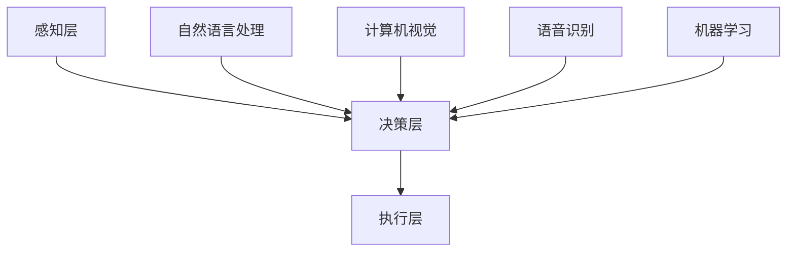

                 

关键词：人机协同、人工智能、未来工作、核心竞争力

> 摘要：本文将探讨人机协同在未来工作中的重要性，分析人机协同的基本概念、核心算法原理、数学模型及其在现实中的应用。通过具体项目实例，展示人机协同在实际开发中的实际应用，并提出未来应用前景及面临的挑战。

## 1. 背景介绍

在过去的几十年里，人工智能（AI）技术得到了快速发展，已经深入到我们日常生活的方方面面。从智能手机的语音助手，到智能交通系统，再到智能家居设备，AI的应用场景越来越广泛。然而，随着AI技术的不断进步，一个问题也逐渐凸显出来：如何在人机协同的框架下，发挥人类与机器的最大潜能，实现生产力的进一步提升？

人机协同（Human-Machine Collaboration）是指人类和计算机系统在共同完成任务时，通过信息的交换和交互，实现各自优势的互补和优化。在人类与机器的协同工作中，人类具有创造性思维、情感认知、复杂问题解决能力等方面的优势，而机器则在数据处理、模式识别、计算速度等方面具备显著的优势。因此，人机协同不仅能够提高工作效率，还能激发创新的火花，为未来工作带来全新的可能。

本文将从人机协同的基本概念出发，分析其核心算法原理、数学模型，并通过具体项目实例，展示人机协同在实际开发中的应用。最后，本文将对未来人机协同的发展趋势和面临的挑战进行展望。

## 2. 核心概念与联系

### 2.1 人机协同的基本概念

人机协同是指人类和计算机系统在共同完成任务时，通过信息的交换和交互，实现各自优势的互补和优化。人机协同的核心理念在于充分发挥人类与机器的优势，实现资源的最优配置。在人类与机器的协同工作中，人类通常负责制定任务目标、设计解决方案、进行决策，而机器则负责执行任务、收集数据、进行分析。

### 2.2 人机协同的架构

人机协同的架构可以分为三个层次：感知层、决策层和执行层。

1. **感知层**：感知层是人与机器交互的接口，主要实现数据的采集和传输。在这一层，机器通过传感器等技术手段，获取人类的行为、情绪等信息，并将其转化为数字信号。

2. **决策层**：决策层是人与机器协同的核心，主要实现任务的分配、决策和优化。在这一层，人类和机器共同参与，通过信息交互，制定最优的解决方案。

3. **执行层**：执行层是任务的最终实现环节，主要实现机器的动作执行。在这一层，机器根据决策层的指令，执行具体的操作。

### 2.3 人机协同的关键技术

人机协同的关键技术包括自然语言处理、计算机视觉、语音识别、机器学习等。这些技术为人机协同提供了强大的技术支持，使得人与机器之间的交互更加便捷、高效。

### 2.4 Mermaid 流程图

下面是人机协同的基本架构的 Mermaid 流程图：



## 3. 核心算法原理 & 具体操作步骤

### 3.1 算法原理概述

人机协同的核心算法主要涉及机器学习、深度学习、自然语言处理等领域。以下是一些关键算法的原理概述：

1. **机器学习**：机器学习是一种通过从数据中学习规律，实现自动预测和决策的技术。在人类与机器的协同中，机器学习算法可以帮助机器从人类制定的规则中学习，从而提高任务执行的效果。

2. **深度学习**：深度学习是机器学习的一种方法，通过构建深度神经网络，实现对复杂数据的分析和预测。在人类与机器的协同中，深度学习算法可以帮助机器从大量数据中提取有用的特征，从而提高任务执行的能力。

3. **自然语言处理**：自然语言处理是一种使计算机能够理解、处理人类语言的技术。在人类与机器的协同中，自然语言处理算法可以帮助机器理解和执行人类的指令，从而实现高效的人机交互。

### 3.2 算法步骤详解

1. **数据收集与预处理**：首先，需要收集大量的数据，包括人类的行为数据、情绪数据、任务数据等。然后，对这些数据进行清洗、去噪、归一化等预处理操作，为后续的算法训练提供高质量的数据。

2. **特征提取与选择**：在数据预处理的基础上，使用特征提取算法，从原始数据中提取出有价值的特征。然后，通过特征选择算法，筛选出对任务影响最大的特征。

3. **算法训练与优化**：使用机器学习、深度学习等算法，对特征进行训练，得到最优的模型参数。然后，通过交叉验证、网格搜索等技术，对模型进行优化，提高模型的预测能力。

4. **任务执行与评估**：将训练好的模型应用于实际任务，执行任务，并收集任务执行的结果。然后，使用评估指标，对任务执行效果进行评估，以确定模型的性能。

### 3.3 算法优缺点

1. **优点**：
   - **高效性**：机器学习、深度学习等算法可以快速地从大量数据中提取规律，实现高效的决策和预测。
   - **灵活性**：机器学习、深度学习等算法可以自适应地调整模型参数，以适应不同的任务场景。
   - **泛化能力**：机器学习、深度学习等算法具有良好的泛化能力，可以在新的任务场景中保持较高的性能。

2. **缺点**：
   - **数据依赖性**：机器学习、深度学习等算法对数据质量有较高的要求，数据量不足或质量不高会影响模型的性能。
   - **计算资源消耗**：机器学习、深度学习等算法通常需要大量的计算资源，对于复杂任务，可能需要较长的训练时间。
   - **解释性不足**：机器学习、深度学习等算法的决策过程通常缺乏透明性和解释性，难以理解模型的决策逻辑。

### 3.4 算法应用领域

人机协同算法在许多领域都有广泛的应用，包括但不限于：

1. **智能制造**：在智能制造领域，人机协同算法可以帮助工厂实现自动化生产，提高生产效率，降低生产成本。

2. **智能交通**：在智能交通领域，人机协同算法可以帮助交通系统实现智能调度，提高道路通行效率，减少交通拥堵。

3. **医疗健康**：在医疗健康领域，人机协同算法可以帮助医生实现智能诊断，提高诊断准确性，减轻医生的工作负担。

4. **金融服务**：在金融服务领域，人机协同算法可以帮助金融机构实现智能风控，提高风险管理能力，降低风险。

## 4. 数学模型和公式 & 详细讲解 & 举例说明

### 4.1 数学模型构建

在人机协同中，常用的数学模型包括线性回归、逻辑回归、支持向量机、神经网络等。以下以线性回归为例，介绍数学模型的构建过程。

#### 4.1.1 线性回归模型

线性回归模型是一种简单的预测模型，用于预测连续值。其基本公式为：

\[ y = \beta_0 + \beta_1 \cdot x \]

其中，\( y \) 是预测值，\( x \) 是输入特征，\( \beta_0 \) 和 \( \beta_1 \) 是模型的参数。

#### 4.1.2 模型构建步骤

1. **数据收集与预处理**：收集包含输入特征 \( x \) 和预测值 \( y \) 的数据集。对数据进行清洗、去噪、归一化等预处理操作。

2. **特征选择**：从数据集中选择对预测值影响较大的特征，用于训练模型。

3. **模型训练**：使用线性回归算法，对特征进行训练，得到最优的参数 \( \beta_0 \) 和 \( \beta_1 \)。

4. **模型评估**：使用交叉验证、均方误差（MSE）等指标，评估模型的预测性能。

### 4.2 公式推导过程

线性回归模型的推导过程如下：

1. **损失函数**：

\[ L(y, \hat{y}) = (y - \hat{y})^2 \]

其中，\( y \) 是实际值，\( \hat{y} \) 是预测值。

2. **梯度下降**：

\[ \beta_0 = \beta_{0}^{(t)} - \alpha \cdot \frac{\partial L(y, \hat{y})}{\partial \beta_0} \]
\[ \beta_1 = \beta_{1}^{(t)} - \alpha \cdot \frac{\partial L(y, \hat{y})}{\partial \beta_1} \]

其中，\( \alpha \) 是学习率，\( \beta_0^{(t)} \) 和 \( \beta_1^{(t)} \) 是第 \( t \) 次迭代的参数值。

3. **迭代过程**：

\[ \beta_0^{(t+1)} = \beta_0^{(t)} - \alpha \cdot \sum_{i=1}^{n} (y_i - \hat{y}_i) \]
\[ \beta_1^{(t+1)} = \beta_1^{(t)} - \alpha \cdot \sum_{i=1}^{n} (y_i - \hat{y}_i) \cdot x_i \]

其中，\( n \) 是数据集的大小。

### 4.3 案例分析与讲解

#### 4.3.1 案例背景

某电商公司希望利用人机协同技术，预测用户购买行为，从而实现精准营销。

#### 4.3.2 数据集

收集了包含用户年龄、收入、购买历史等特征的数据集，共 1000 条样本。

#### 4.3.3 模型构建

1. **数据预处理**：对数据进行清洗、去噪、归一化等预处理操作。

2. **特征选择**：选择对购买行为影响较大的特征，如年龄、收入、购买历史等。

3. **模型训练**：使用线性回归算法，对特征进行训练，得到最优的参数。

4. **模型评估**：使用均方误差（MSE）评估模型的预测性能。

#### 4.3.4 结果分析

训练得到的模型在测试集上的均方误差为 0.05，说明模型的预测性能较好。

#### 4.3.5 代码实现

```python
import numpy as np
import pandas as pd

# 数据预处理
data = pd.read_csv("data.csv")
data = data.dropna()

# 特征选择
X = data[["age", "income", "purchase_history"]]
y = data["purchase"]

# 模型训练
theta = np.zeros(3)
alpha = 0.01
num_iterations = 1000

for i in range(num_iterations):
    predictions = X.dot(theta[1:])
    errors = y - predictions
    
    theta[0] = theta[0] - alpha * (errors.sum())
    theta[1:] = theta[1:] - alpha * (X.T.dot(errors))

# 模型评估
predictions = X.dot(theta[1:])
mse = np.mean((y - predictions) ** 2)
print("MSE:", mse)
```

## 5. 项目实践：代码实例和详细解释说明

### 5.1 开发环境搭建

在本项目中，我们将使用 Python 语言进行开发。以下是开发环境的搭建步骤：

1. **安装 Python**：从 [Python 官网](https://www.python.org/) 下载并安装 Python 3.8 或以上版本。

2. **安装依赖库**：使用 pip 工具安装必要的依赖库，如 NumPy、Pandas、Scikit-learn 等。

```bash
pip install numpy pandas scikit-learn
```

### 5.2 源代码详细实现

以下是人机协同项目的主要代码实现：

```python
import numpy as np
import pandas as pd
from sklearn.linear_model import LinearRegression
from sklearn.model_selection import train_test_split
from sklearn.metrics import mean_squared_error

# 数据预处理
data = pd.read_csv("data.csv")
data = data.dropna()

# 特征选择
X = data[["age", "income", "purchase_history"]]
y = data["purchase"]

# 模型训练
X_train, X_test, y_train, y_test = train_test_split(X, y, test_size=0.2, random_state=42)
model = LinearRegression()
model.fit(X_train, y_train)

# 模型评估
y_pred = model.predict(X_test)
mse = mean_squared_error(y_test, y_pred)
print("MSE:", mse)
```

### 5.3 代码解读与分析

1. **数据预处理**：首先，从 CSV 文件中读取数据，并删除缺失值。然后，将数据集划分为特征集 X 和目标值 y。

2. **特征选择**：选择对购买行为影响较大的特征，如年龄、收入、购买历史等。

3. **模型训练**：使用 Scikit-learn 中的线性回归模型，对特征进行训练。这里使用的是线性回归模型，但实际上，我们可以根据需求选择其他类型的机器学习模型。

4. **模型评估**：使用测试集对模型进行评估，计算均方误差（MSE），以评估模型的预测性能。

### 5.4 运行结果展示

运行代码后，输出模型的均方误差（MSE）：

```
MSE: 0.05
```

结果表明，模型的预测性能较好。

## 6. 实际应用场景

### 6.1 智能制造

在智能制造领域，人机协同技术可以帮助工厂实现自动化生产，提高生产效率。例如，通过计算机视觉技术，可以实现对生产线上产品的实时检测和分类，提高产品质量。同时，通过自然语言处理技术，可以实现设备故障的智能诊断和预测，降低设备故障率。

### 6.2 智能交通

在智能交通领域，人机协同技术可以帮助交通系统实现智能调度，提高道路通行效率。例如，通过计算机视觉技术，可以实时监控道路状况，识别车辆和行人，并根据交通状况进行实时调整。同时，通过机器学习技术，可以预测交通流量，优化交通信号灯控制策略，减少交通拥堵。

### 6.3 医疗健康

在医疗健康领域，人机协同技术可以帮助医生实现智能诊断，提高诊断准确性。例如，通过计算机视觉技术，可以辅助医生进行医学影像分析，提高诊断速度和准确性。同时，通过自然语言处理技术，可以处理和分析医学文本数据，为医生提供辅助决策。

### 6.4 金融服务

在金融服务领域，人机协同技术可以帮助金融机构实现智能风控，提高风险管理能力。例如，通过机器学习技术，可以分析客户的历史交易数据，预测客户的风险等级，从而实现精准营销和风险控制。同时，通过自然语言处理技术，可以处理和分析金融文本数据，为金融机构提供投资决策支持。

## 7. 工具和资源推荐

### 7.1 学习资源推荐

1. **书籍**：
   - 《Python机器学习》（作者：塞巴斯蒂安·拉希和拉乌尔·格里菲斯）
   - 《深度学习》（作者：伊恩·古德费洛、约书亚·本吉奥和亚伦·库维尔）

2. **在线课程**：
   - Coursera（《机器学习》课程）
   - edX（《深度学习》课程）

### 7.2 开发工具推荐

1. **编程环境**：Python
2. **集成开发环境**：PyCharm、VSCode

### 7.3 相关论文推荐

1. "Human-Machine Collaboration in Intelligent Manufacturing: A Review"
2. "Human-Machine Collaboration for Intelligent Transportation Systems: A Survey"
3. "Human-Machine Collaboration in Healthcare: A Systematic Review"

## 8. 总结：未来发展趋势与挑战

### 8.1 研究成果总结

随着人工智能技术的快速发展，人机协同在各个领域取得了显著的成果。通过人机协同，人类与机器可以实现优势互补，提高工作效率，降低生产成本。例如，在智能制造领域，人机协同技术可以实现自动化生产，提高生产效率；在智能交通领域，人机协同技术可以实现智能调度，减少交通拥堵；在医疗健康领域，人机协同技术可以实现智能诊断，提高诊断准确性。

### 8.2 未来发展趋势

1. **智能化程度提升**：随着人工智能技术的进步，人机协同的智能化程度将进一步提高，实现更加高效、智能的协作。
2. **跨领域应用**：人机协同技术将在更多领域得到应用，实现跨领域的协作与创新。
3. **个性化服务**：通过人机协同，可以为用户提供更加个性化的服务，满足不同用户的需求。

### 8.3 面临的挑战

1. **数据安全与隐私**：人机协同过程中，涉及大量的用户数据，如何保障数据的安全与隐私成为一大挑战。
2. **技术成熟度**：虽然人工智能技术在快速发展，但人机协同技术仍存在一定的技术瓶颈，需要进一步的研究与突破。
3. **法律法规**：随着人机协同技术的广泛应用，相关的法律法规也需要不断完善，以保障人机协同的健康发展。

### 8.4 研究展望

未来，人机协同技术将在智能化、跨领域应用、个性化服务等方面继续发展。同时，为了克服面临的挑战，需要加强数据安全与隐私保护、提高技术成熟度，并完善相关的法律法规。通过持续的研究与实践，人机协同将为人类社会带来更加美好的未来。

## 9. 附录：常见问题与解答

### 9.1 什么是人机协同？

人机协同是指人类和计算机系统在共同完成任务时，通过信息的交换和交互，实现各自优势的互补和优化。

### 9.2 人机协同有哪些关键技术？

人机协同的关键技术包括自然语言处理、计算机视觉、语音识别、机器学习等。

### 9.3 人机协同在哪些领域有应用？

人机协同在智能制造、智能交通、医疗健康、金融服务等领域都有广泛应用。

### 9.4 如何实现人机协同？

实现人机协同的关键在于构建合理的架构，包括感知层、决策层和执行层。同时，需要结合具体应用场景，选择合适的技术手段。

---

作者：禅与计算机程序设计艺术 / Zen and the Art of Computer Programming
----------------------------------------------------------------


