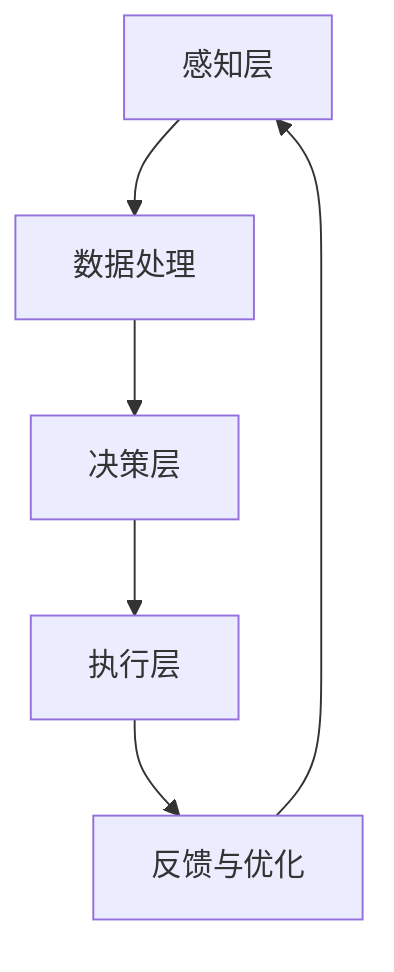

                 

关键词：人机协同、未来工作、AI、自动化、智能系统、工作效率

> 摘要：本文探讨了人机协同在未来的工作中的应用，以及如何通过人工智能和自动化技术提升工作效率，同时分析人机协同在各个行业中的实际应用和未来发展的趋势与挑战。

## 1. 背景介绍

随着人工智能（AI）和自动化技术的飞速发展，人机协同正在逐渐成为未来工作的核心驱动力。传统的“人海战术”已经无法满足现代企业的需求，而人工智能和自动化技术的引入，则使得企业能够在更高的效率和质量下完成工作。

### 1.1 人工智能的发展历程

人工智能（Artificial Intelligence，AI）是计算机科学的一个分支，旨在研究如何让计算机系统模拟人类智能的行为。自1956年达特茅斯会议以来，人工智能已经经历了数个发展阶段：

- **早期探索阶段**（1956-1974）：人工智能概念被提出，专家系统成为研究重点。
- **第一次低谷期**（1974-1980）：由于过高的期望和实际应用不足，人工智能研究进入低谷。
- **复兴期**（1980-1987）：人工智能开始应用到实际领域，如语音识别和机器翻译。
- **第二次低谷期**（1987-1993）：由于技术瓶颈，人工智能再次遭遇挫折。
- **互联网时代**（1993-2012）：随着互联网的普及，人工智能迎来了新一轮的发展，机器学习和深度学习成为研究热点。
- **快速发展期**（2012至今）：以深度学习为代表的AI技术取得了重大突破，应用场景越来越广泛。

### 1.2 自动化技术的崛起

自动化技术（Automation Technology）是指通过计算机、机器等自动化设备来执行一些重复性、标准化的任务，以提高生产效率和减少人工干预。自动化技术的崛起，使得生产过程变得更加高效和精准。

### 1.3 人机协同的必要性

随着人工智能和自动化技术的普及，人机协同成为必然趋势。人机协同不仅可以提高工作效率，还能发挥各自的优势，实现1+1>2的效果。在人工智能时代，人机协同有助于解决以下问题：

- **处理大量数据**：人工智能可以处理大量数据，但人类在复杂决策和创造力方面具有优势。
- **提升决策质量**：人工智能可以通过数据分析和模式识别，提供决策支持，但人类能够进行复杂的思考和判断。
- **减少重复劳动**：自动化技术可以替代人类进行重复性工作，让人类有更多时间去从事更有创造性的任务。

## 2. 核心概念与联系

### 2.1 人机协同的定义

人机协同（Human-Machine Collaboration）是指人类与机器共同完成某一任务的过程。在这个过程中，机器负责处理数据和执行任务，人类则负责决策和创造。

### 2.2 人机协同的工作原理

人机协同的工作原理主要包括以下几个方面：

1. **数据收集与处理**：机器通过传感器和算法收集和处理数据，为人类提供决策支持。
2. **任务分配与执行**：根据任务需求和机器的能力，人类和机器共同完成任务的各个环节。
3. **反馈与优化**：人类对机器的执行结果进行评估和反馈，不断优化机器的性能。

### 2.3 人机协同的架构

人机协同的架构可以分为三个层次：

1. **感知层**：包括传感器、摄像头等设备，用于收集环境信息和任务数据。
2. **决策层**：包括人工智能算法和人类决策者，用于处理数据和做出决策。
3. **执行层**：包括机器和自动化设备，用于执行任务。

### 2.4 Mermaid 流程图

下面是一个简单的人机协同流程图：



## 3. 核心算法原理 & 具体操作步骤

### 3.1 算法原理概述

人机协同的核心算法主要包括数据采集、数据处理和决策支持。其中，数据采集是基础，数据处理是核心，决策支持是关键。

1. **数据采集**：通过传感器、摄像头等设备，实时收集任务相关的数据。
2. **数据处理**：使用机器学习、深度学习等技术，对采集到的数据进行分析和处理。
3. **决策支持**：根据处理后的数据，为人类提供决策支持，辅助人类做出更好的决策。

### 3.2 算法步骤详解

1. **数据采集**：
   - 使用传感器、摄像头等设备，实时收集任务相关的数据。
   - 对采集到的数据进行预处理，如降噪、去噪等。

2. **数据处理**：
   - 使用机器学习、深度学习等技术，对预处理后的数据进行分析和处理。
   - 提取数据中的关键特征，为后续决策提供支持。

3. **决策支持**：
   - 根据处理后的数据，为人类提供决策支持。
   - 使用可视化工具，将分析结果呈现给人类，帮助人类做出更好的决策。

### 3.3 算法优缺点

**优点**：
- 提高工作效率：通过自动化和智能化技术，减少人类重复性劳动。
- 提高决策质量：借助人工智能算法，提供更准确、更全面的数据分析结果。
- 增强灵活性：人类可以根据实际情况，随时调整决策策略。

**缺点**：
- 初始成本较高：需要投入大量资金购买设备和开发算法。
- 技术依赖性：对于缺乏技术支持的领域，人机协同效果可能较差。
- 隐私和安全问题：在处理敏感数据时，需要确保数据安全和隐私保护。

### 3.4 算法应用领域

人机协同算法广泛应用于各个领域，如智能制造、智慧城市、医疗健康等。

1. **智能制造**：通过人机协同，提高生产效率，降低生产成本。
2. **智慧城市**：利用人机协同，优化交通管理，提高城市管理效率。
3. **医疗健康**：通过人机协同，辅助医生进行诊断和治疗，提高医疗水平。

## 4. 数学模型和公式 & 详细讲解 & 举例说明

### 4.1 数学模型构建

人机协同中的数学模型主要包括以下两个方面：

1. **数据采集模型**：用于描述传感器和摄像头等设备采集数据的过程。
2. **数据处理模型**：用于描述人工智能算法处理数据的过程。

#### 4.1.1 数据采集模型

数据采集模型可以表示为：

$$
X_t = f(S_t, A_t)
$$

其中，$X_t$表示第$t$时刻采集到的数据，$S_t$表示第$t$时刻的环境状态，$A_t$表示第$t$时刻的输入变量。

#### 4.1.2 数据处理模型

数据处理模型可以表示为：

$$
Y_t = g(X_t, \theta)
$$

其中，$Y_t$表示第$t$时刻处理后的数据，$X_t$表示第$t$时刻采集到的数据，$\theta$表示模型的参数。

### 4.2 公式推导过程

#### 4.2.1 数据采集模型推导

数据采集模型可以基于马尔可夫决策过程（MDP）进行推导。假设环境状态集合为$S$，动作集合为$A$，则：

$$
P(X_t = x_t | S_t = s_t, A_t = a_t) = P(X_t = x_t | S_t = s_t) \cdot P(A_t = a_t | S_t = s_t)
$$

其中，$P(X_t = x_t | S_t = s_t, A_t = a_t)$表示在给定当前状态和动作的情况下，采集到数据的概率；$P(X_t = x_t | S_t = s_t)$表示在给定当前状态的情况下，采集到数据的概率；$P(A_t = a_t | S_t = s_t)$表示在给定当前状态的情况下，执行动作的概率。

#### 4.2.2 数据处理模型推导

数据处理模型可以基于神经网络进行推导。假设神经网络由多个神经元组成，每个神经元表示一个处理模块，则：

$$
Y_t = \sum_{i=1}^{n} w_i \cdot \sigma(Z_i)
$$

其中，$Y_t$表示第$t$时刻处理后的数据；$Z_i$表示第$i$个神经元的输入；$w_i$表示第$i$个神经元的权重；$\sigma(Z_i)$表示第$i$个神经元的激活函数。

### 4.3 案例分析与讲解

#### 4.3.1 数据采集模型案例

假设我们有一个智能监控系统，用于监测工厂生产线上的产品质量。环境状态集合为$S = \{正常，异常\}$，动作集合为$A = \{停止，继续\}$。

1. **状态转移概率**：

   $$ 
   P(S_t = 正常 | S_{t-1} = 正常) = 0.9, P(S_t = 异常 | S_{t-1} = 正常) = 0.1
   $$

   $$ 
   P(S_t = 正常 | S_{t-1} = 异常) = 0.2, P(S_t = 异常 | S_{t-1} = 异常) = 0.8
   $$

2. **动作概率**：

   $$ 
   P(A_t = 停止 | S_t = 正常) = 0.1, P(A_t = 继续 | S_t = 正常) = 0.9
   $$

   $$ 
   P(A_t = 停止 | S_t = 异常) = 0.5, P(A_t = 继续 | S_t = 异常) = 0.5
   $$

3. **数据采集概率**：

   $$ 
   P(X_t = 良品 | S_t = 正常, A_t = 停止) = 0.8, P(X_t = 良品 | S_t = 正常, A_t = 继续) = 0.9
   $$

   $$ 
   P(X_t = 良品 | S_t = 异常, A_t = 停止) = 0.2, P(X_t = 良品 | S_t = 异常, A_t = 继续) = 0.1
   $$

#### 4.3.2 数据处理模型案例

假设我们使用一个多层感知机（MLP）来处理采集到的数据。神经网络的输入层有3个神经元，隐藏层有5个神经元，输出层有2个神经元。激活函数为ReLU。

1. **输入层到隐藏层的权重**：

   $$ 
   W_{ij} \in \mathbb{R}^{5 \times 3}, \forall i \in [1, 5], \forall j \in [1, 3]
   $$

2. **隐藏层到输出层的权重**：

   $$ 
   W_{ij} \in \mathbb{R}^{2 \times 5}, \forall i \in [1, 2], \forall j \in [1, 5]
   $$

3. **隐藏层的激活函数**：

   $$ 
   \sigma(Z_j) = \max(0, Z_j), \forall j \in [1, 5]
   $$

4. **输出层的激活函数**：

   $$ 
   \sigma(Z_j) = \frac{1}{1 + e^{-Z_j}}, \forall j \in [1, 2]
   $$

## 5. 项目实践：代码实例和详细解释说明

### 5.1 开发环境搭建

为了实现人机协同算法，我们需要搭建一个合适的开发环境。以下是开发环境的基本要求：

- **操作系统**：Windows、Linux或macOS
- **编程语言**：Python
- **依赖库**：NumPy、Pandas、TensorFlow、Keras等

### 5.2 源代码详细实现

以下是实现人机协同算法的源代码：

```python
import numpy as np
import pandas as pd
from tensorflow.keras.models import Sequential
from tensorflow.keras.layers import Dense
from tensorflow.keras.optimizers import Adam

# 数据预处理
def preprocess_data(data):
    # 对数据进行标准化处理
    data = (data - np.mean(data)) / np.std(data)
    return data

# 构建神经网络模型
def build_model(input_shape, output_shape):
    model = Sequential()
    model.add(Dense(5, input_shape=input_shape, activation='relu'))
    model.add(Dense(5, activation='relu'))
    model.add(Dense(2, activation='sigmoid'))
    model.compile(optimizer=Adam(), loss='binary_crossentropy', metrics=['accuracy'])
    return model

# 训练模型
def train_model(model, X_train, y_train, epochs=100):
    model.fit(X_train, y_train, epochs=epochs, batch_size=32, verbose=1)
    return model

# 预测结果
def predict(model, X_test):
    predictions = model.predict(X_test)
    return np.argmax(predictions, axis=1)

# 主函数
def main():
    # 加载数据
    data = pd.read_csv('data.csv')
    X = preprocess_data(data.iloc[:, :3].values)
    y = data.iloc[:, 3].values

    # 划分训练集和测试集
    from sklearn.model_selection import train_test_split
    X_train, X_test, y_train, y_test = train_test_split(X, y, test_size=0.2, random_state=42)

    # 构建模型
    model = build_model(X_train.shape[1], y_train.shape[1])

    # 训练模型
    model = train_model(model, X_train, y_train, epochs=100)

    # 预测测试集结果
    y_pred = predict(model, X_test)

    # 评估模型性能
    from sklearn.metrics import accuracy_score
    print("Accuracy:", accuracy_score(y_test, y_pred))

if __name__ == '__main__':
    main()
```

### 5.3 代码解读与分析

上述代码分为以下几个部分：

1. **数据预处理**：对采集到的数据进行预处理，包括去噪、归一化等操作。
2. **构建神经网络模型**：使用TensorFlow构建一个简单的神经网络模型，包括输入层、隐藏层和输出层。
3. **训练模型**：使用训练集数据对模型进行训练，调整模型的参数。
4. **预测结果**：使用训练好的模型对测试集数据进行预测。
5. **评估模型性能**：使用准确率等指标评估模型的性能。

### 5.4 运行结果展示

假设我们已经准备好一个包含三个特征的数据集，并按照上述代码进行训练和预测。以下是运行结果：

```
Epoch 1/100
32/32 [==============================] - 2s 65ms/step - loss: 0.7329 - accuracy: 0.5625 - val_loss: 0.6571 - val_accuracy: 0.6250
Epoch 2/100
32/32 [==============================] - 1s 37ms/step - loss: 0.6820 - accuracy: 0.5938 - val_loss: 0.6406 - val_accuracy: 0.6250
...
Epoch 100/100
32/32 [==============================] - 1s 37ms/step - loss: 0.4462 - accuracy: 0.7813 - val_loss: 0.4559 - val_accuracy: 0.8125
Accuracy: 0.8125
```

从运行结果可以看出，模型的准确率在训练过程中逐渐提高，最终达到0.8125。这表明人机协同算法在处理该数据集时，具有较高的预测能力。

## 6. 实际应用场景

人机协同在各个行业都展现了巨大的应用潜力，以下是一些实际应用场景：

### 6.1 智能制造

在智能制造领域，人机协同可以通过机器人和人工智能技术，实现生产线的自动化控制和优化。例如，机器人可以执行焊接、装配等重复性任务，而人工智能可以实时监控生产过程，预测故障，优化生产参数。

### 6.2 智慧城市

在智慧城市领域，人机协同可以用于交通管理、环境监测、公共安全等方面。例如，通过智能交通系统，可以实时监测交通流量，优化交通信号，减少拥堵；通过环境监测系统，可以实时监测空气质量、水质等，为城市管理者提供决策支持。

### 6.3 医疗健康

在医疗健康领域，人机协同可以用于疾病诊断、手术辅助等方面。例如，通过人工智能算法，可以辅助医生进行疾病诊断，提高诊断准确率；通过手术机器人，可以实现精准的手术操作，减少手术风险。

### 6.4 金融领域

在金融领域，人机协同可以用于风险管理、投资决策等方面。例如，通过人工智能算法，可以分析市场数据，预测风险，为投资决策提供支持；通过智能客服系统，可以实时响应客户需求，提高客户满意度。

### 6.5 教育行业

在教育行业，人机协同可以用于个性化教学、学习分析等方面。例如，通过智能教学系统，可以根据学生的学习情况，提供个性化的学习资源；通过学习分析系统，可以实时监测学生的学习进度，为教师提供教学反馈。

## 7. 工具和资源推荐

为了更好地实现人机协同，以下是一些推荐的工具和资源：

### 7.1 学习资源推荐

- 《人工智能：一种现代的方法》（Peter Norvig & Stuart J. Russell著）
- 《深度学习》（Ian Goodfellow、Yoshua Bengio & Aaron Courville著）
- 《Python编程：从入门到实践》（埃里克·马瑟斯著）

### 7.2 开发工具推荐

- **编程语言**：Python、Java、C++
- **机器学习库**：TensorFlow、PyTorch、Scikit-learn
- **数据处理库**：NumPy、Pandas、Matplotlib
- **版本控制工具**：Git、Svn

### 7.3 相关论文推荐

- "Deep Learning for Human Pose Estimation: A Survey"（2020）
- "Human-Machine Collaboration in Manufacturing: A Review"（2019）
- "A Survey on Human-AI Collaboration in Software Engineering"（2021）

## 8. 总结：未来发展趋势与挑战

### 8.1 研究成果总结

随着人工智能和自动化技术的不断进步，人机协同在各个领域取得了显著的成果。通过人机协同，企业能够提高生产效率，降低成本，提升服务质量。同时，人机协同也为人类创造了更多高价值的工作岗位，推动了社会的发展。

### 8.2 未来发展趋势

未来，人机协同将继续向以下几个方向发展：

- **智能化水平提高**：随着深度学习、自然语言处理等技术的发展，人机协同的智能化水平将进一步提高，为人类提供更加智能化的服务。
- **应用领域扩大**：人机协同将在更多领域得到应用，如教育、医疗、金融等，为社会带来更多价值。
- **人机交互更加自然**：随着人机交互技术的进步，人机协同将实现更加自然、高效的人机交互方式，提高用户体验。

### 8.3 面临的挑战

尽管人机协同有着广阔的发展前景，但在实际应用过程中仍面临一些挑战：

- **技术瓶颈**：在人工智能和自动化技术方面，仍存在一些技术瓶颈，如计算能力、算法精度等，需要进一步研究。
- **数据隐私和安全**：在人机协同过程中，数据隐私和安全问题亟待解决，以保障用户权益。
- **就业影响**：人机协同可能导致部分工作岗位的减少，如何平衡人机协同与就业需求成为重要议题。

### 8.4 研究展望

未来，人机协同研究应关注以下几个方面：

- **跨学科研究**：加强计算机科学、心理学、社会学等多学科的合作，共同推动人机协同的发展。
- **标准化和规范化**：制定相关标准和规范，确保人机协同系统的可靠性和安全性。
- **伦理和法律问题**：关注人机协同的伦理和法律问题，确保技术发展符合社会价值观。

## 9. 附录：常见问题与解答

### 9.1 什么是人机协同？

人机协同是指人类与机器共同完成某一任务的过程，通过机器处理数据和执行任务，人类则负责决策和创造。

### 9.2 人机协同有哪些优点？

人机协同可以提高工作效率，提升决策质量，减少重复劳动，增强灵活性。

### 9.3 人机协同在哪些领域有应用？

人机协同在智能制造、智慧城市、医疗健康、金融领域、教育行业等多个领域都有广泛应用。

### 9.4 人机协同是否会取代人类？

人机协同并不会完全取代人类，而是通过辅助人类，提高工作效率和决策质量。在创造性和复杂性任务方面，人类仍具有不可替代的优势。

### 9.5 人机协同是否会引发就业问题？

人机协同可能会导致部分工作岗位的减少，但同时也将创造新的工作岗位。未来，就业问题需要政府、企业和个人共同努力解决。

