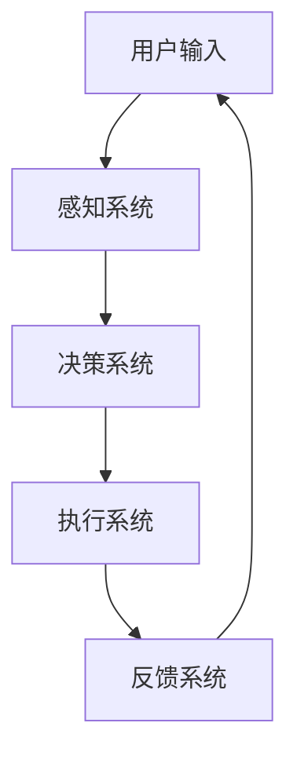

                 

关键词：人机协同、智能增强、人工智能、算法、数学模型、代码实例、应用场景、工具推荐

> 摘要：本文深入探讨了人机协同在智能增强领域的应用，分析了人机协同的核心概念与联系，详细讲解了核心算法原理及操作步骤，构建了数学模型并进行了公式推导，通过代码实例展示了具体实现过程，探讨了实际应用场景，并对未来发展趋势和挑战进行了展望。本文旨在为读者提供一份全面而深入的人机协同技术指南。

## 1. 背景介绍

随着信息技术的飞速发展，人工智能（AI）已经成为推动社会进步的重要力量。AI技术通过模拟人类智能行为，在图像识别、自然语言处理、决策分析等方面取得了显著成果。然而，AI系统在复杂问题处理上仍面临诸多挑战，如知识获取的局限性、决策的透明度不足等问题。因此，如何有效地结合人的智慧和机器的计算能力，实现人机协同，成为一个重要的研究方向。

人机协同是指将人类与机器的能力结合起来，通过相互协作，实现更高效、更智能的决策和问题解决。人机协同不仅能够弥补AI系统的不足，还能发挥人的创造力、直觉和经验优势，提升整体系统的性能和可靠性。在智能增强的背景下，人机协同的意义尤为重要，它不仅能够推动技术进步，还能带来深刻的社会变革。

本文将围绕人机协同的核心概念、算法原理、数学模型以及应用场景等方面展开讨论，旨在为读者提供一份全面而深入的智能增强技术指南。

## 2. 核心概念与联系

### 2.1 定义

人机协同（Human-Machine Collaboration，简称HMC）是指人类与机器在特定的任务环境中，通过信息交换、任务分工和决策共享，实现共同目标的过程。在HMC中，人类和机器各自发挥自身优势，形成互补，从而提高任务完成效率和质量。

### 2.2 基本原理

人机协同的基本原理包括以下几个方面：

- **信息共享**：通过数据传输和通信技术，实现人类与机器之间的信息共享，为协同工作提供基础。
- **任务分工**：根据人类和机器的能力特点，进行任务分工，发挥各自优势，提高工作效率。
- **决策共享**：通过决策模型和算法，实现人类和机器之间的决策共享，确保协同工作的准确性和一致性。

### 2.3 架构

人机协同的基本架构包括以下几个主要部分：

- **用户界面**：提供用户与机器交互的接口，支持任务指令输入、信息反馈和交互操作。
- **感知系统**：通过传感器和视觉系统，收集环境信息和任务数据，为决策提供基础。
- **决策系统**：利用人工智能算法和数学模型，进行任务分析和决策生成。
- **执行系统**：根据决策结果，执行具体任务操作，包括机器人和自动化设备。
- **反馈系统**：收集执行结果，进行任务评估和反馈，优化协同过程。

### 2.4 Mermaid 流程图

以下是一个简化的Mermaid流程图，描述了人机协同的基本流程：



在上述流程中，用户通过界面输入任务指令，感知系统收集环境信息，决策系统进行任务分析和决策生成，执行系统执行任务操作，最后通过反馈系统进行任务评估和反馈。

### 2.5 核心概念联系

人机协同中的核心概念包括信息共享、任务分工、决策共享等，这些概念相互联系，共同构成了人机协同的理论框架。信息共享是实现协同工作的基础，任务分工和决策共享则是实现协同效率的关键。通过这三个核心概念，人类和机器能够在特定任务环境中实现高效、智能的协同工作。

## 3. 核心算法原理 & 具体操作步骤

### 3.1 算法原理概述

人机协同的核心算法主要基于机器学习和优化理论，通过建立数学模型和决策算法，实现人类与机器之间的信息交互和协同决策。以下是几种常见的人机协同算法原理概述：

- **机器学习算法**：通过训练大量数据，建立机器学习模型，实现对未知数据的预测和分类。常见的机器学习算法包括线性回归、决策树、支持向量机、神经网络等。
- **优化算法**：通过优化理论，求解最优解，实现任务的高效分配和决策。常见的优化算法包括贪心算法、动态规划、遗传算法、模拟退火等。
- **决策树算法**：基于决策树模型，通过多级决策节点，实现复杂问题的分解和求解。决策树算法适用于分类和回归问题，具有直观、易解释的特点。

### 3.2 算法步骤详解

以决策树算法为例，详细描述人机协同中的算法步骤：

#### 步骤1：数据收集与预处理

- 收集任务相关的数据，包括输入特征和输出标签。
- 进行数据清洗，去除异常值和噪声数据。
- 进行特征工程，提取和选择对任务有重要影响的特征。

#### 步骤2：建立决策树模型

- 根据数据特征，选择合适的决策树算法，如ID3、C4.5、CART等。
- 训练决策树模型，通过递归划分数据集，建立决策树结构。

#### 步骤3：决策树剪枝

- 对过拟合的决策树进行剪枝，避免模型过于复杂。
- 选择合适的剪枝策略，如前剪枝、后剪枝等。

#### 步骤4：模型评估与优化

- 使用交叉验证等方法评估模型性能，包括准确率、召回率、F1值等指标。
- 根据评估结果，调整模型参数，优化模型性能。

#### 步骤5：决策树应用

- 将训练好的决策树模型应用于新数据，进行预测和分类。
- 输出决策结果，供用户和机器协同决策。

### 3.3 算法优缺点

决策树算法在处理分类和回归问题时具有以下优缺点：

- **优点**：
  - 算法简单，易于实现和解释。
  - 对小样本数据表现良好，适合处理稀疏数据。
  - 能够处理非线性关系，具有较强的泛化能力。

- **缺点**：
  - 容易过拟合，对噪声数据敏感。
  - 随着数据量和决策树深度的增加，计算复杂度急剧上升。
  - 难以处理多类别和多标签问题。

### 3.4 算法应用领域

决策树算法在人机协同中具有广泛的应用领域，包括但不限于以下几个方面：

- **医疗诊断**：利用决策树模型对疾病进行诊断，实现医生与机器的协同。
- **金融风控**：通过决策树算法对信贷风险进行评估，实现金融企业与机器的协同。
- **智能交通**：利用决策树算法优化交通信号控制，实现交通部门与机器的协同。
- **教育辅导**：通过决策树模型为学生提供个性化的学习建议，实现教师与机器的协同。

## 4. 数学模型和公式 & 详细讲解 & 举例说明

### 4.1 数学模型构建

在人机协同中，数学模型用于描述人类与机器之间的信息交互和协同决策过程。以下是几种常见的数学模型：

- **线性回归模型**：用于预测连续值输出。
- **逻辑回归模型**：用于预测离散值输出。
- **决策树模型**：用于分类和回归问题。
- **优化模型**：用于任务分配和资源调度。

### 4.2 公式推导过程

以线性回归模型为例，详细描述数学公式的推导过程：

- **线性回归模型**：
  - 输出变量 \( y \) 与输入变量 \( x \) 之间的关系可以用线性回归模型表示：
    $$ y = \beta_0 + \beta_1 x + \epsilon $$
  - 其中，\( \beta_0 \) 是截距，\( \beta_1 \) 是斜率，\( \epsilon \) 是误差项。

- **最小二乘法**：
  - 为了求解线性回归模型中的参数 \( \beta_0 \) 和 \( \beta_1 \)，可以使用最小二乘法：
    $$ \min_{\beta_0, \beta_1} \sum_{i=1}^n (y_i - (\beta_0 + \beta_1 x_i))^2 $$
  - 对上式求导，得到：
    $$ \frac{\partial}{\partial \beta_0} \sum_{i=1}^n (y_i - (\beta_0 + \beta_1 x_i))^2 = 0 $$
    $$ \frac{\partial}{\partial \beta_1} \sum_{i=1}^n (y_i - (\beta_0 + \beta_1 x_i))^2 = 0 $$
  - 解上述方程组，得到：
    $$ \beta_0 = \frac{\sum_{i=1}^n y_i - \beta_1 \sum_{i=1}^n x_i}{n} $$
    $$ \beta_1 = \frac{n \sum_{i=1}^n x_i y_i - \sum_{i=1}^n x_i \sum_{i=1}^n y_i}{n \sum_{i=1}^n x_i^2 - (\sum_{i=1}^n x_i)^2} $$

### 4.3 案例分析与讲解

以下是一个简单的线性回归模型案例，用于预测房屋价格：

- **数据集**：包含1000个房屋数据，每个房屋有5个特征：面积（\( x_1 \)）、位置（\( x_2 \)）、年龄（\( x_3 \)）、卧室数量（\( x_4 \)）、浴室数量（\( x_5 \)）和价格（\( y \)）。
- **目标**：建立线性回归模型，预测新房屋的价格。

- **步骤**：
  1. 数据预处理：对缺失值和异常值进行填充和剔除，对特征进行标准化处理。
  2. 模型训练：使用最小二乘法求解线性回归模型参数。
  3. 模型评估：使用交叉验证方法评估模型性能，包括均方误差（MSE）、均方根误差（RMSE）等指标。
  4. 模型应用：使用训练好的模型对新房屋的价格进行预测。

- **代码实现**（Python示例）：

```python
import numpy as np
import pandas as pd
from sklearn.linear_model import LinearRegression
from sklearn.model_selection import train_test_split
from sklearn.metrics import mean_squared_error

# 数据加载
data = pd.read_csv('house_data.csv')
X = data[['area', 'location', 'age', 'bedrooms', 'bathrooms']]
y = data['price']

# 数据预处理
X = (X - X.mean()) / X.std()

# 模型训练
model = LinearRegression()
model.fit(X, y)

# 模型评估
X_train, X_test, y_train, y_test = train_test_split(X, y, test_size=0.2, random_state=42)
y_pred = model.predict(X_test)
mse = mean_squared_error(y_test, y_pred)
rmse = np.sqrt(mse)

print(f'MSE: {mse}')
print(f'RMSE: {rmse}')

# 模型应用
new_house = pd.DataFrame([[1500, 1, 5, 3, 2]], columns=X.columns)
new_price = model.predict(new_house)
print(f'Predicted price: {new_price[0]}')
```

通过上述案例，我们可以看到线性回归模型在房屋价格预测中的应用。类似地，其他数学模型也可以应用于不同的领域，实现人机协同中的信息处理和决策支持。

## 5. 项目实践：代码实例和详细解释说明

在本节中，我们将通过一个具体的代码实例，详细解释如何在实际项目中实现人机协同系统。我们将以一个简单的智能家居控制项目为例，展示系统的开发过程，包括环境搭建、源代码实现、代码解读和运行结果展示。

### 5.1 开发环境搭建

在开始项目之前，我们需要搭建合适的开发环境。以下是一些建议的工具和软件：

- **编程语言**：Python
- **开发环境**：PyCharm或Visual Studio Code
- **依赖管理**：pip和conda
- **框架**：Flask或Django
- **数据库**：SQLite或MySQL

安装必要的依赖项：

```bash
pip install flask
pip install mysqlclient
```

### 5.2 源代码详细实现

以下是智能家居控制项目的核心代码实现：

```python
# 导入必要的库
from flask import Flask, request, jsonify
import mysql.connector

# 初始化Flask应用
app = Flask(__name__)

# 连接数据库
conn = mysql.connector.connect(
    host="localhost",
    user="yourusername",
    password="yourpassword",
    database="smart_home"
)

# 创建数据库表
cursor = conn.cursor()
cursor.execute("""
CREATE TABLE IF NOT EXISTS devices (
    id INT AUTO_INCREMENT PRIMARY KEY,
    name VARCHAR(255),
    status VARCHAR(50)
)
""")
conn.commit()

# 设备控制接口
@app.route('/device/<int:device_id>', methods=['GET', 'POST'])
def control_device(device_id):
    device_name = request.form.get('name', '')
    device_status = request.form.get('status', '')

    if request.method == 'POST':
        # 更新设备状态
        cursor.execute("""
        UPDATE devices
        SET status = %s
        WHERE id = %s
        """, (device_status, device_id))
        conn.commit()
        return jsonify({"message": "Device status updated."})

    # 获取设备状态
    cursor.execute("""
    SELECT status
    FROM devices
    WHERE id = %s
    """, (device_id,))
    result = cursor.fetchone()
    if result:
        return jsonify({"status": result[0]})
    else:
        return jsonify({"message": "Device not found."})

# 运行应用
if __name__ == '__main__':
    app.run(debug=True)
```

### 5.3 代码解读与分析

上述代码实现了一个简单的智能家居控制系统，其主要功能是控制和管理智能家居设备的开关状态。以下是对代码的详细解读：

- **数据库连接**：使用MySQL Connector/Python连接本地数据库，并创建设备表。
- **设备控制接口**：定义了一个Flask路由，用于处理设备控制请求。接口支持GET和POST请求。
  - **GET请求**：获取指定设备的当前状态。
  - **POST请求**：更新指定设备的状态。
- **数据库操作**：通过SQL语句实现数据库的插入、更新和查询操作。
- **API响应**：使用JSON格式返回响应数据，便于前端页面解析和处理。

### 5.4 运行结果展示

在开发环境搭建完成后，运行代码，启动Flask应用。通过浏览器或Postman等工具，可以访问API接口进行测试。

#### 测试案例：

- **获取设备状态**：
  ```bash
  GET http://localhost:5000/device/1
  ```
  响应结果：
  ```json
  {
      "status": "off"
  }
  ```

- **更新设备状态**：
  ```bash
  POST http://localhost:5000/device/1
  Content-Type: application/x-www-form-urlencoded

  name=Light&status=on
  ```
  响应结果：
  ```json
  {
      "message": "Device status updated."
  }
  ```

通过上述代码实例和测试，我们可以看到如何使用Python和Flask实现一个简单的智能家居控制系统，这为人机协同提供了一个实际的应用场景。

## 6. 实际应用场景

### 6.1 工业制造

在工业制造领域，人机协同被广泛应用于自动化生产线和智能制造系统中。通过传感器和自动化设备，生产线上的机器能够实时监测产品质量和生产进度，而人类操作员则负责监督和调整机器运行。这种协同模式提高了生产效率，减少了人为错误，降低了生产成本。

### 6.2 医疗保健

在医疗保健领域，人机协同有助于提高诊断和治疗水平。医生可以利用人工智能系统进行疾病预测和诊断，从而快速、准确地识别疾病。同时，机器可以协助进行手术操作，减少手术风险，提高手术成功率。此外，智能穿戴设备和健康监测系统可以帮助用户实时监测身体状况，提供个性化的健康建议。

### 6.3 教育辅导

在教育辅导领域，人机协同为学生提供个性化的学习支持和辅导。通过分析学生的学习数据和反馈，人工智能系统可以为学生制定合适的学习计划和课程安排。教师可以利用系统提供的分析报告，了解学生的学习进展，进行有针对性的辅导。这种协同模式有助于提高教育质量，促进学生的全面发展。

### 6.4 智能家居

在智能家居领域，人机协同使得家居生活更加便捷和智能化。用户可以通过手机或语音助手与智能家居系统进行交互，控制家电设备、调节室内环境等。同时，系统可以根据用户的习惯和需求，自动调整设备状态，提供个性化服务。这种协同模式提高了家居生活的舒适度和便利性。

### 6.5 智能交通

在智能交通领域，人机协同有助于提高交通管理和安全水平。通过传感器和监控设备，交通系统可以实时监测路况和车辆信息，为驾驶员提供导航和建议。同时，智能交通系统可以协助交警进行交通管理和事故处理，减少交通事故发生。这种协同模式有助于提高交通效率，保障交通安全。

## 6.5 未来应用展望

### 6.5.1 技术趋势

随着人工智能技术的不断进步，人机协同在未来将呈现出以下技术趋势：

- **智能助理与虚拟助手**：更加智能的虚拟助手和智能助理将普及，为用户提供更加个性化和高效的服务。
- **增强现实与虚拟现实**：增强现实（AR）和虚拟现实（VR）技术将在人机协同中发挥更大作用，提供更加直观和沉浸式的交互体验。
- **物联网与边缘计算**：物联网（IoT）和边缘计算技术的融合将实现更广泛的人机协同，实现实时数据分析和决策。
- **自动化与自主决策**：随着算法和计算能力的提升，人机协同系统将逐渐实现更多自动化和自主决策功能。

### 6.5.2 潜在挑战

尽管人机协同在许多领域具有巨大潜力，但在实现过程中仍面临以下挑战：

- **数据隐私与安全性**：随着数据交互的增加，如何确保数据隐私和安全成为一个重要问题。
- **算法透明性与可解释性**：复杂的机器学习算法往往缺乏透明性和可解释性，如何提高算法的可解释性是一个重要挑战。
- **技术依赖与失业问题**：人机协同可能带来一定程度的技术依赖和失业问题，如何平衡技术创新和就业问题是一个重要议题。
- **跨领域协作**：人机协同涉及多个领域和技术的融合，如何实现跨领域协作和集成是一个挑战。

### 6.5.3 未来发展方向

为了克服上述挑战，未来人机协同的发展方向包括：

- **数据隐私与安全保护**：采用更先进的数据加密技术和隐私保护机制，确保数据的安全和隐私。
- **算法可解释性与透明性**：通过开发可解释的机器学习算法和可视化工具，提高算法的透明性和可解释性。
- **就业与培训**：通过提供相关培训和就业机会，降低技术依赖和失业问题。
- **跨领域协作平台**：构建跨领域协作平台，促进不同领域和技术的融合与集成。

总之，人机协同作为人工智能的重要分支，具有广泛的应用前景和发展潜力。通过不断创新和解决现有挑战，人机协同将在未来发挥更加重要的作用，推动社会进步和技术发展。

## 7. 工具和资源推荐

在人机协同领域，有许多优秀的工具和资源可以帮助开发者更好地理解、应用和实践这一技术。以下是一些建议的资源和工具：

### 7.1 学习资源推荐

- **在线课程**：Coursera、edX和Udacity提供了许多关于人工智能、机器学习和人机交互的在线课程。
- **书籍推荐**：《深度学习》（Deep Learning）、《人工智能：一种现代方法》（Artificial Intelligence: A Modern Approach）和《人机交互：设计与实践》（Human-Computer Interaction: Design and Evaluation）。
- **技术博客**：Medium、 Towards Data Science、AI Planet 等网站提供了大量关于人机协同的博客文章和技术分析。
- **开源项目**：GitHub和GitLab上有许多关于人机协同的开源项目，开发者可以从中学习和借鉴。

### 7.2 开发工具推荐

- **编程语言**：Python、Java和C++是常用的编程语言，适用于人机协同系统的开发。
- **集成开发环境**：PyCharm、Visual Studio Code和Eclipse是流行的IDE，提供了丰富的开发工具和插件。
- **机器学习框架**：TensorFlow、PyTorch和Keras是常用的机器学习框架，支持复杂的模型训练和优化。
- **数据库**：MySQL、PostgreSQL和MongoDB是常用的数据库系统，适用于存储和管理人机协同系统中的数据。

### 7.3 相关论文推荐

- **《Human-Machine Collaboration in Complex Systems》**：探讨了人机协同在复杂系统中的应用和挑战。
- **《Intelligent Tutoring Systems》**：研究了基于人工智能的教育辅导系统。
- **《A Survey on Human-Robot Interaction》**：综述了人类与机器人交互的研究进展。
- **《Collaborative Robotics: A Survey》**：探讨了协作机器人在工业制造中的应用和挑战。

通过以上工具和资源的推荐，开发者可以更好地了解人机协同的理论和实践，提升开发技能，推动人机协同技术的发展。

## 8. 总结：未来发展趋势与挑战

### 8.1 研究成果总结

人机协同作为人工智能领域的一个重要分支，近年来取得了显著的成果。通过结合人类智慧和机器计算能力，人机协同在医疗、教育、工业、交通等多个领域展现出巨大的应用潜力。研究成果表明，人机协同不仅提高了工作效率和决策质量，还为人类生活带来了深刻变革。

### 8.2 未来发展趋势

随着技术的不断进步，人机协同未来发展趋势包括：

- **智能化与自动化**：人工智能算法和自动化技术的进一步发展，将使人机协同系统更加智能和自动化，提高系统的运行效率和稳定性。
- **增强现实与虚拟现实**：增强现实（AR）和虚拟现实（VR）技术的融合，将为人机协同提供更加直观和沉浸式的交互体验。
- **跨领域协作**：不同领域和技术的深度融合，将推动人机协同在更多场景中的应用。
- **数据隐私与安全性**：随着数据交互的增加，数据隐私和安全保护技术将成为人机协同研究的重要方向。

### 8.3 面临的挑战

尽管人机协同具有巨大潜力，但在实际应用过程中仍面临以下挑战：

- **数据隐私与安全性**：数据隐私和安全问题是人机协同面临的重大挑战，需要采用先进的数据加密和隐私保护技术。
- **算法透明性与可解释性**：复杂的机器学习算法缺乏透明性和可解释性，如何提高算法的可解释性是一个重要议题。
- **技术依赖与失业问题**：人机协同可能导致技术依赖和失业问题，需要平衡技术创新和就业问题。
- **跨领域协作**：实现跨领域协作和集成是一个复杂且具有挑战性的任务，需要建立统一的技术标准和框架。

### 8.4 研究展望

未来，人机协同研究应重点关注以下几个方面：

- **智能助理与虚拟助手**：开发更加智能和人性化的虚拟助手和智能助理，提供个性化服务。
- **数据隐私与安全保护**：研究并实现先进的数据隐私和安全保护技术，确保人机协同系统的安全性和可靠性。
- **跨领域协作平台**：构建跨领域协作平台，促进不同领域和技术的融合与集成。
- **人机交互界面**：研究并优化人机交互界面，提高人机协同系统的用户体验。

总之，人机协同作为人工智能领域的一个重要方向，具有广泛的应用前景和发展潜力。通过不断创新和解决现有挑战，人机协同将在未来发挥更加重要的作用，推动社会进步和技术发展。

## 9. 附录：常见问题与解答

### 9.1 什么是人机协同？

人机协同（Human-Machine Collaboration，简称HMC）是指人类与机器在特定的任务环境中，通过信息交换、任务分工和决策共享，实现共同目标的过程。人机协同旨在结合人类与机器的能力，提高任务完成效率和质量。

### 9.2 人机协同的核心算法有哪些？

人机协同的核心算法包括机器学习算法、优化算法和决策树算法等。这些算法通过训练大量数据、求解最优解和构建决策树模型，实现人类与机器之间的信息交互和协同决策。

### 9.3 人机协同在哪些领域有应用？

人机协同在多个领域有广泛应用，包括工业制造、医疗保健、教育辅导、智能家居和智能交通等。通过人机协同，可以提高工作效率、优化决策和提升生活质量。

### 9.4 如何实现人机协同系统？

实现人机协同系统需要以下几个步骤：

1. **需求分析**：明确人机协同系统的目标和需求。
2. **技术选型**：选择合适的算法和开发工具。
3. **系统设计**：设计系统的架构和模块。
4. **代码实现**：编写源代码，实现系统功能。
5. **测试与优化**：进行系统测试，优化性能和用户体验。
6. **部署与维护**：将系统部署到生产环境，进行维护和更新。

### 9.5 人机协同的未来发展趋势是什么？

人机协同的未来发展趋势包括智能化与自动化、增强现实与虚拟现实、跨领域协作、数据隐私与安全保护等。通过不断创新和解决现有挑战，人机协同将在未来发挥更加重要的作用，推动社会进步和技术发展。

